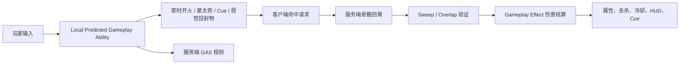
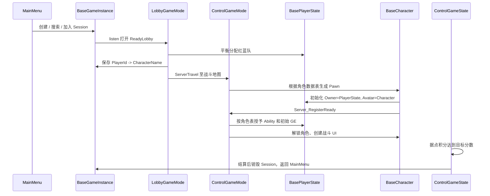
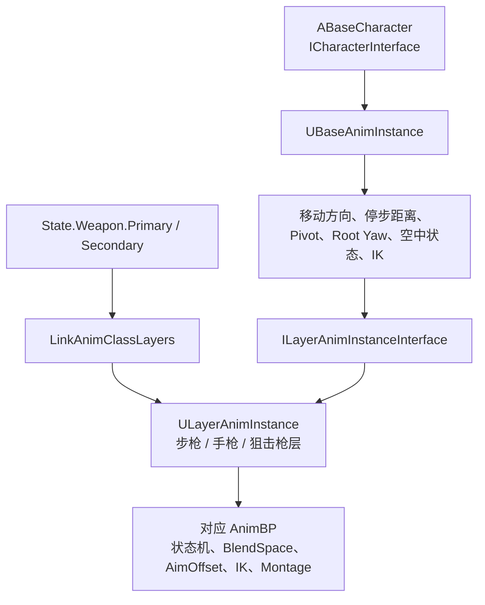
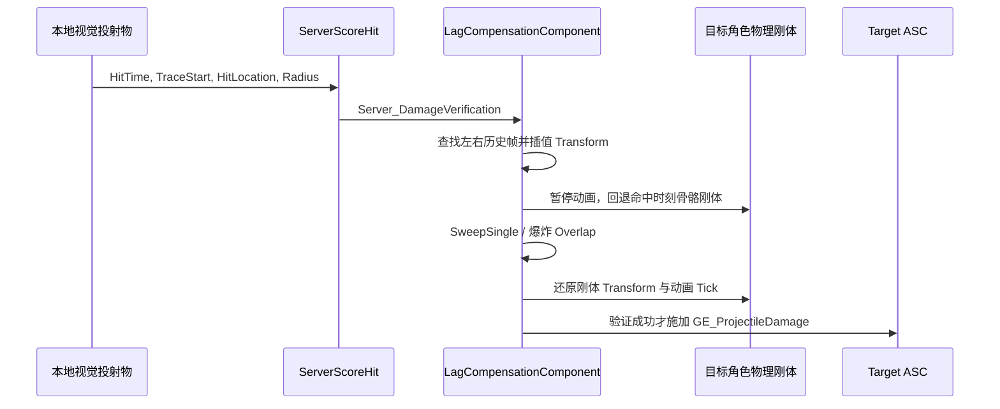
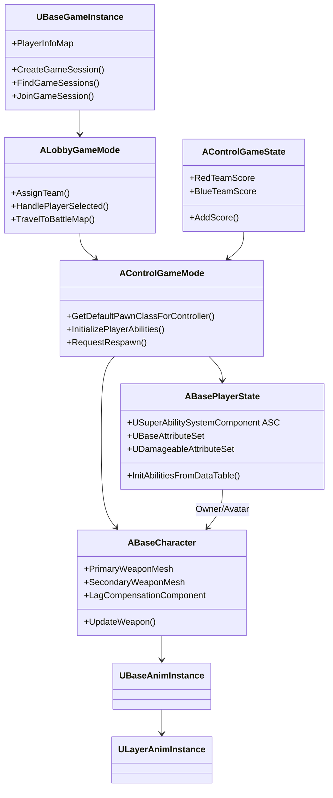
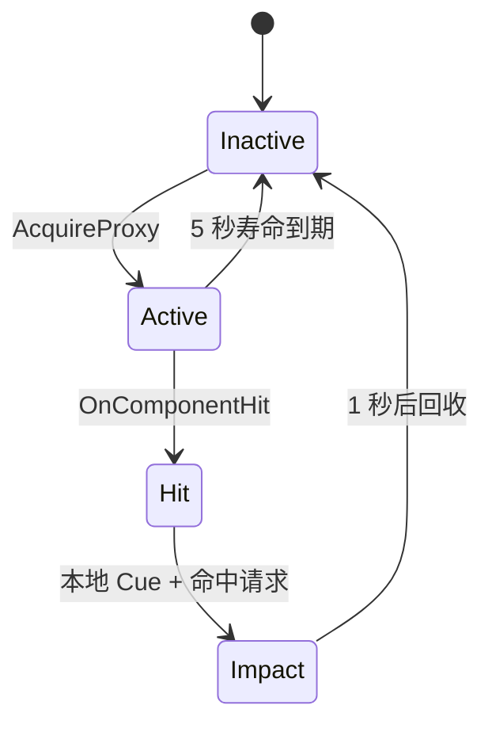
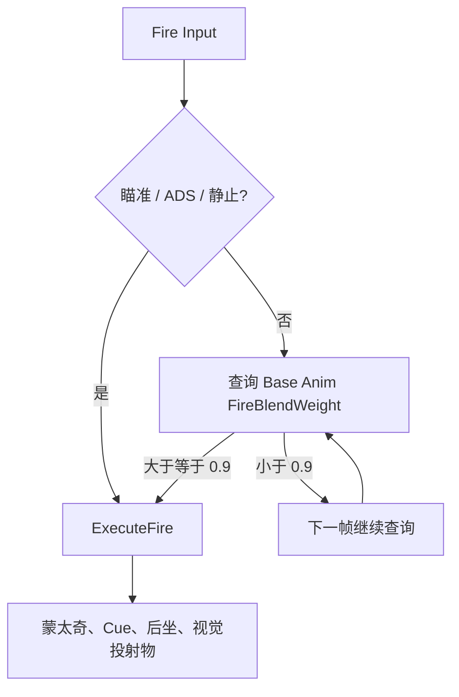

HeroShooters 是一个 UE 5.4 多人第三人称英雄射击项目。玩法以《战地》《三角洲行动》式的据点争夺为骨架：红蓝双方围绕控制点博弈，占领据点按周期得分，击杀、重生、补给与英雄技能共同改变战场节奏。当前版本围绕 Phoebe 与 FemaleRover 两名英雄展开；每名英雄配置被动、两项主动能力、一把主武器和一把副武器，覆盖步枪、手枪和狙击枪三类射击表现。

项目中的输入、技能、武器、动画、命中和积分按以下战斗闭环衔接：



主要子系统包括 GAS 规则层、Linked Anim Layer 动画层、客户端预测与服务端命中验证，以及 WorldSubsystem 视觉对象池。

## 1. 游戏流程：从会话到结算

项目将多人流程划分为 `GameInstance`、`GameMode`、`GameState`、`PlayerState`、`PlayerController` 和 `Character` 六类职责。这个分层让“跨地图持久的数据”“服务端规则”“全体同步的战局”“单个玩家数据”和“本地输入/UI”各自有稳定归属。



### 1.1 会话与大厅

`UBaseGameInstance` 封装 OnlineSubsystem 和 Steam Session 流程：创建会话时设置公开连接数、Presence、Lobby 和 `MatchType=LOBBY` 查询字段；主机创建成功后以 `listen` 打开 `ReadyLobby`，客户端搜索并解析连接字符串后执行 `ClientTravel`。

大厅阶段由 `ALobbyGameMode` 完成三件事：

1. `PostLogin` 统计已有玩家的红蓝人数，将新玩家放入人数更少的一队；
2. `ABasePlayerController` 在客户端创建角色选择 UI，并切换到大厅中的 CineCamera；
3. 客户端选择角色后，`Server_SetSelectedCharacter` 将 `PlayerId -> CharacterName` 写入 `UBaseGameInstance`。全员选择完成后，服务端 `ServerTravel` 到战斗地图。

将选角映射放在 GameInstance 的意义在于它能够穿过大厅到战斗地图的切换。战斗地图中，`AControlGameMode::GetDefaultPawnClassForController()` 查询 `DT_CharacterData`，按同名行加载指定 Pawn Class；随后又使用 `DT_CharacterAbilities` 找到同名角色的技能和初始效果。这两张表把“选中的角色是谁”“生成什么角色”“加载什么技能配置”连接成一个数据驱动链路。

### 1.2 战斗初始化、重生与结算

角色生成后不会立刻接受输入。`ABaseCharacter::BeginPlay()` 会锁定角色，并由本地玩家调用 `Server_RegisterReady()`。`AControlGameMode` 收到所有玩家的 Ready 后，统一执行 `InitializePlayerAbilities()`，再通过 `Client_UnlockCharacter()` 解锁角色并创建战斗 HUD。技能和属性在全员准备完成后才施加，使开局的角色状态、网络复制和 UI 初始化有明确的同步点。

死亡时，服务端调用角色死亡接口：角色网格进入布娃娃，必要时生成补给 Actor；5 秒后 `AControlGameMode` 选取距离敌方角色最远的出生点进行重生。因为 ASC 位于 PlayerState，重生不需要重新创建整套能力容器；`ResetOnRespawn()` 清理死亡、状态和冷却效果，重新施加该英雄的初始属性/武器效果，再激活切枪能力恢复可战斗状态。

比赛结束由 `AControlGameState` 统一判断。它复制双方分数，在到达 `TargetScore` 时通过 `AControlGameMode::HandleTeamWin()` 向所有 Controller 发送结算状态，并让 `GameInstance` 在结算 UI 展示后离开会话、回到主菜单。

## 2. GAS 是战斗规则的单一入口

### 2.1 ASC 位于 PlayerState：规则跟着玩家走，Avatar 跟着角色走

`ABasePlayerState` 创建 `USuperAbilitySystemComponent`，开启复制并设置为 `Mixed` 模式。角色类不创建第二个 ASC，而是把自身的 `GetAbilitySystemComponent()` 转发给 PlayerState。角色被服务端 Possess 或客户端收到 PlayerState 复制后，都会完成如下初始化：

```cpp
void ABaseCharacter::InitAbilityActorInfo()
{
    BasePlayerState = GetPlayerState<ABasePlayerState>();
    AbilitySystemComponent = BasePlayerState->GetAbilitySystemComponent();
    AbilitySystemComponent->InitAbilityActorInfo(BasePlayerState, this);
}
```

这段代码把 GAS 的两个身份明确分开：

| GAS ActorInfo | 当前对象 | 作用 |
| --- | --- | --- |
| `OwnerActor` | `ABasePlayerState` | 保存与玩家绑定的 Ability Spec、AttributeSet、效果和网络复制状态 |
| `AvatarActor` | `ABaseCharacter` | 当前实际存在于地图中的 Pawn，负责移动、武器、蒙太奇、命中起点和视觉表现 |

这种组织特别适合多人射击游戏的死亡和重生：PlayerState 保留玩家的长期 GAS 状态，Character 可以被重新生成、重新附身或复位。角色只是“这套能力当前附着在哪个身体上”，不是能力数据的长期主人。

### 2.2 属性层：把枪械、移动和生存数值放入效果系统

项目当前的 AttributeSet 分为三层：

| AttributeSet | 代表属性 | 在战斗中的作用 |
| --- | --- | --- |
| `UBaseAttributeSet` | 两把武器的弹匣/备用/最大弹药、射速、散布、后坐力、FOV、ADS 速度、伤害、移动参数 | 让主副武器切换、开火、换弹、镜头和移动参数都能由 GE 改写 |
| `UDamageableAttributeSet` | Health、MaxHealth、Shield、MaxShield | 承接伤害、护盾吸收、死亡和 HUD 更新 |
| `UPhoebeAttributeSet` | PassiveStacks、ProjectileExplosionDamage、ProjectileExplosionRadius | 为 Phoebe 的血账层数、爆炸投射物和技能消耗提供专属数值 |

Phoebe 的专属 AttributeSet 在 `InitAbilitiesFromDataTable("Phoebe")` 时动态创建并加入 ASC。这个处理使通用角色不必为每一位英雄都常驻一套无用属性，同时仍能让专属数值通过 GAS 被 GE、GA 与 UI 共同访问。

三个 Execution Calculation 把高频战斗数值从 Ability 流程中抽离：

- `GEEC_WeaponFire` 消耗当前武器弹药；
- `GEEC_ReloadWeapon` 把备用弹药转移至当前弹匣；
- `GEEC_DamageCal` 处理伤害结算，并由 Damageable AttributeSet 继续触发生命、护盾和死亡逻辑。

HUD 也不维护独立的弹药/血量副本。`ABaseCharacter` 直接订阅 ASC 的 Attribute change delegate，再把结果广播给 UMG。冷却 UI 则使用 `GetActiveEffectsTimeRemainingAndDuration()` 按 Cooldown Tag 查询活动 GE，得到当前剩余时间和完整持续时间。

### 2.3 DataTable 驱动能力组合

`FCharacterAbilityRow` 是每名英雄的能力装配单：一行包含 `AbilityClass + InputID` 列表和初始 Gameplay Effect 列表。服务端读取对应行后依次 `GiveAbility`、施加初始化 GE，随后激活切枪能力使角色进入有明确武器状态的战斗姿态。

```cpp
for (const auto& AbilityData : Row->Abilities)
{
    FGameplayAbilitySpec Spec(
        AbilityData.AbilityClass, 1, AbilityData.InputID, this);
    AbilitySystemComponent->GiveAbility(Spec);
}
```

因此，英雄差异主要由数据表装配，而不是通过一连串 `if (Character == X)` 写死在输入层。C++ 负责定义可复用的能力基类和网络行为，GA/GE/DataTable 决定某个英雄具体携带哪些规则和数值。

### 2.4 输入 ID、Tag、Effect、Cue 的职责边界

角色使用 Enhanced Input 获取输入，但把按键最终转换为 GAS 输入 ID。当前协议为：基础技能 `0`、开火 `1`、换弹 `2`、瞄准 `3`、大招 `4`、切枪 `5`、ADS `7`。数据表中能力的 InputID 与此协议相连，角色代码不必知道“0 号能力”实际是冲刺、投掷还是视觉领域。

Gameplay Tag、Gameplay Effect、Gameplay Cue 在项目中分别承担不同层次的含义：

| 类型 | 示例 | 含义 |
| --- | --- | --- |
| State Tag | `State.Weapon.Primary`、`State.Firing`、`State.Parkour`、`State.Dead` | 可被能力、动画、UI 与角色逻辑共同查询的战斗状态 |
| Ability / Event Tag | `Ability.General.SwitchWeapon`、`Event.Throw.Confirm` | 启动能力或在能力任务之间传递事件 |
| Cooldown Tag | `Cooldown.Ability.*` | 查询持续效果并显示冷却 |
| Gameplay Effect | `GE_Fire`、`GE_ReloadWeapon`、`GE_Riptide` | 数值、状态、成本和持续时间的规则载体 |
| Gameplay Cue | `GameplayCue.Ability.*` | 枪口火焰、音效、镜头反馈、命中粒子、冲刺拖尾等表现 |

`USuperAbilitySystemComponent` 额外提供 `ExecuteGameplayCueLocal`、`AddGameplayCueLocal` 和 `RemoveGameplayCueLocal`。它们使局部即时表现可在本地走 Cue 管线，而伤害、分数和最终状态仍由服务端规则同步。

## 3. 武器系统：以状态 Tag 为中心的双武器切换

每个基础角色拥有 `PrimaryWeaponMesh` 和 `SecondaryWeaponMesh` 两个骨骼网格组件，未装备时分别挂在 `PrimaryWeaponUnEquipSocket` 和 `SecondaryWeaponUnEquipSocket`。当前装备的武器不是角色私有的枚举，而是 ASC 中的 `State.Weapon.Primary` / `State.Weapon.Secondary` 标签。

当标签发生变化时，`ABaseCharacter::UpdateWeapon()` 执行一组同步动作：

1. 将当前网格挂到 `RightHandSocket`，另一把回到收纳 Socket；
2. 按当前武器选择 `AnimPrimaryWeapon` 或 `AnimSecondaryWeapon`，运行时链接对应 Anim Layer；
3. 将开火 Input Binding 切为 `Triggered` 或 `Started`，对应自动与半自动的射击触发方式；
4. 解除上一把武器的弹药属性委托，订阅当前武器的当前/备用弹药委托；
5. 刷新 HUD，并让开火、换弹、Cue 和蒙太奇使用同一个武器状态标签选择表现。

这段逻辑把视觉网格、输入频率、动画层和弹药 HUD 一次性绑定到 GAS 状态变化上。主/副武器状态并不是只有“手上拿什么”的装饰信息，而是整个射击子系统的状态机入口。

### 3.1 开火能力的执行路径

`UFireAbility` 的构造函数直接定义了射击手感和网络模型：

```cpp
InstancingPolicy = EGameplayAbilityInstancingPolicy::InstancedPerActor;
NetExecutionPolicy = EGameplayAbilityNetExecutionPolicy::LocalPredicted;
bServerRespectsRemoteAbilityCancellation = true;
```

`InstancedPerActor` 让每个玩家保有自己的开火能力实例，可保存本地射击间隔、活动效果句柄等运行态数据；`LocalPredicted` 让拥有者立即启动能力，不等待服务器响应。激活后能力先施加 `GE_Fire`，再根据当前状态决定何时真正发射：瞄准、ADS 或静止时立即射击；移动腰射时会等待基础动画实例计算出的 `FireBlendWeight` 达到阈值，让举枪姿态和子弹发射对齐。

开火检查从当前武器 Tag 选择弹药属性。射速由 `UBaseAttributeSet::FireRate` 决定；散布由 `ScatterSphereRadius` 决定，普通瞄准会缩小散布，ADS 则将散布置零。这样枪械平衡数据留在 Attribute/GE 层，能力流程无需硬编码每把枪的数值。

### 3.2 换弹、切枪与 ADS

`UReloadWeaponAbility` 在启动时记录 GAS Prediction Key，基于主/副武器状态挑选换弹蒙太奇和 Cue；蒙太奇结束后撤掉 Cue 并结束能力。弹药本身由 `GEEC_ReloadWeapon` 结算，保证弹匣变化仍属于 GAS 数值操作。

ADS 除了修改移动/瞄准状态，也处理第三人称到精确瞄准的视觉切换。`ABaseCharacter::SetADSState()` 会隐藏本地角色网格与准星，把武器临时挂到相机，再用武器 `PreAimSocket` 与 `AimSocket` 的相对变换插值对齐。Phoebe 在此基础上更新狙击镜动态材质的瞄准位置、视锥参数和玻璃渐隐，形成真正的镜内观察过渡。

武器与角色资产之间存在一组直接参与运行时计算的 Socket：

| 使用场景 | Socket |
| --- | --- |
| 收纳主/副武器 | `PrimaryWeaponUnEquipSocket`、`SecondaryWeaponUnEquipSocket` |
| 手持武器 | `RightHandSocket` |
| 左手 IK | 武器上的 `LeftHandSocket` |
| ADS 对齐 | 武器上的 `PreAimSocket`、`AimSocket` |
| Phoebe 瞄准镜材质定位 | `ScopeSocket`、`AimSocket` |

## 4. 动画系统：基础运动学与武器表现的分层协作

项目参考 Lyra 的动画层接口思路，把共用运动学放入基础实例，把枪械和英雄差异交给链接动画层。



### 4.1 `UBaseAnimInstance`：每帧计算通用角色状态

`UBaseAnimInstance` 不依赖 Phoebe 或 FemaleRover 的具体类型，而是通过 `ICharacterInterface` 拉取数据。它处理的内容包括：

- 水平速度、加速度、速度方向、加速度方向与转向 Lean；
- Stop State 下的预测停步距离，Pivot State 下的预测转向距离；
- Idle 时累积 Root Yaw Offset，进入移动状态后用弹簧插值回正；
- 跳跃、下落、地面距离、下落时间、瞄准 Pitch；
- 蹲伏、瞄准、死亡、开火抬枪 Blend Weight；
- 左手相对右手骨骼空间的 IK Transform，右手武器旋转和 IK 权重。

以 Left Hand IK 为例，角色从当前武器读取 `LeftHandSocket` 的世界变换，再转换到角色右手骨骼空间。这样步枪、手枪和狙击枪可以共用同一套上半身 IK 输入，而武器差异由各自的 Socket 位置提供。

开火 Blend Weight 是项目将“动画质量”与“战斗判定”接起来的代表性设计：基础实例会在腰射后把权重拉高；开火 GA 在移动腰射时等待权重达到约 `0.9` 才执行实际射击。因此玩家按下开火时先有举枪过渡，子弹、枪口火焰和持枪姿态随后在同一时刻对齐。

### 4.2 `ULayerAnimInstance`：把通用数据变成具体枪械姿态

当前武器变化时，角色调用：

```cpp
GetMesh()->LinkAnimClassLayers(AnimLayer);
LayerAnimInstance = Cast<ULayerAnimInstance>(
    GetMesh()->GetLinkedAnimLayerInstanceByClass(AnimLayer));
```

基础实例随后通过 `ILayerAnimInstanceInterface` 向这个层写入状态。Layer 持有的可读变量包括 `LocomotionSpeed`、`LocomotionAngle`、`LeanAngle`、`StopDistance`、`RootYawOffset`、`bIsCrouched`、`AOPitch`、`LeftHandTransform`、`FireBlendWeight`、`bAiming`、`bIsDead` 与右手 IK 数据。

这种划分让步枪层可以拥有更明显的持枪、后坐和左手握把姿势，狙击枪层可以有独立的瞄准偏移、开镜动作和转身表现，手枪层也能使用不同的移动 Blend Space；而所有层仍共享同一份速度、落地、停步、Root Yaw 和角色状态计算。

### 4.3 Montage、Notify、Motion Warping 与战斗动作

战斗行为不依赖纯状态机切换。射击、换弹、冲刺、投掷、施法和跑酷主要由 Gameplay Ability 通过 `AbilityTask_PlayMontageAndWait` 驱动；Anim Notify/Notify State 用于换弹分段、脚步、武器换手和投掷释放等精确时间点。

跑酷使用 `UParkourComponent` 先做前向 Sweep、墙顶高度和厚度检测，得到 `FParkourActionData`。`UParkourAbility` 将 `Start`、`End` 两个位置写入 `UMotionWarpingComponent`，再播放攀爬蒙太奇。动画 Root Motion 因而会被校正到实际墙体位置，而不是只播放一段与几何体无关的固定动画。

## 5. 客户端即时表现与服务端命中复核

这是项目联机设计中最具工程含量的一条链路。

### 5.1 为什么开火必须预测

射击游戏中，按下鼠标到看到枪口火焰、听到枪声、看见弹道之间如果要等一次网络往返，操作会明显迟滞。`UFireAbility` 使用 `LocalPredicted`，本地立即播放开火蒙太奇、Cue、后坐和视觉投射物；服务端同时按 GAS 规则确认能力、弹药成本与状态。玩家获得的是立即响应的手感，服务端仍保有规则裁决权。

`ABaseProjectile` 被明确设置为 `bReplicates = false`。它是可本地即时生成的视觉/碰撞代理，而非由网络复制位置的权威伤害 Actor。投射物命中时，本地只构造“我在这个服务端时间、从这个起点、以这个半径、命中这个目标”的验证请求；是否扣血由服务器决定。

### 5.2 命中请求包含什么

`FHitVerificationRequest` 保存以下信息：

| 字段 | 用途 |
| --- | --- |
| `TargetActor` | 客户端认为命中的角色或可伤害 Actor |
| `HitTime` | 从 GameState 取得的服务端时间轴时间 |
| `TraceStart`、`HitLocation` | 用于重建投射物经过的轨迹 |
| `ProjectileSphereRadius` | 按真实投射物半径做 Sweep，而非退化为无限细射线 |
| `AdditionalTargets`、`HitType` | 为爆炸武器提供候选受害者与命中类型 |

本地命中后经 `ICharacterInterface::ServerScoreHit()` 把请求送往角色的 `ULagCompensationComponent::Server_DamageVerification()`。对本机 Listen Server，代码直接保留完整 `HitResult`；对远端客户端，则提交可复核的轨迹和时间数据。

### 5.3 服务端骨骼回溯和插值验证

每个角色的 `ULagCompensationComponent` 在服务端以 `0.01s` 间隔保存 `BonesToRecord` 中骨骼刚体的世界 Transform，默认保留 `1s` 历史。收到请求后，流程如下：



当 `HitTime` 落在两帧之间，组件对位置使用 Lerp、旋转使用 Slerp、缩放使用 Lerp，生成目标时刻的骨骼帧。验证阶段暂停网格动画 Tick，缓存原始 Body Transform，将命中时刻 Transform 写回物理刚体后执行球形 Sweep；结束后立刻恢复刚体和动画状态。

爆炸投射物进一步对 `AdditionalTargets` 执行同一时刻回溯，并以爆炸中心和技能半径做 Overlap。最终通过 `GE_ProjectileDamage` 施加伤害，并用 `Data.Damage` SetByCaller 把本次伤害值传给效果计算。Phoebe 的爆炸投射物还从 `UPhoebeAttributeSet` 读取专属爆炸伤害和半径。

这一方案把“低延迟视觉响应”和“服务端可信结算”组合起来：客户端负责报告视觉上发生的碰撞，服务器以历史世界状态复算这次碰撞是否成立。

## 6. 视觉投射物对象池与时间追赶

高射速、技能弹道和命中特效会频繁创建短生命周期 Actor。项目通过 `UVisualProxyWorldSubsystem` 以 Actor Class 为键维护对象池，GameState 开局根据配置预热对象，运行时从空闲栈 `AcquireProxy`，生命周期结束时 `ReleaseProxy`。

投射物实现 `IPoolableInterface`。激活时：

- 重置位置、旋转、碰撞开关和忽略 Owner 列表；
- 重新启用 ProjectileMovementComponent，设置初速度和飞行速度；
- 重新激活 Niagara 轨迹；
- 重新设置寿命计时器。

回收时则关闭碰撞、停止移动、立即停用 Niagara，并隐藏 Actor。对象池不只是省去 Spawn/Destroy；它把投射物一次发射所需的碰撞、移动、粒子状态完整地初始化和回收，避免上一次生命周期残留的速度、碰撞或 Trail 泄露到下一发。

`AcquireProxy` 还接收 `ServerSpawnTime`。投射物激活时会计算当前服务端时间与出生时间的差值，并把飞行组件推进这段时间，最大追赶 `0.2s`。这解决了远端视觉投射物收到出生事件时已经“落后于真实发射时刻”的问题，使客户端弹道在网络延迟下更接近同一条服务端时间轴。

## 7. 英雄能力：共用基类上的角色差异

### 7.1 FemaleRover：位移、状态强化和击杀反馈

FemaleRover 使用步枪和手枪。她的开火能力 `UFRFireAbility` 继承通用 `UFireAbility`，只覆写根据当前 Riptide 状态和武器类型选择哪一个 Gameplay Cue，因而复用通用的预测、散布、弹药成本和投射物流程。

她的技能表现出 GAS 对复杂短时状态的处理方式：

- `UDashAbility` 施放冲刺蒙太奇、施加 `GE_Dash`，并使用 Root Motion Source 在固定时长内提供冲刺速度；
- `URiptideAbility` 施加 `GE_Riptide`，监听伤害/击杀 Gameplay Event，在满足击杀条件时扩展活动效果持续时间；
- `UEchoAbility` 继承 `UPassiveGameplayAbility`，通过被动基类统一订阅击杀事件，再执行 Echo Cue；
- `UFRUserWidget` 从 PlayerState 查询 `State.Ability.Riptide` 对应活动效果的剩余时间，显示技能持续状态。

Riptide 的实现体现了“状态不靠角色 Tick 轮询”的原则：效果存在期间由 Tag 表示状态，事件到来时由 AbilityTask 接收，击杀后直接修改活动 GE 的持续时间，Cue 和射击能力则根据同一状态 Tag 自动选择表现。

### 7.2 Phoebe：层数资源、事件驱动投掷和范围伤害

Phoebe 使用狙击枪和手枪。她的 `UPhoebeFireAbility` 根据主/副武器状态切换狙击和手枪 Cue，并对不同武器使用不同成本 GE。角色类还实现了狙击镜材质过渡、魔法书世界空间 UI 和专属爆炸附加目标伤害。

她的技能链由多个 GAS 事件组成：

- `UBloodLedgerAbility` 在伤害反馈中施加血账效果，叠层写入 `PassiveStacks`，魔法书 Widget 订阅属性变化显示层数；
- `UVisionFieldAbility` 使用血账层数作为成本，施放蒙太奇后生成 Vision Field Actor；
- `UPhoebeThrowAbility` 同时等待 `Event.Throw.Confirm`、`Event.Throw.Cancel`、`Event.Throw.Release` 和 `State.FireCat.Dead`。确认事件生成并挂接火猫，释放事件将其投入战场，取消和死亡事件统一收束这条能力链；
- `UFireCatAttackAbility` 管理目标搜索、攻击周期、伤害 Tick 与激光 Cue，并通过 GE 对目标施加周期性伤害。

`APhoebeCharacter::OnAction_Fire()` 在玩家按开火时发送 Throw Confirm Gameplay Event；服务器端也接收同样的确认 RPC，其他客户端通过 Multicast 将角色蒙太奇跳转到 Throw Section。这里展示了“输入触发 GA，GA 等待 Gameplay Event，事件再推进蒙太奇与 Actor 生命周期”的技能编排方式。

## 8. 据点模式：服务端权威战局状态与客户端表现

`AConquestCapturePoint` 是可复制的服务端权威 Actor。Box Trigger 统计红蓝角色进入/离开后的人数，`Tick` 中依据人数优势推进 `CaptureProgress`：

- 红队人数更多时进度向正方向增长；
- 蓝队人数更多时进度向负方向增长；
- 到达正/负最大值后进入红方/蓝方控制状态，启动定时计分；
- 已占领据点被反向推进越过中立线时恢复 Neutral，停止旧队伍计分。

据点进度与控制状态使用 `ReplicatedUsing` 复制，在 OnRep 中广播进度、填充色和状态色给世界空间圆形进度条。控制点因此拥有两层输出：一层是服务端可复核的战局规则，另一层是客户端 UI 的直观反馈。

`AControlGameState::AddScore()` 只在服务端修改红蓝总分，并将总分复制到客户端。它除了判断胜负，还会按领先队伍相对于目标分的进度切换 EarlyGame、MidGame、FinalStretch 三个 BGM 阶段。击杀信息则通过 `Multicast_BroadcastKillInfo()` 分发到各自本地 Controller 的击杀提示 UI，队友和敌人使用不同颜色关系显示。

## 9. 技术栈与运行时模块

项目模块 `HeroShooters` 以 Unreal Engine Runtime Module 方式加载，`HeroShooters.Build.cs` 中的依赖反映出战斗系统的运行时边界。

| 模块 | 使用位置 |
| --- | --- |
| `GameplayAbilities`、`GameplayTags`、`GameplayTasks` | ASC、AttributeSet、GA、GE、AbilityTask、Cue 和标签查询 |
| `EnhancedInput` | 角色 Input Mapping Context 与 Input Action 绑定 |
| `AnimGraphRuntime`、`AnimationLocomotionLibraryRuntime` | Base Anim Instance、Linked Layer、距离匹配与动画状态机 |
| `MotionWarping` | 攀爬等 Root Motion 动作的起止位置校正 |
| `Niagara` | 投射物轨迹、开火、命中、冲刺和技能视觉效果 |
| `NetCore`、`OnlineSubsystem`、`OnlineSubsystemSteam` | Actor/属性复制、RPC、Steam Session 与连接流程 |
| `UMG` | 主菜单、大厅、战斗 HUD、技能冷却、据点和结算 UI |
| `GeometryCollectionEngine`、`FieldSystemEngine` | 场景破碎和 Field System 表现的运行时依赖 |

项目默认运行于 DX12/SM6，启用 Lumen、Virtual Shadow Map、Mesh Distance Field、Motion Warping、Animation Locomotion Library 和 Steam OnlineSubsystem。`DefaultGame.ini` 将默认入口配置为 `/Game/_Game/Map/MainMenu`，服务端默认战斗地图为 Asian Temple；`BaseGameInstance` 被设置为全局 GameInstance 类。

### 9.1 源码目录

```text
Source/HeroShooters
├─ ASC/                 自定义 AbilitySystemComponent
├─ Abilities/           通用、Phoebe、FemaleRover 与基础能力
├─ AnimInstances/       Base Anim 与 Linked Layer 接口
├─ AnimNotifies/        换弹、脚步、投掷、手部挂接等精确事件
├─ Attributes/          通用、生命护盾、Phoebe 专属属性
├─ Characters/          基础角色、英雄角色和角色接口
├─ Components/          后坐、跑酷、延迟补偿
├─ GECalculation/       开火、换弹、伤害执行计算
├─ GameInstance/        Session、选角数据和网络失败处理
├─ GameModes/           主菜单、大厅、据点战斗规则
├─ GameState/           团队分数、比赛阶段、对象池预热
├─ GameplayCue/         射击、命中、换弹、技能和语音表现
├─ PlayerController/    本地 UI、输入模式、角色预览
├─ PlayerState/         ASC、AttributeSet、队伍和能力装配
├─ Pooling/             WorldSubsystem 对象池与可池化接口
├─ Projectiles/         通用、Phoebe、FemaleRover 投射物
├─ SceneActor/          据点、补给、死亡区、Vision Field、FireCat
└─ Widgets/             战斗 HUD、大厅、角色选择、结算与专属 UI
```

内容目录 `Content/_Game` 与源码呈对应关系：`GAS/GA`、`GAS/GE`、`GAS/GC` 和 `GAS/Tags` 组成可配置的 GAS 资产；`Characters/Base/DataTables` 保存 `DT_CharacterData` 与 `DT_CharacterAbilities`；每位英雄目录下存放角色蓝图、武器层 AnimBP、蒙太奇、IK、材质和声音资源；`GameModes`、`GameStates`、`UI`、`Scene` 保存各系统的蓝图配置和可视化资源。

### 9.2 运行时对象关系



`GameMode` 永远运行在服务端；`GameState` 向所有客户端复制战局信息；`PlayerState` 向各端复制玩家长期状态；`PlayerController` 属于服务器和拥有它的客户端；`Character` 是地图中可见且可操作的 Avatar。这个网络归属决定了 RPC、属性和 UI 的放置位置。

## 10. 角色基类与玩家控制

`ABaseCharacter` 是所有英雄的共同载体。它继承 `ACharacter` 并实现 `ICharacterInterface`，把角色当前的速度、加速度、状态、武器、命中、队伍和动作数据以接口形式提供给动画、能力和组件。

### 10.1 组件组成

构造函数创建的核心组件如下：

| 组件 | 用途 |
| --- | --- |
| `USpringArmComponent CameraBoom` | 跟随角色的第三人称镜头臂，使用 Pawn Control Rotation |
| `UCameraComponent TPSCamera` | 本地第三人称相机；ADS 时临时成为武器的父节点 |
| `USkeletalMeshComponent PrimaryWeaponMesh` | 主武器网格，受主武器 Tag 驱动挂接位置与动画层 |
| `USkeletalMeshComponent SecondaryWeaponMesh` | 副武器网格，受副武器 Tag 驱动挂接位置与动画层 |
| `URecoilComponent` | 控制器 Pitch/Yaw 后坐和回正 Timeline |
| `UParkourComponent` | 墙体检测、攀爬数据计算与缓存 |
| `UMotionWarpingComponent` | 跑酷蒙太奇的 Root Motion Warp Target |
| `ULagCompensationComponent` | 历史骨骼帧记录与服务端命中验证 |

角色的网络变量只复制必须被非拥有端动画和表现使用的数据：`AimPitch` 通过不可靠 Server RPC 从本地控制端上报，供其他客户端的 Aim Offset 使用；`ReplicateAcceleration` 由服务端写入，供非拥有端动画推导加速度方向。角色的死亡布娃娃、命中冲量使用 Reliable Multicast，使所有客户端看到相同的物理切换和受击反馈。

### 10.2 输入层到能力层

`SetupPlayerInputComponent()` 先将角色的 `DefaultMappingContext` 添加到 `UEnhancedInputLocalPlayerSubsystem`，再将 Input Action 绑定到角色函数。移动、Look、蹲伏和跳跃直接影响 `ACharacter`；开火、换弹、瞄准、ADS、切枪、基础技能和大招则只转换为 ASC 的 InputID。

```cpp
void ABaseCharacter::OnAction_Fire(const FInputActionValue& Value)
{
    if (IsDead()) return;
    AbilitySystemComponent->AbilityLocalInputPressed(1);
}
```

输入层不检查某个具体技能类，也不承担弹药、冷却或状态阻断判断。能力是否可激活由 GA 的 `CanActivateAbility`、`CheckCost`、Activation Blocked Tags 和活动 GE 共同决定。这样同一套输入能在不同英雄的数据表中绑定到不同能力。

### 10.3 镜头、瞄准和后坐

常规第三人称镜头由 Spring Arm 跟随控制器旋转。角色每帧对本地玩家更新 FOV，并维护 ADS 武器对齐的插值。`SetTargetFOV()` 由能力或属性调用，`UpdateFOV()` 用 `FInterpTo` 平滑过渡到目标 FOV。

`URecoilComponent` 以 Curve 驱动一个 Timeline。开火能力从 `UBaseAttributeSet` 读取腰射或 ADS 对应的 Pitch/Yaw 后坐参数，调用 `PlayRecoil()`；Timeline 每个 Tick 将增量写入 Controller Input，并在玩家手动移动鼠标时终止回正，避免后坐回正与玩家手部输入争夺控制权。该组件只作用在拥有该 Character 的本地 Controller 上，因此后坐不会把其他客户端的视角拉动。

### 10.4 队伍显示和轮廓

队伍信息存储在 `ABasePlayerState::Team` 并复制。非本地控制角色在 `InitByTeam()` 中读取本地 PlayerState 与目标 PlayerState 的队伍，设置绿色友方或红色敌方 `OutlineColor`，再触发蓝图事件 `OnTeamColorInitialized()`。角色蓝图负责把该颜色写入轮廓材质或 Custom Depth 表现；C++ 只决定关系和颜色来源。

当 PlayerState 尚未复制到本地端时，角色会用短 Timer 重试初始化队伍关系。这样角色可以先生成、后补齐队伍外观，不必依赖 Pawn 与 PlayerState 同一网络帧到达。

## 11. Gameplay Ability 的公共实现

### 11.1 `UCooldownGameAbility`

`UCooldownGameAbility` 是带冷却的能力基类。它保存 `CooldownDuration` 和 `CooldownTags`，通过覆写 `GetCooldownTags()` 和 `ApplyCooldown()` 生成带对应 Tag 的持续效果。UI 使用同一组 Tag 查询活动 GE 的时间，因此冷却开始、冷却剩余、技能再次可用都由效果持续时间决定。

该基类还提供本地语音播放：配置 `VoiceSounds` 后随机选择不与上一条重复的声音，并通过 Cue/本地音频路径播放。Dash、Riptide、Vision Field、FireCat Throw 等技能可以共享冷却与语音机制。

### 11.2 `UPassiveGameplayAbility`

被动能力不依赖按键。`UPassiveGameplayAbility::OnAvatarSet()` 在 Avatar 准备后注册伤害事件监听；当 `GEEC_DamageCal` 向来源 Actor 发送 `Event.DamageDealt` 时，被动能力收到包含伤害值、目标 PlayerState、击杀和爆头标记的 `FGameplayEventData`。

基类把事件拆为两个钩子：`OnKillReceived()` 处理击杀型被动，`HandleDamageFeedback()` 处理命中、伤害数字和特殊叠层。FemaleRover 的 Echo 覆写前者，Phoebe 的 Blood Ledger 覆写后者。两种英雄被动因此共享事件订阅和反馈入口。

### 11.3 Aim 与 ADS

`UAimAbility` 与 `UADSAbility` 都通过输入释放任务结束能力，并在激活/结束时应用或移除移动 GE。它们分别表示第三人称瞄准姿态和精确 ADS 姿态：前者可以降低移动速度并影响散布，后者还会让武器进入相机对齐、隐藏准星、修改 FOV 和材质参数。开火能力通过 `State.Aiming`、ADS Tag 和角色速度判断射击时序及散布半径。

### 11.4 切枪能力

`USwitchWeaponAbility` 以主、副武器状态 GE 为核心。激活时根据当前武器 Tag 移除旧装备效果并施加新装备效果；效果为 ASC 授予 `State.Weapon.Primary` 或 `State.Weapon.Secondary`。角色已经注册这些 Tag 的变化委托，因此切枪能力不需要直接访问网格、动画层或 HUD，它只改变 GAS 状态，后续模块按状态自行更新。

### 11.5 换弹的预测键和蒙太奇时序

换弹能力启动时从 `ActivationInfo` 读取 Prediction Key 并存到角色。换弹 GE 的执行计算、动画 Notify 和 Cue 可以使用同一个预测上下文处理本地先行表现与服务端确认。能力根据当前武器 Tag 选择主/副武器的 Character Montage、武器 Cue 和弹药属性；Montage Completed、Interrupted、Cancelled 都汇聚到结束函数，避免动画被打断后残留换弹 Cue 或活动能力状态。

## 12. 属性、执行计算与伤害事件

### 12.1 `UBaseAttributeSet` 的数值边界

`PreAttributeChange()` 负责在属性写入前做边界约束。当前/备用弹药不低于零，当前弹匣不超过各自最大弹匣；射速、FOV、ADS 速度、基础伤害和移动数值不允许变成负值；后坐 Pitch/Yaw 的方向也被限制在预期范围。

`PostGameplayEffectExecute()` 将部分属性同步给 CharacterMovement：`MaxWalkSpeed`、`MaxAcceleration`、`BrakingDeceleration`、`BrakingFriction` 和 `BrakingFrictionFactor` 每次被 GE 改写后立即写入移动组件。于是冲刺、瞄准、受控和其他移动效果不需要分别修改角色移动组件，GE 改变属性即可改变移动行为。

### 12.2 一次开火的弹药扣除

`GEEC_WeaponFire` 从 Target 捕获 `PrimaryWeaponAmmo` 与 `SecondaryWeaponAmmo`。执行时读取拥有该 GE 的目标 Tag：

```cpp
if (TargetTags->HasTag(StateWeaponPrimary))
    AmmoAttribute = PrimaryWeaponAmmo;
else if (TargetTags->HasTag(StateWeaponSecondary))
    AmmoAttribute = SecondaryWeaponAmmo;

OutExecutionOutput.AddOutputModifier(
    FGameplayModifierEvaluatedData(AmmoAttribute, Additive, -1.f));
```

扣除哪把枪的子弹由 `State.Weapon.*` 决定，而不是由开火能力里保存一个武器指针。属性捕获、Tag 查询和输出 Modifier 都在同一 GE 执行阶段完成，主副武器切换不会产生两套重复的扣弹代码。

### 12.3 一次换弹的弹药转移

`GEEC_ReloadWeapon` 同时捕获当前弹匣、最大弹匣和备用弹药。它先根据武器状态选择属性组，将浮点属性向下取整为弹药数量，计算：

```text
Needed     = clamp(MaxAmmo - CurrentAmmo, 0, MaxAmmo)
AmmoToLoad = min(Needed, BackupAmmo)
CurrentAmmo += AmmoToLoad
BackupAmmo  -= AmmoToLoad
```

两个输出 Modifier 在同一执行中提交，保证弹匣与备用弹药是成对变化的。换弹能力在启动前也会检查“当前未满且备用弹药大于零”，避免无效蒙太奇。

### 12.4 伤害、护盾和部位倍率

`GEEC_DamageCal` 以 `Data.Damage` SetByCaller 数值为输入。它先取得来源/目标 ASC 对应的 PlayerState 或 TeamInterface 队伍信息，若来源与目标同队则直接结束。命中 Context 中带有骨骼名时，执行计算会根据骨骼名设置倍率：头部约 `2.0`，胸部 `1.0`，其他部位 `0.8`。

伤害先从 Shield 扣除，剩余部分再扣除 Health。输出阶段分别对 `Shield` 与 `Health` 添加负值 Modifier，属性变化随后通知 HUD 和死亡逻辑。每次有效伤害还会向来源 ASC Owner 发送 `Event.DamageDealt`，事件中携带总伤害、来源/目标 PlayerState、击杀标记和爆头标记；被动能力、命中数字和击杀反馈由此进入事件链。

### 12.5 死亡状态和比分

`UDamageableAttributeSet::PostGameplayEffectExecute()` 在生命值变化后负责处理死亡入口。角色死亡接口通知 `AControlGameMode` 开始重生计时，调用 `AControlGameState` 更新击杀与团队信息，并通过 Multicast 让所有客户端进入布娃娃状态。死亡、重生、击杀事件与属性扣减没有分散在投射物、武器或 UI 中，而是从 Damage GE 的执行结果向外扩散。

## 13. 动画状态的计算过程

### 13.1 速度方向与移动方向

`UBaseAnimInstance::NativeUpdateAnimation()` 每帧从 `ICharacterInterface` 读取角色世界速度和角色旋转。水平速度投影到 XY 平面后，通过 `UKismetAnimationLibrary::CalculateDirection()` 得到相对角色朝向的角度，再经过带 Dead Zone 的 `UpdateLocomotionDirection()` 转换为 Forward、Backward、Left、Right 四个离散方向。

离散方向计算保留了上一帧方向作为输入：角色处于 Forward 时，只有角度跨过前向边界加上死区后才改变方向；处于 Left/Right/Backward 时也使用各自的保留区间。这样角色在临界角度附近移动时，AnimBP 不会在相邻方向间高频跳变。

加速度方向独立于速度方向。速度表达“角色正在朝哪里移动”，加速度表达“玩家正在向哪里施加输入”，二者相反时可能意味着急停或 Pivot。基础实例计算二维速度和二维加速度的点积，小于约 `-0.9` 时标记为 Pivot 条件；Layer 可以据此进入专用 Pivot 动画。

### 13.2 Stop Distance 与 Pivot Distance

基础实例会读取自身 AnimBP 中名为 `BaseSM` 的状态机，只有在当前状态为 `Stop` 时才计算预测停步距离。角色接口调用 Animation Locomotion Library 的预测函数，使用当前速度、最大减速度、摩擦等移动参数估算停止前的位移。

停步距离被传给 Layer 的 `StopDistance`，同时传递 `bShouldDistanceMatchStop`。当角色仍有水平速度且加速度归零时，该开关为真，Layer 可将停步动画按距离匹配到实际停止位置。这样停步脚步不会总以固定节奏滑过地面。

在 `Pivot` 状态中，基础实例同样传递 `PivotDistance`。Pivot 动画层能够按角色当前冲量和反向输入的距离选择更合适的转身过渡，而不是简单切换一段固定时长动画。

### 13.3 Root Yaw Offset 与原地转向

`RootYawOffset` 用来描述“动画骨盆朝向”与“角色 Actor 朝向”的差。角色停在 Idle 时，基础实例使用本帧/上一帧 Actor Yaw 的差值持续累积 Offset；从 Idle 离开后，使用 `FloatSpringInterp` 将 Offset 平滑弹回零。

如果 Idle 动画包含 `TurnYawWeight` 和 `RemainingTurnYaw` 曲线，`ProcessTurnYawCurve()` 会读取曲线，扣除动画自身已经完成的转身量，避免 Actor Rotation 与动画 Root Motion 重复旋转。最终 Offset 再根据站立或蹲伏配置的角度区间 Clamp，作为 Layer 的 `RootYawOffset` 输入。Layer 的 Turn In Place 或 Aim Offset 图可以直接使用该变量驱动上半身和下半身的相对转向。

### 13.4 空中状态和落地参数

基础实例从 MovementComponent 读取是否离地、竖直速度和重力参数：

- 离地且 Z 速度大于零时为 Jumping，并用 `-VelocityZ / (GravityScale * GravityZ)` 估算到达最高点的剩余时间；
- 离地且 Z 速度小于零时为 Falling，累计 `FallingTime`，并从角色接口查询脚底到地面的距离；
- 落地时清零 GroundDistance 与 FallingTime。

Layer 接收 `bIsOnAir`、`FallingTime` 和 `GroundDistance`，可在 AnimGraph 中选择起跳、滞空、下落和落地状态，也可以按下落距离选择不同的落地动作。`LandAnimNotify` 则在落地动作的精确帧触发后续效果。

### 13.5 开火抬枪权重

基础实例通过 `State.Firing` 判断是否处于射击状态：射击状态存在时将 `RaiseWeaponAfterFiringTime` 归零；不射击后该计时器逐渐递增。`UpdateFireBlendWeight()` 再结合蹲伏、瞄准和空中状态计算上半身举枪混合权重：

- 站立瞄准且未离地时，Layer 可以直接维持瞄准姿态；
- 腰射后的短时间内，权重快速插值到 `1.0`；
- 蹲伏或空中瞄准时保持较高权重；
- 其余状态逐步回落。

开火 GA 在移动腰射时会等待这个权重足够高才调用 `ExecuteFire()`。因此这一变量同时参与 AnimGraph 混合和能力执行时机，是动画层与枪械逻辑之间的共享同步信号。

### 13.6 Layer 的数据写入顺序

`UpdateLayerAnimInstance()` 在基础实例计算完成后执行。写入顺序并非随意：先设置蹲伏、速度方向、速度、角度和 Lean；再写入 Stop/Pivot 相关数据；随后写入 Root Yaw、空中状态、AO Pitch 和 IK；最后写入射击、瞄准、死亡和右手 IK 数据。Layer 的变量在本帧 AnimGraph 求值前已经具备完整角色状态。

Layer 本身的 `NativeUpdateAnimation()` 只额外计算 `bCrouchStateChanged`，用于在蹲伏状态切换的单帧触发图表逻辑。其余变量都来自基础实例，因此步枪、手枪、狙击枪的 Layer 不需要复制角色移动逻辑。

## 14. 网络复制与 RPC 分布

### 14.1 复制对象

| 对象/字段 | 复制方式 | 使用端 |
| --- | --- | --- |
| `USuperAbilitySystemComponent` 与 AttributeSet | GAS Mixed Replication | 服务端、拥有者、模拟代理 |
| `ABasePlayerState::Team` | `ReplicatedUsing=OnRep_Team` | 全部客户端，用于队伍轮廓和据点判断 |
| `ABaseCharacter::AimPitch` | `DOREPLIFETIME` | 非拥有端 Aim Offset |
| `ABaseCharacter::ReplicateAcceleration` | `DOREPLIFETIME` | 非拥有端移动动画 |
| `AControlGameState::RedTeamScore/BlueTeamScore` | `ReplicatedUsing=OnRep_TeamScore` | 比分 UI 和 BGM 阶段 |
| `AConquestCapturePoint::CaptureProgress/CaptureState` | `ReplicatedUsing` | 世界空间据点 UI |
| `AFireCatActor::TargetActor` | `DOREPLIFETIME` | 火猫朝向和攻击表现 |

属性和 Gameplay Tag 的复制由 ASC 负责，角色只复制不能从 GAS 自然取得、但动画/表现需要的轻量状态。这样的划分避免把同一个概念既作为 Tag 又作为独立变量重复复制。

### 14.2 服务端 RPC

| RPC | 发起端 | 服务端处理 |
| --- | --- | --- |
| `Server_SetSelectedCharacter` | 大厅客户端 | 保存选角并通知 LobbyGameMode 计数 |
| `Server_RegisterReady` | 战斗客户端 | ControlGameMode 统计所有角色准备状态 |
| `Server_SetAimPitch` | 本地角色 | 更新供远端动画使用的 AimPitch |
| `ServerScoreHit` / `Server_DamageVerification` | 本地投射物命中 | 回溯目标骨骼并验证伤害 |
| `Server_SendThrowConfirm` | Phoebe 客户端 | 将投掷确认事件送入服务端 GAS |

Aim Pitch 使用 Unreliable RPC，因为它是高频连续表现数据，下一帧的新角度可以覆盖丢失的一帧；角色选择、准备、伤害验证和投掷确认则使用 Reliable RPC，因为它们改变离散游戏状态。

### 14.3 Multicast 与 Client RPC

`Multicast_EnableRagdoll`、`Multicast_AddHitImpulse`、`Multicast_ThrowConfirm` 和 `AControlGameState::Multicast_BroadcastKillInfo` 将必须被多个客户端观察到的表现从服务端广播出去。布娃娃和命中冲量影响所有人看到的角色状态；投掷确认让其他客户端跳转到相应蒙太奇 Section；击杀信息由各客户端的本地 Controller 写入自己的 HUD。

`ABasePlayerController` 的 Client RPC 则服务于拥有者 UI：大厅创建/更新选角 UI、切换输入模式、初始化战斗 UI、显示命中反馈、播放阶段 BGM、解锁角色和展示结算画面。UI 不参与权威规则计算，服务端只把必要的结果通知到拥有者。

### 14.4 网络失败路径

`UBaseGameInstance::Init()` 注册 `GEngine->OnNetworkFailure()`。连接失败时，`OnNetWorkFailure()` 显示错误信息并调用 `LeaveSessionAndReturnToMainMenu()`；该函数清理 Session delegate、搜索结果、角色选择缓存和最大玩家数，然后返回主菜单。这条路径使会话状态机在异常断开时回到与初始入口一致的状态。

## 15. 投射物、命中与 Cue

### 15.1 通用投射物生命周期

`ABaseProjectile` 的构造函数创建球形碰撞、静态网格和 `UProjectileMovementComponent`。初始状态关闭碰撞、关闭移动模拟、隐藏在对象池中；激活后 `OnActivateFromPool()` 恢复这些状态。



命中时先关闭碰撞，避免同一投射物连续上报多个目标；再由本地拥有角色收集命中信息并上报服务端；随后以物理材质 Surface Type 选择默认、玻璃或玩家 Impact Cue。视觉网格被隐藏，运动组件停止，Trail 延迟回收。投射物在对象池中重新激活时会恢复碰撞过滤、Owner Ignore、速度、Niagara 轨迹和生命周期计时器。

### 15.2 命中 Cue 的材质分流

`GetImpactCueTag()` 读取 `Hit.PhysMaterial`：`SurfaceType1` 对应 Glass，`SurfaceType2` 对应 Player，其余使用 Default Cue。Cue 参数中填入 ImpactPoint、ImpactNormal 与来源 ASC 的 EffectContext。对应的 C++ Gameplay Cue 类再生成粒子、声音、贴花或 UI 反馈。

这种分流让同一把武器的命中在玻璃、角色和普通世界表面呈现不同反馈，同时不需要在投射物蓝图中维护多套分支。新增物理材质时，只需配置 Surface Type 和目标 Cue Tag。

### 15.3 Phoebe 爆炸投射物

`APhoebeProjectile` 覆写通用投射物的目标收集逻辑。直接命中目标写入 `TargetActor`；爆炸时以 ImpactPoint 为中心收集范围内的候选角色，写入 `AdditionalTargets` 并标记 `HitType=Explosive`。服务端不会直接相信这个候选列表，而是在回溯后重新执行爆炸 Overlap。

Phoebe 角色覆写 `ServerScoreHit()`，在通用直接伤害验证外，读取 `UPhoebeAttributeSet` 的爆炸伤害，将经过验证的附加目标逐一交给延迟补偿组件施加伤害。直接命中、范围目标、爆炸半径和爆炸伤害都沿着 GAS 属性与服务端验证流程结算。

## 16. 场景战斗 Actor

### 16.1 `ASupplyActor`

角色死亡时可在死亡位置生成 Supply Actor。补给物继承可战斗 Actor，并通过自身 ASC/Gameplay Effect 向交互角色提供恢复或资源效果。补给表现使用 `GC_Supply`，其实际数值与持续规则由 `GE_Supply` 配置。把死亡掉落实现为独立 Actor，使补给可以拥有碰撞、可见物、Cue 和单独的生命周期，而不污染角色死亡流程。

### 16.2 `AVisionFieldActor`

Vision Field 是 Phoebe 的可部署区域。Actor 本身包含 AbilitySystemComponent、命中盒、范围 Capsule 和权杖网格。服务端在 BeginPlay 打开范围 Capsule 的 Pawn Overlap；敌方角色进入时，为目标 ASC 施加 `VisionEffect` 并记录 `FActiveGameplayEffectHandle`；离开时按 Handle 移除该效果。

该 Actor 还保存拥有者队伍，并通过 TeamInterface 判断进入者是否同队。视觉轮廓使用同一套红绿队伍颜色逻辑。Vision Field 死亡或销毁时会清理区域与效果，角色端监听 `State.Ability.VisionField` 来控制法杖/相关表现的可见性。

### 16.3 `AFireCatActor`

FireCat 是具备独立 ASC、可复制移动和目标复制的技能召唤物。生成后由拥有者 Phoebe 的队伍初始化外观；服务端施加自身初始效果并授予 `FireCatAttackAbility`。投掷时，角色将它从手部 Detach，按角色 Yaw 与 Aim Pitch 计算抛物线发射速度，再叠加拥有者当前移动速度。

碰撞反弹阶段会按 `BounceVelocityDamping` 衰减速度；落地且速度低于阈值或 Projectile Movement Stop 后，火猫停止移动，等待短暂延迟再上升到攻击高度。上升完成后打开 AttackArea 的 Pawn Overlap，并开始生命周期 Timer。Tick 中服务器尝试激活攻击能力，处于 `State.Ability.FireCatFiring` 时朝 `TargetActor` 转向。

攻击对象从 AttackArea Overlap 列表中过滤：排除同队和已死亡角色，按距离排序，再使用左右眼 Socket 对目标上半身做视线检测。攻击能力据此锁定可见目标，周期施加伤害并触发激光 Cue。寿命结束时，火猫向拥有者 ASC 添加 `State.FireCat.Dead`，Phoebe 的投掷能力监听该 Tag 后结束自身状态。

### 16.4 `ADeathZone`

死亡区只在服务端开启 Pawn Overlap。角色进入后调用 `ABaseCharacter::FallKill()`，后者转发到 PlayerState 施加 `GE_FallKill`。坠落死亡因此复用 Attribute/死亡状态流程，而不是在死亡区里直接 Destroy Pawn。

## 17. UI、Gameplay Cue 与本地表现

### 17.1 UI 的层次

项目 UI 按地图和使用者拆分：

| UI | 创建位置 | 显示内容 |
| --- | --- | --- |
| `UMainMenuUserWidget` | MainMenu GameMode/Controller | 创建或搜索 Session、加入失败反馈、玩家数设置 |
| `USelectCharacterUserWidget` | Lobby Controller Client RPC | 角色预览、角色按钮、房间人数、准备状态 |
| `UBaseUserWidget` | Character 解锁后的本地 Controller | 血量、护盾、主副弹药、准星、技能冷却、据点/比分、击杀信息 |
| `UFRUserWidget` | FemaleRover 本地 Controller | Riptide 持续状态 |
| `UMagicBookWidget` | Phoebe 角色的世界空间 WidgetComponent | Blood Ledger 被动层数 |
| `UEndGameWidget` | 角色准备与比赛结算 | 倒计时、胜负状态、返回大厅前的画面 |

`ABasePlayerController` 是本地 UI 调度中心。它持有各类 Widget 实例，并由 Client RPC 在正确的地图阶段创建/移除。战斗 UI 的高频数据不从 Tick 直接读取 Character 成员：角色 Attribute 委托负责血量、护盾和弹药推送；Controller 使用短周期 Timer 查询 Cooldown GE、Riptide GE 等持续效果数据。

### 17.2 HUD 数据推送

角色的 `InitASC()` 会注册下列委托：

```text
DamageableAttributeSet.Health             -> OnHealthUpdated
DamageableAttributeSet.Shield             -> OnShieldUpdated
当前武器 Ammo                            -> OnCurrentAmmoUpdated
当前武器 BackupAmmo                      -> OnBackupAmmoUpdated
State.Weapon.Primary / Secondary          -> UpdateWeapon
```

主副武器切换时，旧弹药 Attribute Delegate 的 `FDelegateHandle` 被移除，再绑定新武器的弹药属性。UI 不需要判断“当前拿的是哪把枪”；它只接收当前绑定的弹匣与备用弹药事件。`RefreshUI()` 在 ASC 和角色重连后按当前武器 Tag 重建这一状态，并立即广播一次初始弹药。

击中角色时，伤害结算路径可向来源 Controller 发送 `Client_HitCharacterUI`。`UBaseUserWidget` 根据 `bKill` 显示普通/击杀命中图标，并显示此次伤害数值。击杀列表则由 `AControlGameState::Multicast_BroadcastKillInfo` 进入每个本地 Controller，Controller 用自己的 Team 与攻击者/受害者 Team 比较，决定每条信息在本地 UI 中呈现为敌人还是友军关系。

### 17.3 Gameplay Cue 分类

`Content/_Game/GAS/GC` 与 `Source/HeroShooters/GameplayCue` 共同组织表现事件。

| 类别 | 代表 Cue | 触发位置 |
| --- | --- | --- |
| 开火 | Rifle、Pistol、SniperRifle、Riptide Rifle/Pistol Fire | `UFireAbility` 选择当前武器/状态 Cue |
| 换弹 | Pistol、Rifle、SniperRifle Reload | 换弹能力启动与 Montage 生命周期 |
| 投射物命中 | Default、Glass、Player、Riptide、Sniper | `ABaseProjectile::PlayImpactCue()` 按物理材质分流 |
| 英雄技能 | Dash Trail、Echo、Riptide、FireCat Laser | 相应能力、Actor 或状态效果 |
| 场景交互 | Supply | 补给 Actor 与恢复效果 |
| 声音 | PlayVoice2D | 冷却能力/英雄能力的本地语音 |

Cue 参数包含 Location、Normal、EffectContext 等战斗上下文。命中 Cue 只需要关心表面位置和方向，不承担伤害判断；开火 Cue 只需要关心武器表现，不负责扣弹。这种分离使一个 GA 能替换表现资产而不改变数值流程。

### 17.4 2D 音频和比赛阶段音乐

Controller 中的 `Local_PlayPhaseBGM()` 维护 `CurrentBGM` 和 `NextBGM` 两个 `UAudioComponent`。当比分阶段发生变化时，Next BGM 以 FadeIn 启动，Current BGM 以 FadeOut 结束，再交换两个指针。两个组件同时存在使跨阶段音乐不是硬切换，并避免每次分数变化都重新创建 AudioComponent。

`AControlGameState::CheckAndPlayPhaseBGM()` 以双方较高分数除以 `TargetScore` 计算比赛进度：低于 `25%` 为 EarlyGame，达到 `25%` 为 MidGame，达到 `80%` 为 FinalStretch。只要阶段大于客户端记录的 `LocalCurrentPhase` 才播放新音乐，因此比分复制的重复 OnRep 不会重复触发同一阶段的切换。

## 18. DataTable、标签表和蓝图资产

### 18.1 角色数据表

`DT_CharacterData` 的行结构由 `FCharacterData` 表示，核心字段为角色 Pawn Class。Lobby 保存的字符串角色名被转换为 Row Name；ControlGameMode 使用该行同步加载 Pawn Class。角色蓝图负责把通用 C++ 的可编辑属性绑定到具体资源：输入 Mapping、主副武器网格、武器 Tag、Anim Layer 类、武器 Socket、Avatar、技能图标、蒙太奇和音效。

`DT_CharacterAbilities` 的每一行由 `FCharacterAbilityRow` 表示：

```cpp
struct FCharacterAbilityData
{
    TSubclassOf<UGameplayAbility> AbilityClass;
    int32 InputID;
};

struct FCharacterAbilityRow : FTableRowBase
{
    TArray<FCharacterAbilityData> Abilities;
    TArray<TSubclassOf<UGameplayEffect>> Effects;
};
```

同一行内的 Effects 通常包括英雄初始属性、主/副武器数据、移动参数和默认状态。切枪能力激活后，装备 GE 进一步授予当前武器 Tag。于是“初始数值”“当前装备状态”“能力 Spec”分别处于不同类型的 GAS 数据中。

### 18.2 标签表

`DefaultGameplayTags.ini` 注册多个 DataTable：

```text
AbilityTags      能力标识与激活查询
CooldownTags     持续冷却效果
StateTags        武器、死亡、瞄准、跑酷、技能状态
GameplayCueTags  表现事件
DataTags         SetByCaller 数值，如 Data.Damage
EventTags        AbilityTask 等待和被动能力接收的事件
EffectTags       Gameplay Effect 的归类标签
```

Tag 的命名体现层次关系。例如 `State.Weapon.Primary` 表示装备状态，`State.Ability.Riptide` 表示临时英雄状态，`Cooldown.Ability.Basic` 表示冷却归属，`GameplayCue.Ability.RifleFire` 表示表现资源入口。Tag 容器支持父子层级匹配，因此能力可以用一个宽泛状态阻断一组动作，也可以用精确 Tag 判断单个武器/技能状态。

### 18.3 GA、GE、GC 资产分工

GA 资产配置能力类、Montage、Cooldown、Blocked Tag、所需 Effect 与 Cue Tag；GE 资产配置 Modifier、Granted Tag、持续方式、Execution Calculation 和 Stack 规则；GC 资产配置粒子、声音、贴花、镜头和 UI 表现。C++ 通过 `UPROPERTY(EditDefaultsOnly)` 暴露这些引用，蓝图/资产编辑器决定具体资源和数值。

以 Phoebe Vision Field 为例：GA 保存 Cast Montage、VisionField Actor Class、Cost Stack 与 Blood Ledger Tag；GE 提供 Vision Through 状态；Scene Actor 在进入/离开区域时将 GE 施加/移除到敌方 ASC；角色监听 Vision Field Tag 控制法杖可见性；GC/材质负责区域视觉。一个技能被拆成 Ability、Effect、Actor、Tag、角色表现和 UI 六个层次。

## 19. Lobby、控制器和角色预览

### 19.1 大厅中的角色预览

`ABasePlayerController::PreviewCharacter()` 从 `CharacterClassMap` 按角色名取出预览 Actor Class。若当前已有预览 Actor，先销毁旧 Actor；再以 `PreviewTransform` 在大厅场景生成新 Actor。预览 Actor 的 Owner 设置为当前 Controller，因此大厅 UI 不需要直接持有角色网格或材质引用。

角色选择 Widget 通过按钮触发预览和 `Server_SetSelectedCharacter`。服务端会基于 PlayerState 的 UniqueId 生成稳定 PlayerId；离线/无有效 UniqueId 时回退到 PlayerName。Lobby 退出时 `CharacterLogOut()` 从 GameInstance 的 PlayerInfoMap 移除记录，并相应降低可等待玩家数。

### 19.2 输入模式切换

大厅中 `Client_SetUIInputMode()` 设置 `FInputModeUIOnly`、显示鼠标并允许 UI 交互。战斗切图后，`AControlGameMode::PostSeamlessTravel()` 对各 Controller 调用 `Client_SetCombatInputMode()`，切换为 `FInputModeGameOnly` 并隐藏鼠标。角色在 BeginPlay 初期被锁定，即使输入模式已经进入 GameOnly，也要等待服务端的 Ready Barrier 后才真正接受角色输入。

### 19.3 角色死亡、准备和结算 UI

角色生成时本地 Controller 创建 EndGameWidget 的 Prepare State；全员就绪并解锁角色后，该 Widget 被移除。比赛结束后，Controller 先遍历当前世界中属于本地世界的 UUserWidget 并移除，再创建新的 EndGameWidget，按本地 PlayerState Team 与服务端给出的 WinTeam 显示胜负。随后 GameInstance 用 Timer 调用离开会话流程。

这组 UI 状态与 GameMode/GameState 的权威阶段对应：大厅 UI 由 LobbyGameMode 驱动，准备 UI 由 ControlGameMode Ready Barrier 驱动，战斗 UI 由角色解锁驱动，结算 UI 由 ControlGameMode 胜负驱动。

## 20. 跑酷、碰撞和角色移动

### 20.1 墙体检测

`UParkourComponent::ForwardTrace()` 只在角色处于地面移动状态时执行，从角色脚部略上方沿 Actor Forward 发射半径约 `15` 的球形 Sweep，使用独立的 `ECC_GameTraceChannel3`。命中角色则直接视为普通跳跃，命中环境后进入墙体分析。

`VerticalTrace()` 从墙体接触点沿法线偏移后自下向上或自上向下做垂直 Sweep。`CalWallHeight()` 得到墙顶相对角色脚底的高度，`CalWallThickness()` 得到墙顶背侧/结束位置。当前规则中，低于约 `150` 的墙体保持普通 Jump，`150` 到 `250` 之间选择 Climb，并写入攀爬蒙太奇和起止偏移。

`TryGetParkourActionData()` 以 `GFrameCounter` 缓存同一帧查询结果。动画、能力或输入在同一帧重复请求跑酷数据时，组件不会重复执行多次 Sweep。

### 20.2 Motion Warping 目标

`UParkourAbility` 读取 `FParkourActionData` 后，先计算：

```text
StartLoc = WallTopLocation + Up * StartUpOffset + WallForward * StartForwardOffset
EndLoc   = WallEndLocation + Up * EndUpOffset + WallForward * EndForwardOffset
```

随后写入名为 `Start`、`End` 的 Warp Target，设置 Parkour State 并播放攀爬蒙太奇。蒙太奇结束、打断或取消时，能力清除两个 Warp Target 并解除 Parkour State。角色 Tick 检测到 `State.Parkour` 时，会将控制器 Yaw 约束到角色当前 Yaw，使攀爬期间镜头与 Root Motion 保持一致。

### 20.3 角色碰撞与布娃娃

正常状态下角色使用 Capsule 的 QueryAndPhysics 碰撞，武器和视觉组件按各自通道配置。死亡时 `Multicast_EnableRagdoll(true)` 对网格所有 Body 开启物理模拟，启用 Blend Physics，并关闭 Capsule 碰撞；重生时关闭网格全体物理，重新附回 Capsule，恢复网格相对位置/旋转与 Capsule 碰撞。FemaleRover 重生后还保留胸部骨骼物理模拟，专属角色函数可按节流时间向这些骨骼施加冲量。

命中冲量由 `Multicast_AddHitImpulse()` 在所有客户端对 Skeletal Mesh 的命中位置施加，使角色布娃娃的受击方向与服务端确认的射击方向一致。

## 21. 文件级实现索引

| 文件 | 主要内容 |
| --- | --- |
| `Characters/BaseCharacter.{h,cpp}` | 输入、镜头、武器挂接、ASC 初始化、动画层链接、队伍轮廓、ADS、死亡与角色接口 |
| `PlayerState/BasePlayerState.{h,cpp}` | ASC 与 AttributeSet、队伍、DataTable 技能装配、冷却查询、重生复位 |
| `Abilities/FireAbility.cpp` | Local Predicted 射击、散布、弹药成本、Montage/Cue、投射物获取 |
| `Abilities/ReloadWeaponAbility.cpp` | 换弹预测、武器分支、Montage 和 Cue 生命周期 |
| `Abilities/SwitchWeaponAbility.cpp` | 装备 GE 与主副武器状态切换 |
| `Abilities/ParkourAbility.cpp` | 攀爬数据、Warp Target、Montage 生命周期 |
| `AnimInstances/BaseAnimInstance.cpp` | 速度方向、Stop/Pivot、Root Yaw、空中状态、IK、Layer 转发 |
| `AnimInstances/LayerAnimInstance.{h,cpp}` | Anim Layer 可读变量和接口写入实现 |
| `Components/LagCompensationComponent.cpp` | 历史骨骼帧、插值、回退、Sweep/Overlap、伤害效果施加 |
| `Projectiles/BaseProjectile.cpp` | 本地视觉投射物、命中请求、Impact Cue、对象池激活/回收 |
| `Pooling/VisualProxyWorldSubsystem.cpp` | 按 Actor Class 预热、获取、归还视觉代理 |
| `GameModes/LobbyGameMode.cpp` | 分队、选角、房间人数、战斗地图切换 |
| `GameModes/ControlGameMode.cpp` | Pawn Class 选择、准备屏障、技能初始化、出生点选择、结算 |
| `GameState/ControlGameState.cpp` | 比分复制、胜负、阶段 BGM、击杀广播、对象池预热 |
| `SceneActor/AConquestCapturePoint.cpp` | 据点人数统计、进度、计分和世界空间 UI |
| `SceneActor/FireCatActor.cpp` | 召唤物投掷、反弹、升空、目标选择、攻击与死亡 Tag |

## 22. 从按下开火到生命值变化的完整调用链

本节按一次远端客户端开火的时间顺序展开。该路径同时经过 Enhanced Input、GAS、本地动画与视觉、投射物、RPC、服务端回溯、Gameplay Effect 和 UI。

### 22.1 输入帧

本地玩家按下 Fire Input Action。自动武器在 `Triggered` 阶段连续调用，半自动武器在 `Started` 阶段只调用一次；这个差异由 `UpdateWeapon()` 在主副武器 Tag 改变时重绑，而不是由 Input Action 自身携带枪械类型。

`OnAction_Fire()` 先检查 `bDead`，取得 PlayerState 上的 ASC 后调用：

```cpp
AbilitySystemComponent->AbilityLocalInputPressed(1);
```

ASC 遍历已经由 CharacterAbilities DataTable 授予、且 InputID 为 `1` 的 Ability Spec。对于 FemaleRover，Spec 指向 `UFRFireAbility`；对于 Phoebe，Spec 指向 `UPhoebeFireAbility`。二者继承 `UFireAbility`，因此进入同一套激活、预测与结算框架。

### 22.2 Ability 可激活检查

GAS 先执行父类 Activation Tag 检查，再进入 `UFireAbility::CanActivateAbility()`。该函数从当前 ASC 的 `UBaseAttributeSet` 读取 `FireRate`，并用 `LastLocalFireTime` 限制最小开火间隔；再依据 `State.Weapon.Secondary` 或主武器状态选择待检查的当前弹匣。弹药小于等于零时 `CheckCost()` 返回 false，GA 不会生成投射物或播放射击表现。

Ability 被配置为 `LocalPredicted`，所以拥有端会立即进入 `ActivateAbility()`。服务端接收到预测激活后，也会在自己的 GAS 上处理同一 Ability。预测键使本地先行的效果、Cue 和服务端确认属于同一笔 Ability 激活上下文。

### 22.3 开火姿态同步

激活函数首先施加 `GE_Fire`。这个效果通常授予 `State.Firing`，基础动画实例下一帧读到该 Tag 后将开火抬枪时间清零。若角色处于 `State.Aiming`、ADS，或者水平速度接近零，Ability 直接进入 `ExecuteFire()`；否则它在下一 Tick 再查询 `ICharacterInterface::GetFireBlendWeight()`。

该等待流程可描述为：



基础动画层和开火 GA 使用同一个 FireBlendWeight，因此腰射跑动时的姿态过渡、枪口火焰、弹道起点和实际命中请求不会在不同帧发生明显错位。

### 22.4 弹道参数与开火表现

`ExecuteFire()` 调用 `CommitAbility()`；提交成功后，从当前武器网格的 `Muzzle` Socket 读取起点，从 `UBaseAttributeSet` 读取散布球半径。普通瞄准将散布半径减半，ADS 将半径设为零。能力使用随机流在指定散布范围内得到射击方向，随后生成或从对象池取得对应的视觉投射物。

此阶段还会完成：

- 根据主/副武器 Tag 播放角色开火 Montage；
- 调用英雄覆写的 `GetFireCueTag()`。FemaleRover 在 Riptide 状态下选择 Riptide Rifle/Pistol Cue，Phoebe 在主武器状态下选择 Sniper Cue；
- 施加主或副武器成本 GE，由 `GEEC_WeaponFire` 扣除一发弹药；
- 读取 ADS/腰射后坐属性，调用本地 RecoilComponent；
- 将本地开火时间写入 `LastLocalFireTime`。

角色和武器动画通过 Montage 表现扳机、枪机、肩部动作；Cue 生成枪口火焰、声音和局部特效；RecoilComponent 修改拥有者 Controller 的视角；视觉投射物使用 ProjectileMovement 飞行。它们都发生在本地预测阶段。

### 22.5 本地投射物命中

投射物碰撞到世界或角色时，`OnProjectileHit()` 立即关闭 CollisionComponent，防止同一发投射物在接触表面后继续触发。若拥有者不是本地控制角色，则该投射物只完成自己的视觉反馈；只有本地控制角色拥有的投射物会调用 `SendHitVerificationRequest()`。

请求构造中，普通投射物只把直接命中的 Character 或实现 `IAbilitySystemInterface` 的可伤害 Actor 写入 `TargetActor`。命中静态世界时会播放 Impact Cue，但不会发送伤害请求。Phoebe 投射物在爆炸类型下额外收集爆炸范围候选目标。

远端客户端填写：

```text
HitLocation              = 本地碰撞 ImpactPoint
HitTime                  = GameState ServerWorldTimeSeconds
TraceStart               = 投射物激活时的 InitLocation
ProjectileSphereRadius   = CollisionComponent 实际缩放后的球半径
```

这些字段足以让服务端在自己的历史世界中重新做一次“从哪里飞到哪里、用多大半径、命中谁”的查询。

### 22.6 服务端回溯

`ABaseCharacter::ServerScoreHit()` 在远端请求下将数据转发给拥有者的 LagCompensationComponent。组件先判断目标类别：Character 走骨骼回溯直击验证；其他实现 AbilitySystemInterface 的 Actor 走普通 Sweep 验证；没有直接目标时可以处理世界命中；爆炸类型还会进入范围目标验证。

对于角色目标，服务器从目标角色的 FrameHistory 中按 `HitTime` 找到左右帧。HitTime 位于历史记录边缘且误差不超过容忍范围时使用边缘帧；落在中间时用二分查找确定左帧，再插值得到最终帧。该过程避免按数组线性遍历历史记录，也允许网络时间落在采样间隔之间。

回退过程缓存目标网格是否暂停动画、是否启用 Component Tick，以及所有已记录骨骼刚体的当前 Transform。随后暂停动画和 Tick，写入历史 Transform，调用 `Mesh->UpdateOverlaps()`，再以 `ECC_GameTraceChannel2` 执行球形 Sweep。Sweep 返回的 Actor 必须与客户端申报的 TargetActor 一致才通过直击验证。

### 22.7 伤害 GE 与事件反馈

验证成功后，来源 ASC 创建 `GE_ProjectileDamage` 的 EffectContext，将通过验证的 HitResult 写入 Context，并用 `Data.Damage` 写入来源武器的基础伤害。目标 ASC 接收 GE 后，`GEEC_DamageCal` 处理同队过滤、骨骼倍率、护盾吸收、生命扣减和伤害事件。

伤害事件回到来源 Actor 的被动能力：Echo、Blood Ledger 或命中反馈能力可读取 `EventMagnitude`、Instigator、Target、Kill Tag、HeadShot Tag。目标属性变化回到目标角色 UI；来源 Controller 接到命中反馈后显示伤害数字。服务端随后还可通过 GameState 广播击杀信息和更新团队得分。

## 23. 英雄技能调用链

### 23.1 FemaleRover Dash

Dash 是一个 `UCooldownGameAbility`。激活时提交 Ability、锁定当前角色，创建冲刺 Montage 任务；同时使用角色朝向与 DashSpeed 创建 Root Motion Source，并施加 `GE_Dash`。Montage Completed、Interrupted、Cancelled 都调用对应回调，结束时移除 Root Motion Source、移除 Dash Effect、结束 Ability。

Dash Trail 使用 Gameplay Cue 表现。由于 Dash 的位移由 Root Motion Source 而不是直接 SetActorLocation 完成，CharacterMovement 仍可以参与网络移动同步和碰撞处理；`GE_Dash` 则承载冲刺期间的状态 Tag 与可能的移动属性变化。

### 23.2 FemaleRover Riptide

Riptide 施放蒙太奇后施加 `GE_Riptide`，并为效果句柄创建 `WaitGameplayEffectRemoved` 任务。效果存在时，能力通过 `AbilityTask_WaitGameplayEvent` 等待 DamageDealt Event。事件到达后检查其 InstigatorTags 中是否包含 `Event.Kill`；满足条件时调用自定义 ASC 的 `SetGameplayEffectDurationHandle()` 延长当前 GE 持续时间。

`USuperAbilitySystemComponent::SetGameplayEffectDurationHandle()` 直接更新 ActiveGameplayEffect Spec 的 Duration、服务器/本地起始时间，标记 Fast Array Item Dirty，检查剩余时间并广播时间变化。这使 Riptide 在一次击杀后延长的持续时间能够被 ASC 复制，且 Riptide UI 查询到的是新的效果时间。

### 23.3 Phoebe Blood Ledger 与 Vision Field

Blood Ledger 被动订阅 DamageDealt Event。每次有效伤害通过 GE 叠加血账效果；该效果的 Stack Count 同时反映到 PhoebeAttributeSet 的 PassiveStacks。角色初始化 ASC 时，本地监听 PassiveStacks 属性变化，将数值写入 MagicBookWidget。

Vision Field 激活前先调用 `HasEnoughBloodLedger()`，从 ASC 活动效果中找到拥有 Blood Ledger Tag 的句柄，检查 Stack Count 是否达到 `CostStack`。提交成本时，Ability 对同一活动效果减少对应层数；施放 Montage 完成后以角色位置/朝向生成 Vision Field Actor。Vision Field 的区域效果不直接写角色布尔值，而是向进入区域的敌人施加 GE，使命中、视觉、状态阻断或其他逻辑都能查询统一 Tag。

### 23.4 Phoebe Throw 与 FireCat

Phoebe Throw 的 Ability 激活后创建四个等待任务：确认、取消、释放和 FireCat 死亡。角色按 Fire 输入会发送 Confirm Event，Ability 在确认回调中生成 FireCat，设置 Owner/Instigator，挂到角色指定 Socket，并通过 Multicast 使模拟代理跳转 Throw 蒙太奇 Section。

释放 Notify 或 Event 到来时，Ability 调用 FireCat `ThrowInParabola()`。取消事件会销毁尚未释放的 FireCat；FireCat 生命周期结束时向 Phoebe ASC 写入 FireCat Dead Tag，WaitGameplayTagAdded 任务收到后清理召唤物并结束 Throw Ability。技能的角色动作、召唤物 Actor、事件和状态终止由同一个 Ability 实例统一管理。

### 23.5 FireCat 目标搜索与攻击

FireCat 进入攻击状态后，`UFireCatAttackAbility` 先从 AttackArea 获得重叠 Actor，调用 FireCat 的 `FilterValidTargets()` 过滤同队和死亡角色，再依距离排序。候选目标需要通过双眼 Socket 到目标上半身的 LineTrace，才能成为 LockedTarget。

锁定后能力按 DamageInterval 创建 Timer；每次 Tick 对目标制作 `GE_Damage` Spec，使用 `Data.Damage=5` 等 SetByCaller 数值施加到目标 ASC。同时为自己或表现对象施加激光 GE/Cue。攻击周期结束、目标失效或 FireCat 销毁都会清除 Timer 和锁定状态。

## 24. 据点进度与团队得分的时间线

### 24.1 进入与离开控制区域

控制点 Actor 在构造中创建 `CaptureBox`，只响应 Pawn Overlap。Overlap Begin/End 先从 OtherActor 获取 `ABaseCharacter` 和其 `ABasePlayerState::Team`，分别更新 `NumTeamRed` 与 `NumTeamBlue`。角色死亡、重生和离开区域后，下一次 Tick 使用当前人数计算进度变化。

控制点的核心状态有三个：`CaptureProgress` 位于 `[-MaxProgress, MaxProgress]`，`CaptureState` 为 Neutral/ControlledRed/ControlledBlue，两个队伍人数为非复制的服务端计算输入。只有进度和状态需要复制；人数只用于服务端推进规则与本地 UI 委托。

### 24.2 进度推进

每个服务端 Tick 根据人数关系计算：

```text
RedCount > BlueCount  -> DeltaProgress = +CaptureSpeed * DeltaTime
BlueCount > RedCount  -> DeltaProgress = -CaptureSpeed * DeltaTime
人数相等或均为零       -> DeltaProgress = 0
```

进度被 Clamp 到正负最大值。正方向达到最大值时状态切换为 ControlledRed，负方向达到最小值时切换为 ControlledBlue；已控制点被敌方反向推进穿过零时，状态切回 Neutral。StartScoring 与 StopScoring 管理 `ScoreTimerHandle`，因此同一据点不会因 Tick 多次满足条件而创建多个计分 Timer。

### 24.3 计分与胜负

控制状态建立后，ScoreTimer 每隔 `ScoreInterval` 调用 `AddScoreToControllingTeam()`，后者取得 `AControlGameState` 并调用 `AddScore(Team, Points)`。GameState 只在 `HasAuthority()` 且未结束时修改分数，OnRep 在客户端广播分数更新。一个团队分数达到 `TargetScore` 后，GameMode 通知所有 Controller 进入结算；`bEnd` 阻止之后的据点 Timer 再次追加分数。

控制点的 `OnRep_CaptureProgress()` 与 `OnRep_CaptureState()` 将百分比、填充色、状态色广播到 `UCircleProgressBarWidget`。世界空间 Widget 在 BeginPlay 创建，绑定这些 Dynamic Multicast Delegate，因此控制点 C++ 不需要直接操控 UMG 的图层结构。

## 25. 运行时调试入口与可观察状态

### 25.1 GAS 状态

战斗问题通常可从 ASC 的以下状态定位：已授予 Ability Spec、激活 Ability、Owned Gameplay Tags、Active Gameplay Effects、Attribute 值和 Prediction Key。项目的 Tag 设计使当前武器、瞄准、开火、跑酷、死亡、英雄状态和冷却都可以在 GAS Debugger 中直接观察。

开火问题可按 `InputID=1 -> Fire Ability Active -> State.Firing -> GE_Fire -> Ammo Attribute -> Projectile` 这一链路观察；切枪问题可按 `Switch Ability -> Equip GE -> State.Weapon.* -> UpdateWeapon -> Linked Layer` 观察；技能冷却问题可按 `Cooldown Tag -> Active GE TimeRemaining` 观察。

### 25.2 动画状态

基础角色 AnimBP 中的 `BaseSM` 状态名 `Idle`、`Stop`、`Pivot` 是 C++ 读取的状态机契约。Anim Blueprint Debugger 可以观察 Base Anim Instance 的 `VelocityLocomotionDirection`、`AccelerationLocomotionDirection`、`RootYawOffset`、`GroundDistance`、`FireBlendWeight` 与当前 Linked Layer 指针。

武器层问题可观察两个位置：角色网格是否已链接正确的 Anim Class Layer；Layer 中 `LocomotionSpeed`、`bAiming`、`LeftHandTransform` 和 `RightHandIKAlpha` 是否收到基础实例写入。若基础实例变量正确而 Layer 姿态不正确，问题位于武器 AnimBP 的状态机/BlendGraph；若基础实例变量已经错误，则问题位于 Character 接口、Movement 或基础实例计算。

### 25.3 网络和延迟补偿状态

延迟补偿组件的 FrameHistory 记录时间由 GameState 的 ServerWorldTimeSeconds 驱动。验证失败时可以同时检查请求中的 HitTime 是否落在 MaxRecordTime 内、目标 Bone 列表是否包含实际受击骨骼、历史帧是否成功生成、回退后 Sweep 是否命中申报的目标以及 HitResult 的骨骼名。

投射物的 `ServerSpawnTime` 和激活时计算出的 LagDelta 可以观察视觉代理是否完成位置追赶。Actor Pool 中每个 Class 的 InactiveStack 数量反映预热数量与战斗中峰值需求；对象池激活/回收后，Collision、Movement、Trail 和 Hidden 状态是可直接核对的运行时状态。

## 26. Phoebe 角色实现细节

### 26.1 组件与本地可见性

`APhoebeCharacter` 在 BaseCharacter 的基础上创建三个附加组件：`MagicBookMesh`、挂在书上的 `MagicBookWidget`，以及默认隐藏的 `StaffMesh`。魔法书 Widget 使用 `EWidgetSpace::World`，仅由本地玩家看到；非本地控制端在 BeginPlay 隐藏魔法书网格和 Widget，避免每个客户端同时看到其他玩家的资源 UI。

Phoebe 初始化 ASC 后注册两类监听：被动层数属性变化委托和 `State.Ability.VisionField` Tag 变化委托。前者把 PassiveStacks 写进魔法书 UI，后者控制 StaffMesh 是否可见。角色外观不在 Ability 内直接改 Mesh，而是通过 GAS 状态变化由 Character 统一响应。

### 26.2 瞄准镜材质

Phoebe 主武器拥有多个材质槽。BeginPlay 中角色遍历前六个材质索引，创建 Dynamic Material Instance；其中一个 Glass MID 单独保存，其他瞄准镜 MID 放入数组。`CalcCamera()` 每帧在本地控制端调用 `UpdateScopeMIDs()`，仅当当前武器确实为 PrimaryWeaponMesh 时更新。

更新函数从武器读取 `ScopeSocket` 与 `AimSocket` 的世界位置，写入以下参数：

| 材质参数 | 数据来源 |
| --- | --- |
| `Scope_AimPosWS` | ScopeSocket 世界位置 |
| `Scope_CameraPosWS` | AimSocket 世界位置 |
| `Scope_CosInner` | InnerDeg 的余弦 |
| `Scope_CosOuter` | OuterDeg 的余弦 |
| `Scope_Enable` | ADS 武器插值完成度 |
| `Scope_GlassFade` | 由完成度末段计算的非线性玻璃淡出值 |

`Scope_Enable` 不是简单的 bADS 开关，而是 `ADSWeaponTransitionRate`。武器从 PreAimSocket 对齐到 AimSocket 的过程中，瞄准镜材质随插值进度逐渐打开；GlassFade 只在最后一段进度快速变化，使武器模型和镜内画面之间有连续过渡。

### 26.3 ADS 武器对齐

Phoebe 覆写 `UpdateADSWeaponTransition()`。基类在 ADS 开始时把当前武器附到 TPSCamera，计算：

```text
ADSStartRelativeTransform  = inverse(PreAimSocket Component Transform)
ADSTargetRelativeTransform = inverse(AimSocket Component Transform)
```

覆写函数分别对 Location、Rotation、Scale 做插值。Location/Scale 使用 `VInterpTo`，Rotation 使用 `QInterpTo`；以起点与目标点距离计算当前完成率。当三项都接近目标值时，最终设置精确目标 Transform，关闭插值标记并将进度设为 1。Phoebe 的 Scope MID 从这个进度读取 Enable/GlassFade，镜内效果和网格位置使用同一个插值时间线。

### 26.4 狙击枪肩部挂接

`AttachSniperRifleToShoulder()` 只在当前武器为主武器时执行。技能或蒙太奇需要将狙击枪暂时挂在 `SniperRifleSocket` 时，使用 KeepWorld 规则；回到手部时使用 SnapToTarget 规则挂回 `RightHandSocket`。这个接口可供 Anim Notify 在投掷、施法或特殊动作的时间点调用，避免角色手持枪械与蒙太奇手部动作重叠。

### 26.5 Throw 确认同步

Phoebe 覆写 `OnAction_Fire()`，先调用基类 Fire Input，再向 PlayerState Owner 发送 `Event.Throw.Confirm`。远端客户端会额外通过 `Server_SendThrowConfirm` 将相同事件送入服务器。`Multicast_ThrowConfirm()` 在非本地控制端检查角色当前 AnimInstance 是否存在正在播放的 Montage；满足条件时跳到名为 `Throw` 的 Section，使其他玩家看到与本地确认操作一致的投掷阶段。

这个机制将射击输入与投掷确认共享同一触发点；Throw Ability 是否正在等待 Confirm Event 由 GAS 决定。普通射击时没有对应的等待能力，Confirm Event 不会生成 FireCat；投掷能力存活时，它接管该事件推进自己的状态机。

## 27. FemaleRover 角色实现细节

### 27.1 通用枪械层

FemaleRover 的 C++ Character 类只覆写专属 UI 初始化和物理冲量处理，大部分枪械、输入、动画层、ADS、伤害与网络逻辑直接来自 BaseCharacter。她的步枪/手枪差异由角色蓝图配置的 `AnimPrimaryWeapon`、`AnimSecondaryWeapon`、武器 GE、Montage 和 Cue 资产表达。

`UFRFireAbility::GetFireCueTag()` 读取 `State.Ability.Riptide` 与主副武器 Tag：无 Riptide 时选择普通 Rifle/Pistol Cue；Riptide 生效时选择 RiptideRifleFire 或 RiptidePistolFire Cue。能力没有复制完整的开火过程，只替换 Cue 选择函数，其他逻辑继续使用 `UFireAbility` 的预测、散布、弹药、Montage 与投射物路径。

### 27.2 Dash 的 Root Motion Source

Dash Ability 中的移动不是通过持续 `AddMovementInput` 实现。它创建带唯一 ForceID 的 Root Motion Source，以角色当前方向、DashSpeed 与 DashDuration 指定一次固定窗口内的位移。Root Motion Source 在 CharacterMovement 层参与移动模拟，服务端与客户端使用同一移动框架同步位置；Ability 结束时通过 ForceID 移除该源。

Dash Montage 负责姿态与动画曲线，`GE_Dash` 负责状态/移动参数，Root Motion Source 负责实际推进，Dash Trail Cue 负责视觉拖尾。四者分别处理动作的不同方面：姿态、规则、位移、表现。

### 27.3 Riptide 剩余时间

`ABasePlayerState::GetRiptideTime()` 使用 `FGameplayEffectQuery::MakeQuery_MatchAnyOwningTags()` 查找拥有 Riptide Tag 的活动效果，再从 `GetActiveEffectsTimeRemainingAndDuration()` 中取剩余时间最大的项。UI 使用该数值刷新状态条，不自行保存 Riptide 开始时间或击杀延长时间。

当 Riptide 扩展效果持续时间时，ASC 的 ActiveGameplayEffect 更新和复制会同步到 PlayerState；下一次 UI 查询自然获得新的剩余时间。技能持续效果、击杀延长和 UI 计时围绕同一份活动效果数据运行。

### 27.4 角色物理冲量

FemaleRover 实现 `AddImpulseToBreast()`，以约 `0.08s` 的最小间隔向 `L_ChestBone01` 与 `R_ChestBone01` 施加向下冲量。函数通过上次冲量时间节流，避免同一帧多次触发累积过强的物理响应。角色布娃娃复位后也会重新将这两个骨骼设为物理模拟，使服装/身体局部物理可在角色正常状态下继续工作。

## 28. Character 接口与模块解耦

`ICharacterInterface` 是多个系统与 BaseCharacter 之间的边界。接口并非只用于动画；它同时覆盖移动、武器、射线/投射物、后坐、FOV、死亡、换弹预测、跑酷、延迟补偿、ADS、队伍和开火权重。

| 接口组 | 代表函数 | 调用方 |
| --- | --- | --- |
| 动画采样 | `GetCharacterVelocity`、`GetCharacterAcceleration`、`GetGroundDistance`、`GetAOPitch` | BaseAnimInstance |
| 武器与瞄准 | `GetCurrentWeaponMesh`、`GetLeftHandIKTransform`、`SetTargetFOV`、`SetADSState` | Ability、Layer、Character 逻辑 |
| 战斗 | `FireLineTrace`、`PlayRecoil`、`ServerScoreHit`、`HandleDeath` | Fire Ability、Projectile、Damage System |
| 跑酷 | `TryGetParkourActionData`、`SetParkourState`、`GetMotionWarpingComponent` | Parkour Ability |
| 状态和队伍 | `IsDead`、`GetTeam`、`InitByTeam`、`GetFireBlendWeight` | UI、Scene Actor、动画与 Ability |

基础动画实例只依赖接口，不需要包含某位英雄头文件；通用 Ability 也能通过接口取得当前武器、镜头或跑酷组件。英雄 Character 类只在确实需要专属组件、UI、投射物额外结算或材质处理时覆写 BaseCharacter 的虚函数。

## 29. 场景地图与物理通道

项目的战斗地图使用 Asian Temple 场景，主要自定义碰撞通道分别服务于不同查询：投射物命中验证使用 `ECC_GameTraceChannel2`，跑酷环境检测使用 `ECC_GameTraceChannel3`。投射物 CollisionComponent 默认阻塞大部分对象，但忽略命中验证通道，避免视觉投射物自身干扰服务端用于回溯验证的 Trace；跑酷 Sweep 忽略拥有者，并在命中 Character 时回退为普通 Jump。

物理材质 Surface Type 还参与命中效果路由：Glass 与 Player 分别使用不同 Surface Type，投射物依据 HitResult 中的 Physical Material 决定 Impact Cue。角色 Physics Asset 同时服务于布娃娃和延迟补偿的 Bone Body Transform 记录；`BonesToRecord` 由组件配置选择需要验证的骨骼集合。

地图中的 `AConquestCapturePoint`、`ADethZone`、Supply、VisionField 等 Actor 依靠 Pawn Overlap 与 Team 信息工作。它们的核心判断都在 `HasAuthority()` 分支中执行，客户端负责接收复制进度、状态或 Cue 表现。

## 30. 角色状态、动画状态和效果状态对照

项目将状态分散在三个互补层次：GAS Tag 表达规则，Character 局部变量表达本地显示/组件过程，Anim Instance 变量表达本帧图表输入。

| 场景 | GAS 状态 | Character 状态 | Anim Layer 输入 |
| --- | --- | --- | --- |
| 主武器装备 | `State.Weapon.Primary` | 主网格挂手部、当前弹药委托 | 当前主武器 Linked Layer |
| 副武器装备 | `State.Weapon.Secondary` | 副网格挂手部、当前弹药委托 | 当前副武器 Linked Layer |
| 开火 | `State.Firing` / Fire GE | 本地后坐、投射物 | `FireBlendWeight` |
| 瞄准 | `State.Aiming` | FOV/移动效果 | `bAiming`、AOPitch |
| ADS | ADS Tag/Ability | 武器挂相机、隐藏网格和准星 | `bAiming` 与精确对齐姿态 |
| 跑酷 | `State.Parkour` | Warp Target、控制器 Yaw 锁定 | 由 Montage 主导 |
| 死亡 | `State.Dead` / Dead GE | `bDead`、布娃娃、Capsule 碰撞关闭 | `bIsDead` |
| Riptide | `State.Ability.Riptide` | 专属 UI 查询 | Riptide Fire Cue 分流 |
| Vision Field | `State.Ability.VisionField` | StaffMesh 可见性 | 施法/武器 Layer 表现 |

这种对照关系使一个状态在规则、角色组件和动画中不会各自定义不同的名称或真假来源。Tag 是跨网络和跨模块的规则条件；Character 变量保存需要本地每帧执行的过渡；Layer 变量是该帧图表所需的纯数据。
