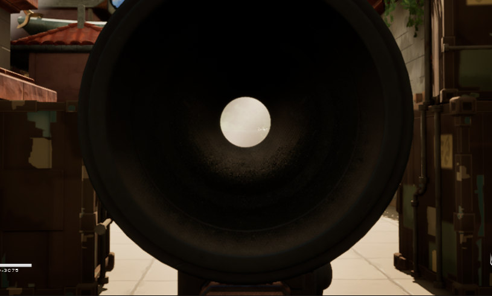
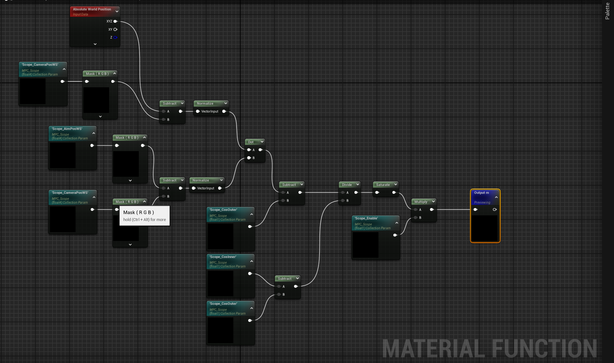
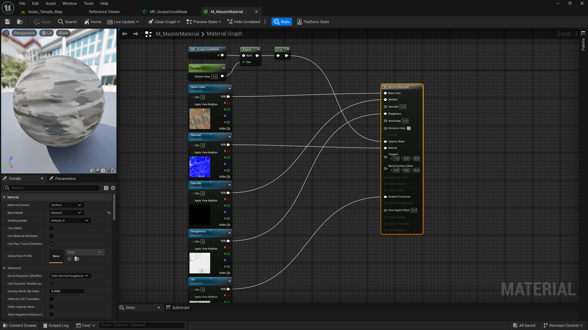

实现前：


实现后：


# UI 与 SceneCapture 瞄准镜方案的局限
在 Unreal Engine 中实现瞄准镜效果时，网络上常见的教程大致可以分为两类：UI 覆盖方案和 双摄像头（SceneCapture）方案。这两种方法都能够较为简单地实现瞄准镜的视觉效果，因此在很多示例项目和教学内容中被广泛使用。然而，在实际项目中，这些方案往往也伴随着一些明显的局限。

## UI
通常是在玩家进入瞄准状态时，在屏幕上叠加一个带有圆形透明区域的 UI 图像，从视觉上模拟瞄准镜的形状，并在中心显示一个准星。由于 UI 只是一种二维遮罩，它并不会真正改变三维场景中的可见性关系，因此很多问题实际上被“掩盖”而不是被解决。例如，UI 无法正确处理镜筒内部的空间结构，也无法自然地处理枪管、武器模型或其他场景物体在镜内外的遮挡关系。此外，在第三人称视角中，摄像机位置与武器发射点通常存在一定的偏移，仅依赖屏幕中心的 UI 准星很难严格保证视觉瞄准点与实际弹道之间的一致性，这在一些情况下会影响射击体验。

## 双摄像头
在瞄准镜位置放置一个 SceneCapture2D，通过 RenderTarget 将该摄像机渲染的画面显示在瞄准镜镜片材质上。这种方法能够较好地模拟真实瞄准镜的视觉效果，例如独立的视场角（FOV）和放大倍率，因此在许多项目中被认为是较为“真实”的实现方式。然而，这种方案的主要问题在于 性能和系统复杂度。SceneCapture 相当于对场景进行一次额外渲染，在复杂场景中可能带来明显的性能开销；同时，RenderTarget 与主视图之间在后处理、透明物体、光照或抗锯齿等方面可能出现不一致，需要额外处理。此外，引入额外摄像机也会增加系统结构的复杂度，例如相机同步、更新顺序以及网络环境下的状态同步等问题。

我曾尝试使用该方案，并适当降低了 RenderTarget 的精度，但性能损耗过大，开启后帧率从140+下降至60+.

# 基于材质计算的瞄准镜裁剪
## 基本思路
本文采用的是一种完全基于材质计算的实现方式。其核心思想是：通过分析当前像素在空间中的方向关系，在材质中构造一个以瞄准镜光轴为中心的圆锥形可视区域，只有位于该区域内的像素才会被渲染，其余像素则被裁剪。这样便可以在不引入额外摄像机或 UI 的情况下，动态隐藏镜筒内壁、枪管等不希望出现在瞄准镜视野中的物体。

在具体实现中，材质需要获得两个关键位置：相机位置以及瞄准镜中心的位置。这两个位置由 C++ 侧通过 Material Parameter Collection（MPC） 每帧传入材质。对于材质中的每一个像素，我们可以计算一条从相机指向该像素的方向向量，同时计算一条从相机指向瞄准镜中心（ScopeSocket）的方向向量。通过对这两个向量进行归一化并计算点积，就可以得到它们之间夹角的余弦值。

点积结果可以理解为“当前像素是否接近瞄准镜光轴”。当该值接近 1 时，说明该像素的方向与光轴接近；当值逐渐减小时，则表示该像素逐渐偏离瞄准镜中心。利用这一性质，我们可以设置两个阈值来定义一个圆形可视区域：内侧阈值用于确定瞄准镜的主要视野范围，而外侧阈值则用于在边缘处形成一定的过渡，从而避免硬边界带来的视觉突兀。材质根据这一计算结果决定当前像素是否被保留或裁剪，从而形成一个稳定的圆形观察窗口。

通过这种方式，瞄准镜的可视区域不再依赖 UI 遮罩，也不需要额外的摄像机渲染，而是直接在当前场景渲染过程中进行像素级判断。由于裁剪是基于空间方向关系计算得到的，因此无论玩家如何移动或转动视角，瞄准镜内部的可视区域都会始终保持与瞄准镜光轴一致，从而实现一种轻量且稳定的瞄准镜效果。

## MPC
为了在材质中完成瞄准镜裁剪计算，我们需要将一些关键的空间信息从 C++ 传递到材质中。Unreal Engine 中最常用的方式之一是 Material Parameter Collection（MPC）。MPC 本质上是一组可以被多个材质同时访问的全局参数，通过在运行时更新这些参数，材质即可在 GPU 侧实时获得来自游戏逻辑层的数据。

在本实现中，MPC 中主要包含四类参数：瞄准镜中心位置、相机位置、裁剪阈值以及启用状态。这些参数由角色类在每帧更新，并写入到 MPC 中，然后由武器材质读取并参与计算。

首先是 瞄准镜中心位置（Scope_AimPosWS）。该参数来自武器模型上的 ScopeSocket，表示瞄准镜光轴在世界空间中的位置。在材质中，这个位置用于确定裁剪圆锥的中心方向。

第二个关键参数是 相机位置（Scope_CameraPosWS）。在本文的实现中，这个位置并不是直接读取摄像机组件的位置，而是使用武器上的 AimSocket 来表示。AimSocket 实际上是 ADS 状态下，摄像机的位置；不使用 Camera Position 的原因在于实际开发过程中，相机组件可能会受到骨骼动画、控制器更新或插值逻辑的影响而产生微小抖动，而使用武器上的 Socket 可以提供一个更加稳定的参考点，同时也更符合瞄准镜与武器之间的空间关系。

接下来是 裁剪阈值参数（Scope_CosInner 与 Scope_CosOuter）。在材质中，我们通过计算两个方向向量的点积来判断像素是否位于瞄准镜视野范围内。为了避免在边缘处出现过于突兀的硬边界，我们设置了两个角度阈值：一个用于确定主要可视区域，另一个用于在边缘形成一定的过渡区域。在代码中，这两个角度会先转换为余弦值，然后传递给材质，以减少运行时的计算开销。

最后是 启用参数（Scope_Enable）。该参数用于控制瞄准镜裁剪效果是否生效。当角色进入 ADS 状态并且当前武器标签匹配时，该值为 1，否则为 0。材质可以根据这个参数决定是否应用裁剪逻辑，从而在普通状态和瞄准状态之间平滑切换。

```
void APhoebeCharacter::UpdateScopeMPC(float DeltaSeconds)
{
	if (!MPC_ScopeInst || GetCurrentWeaponMesh() != PrimaryWeaponMesh || !PrimaryWeaponMesh)
	{
		return;
	}

	static const FName NAME_AimPosWS(TEXT("Scope_AimPosWS"));
	static const FName NAME_CameraPosWS(TEXT("Scope_CameraPosWS"));
	static const FName NAME_CosInner(TEXT("Scope_CosInner"));
	static const FName NAME_CosOuter(TEXT("Scope_CosOuter"));
	static const FName NAME_Enable(TEXT("Scope_Enable"));

	const FVector AimPosWS = PrimaryWeaponMesh->GetSocketLocation(FName(TEXT("ScopeSocket")));
	const FVector CameraPosWS = PrimaryWeaponMesh->GetSocketLocation(FName(TEXT("AimSocket")));

	const float CosInner = FMath::Cos(FMath::DegreesToRadians(InnerDeg));
	const float CosOuter = FMath::Cos(FMath::DegreesToRadians(OuterDeg));

	const float ScopeEnable = bIsADS && AbilitySystemComponent->HasMatchingGameplayTag(PrimaryWeaponTag) ? 1.0f : 0.0f;

	MPC_ScopeInst->SetVectorParameterValue(
		NAME_AimPosWS,
		FLinearColor(AimPosWS.X, AimPosWS.Y, AimPosWS.Z, 1.0f)
	);
	MPC_ScopeInst->SetVectorParameterValue(
		NAME_CameraPosWS,
		FLinearColor(CameraPosWS.X, CameraPosWS.Y, CameraPosWS.Z, 1.0f)
	);

	MPC_ScopeInst->SetScalarParameterValue(NAME_CosInner, CosInner);
	MPC_ScopeInst->SetScalarParameterValue(NAME_CosOuter, CosOuter);
	MPC_ScopeInst->SetScalarParameterValue(NAME_Enable, ScopeEnable);
}
```

## Material Function
函数的基本输入包括：相机位置、瞄准镜中心位置以及裁剪阈值参数。同时，材质还可以通过 Absolute World Position 节点获得当前像素在世界空间中的位置。利用这些信息，我们可以构造两条关键的方向向量：第一条是从相机指向当前像素的方向，第二条是从相机指向瞄准镜中心的方向。两者分别通过向量减法得到，然后进行归一化处理。

接下来，通过对这两个归一化后的方向向量进行 Dot Product（点积） 计算，就可以得到它们之间夹角的余弦值。这个值实际上反映了当前像素与瞄准镜光轴之间的偏离程度：当点积接近 1 时，说明该像素几乎位于光轴方向；当值逐渐减小时，则表示该像素逐渐偏离瞄准镜中心。

在获得点积结果后，材质会使用 MPC 中提供的 CosInner 与 CosOuter 两个阈值来确定可视区域。首先计算点积与外侧阈值之间的差值，然后再除以内外阈值之间的范围，从而得到一个 0 到 1 之间的插值结果。这个过程本质上等价于一个简化的 smoothstep 操作，用于在瞄准镜边缘形成平滑过渡，而不是直接产生硬边界。

最后，函数会将计算结果与 Scope_Enable 参数相乘，用于控制裁剪逻辑是否生效。当玩家未进入 ADS 状态时，该值为 0，函数输出将不影响材质；而在瞄准状态下，该值为 1，函数输出则会作为 Opacity Mask 或其它控制参数参与最终的像素裁剪。



## Material
MF_ScopeConeMask 会输出一个 0 到 1 之间的值，用于表示当前像素与瞄准镜光轴之间的关系。数值越接近 1，说明该像素越接近瞄准镜中心；数值越接近 0，则表示该像素已经偏离瞄准镜可视范围。在材质中，这个结果会先经过一个 Power 节点进行处理。这里通过 Tighten 参数控制指数值，从而调节裁剪区域的边缘形状。较大的指数会使可视区域更加集中，边界也会更加清晰，而较小的值则会产生更柔和的过渡效果。

随后，材质使用一个 OneMinus（1-x） 节点对结果进行反转。这是因为在最终应用到 Opacity Mask 时，我们希望瞄准镜视野内部的区域保持可见，而位于圆锥之外的区域被裁剪掉。经过反转之后，材质即可得到一个适合用于遮罩的值。



# 骨骼驱动武器带来的裁剪不稳定
## 问题介绍
在项目最初的实现中，武器模型是按照常见的 TPS 角色结构绑定在角色骨骼上的。具体来说，武器 SkeletalMesh 会通过 AttachToComponent 绑定到角色 右手骨骼对应的 Socket 上，由角色动画系统驱动其整体运动。这种结构在大多数第三人称射击游戏中都非常常见，因为角色的开火、换弹以及持枪姿势通常都依赖骨骼动画系统进行控制。

与此同时，为了让角色在瞄准或射击时能够更准确地指向目标，本项目还在角色动画中加入了 IK 对齐逻辑。当玩家进入瞄准状态或进行射击时，角色的右手骨骼会通过 IK 调整，使武器大致对齐摄像机的朝向。这样可以保证玩家看到的瞄准方向与武器的射击方向保持一致，从而提升射击体验。

然而，这种结构在引入基于材质的瞄准镜裁剪后暴露出了一个新的问题。由于武器是绑定在角色骨骼上的，而 IK 系统在每帧都会对骨骼进行微小的修正，因此武器的世界空间位置和旋转实际上会持续发生非常细微的变化。在正常的渲染情况下，这种变化几乎不可察觉，因为它只是在亚像素级别的小幅调整。

但在本文实现的瞄准镜方案中，材质需要依赖武器上的 ScopeSocket 和 AimSocket 来计算裁剪圆锥的方向。当武器骨骼在 IK 调整下产生微小抖动时，这些 Socket 的世界坐标也会随之产生细微变化，而材质中的裁剪逻辑又是基于精确的方向计算完成的。最终的结果就是：原本几乎不可见的骨骼微抖动被材质计算放大，表现为瞄准镜边缘的明显抖动或闪烁。

换句话说，这个问题并不是传统意义上的动画抖动，而是由 骨骼 IK 更新 → Socket 世界坐标变化 → 材质方向计算变化 → 裁剪边界变化 这一连串计算共同放大的结果。因此，在解决问题时，简单地对参数进行插值或平滑往往并不能彻底消除抖动，因为问题的根源在于 武器本身的参考坐标系正在持续变化。

## 解决方式
在 ADS 期间不要让武器继续挂在会被 IK/骨骼更新影响的右手 Socket 上。因此，在进入 ADS 时我将武器从右手 Socket 解绑定，改为挂到角色 Mesh 的根（或其它稳定节点）上；退出 ADS 时再将武器重新挂回右手 Socket。这样做能让用于材质计算的 ScopeSocket / AimSocket 参考坐标系稳定下来，从源头消除“裁剪边界抽搐”的问题。

项目中 ADS 状态的切换由基类 `ABaseCharacter::SetADSState(bool bADS)` 统一控制，它会处理开镜相关的通用表现：设置 bIsADS、关闭轮廓、隐藏角色 Mesh、显示武器 Mesh，并同步准星显示状态等。子类在此基础上扩展了武器的挂接策略：ADS 时解绑右手骨，非 ADS 时恢复右手骨挂接，从而在不破坏整体角色系统的前提下解决裁剪稳定性问题。

需要注意的是：武器从右手骨移到根节点后，会失去原先通过手部骨骼/IK提供的朝向对齐。也就是说，虽然武器不再抖动，但它的瞄准镜光轴可能与摄像机朝向存在偏差，导致“镜内圆形区域稳定了，但瞄准方向不一致”。为此，我在 ADS 状态下增加了一步“方向校准”：每帧计算 摄像机旋转与武器 ScopeSocket 旋转之间的差值，并把这段差值应用到武器 Mesh 上，使 ScopeSocket 的朝向始终与摄像机朝向对齐。这样既保持了裁剪所需的稳定参考，又保证了瞄准方向的一致性。

最终，这个解决方案由两部分组成：

结构解耦：ADS 时武器脱离右手骨骼链，避免 IK 微调引入的高频抖动；结束后恢复绑定。

方向校准：ADS 期间用数学方式将武器朝向对齐到摄像机（以 ScopeSocket 为基准），替代原先依赖手骨 IK 的对齐方式。

通过这两步处理，材质裁剪得以稳定工作，同时武器与摄像机在瞄准状态下保持正确对齐。
