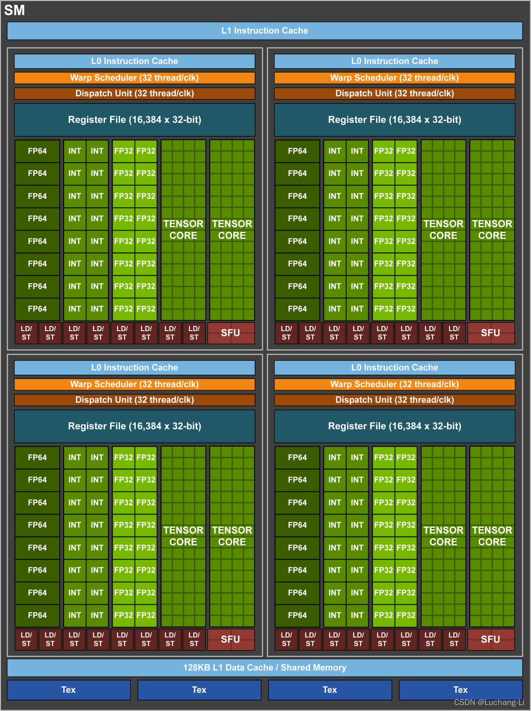
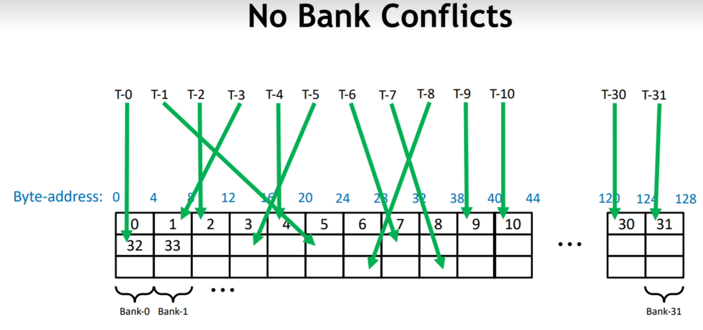
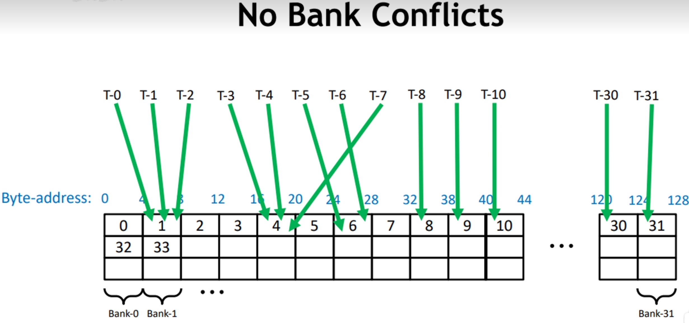
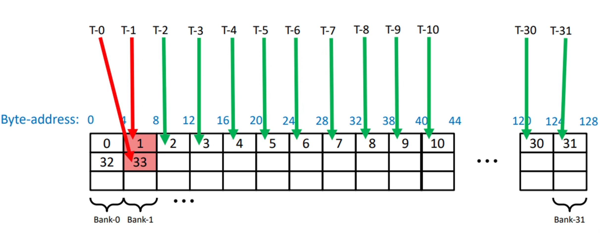

# BankConflict介绍

## 基础概念
### SM(Streathread tileg Multiprocessor)
SM是CUDA编程模型中最核心的硬件计算单元之一，它负责实际调度和执行线程和线程束上的指令。

每个SM包含了多个硬件资源：
- CUDA核心：执行浮点、整数运算的基础单元。
- Warp Scheduler（Warp调度器）：调度和发射warp中的指令。
- Register File（寄存器）：供线程临时存储数据。
- Shared Memory（共享内存）：用于block内线程通信与快速数据缓存。
- SFU（特殊功能计算单元）：计算 sin cos sqrt等复杂函数。
- Load/Store 单元（LD/ST）：处理内存读写。
- Tensor Core：用于矩阵乘法的高吞吐量计算单元。

下图是Volta GV100 Streathread tileg Multiprocessor (SM)的结构：



### Shared Memory
位于GPU SM中的Shared Memory具有高速、低延迟的特性，是CUDA编程中非常重要的优化工具。

在CUDA编程中每个Block分配一块独立的Shared Memory，它可以被用于线程间通信、数据复用、缓存临时计算结果等场景。

每个SM的Shared Memory总量一般为48KB~128KB；在编程中要注意数据一致性。

### GPU调度执行
- SM调度单位为一个warp，每一个warp一般包含32个threads.
- Shared Memory可以被一个Warp中的所有32个线程进行访问.

### Bank
在CUDA的Shared Memory中，Bank是一种硬件组织方式，用以实现高带宽访问。

Shared Memory是按Bank划分的，每个Bank可以在一个时钟周期内为一个线程提供服务。

主流的NVIDIA GPU每个Shared Memory有32个Bank，每个Bank宽度为4B；这也就是说，每4B的地址对应一个Bank。

$BankIdx = (address/4)\%32$

- 当多个线程在同一个时钟周期下访问不同的bank，访问是并行的。
- 当多个线程访问同一个bank的同一地址，将发生广播。
- 当多个线程访问同一个bank的不同地址，访问将串行化。

## 什么是BankConflict
在Bank介绍中，我们说明了三种情况，分别是不同Bank并行访问、同一Bank同一地址广播、同一Bank不同地址串行；而BankConflict就是指第三种情况。

BankConflict是指在CUDA中使用共享内存时，同一个时钟周期内，多个线程访问同一个Bank内的不同地址时产生冲突。

### 无冲突情况
当多个线程在同一个时钟周期下访问不同的bank，访问是并行的：



其中，T-x指代thread-x，即说明线程的序号；绿色箭头指代了该线程访问的Bank；而每一个4B宽度的块，连续构成Bank0~Bank31，并循环往复，所以在图中，一列即为同一个Bank。

在该图中，虽然一个warp中的32个线程的访问并非按照连续地址进行，但是线程访问不同的Bank，该访问是可并行的。

当多个线程访问同一个bank的同一地址，将发生广播：



此时，即使部分线程访问了同一个Bank，但是由于它们访问的地址是一致的，所以不会发生BankConflict.

### 冲突情况
当多个线程访问同一个bank的不同地址，访问将串行化：



如图所示，T-0 T-1线程同时访问了Bank-1，但前者访问4-8，后者访问132-136，发生了2-way Bank Conflict.

x-way指代了Bank Conflict的冲突等级，最高可达32-way Bank Conflict，即一个warp中的线程同时访问同一个Bank中的不同地址。

发生Bank Conflict时，会严重降低共享内存带宽，导致吞吐量下降；此外，冲突造成性能波动大，难以debug.

# 案例分析
## 冲突在哪
在上一节，我们提供了基础的矩阵乘法优化代码，部分代码如下：
```
\\ 配置参数
const int BM = 128;
const int BN = 128;
const int BK = 8;
const int TM = 8;
const int TN = 8;
\\ 计算线程对应该块计算的C块中的起始行列
const uint threadRow = threadIdx.x / (BN / TN);
const uint threadCol = threadIdx.x % (BN / TN);
```

由于$BN/TN=16$，这说明在一个warp中，前16个线程与后16个线程分别具有相同的threadRow；每16个线程为一个周期，分别具有0，1，...，15的threadCol.

```
for (int blkIdx = 0; blkIdx < K; blkIdx += BK)
{
    /**载入共享内存**/

    __syncthreads();

    A += BK;
    B += BK * N;

    for (uint dotIdx = 0; dotIdx < BK; ++dotIdx)
    {
        for (int i = 0; i < TM; i++)
        {
            regM[i] = As[dotIdx * BM + threadRow * TM + i];
        }
        for (int i = 0; i < TN; i++)
        {
            regN[i] = Bs[dotIdx * BN + threadCol * TN + i];
        }

        for (uint resIdxM = 0; resIdxM < TM; ++resIdxM)
        {
            for (uint resIdxN = 0; resIdxN < TN; ++resIdxN)
            {
                threadResults[resIdxM * TN + resIdxN] += regM[resIdxM] * regN[resIdxN];
            }
        }
    }
    __syncthreads();
}
```

其中，将共享内存数据载入寄存器时：

对`As`访问`dotIdx * BM + threadRow * TM + i`（在A加载进共享内存时，对A进行了转置），若dotIdx与i不变，那么同一个warp前16个线程访问`dotIdx * BM + 0 * TM + i`，访问同一地址，不发生冲突，后16个线程访问`dotIdx * BM + 1 * TM + i`，也访问同一地址，也不冲突；前后访问地址相差`TM`即8个float，32B；即前后地址相差8个Bank的宽度，仍在32个Bank范围内，不会发生Bank Conflict.

对`Bs`访问`dotIdx * BN + threadCol * TN + i`，若dotIdx与i不变，一致从第一个线程开始的16个线程中，相邻线程的threadCol相差1（0，1，...，15），则每俩线程访问地址相差一个`TN`float，即8float，即32B。从0号线程到3号线程，相差32float，即128B，恰好为一轮32个Bank；那么threadIdx每相差4（例如，0号线程与4号线程）就会产生一个Bank Conflict.

## Warp Tiling
我们先考虑做了什么，再考虑为什么这么做。在这里我们重点关注从共享内存读取到寄存器时发生的Bank Conflict，其余的Bank Conflict也会写在文中。

以下为本次Warp Tiling实现的参数设置，可以截图放在旁边。
```
const uint BN = 128;
const uint BM = 64;
const uint BK = 8;
const uint WN = 64;
const uint WM = 32;
const uint WNITER = 2;
const uint TN = 4;
const uint TM = 4;
```
### 从全局内存载入共享内存
在载入共享内存之前（或者说在遍历K之前），我们需要对A B C指针进行移动，使其移动到指定的形状分别为`[BM, BK] [BK, BN] [BM, BN]`的块起始位置。
移动参考：
```
const uint cRow = blockIdx.y;
const uint cCol = blockIdx.x;

A += cRow * BM * K;
B += cCol * BN;
```

对A矩阵，需要纵向移动`cRow`个`[BM, Bk]`块，之后的行遍历按`BK`大小间隔遍历K，那么总共需要移动`cRow * BM`行，共`cRow * BM * K`个数据。

对B矩阵，需要横向移动`cCol`个`[BK, BN]`块，之后的列遍历按`BK`大小间隔遍历K，所以总共横向移动`cCol * BN`列，共`cCol * BN * 1`个数据。

PS：在这里我们先不介绍C指针如何移动，首先从A B矩阵读入不需要C；其次，再介绍完各种块的层次后再介绍C指针更为合适。

#### A矩阵
在本节，我们关注一个Block中的所有线程，是如何将(BM, BK)大小的A矩阵块向量化并转置载入共享内存的。

我们会使用`float4`读取全局内存至寄存器，再将寄存器转置载入到共享内存，也就是说每个线程一次负责4个数据的载入。

那么，我们首先就要确认从哪个起点开始载入连续的4个数据。

```
const uint innerRowA = threadIdx.x / (BK / 4);
const uint innerColA = threadIdx.x % (BK / 4);
constexpr uint rowStrideA = (NUM_THREADS * 4) / BK;
```

在行主序的A矩阵中，以四个数据为一组，每行有`BK/4`组，所以每个线程的行起点为`threadIdx.x / (BK / 4)`，而列起点为`threadIdx.x % (BK / 4)`.

考虑到线程数目的四倍不一定恰好是(BM, BK)大小矩阵的数据量，所以需要引入偏移量，满足少量的A矩阵块的溢出需求，即部分线程可能额外读取。

那么每个线程都读取一次数据，一个Block总共读取`(NUM_THREADS * 4)`，读取`(NUM_THREADS * 4) / BK`行。那么同一个线程，如果第二次读取全局内存，下次读取的数据的行将`(NUM_THREADS * 4) / BK`作为0行，即读取第`(NUM_THREADS * 4) / BK + innerRowA`行。

明白了这些数据，我们便能很快写出读入A矩阵某块进入共享内存的代码：

```
for (uint offset = 0; offset + rowStrideA <= BM; offset += rowStrideA) {
    const float4 tmp = reinterpret_cast<const float4 *>(
        &A[(innerRowA + offset) * K + innerColA * 4])[0];
    As[(innerColA * 4 + 0) * BM + innerRowA + offset] = tmp.x;
    As[(innerColA * 4 + 1) * BM + innerRowA + offset] = tmp.y;
    As[(innerColA * 4 + 2) * BM + innerRowA + offset] = tmp.z;
    As[(innerColA * 4 + 3) * BM + innerRowA + offset] = tmp.w;
}
```

#### B矩阵
B矩阵与A矩阵思路类似，但是不需要转置。
```
const uint innerRowB = threadIdx.x / (BN / 4);
const uint innerColB = threadIdx.x % (BN / 4);
constexpr uint rowStrideB = NUM_THREADS / (BN / 4);

for (uint offset = 0; offset + rowStrideB <= BK; offset += rowStrideB) {
    reinterpret_cast<float4 *>(
        &Bs[(innerRowB + offset) * BN + innerColB * 4])[0] =
        reinterpret_cast<const float4 *>(
            &B[(innerRowB + offset) * N + innerColB * 4])[0];
}
```

#### Bank Conflict!!!
在读取A矩阵时，存在BankConflict.

我们假设有1threadIdx.x = 0, 11两个线程，它们共处于一个warp，满足同一warp的线程的条件。

thread-0对应的`innerColA = 0`，thread-1对应的`innerColA = 1`，二者的`innerRowA = 0`.

在读取`As[(innerColA * 4 + 0) * BM + innerRowA + offset]`，thread-0读取`As[(0 * 4 + 0) * BM + 0 + offset]`，thread-1读取`As[(1 * 4 + 0) * BM + 0 + offset]`。

通过上述两个例子，我们很容易理解以`BK/4`为一组，组内相邻的两个线程对应的`innerColA`是连续的，地址是固定差`4BM`的。

共享内存地址被 按 4 字节（float）划分 bank 编号：

```
bank = address_in_float % 32
```

你访问的地址`As[(innerColA * 4 + 0) * BM + innerRowA + offset]`为`As[innerColA * 4 * 64 + innerRowA + offset]`.

当 innerColA 连续变化时，innerColA * 512 也连续变化，但：

```
(0 * 256 + innerRowA + offset) % 32 = (innerRowA + offset) % 32
(1 * 256 + innerRowA + offset) % 32 = (innerRowA + offset) % 32
(2 * 256 + innerRowA + offset) % 32 = (innerRowA + offset) % 32
...
```

所以不同线程访问的地址都映射到 `bank (innerRowA + offset) % 32`，产生Bank Conflict.

### 矩阵层次与变量名
我们已经成功将A矩阵中(BM, BK)大小的块和B矩阵中(BK, BN)大小的块载入到共享内存中，现在我们需要思考，如何从共享内存取出合适的数据塞入寄存器，再通过寄存器的数据完成计算。

在这里，我们将梳理具体的矩阵层次，明确每个变量的具体含义。

我们以C矩阵的划分为例。

#### 最小单位矩阵
大小为(TM, TN)的块是计算的最小单位。我在这里使用thread tile指代它。

在本例中thread tile块为（4，4）大小。

#### 一个warp处理的矩阵
32个thread tile组成矩阵，包含数据量为`32*TM*TN`。它的形状，即长宽由上层决定，我在这里使用warp sub tile指代该矩阵。

在本例中warp sub tile由（4，4）大小的thread tile组成，总共包含`32*4*4`个数据总额。

#### 由warp sub tile构成的小块
我在这里用warp tile指代它，描述该块包含多个变量名：
- WM：该块的行数，人为设置。
- WN：该块的列数，人为设置。
- WNITER: 一行有WNITER个warp sub tile，在本例中是人为设置得到的。
- WMITER：一列有WMITER个warp sub tile，`WMITER = (WM * WN) / (WARPSIZE * TM * TN * WNITER)`.
- WSUBM：描述了warp sub tile的具体行数，`WSUBM = WM / WMITER`.
- WSUBN：描述了warp sub tile的具体列数，`WSUBN = WN / WNITER`.

在本例中，WNITER人为设置为2，WMITER计算得到为2，说明一个warp tile包含（2，2）个wap sub tile.

每个wap sub tile的行数为WSUBM，即32行；列数为WSUBN，即16列。

此时我们可以反推warp sub tile的组成，已知每个最小块为（4，4），所以warp sub tile是由（8，4）个thread tile组成的。

#### 回顾warp sub tile
为了将threadIdx映射到warp sub tile，便于从共享内存并行写入寄存器，我们计算以下变量：
- threadIdxInWarp：将threadIdx映射到[0,31]，对应一个warp sub tile中的32个thread tile块的序号，`threadIdxInWarp = threadIdx.x % WARPSIZE`.
- threadColInWarp：使用threadIdx计算该序号位于warp sub tile中的哪一列，`threadColInWarp = threadIdxInWarp % (WSUBN / TN)`.
- threadRowInWarp：使用threadIdx计算该序号位于warp sub tile中的哪一行，`threadRowInWarp =  threadIdxInWarp / (WSUBN / TN)`.

#### 由warp tile组成的矩阵
该矩阵由(WM, WN)大小的warp tile组成，该矩阵形状为(BM, BN)，我们称为block tile.

这说明：该矩阵包含(BM/WM, BN/WN)个warp tile.

在本例中，该矩阵形状为(128, 64)，包含(2, 2)个warp tile.

#### 回顾warp tile
为了将线程映射到不同的warp tile，提出以下变量：
- warpIdx：线程映射到warpIdx的warp tile，`warpIdx = threadIdx.x / WARPSIZE`.
- warpCol：指定序号的warp tile在block tile第warpCol列，`warpCol = warpIdx % (BN / WN)`.
- warpRow：指定序号的warp tile在block tile第warpRow行，`warpRow = warpIdx / (BN / WN)`.

#### 由block tile构成最终的C
block tile按照blockIdx进行映射，共同构成(M, N)大小的矩阵。我们可以叫做grid tile.

- cRow：在C中第cRow行block tile. `cRow = blockIdx.y`.
- cCol：在C中第cCol列block tile. `cCol = blockIdx.x`.

#### C指针移动
对于C矩阵，它同样先需要移动到指定的block tile块，即`C += cRow * BM * N + cCol * BN`。

但是本次实现采用warp tiling，一个block包含多个warp，每个warp单独实现一个warp tile，所以需要根据当前的threadIdx在`[BM, BN]`块中找到对应的warp块，根据计算得到的对应warpIdx所在的行列，单论warp tile相对所在block tile的位置，向下占`warpRow * WM`行，向右占`warpCol * WN`列。

计算纵向总行数为：`cRow * BM + warpRow * WM`，总数据个数为：`(cRow * BM + warpRow * WM) * N`；横向总列数为：`cCol * BN + warpCol * WN`.

```
const uint cRow = blockIdx.y;
const uint cCol = blockIdx.x;

C += (cRow * BM + warpRow * WM) * N + cCol * BN + warpCol * WN;
```

### 从共享内存载入到寄存器

我们介绍完了各个矩阵的层次，接下来将介绍在计算前，如何将数据从As载入到regM中。

最外层循环如下：
```
for (uint dotIdx = 0; dotIdx < BK; ++dotIdx)
{
    /* 载入寄存器，并计算 */
}
```

在单次循环中，每个线程要从As中载入WMITER个的TM块，从Bs中载入WNITER个的TN块，以进行后续的计算。

#### As矩阵
需谨记，As是一个经过转置的矩阵，A矩阵一个block tile形状为(BM, BK)，在As中则为(BK, BM).

所以数学意义上，单次dotIdx，我们应该取A的列（内存地址连续），但实际上我们取的是沿着BM方向的行中的`WMITER*TM`个数据。

在BM方向上，首先需要确定在(BK, BM)块中哪一行开始的，这有dotIdx决定，dotIdx遍历BK，即遍历block tile的每一行。

那么起始点在：`dotIdx * BM`.

考虑block tile层次的移动：在block tile的组成单位是warp tile，每个block形状为(WM, WN)，转置后为(WN, WM). thread的行序号为warpRow，转置后列序号为warpRow，代表该行第warpRow个的warp tile.

那么起始点应该以WM为一组，前进warpRow次，即增加`warpRow * WM`. 目前序号来到：`dotIdx * BM + warpRow * WM`.

在warp tile的下一层是warp sub tile，每个warp sub tile的形状为(WSUBM, WSUBN)，转置后为(WSUBN, WSUBM)一个warp tile包含(WMITER, WNITER)个warp sub tile，转置后形状为(WNITER, WMITER).

为了载入WMITER个的TM块，这里有一层循环，遍历WMITER，并根据当前WMITER的序号，前进相应的WSUBM倍。

```
for (uint wSubRowIdx = 0; wSubRowIdx < WMITER; ++wSubRowIdx)
{
    // 目前序号来到了dotIdx * BM + warpRow * WM + wSubRowIdx * WSUBM
}
```

在warp sub tile的下一层，是thread tile，形状为(TM, TN)，转置后为(TN, TM)，warp sub tile由(WSUBM/TM, WSUBN/TN)个thread tile组成，转置后也就是说我们需要明确，当前thread在哪列thread tile中，这里需要用到`threadRowInWarp =  threadIdxInWarp / (WSUBN / TN)`，序号应继续前进`threadRowInWarp * TM`.

恭喜，我们已经完全确定了该次循环的读取起点，我们只需要遍历该起点开始的TM个数据即可。
```
int idx = 0;

idx += dotIdx * BM;

idx += warpRow * WM;

for (uint wSubRowIdx = 0; wSubRowIdx < WMITER; ++wSubRowIdx)
{
    float tmpIdx = idx + wSubRowIdx * WSUBM;

    tmpIdx += threadRowInWarp * TM;

    for (uint i = 0; i < TM; ++i)
    {
        regM[wSubRowIdx * TM + i] =
              As[tmpIdx + i];
    }

}
```
代码整理后为：
```
for (uint wSubRowIdx = 0; wSubRowIdx < WMITER; ++wSubRowIdx) {
        for (uint i = 0; i < TM; ++i) {
          regM[wSubRowIdx * TM + i] =
              As[dotIdx * BM + warpRow * WM + wSubRowIdx * WSUBM +
                 threadRowInWarp * TM + i];
        }
}
```

#### Bs矩阵
Bs矩阵形状为(BK, BN)，在这里我们同样按照行取。
思路比As矩阵个人觉得还要简单，因为没有转置，以下是概述。

首先根据dotIdx确定起点：`dotIdx * BN`.

在block tile部分，处理组成单位warp tile，增加warpCol个长度，长度为WN.

所以序号更新为`dotIdx * BN + warpCol * WN`.

后续的内容与As矩阵思路一致，遍历warp sub tile，在warp sub tile中确定第几个thread tile块开始。

代码如下：
```
for (uint wSubColIdx = 0; wSubColIdx < WNITER; ++wSubColIdx) {
        for (uint i = 0; i < TN; ++i) {
          regN[wSubColIdx * TN + i] =
              Bs[dotIdx * BN + warpCol * WN + wSubColIdx * WSUBN +
                 threadColInWarp * TN + i];
        }
}
```

### 为什么读共享内存不会出现Bank Conflict
我们从threadIdx入手，BankConflict只发生在一组warp中threadIdx连续的32个线程间。

在block tile划分warp tile时，我们先计算了`warpIdx = threadIdx.x / WARPSIZE`，将线程划分到不同的warp tile去，不同warp tile属于不同的warp管理，它们之间的访问不会出现Bank Confict.

我们只需要单独考虑每个warp tile读取时，是否会出现bank conflict.

以As矩阵为例，假设dotIdx i wSubRowIdx不变，同一个warp tile的warpRow也相同，一个时钟周期，访问的差异在于`threadRowInWarp * TM`.

已知：
`threadIdxInWarp = threadIdx.x % WARPSIZE`
`threadRowInWarp =  threadIdxInWarp / (WSUBN / TN)`

同一个warpblock中的Idx为连续的0~31；`WSUBN/TN`为8

所以threadRowInWarp的范围框定在了0~3之间。

以0号warp中的0~31号线程为例：
```
T0~7 -> dotIdx * BM + warpRow * WM + wSubRowIdx * WSUBM + 0 * TM + i
T8~15 -> dotIdx * BM + warpRow * WM + wSubRowIdx * WSUBM + 1 * TM + i
...
T24~31-> dotIdx * BM + warpRow * WM + wSubRowIdx * WSUBM + 3 * TM + i
```

首位访问地址相差`3*TM`个float即12个float，小于一个bank的宽度。

所在warp在访问As矩阵时，不存在Bank冲突。

以Bs矩阵为例，假设dotIdx i wSubRowIdx不变，同一个warp tile的warpRow也相同，一个时钟周期，访问的差异在于`threadColInWarp * TN`.

已知：`threadIdxInWarp = threadIdx.x % WARPSIZE` `threadColInWarp = threadIdxInWarp % (WSUBN / TN)`

同一个warpblock中的Idx为连续的0~31；`WSUBN/TN`为8

所以threadColInWarp的范围框定在了0~7之间。

以0号warp中的0~31号线程为例：
```
T0, 8, 16, 24 -> dotIdx * BN + warpCol * WN + wSubColIdx * WSUBN + 0 * TN + i
T1, 9, 17, 25 -> dotIdx * BN + warpCol * WN + wSubColIdx * WSUBN + 1 * TN + i
...
T7, 15, 23, 31 -> dotIdx * BN + warpCol * WN + wSubColIdx * WSUBN + 7 * TN + i
```

首位访问地址相差`7*TM`个float即28个float，小于一个bank的宽度。

所在warp在访问Bs矩阵时不存在Bank冲突。

#### 移动指针
在计算之前我们需要对A，B指针进行位移，以确保下一次循环，A，B指针从正确的位置开始：
```
A += BK;
B += BK * N;
```

### 计算
在这里，我们以TM，TN的外积为一组，进行WMITER*WNITER次计算。

所以我们临时存储计算结果的寄存器是`(WMITER*TM, WNITER*TN)`形状的.

我们在外围进行了两层循环，分别遍历WMITER和WNITER:
```
for (uint wSubRowIdx = 0; wSubRowIdx < WMITER; ++wSubRowIdx) {
        for (uint wSubColIdx = 0; wSubColIdx < WNITER; ++wSubColIdx) {
            ...
    }
}
```
接下来介绍如何使用分配的寄存器。


首先我们考虑现在寄存器写入哪一行：

对于当前遍历的wSubRowIdx，前有`wSubRowIdx * TM`，在本轮(TM, TN)块中，处于resIdxM行，所以行为`wSubRowIdx * TM + resIdxM`，行的起始序号为`(wSubRowIdx * TM + resIdxM) * (WNITER * TN)`.

接下来考虑该行第几列，首先是在(WMITER, WNITER)块中，处于wSubColIdx列，序号应加上`wSubColIdx * TN`，在(TM, TN)块中处于resIdxN.

所以序号最终为：`(wSubRowIdx * TM + resIdxM) * (WNITER * TN) + (wSubColIdx * TN) + resIdxN`.

计算代码如下：

```
for (uint wSubRowIdx = 0; wSubRowIdx < WMITER; ++wSubRowIdx) {
        for (uint wSubColIdx = 0; wSubColIdx < WNITER; ++wSubColIdx) {
          for (uint resIdxM = 0; resIdxM < TM; ++resIdxM) {
            for (uint resIdxN = 0; resIdxN < TN; ++resIdxN) {
              threadResults[(wSubRowIdx * TM + resIdxM) * (WNITER * TN) +
                            (wSubColIdx * TN) + resIdxN] +=
                  regM[wSubRowIdx * TM + resIdxM] *
                  regN[wSubColIdx * TN + resIdxN];
            }
        }
    }
}
```

### 输出至C矩阵
在计算完成后，我们需要将`(WMITER*TM, WNITER*TN)`形状的寄存器中的计算结果搬运至C矩阵中。

在这里，我们同样采用向量化的方式搬运数据。

首先，与计算时读入寄存器一样，我们需要两个循环遍历每一个warp sub tile中的结果。
```
for (uint wSubRowIdx = 0; wSubRowIdx < WMITER; ++wSubRowIdx) {
    for (uint wSubColIdx = 0; wSubColIdx < WNITER; ++wSubColIdx) {
        ...
    }
}
```

在前文中，我们已经将C指针移动到了指定block tile中的指定warp tile，现在只用考虑warp tile内部的对应关系，即warp sub tile块。

warp tile包含`[WMITER, WNITER]`个warp sub tile，每个块为`[WSUBM, WSUBN]`大小。

所以C矩阵在指定warp tile起点的基础上，向下移动`uSubRowIdx * WSUBM`行，即移动`(wSubRowIdx * WSUBM) * N`个数据，向右移动`wSubColIdx * WSUBN`列。

所以本轮等待被输入的C矩阵的起点在：`C + (wSubRowIdx * WSUBM) * N + wSubColIdx * WSUBN`.

那么C指针可表示为：
```
float *C_interim = C + (wSubRowIdx * WSUBM) * N + wSubColIdx * WSUBN;
```

为了提高传输效率，同样使用向量化加载，一次加载`float4`类型的数据，即一次加载4个`float`的数据。

所以在内层的循环如下：
```
for (uint resIdxM = 0; resIdxM < TM; resIdxM += 1) {
    for (uint resIdxN = 0; resIdxN < TN; resIdxN += 4){
        ...
    }
}
```
C指针还要再以thread tile块为单位进行移动，以计算处于threadthread tile中的哪个thread tile。

还记得`threadRowInWarp`和`threadColInWarp`吗，它是thread在单个threadthread tile所指向的thread tile块的行列。

所以C指针还需要向下移动`threadRowInWarp * TM`，向右移动`threadColInWarp * TN`，最终到达`C + threadRowInWarp * TM * N + threadColInWarp * TN`.

现在我们终于来到了本线程本轮循环中将要输入的thread tile块的起始位置！！！

内层循环给了我们thread tile块内部的行列`(resIdxM, resIdxN)`，所以C指针还要再向下移动`resIdxM`行，向右移动`resIdxN`列，现在C指针来到了：`C + threadRowInWarp * TM * N + threadColInWarp * TN + resIdxM * N +resIdxN`.
```
C_interim[(threadRowInWarp * TM + resIdxM) * N + threadColInWarp * TN + resIdxN])[0]
```

为使用`float4`指针批量读取：
```
float4 tmp = reinterpret_cast<float4 *>(
    &C_interim[(threadRowInWarp * TM + resIdxM) * N + threadColInWarp * TN + resIdxN])[0];
```
我们将四个数据批量从全局内存载入寄存器。

遍历寄存器threadResults的序号计算方式与上一节完全一致，同样使用：`(wSubRowIdx * TM + resIdxM) * (WNITER * TN) + (wSubColIdx * TN) + resIdxN`.

那么读取四个数据并计算的代码如下：
```
const int i = (wSubRowIdx * TM + resIdxM) * (WNITER * TN) + wSubColIdx * TN + resIdxN;
tmp.x = alpha * threadResults[i + 0] + beta * tmp.x;
tmp.y = alpha * threadResults[i + 1] + beta * tmp.y;
tmp.z = alpha * threadResults[i + 2] + beta * tmp.z;
tmp.w = alpha * threadResults[i + 3] + beta * tmp.w;
```

完成计算后，我们再批量写会处于全局内存的C矩阵：
```
reinterpret_cast<float4 *>
(&C_interim[(threadRowInWarp * TM + resIdxM) * N + threadColInWarp * TN + resIdxN])[0] = tmp;
```
输出结果的总代码可见：
```
for (uint wSubRowIdx = 0; wSubRowIdx < WMITER; ++wSubRowIdx) {
        for (uint wSubColIdx = 0; wSubColIdx < WNITER; ++wSubColIdx) {
        float *C_interim = C + (wSubRowIdx * WSUBM) * N + wSubColIdx * WSUBN;
        for (uint resIdxM = 0; resIdxM < TM; resIdxM += 1) {
            for (uint resIdxN = 0; resIdxN < TN; resIdxN += 4) {
            float4 tmp = reinterpret_cast<float4 *>(
                &C_interim[(threadRowInWarp * TM + resIdxM) * N +
                            threadColInWarp * TN + resIdxN])[0];
            const int i = (wSubRowIdx * TM + resIdxM) * (WNITER * TN) +
                            wSubColIdx * TN + resIdxN;
            tmp.x = alpha * threadResults[i + 0] + beta * tmp.x;
            tmp.y = alpha * threadResults[i + 1] + beta * tmp.y;
            tmp.z = alpha * threadResults[i + 2] + beta * tmp.z;
            tmp.w = alpha * threadResults[i + 3] + beta * tmp.w;
            reinterpret_cast<float4 *>(
                &C_interim[(threadRowInWarp * TM + resIdxM) * N +
                            threadColInWarp * TN + resIdxN])[0] = tmp;
            }
        }
    }
}
```
# 总体代码
```
#include <stdio.h>
#include <stdlib.h>
#include <algorithm>
#include <cassert>
#include <cstdio>
#include <cstdlib>
#include <cublas_v2.h>
#include <cuda_runtime.h>

typedef unsigned int uint;

const int M = 2048;
const int N = 2048;
const int K = 4096;
float alpha = 1.0f;
float beta = 0.5f;
const int ITER = 1000;

#define CEIL_DIV(M, N) (((M) + (N)-1) / (N))
const int WARPSIZE = 32;
const uint NUM_THREADS = 128;

const uint BN = 128;
const uint BM = 64;
const uint BK = 8;
const uint WN = 64;
const uint WM = 32;
const uint WNITER = 2;
const uint TN = 4;
const uint TM = 4;

template <const int BM, const int BN, const int BK, const int WM, const int WN,
    const int WNITER, const int TM, const int TN, const int NUM_THREADS>
__global__ void __launch_bounds__(NUM_THREADS)
sgemmWarptiling(int M, int N, int K, float alpha, float* A, float* B,
    float beta, float* C) {
    const uint cRow = blockIdx.y;
    const uint cCol = blockIdx.x;
    A += cRow * BM * K;
    B += cCol * BN;

    const uint warpIdx = threadIdx.x / WARPSIZE;
    const uint warpCol = warpIdx % (BN / WN);
    const uint warpRow = warpIdx / (BN / WN);
    C += (cRow * BM + warpRow * WM) * N + cCol * BN + warpCol * WN;

    constexpr uint WMITER = (WM * WN) / (WARPSIZE * TM * TN * WNITER);
    constexpr uint WSUBM = WM / WMITER;
    constexpr uint WSUBN = WN / WNITER;


    const uint threadIdxInWarp = threadIdx.x % WARPSIZE;
    const uint threadColInWarp = threadIdxInWarp % (WSUBN / TN);
    const uint threadRowInWarp = threadIdxInWarp / (WSUBN / TN);

    __shared__ float As[BM * BK];
    __shared__ float Bs[BK * BN];

    const uint innerRowA = threadIdx.x / (BK / 4);
    const uint innerColA = threadIdx.x % (BK / 4);
    constexpr uint rowStrideA = (NUM_THREADS * 4) / BK;
    const uint innerRowB = threadIdx.x / (BN / 4);
    const uint innerColB = threadIdx.x % (BN / 4);
    constexpr uint rowStrideB = NUM_THREADS / (BN / 4);

    float threadResults[WMITER * TM * WNITER * TN] = { 0.0 };

    float regM[WMITER * TM] = { 0.0 };
    float regN[WNITER * TN] = { 0.0 };


    for (uint bkIdx = 0; bkIdx < K; bkIdx += BK) {
        for (uint offset = 0; offset + rowStrideA <= BM; offset += rowStrideA) {
            float4 tmp = reinterpret_cast<float4*>(
                &A[(innerRowA + offset) * K + innerColA * 4])[0];
            As[(innerColA * 4 + 0) * BM + innerRowA + offset] = tmp.x;
            As[(innerColA * 4 + 1) * BM + innerRowA + offset] = tmp.y;
            As[(innerColA * 4 + 2) * BM + innerRowA + offset] = tmp.z;
            As[(innerColA * 4 + 3) * BM + innerRowA + offset] = tmp.w;
        }

        for (uint offset = 0; offset + rowStrideB <= BK; offset += rowStrideB) {
            reinterpret_cast<float4*>(
                &Bs[(innerRowB + offset) * BN + innerColB * 4])[0] =
                reinterpret_cast<float4*>(
                    &B[(innerRowB + offset) * N + innerColB * 4])[0];
        }
        __syncthreads();

        for (uint dotIdx = 0; dotIdx < BK; ++dotIdx) {
            for (uint wSubRowIdx = 0; wSubRowIdx < WMITER; ++wSubRowIdx) {
                for (uint i = 0; i < TM; ++i) {
                    regM[wSubRowIdx * TM + i] =
                        As[(dotIdx * BM) + warpRow * WM + wSubRowIdx * WSUBM +
                        threadRowInWarp * TM + i];
                }
            }
            for (uint wSubColIdx = 0; wSubColIdx < WNITER; ++wSubColIdx) {
                for (uint i = 0; i < TN; ++i) {
                    regN[wSubColIdx * TN + i] =
                        Bs[(dotIdx * BN) + warpCol * WN + wSubColIdx * WSUBN +
                        threadColInWarp * TN + i];
                }
            }

            for (uint wSubRowIdx = 0; wSubRowIdx < WMITER; ++wSubRowIdx) {
                for (uint wSubColIdx = 0; wSubColIdx < WNITER; ++wSubColIdx) {
                    for (uint resIdxM = 0; resIdxM < TM; ++resIdxM) {
                        for (uint resIdxN = 0; resIdxN < TN; ++resIdxN) {
                            threadResults[(wSubRowIdx * TM + resIdxM) * (WNITER * TN) +
                                (wSubColIdx * TN) + resIdxN] +=
                                regM[wSubRowIdx * TM + resIdxM] *
                                regN[wSubColIdx * TN + resIdxN];
                        }
                    }
                }
            }
        }
        A += BK;
        B += BK * N;
        __syncthreads();
    }

    for (uint wSubRowIdx = 0; wSubRowIdx < WMITER; ++wSubRowIdx) {
        for (uint wSubColIdx = 0; wSubColIdx < WNITER; ++wSubColIdx) {
            float* C_interim = C + (wSubRowIdx * WSUBM) * N + wSubColIdx * WSUBN;
            for (uint resIdxM = 0; resIdxM < TM; resIdxM += 1) {
                for (uint resIdxN = 0; resIdxN < TN; resIdxN += 4) {
                    float4 tmp = reinterpret_cast<float4*>(
                        &C_interim[(threadRowInWarp * TM + resIdxM) * N +
                        threadColInWarp * TN + resIdxN])[0];
                    const int i = (wSubRowIdx * TM + resIdxM) * (WNITER * TN) +
                        wSubColIdx * TN + resIdxN;
                    tmp.x = alpha * threadResults[i + 0] + beta * tmp.x;
                    tmp.y = alpha * threadResults[i + 1] + beta * tmp.y;
                    tmp.z = alpha * threadResults[i + 2] + beta * tmp.z;
                    tmp.w = alpha * threadResults[i + 3] + beta * tmp.w;
                    reinterpret_cast<float4*>(
                        &C_interim[(threadRowInWarp * TM + resIdxM) * N +
                        threadColInWarp * TN + resIdxN])[0] = tmp;
                }
            }
        }
    }
}

int main()
{
    cudaError_t cudaStat;

    float* d_a, * d_b, * d_c;
    cudaMalloc((void**)&d_a, M * K * sizeof(float));
    cudaMalloc((void**)&d_b, K * N * sizeof(float));
    cudaMalloc((void**)&d_c, M * N * sizeof(float));

    cudaEvent_t start, end;
    cudaEventCreate(&start);
    cudaEventCreate(&end);

    cudaEventRecord(start);

    dim3 blockDim(NUM_THREADS);
    dim3 gridDim(CEIL_DIV(N, BN), CEIL_DIV(M, BM));

    for (int i = 0; i < ITER; i++)
    {
        sgemmWarptiling<BM, BN, BK, WM, WN, WNITER, TM,
            TN, NUM_THREADS>
            << <gridDim, blockDim >> > (M, N, K, alpha, d_a, d_b, beta, d_c);
    }
    cudaEventRecord(end);
    cudaEventSynchronize(end);

    float msec = 0.f;
    cudaEventElapsedTime(&msec, start, end);

    long long workfload = long long(M) * N * K * 2 * ITER;
    double avg_GFlops = (double(workfload) / 1e9) / (double(msec) / 1e3);
    printf_s("AveragePerformance %10.11f GFlops\n", avg_GFlops);

    cudaFree(d_a);
    cudaFree(d_b);
    cudaFree(d_c);
}
```

测试结果：9871.05248909252 GFlops
