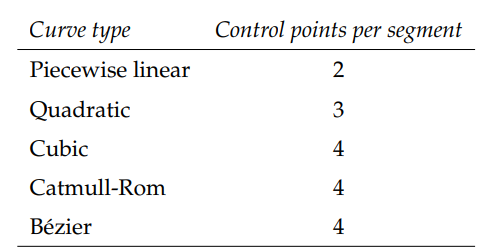

# Introduction
本节将介绍以下API：
```
optixAccelComputeMemoryUsage
optixAccelBuild
optixAccelRelocate
optixConvertPointerToTraversableHandle
optixOpacityMicromapArrayComputeMemoryUsage
optixOpacityMicromapArrayBuild
optixOpacityMicromapArrayRelocate
optixClusterAccelComputeMemoryUsage
optixClusterAccelBuild
```

在光线追踪中，最耗时的操作之一就是判断光线与场景中的几何体相交。

加速结构就是为了优化这些相交测试，把搜索空间组织起来，让光线能够更快找到相交的对象。

加速结构的类型如下：
- Geometry Acceleration Structure(Geometry-AS)
  - 包含几何图元。
  - 直接描述场景中具体的几何形状。
- Instance Acceleration Structure(Instance-AS)
  - 包含的是对Geometry-AS的实例引用。
  - 通过这种方式，可以高效地复用同一份几何数据，只改变其位置、缩放、旋转、材质ID等。

加速结构的构建发生在device，而不是host. OptiX提供了一系列函数来构建加速结构。

构建任务支持重叠和流水线：
- 允许多个加速结构的构建任务同时执行。
- 构建过程中，能够和其他GPU任务交叉执行，以提高性能。

输入结构体包含：
- `OptixBuildInput`：用于描述基础几何体的输入数据。
- `OptixClusterAccelBuildInput`：用于描述集群型加速结构的输入数据。

它们会被传给构建函数，同时配合一系列参数，来控制最终的AS.

在OptiX 9.0中，有两种新的专用加速结构：
- Cluster Acceleration Structure：
  - 一种更高级别的加速结构，用来组织和管理多个GAS
  - 它比传统的Instance-AS更适合处理大规模或分层的场景数据。
- Cluster GAS：一种面向集群的几何加速结构。

传统加速结构使用`optixAccelBuild`构建，而新的集群加速结构使用`optixClusterAccelBuild`来构建。

OptiX加速结构具有大小限制：
- IAS：最大实例数量限制，超过这个上线就无法构建。
- GAS：GAS里存放的是几何图元。
  - 先统计所有构建输入的图元数。
  - 如果场景中使用了运动模糊，每个图元会有多个motion keys.
  - 最终的有效图元数 = 图元总数 * motion keys数。
  - 对最终的有效图元数进行限制。

OptiX加速结构的输入类型如下：
- IAS：这些AS里不直接存储几何体，而是存储实例引用。
  - `OPTIX_BUILD_INPUT_TYPE_INSTANCES`：存放OptixInstance数组。
  - `OPTIX_BUILD_INPUT_TYPE_INSTANCE_POINTERS`：存放的是指向其他实例的指针数组。
- GAS：这些AS里直接存放几何数据。
  - `OPTIX_BUILD_INPUT_TYPE_TRIANGLES`：内置的三角形几何，最常用，硬件加速最强的类型。
  - `OPTIX_BUILD_INPUT_TYPE_CURVES`：内置曲线，比如头发、毛发、纤维渲染。
  - `OPTIX_BUILD_INPUT_TYPE_SPHERES`：内置球体，比如粒子效果，隐式表面等。
  - `OPTIX_BUILD_INPUT_TYPE_CUSTOM_PRIMITIVES`：自定义图元，需要用户自己写intersection program来求交。


对于GAS：
- 每个构建输入可以指定：
  - 一组三角形
  - 一组曲线
  - 一组球体
  - 或者一组由指定轴对齐包围盒限定的用户自定义图元。
- 在一次构件中，所有build input必须在输入类型上保持一致。

对于IAS：
- 只能有一个build input.
- 这个build input指定一个实例数组。
- 每个实例包含：
  - 一个位于光线空间中的变换。
  - 一个`OptixTraversableHand`，它引用：
    - 一个几何加速结构
    - 或一个transform节点
    - 或一个实例加速结构

在进行构建之前，需要先调用`optixAccelComputeMemoryUsage`，把构建输入和构建参数传给它，用来查询所需的内存大小：
- `outputSizInBytes`
  - 存放最终生成的加速结构（AS）的内存区域大小。
  - 这个大小是一个上限值，可能比最终生成的加速结构实际大小大很多。
- `tempSizeInBytes`
  - 构建过程中临时需要的内存大小。
  - 构建完成后可以释放。
- `tempUpdateSizeInBytes`
  - 当更新AS时，临时需要的内存大小。
  - 如果用户允许增量更新AS，就要分配这部分。

应用程序依据这些返回的大小，在GPU上分配输出和临时内存缓冲区。这些缓冲区的指针必须按128字节边界对齐。

在构建过程中，这些缓冲区将被持续使用，所以它们不能与其他正在构建的请求共享内存。

需注意，`optixAccelComputeMemoryUsage`不会在GPU上启动任何操作；输入缓冲区的中的设备指针或者其内容并不需要指向已经分配的内存。

也就是说，它不会真正去访问GPU内存，用户调用它时，可以只提供一个描述性的`optixBuildInput`结构，而不需要真的把三角形顶点也放在GPU上。

应用程序可以为每个加速结构存储自定义数据，只需要分配一个更大的输出缓冲区，并在加速结构之前写入这些数据；在GPU的程序中，可以通过调用`optixGetGASPointerFromHandle`获取加速结构的指针，然后减去一个固定偏移量，来取回应用程序存储的数据。

函数`optixAccelBuild`接收与`optixAccelComputeMemoryUsage`相同的`OptixBuildInput`结构数组，并根据这些输入构建一个单一的加速结构。

构建操作会在指定的CUDA stream上的GPU中指向，并且该执行是异步的，类似于CUDA内核的启动方式。

应用程序可以选择：
- 阻塞主机端线程，等待构建完成。
- 使用CUDA提供的同步机制来与其他CUDA stream同步。

函数会立即返回一个可遍历句柄，这个句柄是在host计算出来的，并且在构建完成之前就返回。

通过`optixAccelBuild`构建出来的加速结构，不会直接依赖你传入的那些输入缓冲区，即build inputs的dvice buffer.

在构建中，OptiX会把这些输入缓冲区里的数据，复制到你指定的输出缓冲区，并且可能会转换成内部优化过的存储格式。

对于GAS：输入数据是可丢的，因为几何数据已经被拷贝到输出缓冲区；而对于IAS：并不会把底层AS的数据拷贝一份，而是保留对底层GAS或IAS的引用，因此底层的AS必须继续存在，不能释放。

一个加速结构的构建流程如下：
1. 初始化build options
  ```
  OptixAccelBuildOptions accelOptions = {};
  memset(&accelOptions, 0, sizeof(OptixAccelBuildOptions));
  accelOptions.buildFlags = OPTIX_BUILD_FLAG_NONE;
  accelOptions.operation = OPTIX_BUILD_OPERATION_BUILD;
  accelOptions.motionOptions.numKeys = 0;
  ```
  - `buildFlags`可以换成`OPTIX_BUILD_FLAG_ALLOW_COMPACITION`或`OPTOX_BUILD_FLAG_PRFER_FAST_TRACE`.
  - `operation`指定是`BUILD`还是`UPDATE`
2. 初始化build inputs
  ```
  OptixBuildInput buildInputs[2];
  memset(buildInputs, 0, sizeof(OptixBuildInput) * 2);
  ```
  这里用了两个`buildInputs`，说明要么是两个几何体，要么是IAS引用多个示例。

  在这里，文档提示必须先将buildInputs清零，以保证未来版本新增字段时不会出错。
3. 查询所需内存大小
  ```
  OptixAccelBufferSizes bufferSizes = {};
  optixAccelComputeMemoryUsage(optixContext, &accelOptions, buildInputs, 2, &bufferSizes);
  ```
  返回三个值：
  - `outputSizeInBytes`：输出的AS占用。
  - `tempSizeInBytes`：构建时临时scrath buffer.
  - `tempUpdateSizeInBytes`：更新时需要的临时空间。
4. 分配显存
  ```
  void* d_output;
  void* d_temp;
  cudaMalloc(&d_output, bufferSizes.outputSizeInBytes);
  cudaMalloc(&d_temp, bufferSizes.tempSizeInBytes);
  ```
5. 构建AS
  ```
  OptixTraversableHandle outputHandle = 0;
  OptixResult results = optixAccelBuild( optixContext, cuStream,
    &accelOptions, buildInputs, 2, d_temp,
    bufferSizes.tempSizeInBytes, d_output,
    bufferSizes.outputSizeInBytes, &outputHandle, nullptr, 0 )
  ```

# Primitive build inputs

在OptiX里，如果要创建三角形几何体的BuildInput，即`OPTIX_BUILD_INPUT_TYPE_TRIANGLES`，它需要引用存放在GPU里的三角形顶点缓冲区。

如果没有运动模糊，只需要一个顶点缓冲区；
如果有运动模糊，那就要传入多个顶点缓冲区，OptiX在光线追踪时会在这些关键帧顶点之间插值。

此外，还可以额外提供索引缓冲区，这样三角形就能用索引访问顶点，而不是顺序访问。

以下是代码示例：
```
OptixBuildInputTriangleArray& buildInput =
    buildInputs[0].triangleArray;
```
指定我们要构建的是三角形数组，并且取第0个`buildInputs`作为输入。

```
buildInput.type = OPTIX_BUILD_INPUT_TYPE_TRIANGLES;
```
设置输入类型为三角形。

```
buildInput.vertexBuffers = &d_vertexBuffer;
buildInput.numVertices = numVertices;
buildInput.vertexFormat = OPTIX_VERTEX_FORMAT_FLOAT3;
buildInput.vertexStrideInBytes = sizeof( float3 );
```
指定顶点缓冲区：
- `d_vertexBuffer`：指向GPU里的顶点数组。
- `numVertices`：顶点数量。
- `vertextFormat`：顶点格式。
- `vertextStrideInBytes`：顶点在内存里的间隔。

```
buildInput.indexBuffer = d_indexBuffer;
buildInput.numIndexTriplets = numTriangles;
buildInput.indexFormat = OPTIX_INDICES_FORMAT_UNSIGNED_INT3;
buildInput.indexStrideInBytes = sizeof( int3 );
```
- d_indexBuffer：索引数组（GPU 内存里的）。
- numIndexTriplets：三角形个数。
- indexFormat：索引类型（这里是 unsigned int3，也就是每个三角形三个顶点索引）。
- indexStrideInBytes：索引在内存里的间隔（这里一个三角形就是 int3）。

```
buildInput.preTransform = 0;
```
`preTransform`是一个指向(3,4)的变换矩阵的GPU内存指针。

矩阵里有12个float，相当于一个仿射变换矩阵，但是最后一行被隐含。

如果设置了`preTransform`，那么在构建加速结构时，OptiX会把所有顶点坐标先乘上这个矩阵，直接得到变换后的几何体：
- 优点是变换只做一次，运行时遍历光线时不会有额外开销。
- 如果不指定，那就使用原始顶点坐标。

我们也可也自定义几何体来进行输入：
- 使用`OptixBuildInputCustomPrimitiveArray`作为build input.
- 每个自定义图元，都不是直接存储具体几何，而是使用时一个AABB来描述：
  - AABB就是一个长方体，通过(x,y,z)起点和终点来决定。
  - 必须完全包住实际的图元。
- AABB的存储格式有`OptixAabb`结构体定义。
- 运动模糊支持：如果启用了motion blur，则要提供多个buffer，每个motion key对应一个AABB集合；否则只需要一个buffer.
- 加速结构里只知道AABB；实际的几何形状由你写的intersection program决定。
  - 当光线进入AABB范围时，OptiX会调用你的焦点程序，判断是否与真实几何体相交。

```
OptixBuildInputCustomPrimitiveArray& buildInput =
buildInputs[0].customPrimitiveArray;
buildInput.type = OPTIX_BUILD_INPUT_TYPE_CUSTOM_PRIMITIVES;
buildInput.aabbBuffers = d_aabbBuffer;
buildInput.numPrimitives = numPrimitives;
```

`optixAccelBuild`一次调用，可以传入多个build input，但是build input的类型必须一致，即全三角或全曲线或全球体或全自定义。

每个build input，例如一组三角形、曲线、球体或AABB在构建加速结构时，会对应到SBT中的一条或多条记录。
- SBT：决定光线追踪时，不同几何体应该调用哪段程序。
  - 单一SBT记录：如果该build input只需要一个SBT记录，那么输入里的所有primitive都会使用同一个程序。
  - 多个SBT记录：如果该build input需要多个SBT记录，那么应用必须提供一个device buffer，存储每个primitive对应的SBT索引。
- 每个GAS中可引用的SBT记录数量是有限的。

例如：
```
buildInput.numSbtRecords = 2;
buildInput.sbtIndexOffsetBuffer = d_sbtIndexOffsetBuffer;
buildInput.sbtIndexOffsetSizeInBytes = sizeof( int );
buildInput.sbtIndexOffsetStrideInBytes = sizeof( int );
```

- `numSbtRecords`说明了该`buildInput`会对应2个不同的SBT record.
- `sbtIndexOffsetBuffer`指向存放SBT索引的device buffer，具体而言：`d_sbtIndexOffsetBuffer`的内容只会是三角形个数的0或1.
- `sbtIndexOffsetSizeInBytes`单个SBT record的索引的大小。
- `sbtIndexOffsetSizeInBytes`SBT record间的步长。

每个build input都可以指定一个`OptixGeometryFlags`数组。
- 该数组长度与SBT record的数量一致。
- 每个flag制定了绑定到对应SBT record的所有primitives的几何行为。

```
unsigned int flagsPerSBTRecord[2];
flagsPerSBTRecord[0] = OPTIX_GEOMETRY_FLAG_NONE;
flagsPerSBTRecord[1] = OPTIX_GEOMETRY_FLAG_DISABLE_ANYHIT;

buildInput.flags = flagsPerSBTRecord;
```
> OPTIX_GEOMETRY_FLAG_NONE
>
> Applies the default behavior when calling the any-hit program, possibly multiple times, allowing the acceleration-structure builder to apply all optimizations.
>
> OPTIX_GEOMETRY_FLAG_REQUIRE_SINGLE_ANYHIT_CALL
>
> Disables some optimizations specific to acceleration-structure builders. By default, traversal may call the any-hit program more than once for each intersected primitive.
> Setting the flag ensures that the any-hit program is called only once for a hit with a primitive. However, setting this flag may change traversal performance.
> The usage of this flag may be required for correctness of some rendering algorithms; for example, in cases where opacity or transparency information is accumulated in an any-hit program.
>
> OPTIX_GEOMETRY_FLAG_DISABLE_ANYHIT
>
> Indicates that traversal should not call the any-hit program for this primitive even if the corresponding SBT record contains an any-hit program.
> Setting this flag usually improves performance even if no any-hit program is present in the SBT.

每个build input里的primitive都有一个索引，默认索引从0开始递增。

在intersection any-hit closest-hit程序中，开发者都可以使用这个索引去识别当前primitive。

在某些情况下，可能希望索引不从0开始，我们可以使用`primitiveIndexOffset`去偏移一个build input的所有primitive的索引，这并不会消耗额外的性能。

例如，当多个build input的数据在GPU内存中连续存储时，使用偏移量可以让索引与数据地址保持一致。

例如：
```
buildInput[0].aabbBuffers = d_aabbBuffer;
buildInput[0].numPrimitives = ...;
buildInput[0].primitiveIndexOffset = 0;
```
- `buildInput[0]`是第一个自定义几何体（AABB）输入。
- `aabbBuffers`指向第一个 AABB 数据缓冲区 d_aabbBuffer。
- `numPrimitives`表示这个 build input 中包含多少个`primitive`。
- `primitiveIndexOffset = 0`，也就是索引从0开始。

```
buildInput[1].aabbBuffers = d_aabbBuffer + buildInput[0].numPrimitives * sizeof( float ) * 6;
buildInput[1].numPrimitives = ...;
buildInput[1].primitiveIndexOffset = buildInput[0].numPrimitives;
```

- `buildInput[1]`是第二个自定义几何体输入。
- `aabbBuffers`指向第二组AABB数据，它在`d_aabbBuffer`后面存储（偏移了第一个`build input`所占的内存大小）。
- `primitiveIndexOffset = buildInput[0].numPrimitives`：
这样第二组primitive的索引从第一个build input的最后一个索引之后开始。

例如，第一个 build input 有 100 个 primitive（索引 0~99），那么第二个 build input 的索引从 100 开始。

# Curve build inputs
Curve常用来表示细长物体，例如头发、毛发、地毯纤维，Curve往往很长，但非常细，最终渲染可能只有几个像素。

场景中可能包含成千上万的曲线，而它们在最后的图像中可能只有几个像素。

每条曲线是一个扫掠曲面（swept surface）：
- 由一系列控制点构成的三维顶点序列。
- 每个控制点有一个半径，沿曲线会插值生成曲线厚度。

OptiX 支持多种曲线类型：
- Cubic uniform B-spline（三次 B 样条）
- Quadratic uniform B-spline（二次 B 样条）
- Catmull-Rom spline（Catmull-Rom 样条）
- Bézier curve（贝塞尔曲线）
- Linear segments（线性段）

普通曲线的截面为圆形，二次B样条曲线可以用直线段作为截面，形成ribbons.

Ribbon可以指定法线，但不是必须的。

不同类型的曲线采用不同的端点处理：
- 线性曲线
  - 端点：默认有球形封头。
  - 转折点：在相邻段连接处会生成球形肘部。
- 三次和二次样条曲线
  - 端点：默认开口，即曲线直接结束，不自动加任何封头。
  - 如果需要平头，可以通过设置标志位来打开：
  ```
  OptixBuildInputCurveArray::endcapFlags = OPTIX_CURVE_ENDCAP_ON;
  OptixBuiltinISOptions::curveEndcapFlags = OPTIX_CURVE_ENDCAP_ON;
  ```


样条曲线并不是一整条曲线一次性定义出来的，而是由一些列多项式片段拼接而成。

一个片段需要的控制点数量取决于曲线类型：


OptiX将曲线的每一段都设置为primitive，所以每段都有primitive ID，可以单独在intersection any-hit closest-hit里访问。

曲线输入的数据布局（OptixBuildInputCurveArray）
- 顶点缓冲区：
  - 存储控制点的位置
  - 如果有motion blur，就需要为每个每个motion key提供一份顶点缓冲。
- 半径缓冲区：
  - 存储每个控制点的半径。
  - 同样，motion blur时要有多份，每个motion key一份。
- 索引缓冲区：
  - 定义每个曲线段的控制点引用关系。
- 法线缓冲区：
  - 仅对ribbons有意义。
  - 法线向量决定带子的朝向。

对于B样条线，所有曲线控制点会顺序存放在顶点缓冲里；对于索引数组，每个元素对应一段，存的是该段的起始控制点索引。

例如：假设一条三次B样条曲线，有3段，需要6个控制点：`v10, v11, v12, v13, v14, v15`，若索引数组为`10, 11, 12`，那么段的定义就是：
段0：`v10 v11 v12 v13`，段1：`v11 v12 v13 v14`，段2：`v12 v13 v14 v15`.

Ribbon段的定义：
- Ribbon使用二次B样条拼接的。
- 如果一个Ribbon有三段，需要5个控制点：
  - 每一段取3个点，而相邻段会复用2个点。
- 法线只存储在Ribbon段的边界上
  - 如果有三段，就需要4个法线向量。
  - 每段的法线在区间内是线性插值的。

控制点总是比法线多一个，但是因为segment的索引要同时用于查顶点和法线，所以人为要求，法线数组里最后补一个无效值，这样索引一致，不会越界。

OptiX会检查`indexArray`来判断strand：
- `indexArray[N+1] == indexArray[N] + 1`：表明segment N和N+1属于同一条strand.
- `indexArray[N+1] != indexArray[N] + 1`：说明segment N已经结束，sgement N+1开始了新的strand.

# Sphere build inputs
每一个球由一个三位空间坐标点和一个半径所决定。

球体输入的数据布局（OptixBuildInputSphereArray）
- 顶点缓冲区
  - 存储每个球体的中心位置。
  - 每个motion key对应一个缓冲区，如果没有motion blur，则只有一个缓冲区。
- 半径缓冲区：
  - 存储每个球体的半径。
  - 每个motion key对应一个缓冲区。
    - 如果所有球体在统一motion key下半径相同，可以设置`singleRadius`标志，使用单个半径即可，

# Instance build inputs
OptixInstance存储在GPU device memory.

每个实例用一个OptixInstance结构体描述，有两种存储方式：
- 连续数组：所有OptixInstance按顺序存储在一块内存中。
- 指针数组：存储指向每个OptixInstance的指针。

每个OptixInstance描述会引用：
- 一个几何加速结构或另一个实例加速结构或一个变换节点。
- 实例的变换矩阵。
- SBT中用于这个实例的记录索引。
- 可选的mask flags等参数。


与三角形或自定义图元输入不同，`optixAccelBuild`每次构建只能接受一个实例输入；也就是说，一次构建IAS只能提供一个`OptixBuildInput`来描述所有实例。

```
OptixInstance instance = {};

float transform[12] = {1,0,0,3,0,1,0,0,0,0,1,0};
memcpy( instance.transform, transform, sizeof( float )*12 );

instance.instanceId = 0;

instance.visibilityMask = 255;

instance.sbtOffset = 0;

instance.flags = OPTIX_INSTANCE_FLAG_NONE;

instance.traversableHandle = gasTraversable;

void* d_instance;
cudaMalloc( &d_instance, sizeof( OptixInstance ) );
cudaMemcpy( d_instance, &instance, sizeof( OptixInstance ), cudaMemcpyHostToDevice );

OptixBuildInputInstanceArray* buildInput = &buildInputs[0].instanceArray;
buildInput->type = OPTIX_BUILD_INPUT_TYPE_INSTANCES;
buildInput->instances = d_instance;
buildInput->numInstances = 1;
```

- 首先定义并初始化一个`OptixInstance`结构体，所有字段初始化为0.
- 定义几何变换矩阵，用于将几何体变换到世界空间。
- `memcpy`把矩阵复制到`instance.transform`.
- 设置实例ID，用于区分不同实例。
- 设置可见性掩码，每一位控制光线是否能访问该实例，本例中`255`表示所有光线可见。
- 指定该实例在SBT中的偏移量。
- 设置实例标志，在这里没有额外要求。
- 指向这个实例所引用的几何加速结构的`traversableHandle`.
- 分配设备内存来存放这个实例，并把主机上的实例数据拷贝到GPU上。

`OPTIX_BUILD_INPUT_TYPE_INSTANCE_POINTERS`是上文中`OPTIX_BUILD_INPUT_TYPE_INSTANCES`的变种：
- 后者的`buildInput.instances`指向的是一段连续的`OptixInstance`结构体数组。
- 前者的`buildInput.instances`指向的是一个指针数组，数组中的每个元素都是指向GPU内`OptixInstance`结构体指针。

Instance flags是在遍历与某个实力关联的GAS时应用的标志；当光线穿过一个IAS并到达其中的GAS时，这些表示会生效——这些标志会覆盖父级实例-AS中设置的标志。
也就是说，如果父实例设置了一些默认行为，但子实例设置了自己的flags，那么子实例的flags会覆盖父实例的设置。

> OPTIX_INSTANCE_FLAG_DISABLE_TRIANGLE_FACE_CULLING
> Disables face culling for triangles. Overrides any culling ray flag passed to optixTrace.
> OPTIX_INSTANCE_FLAG_FLIP_TRIANGLE_FACING
> Flips the triangle orientation during intersection. Also affects any culling of front and back faces.
> OPTIX_INSTANCE_FLAG_DISABLE_ANYHIT
> Disables any-hit calls for primitive intersections. Can be overridden by ray flags.
> OPTIX_INSTANCE_FLAG_ENFORCE_ANYHIT
> Forces any-hit calls for primitive intersections. Can be overridden by ray flags.

每个实例都有一个可见性掩码（visibility mask），每条光线也有一个光线掩码（ray mask），通过按位与运算两者来判断该光线是否能看到这个实例。
- 例如：`raymask & instance.mask == 0`如果为真，那么说明光线和实例没有任何公共组，光线不会追踪这个实例，这个实例被剔除。

可见性掩码可以看作是将光线和实例分配到最多8个组，只有当光线和实例在掩码上至少有一个bit相同，才对该实例执行遍历和光线求交计算。

`sbtOffset`是SBT的偏移量，用于选择碰撞发生时，运行的hit group程序。
它是相对于`OptixShaderBindingTable`中的`hitgroupRecordBase`的一个简单加法偏移。

如果实例的子对象是一个变换队形，如`OptixStaticTransform` `OptixMatrixMotionTransform` `OptixSRTMotionTransform`而不是GAS，`sbtOffset`仍然适用于最终GAS的每个Primitive.

在多层IAS的traversable图中，各层实例的`sbtOffset`会累加，最终作用于某个GAS的总偏移。

单个实例存在最大SBT偏移，可以通过`optixDeviceContextGetProperty`查询，使用`OPTIX_DEVICE_PROPERTY_LIMIT_MAX_SBT_OFFSET`.

多个实例累加的偏移值也不能超过单个实例的最大偏移。

# Build flags
在构建加速结构时，可以通过`OptixBuildFlags`枚举类型来控制构建行为，例如：如果需要在构建完成后可以随机访问顶点数据，可以在构建选项中设置：
```
accelOptions.buildFlags = OPTIX_BUILD_FLAG_ALLOW_RANDOM_VERTEX_ACCESS;
```
- 默认情况下，某些优化可能会重拍或压缩顶点数据以提高便利性能，但设置这个标志可以保证构建后的顶点仍然被随机访问。
- 这可能会对性能产生影响。

在构建加速结构时，可以通过设置不同的build flags来控制构建性能、运行时遍历性能和内存使用之间的权衡：
- `OPTIX_BUILD_FLAG_PREFER_FAST_TRACE`
  - 优先优化光线遍历性能。
  - 构建速度可能稍慢，占用内存可能稍高。
  - 适合对渲染速度要求高的场景。
- `OPTIX_BUILD_FLAG_PREFER_FAST_BUILD`
  - 优先优化加速结构构建速度。
  - 光线遍历性能可能稍低，占用内存不定。
  - 适合动态场景或需要频繁更新加速结构的情况。

# Dynamic updates
构建加速结构通常计算量很大，特别是对于复杂的场景或大量几何体。

为了提高效率，可以选择更新已有的加速结构，而不是完全重新构建：
- 更新内容包含：
  - 顶点数据或包围盒。
  - 通常比完全重新构建要快得多。
  - 适合顶点小幅移动或局部变化的情况。
- 潜在问题：
  - 如果数据变化大，加速结构质量可能下降。
  - 降低的加速结构质量可能导致光线遍历性能下降。

为了启用后续的动态更新，在构建加速结构时，要使用`OPTIX_BUILD_FLAG_ALLOW_UPDATE`：
```
accelOptions.buildFlags = OPTIX_BUILD_FLAG_ALLOW_UPDATE;
accelOptions.operation = OPTIX_BUILD_OPERATION_BUILD;
```

为了更新加速结构，设置`operation`为`OPTIX_BUILD_OPERATION_UPDATE`随后调用`optixAccelBuild`处理相同的输出缓存数据。

其他条件都必须与原构建条件一致；更新发生在原本的数据上。

```
accelOptions.buildFlags = OPTIX_BUILD_FLAG_ALLOW_UPDATE;
accelOptions.operation = OPTIX_BUILD_OPERATION_UPDATE;
void* d_tempUpdate;
cudaMalloc( &d_tempUpdate, bufferSizes.tempUpdateSizeInBytes );
optixAccelBuild( optixContext, cuStream, &accelOptions,
buildInputs, 2, d_tempUpdate,
bufferSizes.tempUpdateSizeInBytes, d_output,
bufferSizes.outputSizeInBytes, &outputHandle, nullptr, 0 );
```

更新加速结构通常会需要与构建时不同的临时缓存。

更新加速结构时，只能修改其实际内容：
- 设备内存指针：顶点缓冲区、索引缓冲区的指针。
- 缓冲区的内容：顶点坐标、法线、AABB的数值。

而以下内容是不允许修改的：
- build input的数量
- build input的类型
- build flags，即`accelOptions.buildFlags`
- 实例AS的traversable handle.
- 几何体的数量或元素数量
  - 顶点数量
  - 索引数量
  - AABB数量
  - 实例数量
  - SBT record数量
  - motion key数量

并不是所有能够Update的场景，都无脑采用Update，以下场景并不建议使用Update：
- 有索引的几何体，修改顶点连接关系。
  - BVH的空间划分质量会严重下降，遍历性能会变差。
- 几何体消失：或让几何体暂时不可见，或将它移到远处，或把三角形压成退化。
  - 虽然`Update`也能满足需求，但这会导致BVH的空间划分很糟糕，因为OptiX还会尝试把它包围进去，导致树结构不平衡。
  - 应该采用masking，如ray mask，让它不可见。
  - 或者rebuild时直接不包含该物体。

并不是所有情况都默认开启`ALLOW_UPDATE`，根据实际需求来：
- 三角形几何体开启允许更新的开销要小一些。
- 对于曲线，BVH构建器需要做更多的优化来保证traversal有效，一旦加入`ALLOW_UPDATE`BVH的结构要能兼容未来的更新，会牺牲一部分质量。

更新有层级关系的加速结构时，会影响所有直接或间接使用被更新的AS的IAS。
也就是级联更新：改一个GAS->IAS也要Update->更上层的IAS也要更新。

级联更新需要依次手动更新。

# Relocation
OptiX构建好的加速结构，是一些在GPU内存里的BVH数据。

当我需要多GPU渲染时，或更换GPU渲染，我们可能需要考虑将AS移动到新的context/device上用。

OptiX的AS数据虽然可以拷贝或移动到别的显存地址，但不能直接拿来用，必须通过`optixAccelRelocate`重新激活，才能获得一个新的有小的traversable handle.

Relocation的基本流程如下：
1. 获取Relocation信息
  ```
  OptixRelocationInfo info;
  OPTIX_CHECK( optixAccelGetRelocationInfo(
      context,            // 当前 device context
      srcTraversable,     // 源 AS 的 handle
      &info               // 输出 relocation 信息
  ) );
  ```
  这里OptiX会把源AS的一些元信息写进`info`，用来判断它能不能搬到目标设备。
2. 检查兼容性
  ```
  unsigned int compatible = 0;
  OPTIX_CHECK( optixCheckRelocationCompatibility(
      dstContext,   // 目标设备的 context
      &info,
      &compatible
  ) );

  if( compatible == 0 ) {
      // 说明不能搬 → 必须重新 build
  }
  ```
  判断目标GPU/context是否和源AS的结构兼容。
3. 执行Relocate
  ```
  OptixTraversableHandle dstHandle = 0;
  OPTIX_CHECK( optixAccelRelocate(
      dstContext,
      stream,
      &info,
      srcTraversable,        // 源 AS
      dstBuffer,             // 目标 GPU 内存
      dstBufferSize,
      &dstHandle             // 新的 traversable handle
  ) );
  ```
  这一步会把源AS拷贝到目标GPU内存，并生成一个新的handle.

旧handle不能直接跨GPU使用，必须用新的dstHandle.

当我们需要拷贝存在子资源的AS时，如IAS存储了一堆子traversable handle，GAS可能引用了OMM，我们需要显式地告诉OptiX，这些子资源的新handle，否则如IAS还是会指向旧的子结构，就会出错。

当调用`optixAccelRelocate`的时候，可以传`relocateInputs`.它们必须和原始buildInputs一一对应，顺序相同。
- 传0：表示保留原始引用。
- 传新的`relocateInputs`：让IAS/GAS指向relocation后的目标。

对于IAS而言：需要提供一个`OptixRelocateInputInstanceArray`，里面有`traversableHandles`数组，对应每个实例的新GAS handle. 如果填0，就继续引用旧的GAS.

对于GAS：可能引用OMM，如果relocation了，就要提供新的`opcatiyMicromap`，否则填0就继续用旧的。
注意`numSbtRecords`必须和build时的一样，否则会报错。

更详细的流程如下：
1. GAS relocation：
  ```
  OptixRelocationInfo gasInfo = {};
  optixAccelGetRelocationInfo(context, gasHandle, &gasInfo);

  int compatible = 0;
  optixCheckRelocationCompatibility(context, &gasInfo, &compatible);
  if (compatible != 1) {
      fprintf(stderr, "Device isn’t compatible for relocation of geometry acceleration structures.");
      exit(2);
  }
  ```
  - 获取GAS的relocation信息。
  - 用`optixCheckRelocationCompatibility`确认目标`context`能不能接收这个AS.
  ```
  OptixTraversableHandle relocatedGasHandle = 0;
  optixAccelRelocate(
      context, 0,                // context + stream
      &gasInfo,                  // 源 AS 的 relocation 信息
      0, 0,                      // 没有额外 relocateInputs
      d_relocatedGas,            // 新的内存区域
      gasBufferSizes.outputSizeInBytes,
      &relocatedGasHandle );     // 输出新的 GAS 句柄
  ```
  - 完成拷贝并得到一个新的`relocatedGasHandle`.
  - 旧的`gasHandle`和新的`relocatedGasHandle`是不同的traversable handle.
2. IAS relocation：
  ```
  OptixRelocationInfo iasInfo = {};
  optixAccelGetRelocationInfo(context, iasHandle, &iasInfo);
  ```
  - 先获取IAS的relocation信息。
  ```
  std::vector<OptixTraversableHandle> instanceHandles(g_instances.size());
  CUdeviceptr d_instanceTravHandles = 0;
  cudaMalloc((void**)&d_instanceTravHandles,
            sizeof(OptixTraversableHandle) * instanceHandles.size());

  for (unsigned int i = 0; i < g_instances.size(); ++i)
      instanceHandles[i] = relocatedGasHandle;

  cudaMemcpy((void*)d_instanceTravHandles, instanceHandles.data(),
            sizeof(OptixTraversableHandle) * instanceHandles.size(),
            cudaMemcpyHostToDevice);
  ```
  - IAS里存的是每个实例的GAS handle.
  - 在上一步完成了GAS的relocation，所以也需要将IAS更新为`relocatedGasHandle`.
  - 用`cudaMemcpy`把新handles传到device memory.
  ```
  OptixRelocateInput relocateInput = {};
  relocateInput.type = OPTIX_BUILD_INPUT_TYPE_INSTANCES;
  relocateInput.instanceArray.numInstances = instanceHandles.size();
  relocateInput.instanceArray.traversableHandles = d_instanceTravHandles;

  OptixTraversableHandle relocatedIasHandle = 0;
  optixAccelRelocate(
      context, 0,
      &iasInfo,
      &relocateInput, 1,         // IAS relocation 要指定新的 GAS handles
      d_relocatedIas,
      iasBufferSizes.outputSizeInBytes,
      &relocatedIasHandle );
  ```
  - IAS relocation必须传relocateInputs，因为它要知道新的GAS handle.
  - `numRelocateInputs = 1`对应build的输入。
