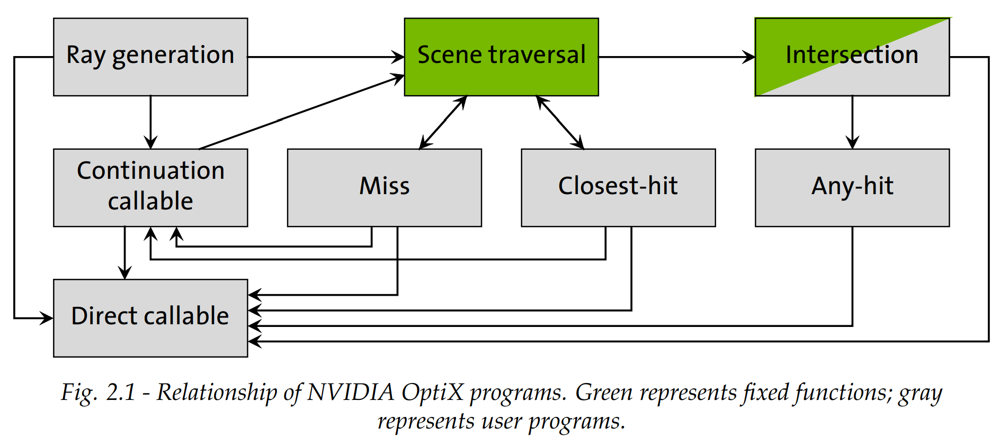
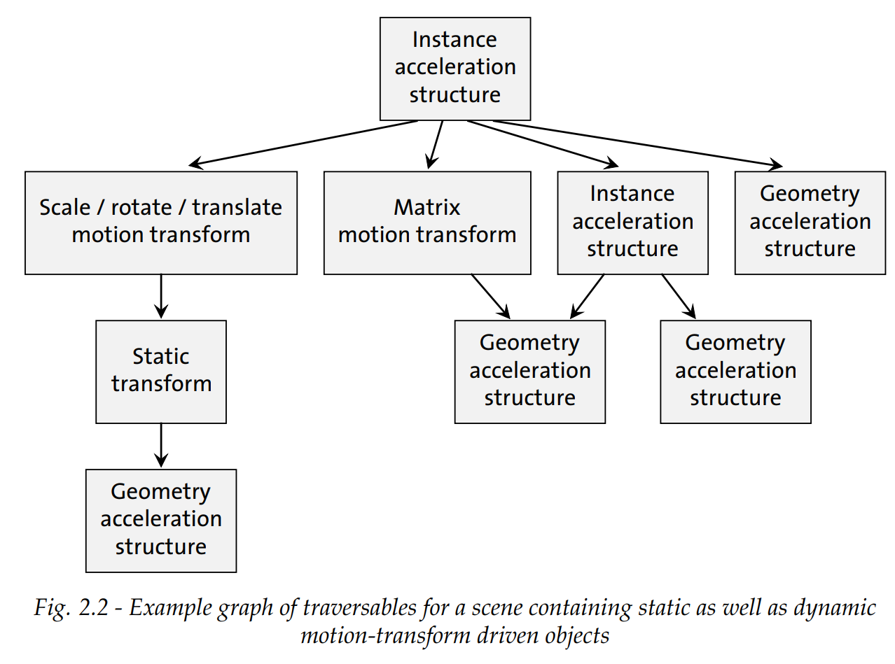

---
title: "OptiX：Basic concepts and definitions"
description: "OptiX相关基础概念。"
date: "2025-09-15 22:20:54"
category: "图形与高性能计算"
originalCategory: "OptiX入门"
track: "Rendering / HPC"
level: advanced
status: ready
published: true
minutes: 5
order: 1000
prerequisites: []
tags: ["CG", "OptiX"]
photos: "banner.jpg"
source: "_posts"
---# Program
在Nvidia的OptiX中，Program是指GPU上运行的一小段逻辑，用以处理光线计算的某一阶段。

也就是说，每条光线在其生命周期会依次调用不同的Program，例如：RayGen、ClosestHit、Miss等。

与DXR或Vulkan不同，在OptiX并不叫它Shader，这是因为，Program不仅仅可以做Shading，还可以实现光线生成、碰撞检测、异常处理、任意计算。

# Program And Data Model
Nvidia实现了单射线编程模型（Single-Ray Programming Model）。

一个线程管理一条光线，一个光线的生命周期就是按序调用不同的Program。

OptiX的管线由8类Programs组成：
- Ray Generation: 光线生成的入口，每个像素或样本调用一次，以发射光线。
- Intersection：光线与集合体的相交测试，在BVH traversal中被调用。
- Any Hit：当光线找到潜在交点时调用，比如阴影光线，可能提前返回。
- Closest Hit：找到最接近光线原点的交点时调用，做材质着色。
- Miss：光线没有击中任何几何体时调用。
- Exception：异常处理。
- Direct Callables：类似普通函数调用，立即执行。
- Continuation Callables：由调度器安排执行，延迟或异步调用。

OptiX 管线 = 硬件加速（绿色）+ 用户程序（灰色）组合而成的光线追踪网络，异常程序在任意阶段可被调用处理错误。

- RayGen → 光线生成
- Traversal → 遍历 BVH / KD-tree
  - 遇到几何体 → Intersection
  - 如果 Intersection 成功 → AnyHit（决定是否继续）
  - 结束后 → ClosestHit（最终最近交点，做 shading）
- Miss → 光线打不到物体
- Callables → 可随时调用的函数
- Exception → 异常处理

## Shader binding table
SBT能够连接几何数据（Geometry）与Program（RayGen/Hit/Miss等)及其参数。

相当于一张表，OptiX的光线照到几何体时，查表寻找将被使用的Program，并传递参数。

record是SBT的一个组件，在执行时通过offset选中，这些offset在加速结构创建和运行时指定。

实际上，record就是一个条目，当光线击中某个几何体时，就会根据其索引，查询相应的record。

每条record包含两部份：
- Header：
  - 告诉OptiX用哪个Program去处理这个几何体。
  - 开发人员不需要理解内部信息，只需要调用`optixSbtRecordPackHeader`即可。
- Data：
  - 存放用户自定义的数据，例如材质、纹理或几何体所特有的信息。

## Ray payload
每条光线在optixTrace过程中，可以携带一些数据，用来在 RayGen / Hit / Miss / AnyHit 之间传递信息。

这些数据沿着光线生命周期传递。

Payload的数值在optixTrace 调用中传入并返回，遵循拷入/拷出（copy-in/copy-out）语义。

- 当你调用 optixTrace 时，payload 的初始值会被 拷贝到光线追踪硬件内部（copy-in）
- 光线追踪执行过程中，Hit / Miss / AnyHit 等程序可以修改 payload
- 调用结束后，这些修改会被拷贝回调用者（copy-out）

在RT Core中寄存器数量有限，必须高效管理payload。

如果确实需要大量数据，或者复制的数据结构，可以使用payload指针：
- 指向 stack-based local memory
- 指向 GPU buffer

## Primitive Attributes
该属性在 Intersection Program 和 AnyHit / ClosestHit Program 之间传递信息。

例如光线击中的三角形，我需要传递重心坐标`(U, V)`。

用户也可根据自定义的几何体，定义一些属性，但是属性数量有限，且类型通常为float/int.

## Buffer
Buffer是指GPU上的一段显存。

每个Buffer由两部份组成：
- 指针：指向GPU内存地址。
- 内存内容：存储实际数据，例如：顶点数据、纹理数据、光线计算结果等

# Acceleration structures

加速结构用以加速光线在场景中寻找交点的过程。

用户不能直接读取其实现，OptiX管理它。

通常基于BVH，但不同显卡会有不同的实现方式。

- Geometry acceleration structure：针对基元，或单个模型的几何体，对单个对象内部加速光线相交。
- Instance acceleration structure：针对其他加速结构或motion transform，对场景中的多个实例化对象建立加速结构。

# Opacity micromaps
为每个三角形提供精细的不透明度信息。

当光线击中三角形时，不一定整片三角形都完全不透明，基于Opacity micromaps，RT Core可以在硬件层面判断光线是否穿透三角形，避免每条光线都访问纹理判断。

# Scene Graph Traversal
光线想要找到击中的几何体，需要遍历一个由加速结构和变换节点组成的图；而遍历的过程叫做Traversal，图中的节点叫做Traversal Objects.

Traversal Objects包含以下类型：
- IAS
- GAS
- Static Transform
- Matrix Motion Transform
- SRT Motion Transform

OptiX 的 Scene Graph Traversal = 光线沿着由 IAS / GAS / Static Transform / Motion Transform 组成的图遍历，通过 handles 找到具体几何体，再调用 Intersection/Hit 程序。

# Ray tracing with NVIDIA Opti

## 1. 创建加速结构
- 对场景中的几何体和实例建立索引，提高光线与几何体相交的效率
- 类型：
  - GAS：对单个几何体集合（如三角形网格）加速
  - IAS：对实例化对象加速

## 2. 创建程序管线
- 定义光线追踪调用中可能执行的所有程序
  - RayGen Program（发射光线）
  - Intersection Program（光线与几何体相交）
  - AnyHit / ClosestHit Program（处理击中结果）
  - Miss Program（光线未击中时处理）

## 3. 创建SBT
- 连接加速结构中的几何体/实例和对应的程序及参数
- 决定光线击中某个几何体时调用哪个 Hit Program

## 4.发射光线
- 在 GPU 上启动一个 kernel（Device-side kernel）
- 每个线程调用 RayGen Program
- RayGen 中调用 optixTrace → 光线沿加速结构遍历 → 执行 Intersection/Hit/Miss 程序
