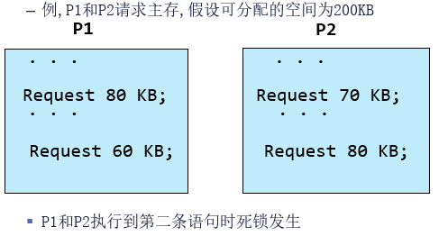
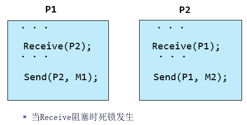
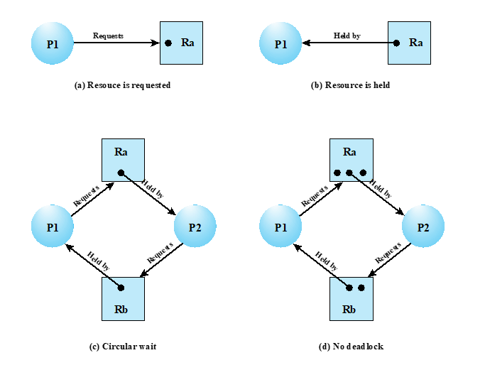
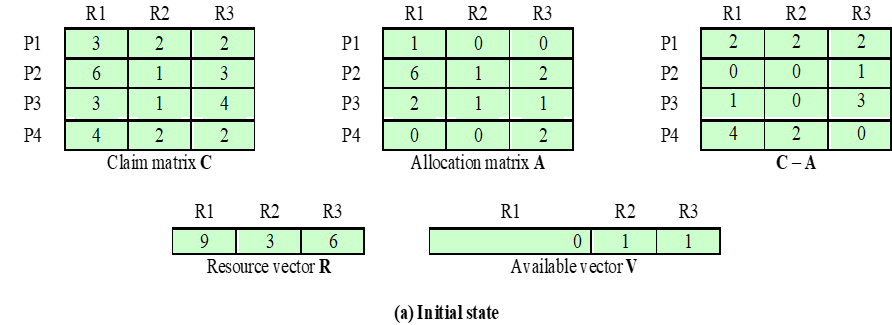
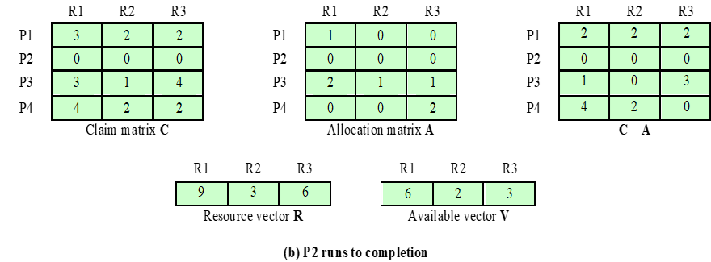
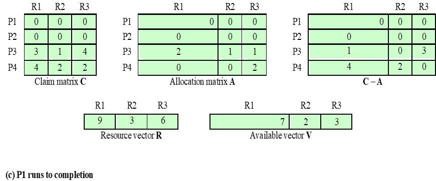
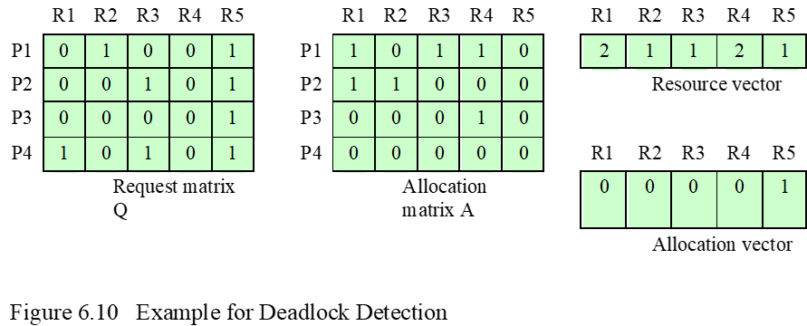
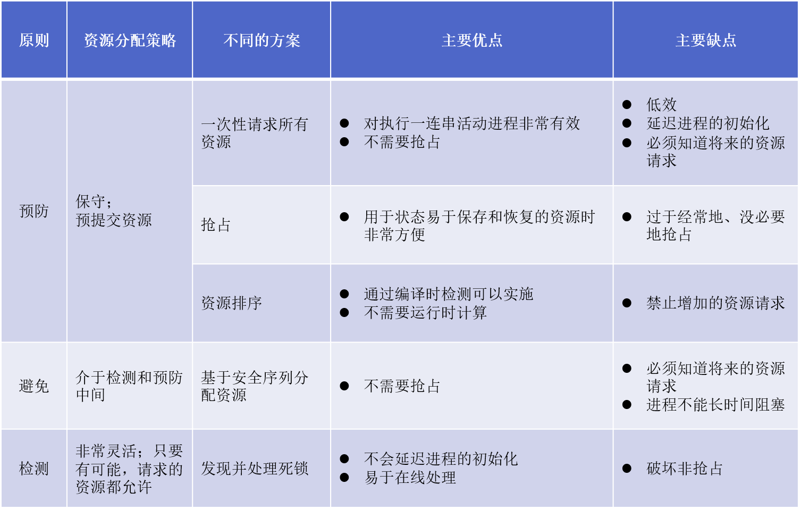

---
title: "OS第七章 死锁"
description: "死锁原理与解决方案"
date: "2023-10-26 10:01:45"
category: "计算机基础"
originalCategory: "计算机操作系统"
track: "Computer Science"
level: foundation
status: ready
published: true
minutes: 5
order: 1000
prerequisites: []
tags: ["OS", "进程"]
photos: "banner.jpg"
source: "_posts"
---# 死锁原理
## 死锁概念
- 定义：一组相互竞争系统资源或进行通信的进程间的永久阻塞
- 当一组进程中的每一个进程都在等待某事件，而只有同组进程中阻塞的进程能够触发该事件时，死锁发生
- 永久性
- 无有效的通用解决方案

## 资源的分类
### 可重用资源
- 一次仅供一个进程安全使用且不因使用而耗尽的资源
  - 处理器，I/O通道，内存外存，设备，文件，数据库，信号量
- 竞争可重用资源可能引起死锁


### 可消耗资源
- 可消耗资源是指被创建（生产）和销毁（消耗）的资源
  - 中断，信号，消息和I/O缓冲中的信息
- 竞争可消耗资源可能引起死锁


## 资源分配图

存在进程和资源的环导致死锁
### 死锁的条件
- 必要条件
  - 互斥：一次只有一个进程可以使用一个资源
  - 占有且等待：当进程等待其他资源时，继续占有已经分配的资源
  - 不可抢占：不能强行抢占进程已经占有的资源
- 充分条件
  - 循环等待：存在一个闭合的进程链，每个进程至少占有此链中下一个进程所需的资源
### 死锁的解决
- 死锁预防：防止死锁产生条件的发生
- 死锁避免：允许三个必要条件，根据当时资源分配状态来做出资源分配决策，保证不产生死锁
- 死锁检测与解除：不限制资源访问或约束进程行为，而是检测死锁的存在并尝试解除

# 死锁预防
设计一个系统来排除系统发生死锁的可能性

- 间接方法：防止三个必要条件中的任意一个条件发生
- 直接方法：防止循环等待的发生

## 互斥
如果需要对资源互斥访问，那么操作系统必须支持

即互斥不能禁止

## 防止占有且等待
要求进程一次性请求所有资源，并阻塞这个进程直到所有资源请求能够满足

- 低效：进程可能会阻塞很长时间，分配给进程的资源很长时间内不会被使用
- 事先不知进程所需的全部资源

## 防止不可抢占
一个占有某些资源的进程进一步申请资源时若被拒绝，则释放最初占有的资源；或操作系统要求另一个进程释放资源。

只有在资源状态容易保存和恢复情况下，这种方法才实用。

## 防止循环等待
定义一个请求资源的顺序；系统把所有资源按类型进行线性排队，所有进程对资源的请求必须严格按资源序号递增的顺序提出。

# 死锁避免
- 允许三个必要条件
- 动态检查：在系统运行时检查进程资源申请，根据检查结果决定是否分配资源
  - 若分配后系统可能发生死锁，则不予分配
  - 否则予以分配
- 需要预知资源的请求

## 资源分配拒绝
- 若一个进程增加的资源请求可能会导致死锁，则不允许这一资源的分配
- 设计思想：当用户申请一组资源时，系统必须做出判断：如果把这些资源分出去，系统是否还处于安全状态
  - 是则可以分配这些资源
  - 不是则暂时不分配，阻塞进程
- 系统的状态反映出当前给进程分配资源的情况
  - 安全状态：至少有一个资源分配序列（安全序列）不会导致死锁，所有进程都能够运行结束
  - 不安全状态：不存在安全序列
## 安全状态的确定

- 当前状态存在一个可以运行到结束的进程P2


- P2运行结束，资源释放
- P1可以运行到结束


- P1运行结束，资源释放

直至运行至所有进程结束

- 安全序列并不唯一
- 若系统处于安全状态且按照某个安全序列分配资源则不会出现死锁
- 并非所有不安全状态都是死锁状态
- 当系统进入不安全状态以后便可能进入死锁
- 避免死锁的实质在于如何避免不安全状态
## 死锁避免的代码
```
/* 全局数据结构 */
struct state{
  int resource[m];
  int available[m];
  int claim[m];
  int alloc[n][m];
}

/* 资源分配算法 */
if(alloc[i,*]+request[i] > claim[i,*])
  <error>;
else if(request[*] > available[*])
  <suspend process>
else {
  <define new state by :
  alloc[i,*] = alloc[i,*] + request[*];
  avaliable[*] = available[*] - request[*]>
}
if(safe(newstate))
  <carry out allocation>;
else {
  <restore original state>;
  <suspend process>;
}

/* 测试安全性算法 */
boolean safe (state S){
  int currentavail(m);
  process rest[<number of process>];
  currentavail = available;
  rest = {all process};
  possible = true;
  while(possible){
    <find a process Pk in rest such that
    claim[k,*] - alloc[k,*]<=currentavailable>;>
    if(found){
      currentavail = currentavail + alloc[k,*];
      rest = rest - {Pk};
    }
    else possible = false;
  }
  return rest == null;
}
```
## 死锁避免的优点
- 无需死锁预防中的抢占和回滚进程
- 比起死锁预防，限制少

## 死锁避免的使用限制
- 必须事先声明每个进程请求的最大资源
- 进程必须是独立的，它们之间没有同步的请求
- 分配资源的数量必须是固定的
- 占有资源时，进程不能退出

# 死锁检测与解除
- 死锁预防策略很保守：通过在进程上强加约束限制访问资源来预防死锁
- 死锁检测则相反：只要有可能，就给进程分配其所请求的资源
- 对死锁检测可以频繁的发生在每次资源请求时；也可以少检测，如定时检测，或系统资源利用率下降时检测，具体取决于死锁发生的可能性
- 死锁检测优点
  - 可尽早检测死锁
  - 算法相对简单
- 死锁检测缺点
  - 频繁的检测会耗费处理器相当多的时间
## 死锁检测算法步骤
1. 标记Allocation矩阵中一行全为0的进程
2. 初始化一个临时向量W，令W等于Available向量
3. 查找下标i，进程i当前未标记且满足Q（Q表示进程请求资源）的第i行小于等于W，即对所有的$1\leq k\leq m,Q_{ik}\leq W_k$，若找不到这样的行，终止算法
4. 若找到这样的行，标记进程i，并把Allocation矩阵中的相应行加到W中，即对所有$1\leq k\leq m$，令$W_k = W_k + A_{ik}$
5. 返回3

当且仅当最终有未标记进程时，才存在死锁，未标记的进程都是死锁相关进程


## 死锁检测：资源分配图
1. 在资源分配图中，找出其全部请求都能满足的进程节点Pi,消去Pi所有的请求边和分配边，使之成为孤立的结点
2. 重复步骤1直至无法化简为止


- 能消去图中所有的边，使所有进程结点都能成为孤立结点的资源分配图
- 当资源分配图不可完全化简时，存在死锁

## 死锁解除
- 撤销进程
  - 撤销所有死锁进程
  - 连续撤销死锁进程直到不再存在死锁
- 回退
  - 把进程回退到前面定义的某些检查点，并重新启动所有进程
- 抢占
  - 连续抢占资源直到不再存在死锁
- 取消哪些进程、抢占哪些进程的资源，选择原则：
  - 目前为止消耗处理器时间少，或输出少，或分配资源少，或剩余时间长，或优先级最低的进程

# 死锁预防、避免和检测方案小结


# 哲学家就餐问题
## 死锁
```
semaphore fork[5] = {1,1,1,1,1};
void main(){
  cobegin{philosopher(0);philosopher(1);philosopher(2);...philosopher(4);}coend;
}

void philosopher(int i){
  while(true){
    think;
    wait(fork[i]);
    wait(fork[(i+1)%5]);
    eat;
    signal(fork[i]);
    signal(fork[(i+1)%5]);
  }
}
```
## 活锁
```
semaphore fork[5] = {1,1,1,1,1};

void main(){
  cobegin{philosopher(0);philosopher(1);...philosopher(4);}
  coend;
}

void philosopher(int i){
  while(true){
    think;
    wait(fork[i]);
    timeout(wait(fork[(i+1)%5],[0,T]));
    eat;
    signal(fork[i]);
    signal(fork[(i+1)%5]);
  }
}
```
## 资源分级
```
semaphore fork[5] = {1,1,1,1,1};
void main(){
  cobegin{philosopher(0);philosopher(1);...philosopher(4);}
  coend;
}

void philosopher(int i){
  while(true){
    think;
    if(i!=4){
      wait(fork[i]);
      wait(fork[(i+1)%5]);
    }
    else {
      wait(fork[(i+1)%5]);
      wait(fork[i]);
    }
    eat;
    if (i!=4) {
      signal(fork[(i+1)%5]); signal(fork[i]);}
    else {
      signal(fork[i]); signal(fork[(i+1)%5]);}
    }
  }
}
```
```
semaphore fork[5] = {1, 1, 1, 1, 1};
void main()
{
  cobegin {philosopher(0); philosopher(1); philosopher(2); philosopher(3);philosopher(4);}
  coend;
}
void philosopher(int i)
{
  while(true) {
    think();
    if (i % 2 != 0) {
      wait(fork[i]); wait(fork[(i+1)%5]);}
    else {
      wait(fork[(i+1)%5]); wait(fork[i]);
    }
      eat();
    signal(fork[(i+1)%5]);
    signal(fork[i]);
  }
}
```
## 服务生方法
```
semaphore fork[5] = {1, 1, 1, 1, 1}, room = 4;
void main()
{
  cobegin {philosopher(0); philosopher(1); philosopher(2); philosopher(3); philosopher(4);}coend;
}
void philosopher(int i)
{
  while(true) {
    think;
    wait(room);
    wait(fork[i]);
    wait(fork[(i+1)%5]);
    signal(fork[i]);
    signal(fork[(i+1)%5]);
    signal(room);
  }
}
```
