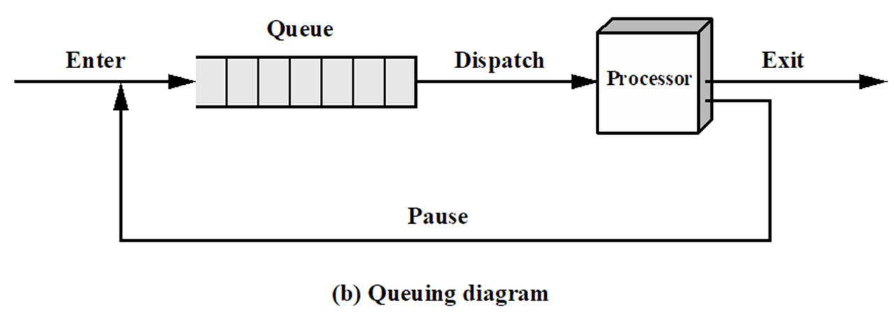
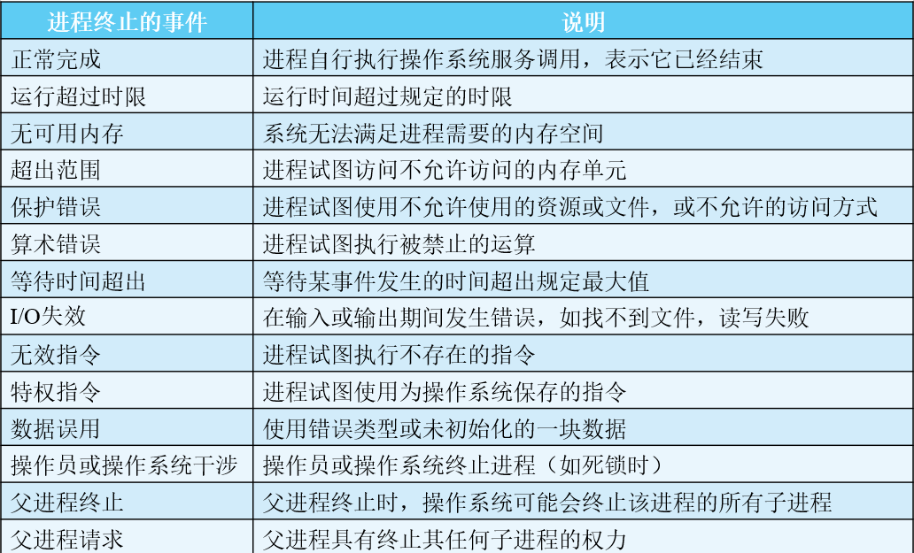
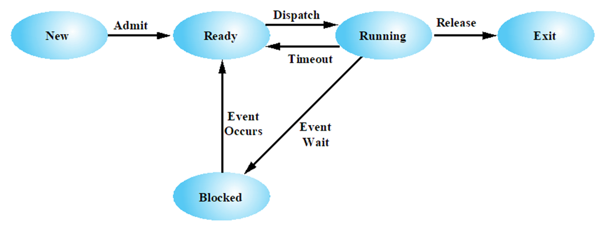
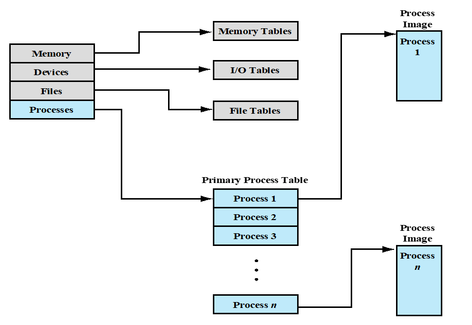

---
title: "OS第三章 进程描述与控制"
description: "第三章进程相关内容总结"
date: "2023-10-13 21:29:36"
category: "计算机基础"
originalCategory: "计算机操作系统"
track: "Computer Science"
level: foundation
status: ready
published: true
minutes: 9
order: 1000
prerequisites: []
tags: ["OS", "进程"]
photos: "banner.jpg"
source: "_posts"
---- 操作系统必须交替执行多个进程，在合理的响应时间范围内使处理器的利用率最大
- 操作系统必须按照特定的策略给进程分配资源，同时避免死锁
- 操作系统须为有助于构建应用的进程间通信和用户进程创建提供支持
# 什么是进程
## 操作系统管理应用程序的目标
- 资源对多个应用程序是可用的
- 物理处理器在多个应用程序间切换，以保证所有程序都在执行
- 处理器和I/O设备能得到充分利用
## 进程和进程块
### 进程的基本元素
- 程序代码
- 数据集
- 进程控制块(pcb)
### 进程的表征（进程的控制块）
- 标识符：与进程相关的唯一标识符，用来区分其他进程
- 状态：若进程正在执行，进程处于运行态
- 优先级：相对于其他进程的优先顺序
- 程序计数器：程序中即将执行的下一条指令的地址
- 内存指针：包括程序代码和进程相关数据的指针，以及与其他进程共享内存块的指针
- 上下文数据：进程执行时处理器的寄存器中的数据
- I/O状态信息：包含显示I/O请求、分配给进程的I/O设备和被进程使用的文件列表
- 记账信息：包括处理器时间总和、使用的时钟数总和、时间限制、记账户等
进程控制块包含了充分的信息，由此可以中断一个进程的执行，并为后来恢复进程的执行。
# 进程状态
进程轨迹：列出为进程执行的指令序列，可描述单个进程的行为，这样的序列称为进程轨迹。
## 两状态进程模型
- 运行态
- 非运行态
### 基本运行模式
1. 操作系统创建一个新进程时，它将该进程以未运行态加入系统，操作系统知道该进程的存在，并正在等待执行机会
2. 当前正在执行的进程不时地会被中断，此时操作系统中的分派器部分将重新选择一个新进程运行
3. 前一个进程从运行态转换为未运行态，后一个进程则转换为运行态

## 进程的创建与中止
### 进程的创建
将一个新进程添加到正被管理的进程集时，操作系统需要建立用于管理该进程的数据结构，并在内存中给它分配地址空间，这些行为构成了一个新进程的创建过程。
触发创建的原因：
  - 新的批处理作业：磁带或磁盘中的批处理作业控制流通常会提供给操作系统。当操作系统准备接受新工作时，将读取下一个作业控制命令。
  - 交互登录：终端用户登录到系统
  - 为提供服务由操作系统创建：操作系统可以创建进程，代表用户程序执行一个功能，使用户无需等待
  - 由现有进程派生：基于模块化的考虑或开发并行性，用户程序可以指示创建多个进程
    - 进程派生：当操作系统为另一个进程的显示请求创建一个进程时，这个动作就称为进程派生。
    - 当一个进程派生另一个进程时，前一个进程称为父进程，被派生的进程称为子进程。
### 进程终止
任何一个计算机系统都必须为其进程提供表示其完成的方法，批处理作业中应包含一个Halt指令或其他操作系统显示服务调用来终止。

## 五状态模型
### 状态
- 运行态：进程正在执行
- 就绪态：进程做好了准备，只要有机会就开始执行
- 阻塞/等待态：进程在某些事件发生前不能执行，如I/O操作完成
- 新建态：刚刚创建的进程，操作系统还未把它加入可执行的进程组，它通常是进程控制块已经创建但还未加载到内存中的新进程
- 退出态：操作系统从可执行进程组中释放出的进程，要么它自身停止，要么它因某种原因被取消
### 过程

- 空->新建：创建执行一个程序的新进程。
- 新建->就绪：操作系统准备好再接纳一个进程时，把一个进程从新建态转换到就绪态。
- 就绪->运行：需要选择一个新进程运行时，操作系统选择一个处于就绪态的进程，这是调度器或分派器的工作。
- 运行->退出：若当前正运行的进程表示自身已完成或取消，则它将被操作系统终止。
- 运行->就绪
  - 正在运行的进程已到达运行不中断执行的最大时间段；所有多道操作系统都实行了这种时间限制。
  - 操作系统给不同的进程分配不同的优先级，假设某处于阻塞态的进程优先级高于执行态的进程，当阻塞态进程等待事件完成后，操作系统中断正在执行的进程，进入就绪态，将处理器分派给阻塞态的进程。
  - 进程自愿释放对处理器的控制
- 运行->阻塞：进程请求其必须等待的某件事情时，则进入阻塞态
- 阻塞->就绪：所等待的事件发生时，处于阻塞态的进程转换到就绪态
- 就绪->退出：在某些系统中，父进程可在任何时间终止一个子进程；若父进程中止，则与该父进程相关的所有子进程都将被终止。
- 阻塞->退出
## 被挂起的进程
### 交换的需要
内存中保存有多个进程，当一个进程被阻塞时，处理器可移向另一个进程，但由于处理器远快于I/O，会出现内存中的所有进程都在等待I/O的现象。因此即使是多道程序设计，处理器多数时间仍可能处于空闲状态。
- 方案一：扩充内存来容纳更多进程，成本高
- 方案二：把内存中某个进程的一部分或全部移到磁盘中。当内存不存在就绪态的进程时，操作系统就把阻塞态的进程换到磁盘中的挂起队列，即临时从内存中踢出的进程队列。操作系统要么从挂起队列中取出另一个进程，要么接受一个新进程的请求，将其放入内存运行。
### 新状态
- 阻塞/挂起态：进程已在外存中并等待一个事件
- 就绪/挂起态：进程已在外存中，但只要载入内存就可执行
### 新模式
- 阻塞->阻塞/挂起
  - 若没有就绪进程，则至少换出一个阻塞进程，以便为另一个未阻塞进程腾出空间。即使没有可用的就绪态进程，也能完成这种转换。
  - 若操作系统需要确定当前正运行的进程，或就绪进程为了维护基本性能而需要更多的内存空间，则会挂起一个阻塞的进程。
- 阻塞/挂起->就绪/挂起：若等待的事件发生，则处于阻塞/挂起态的进程可转换到就绪/挂起态。注意，此时要求操作系统必须得到挂起进程的状态信息。
- 就绪/挂起->就绪：若内存中没有一个就绪态进程，则操作系统需要调入一个进程继续执行。
  - 当处于就绪/挂起态的进程比就绪态进程的优先级更高时，也可执行这种转换
- 就绪->就绪/挂起
  - 通常，操作系统更倾向于挂起阻塞态进程而非就绪进程，因为就绪态进程可以立即执行，而阻塞态进程虽然占用了内存空间但不能立即执行。
  - 若释放内存来得到足够空间的唯一方法是挂起一个就绪态进程，则这种转换也是必需的。
  - 若操作系统确信高优先级的阻塞态进程很快将会就绪，则它可能会选择挂起一个低优先级的就绪态进程，而非一个高优先级的阻塞态进程。
- 新建->就绪/挂起 新建->就绪
  - 创建一个新进程，该进程要么加入就绪队列，要么加入就绪/挂起队列
  - 操作系统可能更倾向于在初期执行这些辅助工作，以便能维护大量的未阻塞进程
  - 采用这种策略时，经常出现无足够空间分配给新进程的情况，因此使用了新建->就绪/挂起转换
  - 尽可能推迟创建进程以减小系统开销，并在系统被阻塞态进程阻塞时，允许操作系统执行进程创建任务
- 阻塞/挂起->阻塞：一个进程终止会释放一些内存空间，而阻塞/挂起队列中有一个进程的优先级要比就绪/挂起队列中任何进程的优先级都高，并且操作系统有理由相信阻塞进程的事件很快就会发生，这是把阻塞进程而非就绪/挂起进程调入内存是合理的。
- 运行->就绪/挂起
  - 当一个运行进程的分配时间到期后，它将转换到就绪态
  - 阻塞挂起队列中具有较高优先级的进程不再被阻塞时，操作系统就会抢占这个进程，或直接把这个运行进程转换到就绪/挂起队形中，并释放一些内存空间
- 各种状态->退出
### 挂起进程的特点
- 该进程不能立即执行。
- 该进程可能在也可能不在等待一个事件。若在等待一个事件，则阻塞条件不依赖于挂起条件，阻塞事件的发生不会使进程立即执行。
- 为阻止该进程执行，可通过代理使其置于挂起态，代理可以是进程本身，也可以是父进程或操作系统。
- 除非代理显式地命令系统进行状态切换，否则该进程无法从这一状态转移。
### 进程挂起的原因
- 交换：操作系统需要释放足够的内存空间，以调入并执行处于就绪态的进程
- 其他OS原因：操作系统可能挂起后台进程或工具程序进程，或挂起可能会导致问题的进程
- 交互式用户请求：用户希望挂起一个程序的执行，以便进行调试或关联资源的使用
- 定时：进程可被周期性地执行，并在等待下一个时间间隔时挂起
- 父进程请求：父进程可能会希望挂起后代进程的执行，以检查或修改挂起的进程，或协调不同后代进程之间的行为
- 交互用户的行为
# 进程描述
## 操作系统的控制结构
- 操作系统为了管理进程资源必须掌握每个进程和资源的当前状态。普遍采用的方法是，操作系统构造并维护其管理的每个实体信息表。
- 操作系统维护4种不同类型的表：内存、I/O、文件和进程

### 内存表
用于跟踪内（实）存和外（虚）存。内存的某系部分为操作系统保留，剩余部分供进程使用，外存中保存的进程使用某种虚存或简单的交换机制。
  内存表必须包含以下信息：
  - 分配给进程的内存
  - 分配给进程的外存
  - 内存块或虚存块的任何保护属性
  - 管理虚存所需要的任何信息
### I/O表
操作系统使用I/O表管理计算机系统中的I/O设备和通道。在任意给定时刻，某个I/O设备要么可用，要么已分配给特定的进程。正在进行I/O操作时，操作系统需要知道I/O操作的状态，以及作为I/O传送的源与目标的内存单元。
### 文件表
文件表提供关于文件是否存在、文件在外存中的当前状态和其他属性信息。
## 进程控制结构
### 进程位置
操作系统需要知道每个进程在磁盘中的位置，并知道每个进程在内存中的位置。
### 进程属性
- 进程控制块：进程的属性集
  - 进程标识信息
    - 该进程的标识符
    - 创建该进程的进程的标识符
    - 用户标识符
  - 进程状态信息
    - 用户可见寄存器：处理器在用户模式下执行机器语言时可以访问的寄存器
    - 控制和状态寄存器：
      - 程序计数器：包含下一条待取指令的地址
      - 条件码：最近算术或逻辑运算的结果
      - 状态信息：包含中断允许/禁用标志、执行模式
    - 栈指针：每个进程有一个或多个与之相关联的后进先出系统栈。栈用于保存参数和过程调用或系统调用的地址，栈指针指向栈顶
  - 进程控制信息
    - 调度和状态信息
    - 数据结构
    - 进程间通信
    - 进程特权
    - 存储管理
    - 资源所有权和使用情况
- 进程映像：程序、数据、栈和属性的集合为进程映像
# 进程控制
## 执行模式
- 非特权模式：用户模式
- 特权模式：系统模式、控制模式或内核模式
使用两种模式的原因是：保护操作系统和重要的操作系统表不受用户程序的干扰
### 内核模式的典型功能
- 进程管理
  - 进程的创建和终止
  - 进程的调度和分派
  - 进程切换
  - 进程同步和进程间的通信支持
  - 管理进程控制块
- 内存管理
  - 为进程分配地址空间
  - 交换
  - 页和段管理
- I/O管理
  - 缓冲区管理
  - 为进程分配I/O通道和设备
- 支持功能
  - 中断处理
  - 记账
  - 监视
### 处理器分辨模式
通常存在一个指示执行模式的位，该位会因事件的改变而变化。
- 当用户调用一个操作系统服务或中断来触发系统例程的执行时，执行模式将被置为内核模式
- 当系统服务返回到用户进程时，执行模式将被置为用户模式
## 进程创建
1. 为进程分配一个唯一的进程标识符
2. 为进程分配空间
3. 初始化进程控制块
4. 设置正确的链接
5. 创建和扩充其他数据结构
## 进程切换
### 何时切换进程
- 中断：来自当前执行指令的外部；对异步外部事件的反应
  - 时钟中断
  - I/O中断
  - 内存失效
- 陷阱：与当前执行指令相关；处理一个错误或一个异常条件
- 系统调用：显示请求；调用操作系统函数
### 模式切换（出现中断）
1. 将程序计数器置为中断处理程序的开始地址
2. 从用户模式切换到内核模式，以便中断处理代码包含特权指令
现在处理器现在继续取指阶段，并取中断处理程序的第一条指令来服务该中断；此时将已中断进程的上下文保存到已中断程序的进程控制块中。

若中断发生后不进行进程切换：
3. 控制权返回给被中断程序时恢复处理器状态信息
### 进程切换的步骤
1. 保存处理器的上下文，包括程序计数器和其他寄存器
2. 更新当前处于运行态进程的进程控制块，包括把进程的状态改变为另一状态；还须更新其他相关的字段，包括退出运行态的原因和记账信息。
3. 把进程的进程控制块移到相应的队列。
4. 选择另一个进程执行。
5. 更新所选进程的进程控制块，包括把进程的状态改为运行态
6. 更新内存管理数据结构。是否需要更新取决于管理地址转换的方式
7. 载入程序计数器和其他寄存器先前的值，将处理器的上下文恢复为所选进程上次退出运行态时的上下文
### unix进程的创建
fork()函数：
1. 在进程表中为新进程分配一个空项
2. 为子进程分配一个唯一进程标识符
3. 复制父进程的进程映像，但共相内存除外
4. 增加父进程所拥有文件的计数器，反映另一个进程现在也拥有这些文件的事实
5. 将子进程置为就绪态
6. 将子进程的ID号返回给父进程，将0值返回给子进程
