# 基本概念
- 虚拟内存：在存储机制中，辅存可以被看作是主存的一部分来完成寻址。程序使用的地址与内存系统用于识别的物理存储的地址是不同的，程序生成的地址会自动转换为机器地址，虚拟存储的大小受计算机系统寻址机制和可用的辅存容量限制，而不受主存储实际大小的限制
- 虚拟地址：在虚拟内存中分配给某一位置的地址，它使得该位置可被访问，就好像是主存的一部分那样。有时也称为逻辑地址。
- 虚拟地址空间：分配给进程的虚拟存储
- 地址空间：用于某进程的内存地址范围
- 实地址：内存中存储位置的地址

# 硬件和控制结构
## 分页和分段内存管理的两个基本特征
- 进程中所有的内存访问都是逻辑地址，这些逻辑地址会在运行时动态地转换为物理地址
- 一个进程可划分为许多块，在执行过程中，这些块不需要连续地位于内存中

## 进程的执行过程
- 操作系统仅读取包含程序开始处的一个或几个块进入内存
- 任意时刻，进程驻留在内存中的部分——驻留集
- 访问一个不在内存中的逻辑地址时，称为内存失效，产生一个中断
- 操作系统把被中断的进程置为阻塞态
- 操作系统把该进程中包含引发内存失效的部分读入内存
  - 操作系统产生一个磁盘I/O读请求
  - 在执行磁盘I/O期间，操作系统调度另外一个进程运行
  - 磁盘I/O完成后产生中断，操作系统将相应的进程置于就绪状态

## 提高系统资源利用率的方法
- 内存中保留多个进程
  - 每个进程仅装入了部分块
  - 在任何时刻内存中的进程至少有一个处于就绪状态
  - 提高了处理器的利用率
- 进程可以比内存的全部空间还大
  - 基于分页和分段的技术，操作系统和硬件只加载程序的一部分
  - 程序员面对的是一个巨大内存，大小与磁盘存储器相关

## 分页和分段在不同情况下的特点

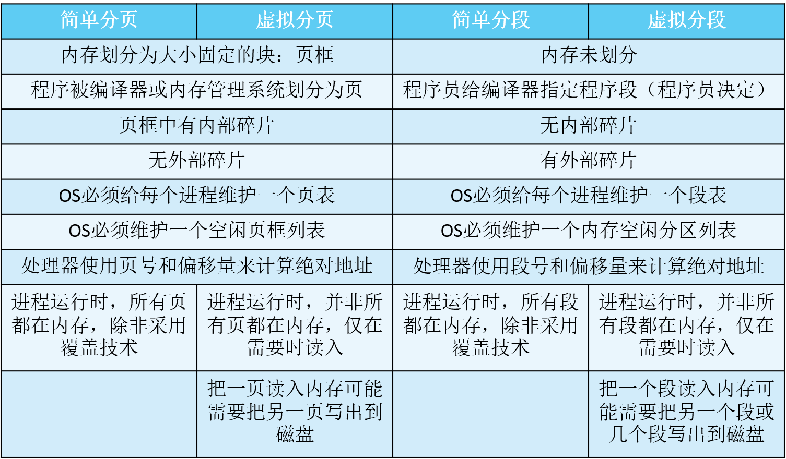

## 局部性和虚拟内存
- 进程只有部分块在内存，这样可在内存中保留更多进程
- 当内存空间几乎被进程块占据时，每读取一块，必须把另一块换出，可能出现抖动
  - 抖动：将要用到的块被换出，系统又很快将它取回，导致页面被频繁地换入换出，缺页率急剧增加

### 局部性原理
- 存储器的访问呈簇性，簇在很长一段时间内，使用的簇会发生变换，但在很短的时间内，处理器基本上只与固定的簇打交道
- 描述了进程中程序和数据引用的集簇倾向
- 在很短的时间内仅需要进程的一部分块
- 对将来可能访问的块进行猜测，以避免抖动

## 分页
- 虚拟内存通常与使用分页的系统联系在一起
- 每个进程都有自己的页表
  - 分页的虚存方案中，页表项变得更复杂

### 页表项
- 存在位P：表明对应的页是否在内存
- 页框号：若页在内存，则有对应的页框号
- 修改位M：表明相应页上次装入内存到限制是否已被修改过
  - 是，换出时更新辅存上对应页
  - 否，换出时不必更新

### 分页系统中的地址转换
- 页表位于内存
- 进程运行时，一个寄存器保护页表的起始地址
- 虚拟地址的页号用于检索页表，查找对应页框号
- 页框号与虚拟地址的偏移量结合起来形成物理地址

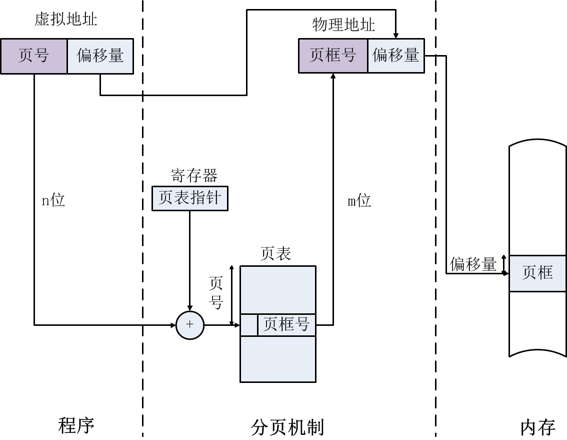

### 多级页表
- 庞大页表需要离散存储
- 将页表进行分页，典型情况下，每页大小最大限制与进程分页大小一致，如pentium处理器
- 建立页目录，每项指向一页页表
- 如果页目录长度为X，一个页表的包含的页表项数为Y，则一个进程可以有XY页

### 两级分页的逻辑地址结构

### 两级分页中的地址转换
- 虚拟地址（逻辑地址）结构中分离出根页标号
- 检索根页表，查找关于用户页的页表项
  - 如果不在内存，产生一次 缺页中断
  - 若在内存，用虚拟地址中间页号，检索用户页表，查找对应的页表项
- 得到页框号，和页内偏移量一起形成物理地址

#### 二级页表示例一

$2^{16}/(2^{10}/2) = 128$

#### 二级页表示例二

80x86硬件分页地址，32位逻辑地址空间、4KB页面、4B页表项，如何将逻辑地址0x20021406转换为物理地址？

- 将逻辑地址转为二进制：0010 0000 0000 0010 0001 0100 0000 0110
- 4KB页面说明，页内偏移占12位，即0100 0000 0110
- 一个页面可用装入$2^10$个页表项，二级页表字段占10位即00 0010 0001
- 顶级页表占10位，即0010 0000 00

#### 二级页表示例三

32位逻辑地址空间、4KB页面、4B页表项、求逻辑地址4197721的物理地址？
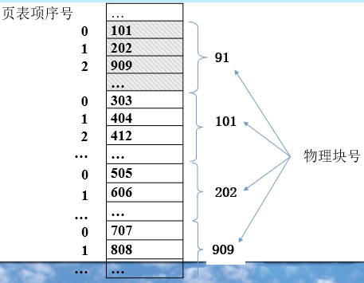

- 页内偏移：$4197721 mod 4096 = 3417$
- 顶级页表：$1024 / (4KB/4B) = 1$，物理块号为202
- 二级页表：第0项，505
- 最终：$505 \times 4096+3417 = 2071897$

#### 二级页表示例四
32位逻辑地址空间、4KB页面、4B页表项，物理地址2485593的逻辑地址？

- 页内偏移：$2485593 mod 4096 = 3417$
- 页框号：$2485593 / 4096 = 606 ... 3417$，606为页框号
- 位于202号物理块，则顶级页表偏移1，二级页表偏移1
- 顶级页表与二级页表占10位
- $1 \times 2^{22} + 1 \times 2^{12} + 3417 = 4201817$

### 倒置页表
- 虚拟地址的页号部分使用一个简单的散列函数映射到散列中
  - 哈希值指向倒排页表
- 无论有多少进程、支持多少虚拟页，页表都只需要实存中的一个固定部分
- 页表结构称为倒置的原因是，它使用页框号而非虚拟页号来索引页表项

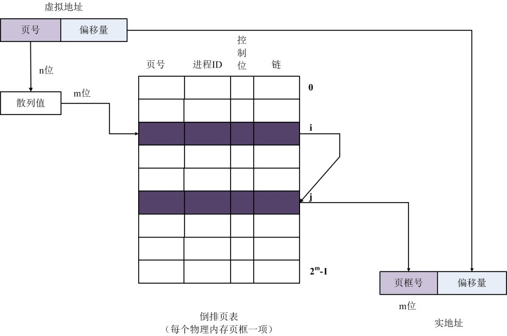

### 转换检测缓冲区TLB(快表)

- 每次虚存访问都可能会引起两次物理地址访问
  - 一次取相应的页表项
  - 一次取需要的数据
- 为克服上述问题，大多数虚拟内存方案都为页表项使用了一个高速缓存，称为TLB
  - 包含最近使用过的页表项

#### TLB地址转换流程
- 给定一个虚拟地址，处理器首先检查TLB
- 若命中：即页表项在TLB中，检索页框号形成物理地址
- 若未命中：即页表项不在TLB中，检索进程页表，查找相应页表项
  - 若存在位已置位，页位于内存，用页框号+偏移量形成物理地址，同时更新快表
  - 若存在位未置位，页不在内存，产生缺页中断，装入所需页，更新页表

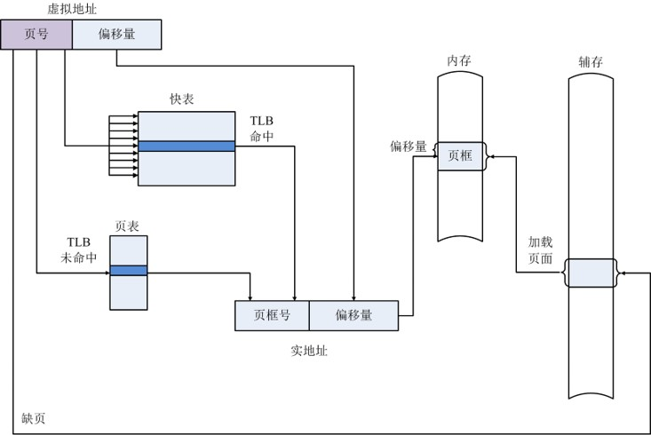

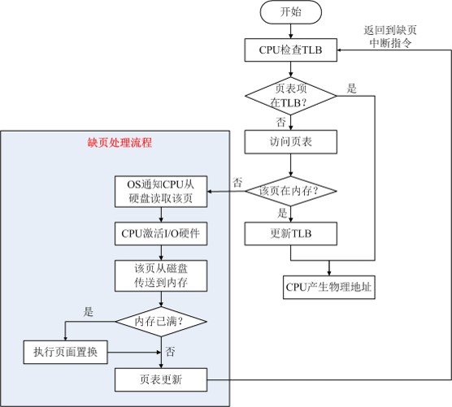

#### TLB查找
- TLB包含整个页表中的部分表项，因此不能简单把页号编入TLB索引，必须包含页号和完整的页表项
- 处理器的硬件机制允许同时查询许多TLB页，以确定是否存在匹配的页号

#### TLB操作和内存高速缓存操作
单次访问内存设计CPU硬件的复杂性
- 页表项可能在TLB中，也可能在内存或磁盘中
- 被访问的字可能在高速缓存中，也可能在内存或磁盘中

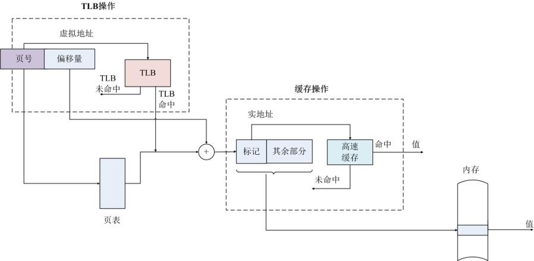

### 页尺寸
- 页越小，内部碎片的总量越小
- 页越小，每个进程需要的页的数量越多
- 页数量越多，进程的页表越大
- 对于多道程序设计，这意味着某些活动进程可能有一部分页表在虚存而非内存，则一次内存访问可能产生两次缺页中断
  - 一次读取所需页表
  - 一次读取进程页
- 基于大多数辅存设备的物理特性，希望页尺寸较大，从而实现更有效的数据传输

#### 缺页率与页尺寸、分配页框数
- 页尺寸很小时，缺页率低
- 页尺寸增加时，缺页率增加
- 页尺寸较大时，缺页率下降
- 对固定的页尺寸，当分配给进程的页框数增加时，缺页率下降

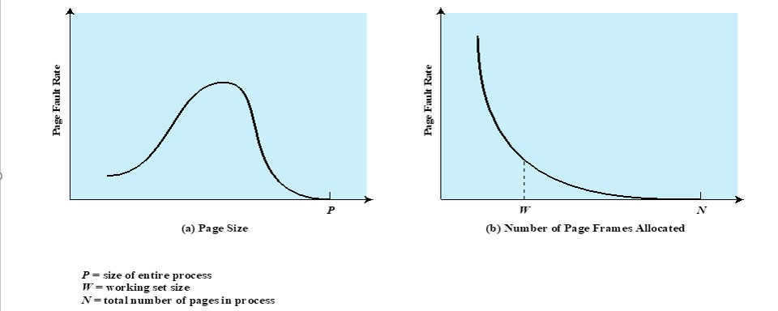

## 分段
- 允许程序员把内存视作由多个地址空间或段组成
- 段大小不等，可以动态变化
- 内存访问：段号+段内偏移量
- 优点
  - 简化了对不断增长的数据结构的处理
  - 允许程序独立地改变或重新编译
  - 有助于进程间的共享
  - 有助于保护

### 段的组织
- 存在位P，标识相应的段是否位于内存
  - 若存在，段表项包含：段基址，段长度
- 修改位M，标识相应的段是否已被修改
  - 是，换出时需要写回辅存
  - 否，换出时不需写回
- 其他控制位，如用于保护和共享

### 分段系统中的地址转换
- 逻辑地址 = 段号+段内偏移量，寄存器存储段表地址
- 根据段表地址和段号查找段表，找到相应段在内存中的及地址
- 得到物理地址=基地址+段内偏移量

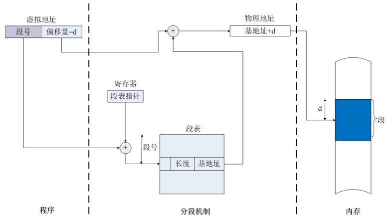

## 段页式
用户的地址空间被程序员划分为许多段，每段划分为许多固定大小的页
- 分段对程序员可见
  - 支持数据结构增长
  - 段长可变
  - 支持共享和保护
- 分页对程序员透明
  - 消除外部碎片
  - 有效利用内存

### 段页式的逻辑地址
- 程序员角度：逻辑地址 = 段号 + 段内偏移
- 系统的角度：段内偏移 = 页号 + 页内偏移
- 每个进程一个段表
- 每个段一个页表
- 段表项：包含段长和对应页表的起始地址
- 页表项：含页框号、存在位P、修改位M

### 段页式地址转换
- 虚拟地址 = 段号 + 页号 + 偏移量，寄存器存放段表起始地址
- 根据段表起始地址和段号查找段表，得到对应段的页表起始地址
- 根据页表起始地址和页号查找页表，得到页框号
- 页框号和偏移量构成物理地址

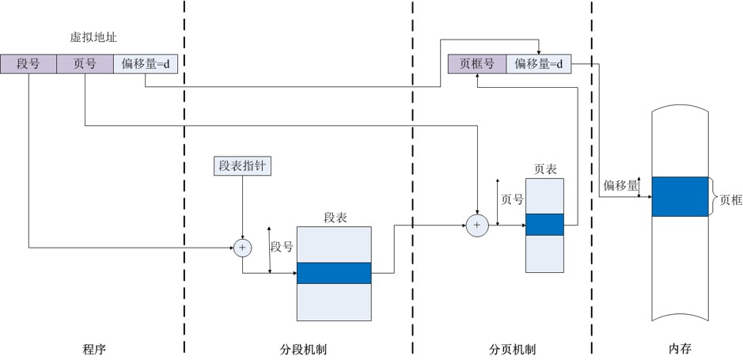

## 保护和共享
- 保护：每个段都包含一个长度和一个基地址，可以控制非法访问
- 共享：一个段可以在多个进程的段表中被引用，实现共享

# 操作系统软件
内存管理设计的三个基本选择：
- 是否使用虚拟技术
- 使用分页还是分段或者二者同用
- 为各种存储管理特征采用的算法

## 读取策略
决定某页何时进入内存
### 请求调页
- 仅在引用页面时，才把相应的页面调入内存
- 进程首次启动时，会发生很多缺页中断
- 局部性原则表明，大多数将来访问的页面都是最近读取的页面，一段时间后，缺页中断会降低到很低的水平

### 预调页
- 额外读取所缺页面以外的页面
- 考虑大多数辅助存储设备的特性
- 若进程的页面连续存储在辅存中，则一次读取多个页面会更有效
- 如果额外读入的页面未使用，则低效

## 置换策略
- 确定进程驻留在内存中的位置
- 分段系统中的重要设计内容，如首次匹配、循环匹配等
- 分页或段内分页是无关紧要的，因为硬件以相同的效率执行地址转换功能
- 对于非一致存储访问多处理器，需要自动放置策略

### 相关问题
- 给每个活动进行分配多少个页框
- 置换范围，即计划置换的页集局限于产生缺页的进程本身，还是内存内的所有进程
- 具体淘汰哪个页面用以置换

### 页框锁定
- 当页框锁定时，当前存储在该页框中的页面不能被置换
- 操作系统内核和重要的数据结构保存在锁定的页框中
- I/O缓冲区和时间要求严格的区域可能保存在锁定的页框中
- 通过将锁定位与每个页框相关联来实现

### 选择置换页的基本算法
- 最佳OPT
  - 置换下次访问距当前时间最长的页面
  - 理想算法，缺页率最少

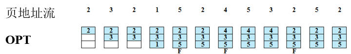

- 最近最久未使用(LRU，最近最少使用)
  - 置换内存中最长时间未引用的页面
  - 根据局部性原理，这也是最近最不可能访问的页面
  - 难以实施
    - 每页添加最近访问时间戳——开销大
    - 建立链表——开销大

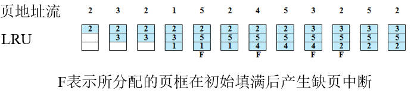

- 先进先出(FIFO)
  - 将分配给进程的页框视为循环缓冲区
  - 页面将以循环方式删除——简单的置换策略
  - 置换驻留在内存中时间最长的页面
  - Belady异常
    - 分配的页框数增加，缺页中断次数有时反而增加
    - 页地址流：1 2 3 4 1 2 5 1 2 3 4 5
    - 页框数为3：缺页中断9次；页框数为4：缺页中断10次

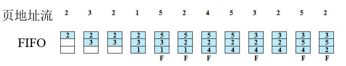

- 时钟置换(CLOCK)
  - 每个页框关联一个使用位
  - 当页面首次加载到内存中，或被引用时，使用位设置为1
  - 用于置换的候选页框视作一个循环缓冲区
  - 发生缺页中断时，首先检查表针指向页面，如果使用位为0，则新页面替换之；如果使用位为1，则清0，表针前移一个位置，重复上述过程

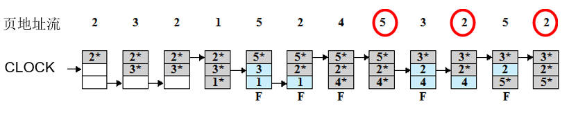

- 改进型时钟置换
  - 考虑页面修改情况
  - 页面分类（u表示访问位，m表示修改位）
    - 一类：最近未被访问，又未被修改，最佳淘汰页
    - 二类：最近未被访问，但已被修改页
    - 三类：最近已被访问，但未被修改
    - 四类：最近已被访问且被修改，最不应淘汰页
  - 算法实现
    - 选择最佳淘汰页面
    - 如果选择最佳淘汰页面失败，寻找第2类页面，并把所有扫描过的页面的访问位u置0
    - 如果选择第2类页面失败，返回第一步
  - 改进型时钟置换算法实现简单，性能比较理想，被广泛采用

## 驻留集管理
### 驻留集大小
- 操作系统必须决定将多少页面带入主内存
- 分配给每个进程的内存量越小，可以驻留在内存中的进程数量越多
- 加载少量页面会增加缺页
- 超出一定大小，进一步分配页面不会影响缺页率
- 固定分配
  - 在主存储器中为进程提供固定数量的帧以在其中执行
  - 发生缺失时，必须替换该进程的其中一个页面
- 可变分配
  - 允许分配给进程的页面帧数在进程的生命周期内变化

### 置换范围
- 置换策略的作用范围分为全局和局部两类
- 两种类型策略的实施都是在没有空闲页框时由缺页中断激活
- 局部置换：仅在产生缺页中断的进程的驻留页中选择置换对象
- 全局置换：在整个内存中选择置换对象，只要不是锁定的页，都可以作为候选页

### 管理方法

- 固定分配、局部置换
  - 需要事先确定分配给一个进程的页框数量
  - 如果给进程分配的数量太小，将会产生较高的缺页率
  - 如果分配的页框数太多，内存中只能有较少的程序
    - 增加了处理器的空闲时间
    - 增加了花在交换上的时间
- 可变分配、全局置换
  - 最容易实现的方法，在很多操作系统里采用
  - 操作系统维护一个空闲页框列表
  - 当缺页中断发生，一个空闲页框分配给缺页的进程
  - 如果没有空闲页框，操作系统必须选择一个内存中的页框，作为置换对象
  - 如果选择置换对象不当，将容易再次发生缺页中断，使用页缓冲可以解决这个问题
- 可变分配、局部置换
  - 当一个新进程装入内存时，分配一定数量的页框作为它的驻留集
  - 当缺页中断发生时，从进程驻留集中选择一页用于置换
  - 不时重新评估进程的页框分配情况，增加或减少分配的页框，以提高整体性能

### 工作集
- 进程在虚拟时间t的参数Δ的工作集W(t,Δ)，表示该进程在过去的Δ个虚拟时间单位被访问到的页集合
- 用进程访问内存的次数来衡量虚拟世界t，例如进程一系列的内存访问为r(1),r(2),...,r(i)，r(i)表示第i次对内存页的访问，对应的虚拟时间1,2,..,i。
- 虚拟时间窗口越大，则工作集越大$W(t,\delta + 1) \supseteq W(t,\delta)$
- 工作集策略
  - 根据工作集来决定驻留集的大小
  - 周期性的从驻留集中移去不在工作集中的页
  - 只有驻留集包含工作集时，才执行进程
  - 缺点
    - 工作集大小随时间变化
    - 给每个进程测量工作集不现实，Δ最优值未知
  - 近似工作集策略的应用
    - 用缺页率导致驻留集
    - 缺页率低于某个阈值，减小驻留集
    - 缺页率超过某个阈值，增加驻留集
- 平均访问时间：缺页率p，内存访问时间为ma，发生缺页访问时间为da，则平均访问时间为$(1-p)ma+p \times da$
- 有效访问时间
  - 缺页服务时间
  - 进程重新执行时间
  - 页面调入时间：寻道时间+旋转时间+数据传送时间

## 清除策略
用于确定何时将修改过的页写回辅存
- 请求式清除：只有当一页被选择用于置换时才被写回辅存
  - 发生缺页中断的进程在解除阻塞前需等待两次页传送，写回修改页和读入新页
- 预约式清除：将修改的多页在需要使用它们占据页框之前，成批写回辅存
  - 预先写回辅存的页，在置换前可能又会被修改，使得预清除意义不大
- 结合页缓冲技术
  - 只清除用于置换的页
  - 通过页缓冲，将置换的页放在已修改表和未修改表中，已修改表中的页可以成批写回辅存

## 加载控制
- 决定驻留在内存中的进程数量
- 对于有效的内存管理来讲非常重要
- 内存驻留的进程太少，当所有进程阻塞时，大量时间花在交换上
- 内存驻留的进程太多会导致抖动

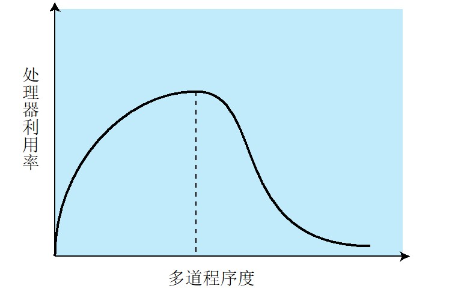

### L=S准则
发生缺页的平均时间L等于处理缺页故障的平均时间S，此时处理器的利用率最大
### 控制多道程序度
- 需挂起一个或多个驻留进程
- 选择进程挂起
  - 最低优先级进程
  - 缺页中断的进程
  - 最后被激活的进程
  - 最小驻留集的进程
  - 最大空间的进程
  - 最大剩余执行时间的进程
