# 为什么需要进程调度
如果有多个进程（线程）竞争CPU，需要选择下一个运行的进程（线程）
## 调度程序
OS中在面临多个进程（线程）竞争CPU的情况下，完成选择运行的进程（线程）的工作的程序叫做调度程序。

调度程序使用的算法称为调度算法。
# 处理器调度
## 目的
满足系统目标（响应时间、吞吐量、处理器效率）的方式，把进程分配到一个或多个处理器上执行。
## 分类
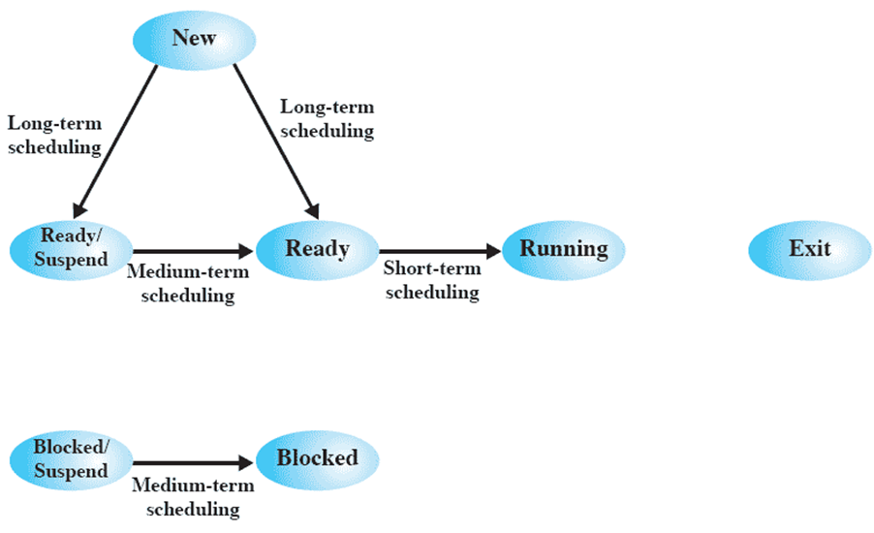
### 长程调度
- 决定哪个程序可以进入系统中等待处理
- 控制系统中并发的度
  - 创建的进程越多，每个进程执行的时间比例越少
  - 可能限制并发的度，给当前进程集提供满意的服务
- 从作业队列中选择并创建进程
  1. 何时操作系统接纳一个或多个进程
  2. 接纳哪个作业并为之创造进程
     - 先来先服务
     - 优先级、期望执行时间、I/O
### 中程调度
- 交换功能的一部分
- 换入决定取决于系统并发度的需求
- 在不使用虚存的进程中，换入决策还需考虑换出进程的存储需求
### 短程调度
- 目标：按照优化系统某些方面的方式，分配处理器时间
- 称为分派程序
- 执行最为频繁
- 精确决定下次执行哪个进程
- 导致当前进程阻塞或抢占当前运行进程的事件发生时，调用短程调度程序
  - 时钟中断
  - I/O中断
  - 系统调用
  - 信号

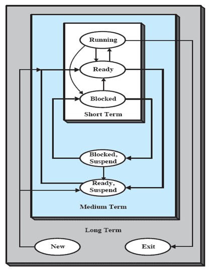
# 调度规则
## 调度相关概念
- 响应时间：从用户提交请求开始，到接收响应之间的时间间隔
- 截止时间：某任务必须开始执行或必须完成的最迟时间
- 处理器利用率：处理器处于忙状态时间的百分比
- 周转时间（驻留时间）：一个进程从被提交到完成之间的时间间隔
  - 驻外存等待调用的时间+驻内存等待调用的时间+执行时间+阻塞时间
- 平均周转时间：多个进程周转时间的平均值
- 带权周转时间（归一化周转时间）：进程的周转时间与系统为它提供服务的时间之比
- 平均带权周转时间：多个进程带权周转时间的平均值
## 分类
### 用户与系统
- 面向用户的调度规则
  - 与单个用户或进程感知到的进程行为有关，如交互系统的响应时间
  - 在所有系统中都很重要
- 面向系统的调度规则
  - 关注处理器的利用率
  - 在单用户系统里重要性要低一些
### 性能相关与否
- 性能相关
  - 可量化
  - 易预测
- 性能无关
  - 公平性
  - 不易测量
### 总结
- 面向用户 性能相关
  - 周转时间
  - 响应时间
  - 截止时间
- 面向用户 性能无关
  - 可预测
- 面向系统 性能相关
  - 吞吐量
  - 处理器利用率
- 面向系统 性能无关
  - 公平性
  - 强制优先级
  - 平衡资源
# 调度的决策模式
## 分类
### 非抢占（非剥夺）
执行进程只在执行完毕，或因申请I/O或请求某些操作系统服务而阻塞自己，才释放处理器。
### 抢占（剥夺）
- 执行进程可能被操作系统中断，并转换为就绪态
- 抢占时机
  - 新进程到达
  - 时钟中断
  - 中断发生后把一个阻塞进程置为就绪态
## 选择函数
- 决定下次选择哪个就绪进程执行
- 可以基于优先级、资源需求或进程的执行特性
- 基于执行特性时的关键参数
  - w=目前为止在系统等待的时间
  - e=目前为止花费的执行时间
  - s=进程所需的总服务时间
# 调度算法
根据系统的资源分配策略所规定的资源分配算法

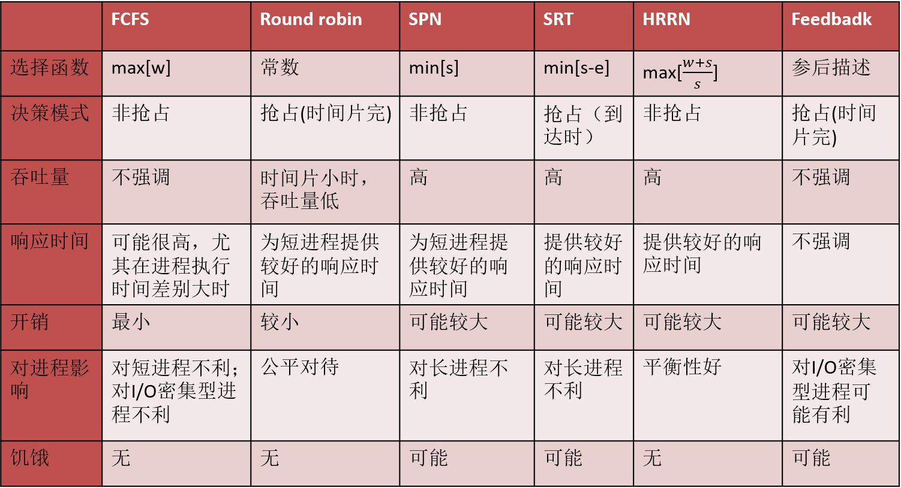
## 先来先服务(FCFS or FIFO)
选择就绪队列中存在时间最长的进程执行，即按请求CPU的顺序使用CPU

### 示例
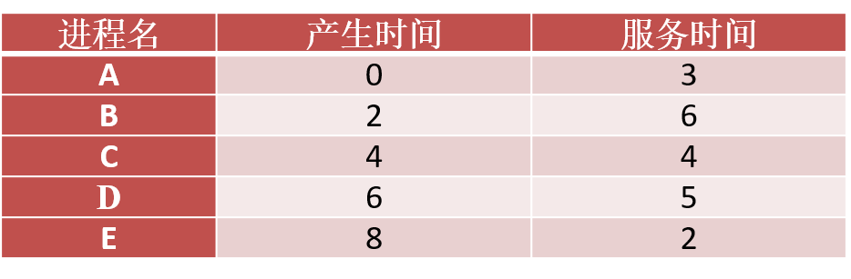

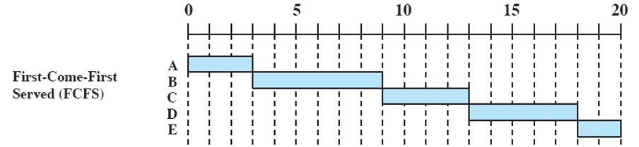

- 平均周转时间：8.6
- 平均带权周转时间：2.56
### 评价
- 属于非抢占调度方式
- 有利于CPU繁忙型的进程，不利于I/O繁忙型的进程
- 不适合直接用于单处理器系统，通常与其他调度算法混合使用
- 平均周转时间长
- 对长进程有利，不利于短进程
## 时间片轮转调度算法(RR)
- 每个进程分配一个时间片，周期性产生时间中断，中断时当前进程进入就绪队列末尾，基于FCFS选择下一个运行的进程
- 如果进程在时间片内阻塞或结束，则立即切换CPU
### 示例

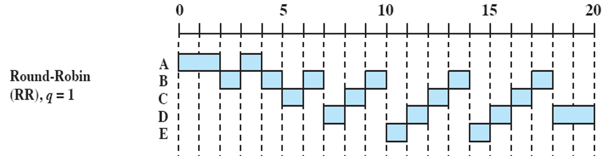

- 平均周转时间：10.8
- 平均带权周转时间：2.71
### 评价
- 属于抢占调度方式
- 常用于分时系统或事务处理系统
- 时间片的设置与系统性能、响应时间密切相关
  - 时间片太短，进程切换频繁，降低CPU效率
  - 时间片太长，对短的交互请求的响应时间变长
  - 时间片最好略大于一次典型交互的时间
- 对CPU密集型进程有利，对I/O密集型进程不利
  - CPU密集型进程可充分利用时间片
  - I/O密集型进程每次短时间使用CPU，之后I/O阻塞，I/O操作完成后加入就绪队列，若有CPU密集型进程占用CPU，或就绪队列中已经有CPU密集型进程，则需要长时间等待
  - CPU密集型进程不公平地使用了大量CPU时间，导致I/O密集型进程性能下降
### VRR算法
是RR算法的改进，增加一个辅助队列，接收I/O阻塞完成的进程，调度优先于就绪队列，但占用处理器的时间略小于就绪队列的时间片。
## 短进程（作业）优先(SPF/SJF)
短进程或作业优先调度
### 示例

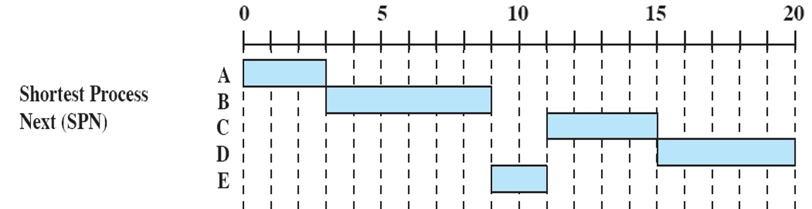
### 评价
- 非抢占调度方式
- 短进程跳到队列头，可能导致长进程饥饿
- 有利于短进程，减小了平均周转时间
- 缺少了剥夺机制，不适用于分时系统或事务处理环境
- 进程的长短由用户所提供的估计执行时间而定，用户估计不准时，导致该算法不一定能做到短作业优先
## 剩余时间最短者优先算法(SRT)
调度程序总是选择预期剩余时间最短的进程，在SJF的基础上增加了剥夺机制
### 示例

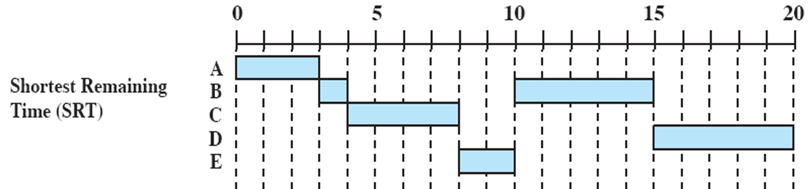
### 评价
- 优点
  - 既不像FCFS那样偏向长进程，也不像RR算法那样会产生很多额外的中断，减小了开销
  - 周转时间方面。SRT比SJF性能好，只要就绪，短作业可以立即被选择执行
- 缺点
  - 需要估计预期的服务时间
  - 存在长进程饥饿现象
  - 必须记录进程的已服务时间
## 响应比高者优先(HRRN)
当前进程执行完毕或需要阻塞时，选择就绪队列中响应比最高的进程投入执行。

响应比：$R_q = \frac{\text{等待时间+要求服务时间}}{要求服务时间}=\frac{w+s}{s}$
### 示例

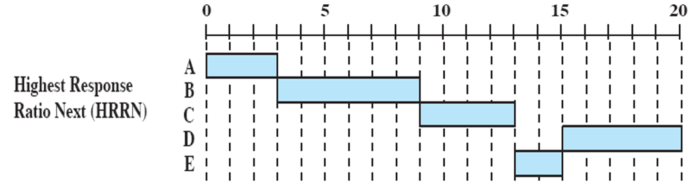
### 评价
- 实质上是一种动态优先权调度算法
- 说明了进程的年龄，有吸引力
- 是FCFS和SJF的结合，既照顾了短进程，又考虑了作业到达的先后顺序，不会使长期进程长期得不到服务
- 每次调度之前都需要计算响应比，增加系统开销，且难以准确计算
## 反馈调度算法(FB)
- 多个独立的优先级不同的就绪队列
- 各队列区别对待，即优先调度优先级高的队列
- 执行过程中可降级，即在整个生命周期内可位于不同队列
- 有多个变种，区别在于抢占机制不同

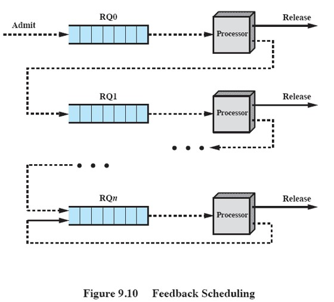

### 基于时间片轮转的反馈调度算法
1. 设置多个就绪队列，每个队列赋予不同的优先级
   - 第一个队列优先级最高，依次递减
   - 各队列进程执行的时间片不相同，优先级越高的队列，时间片越小
2. 新进程进入，首先放入第一个队列尾，按FCFS排队
3. 如果进程在当前规定的时间片内完成则退出；一般而言，从队列$i$中调度的进程允许执行$2^i$的时间才被抢占，降级到下一个优先级队列（如果没有被抢占，则当前进程不降级）
4. 到达最低优先级队列后，不再降级
5. 仅当高优先级队列空闲时才调用低优先级队列
### 示例（基于时间片轮转的反馈调度算法）

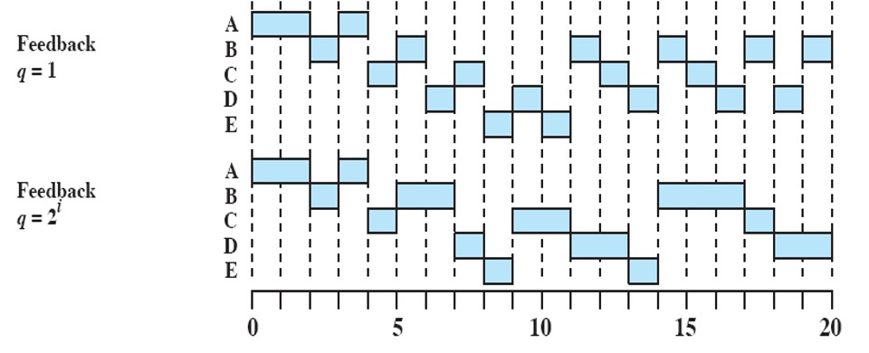
### 评价
多级反馈队列调度算法具有较好的性能，能够满足各类型用户的需求
- 有利于终端型作业用户：常为短作业，能在第一队列所规定的时间片内完成
- 对短作业用户有利：能够在前几个队列所规定的时间片内完成
- 长进程：随着优先级下降，分配的时间片增多，减少了被抢占的次数
  > 当不断有新进程到来时，长进程仍可能饥饿
# 实时系统与实时调度
- 实时系统：系统能够及时（即时）响应外部事件的请求，在规定的时间内完成对该事件的处理，并控制所有实时任务协调一致地运行
  > 对于实时系统而言，系统的正确性不仅取决于计算的逻辑结果，还取决于结果产生的时间
- 实时任务：具有及时性要求的，常常被重复执行的特定进程，在实时系统中习惯称为任务
- 截止时间
  - 开始截止时间：任务在某时间前必须开始执行
  - 完成截止时间：任务在某时间前必须完成
## 实时任务分类
- 截止时间
  - 硬实时任务
  - 软实时任务
- 周期性
  - 周期性实时任务
  - 非周期性实时任务
## 实时操作系统的特点
- 可确定性：任务按照固定的或预先确定的时间或时间间隔执行
- 可响应性：关注系统在指导中断后为中断提供服务的时间
- 用户控制：用户能够控制软、硬实时任务，并控制任务的优先级
- 可靠性：实时响应和控制事件，保证性能
- 失效弱化：系统具有稳定性，当不能满足所有任务的实时性时，首先要满足的重要的、优先级高的任务的期限，减少系统故障
## 实时调度的调度方式
### 基于时间片的轮转调度
- 实时进程按时间片轮转的方式进行，到达的实时进程放在就绪队列尾
- 新到进程的时间片到时调度
- 响应时间一般为秒级
- 广泛用于分时系统及一般实时处理系统
### 基于优先级的非抢占调度
- 实时进程按优先级、非抢占方式执行，新到的实时进程放在就绪队列首部
- 当前进程阻塞或完成时，立即调度新到进程
- 响应时间一般在数百毫秒到数秒之间
- 多用于多道批处理系统或不太严格的实时处理系统
### 基于优先级的抢占点抢占调度
- 实时进程按优先级、抢占方式执行
- 当下一个剥夺点（时钟中断）到来时，立即占用CPU
- 响应时间一般在几毫秒至几十毫秒之间
- 用于一般实时系统
### 立即抢占调度
- 实时级调度按优先级、抢占方式执行
- 响应时间为微秒至毫秒级
- 可用于苛刻的实时系统
## 实时调度的方法分类
### 静态表驱动调度法
- 用于调度周期性实时任务
- 按照任务周期到达的时间、执行时间、完成的截止时间以及任务的优先级，指定调度表，调度实时任务
- 最早截止时间优先
- 不灵活，任何任务的调度申请改动都会引起调度表的修改
### 静态优先级抢占调度法
- 此算法多用于非实时多道程序系统
- 优先级的确定方法很多
- 实时系统一般根据对任务的限制时间赋予优先级
### 基于动态规划的调度法
- 当实时任务到达以后，系统为新到达的任务与正在执行的任务动态创建一张调度表
- 在当前执行任务不会错过其截止时间的情况下，如果也能使新到达的任务在截止时间内完成，则立即调度执行新任务
### 动态尽力调度法
- 实现简单，广泛用于非周期实时任务调度
- 当任务到达时，系统根据其属性赋予优先级，优先级高的先调度
- 缺点在于，当任务完成时，或截止时间到达时，很难知道任务是否满足其约束时间
# 限期调度
- 限期：即任务开始或结束的时间
- 调度所需信息
  - 就绪时间
  - 启动的期限
  - 完成的期限
  - 处理的事件
  - 资源需求
  - 优先级
  - 子任务结构：一个任务可分解为一个必须执行的子任务和一个可选执行子任务，前者有硬截止时间
- 调度考虑
  - 调度哪个任务：根据任务的deadline，选择deadline最早的任务调度，这样可使超过deadline的任务最少
  - 抢占方式
    - 对于启动限期明确的任务，采用非抢占方式；当前实时任务在满足必须部分或关键部分后，阻塞自己，使其它实时任务得以启动，满足启动期限
    - 具有完成限期的实时系统，采用抢占方式
## 具有完成限期的周期性实时任务
- 采用最早截止时间优先调度法(EDF)
- 根据任务的截止时间来确定优先级

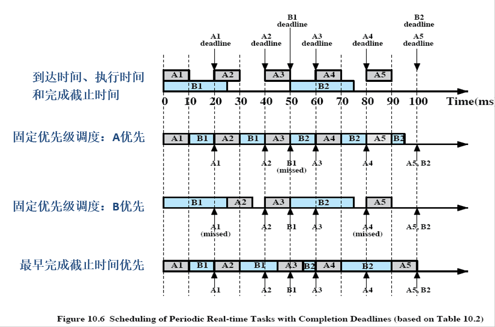
## 具有开始限期的非周期性实时任务
若预先知道任务的开始截止事件，则采用允许CPU空闲的EDF算法
- 优先调度截止时间最早的合格任务，并让该任务运行完毕
- 合格任务可以是还未就绪但事先知道其开始截止时间的任务
- CPU利用率不高，但能保证任务按要求完成

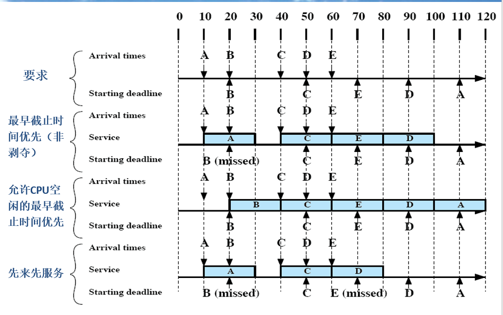
## 速率单调调度算法(RMS)
- 周期性任务
- 任务速率：任务周期的倒数，以赫兹为单位
- 优先级的确定
  - 任务周期越短，优先级越高
  - 优先级函数是速度的单调递增函数
- 系统按任务优先级的高低进行调度
## 实时系统处理能力的限制
假定系统中有$m$个周期性的硬实时任务，任务$i$的处理时间为$C_i$，周期为$P_i$，则在单处理机情况下，必须满足下面的限制条件：
$$
\sum^m_{i=1}\frac{C_i}{P_i} \leqslant 1
$$
## 优先级反转（优先级倒置、优先级逆转、优先级翻转）
- 一个高优先级任务间接被一个低优先级任务所抢先，使得两个任务的相对优先级被倒置
- 解决方案
  - 优先级低的任务继承任何与其共享统一资源的较高优先级的任务的优先级
  - 优先级与每一个资源相关联，资源的优先级被设定为，比使用该资源的最高优先级的任务的优先级高一级；调度程序动态地将该优先级分配给任何访问资源的任务，一旦任务使用完资源，优先级就返回到以前的值
