---
title: "OS第八章 内存管理"
description: "链接与加载的基础，分页分段与段页式介绍"
date: "2023-11-05 20:10:51"
category: "计算机基础"
originalCategory: "计算机操作系统"
track: "Computer Science"
level: intermediate
status: ready
published: true
minutes: 13
order: 1000
prerequisites: []
tags: ["OS", "内存"]
photos: "banner.png"
source: "_posts"
---# 程序的加载和链接
## 高级语言源代码转化为进程的3个基本步骤
1. 编译：由编译器将用户源代码编译成若干个目标模块
2. 链接：由链接器将编译后形成的一组目标模块，以及它们所需要的库函数链接在一起，形成一个完整的装入模块
3. 加载：由加载器将装入模块装入内存

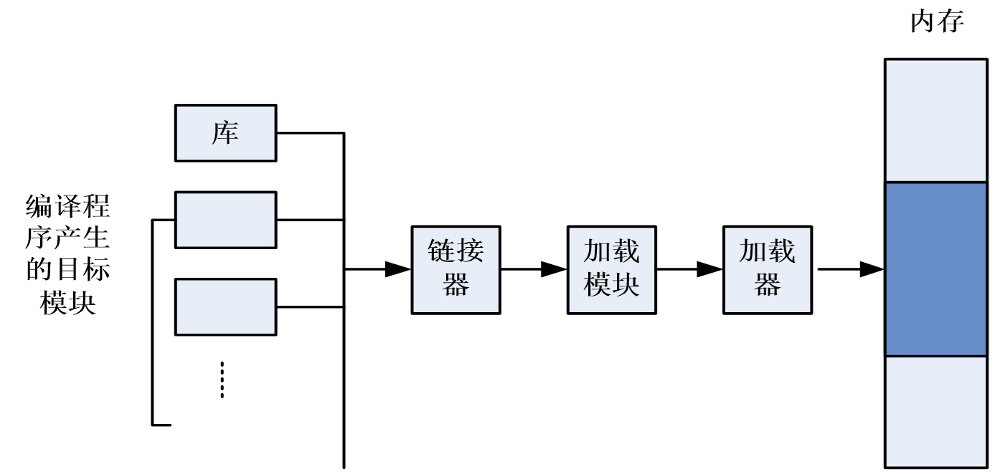

## 空间分类
### 名空间
用汇编语言或高级语言编写程序时，常常用符号名来访问某一单元。把程序中由符号组成的程序空间称为符号名空间，简称名空间。
### 逻辑空间
- 由源程序经过汇编或编译后，形成目标程序，每个目标程序都是以0为基址顺序进行编址，符号名访问的单元被单元号取代。
- 生成的目标程序占据一定的地址空间，称为逻辑地址空间，简称逻辑空间。
- 在逻辑空间中每条指令的地址和指令中要访问的操作数地址统称为逻辑地址

## 地址映射
将逻辑地址转换为运行时由机器直接寻址的物理地址
- 当程序装入内存时，操作系统要为该程序分配一个合适的内存空间
- 由于程序的逻辑地址与分配的内存物理地址未必一致，CPU执行指令按物理地址进行，需要进行地址转换
- 重定位

## 链接
源程序经过编译后，可得到一组目标模块，再利用链接程序将这组目标模块链接形成加载模块
### 链接方式
- 静态链接
- 加载时动态链接
- 运行时动态链接

### 静态链接
在程序运行之前，先将各目标模块及它们所需的库函数，链接成一个完整的加载模块，以后不再拆开
- 主要工作
  - 相对地址的修改：由编译程序产生的所有目标模块中，使用的都是相对地址，其起始地址都为0，在链接成一个加载模块时修改模块的相对地址
  - 变换外部引用地址：将每个模块所用的外部调用符号也变换为相对地址
- 缺点
  - 不利于代码共享
  - 不利于模块的独立升级
  - 可能链接一些不会执行的模块，浪费存储空间和处理器时间

### 加载时动态链接
目标模块在装入内存时，采用边装入边链接的链接方式
- 优点
  - 便于各个模块的独立升级
  - 便于实现模块的共享
- 缺点
  - 可能链接一些不会执行的模块，浪费存储空间和处理机时间
  - 模块装入后不能移动位置

### 运行时动态链接
对某些目标模块的链接，是在程序执行中需要该目标模块时，由操作系统去找到该模块并将之装入内存，随后把它链接到调用者模块上
- 优点
  - 加快程序的装入过程，节省大量内存空间

## 加载
### 装入任务
- 将可装入模块装入内存
- 地址重定位：将执行文件中的逻辑地址转化为内存物理地址的过程
### 装入方式分类
- 绝对加载方式
- 可重定位（静态重定位）加载方式
- 运行时重定位（动态重定位）加载方式

### 绝对加载方式
- 在编译时就知道程序将驻留在内存中的具体位置，编译程序产生绝对地址的目标代码
- 绝对加载程序按照装入模块中的地址，将程序和数据装入内存。装入模块在装入内存时，由于程序的逻辑地址与实际内存地址完全相同，故不需对程序和数据的地址进行修改
- 为了便于程序的修改，对编译的程序采用符号地址，然后在编译或汇编时，再将这些符号地址转换为绝对地址
- 优点
  - 实现简单，无须进行逻辑地址到物理地址的变换
- 缺点
  - 程序员每次必须装入同一内存区
  - 程序员必须事先了解内存的使用情况，根据内存情况确定程序的逻辑地址
  - 不适用于多道程序系统

### 可重定位加载方式
- 编译时采用相对地址，即编译器假设装入到从零开始的内存位置
- 允许将程序装入与逻辑地址不同的物理内存空间。即程序可以装入到内存的任何位置，其逻辑地址与装入内存后的物理地址无直接关系
- 必须进行重定位，即装入程序根据装入的位置将逻辑地址转换为物理地址
- 静态重定位技术，地址映射在程序装入时进行，以后不再更改程序地址
- 优点
  - 易实现，无需硬件支持
- 缺点
  - 程序重定位后就不能移动，因而不能重新分配内存，不利于内存的有效利用
  - 程序在存储空间中只能连续分配，不能分布在内存的不同区域
  - 难于共享

### 运行时重定位（动态重定位）加载方式
- 程序的地址转换不是在装入时进行，而是在程序运行时动态进行
- 运行时动态装入需要硬件支持，即重定位寄存器，用于保存程序在内存中的起始地址
- 程序被执行时，通过重定位寄存器内的起始物理地址和指令或数据的逻辑地址计算其物理地址
- 优点
  - 程序不必连续存放在内存中，可分散存储，可移动
  - 便于共享
  - 有利于紧凑、碎片问题的解决
  - 主流方式
- 缺点
  - 需要硬件支持，实现存储管理的软件算法比较复杂
  - 同一地址可能多次转换
  - DLL地狱：两个或多个进程共享一个DLL模块，但它们希望链接不同版本的模块

### 总结
- 绝对加载：编译时执行，编译时就知道进程在内存中的驻留地址，生成绝对代码，即可执行文件中记录内存地址，装入时直接定位在该内存地址
  - 如果将来开始地址发生变化，必须重新编译代码
- 可重定位加载：加载时执行，地址绑定在装入内存时才进行。系统根据内存当时的使用情况，决定将目标代码放在内存的什么位置
  - 不允许程序在内存中移动
- 动态执行时加载：动态地址重定位，地址绑定延迟到执行时才进行
  - 支持执行时进程在内存中移动

# 内存管理的需求
- 重定位
- 保护
- 共享
- 逻辑组织
- 物理组织

## 重定位
- 程序员事先并不知道在某个程序执行期间会有哪些程序驻留在内存
- 需要把活动进程换入或换出内存，进而使处理器的利用率最大化
- 进程下次切换时要放置在与换出前相同的区域存在诸多困难
- 需要将进程重定位到内存的不同区域

## 保护
- 进程以外的其他进程中的程序不能未经授权地访问（进行读操作或写操作）该进程的内存单元
- 程序在内存中的位置不可预测
- 需要既要重定位也支持保存的机制

## 共享
- 多个进程正在执行同一程序时，允许每个进程访问该程序的同一个副本，要比让每个进程有自己独立的副本更有利
- 需要既支持重定位也支持共享机制

## 逻辑组织
- 内存被组织成线性地址空间
  - 可以独立编写和编译模块
  - 可以为不同的模块提供不同的保护级别
  - 模块可以被多个进程共享，与用户看待问题的方式一致
- 分段可以满足该需求

## 物理组织
- 不应让程序员负责管理内存
- 供程序和数据使用的内存可能不足
- 程序员不知道可用空间的大小和位置
- 覆盖：允许不同的模块占用相同的存储空间，但编程耗时

# 内存分区
内存管理的主要操作是处理器把程序装入内存中执行
- 连续分配
  - 固定分区
  - 动态分区分配
  - 可重定位分区定位
  - 覆盖
  - 对换
- 离散分配
  - 分页存储管理
  - 段式存储管理
  - 段页式存储管理
- 虚拟存储器
  - 请求分页存储管理
  - 请求分段储存管理
  - 段页式虚拟存储
## 基本原理
- 操作系统占据内存中某些固定部分，用户进程使用其余部分
- 将用户空间的内存区域进行划分，形成若干个边界固定的区域
- 每个分区装入一个进程

## 固定分区
### 分区大小相等
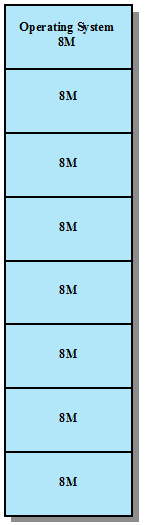

- 程序不能太大而不能放到一个分区
  - 程序员必须使用覆盖技术设计程序
- 内存的利用率非常低
  - 很小的程序也必须占据一个完整的分区序
  - 内部碎片：由于装入的数据块小于分区大小，分区内部存在空间浪费
### 分区大小不等
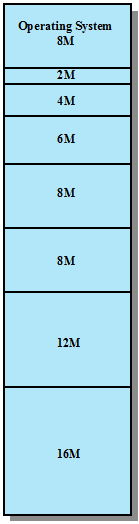

- 分区的数量在系统生成阶段已经确定，因而限制了系统活动进程的数量
- 小作业仍不能有效利用分区空间

## 动态分区
- 分区大小和数量不固定
- 分配与进程需求完全一致的空闲内存空间
- 外部碎片
  - 动态分区方法在内存中产生越来越多的碎片
  - 内存利用率下降
- 紧凑（压缩）
  - 解决外部碎片问题的技术
  - 操作系统移动进程，使进程占用的空间连续
  - 所有空闲时间连成一片
  - 紧凑费时，浪费处理器时间

### 首次匹配
- 思想：从头开始扫描内存，选择大小足够的第一个可用块
- 实现：要求空闲分区以地址递增的顺序链接，从链首开始查找
- 评价
  - 简单快速
  - 为大作业分配大的内存空间创造条件
  - 内存前端出现很多小的空闲分区，且每次查找都要经过这些分区

### 下次/循环匹配
- 思想：从上一次放置的位置开始扫描内存，选择下一个大小足够的可用块
- 实现：空闲分区按地址从低到高排列（链接）
- 评价
  - 比首次匹配性能差，常常在内存末尾分配空间，导致空闲的分区均匀
  - 缺少大的空闲块，需要更多次数紧凑

### 最佳匹配
- 思想：选择空间大小与需求最接近的空闲块分配
- 实现：空闲分区按容量从小到大链接
- 评价
  - 产生的外部碎片都很小
  - 内存中形成很多小到无法满足任何分配需求的块
  - 需要更频繁的进行内存压缩

### 最差匹配
- 思想：选择满足需求的最大的空闲分区分配
- 实现：空闲分区按容量从大到小链接
- 评价
  - 每次分配留下的空闲空间较大，便于再次利用
  - 大的空间不容易保留，对大作业不利

### 例题

某操作系统采用动态分区存储管理技术。操作系统在低地址占用了100KB的空间，用户区主存从100KB处开始占用512KB。初始时，用户区全部为空闲，分配时截取空闲分区的低地址部分作为分配区。在执行以下申请、释放操作序列后：请求300KB、请求100KB、释放300KB、请求150KB、请求50KB、请求90KB，请回答
1. 采用首次适应算法时，主存中有哪些空闲分区？画出主存分布图，并指出空闲分区的首地址和大小。
2. 采用最佳适应算法时，主存中有哪些空闲分区？画出主存分布图，并指出空闲分区的首地址和大小。
3. 若随后又申请80KB，针对上述两种情况产生什么后果？说明了什么问题

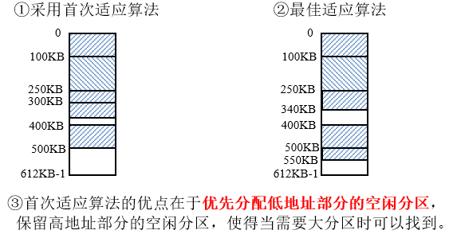

## 分区管理操作
### 分配
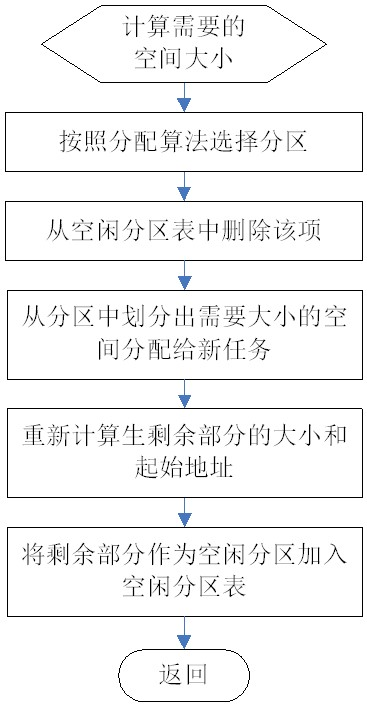

### 回收
- 当进程运行完毕释放内存时，需合并相邻的空闲分区，形成大的分区，称为合并技术
- 系统根据回收区的首址，从空闲区链中找到想要的插入点，此时可能出现四种情况

## 伙伴系统
- 静态分区方案限制了系统中活跃进程的数目，并且只能运行不超过分区大小的进程，如果进程远远小于分区大小，则内存空间的利用率非常低
- 动态划分方案使存储管理复杂化，并且需要系统付出紧凑的额外开销

### 基本思想
- 无论已分配分区或空闲分区，其大小均为2的k次幂，k为整数，l≤k≤m，其中$2^1$分配的最小分区的大小，$2^m$表示分配的最大分区的大小，通常是整个可分配内存的大小。
- 假设系统的可利用空间容量为$2^m$个字节，则系统开始运行时，整个内存区是一个大小为$2^m$的空闲分区。在系统运行过程中，由于不断的划分，可能会形成若干个不连续的空闲分区，将这些空闲分区根据分区的大小进行分类，对于每一类具有相同大小的所有空闲分区，单独设立一个空闲分区双向链表。这样，不同大小的空闲分区形成了k个空闲分区链表。
### 存储空间分配
进程申请大小为k的空间，系统为之分配一个$2^i$的空闲分区，其中，$2^{i-1}$＜k≤$2^i$
1. 查找大小为$2^i$的空闲分区，若找到则分配；
2. 若未找到大小为$2^i$的空闲分区，则查找大小为$2^{i+1}$的空闲分区；若找到，则将该空闲分区划分为相等的两个分区（一对伙伴），其中的一个用于分配，另一个分区加入大小为$2^i$的空闲分区链中；
3. 若未找到$2^{i+1}$的空闲分区，则需要查找大小为$2^{i+2}$的空闲分区，若找到则需要进行两次划分。第一次将其分割为大小为$2^{i+1}$的两个分区，一个用于分配，另一个加入到大小为$2^{i+1}$的空闲分区链中；第二次将第一次用于分配的空闲分区分割为$2^i$的两个分区，一个用于分配，另一个加入到大小为$2^i$的空闲分区链中。
4. 若仍未找到$2^{i+2}$的空闲分区，则继续查找$2^{i+3}$的空闲分区，以此类推。

### 存储空间回收
当进程执行完毕，释放一个大小为$2^i$的分区时，系统用下面的算法回收该分区：
1. 若事先不存在$2^i$的空闲分区，则保留该分区为一个独立的空闲分区；
2. 若事先已存在$2^i$的空闲分区时，则将其与伙伴分区合并为大小为为$2^{i+1}$的空闲分区；
3. 若事先已存在$2^{i+1}$的空闲分区时，继续合并为$2^{i+2}$的空闲分区，以此类推。

### 示例
系统的初始内存为1MB，若请求A、B、C、D、E相继申请100KB、240KB、64KB、256KB、75KB的内存空间，其申请、释放顺序为A申请、B申请、C申请、D申请、B释放、A释放、E申请、C释放、E释放、D释放。则系统分配、回收（合并）伙伴分区的过程如图所示：

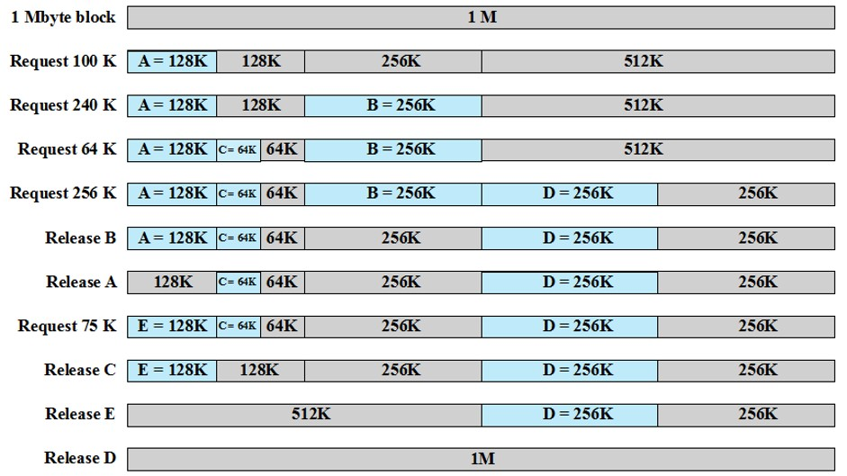

### 特点
- 较为合理的折中方案，一定程度上克服了固定分区和动态分区的缺陷
- 是并行程序分配和释放的一种有效方案

## 可重定位分区
- 进程被多次装入内存时，可能位于内存中的不同位置
- 压缩（紧凑）技术：移动进程，使得进程占用的空间连续，并使所有空闲空间连成一片

### 地址类型
- 逻辑地址：与当前数据在内存中的物理分配无关的访问地址，执行前要转换成物理地址
- 相对地址：逻辑地址的特例，相对于某些已知点的存储单元
- 物理地址、绝对地址：内存中的实际地址
### 重定位的硬件支持
- 基地址寄存器
- 界限寄存器

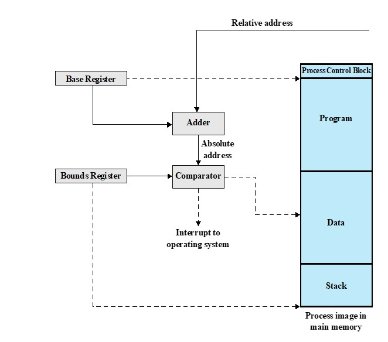

### 可重定位分区分配算法

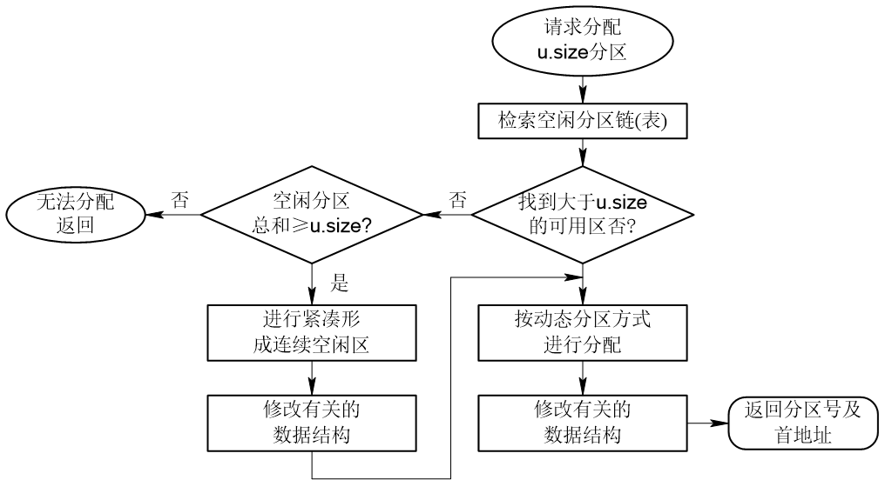

- 优点
  - 支持多道程序
  - 管理方案相对简单，不需要更多的软硬件开销
  - 实现存储保护的手段比较简单
- 缺点
  - 主存利用不够充分，存在外部碎片
  - 无法实现多进程共享存储器的信息
  - 无法实现主存的逻辑扩充，进程的地址空间受物理内存的限制

## 覆盖与对换
- 内存扩充：借助大容量辅存在逻辑上实现内存扩充。来解决内存容量不足的问题

### 覆盖
- 基本思想：一个程序的几个代码段或数据段，按照时间先后来占用公共的内存空间
- 实现
  - 将程序的必要部分代码和数据常驻内存
  - 可选部分在其他程序模块中实现，平时放在外存，需要用到时才装入内存
  - 不存在调用关系的模块不必同时装入到内存，可相互覆盖
- 优点
  - 覆盖不需要OS提供特殊的支持
- 缺点
  - 程序员必须适当地设计和编写覆盖结构，即编程时必须划分程序模块和确定程序模块之间的覆盖关系，增加编程复杂度

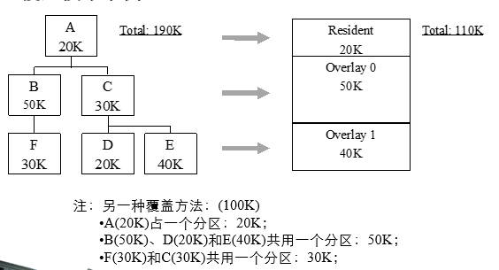

### 对换
- 基本思想：把内存中暂不能运行的进程或者暂不使用的程序和数据换出到外存上，以腾出足够的内存空间，把已具备运行条件的进程或进程所需要的数据换入内存
- 交换粒度
  - 整体交换：交换是以整个进程为单位，目的是解决内存紧张问题，进一步提高内存利用率
  - 部分交换：页面交换、分段交换，目的是为了支持虚拟存储系统
- 对换空间的管理
  - 外存：对换区比文件区侧重于对换速度
  - 对换区一般采用连续分配
- 优点
  - 换入换出操作由内存管理模块完成，与程序结构无关

### 比较
- 覆盖技术主要用在早期的操作系统中
- 交换技术被广泛用于小型分时系统中，交换技术的发展导致了虚存技术的出现
- 覆盖只能覆盖那些与覆盖段无关的程序段
- 交换技术不要求用户给出程序段之间的逻辑覆盖结构
- 交换发生在进程之间，覆盖发生在同一进程内

# 离散分配
## 引入原因
- 固定分区存在内部碎片
- 动态分区存在外部碎片
- 可重定位动态分区的系统开销大

## 基本思想
一个进程分配的内存由多个离散的空间组成
## 分页
- 将内存划分成大小固定、相等的块，且块相对较小（页框）
- 进程也划分成同样大小的块（页）
### 页表
- 操作系统为每个进程维护一个页表
- 页表给出了该进程的每页所对应页框的位置
- 处理器必须知道如何访问当前进程的页表
- 逻辑地址到物理地址的转换由处理器硬件完成
### 逻辑地址结构
页号+页内偏移（页内地址）
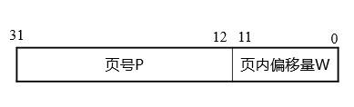

### 页号与页内地址的计算
若给定一个逻辑地址空间中的地址为A，页面的大小为L，则页号P和页内地址d可按下式

$d = A mod L$
$P = (A-d)/L$

### 普通分页系统地址转换示例
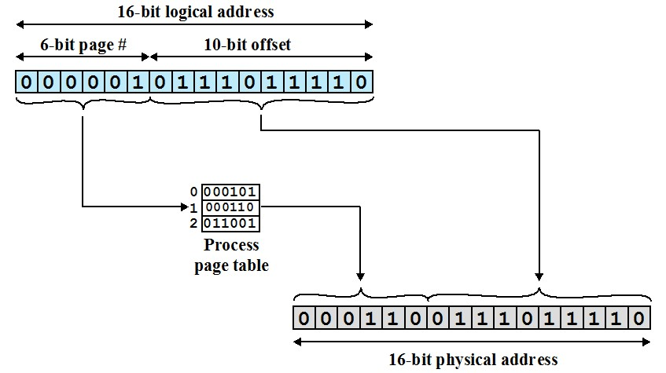

### 页表的存储
- 页表存放在内存
- PCB保存有页表的起始地址
- 页表寄存器存放当前运行进程的页表的起始地址

### 页表例题

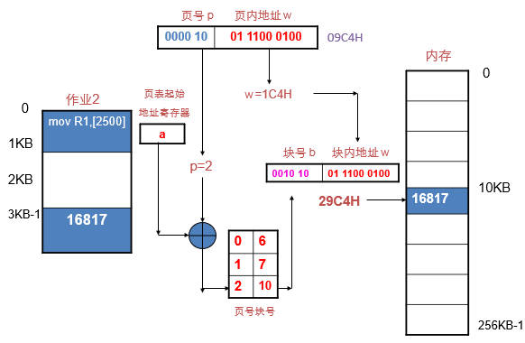

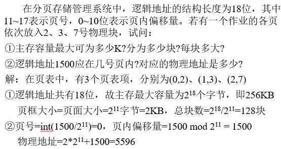

### 优点
- 存在页内碎片，但碎片相对较小，内存利用率高
- 实现了离散分配
- 无外部碎片

### 缺点
- 需要专门的硬件支持，尤其是块表
- 不支持动态链接，不易实现共享

## 分段
- 一个程序可以划分成几个段
  - 段长度可以不等
  - 每个段都从0开始编址，并占用一段连续的地址空间
  - 有最大段长限制
- 逻辑地址两部分组成：段号+段内偏移量
- 分段类似动态分区
  - 使一个程序可以占据多个分区，且不必连续
- 消除了内部碎片
- 分页对用户透明，分段对用户可见
- 给程序员提供了组织程序和数据更方便的手段
- 程序员或编译器将程序和数据划分到不同的段
- 为实现模块化程序设计，程序和数据可能会进一步被划分成多个段
- 程序员或编译器需要清楚最大段长的限制

### 段表
记录逻辑段和物理段的对应情况
### 地址转换
1. 提取段号，即逻辑地址最左侧的n位
2. 以段号为索引，查找进程段表中该段的起始物理地址
3. 最右侧m位表示偏移量，偏移量和段长度进行比较，若偏移量大于段长度，则该地址无效
4. 物理地址位该段的起始物理地址与偏移量之和

### 优缺点
- 优点
  - 便于程序模块化设计
  - 便于动态链接
  - 便于保护和共享
  - 无内部碎片
- 缺点
  - 地址转换需要硬件支持（段表寄存器）
  - 分段的最大尺寸受到主存可用空间的限制
  - 有外部碎片

## 分页与分段比较
- 页是信息的物理单位，分页的目的是实现离散分配，减少内存的外部碎片，提高内存的利用率，分页仅仅是由于系统管理的需要而不是用户的需要；段则是信息的逻辑单位，它含有一组意义相对完整的信息，分段的目的是为了能更好地满足用户的需要
- 页的大小固定且由系统决定，由系统把逻辑地址划分为页号和页内地址两部分，是由机器硬件实现的，因而在系统中只能有一种大小的页面；而段的长度不固定，决定于用户所编写的程序，通常由编译程序在对源程序进行编译时，根据信息的性质来划分
- 分页的作业地址空间是一维的，即单一的线性地址空间，程序员只需利用一个记忆符，即可表示一个地址；而分段的作业地址空间则是二维的，程序员在标识一个地址时，既需给出段名，又需给出段内地址
- 分页存储管理系统不易实现共享和运行时动态链接，而分段系统易于实现

## 段页式
- 页式存储管理的主要优点
  - 内存利用率高
- 段式存储管理的主要优点
  - 方便用户
  - 易于共享
  - 易于保护
  - 可动态链接
- 段页式存储管理的基本思想
  - 采用分段方法组织用户和程序，采用分页方法分配和管理内存
  - 用户程序可以用模块化思想进行设计，一个用户程序由若干段组成
  - 系统将内存划分成固定大小的页框，并将程序的每一段分割成若干页后装入内存执行
- 优点
  - 离散存储
  - 内存利用率高
  - 便于保护和共享，支持动态链接
  - 无外部碎片
- 缺点
  - 地址转换复杂
  - 有内部碎片
