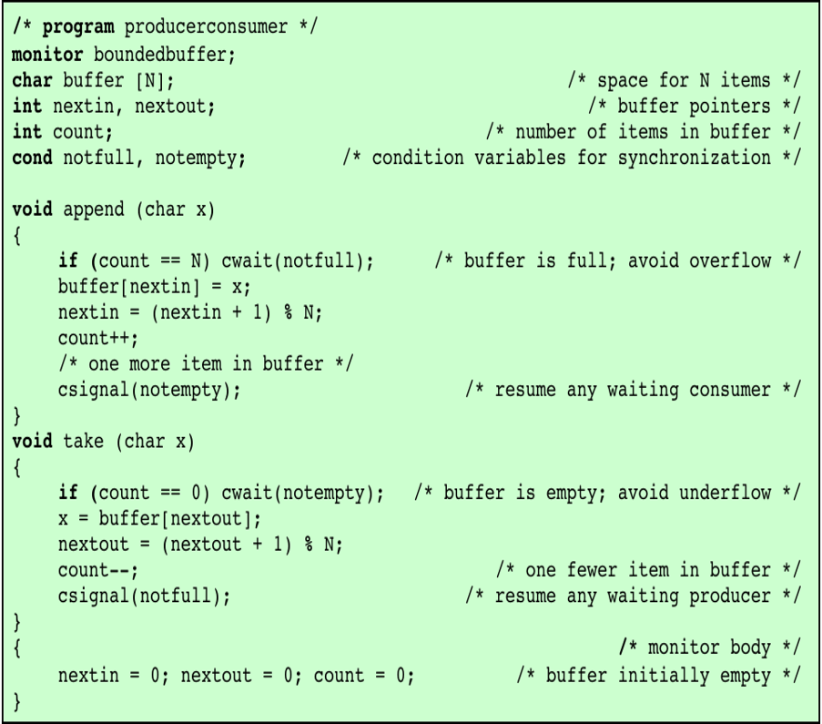

---
title: "OS第六章 进程互斥与同步"
description: "进程互斥与同步的实现方法与应用"
date: "2023-10-19 20:32:43"
category: "计算机基础"
originalCategory: "计算机操作系统"
track: "Computer Science"
level: intermediate
status: ready
published: true
minutes: 7
order: 1000
prerequisites: []
tags: []
photos: "banner.jpg"
source: "_posts"
---# 并发的原理
## 多道程序设计为什么需要同步
- 进程是计算机中的独立个体，并且具有并发性和异步性
- 资源是计算机中的稀缺个体，需共享，如CPU、I/O设备
- 进程之间可能需要协作完成任务

## 并发相关的关键术语
- 原子操作：一组指令要么都执行，要么都不执行
- 互斥：进程间的间接制约关系。当一个进程在临界区访问共享资源时，其他进程不能进入该临界区访问共享资源
- 临界资源：不可同时访问，必须互斥访问的资源
- 临界区：访问临界资源的代码，任何时刻只能由一个进程在这段代码中运行
- 同步：进程间的直接制约关系。多个进程共同完成一项任务时直接发生相互作用，在多道环境下，必须协调进程间的执行次序
- 活锁：两个或两个以上的进程为响应其他进程而持续改变自己状态但是不做有用工作的情形
- 死锁：两个或两个以上的进程因等待其他进程做完某些事而不能继续执行的情形
- 竞争条件：多个进程或线程读写共享数据时，结果取决于多个进程的指令执行顺序
- 饥饿：一个具备执行条件的进程被调度程序无限期的忽视而不能调度的情形
- 忙等现象：当一个进程等待进入临界区时，它会继续消耗处理器时间
## 进程的交互方式
### 进程间的关系
- 竞争
- 通过共享合作
- 通过通信合作

### 进程间的竞争资源
- 进程间不知道彼此的存在
- 进程竞争使用同一资源时，它们之间会发生冲突
  - I/O设备
  - 存储器
  - 处理器
  - 时钟
- 并发控制面临的问题
  - 互斥
  - 饥饿
  - 死锁

### 进程间通过共享合作
- 多个进程可能共享一个变量、共享文件或数据库
- 一个进程的结果可能取决于从另一个进程获得的信息
- 进程知道其他进程也可能共享同一个数据，因此必须合作
- 并发控制面临的问题
  - 互斥
  - 死锁
  - 饥饿
  - 数据一致性

### 进程间通过通信合作
- 进程间通过通信完成同步和协调彼此活动
- 一个进程的结果可能取决于从另一个进程获得的信息
- 通信可由各种类型的消息组成，发送或接收消息的原语由操作系统或程序设计语言提供
- 不涉及对共享资源的访问
- 并发控制面临的问题
  - 死锁
  - 饥饿

# 互斥
## 互斥的要求
- 空闲让进：如临界区空闲，则有进程申请就立即进入
- 忙则等待：每次只允许一个进程处于临界区
- 有限等待：保证进程在有限时间内能进入临界区
- 让权等待：进程在临界区不能长时间阻塞等待某事件

## 互斥：软件方法
- 通过在进入区设置和检查一些标志来判断是否有进程在临界区
- 若已有进程在临界区，则在进入区通过循环检测进行等待
- 进程离开临界区后在退出区修改标志

### 方案一
```
int turn =0;
/* 进程P0 */
do{
  while(turn!=0);
  /* 临界区代码 */
  turn =1;
  /* 剩余代码 */
}while(true)
```
- 严格轮换，实现了互斥访问
- 忙等
- 违反了空闲让进的原则
- 即时在临界区外失败也会影响另一进程的执行

### 方案二
```
boolean flag[2] = {false,false};
/* 进程P0 */
do{
  while(flag[1]);
  flag[0] = true;
  /* 临界区代码 */
  flag[0] = false;
  /* 剩余代码 */
}while(true)
```
- 忙等
- 违反了忙则等待的原则，互斥访问未实现

### 方案三
```
boolean flag[2] = {false,false};
/* 进程P0 */
do{
  flag[0] = true;
  while(flag[1]);
  /* 临界区代码 */
  flag[0] = false;
  /* 剩余代码 */
}while(true)
```
- 实现了互斥访问
- 违反了空闲让进原则，可能导致死锁

### 方案四
```
boolean flag[2] = {false,false};
进程P0
do {
  flag[0] = true;
  while(flag[1]){
    flag[0] = false;
    /* 随机等待一段时间 */
    flag[0] = true;
  }
  /* 临界区代码 */
  flag[0] = false;
  /* 剩余代码 */
}while(true)
```
- 实现了互斥访问
- 非死锁，但可能长时间僵持

### 方案五 Dekker互斥算法
```
boolean flag[2] = {false,false};
int turn =1;
do{
  flag[0] = true;
  while(flag[1]){
    if(turn ==1){
      flag[0] = false;
      while(turn ==1);
      flag[0] = true;
    }
  }
  /* 临界区代码 */
  flag[0] = false;
  turn = 0;
  /* 剩余代码 */
}while(ture)
```
### 方案六 Peterson互斥算法
```
boolean flag[2] = {false,false};
int turn;
/* 进程P0 */
do{
  flag[0] = true;
  turn =1;
  while(flag[1]&&turn==1);
  /* 临界区代码 */
  flag[0] = false;
}
```
### 软件方法评价
- 软件方法始终不能解决忙等现象，降低系统效率
- 采用软件方法实现进程互斥使用临界资源比较困难
  - 通常能实现两个进程的互斥，很难控制多个进程的互斥
- 算法设计需要非常小心，否则可能出现死锁或互斥失败等严重问题

## 互斥：硬件方法
### 中断禁用
- 用于单处理器系统
- 通过禁用中断，避免进程切换，实现互斥访问

```
while(true){
  disable interrupt;
  critical section;
  enable interrupt;
  remainder;
}
```
- 执行效率明显下降
  - 无法响应外部请求
  - 无法切换进程
- 无法工作在多处理器环境
  - 不能实现互斥

### 专用机器指令
- 在多处理器环境，几个处理器共享公共主存
- 处理器表现出一种对等关系，不存在主/从关系
- 处理器之间没有支持互斥的中断机制
- 处理器的设计者提出了一些机器指令用于保证两个动作的原子性
  - 如在一个周期中对一个存储单元的读和写
  - 这些动作在一个指令周期中执行，不会被打断，不会受到其他指令的干扰
#### 比较和交换指令
compare & swap
- 比较一个内存单元的值和一个测试值，如果相等，则用新值取代，否则保持不变
```
int compare_and_swap(int *word,int testval,int newval){
  int oldval = *word;
  if(oldval == testval)*word = newval;
  return oldval;
}
```
- 几乎所有的处理器家族都支持该指令的某个版本，多数操作系统都利用该指令支持并发
```
const int n = number_of_processes;
int bolt;
void P(int i){
  while(true){
    while(compare_and_swap(&bolt,0,1)==1);
    /* 临界区代码 */
    bolt = 0;
    /* 剩余代码 */
  }
}
void main(){
  bolt = 0;
  parbegin(P(1),P(2),...,P(n));
}
```
#### exchange指令
- 原子性地交换寄存器的内容和一个存储单元的值
```
void exchange(int *register,int *memory){
  int temp;
  temp = *memory;
  *memory = *register;
  *register = m;
}

int const n = number_of_processes;
int bolt;
void P(int i){
  while(true){
    int keyi = 1;
    do exchange(&keyi,&bolt)
    while(keyi!=0);
    /* 临界区代码 */
    bolt = 0;
    /* 剩余代码 */
  }
}
void main(){
  bolt = 0;
  parbegin(P(1),P(2),...,P(n));
}
```
### 硬件方法评价
- 优点
  - 支持多处理机
  - 简单易证明
  - 支持多临界区
- 缺点
  - 忙等
  - 可能饥饿
  - 可能死锁

# 信号量
## 信号量实现进程互斥与同步的基本原理
- 两个或多个进程可以通过传递信号进行合作
  - 迫使进程在某个位置暂停执行
  - 直到它收到一个可以向前推进的信号
- 实现信号灯作用的变量称为信号量
- 信号量操作
  - 初始化：一个信号量可以初始化为非负数
  - semWait(Wait/P)操作使信号量减少1，若值为负数，则阻塞该操作的进程
  - semSignal(Signal/V)操作使信号量加1，若值小于等于则被semWait阻塞的进程解除阻塞
## 信号量分类
### 二元信号量
```
struct binary_semaphore{
  enum {zero,one} value;
  queueType queue;
}
void semWaitB(binary_semaphore a)
{
  if(s.value == one)
    s.value = zero;
  else {
    /* 将该进程放入队列 */
    /* 阻塞进程 */
  }
}
void semSignal(binary_semaphore){
  if(s.queue is empty()){
    s.value = one;
  }
  else {
    /* 将一个进程从队列中移除 */
    /* 将移出的进程变为就绪态 */
  }
}
```
### 计数信号量
```
struct semaphore{
  int count;
  queueType queue;
}
void semWait(semaphore s){
  s.count--;
  if(s.count<0){
    /* 将该进程放入队列 */
    /* 阻塞进程 */
  }
}
void semSignal(semaphore s){
  s.count++;
  if(s.count<=0){
    /* 将一个进程从队列中移除 */
    /* 将移出的进程变为就绪态 */
  }
}
```
- s.count>0，s.count表示执行semWait操作而不被阻塞的次数
- s.count<0，s.count表示阻塞在s.queue队列上的进程数目

# 生产者与消费者问题
- 一个或多个生产者产生数据并放入缓冲
- 一个或多个消费者从缓冲中取出数据并效仿
- 任何时刻都只能由一个生产者或消费者访问缓存（互斥）

```
sem s=1;
sem n=0;
sem e=N;

void producer(){
  while(true){
    produce_data();
    P(e);
    P(s);
    insert_data();
    V(n);
    V(s);
  }
}

void consumer(){
  while(true){
    P(n);
    P(s);
    get_data();
    V(e);
    V(s);
  }
}
```
- 应先申请资源信号量在申请互斥信号量，否则可能导致死锁
- 缓冲区大小为1时，可以省略互斥信号量

## 示例1
桌子上有一只盘子，最多可以放入N（N>0）个水果。

- 爸爸随机向盘中放入苹果或桔子。儿子只吃盘中的桔子，女儿只吃盘中的苹果。
- 只有盘子中水果数目小于N时，爸爸才可以向盘子中放水果；
- 仅当盘子中有自己需要的水果时，儿子或女儿才可以从盘子中取出相应的水果；
- 每次只能放入或取出一个水果，且不允许多人同时使用盘子。

用信号量机制实现爸爸、儿子和女儿之间的同步与互斥活动，并说明所定义信号量的含义。要求用伪代码描述。
```
sem orange = 0;
sem apple = 0;
sem empty = N;
sem mutex = 1;

void father(){
  while(true){
    pre_fruit();
    P(empty);
    P(mutex);
    /* 放水果 */
    if(/* 放的是苹果 */)V(apple);
    else V(orange);
    V(mutex);
  }
}

void son(){
  while(true){
    P(orange);
    P(mutex);
    /* 取橘子 */
    V(mutex);
    V(empty);
  }
}

void daughter(){...}
```
## 示例2
桌子上有一只盘子，爸爸负责向盘中放苹果，妈妈负责向盘中放桔子。
- 儿子只吃盘中的桔子，女儿只吃盘中的苹果。
- 只有盘子为空时，爸爸或妈妈才可以向盘子中放入一个水果。
- 仅当盘子中有自己需要的水果时，儿子或女儿才可以从盘子中取出相应的水果。

请用信号量机制实现爸爸、妈妈、儿子和女儿之间的同步与互斥活动，并说明所定义信号量的含义。要求用伪代码描述。

```
sem apple = 0;
sem orange = 0;
sem empty = 1;

void dad(){
  while(true){
  pre_apple();
  P(empty);
  /* 放苹果 */;
  V(apple);}
}

void mom(){...}

void daughter(){
  while(true){
  P(apple);
  /* 取苹果 */
  V(empty);}
}

void son(){...}
```

## 示例3
桌子上有一只盘子，最多可以放入2个水果，
- 爸爸负责向盘中放苹果，妈妈负责向盘中放桔子，女儿负责取出并消费水果。
- 当且仅当盘子中同时存在苹果和桔子时，女儿才从盘子中取出并消费水果。

请用信号量机制实现爸爸、妈妈和女儿之间的同步与互斥活动，并说明所定义信号量的含义。要求用伪代码描述。
```
sem empty_apple = 1;
sem empty_orange = 1;
sem apple = 0;
sem orange = 0;

void father(){
  while(true){
  pre_apple();
  P(empty_apple);
  /* 放苹果 */
  V(apple);}
}

void mom(){...}

void daughter(){
  while(true){
    P(apple);
    P(orange);
    /* 取 */
    V(empty_orange);
    V(empty_apple);
  }
}
```
## 示例4
女儿负责画画，爸爸、妈妈负责欣赏。女儿在白板上画完一幅画后，请爸爸、妈妈均欣赏过一遍后，再创作新画，依次重复。请用信号量机制实现女儿、爸爸和妈妈之间的同步与互斥活动，并说明所定义信号量的含义。要求用伪代码描述。

```
sem empty_father = 1;
sem empty_mother = 1;
sem paint_mom = 0;
sem paint_father = 0;

void daughter(){
  P(empty_father);
  P(empty_mother);
  /* 画 */
  V(paint_mom);
  V(paint_father);
}

void mom(){
  P(paint_mother);
  /* 看 */
  V(empty_mother);
}

```
# 读者写者问题
- 允许多个读者进程可以同时读数据
- 不允许多个写者进程同时写数据，只能互斥写数据
- 若有写着进程正在写数据，则不允许读者进程读数据

## 读者优先
- 一旦有读者正在读数据，则允许随后的读者进入读数据
- 只有当读者全部退出，才允许写者写数据
- 导致写者饥饿

```
int readcount = 0;
sem mutex = 1;
sem wsem = 1;

void reader(){
  while(true){
    P(mutex);
    readcount++;
    if(readcount==1)P(wsem);
    V(mutex);
    /* 读 */
    P(mutex);
    readcount--;
    if(readcount==0)V(wsem);
    V(mutex);
  }
}

void writer(){
  while(true){
    P(wsem);
    /* 写 */
    V(wsem);
  }
}
```

## 公平优先
读写过程若有其他读者写者到来，则按到达顺序处理
```
sem wrsem = 1;
sem wsem =1;
sem mutex = 1;
int readcount = 0;

void reader(){
  while(true){
    P(wrsem);
    P(mutex);
    readcount++;
    if(readcount==1)P(wsem);
    V(mutex);
    V(wrsem);
    read;
    P(mutex);
    readcount--;
    if(readcount==0)V(wsem);
    V(mutex);
  }
}

void writer(){
  P(wrsem);
  P(wsem);
  write;
  V(wsem);
  V(wrsem);
}
```

## 写者优先
- 当至少有一个写者准备写数据时，则不允许新的读者进入读数据
- 保证当有一个写进程想写时，不允许新的读进程访问数据区
- 解决了写着饥饿的问题，但降低了并发程度，系统的并发性能较差

```
sem rsem = 1;
sem wsem = 1;
sem mutex_w = 1;
sem mutex_r = 1;

int writecount = 0;
int readcount = 0;

void writer(){
  while(true){
    P(mutex_w);
    writecount++;
    if(writecount == 1)P(rsem);
    V(mutex_w);
    P(wsem);
    write;
    V(wsem);
    P(mutex_w);
    writecount--;
    if(writecount == 0)V(rsem);
    V(mutex_w);
  }
}

void reader(){
  while(true){
    P(rsem);
    P(mutex_r);
    readcount++;
    if(readcount == 1)P(wsem);
    V(mutex_r);
    V(rsem);
    read;
    P(mutex_r);
    readcount--;
    if(readcount == 0)V(wsem);
    V(mutex_r);
  }
}
```
## 示例1
有一座东西方向的独木桥，同一方向的行人可连续过桥。当某一方向有行人过桥时，另一方向行人必须等待。桥上没有行人过桥时，任何一端的行人均可上桥。请用P、V操作来实现东西两端人过桥问题。
```
//左东右西！
sem empty = 1;

sem mutex_l = 1;
sem mutex_r = 1;

int leftcount = 0;
int rightcount = 0;

void left(){
  while(true){
    P(mutex_l);
    leftcount++;
    if(leftcount == 1)P(empty);
    V(mutex_l);
    left_right;
    P(mutex_l);
    leftcount--;
    if(leftcount == 0)V(empty);
    V(mutex_l);
  }
}

void right(){...};
```
## 示例2
有一座东西方向的独木桥，同一方向的行人可连续过桥。当某一方向有行人过桥时，另一方向行人必须等待。桥上没有行人过桥时，任何一端的行人均可上桥。出于安全考虑，独木桥的最大承重为4人，即同时位于桥上的行人数目不能超过4。请用P、V操作来实现东西两端人过桥问题。

```
sem mutex = 1;
sem count = 4;
int westcount = 0;
int eastcount = 0;
sem mutex_w=1,mutex_e=1;

void east_west(){
  while(true){
  P(mutex_e);
  eastcount++;
  if(eastcount==1)P(mutex);
  V(mutex_e);
  P(count);
  east_west;
  V(count);
  P(mutex_e);
  eastcount--;
  if(eastcount==0)V(mutex);
  V(mutex_e);}
}

void west_east(){...};
```

# 管程
## 为什么需要管程
- 信号量可以高效的实现进程间互斥与同步，但PV操作可能分散在整个程序中，难度高
- 管程是一个程序设计语言结构，采用了集中式的进程同步方法，提供了与信号量同样的功能，但易于控制
## 管程的概念
- 管程定义了一个共享数据结构和能为并发进程所指向的一组操作，这组操作能同步进程和改变管程的数据
- 共享数据结构时对系统中共享资源的抽象
- 对该共享数据结构的操作则定义为一组过程，通过调用这些过程实现对共享资源的申请、释放和其他操作
## 管程的组成
- 局部数据
- 过程
- 初始化序列
## 管程的特点
- 局部数据变量只能被管程的过程访问，任何外部过程都不能访问
- 一个进程通过调用管程的一个过程进入管程
- 在任何时刻只能有一个进程正在管程执行，调用管程的任何其他进程都会被阻塞，以等待管程访问
## 用管程实现进程同步
- 管程通过使用条件变量提供对进程同步的支持
- 条件变量包含在管程中，只能在管程中访问
- 操作条件变量
  - cwait(c)调用进程的执行在条件c上阻塞，管程可供其他进程使用
  - csignal(c)恢复在条件c上阻塞的一个进程，若不存在阻塞进程，则什么都不做
## 生产者/消费者 管程解决

```
void producer()
{
    char x;
    while (true)  {
        produce(x);
        append(x);
  }
}
void consumer
{
    char x;
    while (true) {
        take(x);
        consume(x);
    }
}
```
