# 文件系统概述
## 文件
- 文件：用户创建的数据集
- 从用户的角度来看，文件是操作系统的重要组成部分

### 理想属性
- 长期存在：文件存储在硬盘或其他辅存中，用户退出系统时文件不会消失
- 可在进程间共享：文件有名字，具有允许受控共享的相关访问权限
- 结构：文件可以组织成为层次结构或更复杂的结构，以反映文件之间的关系

## 文件系统
- 提供存储数据的手段
- 为文件维护一组属性，如所有者、创建时间、最后修改时间和访问权限等
- 典型文件操作功能接口：
  - 创建
  - 删除
  - 打开
  - 关闭
  - 读
  - 写

## 文件结构
- 域
  - 基本数据单元
  - 包含一个值
  - 定长或变长
- 记录
  - 一组相关域的集合，可视为应用程序的一个单元
  - 定长或变长
- 文件
  - 一组相似记录的集合
  - 可被用户和应用程序视为一个实体
  - 通过名字访问
  - 访问控制通常在文件级实施
- 数据库
  - 相关的数据集合
  - 数据元素之间存在明确的关系
  - 供不同的应用程序使用
  - 由一种或多种类型的文件组成

## 文件管理目标
1. 满足用户的数据管理需求
2. 保证文件中的数据有效
3. 优化性能，如吞吐量、响应时间
4. 为各种类型的存储设备提供I/O支持
5. 最大限度地减少丢失或破坏数据的可能性
6. 为用户进程提供标准I/O接口例程集
7. 在多用户系统中为多个用户提供I/O支持

### 最小用户需求
1. 能够创建、删除、读取和修改文件
2. 能够受控地访问其他用户的文件
3. 控制允许进行哪些类型的访问
4. 能够以适合问题的形成重组文件
5. 能够在文件间移动数据
6. 能够备份文件，且在文件遭到破坏时恢复文件
7. 能够通过名字而非数字标识符访问自己的文件

## 文件系统架构
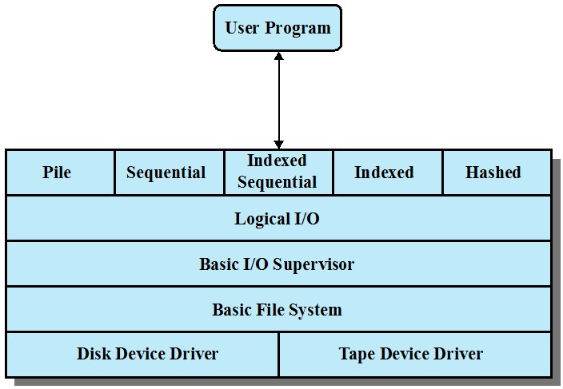

### 设备驱动
- 最底层
- 直接与外围设备（或它们的控制器或通道）通信
- 负责启动设备上的I/O操作
- 处理I/O请求的完成
- 通常视为操作系统的一个组成部分

### 基本文件系统
- 也称为物理I/O层
- 与计算机外部环境的基本接口
- 处理在磁盘间或磁带系统间的数据块
- 关注数据块在辅存的放置位置
- 关注数据块在内存缓冲区的放置位置
- 通常视为操作系统的一个组成部分

### 基本I/O管理程序
- 负责所有文件I/O的初始化和终止
- 维护处理设备I/O的设备，调度和文件状态的控制结构
- 选择要执行I/O的设备
- 关注调度磁盘和磁带访问以优化性能
- I/O缓冲区的指定和辅存的分配
- 通常视为操作系统的一个组成部分

### 逻辑I/O
- 使用户和应用程序能够访问记录
- 提供一种通用的记录I/O能力
- 维护文件基本数据

### 访问方法
- 文件系统中与用户最近的一层
- 提供应用程序和文件系统以及保存数据的设备之间的接口
- 不同的访问方法反映了不同的文件结构以及访问和处理数据的不同方式

## 文件管理的要素
- 用户和应用程序通过文件操作与文件系统交互，通过目录确定文件的位置
- 授权用户以特定的方式访问特定的文件
- 用户通过文件操作函数，基于字符流或记录来操作文件
- 系统对文件的I/O是以块为单位，基于块来完成输入/输出
- 操作系统需要为文件在磁盘上分配空闲块，同时还需要管理空闲空间

# 文件的组织或访问
- 文件组织指文件中记录的逻辑结构，由用户访问记录的方式确定
- 选择文件组织的5个重要原则
  - 快速访问
  - 易于修改
  - 节约存储空间
  - 维护简单
  - 可靠性
- 原则的优先级取决于使用文件的应用程序

## 堆文件
- 最简单的文件组织形式
- 按照到达的顺序收集数据
- 每条记录由一串数据组成
- 目的是积累大量数据并保存
- 通过穷举查找方法检索记录
- 特点
  - 变长记录
  - 可变域集
  - 按时间先后排序

## 顺序文件
- 最常见的文件组织形式
- 记录采用固定格式
- 关键字唯一标识一条记录
- 记录按照关键域组织
- 通常用于批处理应用中
- 很容易存储在磁盘和磁带

## 索引顺序文件
- 保留顺序文件的关键特征：记录按照关键域组织
- 增加了支持随机访问的索引和溢出文件
- 索引提供快速接近目标的查找能力
- 溢出文件类似于日志文件，要往文件中插入记录时，可以将其放在溢出文件中，并由主文件中它的前一个记录通过指针指向
- 可按批处理方式合并溢出文件
- 索引可以有多级

## 索引文件
- 只能通过索引访问记录
- 可以使用变长度记录
- 完全缩索引包含主文件中每条记录的索引项
- 部分索引只包含有感兴趣域的记录的索引项
- 主要用于信息及时性要求比较严格且很少对所有数据处理的应用程序

## 直接文件或散列文件
- 直接访问一个磁盘中任意一个地址已知的数据块
- 使用基于关键字的散列
- 典型应用场景
  - 快速访问
  - 固定长度记录
  - 一次访问一个记录

# 文件目录
## 目录信息单元
### 文件目录的基本信息
- 文件名：由创建者选择的名字，在同一个目录中必须唯一
- 文件类型：如文本文件、二进制文件、加载模块等
- 文件组织：供那些支持不同组织形式的系统使用

### 文件目录的地址信息
- 卷：指示存储文件的设备
- 起始地址：文件在辅存中的起始物理地址
- 使用大小：文件的当前大小，单位为字节、字或块
- 分配大小：文件的最大尺寸

### 文件目录的访问控制信息
- 所有者：文件主，可以授权或拒绝其他用户的访问、改变给予他们的权限
- 访问信息：该单位的最简单形式包括每个授权用户的用户名和口令
- 权限信息：控制读、写、执行及在网上传输

### 文件目录的使用信息
- 数据创建：文件首次放到目录中的时间
- 创建者身份：通常是当前所有者，但不一定必须是当前所有者
- 最后一次访问的日期
- 最后一次读用户的身份
- 最后一次修改的日期
- 最后一次修改者的身份
- 最后一次备份的日期
- 当前使用：当前文件活动的信息，如打开文件的进程、加锁等

## 目录操作类型
- 查找
- 创建文件
- 删除文件
- 显示目录
- 修改目录

## 目录结构
### 单级结构
- 在整个文件系统中只建立一张目录表，其中每个目录项对应一个文件
- 主要优点是实现简单
- 缺点：不允许文件重名；文件查找速度慢

### 两级结构
- 主目录：每个用户一个目录项，提供地址和访问控制信息
- 用户目录：用户文件的简单列表，文件名称须唯一

### 树状结构
- 每一级目录可以包含文件，也可以包含下一级目录
- 只有一个根目录，而且除根目录外，其余每个目录或者文件都有唯一的一个上级目标
- 单个父目录
- 多个子目录

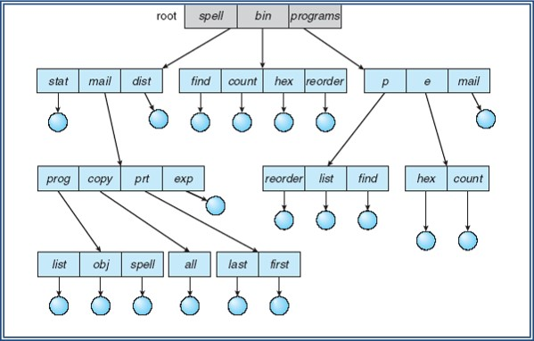

- 路径名
  - 任何文件可以按照根目录或主目录向下到各个分支，最后达到该文件的路径来定位
  - 多个文件可以同名，只要保证它们的路径名是唯一的即可
- 工作目录
  - 对于用户，总有一个当前路径与之相关联，称作工作目录
  - 多个文件可以同名，只要保证它们的路径名是唯一的即可
- 绝对路径：从根目录开始指定的目录
- 相对路径：从当前工作目录开始

### 无环图结构
- 在树型目录的基础上，允许多个目录项指向同一个数据文件或者目录文件，实现了目录或者数据文件的共享
- 不同的主目录可以共享一个文件和分目录，而不受各自拥有文件或分目录的拷贝
- UNIX目录结构即属于无环图结构
- 目录项的删除
  - 若对应的文件只有一个引用时，同时删除该文件
  - 若对应的文件存在多个引用时，只删除引用，而不删除文件。只有在所有文件引用都被删除后才删除文件

# 文件共享
## 用户共享
### 用户权限
- 无：不允许用户读取包含该文件的用户目录
- 知道：用户可以确定文件的存在性、所有者，可以向所有者请求更多地访问权限
- 执行：用户可以加载并执行程序，但不能复制
- 读：用户可以读取文件，包含复制和执行
- 追加：用户可以将数据添加到文件中，但不能修改或删除文件内容
- 更新：用户可以修改、删除和添加文件内容
- 改变保护：用户可以更改授予其他用户的访问权限
- 删除：用户可以从文件系统中删除该文件

### 用户划分
- 文件主
  - 通常是文件的初始创建者
  - 全部权限
  - 给其他用户授权
- 特定用户
  - 由用户ID指定的用户集合
- 组用户
  - 非单独定义的一组用户
- 全部
  - 有权访问该系统的所有用户
  - 公共文件

## 实体共享
- 一份物理存储
- 多个别名
- 在UNIX操作系统上，可通过链接实现文件共享

### 硬链接
- 多个文件名链接到同一个索引节点
- 索引节点的引用计数记录在索引结点的链接计数中，若其减至0，则文件被删除
- 链接文件和被链接文件必须位于同一个文件系统中

### 软链接、符号链接
- 特殊类型的文件，其链接内容是另一个目录或文件的路径
- 建立符号链接文件，并不影响原文件，它们是独立的文件
- 空间和时间开销更大

### 两种链接比较
- 硬链接
  - 只允许同一个文件系统范围内进行，不允许跨文件系统
  - 删除文件时，如果还有其它链接链至该文件，则该文件不能被删除
- 软链接
  - 访问速度相对慢，但适用范围和灵活性更大
  - 允许目录链接，允许运行在不同的文件系统间进行链接，这些文件系统可以在相同或不同的计算机上
  - 被链接文件的删除和符号链接的删除是相互独立的

# 记录组块
- 块是与辅存进行I/O操作的基本单位
- 为执行I/O，记录必须组织成块

## 组块方法

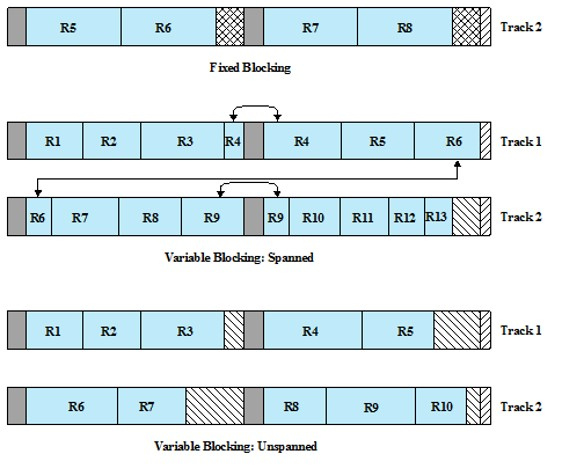
### 定长组块
- 使用定长的记录，且若干完整的记录保持在一个块中
- 内部碎片：每个块的末尾可能存在的未使用的空间

### 变长跨越式组块
- 使用变长的记录，并紧缩到块中，使得块中不存在未使用的空间

### 变长非跨越式组块
- 使用变长记录，但不采用跨越式方式，存在内部碎片

# 辅存管理
## 文件分配
- 在辅存中，文件由许多块组成
- 操作系统或文件管理系统负责为文件分配块
- 文件分配采用的方法可能会影响到空闲空间管理的方法
- 给文件分配的是一个或多个分区
- 文件分配表：用于跟踪分配给文件的分区的数据结构

### 预分配与动态分配
- 预分配策略要求在文件创建时声明文件的最大尺寸
  - 对于许多应用程序，很难可靠估计文件的最大尺寸
  - 用户和应用程序往往估大文件的最大尺寸，造成浪费
- 动态分配只有在需要时才给文件分配空间

## 分区大小
- 在选择分区大小时，需要折中考虑单个文件的效率和整个系统的效率
- 分区大小的考虑因素
  - 邻近空间可以提高性能
  - 数量较多的小分区会增加用于管理分配信息的表的大小
  - 使用固定大小的分区可以简化空间的再分配
  - 使用可变大小的分区或固定大小的小分区，可减少超额分配导致的未使用存储空间的浪费

## 选择策略
### 大小可变的大规模连续分区
- 性能较好
- 避免浪费
- 文件分配表较小
- 空间难以再次利用

### 块
- 小的固定分区能提供更大的灵活性
- 需要较大表或更复杂的结构来管理块的分配情况
- 邻近性不是主要目的
- 主要目的是根据需要来分配块

## 文件分配方法

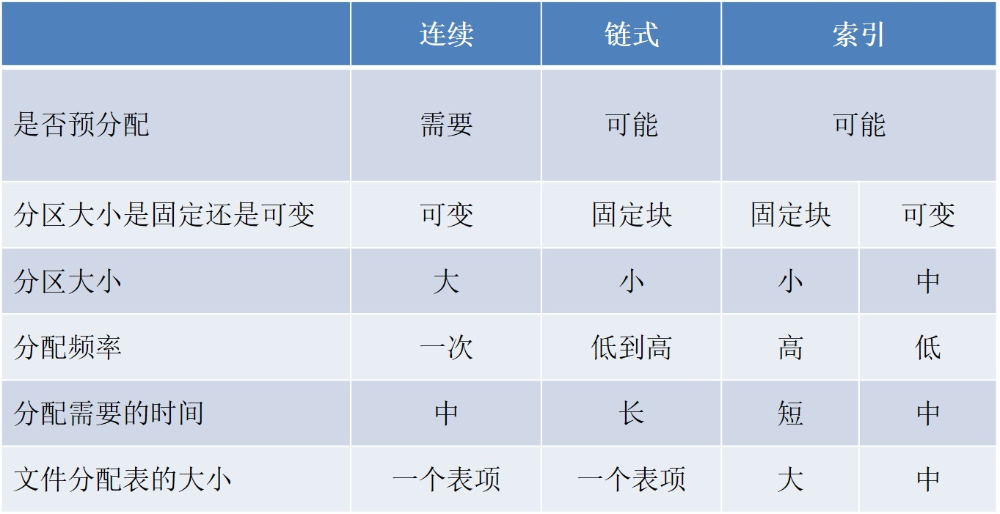

### 连续分配
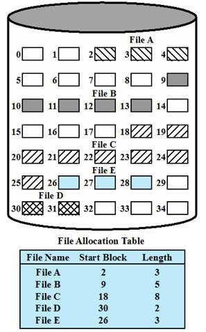
- 大小可变的预分配策略：创建文件时，分配一组连续的块
- 文件分配表里每个文件只需一个表项：说明起始块和长度
- 适合顺序文件，检索容易
- 问题
  - 外部碎片，需要紧凑
  - 预分配可能带来的问题

### 链式分配
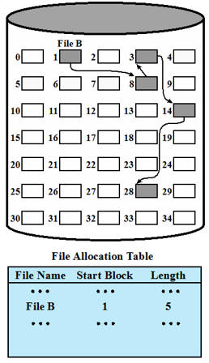
- 隐式链接：每个块都包含指向下一个块的指针
- 文件分配表里每个文件只需要一个表项：声明起始块和长度
- 可以根据需要分配块，加入链中
- 适合顺序处理文件
- 问题
  - 多个块离散分配，使得局部性原理不再适用，若需要一次读入多个块，得访问磁盘不同的部分
    - 需要周期性合并文件

- 显式链接：用于链接文件各物理块的指针，显式地存放在文件分配表FAT中，该表在整个磁盘分区中仅一张

### 基于块的索引分配
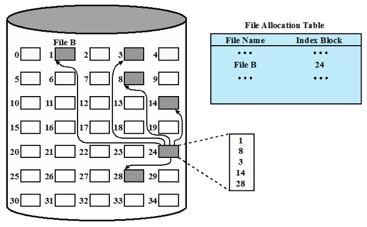
- 分配给文件的每个块在索引中都有一个表项
- 索引作为单独的块来保存，文件分配表中的表项指向索引块
- 每个文件在文件分配表中都有一个一级索引

### 基于长度可变分区的索引分配
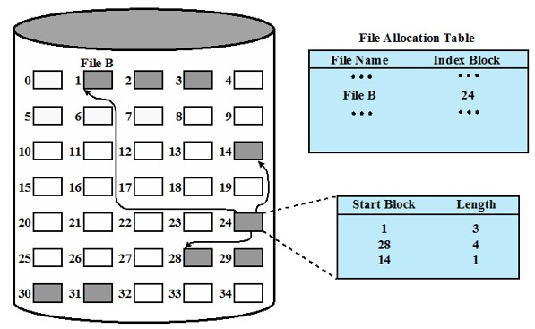
- 分配给文件的每个分区在索引中都有一个表项
- 基于大小可变分区分配可提高局部性
- 基于分区索引的文件整理可以减少索引数量，但是基于块索引则不行

## 空闲空间管理
### 位示图（位表）
- 使用一个向量，向量中的每一位对应于磁盘中的每一块
- 0表示空闲块，1表示已使用块
- 优点
  - 适用于任何文件分配方法
  - 非常小
  - 很容易找到一个或一组连续的空闲块
- 位示图占用存储空间大小：$\frac{磁盘容量}{8\times 数据块大小}$
- 大位示图搜索将会降低文件系统的性能

### 链接空间分区
- 使用指向每个空闲区的指针和它们的长度值，可将空闲区链接在一起
- 不需要磁盘分配表，空间开销可以忽略不计
- 适用于所有的文件分配方法
- 缺点
  - 存在碎片
  - 每次分配块时，在把数据写到块中之前，需要先读取这个块，以便找到指向新的第一个空闲块的指针

### 索引
- 将空闲空间视为一个文件，并使用索引表为文件分配空间
- 为了提高效率，索引应基于可变大小的分区而不是块
- 适用于所有的文件分配方法

### 空闲块列表
- 每个块指定一个序号：所有空闲块的序号保存在磁盘的一个保留区中
- 根据磁盘的大小，存储一个块号需要24位或32位
- 可把该表的一小部分保存到内存
  - 该表可视为一个下推栈，栈中靠前的数千个元素保留在内存中
  - 该表可视为一个FIFO队列，队列头和队列尾的几千项在内存中

## 卷
- 不同操作系统和不同的文件管理系统中含义不同
- 本质上是逻辑磁盘
- 指一组在辅存上可寻址的扇区的集合，操作系统或应用程序用卷来存储数据
  - 卷中的扇区在物理存储设备上不需要链接
  - 只需要对操作系统或应用程序来说连续即可
  - 卷可能由更小的卷合并或组合而成

# UNIX文件管理
## 文件类型
- 普通文件
  - 可存储任意数据，视为字节流，保存在一个或多个数据块中
- 目录
  - 包含文件名列表和指向与之相关联的索引节点的指针
- 特殊文件
  - 不包含数据，但提供一个将物理设备映射到一个文件名的机制
- 命名管道
  - 进程间通信的基础设施
- 链接文件
  - 一个文件的别名
- 符号链接
  - 一个数据文件，包含其所链接的文件的文件名

## 索引节点
- 所有类型的UNIX文件都是由操作系统通过索引节点来管理的
- 索引节点是一个控制结构，包含操作系统所需的关于某个文件的关键信息
- 多个文件名能与一个索引节点相关联
- 优点
  - 索引节点大小固定，且相对较小，因此能在内存中保留较长的时间
  - 访问小文件时，几乎可不间接进行，因此能减少处理时间和磁盘访问时间
  - 理论上，文件大小对所有应用程序来说都是足够的

### FreeBSD
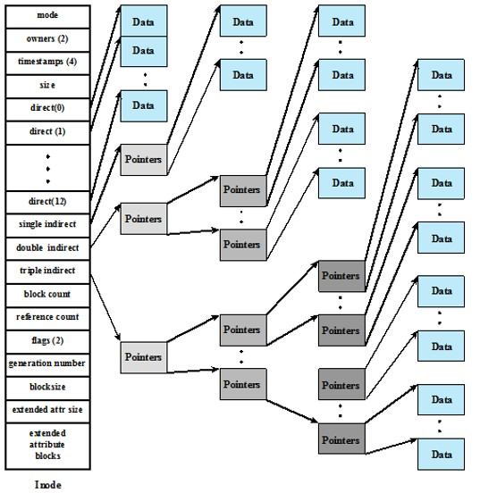

- 文件分配是以块为基础完成的
- 按需动态分配，而非预定义分配
- 系统为了知道每个文件，采用一种索引方法，索引的一部分保存在该文件的索引结点中
- 在UNIX实现中，索引结点都包含一些直接指针和三个间接指针

## UNIX文件系统驻留在单个逻辑磁盘或磁盘分区
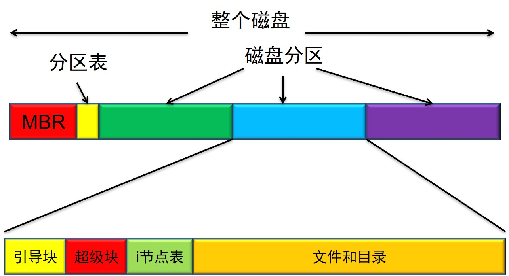

- 引导块
  - 包含引导操作系统的代码
- 超级块
  - 包含有关文件系统的属性和信息
- 索引结点表
  - 所有文件的索引节点集
- 数据块
  - 数据文件和子目录文件所需的存储空间

### 路径解析
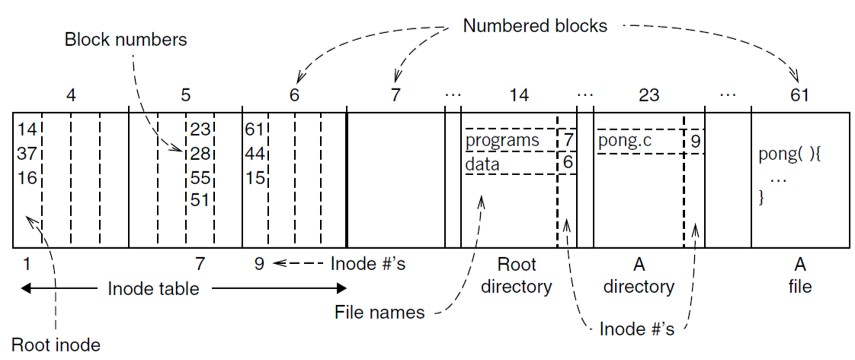

/programs/pong.c
1. 找到索引节点表里第一个表项，记录了根目录文件的存储位置，第一个为14块
2. 找到14块，看到programs文件的inode号为7
3. 在索引节点表里找到第7个表项，记录了programs目录文件的存放位置，第一个块为23
4. 找到23块，看到pong.c文件的inode号为9
5. 在索引节点表里找到第9个表项，记录了pong.c文件的存放位置，第一个块为61块
6. 一次访问61、44、15块，可得到pong.c文件的内容
