# I/O设备
## 设备分类
- 人可读
  - 适用于计算机和用户之间的交互
  - 如打印机，终端
- 机器可读
  - 适用于电子设备通信
  - 如磁盘驱动器、USB密钥、传感器和控制器等
- 通信
  - 适用于远程设备通信
  - 如调制解调器、网卡等

## I/O设备的差异
- 数据传输速率
- 应用
- 控制的复杂性
- 传输单元
- 数据表示
- 错误条件

# I/O控制方式
- 程序I/O方式
- 中断驱动I/O方式
- 直接存储器访问（DMA）方式

## 程序I/O方式
- CPU代表进程给I/O模块发送I/O命令
- 该进程进入忙等待，等待操作完成，才可以继续执行

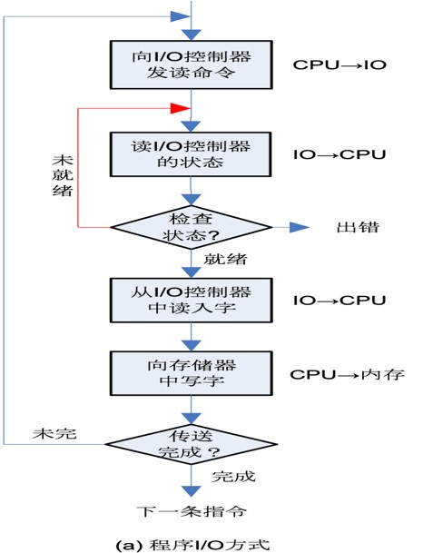

## 中断驱动I/O方式
- CPU代表进程给I/O模块发送I/O命令
  - 如果I/O指令是非阻塞的，则继续执行后续指令
  - 如果I/O指令是阻塞的，当前进程阻塞，调度其他进程

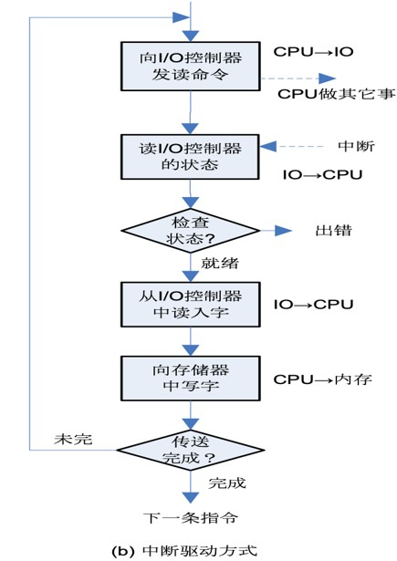

## 直接存储器访问方式
- DMA模块控制内存和I/O模块之间的数据交换
- 处理器给DMA模块发送请求，整块数据传送结束，才中断处理器

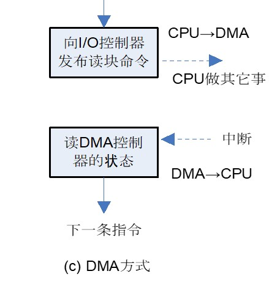

### 工作流程
1. 处理器需要读写数据时，读或写操作的信号，通过在处理器和DMA模块间的读写控制线发送
2. 相关的I/O设备地址，通过数据线传送
3. 从存储器中读或向存储器写的起始地址，在数据线上传输，并由DMA模块保存在地址寄存器中
4. 读或写的字数，通过数据线传送，并由DMA模块保存在计数寄存器中
5. 处理器继续执行其他工作，I/O操作委托给DMA模块，DMA直接从存储器读或向存储器写
6. 整块数据传送结束后，DMA向处理器发送中断信号

### 与中断驱动I/O比较
- 中断频率
  - 中断驱动I/O：每次传输一个数据即产生中断
  - DMA：一块数据全部传送结束时才中断CPU
- 数据传输
  - 中断驱动I/O：数据传送在中断处理时由CPU控制完成
  - DMA：数据传送在DMA控制器的控制下完成
- 应用
  - DMA：块设备，如磁盘
  - 中断驱动I/O：字符设备，如键盘、鼠标

## I/O通道控制方式
- 一个设备可以连接到多个控制器上，而一个控制器又连接到多个通道上
- 可以在不增加成本的基础上，增加设备到主机的通路

### 与DMA比较
- DMA：CPU每发出一条I/O指令，以一个数据块为单位完成数据读写。CPU控制传输方向、数据大小、数据在内存的位置
- I/O通道：是DMA方式的发展，有自己的I/O指令集，通过执行通道程序，与设备控制器共同实现对I/O设备的控制
  - 以一组数据块为单位完成数据的读（或写）控制
  - 通道控制传输方向、数据大小、数据在内存的位置
- 通道可实现CPU、通道和I/O设备三者的并行操作，从而更有效地提高整个系统的资源利用率

## I/O功能的发展
- 处理器直接控制外围设备
- 增加了控制器或I/O模块，程序方式控制I/O
- 增加了中断方式
- I/O模块通过DMA直接控制存储器
- I/O模块（I/O通道）有单独的处理器，有专门的I/O指令集
- I/O模块（I/O通道）有自己的局部存储器，本身就是一台计算机

# 操作系统的设计问题
## I/O设计目标
### 效率
- I/O设计的主要任务
- I/O操作通常是计算机系统的瓶颈
- 与内存和处理器相比，大多数I/O设备的速度都很低
- 最受关注的是磁盘I/O

### 通用性
- 用统一方式处理所有设备
- 处理器看待I/O设备的方式统一
  - 操作系统管理I/O设备统一
  - I/O操作的方式统一
- 设备的多样性使得实现通用性较困难
- 因此使用层次化的、模块化的方法设计I/O功能

## 层次化设计
- 操作系统的功能可以根据复杂性、特征时间尺度和层次的抽象来分开
- 具体可以采用层次划分的方式来组织操作系统的功能
- 每一层执行相关的子功能
- 分层定义使得某层的功能变化不影响其他层次

## I/O功能组织模型
- 逻辑I/O：把设备当作逻辑资源处理，不关心控制设备的细节
- 设备I/O：请求的操作和数据被转换成对应的I/O指令、通道指令和控制器指令，并可以使用缓冲提高效率
- 调度和控制：与硬件真正发生交互的软件层。处理中断、收集和报告I/O状态

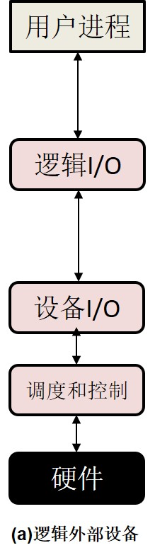

### 设备的独立性、无关性
- 应用程序独立于具体使用的物理设备
- 逻辑I/O模块允许应用程序使用逻辑设备名及简单的设备操作命令与设备打交道
- 设备I/O模块讲逻辑I/O的请求和操作转换成对相应物理设备的I/O访问控制

### 代表性结构
#### 通信设备
- 逻辑I/O模块被通信架构代替
- 通信架构本身也包含许多层

#### 文件系统
逻辑I/O
- 目录管理：符号文件名被转换成标识符，通过该标识符可以访问文件描述符表或索引表
- 文件系统：处理文件的逻辑结构和用户指定的操作，如打开、关闭、读写等
- 物理系统：基于辅存设备的物理磁道和扇区结构，对文件的逻辑访问转换成对辅存物理地址的访问

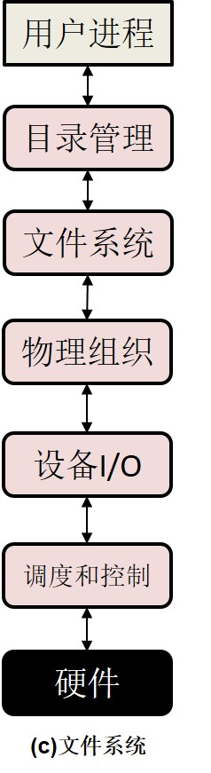
# 缓冲
- 在输入请求发出前开始输入传送
- 在输出请求发出后一段时间才开始执行输出传送
- 面向块的设备
  - 信息保存在块中，块的大小固定
  - 一次传送一个块
  - 通过块号访问数据
  - 代表设备：磁盘、USB
- 面向流的设备
  - 以字节流的方式输入/输出设备
  - 没有块的结构
  - 代表设备：终端、打印机、通信端口、鼠标及其他大多数非辅存设备

## 无缓冲
- 无缓冲时，操作系统在需要时直接访问设备

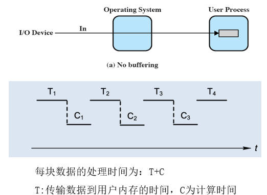

## 单缓冲
- 操作系统在内存中给I/O请求分配一个缓冲区

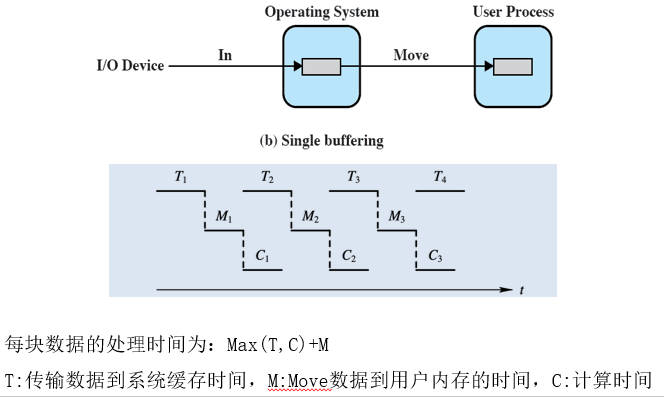

### 面向块设备的单缓冲
- 采用预读/预先输入
  - 期望输入的数据块最终会被使用
  - 输入的数据被放到系统缓冲区中
  - 传送完成时，进程将数据块移到用户空间，并立即请求下一块
- 相对于无系统缓冲情况，预读方式可以提高数据获取速度
  - 可以在读取下一块数据时，处理已经读入的数据
- 不足
  - 使操作系统的逻辑变得更复杂
    - 操作系统需要记录给每个进程分配的系统缓冲区情况
  - 交换逻辑也受到影响

### 面向流的单缓冲
- 每次传送一行
  - 适用于滚动模式的终端
  - 用户每次输入一行，以回车键结束输入时，也是每次输出一行
- 每次传送一个字节
  - 适用于表格式的终端
  - 用户每次击键很重要
  - 其他外围设备如传感器、控制器等

## 双缓冲
- 使用两个缓冲
- 进程向一个缓冲区中传送（或取出）数据时，操作系统正在清空（或填充）另一个缓冲区
- 也称为缓冲交换

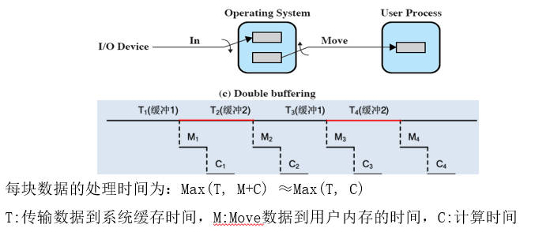

## 循环缓冲
- 使用两个或多个缓冲区构成循环缓冲
- 当希望I/O操作跟上进程执行速度时，使用循环缓冲

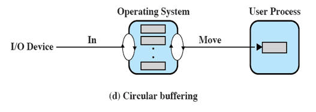

## 缓冲的作用
- 缓解I/O设备速度与CPU速度不匹配的矛盾
  - 当进程的需求大于I/O设备的服务能力时，进程推进与I/O设备的操作将不能并驾齐驱
  - 进程每处理完一块数据后得停下来等待
- 在多道程序环境中，当存在多种I/O活动和多种进程活动时，缓冲可以提高操作系统效率，提高单个进程的性能

## SPOOLing技术（磁盘中的缓冲）
- 在磁盘中建立I/O缓冲区，缓和CPU的高速性与I/O设备低速性间的矛盾
- 在联机（即CPU控制）情况下实现的同时外围操作称为SPOOLing，或称为假脱机操作
- 通过SPOOLing技术便可将一台独占物理I/O设备虚拟为多台逻辑I/O设备，从而允许多个用户共享一台物理I/O设备
- 特点
  - 提高I/O速度：对低速I/O设备进行操作，演变为对输入/输出井中数据的存取
  - 将独占设备改变为共享设备：实际上并没有任何进程分配设备，而只是在输入井或输出井中为进程分配一个存储区和建立一张I/O请求表
  - 实现了虚拟设备功能：系统实现了将独占设备变换为若干台对应的逻辑设备的功能

# 磁盘调度
## 磁盘存储器
- 磁盘设备可包含一或多个物理盘片，每个磁盘片分一个或两个存储面
- 每个磁盘面被组织成若干个同心环，这种环称为磁道
- 每条磁道逻辑上划分成若干个扇区
- 不同盘面相同的磁道称为柱面
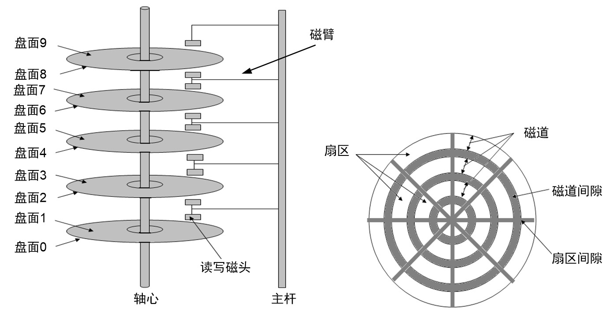
## 磁盘类型
- 固定头磁盘：每条磁道上都有一读/写磁头，速度快，成本高
- 移动头磁盘：每一个盘面仅配有一个磁头，结构简单，成本低

## 磁盘性能参数
### 读写头的位置
- 当磁盘驱动器开始工作时，磁盘以一个恒定的速度旋转
- 为了读或写，磁头定位于指定的磁道和该磁道中指定扇区的开始处
- 寻道操作
  - 磁头可移动系统：将磁头移动到指定磁道
  - 磁头固定系统：机械自动选择合适的磁头
- 寻道时间$T_s$：在磁头可移动系统中，将磁头臂移动到指定磁道所需的时间

### 旋转延迟
- 磁头定位到指定磁道后，等待磁盘旋转，将待访问的扇区移动到磁头位置所花时间称为旋转延迟
- 平均旋转延迟：$T_r = \frac{1}{2r}$

### 传输时间
- 向磁盘传送或从磁盘传送数据的时间，取决于磁盘的旋转速度
- T为传输时间，b表示要传送的字节数，r表示旋转速度，N表示一个磁道中的字节数

  $T_t = \frac{b}{rN}$

### 磁盘访问时间
$T_a = T_s + T_r + T_t = T_s + \frac{1}{2r} + \frac{b}{rN}$

### 例题
考虑一个典型的磁盘，平均寻道时间为4ms，转速为7500r/m，每个磁道有500个扇区，每个扇区有512个字节。假设有一个文件存放在2500个扇区上，估算下列两种情况下读取该文件需要的时间。

（1）2500个扇区分别位于5个相邻磁道上，且文件按扇区顺序存放；
（2）2500个扇区随机分布。

- 寻道时间：$T_s = 4ms$
- 平均旋转延迟：$T_r = \frac{1}{2\times 7500r/m} = 4ms$
- 顺序存放
  - 每个磁道：$T_t = \frac{1}{7500r/m} = 8ms$
- 随机存放：
  - 每个扇区:$T_t = \frac{1}{500\times 7500r/m} = 0.016ms$
- 第一题：$4 + (4 + 8)\times 5 = 0.064s$
- 第二题：$(4 + 4 +0.016) \times 2500 = 20.04s$

数据连续存储，有利于提高存取效率

## 磁盘调度策略
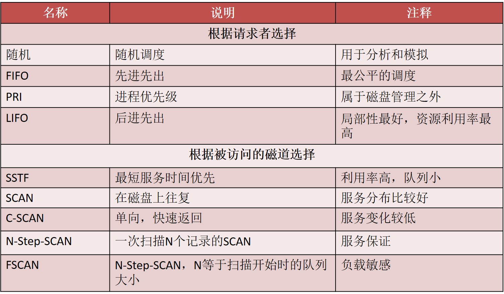

### FIFO
- 根据进程请求访问磁盘的先后顺序，处理队列中的访问需求
- 公平
- 大量进程竞争一个磁盘时，性能接近随机调度

### 优先级Priority
- 调度的控制不属于磁盘管理软件的范畴
- 目标不是优化磁盘的利用，而是满足其他操作系统的其他需求
- 给短的批处理作业和交互式作业赋予较高优先级
- 提供了较好的交互响应时间
- 长作业得等待较长时间
- 对数据库系统，这类策略性能较差

### LIFO后进先出
- 优先处理新到请求
- 在事务处理系统中，由于顺序读取文件，利用局部性，优先处理新到的请求，可以减少磁臂移动
- 大量请求到达导致磁盘忙碌时，会出现先到请求的饥饿

### 最短服务时间优先/最短寻道时间优先（SSTF）
- 选择从磁臂当前位置开始移动到最短距离的磁盘I/O请求
- 总是选择最短寻道时间的请求

### SCAN电梯算法
- 磁头只沿着一个方向移动
- 在移动途中满足所有未完成的请求，直到到达移动方向的尽头，然后掉头，沿反方向扫描
- 偏爱那些最靠里和最靠外的磁道请求

### C-SCAN
- 限定只朝一个方向扫描
- 当磁臂沿指定方向扫描到磁盘最后一个磁道时，磁臂返回到反方向末端，再次沿指定方向扫描

### N-Step-SCAN
- SSTF,SCAN和C-SCAN具有磁头臂黏着现象
  - 当一个或多个进程对同一个磁道具有较高访问速度时，磁头臂黏在相应磁道上不移动
- 为了避免黏着问题，N-Stap-SCAN将磁盘访问请求序列分为若干个子队列，每个子队列的长度为N
- 每次使用SCAN方法处理一个队列
- 当前队列正在处理时，新到的访问请求必须加到其他队列中
- 当扫描到最后一个队列，如果队列中的请求数小于N，则下次再扫描
- N较大时，性能接近SCAN；N=1时，就是FIFO

### FSCAN
- 使用两个子队列
- 当扫描开始时，所有请求都放在一个队列中，另一个队列为空
- 扫描过程中，新到的请求被放到另外一个队列中
- 当原来队列里的请求处理完毕时，才会处理另一个队列里的请求

# RAID
## 设计体系共享三个特性
- RAID是一组物理磁盘驱动器，操作系统把它视为单个逻辑驱动器
- 数据分布在物理驱动器阵列中，这种设计机制被称为条带化
- 使用冗余的磁盘容量来保存奇偶校验信息，使得当一个磁盘失效时，能够通过检验信息加以恢复数据

## RAID分级
### RAID 0
- 不是真正的RAID，不提供冗余功能
- 用户数据和系统数据被视为存储一个逻辑磁盘，这个逻辑磁盘被划分成多个条带
- 这些条带被映射到多个物理磁盘中

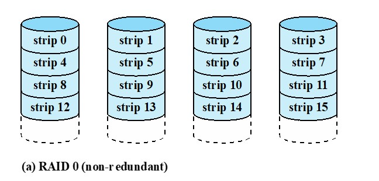

### RAID 1
- 通过简单的镜像来提供冗余功能
- 写数据时没有因奇偶校验产生的开销
- 当一个磁盘失效时，可以通过另外一个盘访问数据
- 写性能比RAID 0无明显优势
- 主要问题时成本问题

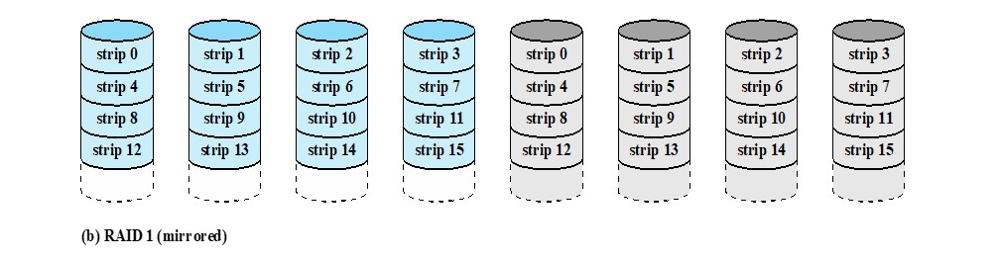

### RAID 2
- 使用并行访问技术，所有磁盘参与每个I/O请求
- 条带非常小
- 为数据盘中相应位计算错误校验码，校验码通常使用汉明码，保存在多个校验盘相应位中
- 在可能发生很多磁盘错误的环境中，RAID2是一个有效的选择

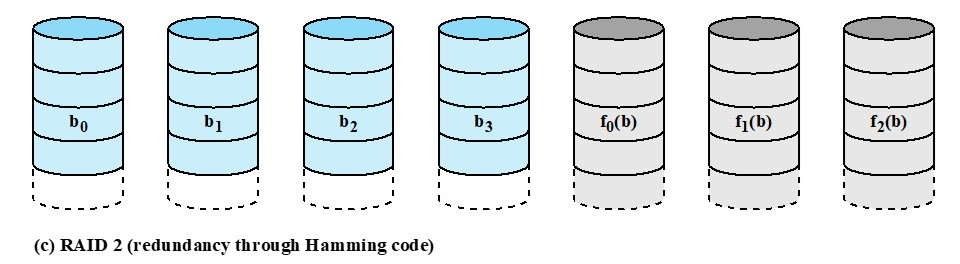

### RAID 3
- 不管磁盘阵列有多大，只需要一个荣誉盘
- 采用奇偶校验，为所有盘中同一位的集合计算奇偶校验位
- 采用了并行访问技术，所有磁盘参与每个I/O请求，数据分布在较小的条带中
- 可以达到很高的数据传输速率

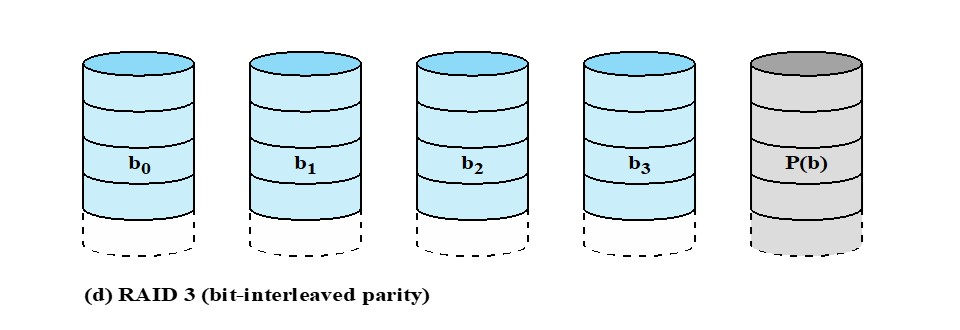

### RAID 4
- 只需要使用一个冗余磁盘来完成奇偶校验
- 数据以较大的条带分布在各个盘中，每个磁盘单独运转，不同I/O请求可以同时满足
- 为所有数据磁盘中同一位置的位计算逐位的奇偶校验位，这个位保存在奇偶校验盘
- 开销：写数据时还需要计算校验位并存放在校验位中

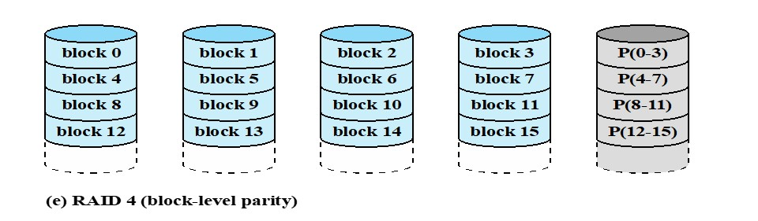

### RAID 5
- 与RAID4相似，不同的是奇偶校验条带循环分布在各个盘中
- 避免一个RAID4奇偶校验盘潜在的瓶颈问题。任意一个盘上的数据失效不会引起数据丢失

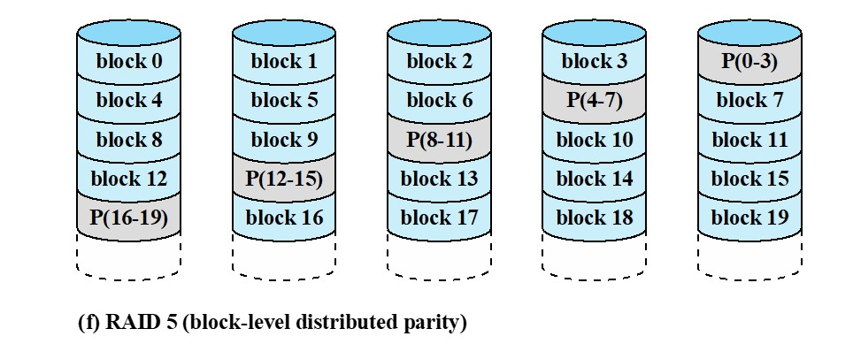
### RAID 6
- 采用了两种不同的奇偶校验计算，分别保存在不同磁盘的不同块中
- 高可靠性：除了同级数据异或校验区外，还有一个针对每个数据块的独立校验区。使得即使有两个包含用户数据的磁盘发生错误，也可以重新生成数据
- 产生了额外开销，写数据时需生成两个校验盘数据

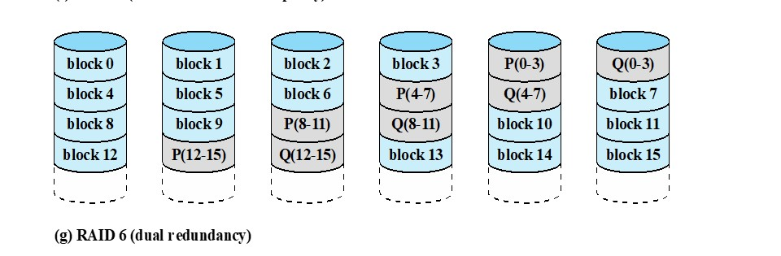

# 磁盘高速缓冲
## 高速缓存(cache memory)
- 比内存小，比内存快的存储器，用在处理器与内存之间
- 基于局部性原理，减少对内存的平均访问时间

## 磁盘高速缓存
- 为磁盘扇区而设置，位于内存的缓冲区
- 包含了磁盘某些扇区的副本

## 置换策略
### LRU算法
- 最常用的算法
- 位于磁盘高速缓存中最近最少使用的块被换出
- 逻辑实现
  - 用指向磁盘高速缓存的指针栈来组织块
  - 最近被访问过的块被放在栈顶
    - 当一个块被引用或从磁盘放入高速缓存时，将它放在栈顶
  - 位于栈底的块即是置换对象

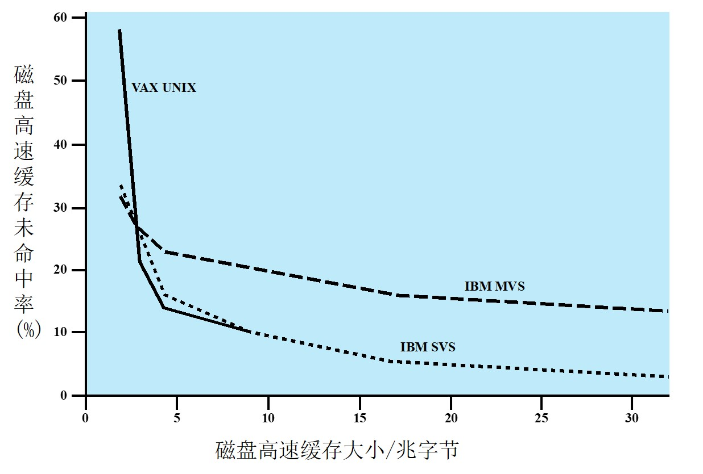
### LFU
- 置换访问次数最少的块
- 为每个块关联一个计数器
- 每次访问时，对应块的计数器增加1
- 当需要置换时，选择计数器值最小的块置换
- 当一个块短期内被频繁访问，计数器值迅速增加，之后即使长时间不访问，也不会被选作置换对象
  - 将磁盘高速缓存分区
  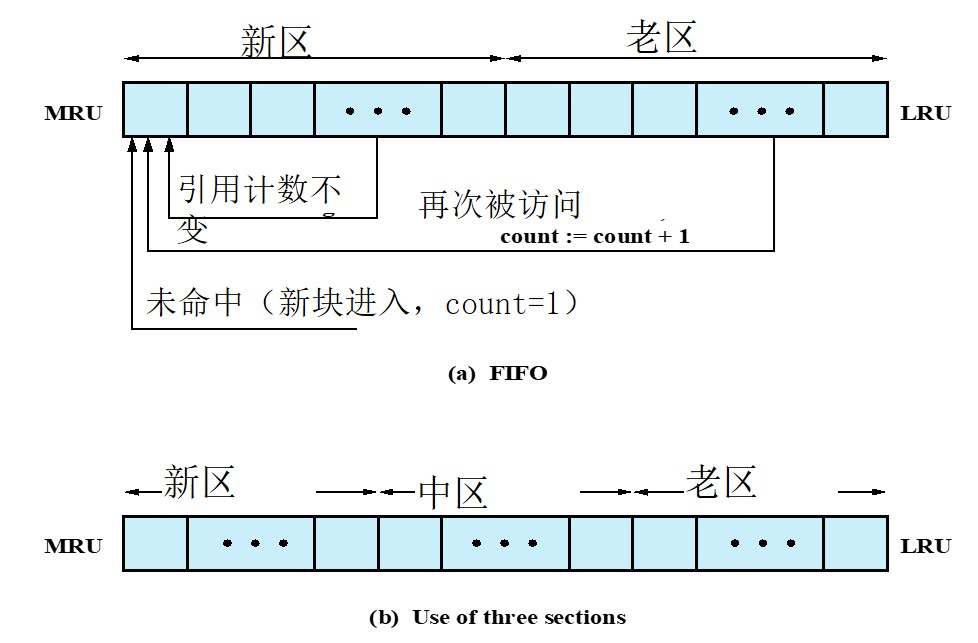

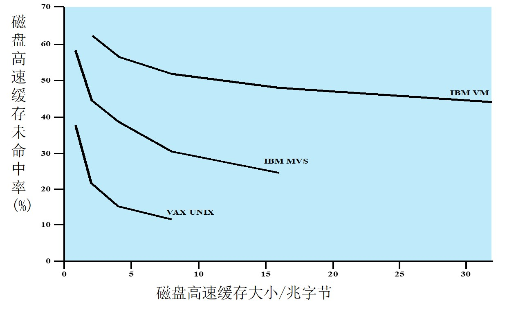
