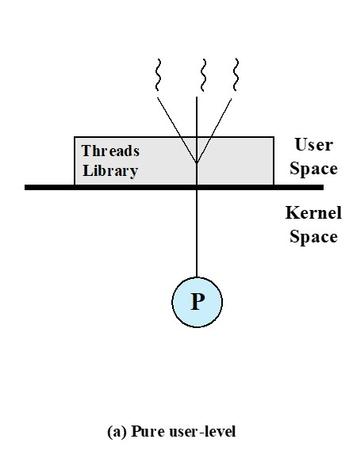
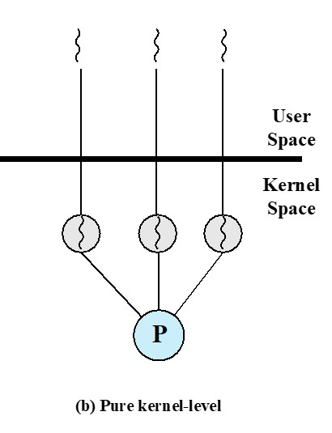
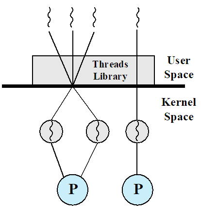

# 进程和线程
## 进程的特点
1. 资源所有权：进程包括存放进程映像的虚拟地址空间
2. 调度/执行：进程执行时采用一个或多程序的执行路径，不同进程的执行过程会交替进行
## 线程的引入
进程的两个特点是独立的，操作系统应能分别处理它们。
- 线程（轻量级进程）：分派的单位
- 进程（任务）：拥有资源所有权的单位
## 多线程
多线程是指操作系统在单个进程内支持多个并发执行路径的能力。
### 多线程下的进程
进程定义为资源分配单元和一个保护单元。与进程相关联的有：
- 容纳进程映像的虚拟地址空间
- 对处理器、其他进程、文件和I/O资源的受保护访问
  - 处理器
  - 其他进程
  - I/O
  - 文件
### 线程
一个进程可能有多个线程，每个线程都有
- 一个线程执行状态（运行、就绪等）
- 未运行时保存线程的上下文；线程可以视为在进程内运行的一个独立程序计数器
- 一个运行栈
- 每个线程用于局部变量的一些静态存储空间
- 与进程内其他线程共享的内存空间和资源的访问
### 线程的优点
- 在已有进程中创建一个新线程的时间远少于创建一个全新进程的时间
- 终止线程比终止进程所花的时间少
- 同一进程内线程切换的时间，要少于进程间切换的时间
- 线程提高了不同执行程序间通信的效率
### 支持线程的OS
调度和分派是在线程基础上完成的
- 大多数与执行相关的信息可以保存在线程级的数据结构中
- 挂起一个进程会挂起进程内部所有线程
- 终止一个进程会终止进程内部所有线程
## 线程的功能
### 线程状态
运行态、就绪态、阻塞态
### 线程状态变化的基本操作
- 派生
- 阻塞
- 解除阻塞
- 结束
### 线程同步
- 一个进程中的所有线程共享同一个地址空间和诸如打开的文件之类的其他资源
- 一个线程对资源的任何修改都会影响同一进程中其他线程的环境
# 线程的分类
## 用户级线程(ULT)

- 管理线程的所有工作都由应用程序完成
- 内核意识不到线程的存在
### 优点
- 线程切换不需要内核模式特权
- 调度策略因应用程序不同而不同
- 可以运行在任何操作系统上
### 缺点
- 在典型的操作系统中，许多系统调度都会引起进程的阻塞；因此，当用户级线程执行系统调用时，不仅阻塞当前线程，还将引起同一进程中的其他线程阻塞
- 不能利用多处理器技术
### 缺点的解决办法
- 将一个可能产生阻塞的系统调用转换成一个非阻塞的系统调用
- 将一个应用程序写成多进程而不是多线程
## 内核级线程(KLT)

- 线程管理由内核完成
- 应用程序没有线程管理的工作
### 优点
- 可以把同一进程的多线程调度到多处理器上
- 当一个线程阻塞时，内核可以调度同一进程内的其他线程
- 内核历程本身也可以是多线程的
### 缺点
- 把控制器从一个线程传递到相同进程内的另一个线程时，需要切换到内核模式
## 混合方法
- 线程创建在用户空间完成
- 线程调度和同步也由应用程序完成
- 一个进程内的多个线程被映射到一些内核线程上

