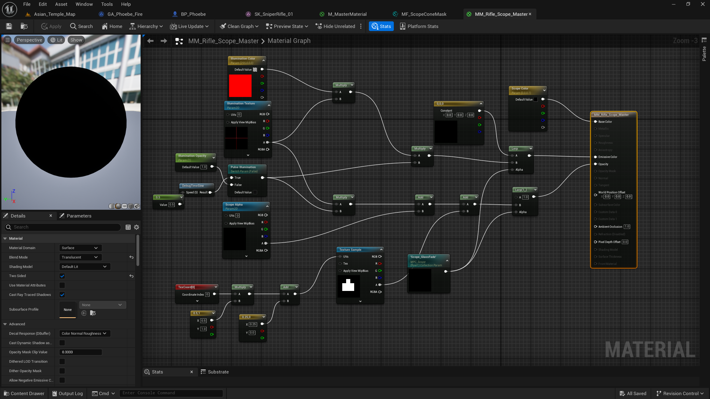

## 修改 ADS 状态下 Camera 与 Weapon 之间的关系
在上一篇文章的实现中，ADS（Aim Down Sight）状态下的瞄准逻辑采用的是一种较为直观的结构：摄像机主动附着到武器的 `AimSocket` 上。这样做的好处是实现简单，只需要将摄像机挂接到武器的瞄准 Socket，摄像机就会自然跟随武器移动，从而实现瞄准镜对齐的效果。

然而，在实际开发过程中，这种结构逐渐暴露出一些问题。由于摄像机的位置完全依赖于武器 Socket 的变换，摄像机系统与武器动画系统之间形成了较强的耦合关系。一旦武器的骨骼动画、IK 调整或者 Socket 插值发生变化，摄像机的位置也会随之产生微小波动。这不仅会影响 ADS 过渡的平滑程度（在过渡中，相机常常异常抽搐旋转），也会干扰多人游戏中子弹视觉效果的同步：本项目子弹视觉效果与逻辑分离，向对象池索取子弹时，不会接收来自 Owner 端的朝向，而是根据本地对应角色的 `LineTrace` 结果设置。

在本次优化中，我对这一结构进行了一个简单的调整：将原本“摄像机附着到武器”的关系反转为“武器附着到摄像机”。

也就是说，在 ADS 状态下：
```
Camera
 └── Weapon
```

而不是：
```
Weapon
 └── Camera
```

这样一来，摄像机就成为整个瞄准系统中最稳定的参考坐标系，武器的相对位置则由摄像机驱动，从而显著降低了动画系统对相机逻辑的影响。

### 相机过渡逻辑
摄像机本身的过渡仍然由 `CameraBoom` 控制，通过插值调整 `TargetArmLength` 与 `SocketOffset`，实现从第三人称到 ADS 视角的平滑过渡：
```
void ABaseCharacter::UpdateCamera(const float DeltaTime)
{
	if (IsLocallyControlled())
	{
		UpdateFOV(DeltaTime);
	}

	if (!TPSCamera || !CameraBoom) return;

	constexpr float TargetArmLength_Hip = 300.0f;
	constexpr float TargetArmLength_ADS = 0.0f;

	const FVector SocketOffset_Hip = FVector(0.0f, 70.0f, 80.0f);
	const FVector SocketOffset_ADS = FVector(0.0f, 10.0f, 80.0f);

	const float TargetArmLength = bIsADS ? TargetArmLength_ADS : TargetArmLength_Hip;
	const FVector TargetSocketOffset = bIsADS ? SocketOffset_ADS : SocketOffset_Hip;

	const float NewArmLength = FMath::FInterpTo(
		CameraBoom->TargetArmLength,
		TargetArmLength,
		DeltaTime,
		ADSSpeed
	);

	const FVector NewSocketOffset = FMath::VInterpTo(
		CameraBoom->SocketOffset,
		TargetSocketOffset,
		DeltaTime,
		ADSSpeed
	);

	CameraBoom->TargetArmLength = NewArmLength;
	CameraBoom->SocketOffset = NewSocketOffset;

	if (FMath::IsNearlyEqual(CameraBoom->TargetArmLength, TargetArmLength, 0.1f))
	{
		CameraBoom->TargetArmLength = TargetArmLength;
	}

	if (CameraBoom->SocketOffset.Equals(TargetSocketOffset, 0.1f))
	{
		CameraBoom->SocketOffset = TargetSocketOffset;
	}
}
```
在普通持枪状态下，摄像机保持典型的 TPS 视角：

```
ArmLength = 300
Offset = (0, 70, 80)
```

进入 ADS 状态后，CameraBoom 会通过插值逐渐收缩到：

```
ArmLength = 0
Offset = (0, 10, 80)
```

### ADS状态下的武器挂接
当角色进入 ADS 状态时，武器会被重新挂接到摄像机组件上：
```
WeaponMesh->AttachToComponent(
	TPSCamera,
	FAttachmentTransformRules::SnapToTargetNotIncludingScale
);
```
随后，通过武器上的两个 Socket（`PreAimSocket` 与 `AimSocket`）计算武器在 ADS 过程中的相对变换：
```
const FTransform PreAimSocketTransform =
	WeaponMesh->GetSocketTransform(TEXT("PreAimSocket"), RTS_Component);

const FTransform AimSocketTransform =
	WeaponMesh->GetSocketTransform(TEXT("AimSocket"), RTS_Component);

ADSStartRelativeTransform = PreAimSocketTransform.Inverse();
ADSTargetRelativeTransform = AimSocketTransform.Inverse();
```
`PreAimSocket` 表示武器刚进入 ADS 时的起始位置，而 `AimSocket` 则表示完全瞄准时的目标位置。通过对这两个变换进行插值，可以实现武器从左侧到对准瞄准镜的平滑过渡（模拟 FPS 中，瞄准时的武器运动）。

在进入 ADS 时，武器会先被设置到 PreAimSocket 对应的位置：
```
WeaponMesh->SetRelativeTransform(ADSStartRelativeTransform);
bADSWeaponTransition = true;
```
随后在更新逻辑中逐渐插值到 `AimSocket`:
```
void ABaseCharacter::UpdateADSWeaponTransition(float DeltaSeconds)
{
	if (!bADSWeaponTransition || !bIsADS)
	{
		return;
	}

	USkeletalMeshComponent* WeaponMesh = GetCurrentWeaponMesh();
	if (!WeaponMesh)
	{
		bADSWeaponTransition = false;
		return;
	}

	const FTransform Current = WeaponMesh->GetRelativeTransform();

	const FVector NewLocation = FMath::VInterpTo(
		Current.GetLocation(),
		ADSTargetRelativeTransform.GetLocation(),
		DeltaSeconds,
		ADSWeaponInterpSpeed
	);

	const FQuat NewRotation = FMath::QInterpTo(
		Current.GetRotation(),
		ADSTargetRelativeTransform.GetRotation(),
		DeltaSeconds,
		ADSWeaponInterpSpeed
	);

	const FVector NewScale = FMath::VInterpTo(
		Current.GetScale3D(),
		ADSTargetRelativeTransform.GetScale3D(),
		DeltaSeconds,
		ADSWeaponInterpSpeed
	);

	FTransform NewTransform;
	NewTransform.SetLocation(NewLocation);
	NewTransform.SetRotation(NewRotation);
	NewTransform.SetScale3D(NewScale);

	WeaponMesh->SetRelativeTransform(NewTransform);

	const bool bLocationDone =
		NewLocation.Equals(ADSTargetRelativeTransform.GetLocation(), ADSWeaponInterpTolerance);

	const bool bRotationDone =
		NewRotation.Equals(ADSTargetRelativeTransform.GetRotation(), KINDA_SMALL_NUMBER);

	const bool bScaleDone =
		NewScale.Equals(ADSTargetRelativeTransform.GetScale3D(), ADSWeaponInterpTolerance);

	if (bLocationDone && bRotationDone && bScaleDone)
	{
		WeaponMesh->SetRelativeTransform(ADSTargetRelativeTransform);
		bADSWeaponTransition = false;
	}
}
```

此外，移除了不必要的武器朝向控制。

## 调整 MPC 更新时机
在上一篇实现中，瞄准镜材质所依赖的 Material Parameter Collection (MPC) 参数是在角色的 Tick 中更新的。这样的实现方式虽然简单直接，但在实际运行中会带来一个隐蔽的问题：参数更新时机与摄像机最终位置之间存在一帧级别的不确定性。

由于瞄准镜裁剪逻辑完全依赖于摄像机位置与瞄准镜 Socket 之间的空间关系，一旦这些参数更新的时序与摄像机更新顺序不一致，就可能导致材质计算使用到“过期”的数据，从而产生轻微的不稳定现象。

### UE 中的摄像机更新顺序
在 Unreal Engine 的一帧更新过程中，大致流程如下：
```
ctor Tick
    ↓
组件更新
    ↓
动画系统更新
    ↓
CameraManager / CalcCamera
    ↓
渲染
```

如果在 `Tick` 中更新 MPC，那么参数更新发生在摄像机最终计算之前。此时虽然角色与武器的变换已经更新，但摄像机系统（例如 `CameraBoom` 插值、控制器旋转等）仍可能在后续阶段继续调整摄像机的位置。这样就会出现一种情况：材质中使用的 CameraPos 与最终渲染时的摄像机位置并不完全一致。

对于瞄准镜这种依赖精确方向计算的效果来说，这种细微差异可能被放大，表现为：
- 瞄准镜边缘轻微抖动
- 遮罩区域产生不稳定闪烁
- 插值过程中边界轻微漂移

### 在 CalcCamera 中更新 MPC
```
void APhoebeCharacter::CalcCamera(float DeltaTime, struct FMinimalViewInfo& OutResult)
{
	Super::CalcCamera(DeltaTime, OutResult);

	if (IsLocallyControlled())
	{
		UpdateScopeMPC(DeltaTime);
	}
}
```

这样一来，更新顺序就变成：
```
Actor Tick
    ↓
组件更新
    ↓
动画更新
    ↓
CalcCamera
    计算最终 Camera
    更新 MPC
    ↓
Render
```

此时 MPC 中记录的摄像机位置与当前帧最终渲染所使用的摄像机位置完全一致，从而保证了材质计算的稳定性。

## 镜片材质过渡：基于 ADS 插值进度的渐变控制
在完成瞄准镜裁剪与 ADS 结构优化后，瞄准系统在功能上已经可以正常工作。然而在实际体验中仍然存在一个视觉问题：在进入 ADS 的早期阶段，瞄准镜内部区域会立即变得可见，这会让整个过渡显得非常突兀。

在真实的射击游戏中，玩家抬枪瞄准时通常会经历一个非常短暂的“黑镜片”阶段，随后镜片才逐渐变得透明并显示出瞄准画面。因此，在本次优化中，我为瞄准镜材质增加了一段 由黑色逐渐过渡到透明的镜片效果，使整个 ADS 过程更加自然。

### ADS 武器过渡进度
镜片过渡的核心驱动参数来自 武器 ADS 插值的进度。

在进入 ADS 时，武器会从 `PreAimSocket` 插值移动到 `AimSocket`。这一过程由 `UpdateADSWeaponTransition` 函数负责更新；在每一帧更新中，武器的 位置、旋转和缩放都会逐渐插值到目标变换：
```
const FVector NewLocation = FMath::VInterpTo(
	Current.GetLocation(),
	ADSTargetRelativeTransform.GetLocation(),
	DeltaSeconds,
	ADSWeaponInterpSpeed
);
```

与此同时，我们可以通过武器当前位置与目标位置之间的距离来估算当前插值进度：
```
const float StartDistance = FVector::Dist(
	ADSStartRelativeTransform.GetLocation(),
	ADSTargetRelativeTransform.GetLocation()
);

const float CurrentDistance = FVector::Dist(
	NewLocation,
	ADSTargetRelativeTransform.GetLocation()
);

ADSWeaponTransitionRate = 1.f - CurrentDistance / StartDistance;
```

这样就可以得到一个 0 到 1 的过渡值。

### 新增参数控制
理论上来说，可以直接将 `ADSWeaponTransitionRate` 作为镜片透明度的控制参数。但在实际测试中，这种线性变化会产生一个明显的问题——镜片会在 ADS 早期阶段就迅速变得透明。

这会让玩家在武器尚未完全对齐瞄准镜之前就看到内部画面，从而破坏 ADS 过渡的视觉节奏。

因此，我们需要对这个值进行一段非线性映射。

在 `UpdateScopeMPC`中，我对 `ADSWeaponTransitionRate` 进行了一段简单的函数处理：
```
float GlassFade = FMath::Clamp(ADSWeaponTransitionRate, 0.f, 1.f);
GlassFade = FMath::Clamp((GlassFade - 0.8f) / 0.2f, 0.f, 1.f);
GlassFade = FMath::Pow(GlassFade, 10.0f);
```

延迟镜片开始透明的时间、压缩过渡区间，并使用指数函数强化过渡。

处理后的镜片透明度会被写入一个新的 MPC 参数：
```
static const FName NAME_GlassFade(TEXT("Scope_GlassFade"));
MPC_ScopeInst->SetScalarParameterValue(NAME_GlassFade, GlassFade);
```

### 镜片材质实现

