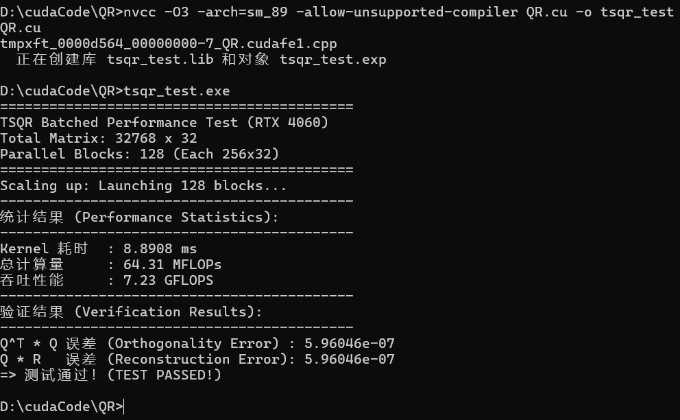
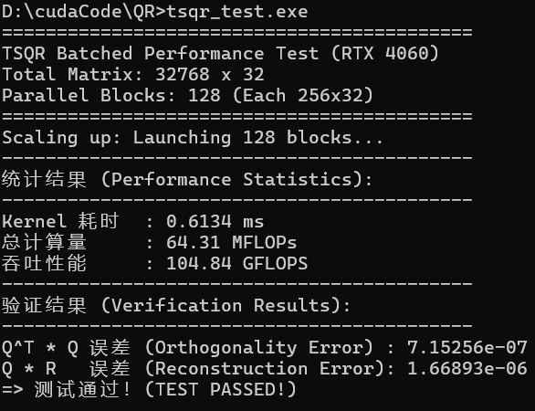

## 串行算法介绍
### QR分解
本次实验选择的是瘦高型矩阵的QR分解，具体而言是针对32列矩阵的QR分解。

QR分解是一种基本的矩阵分解方法。

对于一个实矩阵：
$$
A \in R^{m \times n}, (m \geq n)
$$
可以将其分解为：
$$
A = QR
$$

其中：
- $Q \in R^{m\times n}:列正交矩阵$
  - 满足$Q^TQ = I$
- $R\in R^{n\times n}:上三角矩阵$

### 算法步骤
采用MGS算法。

假设矩阵A的列为：
$$
A = [a_0, a_1, ..., a_{n-1}]
$$
我们要逐列构造：
$$
Q = [q_0, q_1, ..., q_{n-1}]
$$

对每一列$a_j$:
1. 初始化，`v = a_j`. 即当前列作为起始向量。
2. 去掉前面所有正交向量的分量，对所有$k = 0,1,\dots ,j-1$（即前面所有已经算了的列）：
   1. 计算$v$在$q_k$上的长度：$R_{k,j} = q_k^Tv$.
   2. 计算$v$在$q_k$上的投影向量：$R_{k,j}q_k$.
   3. 得到垂直于$q_k$的$v$：$v = v-R_{k,j}q_k$.
3. 计算当前向量的长度：$R_{j,j} = ||v||_2$.
4. 归一化得到新的正交向量：$q_j = \frac{v}{R_{j,j}}$.

### 代码实现
以$256\times 36$的子矩阵做一次串行QR分解。

```
__global__ void tsqr_n32_float_simple(int m, float* A, int lda, float* R, int ldr)
```
- m: 整个大矩阵的总行数，不是单个block的行数。
- A: 指向输入矩阵的首地址，矩阵按列主序存储。
- lda: 大矩阵的真实行跨度，即大矩阵的总行数。
- R: 输出矩阵R的批量存储区，大小$32\times 32$。
- ldr: R的行数。

```
constexpr int tsqr_n32_block_size = 256;
constexpr int n = 32;
constexpr float eps = 1e-12f;
```
- `tsqr_n32_block_size`: 每个QR子问题的矩阵大小为256.
- `n`: 本文是针对瘦高型矩阵，具体而言是针对32列矩阵写的Kernel.
- `eps`: 判断某一列是否退化的标准，如果某列正交化后范数太小，就认为这一列数值上接近0，不再归一化，而是直接置为0.

```
const int bx = blockIdx.x;
```
确定当前block处理哪个矩阵。

例如：`bx = 0`：处理第 0 个 $256\times 32$；`bx = 1`：处理第 1 个 $256\times 32$.

```
if (threadIdx.x != 0 || threadIdx.y != 0) {
    return;
}
```
限制一个block中只有一个线程计算，确保串行。

也就是说，对于大小为$256\times 32$的子矩阵而言，只有一个线程参与计算，所有循环都是这个线程自己做。

```
A += bx * tsqr_n32_block_size;
R += bx * (n * n);
```
移动全局指针，把他移动到当前block处理数据的起点。

```
const int block_size = min(tsqr_n32_block_size, m - bx * tsqr_n32_block_size);
if (block_size <= 0) return;
```

考虑大矩阵行数不为 $256$ 的整倍数时，采用最后一组剩余的行数作为块的行数。

```
for (int j = 0; j < n; ++j) {
    for (int i = 0; i < n; ++i) {
        R[i + j * ldr] = 0.0f;
    }
}
```
健壮性，清空R矩阵。

R是列主序访问，所以$i+j\times ldr$表示`R[i, j]`.

```
float v[tsqr_n32_block_size];
```

这是一个临时向量，用来存储正在处理的一列。

在后续操作中：
1. 原始列先拷贝到`v`.
2. 在`v`上逐步减去投影。
3. 归一化后写回`A`.

```
for (int j = 0; j < n; ++j)
```
这是QR分解的主循环，我们对`A`采用列主序处理，所以遍历32次，每次处理256维的向量。

```
for (int i = 0; i < block_size; ++i) {
    v[i] = A[i + j * lda];
}
```
复制处理列到`v`.

```
for (int k = 0; k < j; ++k) {
    ...
}
```

遍历当前列之前的列，用之前已经算完的正交向量，去掉当前列在这些方向上的分量，得到与之前所有正交向量正交的分量。

```
float dot = 0.0f;
for (int i = 0; i < block_size; ++i) {
    dot += A[i + k * lda] * v[i];
}
```
计算投影系数，即计算$R_{k,j} = q^T_kv$.

需要注意的是，这里的`A[i + k * lda]`已经不是原始的数值，而是已经完成处理后的列。

```
R[k + j * ldr] = dot;
```

系数写入`R`，这里天然上三角，因为 `k<j`.

```
for (int i = 0; i < block_size; ++i) {
    v[i] -= dot * A[i + k * lda];
}
```

从`v`中减去这个方向的分量，即$v\leftarrow v-R_{k,j}q_k$.

此时`v`已经和第`k`列正交了。

```
float norm2 = 0.0f;
for (int i = 0; i < block_size; ++i) {
    norm2 += v[i] * v[i];
}
float norm = sqrtf(norm2);
R[j + j * ldr] = norm;
```

计算正交化向量的范数，即$||v||_2=\sqrt{\sum_iv_i^2}$.

把它存到`R[j,j]`，这是归一化前的长度。

```
if (norm > eps) {
    float inv = 1.0f / norm;
    for (int i = 0; i < block_size; ++i) {
        A[i + j * lda] = v[i] * inv;
    }
}
```

当`norm`比`eps`大的时候，就归一化$q_j = \frac{v}{||v||}$.

结果直接写回A的当前列，此时A逐步变成Q.

如果`norm<=eps`则`v`非常接近零向量，此时做除法会很危险，面对这种情况，我直接置为0.

kernel的总体代码如下：
```
__global__ void tsqr_n32_float_simple(int m, float* A, int lda, float* R, int ldr) {
    constexpr int tsqr_n32_block_size = 256;
    constexpr int n = 32;
    constexpr float eps = 1e-12f;

    const int bx = blockIdx.x;

    if (threadIdx.x != 0 || threadIdx.y != 0) {
        return;
    }

    A += bx * tsqr_n32_block_size;
    R += bx * (n * n);

    const int block_size = min(tsqr_n32_block_size, m - bx * tsqr_n32_block_size);
    if (block_size <= 0) return;

    for (int j = 0; j < n; ++j) {
        for (int i = 0; i < n; ++i) {
            R[i + j * ldr] = 0.0f;
        }
    }

    float v[tsqr_n32_block_size];

    for (int j = 0; j < n; ++j) {
        for (int i = 0; i < block_size; ++i) {
            v[i] = A[i + j * lda];
        }

        for (int k = 0; k < j; ++k) {
            float dot = 0.0f;
            for (int i = 0; i < block_size; ++i) {
                dot += A[i + k * lda] * v[i];
            }
            R[k + j * ldr] = dot;

            for (int i = 0; i < block_size; ++i) {
                v[i] -= dot * A[i + k * lda];
            }
        }

        float norm2 = 0.0f;
        for (int i = 0; i < block_size; ++i) {
            norm2 += v[i] * v[i];
        }
        float norm = sqrtf(norm2);
        R[j + j * ldr] = norm;

        if (norm > eps) {
            float inv = 1.0f / norm;
            for (int i = 0; i < block_size; ++i) {
                A[i + j * lda] = v[i] * inv;
            }
        } else {
            for (int i = 0; i < block_size; ++i) {
                A[i + j * lda] = 0.0f;
            }
        }
    }
}
```

不过，该算法实际上还是有并行处理，只不过是以block同时为最大与最小单元并行，效率很低。

## 并行算法介绍
### 算法步骤
1. 先把当前block处理的小矩阵搬运到片上临时空间。
2. 逐列构造Householder向量。
3. 用该反射向量去消掉当前列下面的元素，并同步更新右边所有列。
4. 全部列处理完后，矩阵成为上三角矩阵，得到`R`.
5. 在根据前面保存的Householder向量，反向累计恢复`Q`.
6. 最后把`Q`写回到原矩阵位置。

#### 取出子矩阵
第一步是把子矩阵$A_{block} \in R^{m_b\times 32}$拷贝到局部工作区，所有QR操作都在这块区域进行。

#### 构造Householder反射
对子矩阵的每一列，都做一次反射构造。

以`col`列为例，目标是把这一列从第`col`行往下的部分，变成一个只有首元素非零，其余元素都为零的形式：
$$
Hx = \begin{bmatrix} \pm\|x\| \\ 0 \\ \vdots \\ 0 \end{bmatrix}
$$

直白点说，就是把当前列下面的元素全部变为0.

再直白一些，处理的是$x = A(col:m_b-1, col)$的数据，而不是一整列。

反射向量的构造如下：
1. 设当前列尾部向量为$x$，计算它的2范数$||x||$.
2. 计算$\alpha$: $\alpha = -sign(x_0)||x||$.
3. 构造向量$u=x$，并修改$u$的第一个数值：$u_0 = u_0 - \alpha$.
4. 归一化：$v = \frac{u}{||u||}$，$H = I - 2vv^T$.

但是需要指出的是，在代码里，实现的是$H=I-uu^T$，省一个除法，另外把scale融进去的话，应该还会减少一个指令。

在上述步骤完成后，当前`col`列对角线一下的元素从原始数据变成了Householder向量的存储区，且对角线位置对应的`R(col, col)`的值已经确定。

所以，子矩阵在此刻，不再是单纯的保留了原始数据，也不存完整的Q，而是上三角+Householder向量。

#### 用当前反射更新右边所有列
构造出第`col`列的反射后，并不会只处理这一列，还要把这个反射施加到右边所有剩余列：
$$
A(:,j)\leftarrow HA(:,j), j>col
$$

假设我只把当前列下半打成0，但右边不更新，其实整个矩阵并没有完成等价变化。

QR分解的本质是对整个矩阵左乘一系列反射矩阵，即$R = H_{31}\dots H_{1}H_{0}A$.

如果当前Householder向量记为$u$，那么对任意后续列$x$，更新公式是$x\leftarrow x-u(u^Tx)$.

和之前串行算法用的MGS比起来，这里是施加一个整体反射，而MGS是逐个去掉旧的正基方向。

再说直白一些：
1. 计算了当前列反射向量与目标列的内积
2. 对目标列更新。
3. 目标列完成对应的正交变换。

#### 提取R
当所有列的Householder变换都做完了，局部矩阵的上三角部分就已经是最终的$R$.

所以，这一阶段只需要：
1. 读出矩阵的上三角区域
2. 写入$R$
3. $R$下三角部分置为0.

#### 根据Householder向量反向累积Q
$Q = H_0 H_1 \dots H_{31}$

恢复$Q$的方法是：
- 从单位矩阵的列向量出发；
- 按照Householder反射的顺序，把这些反射依次作用；
- 最后得到$Q$的每一列。

即，如果我有一组标准基向量：$e_0, e_1, \dots , e_{31}$，对每个基向量，依次施加所有Householder反射；得到$Q$的列向量。

$$
q_j = H_0H_1\dots H_{31}e_j
$$

经过反向累积，得到了显示的$Q$.

#### 把Q写回输出位置
前面恢复的Q协会原矩阵A对应的小矩阵block区域。

结果上看，输入的A，被覆盖为Q，R单独输出上三角矩阵。

### 代码实现
```
__global__ void tsqr_n32_float(int m, float* A, int lda, float* R, int ldr)
```

这个kernel的目标是，在$A$中写回$Q$；$R$中写回$32\times 32$上三角矩阵。

```
constexpr int tsqr_n32_block_size = 256;
constexpr int tsqr_n32_n = 32;
constexpr int tsqr_n32_data_num_per_thread = 8;
constexpr int warp_size = 32;
constexpr float epsilon = 1e-4;
```
- `tsqr_n32_blocksize`: 每个block处理的行数。
- `tsqr_n32_n`: 这是在本次实验中限制的矩阵列数32，也是每个block处理的列数。
- `tsqr_n32_data_num_per_thread`: 每个线程处理处理8个元素。
- `warp_size`: 一个warp的线程数。
- `epsilon`: 用来判断是否退化置为0.

需要注意的是，一个block有32个warp，所以每个warp处理一列，共处理32列；一个warp有32个线程，处理256行1列元素，即256个元素，所以一个线程处理8个元素。

```
const int lane_id = threadIdx.x;
const int warp_id = threadIdx.y;
const int bx = blockIdx.x;
```

- `lane_id`: warp内线程的编号，即0\~31.
- `warp_id`: 第几个warp，范围0\~31.
- `bx`: 第几个block.

需要注意的是，这里的`warp_id`也表示为，当warp处理的第几列；而`land_id`，也会参与后续单列中，每个线程的起始位置。

```
A += bx * tsqr_n32_block_size;
R += bx * (tsqr_n32_n * tsqr_n32_n);
```

移动全局指针：
- `A`: 整个大矩阵是列主序存储，每个block只处理连续的256行。
- `B`: 每个block有独立的$32\times 32$输出矩阵，所以当前block的$R$起始地址往后挪对应数量的元素。

```
int block_size = min(tsqr_n32_block_size, m - bx * tsqr_n32_block_size);
```
与串行实现相同，兼容非256整倍数行数的情形。

```
__shared__ float shared_A[tsqr_n32_block_size * tsqr_n32_n];
```

申请一个$256\times 32$的共享内存数组。

所有后续的Householder分解、列更新、Q恢复，基本都在这块共享内存上完成。

```
#pragma unroll
for (auto i = 0; i < tsqr_n32_data_num_per_thread; ++i) {
    auto row_idx = lane_id + i * warp_size;
    if (row_idx < block_size) {
        shared_A[row_idx + warp_id * tsqr_n32_block_size] = A[row_idx + warp_id * lda];
    }
}
__syncthreads();
```
接下来，将当前block对应的子矩阵的数据从`A`搬运到`shared_A`:
- 每个线程负责8个元素，所以循环8次；
- 考虑线程在warp中的位置：每组warp搬运256个元素，行号从0~256，每个线程负责8个位置，即$lane, lane+32, \dots, lane+224$.
- 接着考虑整个warp负责的block的位置：每个warp负责一整列，直接跨$warp_id * lda$.

最后使用`__syncthreads()`保证所有线程都完成搬运，再执行后续计算。

```
float q[tsqr_n32_data_num_per_thread];
```
为每个线程申请一个长度8的寄存器数组。

在后续计算中，它将：
- 构造反射向量时，临时存储列片段；
- 更新右侧列时，临时存reflector对应的分量；
- 恢复Q，存Q列的局部片段。

```
for (auto col = 0; col < tsqr_n32_n; ++col)
```
接下来要做Householder分解，每次循环处理一列，从左到右依次处理：
1. 构造该列的Householder向量。
2. 用这个反射去消掉该列下面元素。
3. 把同样的反射作用到右边所有列。

```
float nu = 0.f;
if (warp_id == col)
{
    ...
}
```

对warp处理的列进行限制。

```
#pragma unroll
for (auto i = 0; i < tsqr_n32_data_num_per_thread; ++i) {
    auto row_idx = lane_id + i * warp_size;
    if (row_idx >= col && row_idx < block_size) {
        q[i] = shared_A[row_idx + col * tsqr_n32_block_size];
        nu += q[i] * q[i];
    }
}
```
和串行的算法类似，我们只关注尾部向量。

```
float norm_square = warp_all_reduce_sum(nu);
```

需要注意的是，由于每个线程只算了自己的8个元素的平方和，所以要以warp为单位，进行规约，求整列尾部向量的$||x||^2$.

`warp_all_reduce_sum` 在后续单独说明

```
if (norm_square > epsilon * epsilon) {
    float norm = __fsqrt_rn(norm_square);
    float scale = 1.f / norm;
    ...
}
```

和串行算法类似，对范数大小进行验证，避免范数过小。

当范数足够大时，构造reflector.
$$
norm = ||x|| \\
scale = 1/||x||
$$

```
#pragma unroll
for (auto i = 0; i < tsqr_n32_data_num_per_thread; ++i) {
    auto row_idx = lane_id + i * warp_size;
    if (row_idx >= col && row_idx < block_size) {
        q[i] *= scale;
    }
}
```

对当前向量归一化，这一步完成后`q`存的是$x/||x||$，也就是单位化后的当前列尾部向量。

```
float u1 = 0.f;
auto thread_off = col / warp_size;
if (lane_id == col % warp_size) {
    q[thread_off] += (q[thread_off] >= 0) ? 1.f : -1.f;
    u1 = q[thread_off];
    R[col + ldr * col] = (u1 >= 0) ? -norm : norm;
}
```

这几步是为了修改首元素，进而构造Householder方向。

其中`col/warp_size`是为了健壮性而写的：首元素不总是在`q[0]`，一旦遇到超过`warp_size`的列数，就需要除法；但是本次实验针对的是固定的32列瘦高矩阵，所以`thread_off`永远为0.

为了确保reflector只修改首元素，必须找到哪个线程负责这个元素：首元素位于全局行号`col`，这个行号恰好落在`col % 32`，所以限制`land_id`与之相等。

随后执行的计算如下：
$$
\hat{x}_0 \leftarrow \hat{x}_0 + sign(\hat{x}_0)
$$

以构造Householder方向。

Householder反射后该列变为$[\pm ||x||, 0, \dots ]^T$.

把这里的对角元素写入`R(col, col)`.

```
u1 = __shfl_sync(0xffffffff, u1, col % warp_size);
```

当一个线程更新了首元素`u1`后，通过warp shuffle广播给同一warp内其他线程。

```
scale = __frsqrt_rn(fabs(u1));
```

和串行算法类似，为了节省计算量，采用$H = I - uu^T$. 为此需要把刚构造出的向量再做一次缩放，把常数因子塞进`u`里。

```
#pragma unroll
for (auto i = 0; i < tsqr_n32_data_num_per_thread; ++i) {
    auto row_idx = lane_id + i * warp_size;
    if (row_idx >= col && row_idx < block_size) {
        shared_A[row_idx + col * tsqr_n32_block_size] = q[i] * scale;
    }
}
```

把Householder向量写回`shared_a`当前列尾部。

这一步结束后，`shared_A(:, col)`从`col`往下部分，不再是原矩阵数据，而是reflector向量`u`.

在之前讨论的是没有退化的处理，现在说明退化的处理：
```
} else {
    if (lane_id == col) { R[col + ldr * col] = 0.f; }
    #pragma unroll
    for (auto i = 0; i < tsqr_n32_data_num_per_thread; ++i) {
        auto row_idx = lane_id + i * warp_size;
        if (row_idx >= col && row_idx < block_size) {
            shared_A[row_idx + col * tsqr_n32_block_size] = 0.f;
        }
    }
}
```
尾部向量近似为0，此刻无法构造有效的reflector，此时将`R(col, col)`置为0，reflector置为0，相当于跳过这一次反射。

```
__syncthreads();
```

当前列是`warp_id == col`的warp写到了`shared_a(:, col)`. 接下来其他warp要用它取更新右侧的列，在此之前进行一个block级的同步。

```
if (col < warp_id) { ... }
```
确定只有当前列的右侧更新，例如第五例reflector算完，就更新6~31列。

```
float nu = 0.f;
#pragma unroll
for (auto i = 0; i < tsqr_n32_data_num_per_thread; ++i) {
    auto row_idx = lane_id + i * warp_size;
    if (row_idx >= col && row_idx < block_size) {
        q[i] = shared_A[row_idx + col * tsqr_n32_block_size];
        nu += q[i] * shared_A[row_idx + warp_id * tsqr_n32_block_size];
    }
}
float utx = warp_all_reduce_sum(nu);
```

- `q[i]`: 读当前reflector向量`u`对应的单个数字.
- `shared_A[row_idx + warp_id * tsqr_n32_block_size]`: 待更新的列的单个数字。

所以累计的结果为$u^Tx$。

```
#pragma unroll
for (auto i = 0; i < tsqr_n32_data_num_per_thread; ++i) {
    auto row_idx = lane_id + i * warp_size;
    if (row_idx >= col && row_idx < block_size) {
        shared_A[row_idx + warp_id * tsqr_n32_block_size] -= utx * q[i];
    }
}
```
更新目标列：$x\leftarrow x - u(u^Tx)$.

主循环全部结束后，再做一次block同步。

随后准备利用reflector恢复`Q`.

```
if (lane_id < warp_id) {
    R[lane_id + ldr * warp_id] = shared_A[lane_id + warp_id * tsqr_n32_block_size];
    shared_A[lane_id + warp_id * tsqr_n32_block_size] = 0.f;
}
if (lane_id > warp_id) {
    R[lane_id + ldr * warp_id] = 0.f;
}
```
当`lane_id<warp_id`是，处于上三角区域，拷贝到`R`.

否则，直接写0.

另外，顺便把`shared_A`的上三角清零，因为，后面恢复`Q`只需要reflector信息，清个零更干净。

```
#pragma unroll
for (auto i = 0; i < tsqr_n32_data_num_per_thread; ++i) {
    auto row_idx = lane_id + i * warp_size;
    q[i] = (row_idx == warp_id) ? 1.f : 0.f;
}
__syncwarp();
```

为了恢复`Q`，每个warp先把自己初始化成标准基向量，例如warp0对应$e_0$.

也就是说，每个warp手里存`Q`的某一列初始值。

```
for (auto col = tsqr_n32_n - 1; col >= 0; --col)
{
    ...
}
```
恢复`Q`时，reflector按逆序应用，即$Q = H_0H_1\dots H_{31}$.

```
if (warp_id >= col) { ... }
```

第`col`个reflector只作用于当前`col`以后的`Q`列。

```
float nu = 0.f;
#pragma unroll
for (auto i = 0; i < tsqr_n32_data_num_per_thread; ++i) {
    auto row_idx = lane_id + i * warp_size;
    if (row_idx < block_size) {
        nu += q[i] * shared_A[row_idx + col * tsqr_n32_block_size];
    }
}
float utq = warp_all_reduce_sum(nu);
```

- `q[i]`是当前warp正在恢复的`Q`的一列。
- `shared_A[row_idx + col * tsqr_n32_block_size]` 是第`col`个reflector向量。

也就是求$u^Tq$

```
#pragma unroll
for (auto i = 0; i < tsqr_n32_data_num_per_thread; ++i) {
    auto row_idx = lane_id + i * warp_size;
    if (row_idx < block_size) {
        q[i] -= utq * shared_A[row_idx + col * tsqr_n32_block_size];
    }
}
__syncwarp();
```

计算：$q\leftarrow q-u(u^Tq)$.

直白点就是把第`col`个reflector作用到当前`Q`列。

```
#pragma unroll
for (auto i = 0; i < tsqr_n32_data_num_per_thread; ++i) {
    auto row_idx = lane_id + i * warp_size;
    if (row_idx < block_size) {
        A[row_idx + warp_id * lda] = q[i];
    }
}
```
写回A，和最初写入`shared_A`类似。

### 测试结果
串行算法：

并行算法：


可以看到后者效率非常高，一方面不仅实现了线程级的并行；此外，Householder更新是列操作，适合warp内做归约计算内积，并并行更新，后者具有更高的并行度，更少的全局内存访存，更高效的共享内存使用。

整体代码如下：
```
#include <iostream>
#include <vector>
#include <cmath>
#include <random>
#include <cuda_runtime.h>

#define CHECK_CUDA(call) { \
    cudaError_t err = call; \
    if (err != cudaSuccess) { \
        std::cerr << "CUDA Error: " << cudaGetErrorString(err) << " at line " << __LINE__ << std::endl; \
        exit(1); \
    } \
}

template <typename T>
static __inline__ __device__ T warp_all_reduce_sum(T val) {
    for (int mask = warpSize / 2; mask > 0; mask /= 2) {
        val += __shfl_xor_sync(0xffffffff, val, mask);
    }
    return val;
}

__global__ void tsqr_n32_float(int m, float* A, int lda, float* R, int ldr) {
    constexpr int tsqr_n32_block_size = 256;
    constexpr int tsqr_n32_n = 32;
    constexpr int tsqr_n32_data_num_per_thread = 8;
    constexpr int warp_size = 32;
    constexpr float epsilon = 1e-4;

    const int lane_id = threadIdx.x;
    const int warp_id = threadIdx.y;
    const int bx = blockIdx.x;

    A += bx * tsqr_n32_block_size;
    R += bx * (tsqr_n32_n * tsqr_n32_n);

    int block_size = min(tsqr_n32_block_size, m - bx * tsqr_n32_block_size);

    __shared__ float shared_A[tsqr_n32_block_size * tsqr_n32_n];

    #pragma unroll
    for (auto i = 0; i < tsqr_n32_data_num_per_thread; ++i) {
        auto row_idx = lane_id + i * warp_size;
        if (row_idx < block_size) {
            shared_A[row_idx + warp_id * tsqr_n32_block_size] = A[row_idx + warp_id * lda];
        }
    }
    __syncthreads();

    float q[tsqr_n32_data_num_per_thread];
    for (auto col = 0; col < tsqr_n32_n; ++col) {
        float nu = 0.f;
        if (warp_id == col) {
            #pragma unroll
            for (auto i = 0; i < tsqr_n32_data_num_per_thread; ++i) {
                auto row_idx = lane_id + i * warp_size;
                if (row_idx >= col && row_idx < block_size) {
                    q[i] = shared_A[row_idx + col * tsqr_n32_block_size];
                    nu += q[i] * q[i];
                }
            }
            float norm_square = warp_all_reduce_sum(nu);
            if (norm_square > epsilon * epsilon) {
                float norm = __fsqrt_rn(norm_square);
                float scale = 1.f / norm;
                #pragma unroll
                for (auto i = 0; i < tsqr_n32_data_num_per_thread; ++i) {
                    auto row_idx = lane_id + i * warp_size;
                    if (row_idx >= col && row_idx < block_size) {
                        q[i] *= scale;
                    }
                }
                float u1 = 0.f;
                auto thread_off = col / warp_size;
                if (lane_id == col % warp_size) {
                    q[thread_off] += (q[thread_off] >= 0) ? 1.f : -1.f;
                    u1 = q[thread_off];
                    R[col + ldr * col] = (u1 >= 0) ? -norm : norm;
                }
                u1 = __shfl_sync(0xffffffff, u1, col % warp_size);
                scale = __frsqrt_rn(fabs(u1));
                #pragma unroll
                for (auto i = 0; i < tsqr_n32_data_num_per_thread; ++i) {
                    auto row_idx = lane_id + i * warp_size;
                    if (row_idx >= col && row_idx < block_size) {
                        shared_A[row_idx + col * tsqr_n32_block_size] = q[i] * scale;
                    }
                }
            } else {
                if (lane_id == col) { R[col + ldr * col] = 0.f; }
                #pragma unroll
                for (auto i = 0; i < tsqr_n32_data_num_per_thread; ++i) {
                    auto row_idx = lane_id + i * warp_size;
                    if (row_idx >= col && row_idx < block_size) {
                        shared_A[row_idx + col * tsqr_n32_block_size] = 0.f;
                    }
                }
            }
        }
        __syncthreads();

        if (col < warp_id) {
            float nu = 0.f;
            #pragma unroll
            for (auto i = 0; i < tsqr_n32_data_num_per_thread; ++i) {
                auto row_idx = lane_id + i * warp_size;
                if (row_idx >= col && row_idx < block_size) {
                    q[i] = shared_A[row_idx + col * tsqr_n32_block_size];
                    nu += q[i] * shared_A[row_idx + warp_id * tsqr_n32_block_size];
                }
            }
            float utx = warp_all_reduce_sum(nu);
            #pragma unroll
            for (auto i = 0; i < tsqr_n32_data_num_per_thread; ++i) {
                auto row_idx = lane_id + i * warp_size;
                if (row_idx >= col && row_idx < block_size) {
                    shared_A[row_idx + warp_id * tsqr_n32_block_size] -= utx * q[i];
                }
            }
        }
    }
    __syncthreads();

    if (lane_id < warp_id) {
        R[lane_id + ldr * warp_id] = shared_A[lane_id + warp_id * tsqr_n32_block_size];
        shared_A[lane_id + warp_id * tsqr_n32_block_size] = 0.f;
    }
    if (lane_id > warp_id) {
        R[lane_id + ldr * warp_id] = 0.f;
    }

    #pragma unroll
    for (auto i = 0; i < tsqr_n32_data_num_per_thread; ++i) {
        auto row_idx = lane_id + i * warp_size;
        q[i] = (row_idx == warp_id) ? 1.f : 0.f;
    }
    __syncwarp();

    for (auto col = tsqr_n32_n - 1; col >= 0; --col) {
        if (warp_id >= col) {
            float nu = 0.f;
            #pragma unroll
            for (auto i = 0; i < tsqr_n32_data_num_per_thread; ++i) {
                auto row_idx = lane_id + i * warp_size;
                if (row_idx < block_size) {
                    nu += q[i] * shared_A[row_idx + col * tsqr_n32_block_size];
                }
            }
            float utq = warp_all_reduce_sum(nu);
            #pragma unroll
            for (auto i = 0; i < tsqr_n32_data_num_per_thread; ++i) {
                auto row_idx = lane_id + i * warp_size;
                if (row_idx < block_size) {
                    q[i] -= utq * shared_A[row_idx + col * tsqr_n32_block_size];
                }
            }
            __syncwarp();
        }
    }

    #pragma unroll
    for (auto i = 0; i < tsqr_n32_data_num_per_thread; ++i) {
        auto row_idx = lane_id + i * warp_size;
        if (row_idx < block_size) {
            A[row_idx + warp_id * lda] = q[i];
        }
    }
}

__global__ void tsqr_n32_float_simple(int m, float* A, int lda, float* R, int ldr) {
    constexpr int tsqr_n32_block_size = 256;
    constexpr int n = 32;
    constexpr float eps = 1e-12f;

    const int bx = blockIdx.x;

    if (threadIdx.x != 0 || threadIdx.y != 0) {
        return;
    }

    A += bx * tsqr_n32_block_size;
    R += bx * (n * n);

    const int block_size = min(tsqr_n32_block_size, m - bx * tsqr_n32_block_size);
    if (block_size <= 0) return;

    for (int j = 0; j < n; ++j) {
        for (int i = 0; i < n; ++i) {
            R[i + j * ldr] = 0.0f;
        }
    }

    float v[tsqr_n32_block_size];

    for (int j = 0; j < n; ++j) {
        for (int i = 0; i < block_size; ++i) {
            v[i] = A[i + j * lda];
        }

        for (int k = 0; k < j; ++k) {
            float dot = 0.0f;
            for (int i = 0; i < block_size; ++i) {
                dot += A[i + k * lda] * v[i];
            }
            R[k + j * ldr] = dot;

            for (int i = 0; i < block_size; ++i) {
                v[i] -= dot * A[i + k * lda];
            }
        }

        float norm2 = 0.0f;
        for (int i = 0; i < block_size; ++i) {
            norm2 += v[i] * v[i];
        }
        float norm = sqrtf(norm2);
        R[j + j * ldr] = norm;

        if (norm > eps) {
            float inv = 1.0f / norm;
            for (int i = 0; i < block_size; ++i) {
                A[i + j * lda] = v[i] * inv;
            }
        } else {
            for (int i = 0; i < block_size; ++i) {
                A[i + j * lda] = 0.0f;
            }
        }
    }
}


void verify_qr_decomposition(const std::vector<float>& A_orig,
                             const std::vector<float>& Q,
                             const std::vector<float>& R,
                             int m, int n) {
    float max_err_qtq = 0.0f;
    float max_err_qr = 0.0f;

    for (int i = 0; i < n; ++i) {
        for (int j = 0; j < n; ++j) {
            float sum = 0.0f;
            for (int k = 0; k < m; ++k) {
                sum += Q[k + i * m] * Q[k + j * m];
            }
            float target = (i == j) ? 1.0f : 0.0f;
            max_err_qtq = std::max(max_err_qtq, std::abs(sum - target));
        }
    }

    for (int i = 0; i < m; ++i) {
        for (int j = 0; j < n; ++j) {
            float sum = 0.0f;
            for (int k = 0; k <= j; ++k) {
                sum += Q[i + k * m] * R[k + j * n];
            }
            max_err_qr = std::max(max_err_qr, std::abs(sum - A_orig[i + j * m]));
        }
    }

    std::cout << "-------------------------------------------\n";
    std::cout << "验证结果 (Verification Results):\n";
    std::cout << "-------------------------------------------\n";
    std::cout << "Q^T * Q 误差 (Orthogonality Error) : " << max_err_qtq << "\n";
    std::cout << "Q * R   误差 (Reconstruction Error): " << max_err_qr << "\n";

    if (max_err_qtq < 1e-4 && max_err_qr < 1e-4) {
        std::cout << "=> 测试通过！(TEST PASSED!)\n";
    } else {
        std::cout << "=> 测试失败！(TEST FAILED!)\n";
    }
}

int main() {
    const int m_per_block = 256;      // 每个 Block 处理的行数
    const int n = 32;                 // 列数
    const int num_blocks = 128;       // 并发任务数
    const int total_m = m_per_block * num_blocks; // 总行数 (32768)

    const int lda = total_m;

    std::cout << "===========================================" << std::endl;
    std::cout << "TSQR Batched Performance Test (RTX 4060)" << std::endl;
    std::cout << "Total Matrix: " << total_m << " x " << n << std::endl;
    std::cout << "Parallel Blocks: " << num_blocks << " (Each 256x32)" << std::endl;
    std::cout << "===========================================" << std::endl;

    size_t a_size = total_m * n * sizeof(float);
    size_t r_batch_size = num_blocks * n * n * sizeof(float);

    std::vector<float> h_A(total_m * n);
    std::mt19937 rng(1234);
    std::uniform_real_distribution<float> dist(-1.0f, 1.0f);
    for (int i = 0; i < h_A.size(); ++i) h_A[i] = dist(rng);

    std::vector<float> h_A_orig_first(m_per_block * n);
    for (int j = 0; j < n; ++j) {
        for (int i = 0; i < m_per_block; ++i) {
            h_A_orig_first[i + j * m_per_block] = h_A[i + j * total_m];
        }
    }

    float *d_A, *d_R;
    CHECK_CUDA(cudaMalloc(&d_A, a_size));
    CHECK_CUDA(cudaMalloc(&d_R, r_batch_size));
    CHECK_CUDA(cudaMemcpy(d_A, h_A.data(), a_size, cudaMemcpyHostToDevice));

    cudaEvent_t start, stop;
    CHECK_CUDA(cudaEventCreate(&start));
    CHECK_CUDA(cudaEventCreate(&stop));

    dim3 block(32, 32);
    dim3 grid(num_blocks);

    std::cout << "Scaling up: Launching " << num_blocks << " blocks..." << std::endl;

    CHECK_CUDA(cudaEventRecord(start));

    // tsqr_n32_float_simple<<<grid, block>>>(total_m, d_A, lda, d_R, n);
    tsqr_n32_float<<<grid, block>>>(total_m, d_A, lda, d_R, n);

    CHECK_CUDA(cudaEventRecord(stop));
    CHECK_CUDA(cudaEventSynchronize(stop));

    float ms = 0;
    CHECK_CUDA(cudaEventElapsedTime(&ms, start, stop));

    double single_block_flops = 2.0 * m_per_block * n * n - (2.0/3.0) * n * n * n;
    double total_flops = single_block_flops * num_blocks;
    double gflops = (total_flops * 1e-9) / (ms * 1e-3);

    printf("-------------------------------------------\n");
    printf("统计结果 (Performance Statistics):\n");
    printf("-------------------------------------------\n");
    printf("Kernel 耗时  : %.4f ms\n", ms);
    printf("总计算量     : %.2f MFLOPs\n", total_flops / 1e6);
    printf("吞吐性能     : %.2f GFLOPS\n", gflops);

    std::vector<float> h_Q_first(m_per_block * n);
    std::vector<float> h_R_first(n * n);

    std::vector<float> h_Q_all(total_m * n);
    CHECK_CUDA(cudaMemcpy(h_Q_all.data(), d_A, a_size, cudaMemcpyDeviceToHost));
    CHECK_CUDA(cudaMemcpy(h_R_first.data(), d_R, n * n * sizeof(float), cudaMemcpyDeviceToHost));

    for (int j = 0; j < n; ++j) {
        for (int i = 0; i < m_per_block; ++i) {
            h_Q_first[i + j * m_per_block] = h_Q_all[i + j * total_m];
        }
    }

    verify_qr_decomposition(h_A_orig_first, h_Q_first, h_R_first, m_per_block, n);

    CHECK_CUDA(cudaEventDestroy(start));
    CHECK_CUDA(cudaEventDestroy(stop));
    cudaFree(d_A);
    cudaFree(d_R);

    return 0;
}
```
