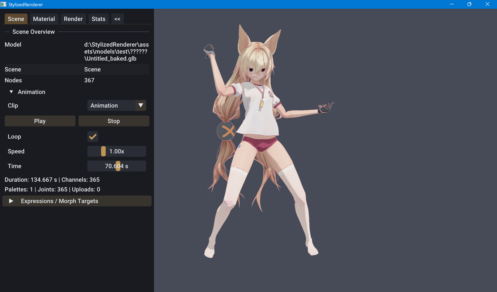

前五个阶段已经建立模型导入、场景层级、MToon 材质、阴影与描边管线，但场景节点始终使用导入时的静态变换，网格顶点也不会随骨骼或表情发生变化。第六阶段在资产、动画、运行时资源和渲染提取之间加入动态姿态，使同一个角色能够播放骨骼动画、调整 Morph Target，并让变形后的几何同时进入主绘制、阴影和轮廓 Pass。

骨骼动画与 Morph Target 采用不同的执行位置。动画轨道在 CPU 上采样为 `ScenePose`，由 `SkinningPalette` 转换成网格局部空间的关节矩阵，再通过 Shader Storage Buffer 交给 GPU 完成 Linear Blend Skinning。Morph Target 则由每个 `RuntimeMeshInstance` 保存独立权重，在权重变化时重建该实例的动态顶点缓冲。Morph 先改变基础顶点，Skinning 再把变形结果带到当前骨骼姿态中。

~~~text
Model File
  ├→ Scene Nodes + Bind Transforms
  ├→ AnimationClipAsset
  │    └→ Node TRS Channels
  ├→ SkinAsset
  │    ├→ Joint Node Indices
  │    ├→ Inverse Bind Matrices
  │    └→ Joint-local Bounds
  └→ MorphTargetAsset
       └→ Position / Normal / Tangent Deltas

AnimationPlayer
  → ScenePose
  → SkinningPaletteSet
  → Skinning SSBO

MorphState
  → RuntimeMeshInstance
  → Dynamic Vertex Buffer

RenderExtractor
  → RenderItem { VertexArray, SkinningPalette, Dynamic Bounds }
  ├→ ForwardOpaquePass
  ├→ ShadowPass
  └→ OutlineMaskPass
~~~

## 动画系统中的类型关系

| 层级 | 类型 | 职责 |
| --- | --- | --- |
| Asset | `AnimationClipAsset` | 保存动画时长与节点 TRS 轨道 |
| Asset | `SkinAsset` | 保存关节节点、Inverse Bind Matrix 与关节局部 Bounds |
| Asset | `MorphTargetAsset` | 保存相对基础网格的顶点增量 |
| Animation | `ScenePose` | 保存当前局部姿态并解析节点世界矩阵 |
| Animation | `AnimationPlayer` | 管理 Clip、时间、循环、速度、Seek 与轨道采样 |
| Animation | `MorphState` | 保存某个 Primitive 实例的 Morph 权重和变更版本 |
| Runtime | `SkinningPalette` | 计算一个 Primitive 的关节矩阵并上传 SSBO |
| Runtime | `SkinningPaletteSet` | 合并兼容 Skin，并为节点与 Primitive 建立共享 Palette 查询表 |
| Runtime | `RuntimeMeshInstance` | 为 Morph 实例持有动态 VBO、VAO 与动态 Bounds |
| World | `RenderExtractor` | 从当前 Pose、Palette 与 Morph 实例提取 RenderItem |
| Renderer | `StaticModelRenderer` | 绑定动态顶点流和蒙皮 Palette，提交主绘制 |
| Pass | `ShadowPass` | 使用相同蒙皮姿态绘制 Shadow Map |
| Pass | `OutlineMaskPass` | 在蒙皮后的顶点上执行 Inverse Hull 扩张 |
| Viewer | `ViewerPanels` | 选择动画、控制播放并编辑表情权重 |

`SceneAsset` 描述模型文件中的节点层级与 `animations` 数组，`MeshPrimitiveAsset` 保存 Skin 与 Morph 数据。资产构成不可变输入，播放时间、姿态矩阵和表情权重位于运行时对象中，因此同一份模型资产可以被多个实例以不同姿态使用。

## 核心对象的状态与生命周期

动画系统中的成员变量可以分为四类：指向不可变资产的关联状态、每帧重新计算的姿态状态、跨帧复用的 GPU 资源，以及用于判断是否需要更新的版本状态。它们的生命周期并不相同：场景加载时建立资产关联和 Buffer，播放过程中只更新姿态、矩阵与必要的动态顶点，卸载场景时再统一清理。

### ScenePose 的成员变量

~~~cpp
const asset::SceneAsset* sceneAsset_ = nullptr;
std::vector<scene::Transform> localTransforms_;
std::vector<glm::mat4> worldMatrices_;
std::vector<std::uint8_t> resolutionStates_;
bool worldMatricesDirty_ = true;
std::uint64_t version_ = 0;
~~~

`sceneAsset_` 不拥有场景资产，只用来确认 Pose 是为哪一个 `SceneAsset` 创建的。`isForScene()` 直接比较地址，因此不能把为旧场景建立的 Pose 交给新场景使用，即使两个场景恰好有相同节点数量。

`localTransforms_` 在 `initialize()` 中逐节点复制 `SceneNodeAsset::localTransform`，初值就是 Bind Pose。播放器只修改被动画通道覆盖的元素；`resetToBindPose()` 则重新复制全部节点，消除上一个 Clip 遗留的局部变换。

`worldMatrices_` 与节点数组等长，初始填入单位矩阵，随后由局部变换和 Parent Index 计算。它是一份派生缓存，不应由外部直接写入。`resolutionStates_` 同样与节点数组等长，每次更新前清零，并在递归解析过程中依次使用：

~~~text
0 = unresolved
1 = resolving
2 = resolved
~~~

读取到 `resolving` 状态表示父子层级形成环；读取到 `resolved` 则可以直接复用缓存。`worldMatricesDirty_` 是缓存有效性门闩：修改任意 Local Transform 后置位，全部节点成功解析后才清除。只要它仍为 `true`，`worldMatrix()` 就返回空指针，阻止未完成的姿态进入渲染。

`version_` 表示已经完成求值的 Pose 世代。只有 `updateWorldMatrices()` 成功计算全部节点后才递增，失败或仅调用 `setLocalTransform()` 都不会产生一个可消费的新版本。与 `MorphState` 相同，版本溢出到 0 时会再递增一次，保留 0 作为初始或已清理状态。Palette Set 只需要比较这个整数，就能判断关节矩阵是否需要重新生成。

### AnimationPlayer 的成员变量

~~~cpp
const asset::AnimationClipAsset* clip_ = nullptr;
const asset::SceneAsset* validatedScene_ = nullptr;
float currentTime_ = 0.0F;
float playbackSpeed_ = 1.0F;
bool playing_ = false;
bool looping_ = true;
bool samplePending_ = false;
bool resetPoseOnNextSample_ = false;
~~~

`clip_` 指向当前 Clip，不复制关键帧数组。切换 Clip 后，`validatedScene_` 被清空；下一次 `update()` 才调用 `clip_->isValid(scene.nodes.size())` 完成 Clip 与场景的组合校验，成功后缓存场景地址，后续帧不重复遍历全部轨道。

`currentTime_` 始终使用秒。它由 `deltaTime × playbackSpeed_` 累加，Loop 模式下用 Clip 时长取余，非 Loop 模式下限制到末帧。`playbackSpeed_` 只接受有限且非负的值，因此当前播放器支持暂停和慢放/快放，但不支持负速度倒放。

`playing_` 只控制时间是否自动推进。暂停后调用 `seek()` 仍会设置 `samplePending_`，所以下一次更新会刷新 Pose。`samplePending_` 表示“时间或 Clip 已变化，但尚未写入 Pose”；若它为 `false`，暂停状态下的 `update()` 可以直接返回。

`resetPoseOnNextSample_` 只在切换 Clip 或 Stop 后置位。采样前恢复 Bind Pose，再应用当前 Clip 的通道，可保证未出现在 Clip 中的节点使用资产原始变换。普通 Seek 不重置整套 Pose，因为同一个 Clip 的通道集合没有改变。

### SkinningPalette 的成员变量

~~~cpp
std::vector<glm::mat4> matrices_;
graphics::Buffer gpuBuffer_;
std::size_t jointCapacity_ = 0;
bool uploaded_ = false;
math::Bounds currentLocalBounds_;
~~~

`matrices_` 是当前 Pose 对应的 CPU 关节矩阵，元素顺序与 `SkinAsset::jointNodeIndices`、`inverseBindMatrices` 和 `jointLocalBounds` 完全一致。`update()` 开头会清空该数组，再按 Palette 顺序重新生成。

`gpuBuffer_` 是 Dynamic Usage 的 SSBO，字节数在初始化时计算为：

~~~text
bufferSize = jointCount × sizeof(glm::mat4)
~~~

计算前会检查乘法是否溢出。`jointCapacity_` 记录 Buffer 对应的矩阵数量，更新时必须与 Skin 的 Joint Count 相等。`clear()` 不释放 `gpuBuffer_`，只清除 CPU 结果、Bounds 与 `uploaded_`，因此每帧更新可以复用既有显存；重新初始化或容量改变时才替换 Buffer。

`uploaded_` 表示当前 `matrices_` 已经成功写入 Buffer。`update()` 调用 `clear()` 时将它设为 `false`，`upload()` 完整写入后设为 `true`。`isGpuReady()` 同时检查 Buffer 有效、Capacity 大于零和 `uploaded_`，防止 Shader 读取过期的 Palette。

`currentLocalBounds_` 由各关节影响范围经过当前 Skin Matrix 变换后合并。它和 `matrices_` 在同一次 `update()` 中生成，因此 Bounds 与 GPU 即将使用的姿态来自同一帧。

### SkinningPaletteSet 的成员变量

~~~cpp
std::vector<std::vector<SkinningPalette*>> paletteLookup_;
std::vector<std::unique_ptr<SkinningPaletteGroup>> paletteGroups_;
std::size_t paletteCount_ = 0;
std::size_t jointMatrixCount_ = 0;
std::size_t lastUploadCount_ = 0;
std::uint64_t lastPoseVersion_ = 0;
~~~

`paletteLookup_[nodeIndex][primitiveIndex]` 直接镜像 `SceneAsset → MeshAsset → Primitive` 的索引结构。静态 Primitive 对应空指针，`find()` 同时完成越界检查和蒙皮状态表达。Lookup 保存非拥有指针，实际生命周期由 `paletteGroups_` 中的 `unique_ptr` 管理。

`SkinningPaletteGroup` 保存 `meshNodeIndex`、合并后的 `SkinAsset` 和唯一的 `SkinningPalette`。初始化时，属于同一 Mesh Node、拥有相同 Joint Node Index 序列和逐元素相同 Inverse Bind Matrix 的 Primitive 会进入同一 Group。它们的 `jointLocalBounds` 逐关节合并，保证共享 Palette 生成的动态 Bounds 能覆盖组内所有 Primitive。

`paletteCount_` 统计 Palette Group 数量，`jointMatrixCount_` 累计各 Group 的矩阵数。多个兼容 Primitive 共享一个 SSBO，使矩阵计算、Buffer 容量和上传次数由 Group 数量决定。

`lastPoseVersion_` 保存最近一次成功上传的 `ScenePose::version()`。`update()` 开始时先把 `lastUploadCount_` 清零；若当前 Pose Version 非 0 且等于 `lastPoseVersion_`，函数直接返回成功，不计算矩阵也不写 Buffer。因此动画暂停且没有 Seek 时，Viewer 会显示 `Uploads: 0`。只有全部 Group 更新和上传成功后才记录新版本，某一 Group 失败不会错误推进缓存状态。

### MorphState 的成员变量

~~~cpp
std::vector<float> weights_;
std::size_t activeTargetCount_ = 0;
std::uint64_t version_ = 0;
~~~

`weights_` 与 Primitive 的 Morph Target 数量一一对应，初始化时全部为 0。`setWeight()` 先把输入限制到 `[0, 1]`，再与旧值做精确比较；没有变化时不会推进版本。

`activeTargetCount_` 在权重跨过 0 时增减：旧值为 0、新值非 0 时加一；旧值非 0、新值为 0 时减一。查询激活数量因此是常数时间，`reset()` 也能在数量为 0 时直接返回。

`version_` 在初始化、清空、Reset 生效或任意权重改变时递增。无符号整数溢出回到 0 后会再加一次，确保 0 不会在运行期间重新成为一个看似未初始化的版本。`RuntimeMeshInstance` 不关心哪些权重改变，只比较版本即可判断动态 VBO 是否过期。

### RuntimeMeshInstance 的成员变量

~~~cpp
const asset::MeshAsset* meshAsset_ = nullptr;
const RuntimeMesh* runtimeMesh_ = nullptr;
std::vector<PrimitiveInstance> primitives_;
std::size_t morphPrimitiveCount_ = 0;
std::size_t lastUploadCount_ = 0;
std::size_t totalUploadCount_ = 0;
~~~

`meshAsset_` 提供基础顶点和 Morph Delta，`runtimeMesh_` 提供共享 Index Buffer 与无 Morph 时的回退资源。两者都不归实例所有，初始化时要求 Primitive 数量完全一致。

`primitives_` 与 Mesh Primitive 数组等长，但只有包含 Morph Target 的位置会创建动态 Buffer 和 VAO。这样 `primitiveIndex` 可以贯穿 Asset、Runtime Mesh、Morph Instance 与 Render Extractor，无需维护额外映射表。

每个内部 `PrimitiveInstance` 保存以下状态：

~~~cpp
animation::MorphState morphState;
graphics::Buffer vertexBuffer;
graphics::VertexArray vertexArray;
math::Bounds localBounds;
float maximumPositionDelta = 0.0F;
std::uint64_t appliedMorphVersion = 0;
~~~

`appliedMorphVersion` 表示动态 VBO 已经包含哪个 Morph 版本。`update()` 只有在它与 `morphState.version()` 不同时才重建顶点；上传成功后才写回新版本。如果上传失败，旧版本号不会前移，下一帧仍会尝试更新，不会把失败结果误认为已应用。

`localBounds` 从最终 Morph Position 逐顶点扩展得到。`maximumPositionDelta` 则计算所有结果顶点与 Base Position 的欧氏距离最大值：

~~~text
maximumPositionDelta = max(
    length(morphedPosition[v] - basePosition[v])
)
~~~

该值来自当前全部权重叠加后的实际结果，用于为 Skin Bounds 增加保守余量。`lastUploadCount_` 每帧归零并统计本次更新数量；`totalUploadCount_` 从初始化上传开始累计，便于区分持续抖动的权重和正常的偶发编辑。

## AnimationClipAsset：按场景节点组织动画轨道

一个动画 Clip 由名称、秒制时长和若干节点通道组成：

~~~cpp
struct NodeAnimationChannelAsset
{
    std::uint32_t nodeIndex;
    std::vector<VectorAnimationKey> translations;
    std::vector<QuaternionAnimationKey> rotations;
    std::vector<VectorAnimationKey> scales;
};

struct AnimationClipAsset
{
    std::string name;
    float durationSeconds = 0.0F;
    std::vector<NodeAnimationChannelAsset> channels;
};
~~~

通道直接保存 `nodeIndex`，播放时无需反复按节点名称查找。平移和缩放使用 `glm::vec3` 关键帧，旋转使用单位四元数关键帧。三个轨道彼此独立：一个通道可以只有旋转而没有位移，缺少的分量继续沿用当前 Pose 中的值。

导入器将 Assimp 的 Tick 时间换算为秒：

~~~text
timeSeconds = keyTime / ticksPerSecond
durationSeconds = animationDuration / ticksPerSecond
~~~

若源文件没有提供有效的 `ticksPerSecond`，导入流程使用可用的后备频率，再验证时长和全部关键帧。节点名称必须能唯一映射到 `SceneAsset::nodes`，无法确认目标节点的通道不会被静默绑定到错误对象。关键帧还需要满足时间有限、顺序单调、数值有效以及节点索引合法等条件。

这种表示没有把动画数据写进场景节点。`SceneNodeAsset::localTransform` 始终是 Bind Pose，`AnimationClipAsset` 只描述相对于时间的采样结果，两者在 `ScenePose` 中结合。

## ScenePose：把静态场景层级变成当前姿态

`ScenePose` 是场景节点变换的运行时副本。初始化时，它复制所有节点的 Bind Transform，并为每个节点建立一份 World Matrix：

~~~cpp
class ScenePose final
{
public:
    bool initialize(const asset::SceneAsset& sceneAsset);
    bool resetToBindPose() noexcept;
    bool setLocalTransform(
        std::uint32_t nodeIndex,
        const scene::Transform& transform) noexcept;
    bool updateWorldMatrices() noexcept;

    const scene::Transform* localTransform(
        std::uint32_t nodeIndex) const noexcept;
    const glm::mat4* worldMatrix(
        std::uint32_t nodeIndex) const noexcept;
};
~~~

局部姿态改变后，`worldMatricesDirty_` 被置为 `true`。只有完成层级求值后，`worldMatrix()` 才允许返回矩阵，避免渲染提取读取一半更新、一半过期的姿态。

节点世界矩阵仍遵循场景图关系：

~~~text
rootWorld = rootLocal
nodeWorld = parentWorld × nodeLocal
~~~

求值过程通过 `resolutionStates_` 标记未访问、解析中和已完成三种状态。这样既能处理父节点排在子节点之后的资产顺序，也能检测错误的循环父子关系。每个父节点只解析一次，随后所有子节点复用已经得到的结果。

`RenderExtractor` 从与当前 `SceneAsset` 对应且 World Matrix 已更新的 `ScenePose` 读取节点变换。没有播放动画时，Pose 等于 Bind Pose，因此静态模型与动态模型共享同一套提取逻辑。

## AnimationPlayer：时间推进与关键帧采样

`AnimationPlayer` 保存当前 Clip、播放时间、循环开关和速度。它提供 `play()`、`pause()`、`stop()`、`seek()` 与 `update()`，Viewer 和其他上层系统不需要直接操作关键帧。

~~~cpp
animationPlayer.setClip(&scene.animations[clipIndex]);
animationPlayer.setLooping(true);
animationPlayer.setPlaybackSpeed(1.0F);
animationPlayer.play();

animationPlayer.update(deltaTime, scene, scenePose);
~~~

播放状态下的时间推进为：

~~~text
timeDelta = deltaTime × playbackSpeed
currentTime += timeDelta
~~~

循环播放使用 `fmod(currentTime, duration)` 回到 Clip 起点；关闭循环后，时间停在 `duration`，同时进入暂停状态。`seek()` 将目标时间限制在 `[0, duration]`，即使播放器暂停也会在下一次 `update()` 重新采样，因而时间轴拖动不依赖 Play 状态。

播放器使用 `samplePending_` 避免暂停且时间未变化时重复计算整套姿态。切换 Clip 或执行 Stop 时，还会请求先恢复 Bind Pose。这个步骤很重要：不同 Clip 覆盖的节点集合可能不同，如果直接在上一个 Clip 的 Pose 上采样，未被新 Clip 控制的节点会残留旧姿态。

### 平移与缩放插值

采样器用 `std::lower_bound` 查找当前时间右侧的关键帧。对平移和缩放计算线性插值：

~~~text
t = clamp((time - left.time) / (right.time - left.time), 0, 1)
value = mix(left.value, right.value, t)
~~~

时间位于轨道首尾之外时直接使用端点；轨道只有一个关键帧时保持该值；相邻帧间隔过小时使用右值，避免除以接近零的时间差。

### 旋转插值

旋转使用归一化 Slerp。四元数 `q` 与 `-q` 表示同一旋转，但直接插值可能绕远路，因此采样前先检查点积：

~~~text
if dot(left, right) < 0:
    right = -right

rotation = normalize(slerp(left, right, t))
~~~

采样完成后，各通道修改对应节点的局部 Transform，最后统一调用 `ScenePose::updateWorldMatrices()`。这保证一帧只在所有局部轨道落位后传播层级变换。

## SkinAsset：连接顶点、关节与 Bind Pose

`MeshPrimitiveAsset` 为每个顶点保存最多四组关节索引和权重：

~~~cpp
struct VertexSkinData
{
    glm::uvec4 joints{0U};
    glm::vec4 weights{0.0F};
};

struct SkinAsset
{
    std::vector<std::uint32_t> jointNodeIndices;
    std::vector<glm::mat4> inverseBindMatrices;
    std::vector<math::Bounds> jointLocalBounds;
};
~~~

顶点中的 `joints` 使用当前 Primitive Palette 的局部索引，`jointNodeIndices` 负责将 Palette 索引映射到 `ScenePose` 节点。Shader 因而只处理紧凑的矩阵数组，Buffer 容量由实际参与蒙皮的关节数量决定。

导入时，同一顶点收到超过四个骨骼影响时只保留权重最大的四项，重复关节权重会先合并，最后统一归一化：

~~~text
normalizedWeight[i] = weight[i] / sum(weight)
~~~

无有效权重的 PMX 辅助骨骼不会进入 Skin 数据，避免只有层级用途、没有顶点影响的节点占用 Palette。关节名称同样需要唯一对应场景节点，Inverse Bind Matrix 则来自源骨骼 Offset Matrix。

`jointLocalBounds` 由每个关节实际影响的基础顶点构建，作为动画动态 Bounds 的计算输入，使裁剪和阴影视图能够跟随姿态更新。

## SkinningPalette：从 Scene Pose 得到网格局部矩阵

一个节点可能引用包含多个 Primitive 的 Mesh，每个 Primitive 又可能拥有不同的关节集合。`SkinningPaletteSet` 使用“场景节点索引 + Primitive 索引”查询 `SkinningPalette`，Skin 定义兼容的 Primitive 指向同一个 Palette Group。

Palette 中每个关节矩阵的计算为：

~~~text
skinMatrix = inverse(meshWorld)
           × jointWorld
           × inverseBindMatrix
~~~

`jointWorld × inverseBindMatrix` 把 Bind Pose 顶点带到关节当前世界姿态；左乘 `inverse(meshWorld)` 则把结果重新表达在网格节点局部空间。后续顶点 Shader 仍会统一乘 `uModel`，不会重复应用 Mesh Node 的世界变换。

每个 Palette Group 拥有一个 Shader Storage Buffer。初始化时按关节数量分配容量，Pose 发生变化时重算 CPU 矩阵并上传，绘制时绑定到固定 Binding：

~~~glsl
layout(std430, binding = 0) readonly buffer SkinningPalette
{
    mat4 uSkinMatrices[];
};
~~~

SSBO 让矩阵数量不受传统 Uniform Array 的较小上限约束，也让 Forward、Shadow 与 Outline Shader 使用完全相同的 Binding 约定。`SkinningPaletteSet` 还记录 Palette 数量、总关节矩阵数量和本帧上传次数，Viewer 可以直接观察动画资源开销。

### 为什么可以共享 Palette

Palette 矩阵只由三项决定：Mesh Node 的当前 World Matrix、关节节点的当前 World Matrix，以及每个关节的 Inverse Bind Matrix。两个 Primitive 如果位于同一 Mesh Node，并拥有相同顺序的 Joint Node Index 与 Inverse Bind Matrix，那么它们在任意 Pose 下都会得到完全相同的矩阵数组：

~~~text
same meshWorld
+ same jointWorld sequence
+ same inverseBind sequence
= same skin matrices
~~~

初始化时，`skinDefinitionsEqual()` 先比较 Joint Index 数组，再逐矩阵、逐分量比较 Inverse Bind Matrix。这里使用精确比较而不是 Epsilon，是因为这些矩阵来自同一次资产导入；只有定义完全相同的 Skin 才应该共享资源。若矩阵只是数值接近但来源不同，保持独立更安全。

共享时不能只复用矩阵，还要处理 Bounds。不同 Primitive 可能分别包含身体、头发和服装，它们对同一关节的局部影响范围不同。`mergeJointBounds()` 对对应关节的 Bounds 做 Union：

~~~text
groupJointBounds[j] = union(
    groupJointBounds[j],
    primitiveJointBounds[j]
)
~~~

这样共享 Palette 的 `currentLocalBounds` 会覆盖组内所有 Primitive。代价是每个 Primitive 使用的蒙皮 Bounds 可能比独立计算略大，但不会产生错误裁剪；相比重复计算和上传数百个相同关节矩阵，这是一项更稳定的取舍。

### Pose Version 如何跳过上传

`AnimationPlayer::update()` 只有在 `samplePending_` 为真时才调用轨道采样和 `ScenePose::updateWorldMatrices()`。后者成功后推进 Pose Version。Palette Set 将当前版本与 `lastPoseVersion_` 比较：

~~~cpp
const std::uint64_t poseVersion = scenePose.version();

if (poseVersion != 0 &&
    poseVersion == lastPoseVersion_)
{
    return true;
}
~~~

播放状态下，时间每帧推进，Pose Version 随采样递增，Palette 正常更新；Pause 后时间不变，Version 也不变，Palette Update 立即返回；Seek、Stop、切换 Clip 或恢复 Bind Pose 都会产生新版本，因此下一帧仍能正确上传。`lastUploadCount_` 在版本判断之前归零，所以统计值准确表达“本帧发生了多少次上传”，而不是沿用上一帧结果。

### 运行时校验分层

`SceneAsset::isValid()` 遍历节点、动画通道、Mesh Handle 以及相关数据关系，并在导入与初始化阶段建立资产不变量。Render Extract 和 Palette Update 的帧循环检查运行时关联与动态状态：

~~~text
ScenePose belongs to SceneAsset
World matrices are not dirty
Pose node count matches scene node count
Morph instance count matches scene node count
Palette lookup count matches scene node count
~~~

`ScenePose::initialize()`、`SkinningPaletteSet::initialize()` 和资源创建阶段负责资产深度校验；帧循环验证动态前置条件。这种校验分层避免对 300 多节点和数百动画通道反复遍历，同时保持运行时对象之间的关联约束。

## 顶点格式与 GPU Linear Blend Skinning

蒙皮顶点包含 Position、Normal、Tangent、UV、Joint 与 Weight 属性。Joint 必须作为整数顶点属性提交，否则 OpenGL 会把索引按浮点格式解释。Graphics 层提供整数属性格式，并在 VAO 配置中区分 `glVertexAttribIFormat` 与普通浮点属性。

顶点 Shader 对四个关节矩阵做加权求和：

~~~glsl
mat4 skin =
    weight.x * uSkinMatrices[joint.x] +
    weight.y * uSkinMatrices[joint.y] +
    weight.z * uSkinMatrices[joint.z] +
    weight.w * uSkinMatrices[joint.w];

vec4 localPosition = skin * vec4(aPosition, 1.0);
vec3 localNormal = mat3(skin) * aNormal;
vec3 localTangent = mat3(skin) * aTangent.xyz;
~~~

未蒙皮 Primitive 不创建 Palette，Renderer 将 `uSkinningEnabled` 设为 0，Shader 直接使用原始顶点。这样静态模型与动画模型继续共享材质 Shader 和 Draw 提交流程。

Position、Normal 与 Tangent 必须一起变形。只修改 Position 会让法线仍停留在 Bind Pose，MToon 的明暗分界、Normal Map、Rim 与 MatCap 都会与几何运动错位；Tangent 不更新还会破坏切线空间法线贴图。变形后 Shader 再使用模型 Normal Matrix 转换到世界空间。

## 动画必须贯穿 Forward、Shadow 与 Outline

`RenderItem` 与 `ShadowRenderItem` 都增加 `skinningPalette`，主渲染器和两个几何 Pass 在 Draw 前执行相同判断：

~~~text
palette == null
  → uSkinningEnabled = false

palette != null and GPU ready
  → uSkinningEnabled = true
  → bind SSBO at binding 0
~~~

Forward Shader 使用蒙皮后的 Position、Normal 和 Tangent，得到正确的材质光照。Shadow Shader 使用相同的 Position 变形，角色手臂抬起时阴影也会同步变化。如果阴影仍使用 Bind Pose，主画面与 Shadow Map 的深度轮廓会分离，角色表面将出现错误的自阴影。

Outline Shader 的顺序是先蒙皮，再进行 Inverse Hull 扩张：

~~~text
base/morphed vertex
  → skin position and normal
  → calculate outline width
  → expand along skinned normal
  → model/view/projection
~~~

如果先扩张再蒙皮，轮廓宽度和方向会在关节弯曲处发生扭曲。当前顺序保证轮廓始终沿动画后的表面法线生成，屏幕空间宽度模式也以最终姿态计算。

三条路径从 `RenderItem` 获取同一 VAO 和同一 Palette，因此 Morph 与 Skinning 的组合结果不会在不同 Pass 中分叉：动态顶点流提供 Morph 后的基础几何，Palette 再提供当前骨骼姿态。

## 动态 Bounds：让裁剪和阴影跟随角色运动

静态 `MeshAsset::localBounds` 只覆盖 Bind Pose。角色挥动手臂或迈步后，顶点可能离开原包围盒；继续使用静态 Bounds 会导致模型在视锥边缘提前消失，也会让 Directional Shadow View 无法覆盖完整动画。

`SkinningPalette::update()` 在计算矩阵时，同时把每个 `jointLocalBounds` 变换到当前网格局部空间并合并：

~~~text
skinnedLocalBounds = union(
    skinMatrix[j] × jointLocalBounds[j]
)
~~~

`RenderExtractor` 对蒙皮 Primitive 使用这份动态 Bounds，再乘节点 World Matrix 得到世界包围盒。所有投射阴影的动态 Bounds 会继续合并为 Shadow Caster Bounds，用于构造当前帧的平行光正交投影。

Morph 与 Skinning 同时启用时，关节 Bounds 本身没有包含表情造成的位移。`RuntimeMeshInstance` 会记录 Morph 后顶点相对基础顶点的最大位移，提取阶段按 Skin Matrix 的最大线性缩放估算安全半径，再扩张蒙皮 Bounds。这是一种保守估计：Bounds 可能略大，但不会因为表情变形漏掉可见顶点。

## MorphTargetAsset：保存相对基础网格的增量

Morph Target 不保存一份完整替代网格，而是保存与基础顶点一一对应的 Delta：

~~~cpp
struct MorphTargetAsset
{
    std::string name;
    std::vector<glm::vec3> positionDeltas;
    std::vector<glm::vec3> normalDeltas;
    std::vector<glm::vec3> tangentDeltas;
};
~~~

导入器从 Assimp `aiAnimMesh` 读取目标数据，并计算：

~~~text
positionDelta = targetPosition - basePosition
normalDelta   = targetNormal   - baseNormal
tangentDelta  = targetTangent  - baseTangent
~~~

Position Delta 必须与顶点数量一致；Normal 和 Tangent 在源文件未提供时可以为空。名称为空的目标会获得稳定的后备名称，使 Viewer 仍能建立可编辑控件。

对多个激活目标，最终顶点采用线性叠加：

~~~text
position = basePosition + Σ(positionDelta[i] × weight[i])
normal   = normalize(baseNormal + Σ(normalDelta[i] × weight[i]))
tangent  = normalize(baseTangent + Σ(tangentDelta[i] × weight[i]))
~~~

权重限制在 `[0, 1]`。多个目标可以同时启用，因此眨眼、嘴型和情绪形状能够组合，而不是互斥切换。Normal 与 Tangent 在累加后重新归一化，并在结果退化时回退到基础顶点方向。

## MorphState：实例级表情状态

`MorphState` 为每个 Target 保存一个权重，同时维护 `activeTargetCount` 和单调递增的 `version`：

~~~cpp
MorphState* state = meshInstance.morphState(primitiveIndex);
state->setWeight(targetIndex, 0.75F);
~~~

设置相同权重不会推进版本；从 0 变为非零或从非零回到 0 时会同步更新激活数量。`reset()` 只有在存在激活目标时才清零并推进版本。这些规则使运行时可以快速判断“是否真的发生了几何变化”。

Morph State 不放在 `MeshAsset` 或共享的 `RuntimeMesh` 中，因为它表示某个角色实例的表情。同一 Mesh 的两个实例可以分别微笑和眨眼，而不会互相覆盖顶点数据。

## RuntimeMeshInstance：按需更新动态顶点流

基础 `RuntimeMesh` 仍保存共享、不可变的 GPU Mesh。只有含 Morph Target 的场景节点才创建 `RuntimeMeshInstance`，并为对应 Primitive 建立实例级 Buffer 与 Vertex Array。

每个 Primitive Instance 保存：

~~~text
MorphState
Dynamic Vertex Buffer
Vertex Array
Morphed Local Bounds
Maximum Position Delta
Applied Morph Version
~~~

`update()` 比较 `MorphState::version()` 与 `appliedMorphVersion`。版本一致时不做任何上传；版本改变时，从基础顶点重新累加所有 Target，更新 Normal、Tangent、Bounds 和最大位移，再把结果写入动态 VBO。它记录 `lastUploadCount` 与 `totalUploadCount`，可以区分本帧更新成本和累计编辑次数。

每次都从 Base Vertex 重建，而不是在上一帧结果上继续叠加，可以避免反复拖动滑块产生浮点漂移。对于同时包含 Skin 的 Primitive，动态 VBO 仍保留 Joint 与 Weight 属性，因此同一 VAO 可以先提供 Morph 后顶点，再由 Vertex Shader 完成 Skinning。

这种更新方式适合表情编辑和数量适中的 Morph 角色：权重稳定时，CPU 顶点重建与 VBO 上传均被版本比较跳过。高频面部曲线可以沿用 `MorphState` 的实例语义，并由 Compute Shader 或 Vertex Shader 执行 Delta 合成。

## RenderExtractor：汇合 Pose、Morph 与 Skinning

渲染提取现在接收四组动态输入：

~~~cpp
renderExtractor.extract(
    sceneAsset,
    scenePose,
    skinningPalettes,
    morphMeshInstances,
    assetRegistry,
    camera,
    mainLight,
    materialTemplate,
    renderWorld);
~~~

对每个场景节点，提取过程先从 `ScenePose` 获取当前 World Matrix；对每个 Primitive，再决定顶点和 Bounds 的来源：

| Primitive 状态 | Vertex Array | Local Bounds | Palette |
| --- | --- | --- | --- |
| 静态 | `RuntimeMesh` | Asset Bounds | 空 |
| 仅 Morph | `RuntimeMeshInstance` | Morph Bounds | 空 |
| 仅 Skin | `RuntimeMesh` | Skin Bounds | `SkinningPalette` |
| Morph + Skin | `RuntimeMeshInstance` | Skin Bounds + Morph 扩张 | `SkinningPalette` |

提取完成后，Renderer 不需要知道数据来自共享 Mesh 还是实例 Mesh。它只读取 `RenderItem::vertexArray`、`world`、`worldBounds` 与 `skinningPalette`。这种扁平化延续了此前 Render World 的设计：复杂的资产与实例关系在 Extract 阶段解析，Pass 只消费当前帧可直接绘制的数据。

## Viewer 中播放动画

加载包含动画的模型后，Animation 面板列出 `SceneAsset::animations`。选择 Clip 会调用 `AnimationPlayer::setClip()` 并把时间归零。面板提供 Play、Pause、Stop、Loop、Speed 与 Time 控件：

图中的模型包含 367 个场景节点，当前 Clip 包含 365 条节点通道。`Palettes: 1 | Joints: 365 | Uploads: 0` 表示兼容 Primitive 共用一组 Palette，当前 Pose Version 与缓存一致，本帧无需上传关节矩阵。面板由此直接呈现姿态缓存与 Buffer 更新状态。

1. 在 Clip 下拉框中选择动画。
2. 使用 Play 或 Pause 控制时间推进。
3. 调整 Speed 改变播放倍率。
4. 使用 Time 滑块在 Clip 内 Seek。
5. 关闭 Loop 可在末帧自动停止，Stop 则回到起点并恢复后重新采样。

面板同时显示 Clip 时长和 Channel 数量，以及 Palette 数量、Joint Matrix 数量与本帧上传次数。动画不正确时，可以先确认 Clip 是否包含目标节点，再观察 Palette 是否成功建立和持续上传，从资产层、姿态层和 GPU 层逐步定位问题。

模型加载完成后，Viewer 默认选择第一个可用 Clip、开启循环并开始播放；没有 Animation Clip 的模型仍保持 Bind Pose，其他渲染功能不受影响。

## Viewer 中编辑 Morph 表情

Expressions / Morph Targets 面板按场景节点组织 Morph。一个节点可能包含多个 Primitive，而导入格式常把同名表情拆到不同 Primitive 中，因此界面先按 Target Name 聚合绑定，再用一个 Slider 同时设置所有同名权重。

使用方式如下：

1. 展开包含 Morph 的场景节点。
2. 调整目标名称对应的 `[0, 1]` 权重。
3. 组合多个目标得到表情。
4. 使用 Reset All Morphs 将所有实例恢复到基础形状。

面板显示 Target 总数、当前激活数量、本帧 Morph 上传和累计上传次数。拖动滑块后，`MorphState` 只记录状态；下一次 Update 才由 `RuntimeMeshInstance` 批量重建需要更新的 Primitive，避免 UI 回调直接操作 GPU 资源。

动画 Clip 驱动节点 TRS，Expressions 面板控制 Morph 权重。骨骼动画与表情可以同时工作，两条变形链路分别进入 `ScenePose` 和 `RuntimeMeshInstance`，并在 Render Extract 阶段组合。

## CPU、GPU 与资源上传统计

性能优化需要区分 CPU 求值、GPU 绘制和资源更新，单独观察 FPS 很难判断瓶颈来源。Viewer 因此增加 `ViewerCpuTimings`，保存以下平滑时间：

| 成员 | 采样范围 |
| --- | --- |
| `frameIntervalMilliseconds` | 相邻帧间隔，用于计算 FPS |
| `animationMilliseconds` | `AnimationPlayer::update()` |
| `skinningMilliseconds` | `SkinningPaletteSet::update()` |
| `morphMilliseconds` | 全部 `RuntimeMeshInstance::update()` |
| `updateMilliseconds` | 完整 Application Update |
| `extractionMilliseconds` | `RenderExtractor::extract()` |
| `pipelineMilliseconds` | `FramePipeline::execute()` 的 CPU 提交时间 |
| `uiMilliseconds` | Viewer UI 构建与提交 |
| `renderMilliseconds` | 完整 Application Render |

CPU 使用 `std::chrono::steady_clock` 采样，避免系统时间调整造成负区间。显示值采用指数移动平均：

~~~text
average = average + (sample - average) × 0.1
~~~

第一次采样直接使用 Sample，后续每帧只吸收 10% 的差值。这样既能看到性能趋势，也不会因为一次 Shader 编译、窗口拖动或操作系统调度让数字剧烈跳动。FPS 由平滑帧间隔计算：

~~~text
fps = frameIntervalMilliseconds > 0
    ? 1000 / frameIntervalMilliseconds
    : 0
~~~

`pipelineMilliseconds` 记录 CPU 端执行 Pass 和提交命令的时间。GPU 完成命令的耗时来自各 Pass 的 Timer Query，并在 Stats 面板中分别显示 Shadow、Forward、Outline Mask、Screen Space Outline 与 Post Process。全部 Query 结果可用时才汇总 Pipeline GPU Time，Pending 查询不会计作 0 ms。

Resource Updates 单独显示 Palette 与 Morph Buffer Upload 数量。时间下降可能来自较少的计算，也可能只是这一帧没有发生上传；把耗时和次数放在一起，才能判断 Pose Version 缓存与 Morph Version 缓存是否按预期生效。

## 每帧执行顺序

运行时的更新与渲染顺序如下：

~~~text
Application::onUpdate(deltaTime)
  1. AnimationPlayer::update
     ├→ sample node TRS
     └→ ScenePose::updateWorldMatrices

  2. SkinningPaletteSet::update
     ├→ compare ScenePose version
     ├→ unchanged: skip all groups
     └→ changed:
          ├→ build shared mesh-local joint matrices
          ├→ update merged skinned bounds
          └→ upload one SSBO per group

  3. RuntimeMeshInstance::update
     ├→ compare Morph version
     ├→ rebuild changed vertices
     └→ upload changed VBO

Application::onRender()
  4. RenderExtractor::extract
     └→ select pose, vertex stream, palette and bounds

  5. FramePipeline::execute
     ├→ ShadowPass
     ├→ ForwardOpaquePass
     ├→ OutlineMaskPass
     ├→ ScreenSpaceOutlinePass
     └→ PostProcessPass
~~~

Pose 必须先更新，Palette 才能从当前 Joint World Matrix 生成蒙皮矩阵；Pose 未产生新版本时，Palette 阶段只完成常数时间的版本比较。Morph VBO 只依赖权重，可以独立按版本更新。两者在 Render Extractor 中汇合，随后所有几何 Pass 使用相同的 Render Item。

这种顺序也维持了清晰的所有权：Asset Registry 保存导入数据，Animation 模块保存可求值状态，Runtime Resources 管理 GPU Buffer，Render Extractor 组装帧数据，Pass 负责绘制。动画没有直接侵入材质系统，MToon 也不需要知道 Pose 或 Clip，只需要消费正确变形后的顶点属性。

## 从静态模型到可动画角色

第六阶段以逐帧姿态驱动场景节点。`AnimationClipAsset` 与 `ScenePose` 分开保存导入数据和当前状态，`AnimationPlayer` 负责稳定的时间与插值语义；`SkinningPaletteSet` 把场景姿态转换为可共享、可按 Pose Version 缓存的 GPU 矩阵；`RuntimeMeshInstance` 为实例级 Morph 提供按版本更新的动态顶点流。

动态 Bounds 保证视锥裁剪与 Shadow View 覆盖当前姿态，Shadow Pass 使用相同 Palette，Outline Pass 在蒙皮后执行外壳扩张，MToon 的 Normal、Tangent 与几何位置保持同步。角色的表面、影子和轮廓由同一份动画状态驱动。

这套结构承载基础角色播放与手动表情组合，`ScenePose` 和实例状态为动画混合、状态机、Root Motion、Morph 动画曲线与表情预设提供统一的扩展位置，Render Pipeline 始终消费提取后的当前帧几何。
