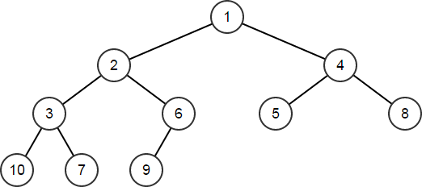
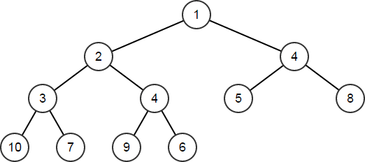
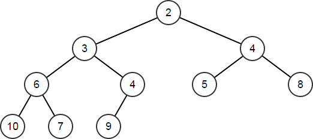
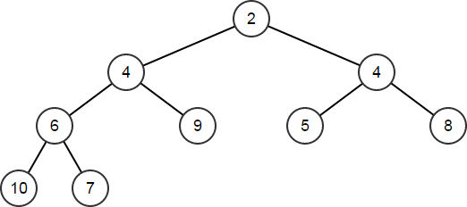

---
title: "TArray in Unreal Engine"
description: "UE 数组容器"
date: "2026-05-13 21:13:31"
category: "Unreal / Gameplay"
originalCategory: "Unreal / Gameplay"
track: "Game Development"
level: intermediate
status: ready
published: true
minutes: 9
order: 1000
prerequisites: []
tags: ["UE", "C++"]
photos: "banner.png"
source: "_posts"
---## `TArray`

`TArray` 是一种高效、节省内存并且安全的数组容器。

它由两个主要属性决定：元素类型和分配器。
- 元素类型规定数组中存放的对象类型。
- 分配器控制内存布局和数组扩容策略，通常可以省略并使用默认分配器。

`TArray` 是值类型，类似于 `int32` 或 `float`；不建议用 `new` 或 `delete`.

数组拥有元素，销毁数组就会销毁其中的元素。

使用其他数组初始化时，会拷贝其元素。

### 创建并填充数组

#### 创建
```
TArray<int32> IntArray;
```

这会创建一个用于保存整型序列的空数组。

元素类型可以是任何按照普通 C++ 值规则可拷贝且可析构的值类型，如 `int32` `FString` `TSharedPtr` 等。

由于没有指定分配器，`TArray` 将使用默认的基于堆的分配器。

创建时，还未分配内存。

`TArray` 假设元素类型是可平移的，可以通过直接拷贝原始字节将元素安全地从内存的一个位置移动到另一个位置。


#### `Init`
```
IntArray.Init(10, 5);
// IntArray == [10,10,10,10,10]
```

#### `Add` `Emplace`
```
TArray<FString> StrArr;
StrArr.Add (TEXT("Hello"));
StrArr.Emplace(TEXT("World"));
// StrArr == ["Hello","World"]
```
`Add` `Emplace` 可以在数组末尾创建新元素。

当向数组添加新元素时，数组的分配器会根据需要提供内存；默认分配器在当前数组大小不足时，会为多个新元素分配足够的内存。

- `Add` 会将元素类型的一个实例拷贝到数组中。
- `Emplace` 会使用提供的参数来构造元素的新势力。

以上面的代码为例，`Add` 会先从字符串字面量创建一个临时的 `FString`，然后将该临时 `FString` 的内容移动到容器内的新 `FString` 中，而 `Emplace` 会直接使用字符串字面量在容器内创建新的 `FString`. 虽然最终结果相同，但 `Emplace` 避免了创建临时变量。

一般而言 `Emplace` 优于 `Add`，因为它避免在调用点产生不必要的临时变量，然后将其拷贝或移动到容器中：
- 对平凡类型使用 `Add`.
- 对非平凡类型使用 `Emplace`.

#### `Append`
`Append` 可以一次从另一个 `TArray` 或来自普通 C 数组的指针处添加多个元素：
```
FString Arr[] = { TEXT("of"), TEXT("Tomorrow") };
StrArr.Append(Arr, ARRAY_COUNT(Arr));
// StrArr == ["Hello","World","of","Tomorrow"]
```

#### `AddUnique`
`AddUnique` 仅在容器中不存在等价元素时才添加新元素，等价性通过使用元素类型的 `operator==` 来检查。

```
StrArr.AddUnique(TEXT("!"));
// StrArr == ["Hello","World","of","Tomorrow","!"]
StrArr.AddUnique(TEXT("!"));
// StrArr 保持不变，因为 "!" 已经是一个元素
```

#### `Insert`
`Insert` 会在给定索引处添加单个元素或一组元素的拷贝。

```
StrArr.Insert(TEXT("Brave"), 1);
// StrArr == ["Hello","Brave","World","of","Tomorrow","!"]
```

#### `SetNum`
`SetNum` 函数可以直接设置数组元素的数量，如果新的数量大于当前数量，则会使用元素类型默认构造函数创建新元素；如果新的数量小于当前元素，则移除元素。
```
StrArr.SetNum(8);
// StrArr == ["Hello","Brave","World","of","Tomorrow","!","",""]
StrArr.SetNum(6);
// StrArr == ["Hello","Brave","World","of","Tomorrow","!"]
```

### 迭代
推荐的方式是使用 C++ 的 `for` 语法：
```
FString JoinedStr;
for (auto& Str : StrArr)
{
    JoinedStr += Str;
    JoinedStr += TEXT(" ");
}
```

当然，也可用索引迭代：
```
for (int32 Index = 0; Index != StrArr.Num(); ++Index)
{
    JoinedStr += StrArr[Index];
    JoinedStr += TEXT(" ");
}
```

它自己也提供了迭代器 `CreateIterator` `CreateConstIterator`：
```
for (auto It = StrArr.CreateConstIterator(); It; ++It)
{
JoinedStr += *It;
JoinedStr += TEXT(" ");
}
```

### 排序
可以简单地调用 `Sort` 函数对数组进行排序：
```
StrArr.Sort();
// StrArr == ["!","Brave","Hello","of","Tomorrow","World"]
```

这里的排序是依据元素类型的 `operator<`. 对于 `FString` 来说，比较是大小写不敏感的字典序比较。

我们也可实现一个二元谓词来提供不同的排序语义：
```
StrArr.Sort([](const FString& A, const FString& B) {
return A.Len() < B.Len();
});
```

`Sort` 是不稳定排序，等价元素的相对顺序不保证保持不变，其具体实现是快速排序。

`HeapSort` 函数执行堆排序：

```
StrArr.HeapSort([](const FString& A, const FString& B) {
return A.Len() < B.Len();
});
// StrArr == ["!","of","Hello","Brave","World","Tomorrow"]
```

`StableSort` 保证等价元素在排序后保持相对顺序：
```
StrArr.StableSort([](const FString& A, const FString& B) {
return A.Len() < B.Len();
});
// StrArr == ["!","of","Brave","Hello","World","Tomorrow"]
```

### 查询
使用 `Num` 函数查询数组包含多少个元素：
```
int32 Count = StrArr.Num();
// Count == 6
```

如果需要直接访问数组内存，可以使用 `GetData` 函数来返回指向数组元素的指针；该指针只在数组存在且在对数组进行任何变更操作之前有效；当然，只有前 `Num` 个索引是可解引用的：
```
FString* StrPtr = StrArr.GetData();
// StrPtr[0] == "!"
// StrPtr[1] == "of"
// ...
// StrPtr[5] == "Tomorrow"
// StrPtr[6] - 未定义行为
```

如果容器是 `const`，则返回的指针也是 `const`.

查询容器元素的字节大小：
```
uint32 ElementSize = StrArr.GetTypeSize();
// ElementSize == sizeof(FString)
```

要检索元素，可以使用索引运算符 `[]` 并传入从零开始的索引以获取对应元素；传入无效索引会导致运行时错误，可以使用 `IsValidIndex` 函数询问某个索引是否有效：
```
bool bValidM1 = StrArr.IsValidIndex(-1);
bool bValid0 = StrArr.IsValidIndex(0);
bool bValid5 = StrArr.IsValidIndex(5);
bool bValid6 = StrArr.IsValidIndex(6);
// bValidM1 == false
// bValid0 == true
// bValid5 == true
// bValid6 == false
```

也可以使用 `Last` 从数组末尾向后索引，索引默认值为0；`Top` 与之相反，但不接受索引：
```
FString ElemEnd = StrArr.Last();
FString ElemEnd0 = StrArr.Last(0);
FString ElemEnd1 = StrArr.Last(1);
FString ElemTop = StrArr.Top();
// ElemEnd == "Tomorrow"
// ElemEnd0 == "Tomorrow"
// ElemEnd1 == "World"
// ElemTop == "Tomorrow"
```

可以使用 `Contains` 查询数组是否包含某个元素：
```
bool bHello = StrArr.Contains(TEXT("Hello"));
bool bGoodbye = StrArr.Contains(TEXT("Goodbye"));
// bHello == true
// bGoodbye == false
```

也可以使用谓词询问数组中是否存在满足特定条件的元素：
```
bool bLen5 = StrArr.ContainsByPredicate([](const FString& Str){
return Str.Len() == 5;
});
bool bLen6 = StrArr.ContainsByPredicate([](const FString& Str){
return Str.Len() == 6;
});
// bLen5 == true
// bLen6 == false
```

我们可以使用一系列的 `Find` 函数来查找元素，若要检查元素是否存在并返回其索引，可以使用 `Find`：
```
int32 Index;
if (StrArr.Find(TEXT("Hello"), Index))
{
// Index == 3
}
```

`Index` 被设置为找到的第一个元素的索引；如果存在重复元素并且想找到最后一个元素的索引，可以使用 `FindLast`.

`Find` 和 `FindLast` 也可以直接返回元素的索引（如果你不传入索引变量作为参数）。

如果没有找到元素，则会返回特殊值 `INDEX_NONE`.

`IndexOfByKey` 适用于任何对 `operator==(ElementType, KeyType)` 存在定义的键类型：
```
int32 Index = StrArr.IndexOfByKey(TEXT("Hello"));
// Index == 3
```

`IndexOfByPredicate` 函数会找到第一个匹配指定谓词的元素索引：
```
int32 Index = StrArr.IndexOfByPredicate([](const FString& Str){
return Str.Contains(TEXT("r"));
});
```

我们也可以返回指向找到元素的指针。`FindByKey` 的行为类似于 `IndexOfByKey`（比较元素与任意对象），但返回的是找到元素的指针；如果未找到则返回 `nullptr`：
```
auto* OfPtr = StrArr.FindByKey(TEXT("of"));
auto* ThePtr = StrArr.FindByKey(TEXT("the"));
// OfPtr == &StrArr[1]
// ThePtr == nullptr
```

`FindByPredicate` 的用法类似于 `IndexOfByPredicate`，但返回指针而非索引：
```
auto* Len5Ptr = StrArr.FindByPredicate([](const FString& Str){
return Str.Len() == 5;
});
auto* Len6Ptr = StrArr.FindByPredicate([](const FString& Str){
return Str.Len() == 6;
});
// Len5Ptr == &StrArr[2]
// Len6Ptr == nullptr
```

可以使用 FilterByPredicate 函数检索一个满足特定谓词的元素数组：
```
auto Filter = StrArray.FilterByPredicate([](const FString& Str){
return !Str.IsEmpty() && Str[0] < TEXT('M');
});
```

### 移除
`Remove` 函数会移除所有被认为与所提供元素相等的元素，判等依据为元素类型的 `operator==`：
```
TArray<int32> ValArr;
int32 Temp[] = { 10, 20, 30, 5, 10, 15, 20, 25, 30 };
ValArr.Append(Temp, ARRAY_COUNT(Temp));
// ValArr == [10,20,30,5,10,15,20,25,30]
```

可以使用 `RemoveSingle` 来删除数组中第一个匹配的元素。

使用 `RemoveAt` 按索引删除元素，但最好先使用 `IsValidIndex` 来验证数组是否包含输入的索引：
```
ValArr.RemoveAt(2); // 删除索引 2 处的元素
// ValArr == [10,5,15,25,30]

ValArr.RemoveAt(99); // 这会导致运行时错误，因为索引 99 处没有元素
```

使用 `RemoveAll` 通过谓词删除满足条件的元素：
```
ValArr.RemoveAll([](int32 Val) {
return Val % 3 == 0;
});
```

在所有这些情况下，当元素被移除后，随后元素会向下移动填补空位。

移动过程会带来开销，如果我们并不在意移动后元素的顺序，可以使用 `RemoveSawp` `RemoveAtSwap` 和 `RemoveAllSwap` 来减少这部分开销；它们不保证剩余元素的顺序，因此可以更快地完成操作。

```
TArray<int32> ValArr2;
for (int32 i = 0; i != 10; ++i)
ValArr2.Add(i % 5);
// ValArr2 == [0,1,2,3,4,0,1,2,3,4]
ValArr2.RemoveSwap(2);
// ValArr2 == [0,1,4,3,4,0,1,3]
ValArr2.RemoveAtSwap(1);
// ValArr2 == [0,3,4,3,4,0,1]
ValArr2.RemoveAllSwap([](int32 Val) {
    return Val % 3 == 0;
});
// ValArr2 == [1,4,4]
```

`Empty` 用以清空数组中的所有内容。

### 运算符
数组是常规的值类型，因此可以通过标准的拷贝构造函数或复制运算符进行拷贝。

由于数组严格拥有其元素，拷贝数组是深拷贝，因此新数组会拥有元素的副本。
```
TArray<int32> ValArr3;
ValArr3.Add(1);
ValArr3.Add(2);
ValArr3.Add(3);
auto ValArr4 = ValArr3;
// ValArr4 == [1,2,3];
ValArr4[0] = 5;
// ValArr3 == [1,2,3];
// ValArr4 == [5,2,3];
```

我们可以使用 `operator+=` 代替 `Append` 连接数组：
```
ValArr4 += ValArr3;
// ValArr4 == [5,2,3,1,2,3]
```

`TArray` 也支持移动语义，可以使用 `MoveTemp` 来调用。移动后，源数组保证会被置为空：
```
ValArr3 = MoveTemp(ValArr4);
// ValArr3 == [5,2,3,1,2,3]
// ValArr4 == []
```

数组可以使用 `operator==` 和 `operator!=` 进行比较，只有当两个数组具有相同数量且顺序相同的元素时，它们才相等。元素之间的比较使用元素自身的 `operator==`：
```
TArray<FString> FlavorArr1;
FlavorArr1.Emplace(TEXT("Chocolate"));
FlavorArr1.Emplace(TEXT("Vanilla"));
// FlavorArr1 == ["Chocolate","Vanilla"]
auto FlavorArr2 = Str1Array;
// FlavorArr2 == ["Chocolate","Vanilla"]
bool bComparison1 = FlavorArr1 == FlavorArr2;
// bComparison1 == true
for (auto& Str : FlavorArr2)
{
    Str = Str.ToUpper();
}
// FlavorArr2 == ["CHOCOLATE","VANILLA"]
bool bComparison2 = FlavorArr1 == FlavorArr2;
// bComparison2 == true，因为 FString 的比较忽略大小写
Exchange(FlavorArr2[0], FlavorArr2[1]);
// FlavorArr2 == ["VANILLA","CHOCOLATE"]
bool bComparison3 = FlavorArr1 == FlavorArr2;
// bComparison3 == false，因为元素的顺序发生了变化
```

### 堆
`TArray` 提供了一组支持二叉堆数据结构的函数。

堆时一种二叉树，其中任何父节点都与其所有子节点相当活在顺序上优先于它们。

当以数组实现时，树的根节点位于元素 0，位于索引 N 的节点的左右子节点分别为 2N+1 和 2N+2. 子节点相互之间没有特定顺序。

可以通过调用 `Heapify` 将任何现有数组转换为堆，该函数有带谓词和不带谓词的重载，未指定谓词时会使用元素类型的 `operator<` 来决定顺序：
```
TArray<int32> HeapArr;
for (int32 Val = 10; Val != 0; --Val)
{
HeapArr.Add(Val);
}
// HeapArr == [10,9,8,7,6,5,4,3,2,1]
HeapArr.Heapify();
// HeapArr == [1,2,4,3,6,5,8,10,7,9]
```



树中的节点可以按从左到右、从上到下的顺序读取，正好对应堆化后数组中元素的顺序。注意，数组在被转换成堆后不一定是已排序的。虽然已排序的数组也可以看作是有效的堆，但堆结构的定义允许对于相同元素集合存在多种有效的堆排列。

```
HeapArr.HeapPush(4);
// HeapArr == [1,2,4,3,4,5,8,10,7,9,6]
```



`HeapPop` 和 `HeapPopDiscard` 用于从堆中移除顶节点。两者的区别在于：`HeapPop` 接受一个元素类型的引用并把顶元素的副本返回到该引用中，而 `HeapPopDiscard` 则仅移除顶节点而不以任何方式返回它们。两者都会对数组产生相同的变化，同时通过适当重新排序其它元素来维护堆：
```
int32 TopNode;
HeapArr.HeapPop(TopNode);
// TopNode == 1
// HeapArr == [2,3,4,6,4,5,8,10,7,9]
```


`HeapRemoveAt` 会移除数组中给定索引处的元素，然后重新排序以维持堆性质：
```
HeapArr.HeapRemoveAt(1);
```



`HeapPush` `HeapPop` `HeapPopDiscard` 和 `HeapRemoveAt` 这些函数应仅在结构已是有效堆的情况下调用，例如在 `Heapify` 调用之后、在任何其它堆操作之后，或者当你手动将数组调整为堆时。

上述每个函数（包括 `Heapify`）都可以接受一个可选的二元谓词来决定堆中节点元素的顺序。默认情况下，堆操作使用元素类型的 `operator<` 来确定顺序。当使用自定义谓词时，务必在所有堆操作中使用相同的谓词。

使用 `HeapTop` 检查堆顶节点而不改变数组：
```
int32 Top = HeapArr.HeapTop();
// Top == 2
```

### 冗余
由于数组可以调整大小，它们会使用可变量的内存。

为了避免在每次添加元素时都重新分配，分配器通常会提供比请求更多的内存，从而使将来对数组的 `Add` 调用在扩容时不会频繁触发重新分配内存；同样，移除元素通常不会立即释放内存。

这就会留下数组的冗余空间元素，实际上是预分配但当前未被使用的元素存储槽。数组中的冗余空间定义为当前存储的元素数量与当前已分配内存可容纳的元素数量之间的差值。

由于默认构造的数组不分配内存，初始时 slack 为 0. 可以使用 `GetSlack` 查询数组中有多少 slack.

数组在容器重新分配之前能够容纳的最大元素数量由 `Max` 获取，`GetSlack` 等于 `Max` 与 `Num` 的插值。

```
TArray<int32> SlackArray;
// SlackArray.GetSlack() == 0
// SlackArray.Num() == 0
// SlackArray.Max() == 0

SlackArray.Add(1);
// SlackArray.GetSlack() == 3
// SlackArray.Num()      == 1
// SlackArray.Max()      == 4

SlackArray.Add(2);
SlackArray.Add(3);
SlackArray.Add(4);
SlackArray.Add(5);
// SlackArray.GetSlack() == 17
// SlackArray.Num()      == 5
// SlackArray.Max()      == 22
```

容器在重新分配后留下的 slack 数量由分配器决定，因此用户不应该依赖 slack 保持不变。

尽管不要求显式管理 slack，但你可以利用它来对数组进行优化提示。例如，如果你知道接下来将向数组添加 100 个新元素，可以先确保数组至少有 100 的 slack，这样在添加这些新元素时数组就不需要重新分配内存。上文提到的 Empty 函数接受一个可选的 slack 参数：
```
SlackArray.Empty();
// SlackArray.GetSlack() == 0
// SlackArray.Num() == 0
// SlackArray.Max() == 0
SlackArray.Empty(3);
// SlackArray.GetSlack() == 3
// SlackArray.Num() == 0
// SlackArray.Max() == 3
SlackArray.Add(1);
SlackArray.Add(2);
SlackArray.Add(3);
// SlackArray.GetSlack() == 0
// SlackArray.Num() == 3
```

`Reset` 函数类似 `Empty`，但如果当前分配已提供了请求的 slack ，则 `Reset` 不会释放内存，不过如果请求的 slack 更大，它会分配更多的的内存：
```
SlackArray.Reset(0);
// SlackArray.GetSlack() == 3
// SlackArray.Num() == 0
// SlackArray.Max() == 3
SlackArray.Reset(10);
// SlackArray.GetSlack() == 10
// SlackArray.Num() == 0
// SlackArray.Max() == 10
```

可以使用 `Shrink` 函数移除所有冗余空间，`Shrink` 会将分配调整为恰好容纳当前元素所需的最小大小。`Shrink` 不会影响数组中的元素：
```
SlackArray.Add(5);
SlackArray.Add(10);
SlackArray.Add(15);
SlackArray.Add(20);
// SlackArray.GetSlack() == 6
// SlackArray.Num() == 4
// SlackArray.Max() == 10
SlackArray.Shrink();
// SlackArray.GetSlack() == 0
// SlackArray.Num() == 4
// SlackArray.Max() == 4
```

### RawMemory
`TArray` 最终只是对已分配内存的一个封装。将其作为内存块直接操作并自行构造元素在某些场景下很有用。`TArray` 会尽其所能使用已有信息来保持正确性，但有时你可能需要降到更底层去操作。

`AddUninitialized` 和 `InsertUninitialized` 会向数组添加一些未初始化的空间。它们的行为类似于 `Add` 和 `Insert`，但不会调用元素类型的构造函数。这在想避免调用构造器时很有用。例如在下面的例子中，计划使用 `Memcpy` 覆盖整个结构体：
```
int32 SrcInts[] = { 2, 3, 5, 7 };
TArray<int32> UninitInts;
UninitInts.AddUninitialized(4);
FMemory::Memcpy(UninitInts.GetData(), SrcInts, 4*sizeof(int32));
// UninitInts == [2,3,5,7]
```
可以用这个功能为你计划手动构造的对象预留内存：
```
TArray<FString> UninitStrs;
UninitStrs.Emplace(TEXT("A"));
UninitStrs.Emplace(TEXT("D"));
UninitStrs.InsertUninitialized(1, 2);
new ((void*)(UninitStrs.GetData() + 1)) FString(TEXT("B"));
new ((void*)(UninitStrs.GetData() + 2)) FString(TEXT("C"));
// UninitStrs == ["A","B","C","D"]
```

`AddZeroed` 和 `InsertZeroed` 的作用类似，但它们还会把新增/插入空间的字节清零：
```
struct S
{
    S(int32 InInt, void* InPtr, float InFlt)
        : Int(InInt), Ptr(InPtr), Flt(InFlt)
    {
    }
    int32 Int;
    void* Ptr;
    float Flt;
};
TArray<S> SArr;
SArr.AddZeroed();
// SArr == [{ Int: 0, Ptr: nullptr, Flt: 0.0f }]
```

`SetNumUninitialized` 和 `SetNumZeroed`，它们的行为类似于 `SetNum`，但当新的数量大于当前数量时，新元素的空间会分别保持未初始化或按位清零。与 `AddUninitialized` 与 `InsertUninitialized` 一样，如果需要，你应确保为新空间正确构造元素：
```
SArr.SetNumUninitialized(3);
new ((void*)(SArr.GetData() + 1)) S(5, (void*)0x12345678, 3.14);
new ((void*)(SArr.GetData() + 2)) S(2, (void*)0x87654321, 2.72);
```

谨慎使用 “Uninitialized” 和 “Zeroed” 系列函数。如果元素类型包含需要构造的成员，或该类型没有有效的按位清零状态，使用这些函数可能导致无效的数组元素和未定义行为。这些函数最适用于那些值很少变化或可安全按位复制/清零的类型，例如 `FMatrix` 或 `FVector`.

### 其他
`BulkSerialize` 函数是一种序列化函数，可作为 `operator<<` 的替代，用来将数组作为一块原始字节进行序列化，而不是对每个元素逐一序列化。对于平凡元素（例如内建类型或纯数据结构），这可以提高性能。

`CountBytes` 和 `GetAllocatedSize` 函数用于估算数组当前使用了多少内存。`CountBytes` 接受一个 `FArchive`，而 `GetAllocatedSize` 可以直接调用。这些函数通常用于统计/报表。

`Swap` 和 `SwapMemory` 两个函数都接受两个索引并交换这些索引处元素的值。它们等价，但 Swap 会对索引做额外的错误检查并在索引越界时断言（assert）。
