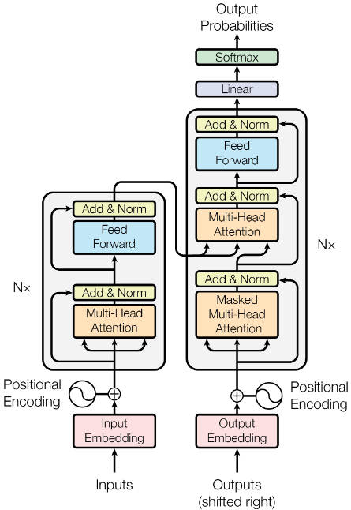

Transformer模型完全基于注意力机制，没有任何卷积层或循环神经网络。
# 模型
Transformer作为编码器-解码器架构，整体架构如下图：


Transformer是由编码器和解码器组成，编码器和解码器是基于自注意力的模块叠加而成的，源序列和目标输出序列的嵌入表示将加上位置编码，再分别输入编码器和解码器中。

Transformer的编码器是由多个相同的层叠加而成的，每个层都有两个子层。
- 第一个子层是多头自注意力汇聚
- 第二个子层是基于位置的前馈网络
- 每个子层都采用了残差链接
  - 对于序列中任何位置的任何输入$x\in R^d$，都要求满足$sublayer(x)\in R^d$，以便残差连接满足$x+sublayer(x)\in R^d$.
  - 再残差连接的加法计算后，紧接着应用层规范化
  - 因此，对于输入序列的每个位置，Transformer编码器都将输出一个$d$维表示向量

Transformer解码器也是由多个相同的层叠加而成的，并且层中使用了残差连接和层规范化。
- 除了编码器中描述的两个子层，解码器还在这两个子层之间插入了第三个子层，称为编码-解码器注意力层
- 再解码器自注意力中，查询、键和值都来自上一个解码器层的输出
- 解码器中的每个位置都只能考虑该位置之前的所有位置，这种掩蔽注意力保留了自回归属性，以确保预测仅依赖已生成的输出词元

## 实现
```
import math
import panda as pd
import torch
from torch import nn
from d2l import torch as d2l
```
### 基于位置的前馈神经网络
基于位置的前馈网络对序列中的所有位置的表示进行变换时使用的是同一个多层感知机，这就是称前馈神经网络是基于位置的原因。

在下面的实现中，输入X的形状(批量大小，时间步数或序列长度，隐单元数或特征维度)将被一个两层的感知机变换成形状为(批量大小，时间步数，ffn_num_outputs)的输出张量。

```
#@save
class PositionWiseFFN(nn.Module):
    def __init__(self, ffn_num_input, ffn_num_hiddens, ffn_num_outputs, **kwargs):
       super(PositionWiseFFN, self).__init__(**kwargs)
       self.dense1 = nn.Linear(ffn_num_input, ffn_num_hiddens)
       self.relu = nn.ReLU()
       self.dense2 = nn.Linear(ffn_num_hiddens, ffn_num_outputs)

    def forward(self, X):
        return self.dense2(self.relu(self.dense1(X)))
```

下面的例子显示，改变张量的最内层维度的尺寸，会改变基于位置的前馈网络的输出尺寸。因为用同一个多层感知机对所有位置上的输入进行变换，所以当所有这些位置的输入相同时，它们的输出也是相同的。

```
ffn = PositionWiseFFN(4, 4, 8)
ffn.eval()
ffn(torch.ones((2, 3, 4)))[0]
```
### 残差连接和层规范化
批量规范化是在一个小批量的样本内对数据进行重新中心化和重新缩放的调整。

层规范化与批量规范化的目标相同，但层规范化是基于特征维度进行规范化，往往使用在自然语言处理中。

现在可以使用残差连接和层规范化来实现AddNorm类，暂退法也被作为正则化方法使用。

```
class AddNorm(nn.Module):
    def __init__(self, normalized_shape, dropout, **kwargs):
        super(AddNorm, self).__init__()
        self.dropout = nn.Dropout(dropout)
        self.ln = nn.LayerNorm(normalized_shape)

    def forward(self, X, Y):
        return self.ln(self.dropout(Y)+X)
```

残差连接要求两个输入的形状相同，以便在加法操作后输出张量的形状相同：
```
add_norm = AddNorm([3, 4], 0.5)
add_norm.eval()
add_norm(torch.ones((2, 3, 4)), torch.ones((2, 3, 4))).shape
```

### 编码器
有了Transformer编码器的基础组件，现在可以先实现编码器中的一个层。

下面的EncoderBlock类包含两个子层：多头注意力和基于位置的前馈神经网络，这两个子层都使用了残差连接和紧随的层规范化：
```
class EncoderBlock(nn.Module):
    def __init__(self, key_size, query_size, value_size, num_hiddens, norm_shape, ffn_num_input, ffn_num_hiddens, num_heads, dropout, use_bias = False, **kwargs):
        super(EncoderBlock, self).__init__(**kwargs)
        self.attention = MultiHeadAttention(key_size, query_size, value_size, num_hiddens, num_heads, dropout, use_bias)
        self.addnorm1 = AddNorm(norm_shape, dropout)
        self.ffn = PositionWiseFFN(ffn_num_input, ffn_num_hiddens, num_hiddens)
        self.addnorm2 = AddNorm(norm_shape, dropout)

    def forward(self, X, valid_lens):
        Y = self.addnorm1(X, self.attention(X, X, X, valid_lens))
        return self.addnorm2(Y, self.ffn(Y))


class MultiHeadAttention(nn.Module):
    def __init__(self, key_size, query_size, value_size, num_hiddens, num_heads, dropout, use_bias = False, **kwargs):
        super(MultiHeadAttention, self).__init__(**kwargs)
        self.W_q = nn.Linear(query_size, num_hiddens, bias=use_bias)
        self.W_k = nn.Linear(key_size, num_hiddens, bias=use_bias)
        self.W_v = nn.Linear(value_size, num_hiddens, bias=use_bias)
        self.W_o = nn.Linear(num_hiddens, num_hiddens, bias=use_bias)
        self.attention = d2l.DotProductAttention(dropout)
        self.num_heads = num_heads

    def forward(self, queries, keys, values, valid_lens):
        queries = transpose_qkv(self.W_q(queries), self.num_heads)
        keys = transpose_qkv(self.W_k(keys), self.num_heads)
        values = transpose_qkv(self.W_v(values), self.num_heads)

        if valid_lens is not None:
            valid_lens = torch.repeat_interleave(valid_lens, repeats = self.num_heads, dim=0)

        output = self.attention(queries, keys, values, valid_lens)
        output_concat = transpose_output(output, self.num_heads)

        return self.W_o(output_concat)


def transpose_qkv(X, num_heads):
    X = X.reshape(X.shape[0], X.shape[1], num_heads, -1)
    X = X.permute(0, 2, 1, 3)
    return X.reshape(-1, X.shape[2], X.shape[3])


def transpose_output(X, num_heads):
    X = X.reshape(-1, num_heads, X.shape[1], X.shape[2])
    X = X.permute(0, 2, 1, 3)
    return X.reshape(X.shape[0], X.shape[1], -1)
```
Transformer编码器中的任何层都不会改变其输入的形状。
```
X = torch.ones((2, 100, 24))
valid_lens = torch.tensor([3, 2])
encoder_blk = EncoderBlock(24, 24, 24, 24, [100, 24], 24, 48, 8, 0.5)
encoder_blk.eval()
encoder_blk(X, valid_lens).shape
```
下面实现的Transformer编码器的代码中，堆叠了num_layers个EncoderBlock类的实例。由于这里使用的是值范围在$-1~1$的固定位置编码，因此通过学习得到的输入的嵌入表示的值需要先乘以嵌入维度的平方根进行重新缩放，再与位置编码相加。
```
class TransformerEncoder(d2l.Encoder):
    def __init__(self, vocab_size, key_size, query_size, value_size, num_hiddens, norm_shape, ffn_num_input, ffn_num_hiddens, num_heads, num_layers, dropout, use_bias = False, **kwargs):
        super(TransformerEncoder, self).__init__(**kwargs)
        self.num_hiddens = num_hiddens
        self.embedding = nn.Embedding(vocab_size, num_hiddens)
        self.pos_encoding = d2l.PositionalEncoding(num_hiddens, dropout)
        self.blks = nn.Sequential()
        for i in range(num_layers):
            self.blks.add_module("block"+str(i),
                EncoderBlock(key_size, query_size, value_size, num_hiddens, norm_shape, ffn_num_input, ffn_num_hiddens, num_heads, dropout, use_bias))

    def forward(self, X, valid_lens, *args):
        X = self.pos_encoding(self.embedding(x)*math.sqrt(self.num_hiddens))
        self.attention_weights = [None]*len(self.blks)
        for i, blk in enumerate(self.blks):
            X = blk(X, valid_lens)
            self.attention_weights[i] = blk.attention.attention_weights
        return X
```
下面我们指定超参数来创建一个两层的Transformer编码器。Transformer编码器输出的形状是(批量大小，时间步数，num_hiddens)
```
encoder = TransformerEncoder(
    200, 24, 24, 24, 24,[100, 24], 24, 48, 8, 2, 0.5)
encoder.eval()
encoder(torch.ones((2, 100), dtype= torch.long), valid_lens).shape
```
### 解码器
在DecoderBlock类中，实现的每个层包含3个子层：解码器自注意力，编码器-解码器注意力和基于位置的前馈网络。

这些子层也都被残差连接和紧随的层规范化围绕。

正如前面所说，在掩蔽多头解码器自注意力层中，查询、键和值都来自上一个解码器的输出。

关于序列到序列模型，在训练阶段，其输出序列的所有位置的词元都是已知的：然而在预测阶段，其输出序列的词元是逐个生成的。因此在解码器的任何时间步中，只有生成的词元才能用于解码器的自注意力计算中。

为了在解码器中保留自回归的属性，其掩蔽自注意力设定了参数dec_valid_lens，以便任何查询都只会与解码器中所有已经生成词元的位置进行注意力计算。
```
class DecoderBlock(nn.Module):
    def __init__(self, key_size, query_size, value_size, num_hiddens, norm_shape, ffn_num_input, ffn_num_hiddens, num_heads, dropout, i, **kwargs):
        super(DecoderBlock, self).__init__(**kwargs)
        self.i = i
        self.attention1 = MultiHeadAttention(key_size, query_size, value_size, num_hiddens, num_heads, dropout)
        self.addnorm1 = AddNorm(norm_shape, dropout)
        self.attention2 = MultiHeadAttention(key_size, query_size, value_size, num_hiddens, num_heads, dropout)
        self.addnorm2 = AddNorm(norm_shape, dropout)
        self.ffn = PositionWiseFFN(ffn_num_input, ffn_num_hiddens, num_hiddens)
        self.addnorm3 = AddNorm(norm_shape, dropout)

    def forward(self, X, state):
        enc_outputs, enc_valid_lens = state[0], state[1]
        # 训练阶段，输出序列的所有词元都在同一时间处理
        # 因此state[2][self.i]初始化为None
        # 预测阶段，输出序列是通过词元一个一个接着解码的
        # 因此state[2][self.i]包含直到当前时间步第i个块解码的输出表示
        if state[2][self.i] is None:
            key_values = X
        else:
            key_values = torch.cat((state[2][self.i], X), axis = 1)
        state[2][self.i] = key_values
        if self.training :
            batch_size, num_steps, _ = X.shape
            dec_valid_lens = torch.arange(
                1, num_steps+1, device=X.device).repeat(batch_size, 1)
        else:
            dec_valid_lens = None

        X2 = self.attention1(X, key_values, key_values, dec_valid_lens)
        Y = self.addnorm1(X, X2)
        Y2 = self.attention2(Y, enc_outputs, enc_outputs, enc_valid_lens)
        Z = self.addnorm2(Y, Y2)
        return self.addnorm3(Z, self.ffn(Z)), state
```
为了便于在编码器-解码器注意力中进行缩放点积运算和在残差连接中进行加法计算，编码器和解码器的特征维度都是num_hiddens。
```
decoder_blk = DecoderBlock(24, 24, 24, 24, [100, 24], 24, 48, 8, 0.5, 0)
decoder_blk.eval()
X = torch.ones((2, 100, 24))
state = [encoder_blk(X, valid_lens), valid_lens, [None]]
decoder_blk(X, state)[0].shape
```
现在我们构建Transformer解码器，最后通过一个全连接层计算所有vocab_size个可能的输出词元的预测值。解码器自注意力权重和编码器-解码器注意力权重都被存储下来，以便日后可视化。

```
class TransformerDecoder(d2l.AttentionDecoder):
    def __init__(self, vocab_size, key_size, query_size, value_size,
                 num_hiddens, norm_shape, ffn_num_input, ffn_num_hiddens,
                 num_heads, num_layers, dropout, **kwargs):
        super(TransformerDecoder, self).__init__(**kwargs)
        self.num_hiddens = num_hiddens
        self.num_layers = num_layers
        self.embedding = nn.Embedding(vocab_size, num_hiddens)
        self.pos_encoding = d2l.PositionalEncoding(num_hiddens, dropout)
        self.blks = nn.Sequential()
        for i in range(num_layers):
            self.blks.add_module("block"+str(i),
                DecoderBlock(key_size, query_size, value_size, num_hiddens,
                             norm_shape, ffn_num_input, ffn_num_hiddens,
                             num_heads, dropout, i))
        self.dense = nn.Linear(num_hiddens, vocab_size)

    def init_state(self, enc_outputs, enc_valid_lens, *args):
        return [enc_outputs, enc_valid_lens, [None] * self.num_layers]

    def forward(self, X, state):
        X = self.pos_encoding(self.embedding(X) * math.sqrt(self.num_hiddens))
        self._attention_weights = [[None] * len(self.blks) for _ in range (2)]
        for i, blk in enumerate(self.blks):
            X, state = blk(X, state)
            # 解码器自注意力权重
            self._attention_weights[0][
                i] = blk.attention1.attention.attention_weights
            # “编码器－解码器”自注意力权重
            self._attention_weights[1][
                i] = blk.attention2.attention.attention_weights
        return self.dense(X), state

    @property
    def attention_weights(self):
        return self._attention_weights
```

### 训练
```
num_hiddens, num_layers, dropout, batch_size, num_steps = 32, 2, 0.1, 64, 10
lr, num_epochs, device = 0.005, 200, d2l.try_gpu()
ffn_num_input, ffn_num_hiddens, num_heads = 32, 64, 4
key_size, query_size, value_size = 32, 32,32
norm_shape = [32]

train_iter, src_vocab, tgt_vocab = d2l.load_data_nmt(batch_size, num_steps)
encoder = TransformerEncoder(len(src_vocab), key_size, query_size, value_size, num_hiddens, norm_shape, ffn_num_input, ffn_num_hiddens, num_heads, num_layers, dropout)
decoder = TransformerDecoder(len(tgt_vocab), key_size, query_size, value_size, num_hiddens, norm_shape, ffn_num_input, ffn_num_hiddens, num_heads, num_layers, dropout)

class EncoderDecoder(nn.Module):
    def __init__(self, encoder, decoder, **kwargs):
        super(EncoderDecoder, self).__init__(**kwargs)
        self.encoder = encoder
        self.decoder = decoder

    def forward(self, enc_X, dec_X, *args):
        enc_outputs = self.encoder(enc_X, *args)
        dec_state = self.decoder.init_state(enc_outputs, *args)
        return self.decoder(dec_X, dec_state)

net = EncoderDecoder(encoder, decoder)
d2l.train_seq2seq(net, train_iter, lr, num_epochs, tgt_vocab, device)```
