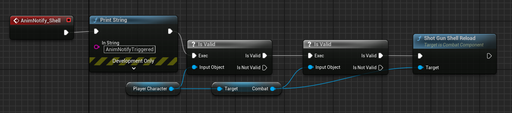

在开发一个多人联机TPS游戏时，出现了一个网络同步导致的AnimNotify重复触发的问题。

本游戏客户端换弹逻辑为：


1. 按下R，触发换弹函数`OnActionReload`.
2. `OnActionReload`调用战斗模块`Combat`中的`Reload`函数。
3. `Reload`调用`ServerReload`，向服务器发出RPC请求。
4. 服务器调用`HandleReload`，播放换弹Montage动画，更新`CombatState`至`Reloading`。
5. 客户端接受`CombatState`的同步，执行`HandleReload`方法，播放换弹Montage动画。
6. Montage动画播放至AnimNotify，提示上弹一颗，客户端、服务器执行`ShotGunShellReload`.
7. `ShotGunShellReload`检查服务器权限，拒绝客户端更新子弹，允许服务器更新子弹。
8. 后续换弹逻辑。

问题出现在 “Montage动画播放至AnimNotify，提示上弹一颗，客户端、服务器执行`ShotGunShellReload`” 这一步，由客户端触发的换弹时，服务器在一次换弹动画触发两次AnimNotify，导致每次换弹换上两颗。

解决思路：

通过Debug定位到AnimNotify多次触发上后，将原属于蓝图编程的AnimNotify触发行为交给CPP，并希望通过记录相应时间和堆栈，确定原因。

原蓝图逻辑：



创建`UShotGunReloadAnimNotify`类，继承自`UAnimNotify`.

```
// Fill out your copyright notice in the Description page of Project Settings.

#pragma once

#include "CoreMinimal.h"
#include "Animation/AnimNotifies/AnimNotify.h"
#include "ShotGunReloadAnimNotify.generated.h"

/**
 *
 */
UCLASS()
class SHOOTGAME_API UShotGunReloadAnimNotify : public UAnimNotify
{
	GENERATED_BODY()
public:
	virtual void Notify
		(USkeletalMeshComponent* MeshComp,
			UAnimSequenceBase* Animation,
			 const FAnimNotifyEventReference& EventReference)
	override;
};

```

```
void UShotGunReloadAnimNotify::Notify(USkeletalMeshComponent* MeshComp, UAnimSequenceBase* Animation,  const FAnimNotifyEventReference& EventReference)
{
	Super::Notify(MeshComp, Animation);

	FString Timestamp = FDateTime::Now().ToString(TEXT("%H:%M:%S.%s"));
	UE_LOG(LogTemp, Log, TEXT("[%s] AnimNotify Triggered"), *Timestamp);

	FString Callstack = FFrame::GetScriptCallstack(true);
	UE_LOG(LogTemp, Log, TEXT("Callstack:\n%s"), *Callstack);

	if(MeshComp && MeshComp->GetOwner())
	{
		if(APlayerCharacter* PlayerCharacter =
			Cast<APlayerCharacter>(MeshComp->GetOwner());
			PlayerCharacter && PlayerCharacter->GetCombat())
		{
			PlayerCharacter->GetCombat()->ShotGunShellReload();
		}
	}
}
```

通过对比试验，确定额外触发的原因。

正常情况下服务器换弹触发一次，输出为：
```
LogTemp: [16:57:16.103] AnimNotify Triggered
LogTemp: Callstack:
```

异常情况下客户端换弹触发两次，输出为：
```
LogTemp: [17:21:57.748] AnimNotify Triggered
LogTemp: Callstack:
    /Script/Engine.Character.ServerMovePacked
LogTemp: [17:21:57.784] AnimNotify Triggered
LogTemp: Callstack:
```

结果显示是`/Script/Engine.Character.ServerMovePacked`导致的额外触发。

后续：设置了计时器，避免多时间内快速触发。
