---
title: "Unreal Engine MMD Skeleton Retargeting Guide"
description: "本文介绍了如何完成MMD骨骼在UE引擎中进行动画重定向，以提供较为精确的动画，使得相关动画能够在ALS中使用。"
date: "2025-08-04 15:37:22"
category: "Unreal / Gameplay"
originalCategory: "UE相关"
track: "Game Development"
level: foundation
status: ready
published: true
minutes: 5
order: 1000
prerequisites: []
tags: ["UE"]
photos: "banner.jpg"
source: "_posts"
---可以呈现的效果：

有时为了将一些好看的模型用到自己的项目中，我们不得不从模之屋中获取，并使用插件VRM4U将 .pmx 文件导入到UE的项目中。

但是导入的模型往往在手臂存在多种问题，本文将介绍如何有效处理这类骨骼的重定向。

# 简要动画
如果你的目标仅仅是希望某个角色的动画能粗略地看一下没问题，不涉及较为精确的动画系统，那么你可以采取以下步骤：
## 导入模型
在项目中装好VRM4U插件，并启用后，将.pmx文件拖入指定文件夹。

保留其默认设置导入；一般而言，这种情况下并不需要使用IK Bone，如果有需要可以在设置中调整。

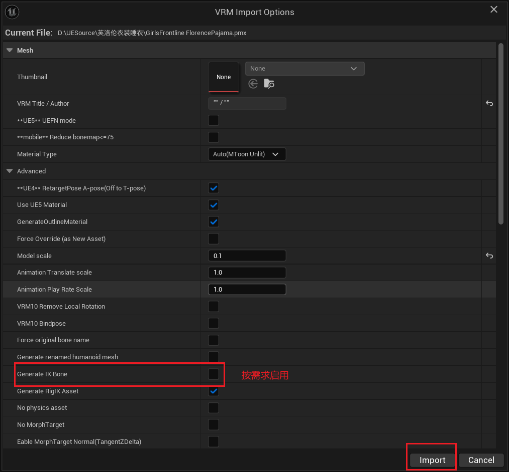

导入完成后，会有诸多文件，如材质、贴图、骨骼、IK Rig等。

我们可以将其归类整理，并可以删除Anim Sequence和动画蓝图。

## 设置Retarget
找到导入时生成的IK Rig，我们可以重点关注后缀为 Mannequin 的IK Rig，该文件已经参考UE标准骨骼完成了相关基础设置，事实上，你可以使用该文件快速重定向获取一些并不太精确的动画。

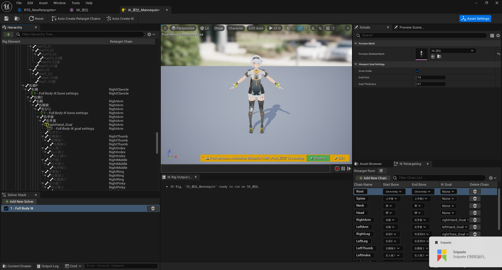

创建IK Retargeter.

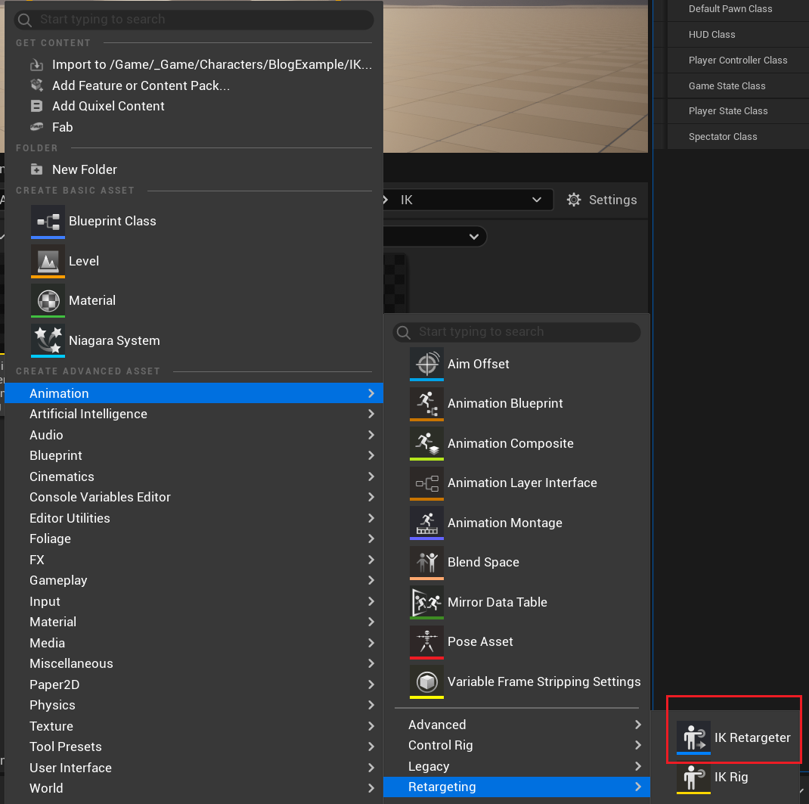

并将源骨骼设置为UE标准骨骼，即动画素材所使用的骨骼；将目标骨骼设置为你想要的角色。

并进去姿态编辑状态，这里可以选择源骨骼，并自动对齐所有骨骼。

随后根据需求，对齐出现明显偏差的骨骼。例如角色离地、脚的角度等。

## 初步重定向
随后点击一个asset预览其动作：

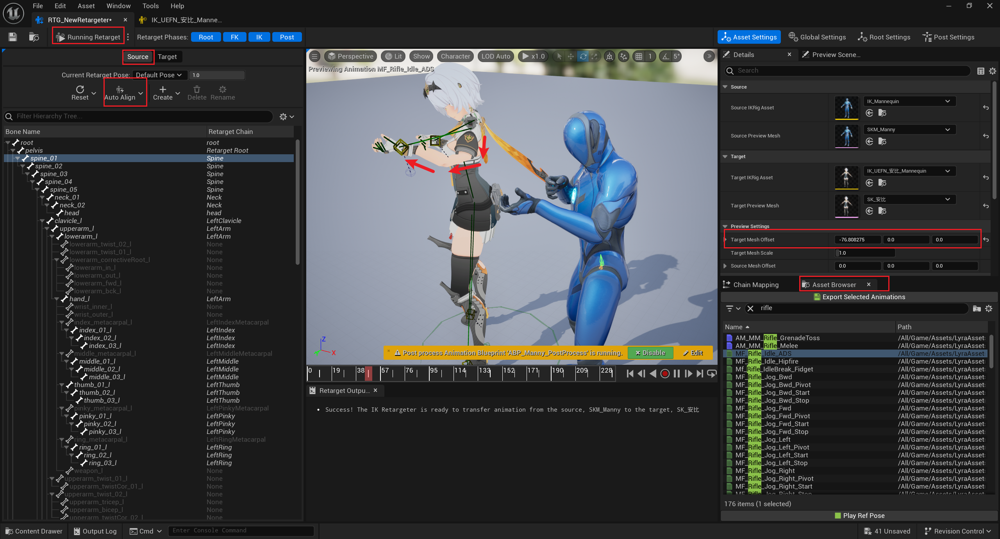

从结果上看，整体姿态没有问题，但是手臂出现了两个关节。

这是因为MMD骨骼导入时，层级关系是错误的。

我们点击Skeleton，回到骨骼界面，分析手臂骨骼：

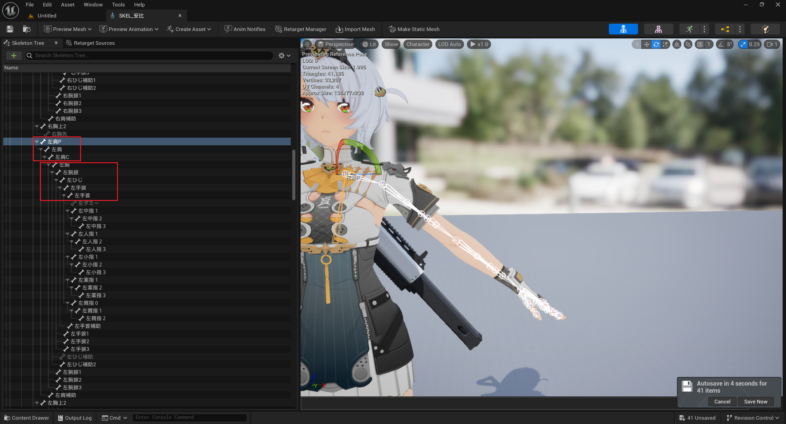

我们发现，该骨骼的肩部有三根骨骼，而标准的UE骨骼只有一根；该骨骼的手臂有五根，在大臂、小臂处额外出现了两根，而标准的UE骨骼是三段式的。

这也就解释了为什么在重定向时，手臂会出现三节小臂，因为在定位时，用到了五根。

## 最简单的解决方法
为了避免多余产生的两个骨骼发挥作用，我们回到IK Rig，为多余两根骨骼增添IK设置，将XYZ的旋转全部Locked.

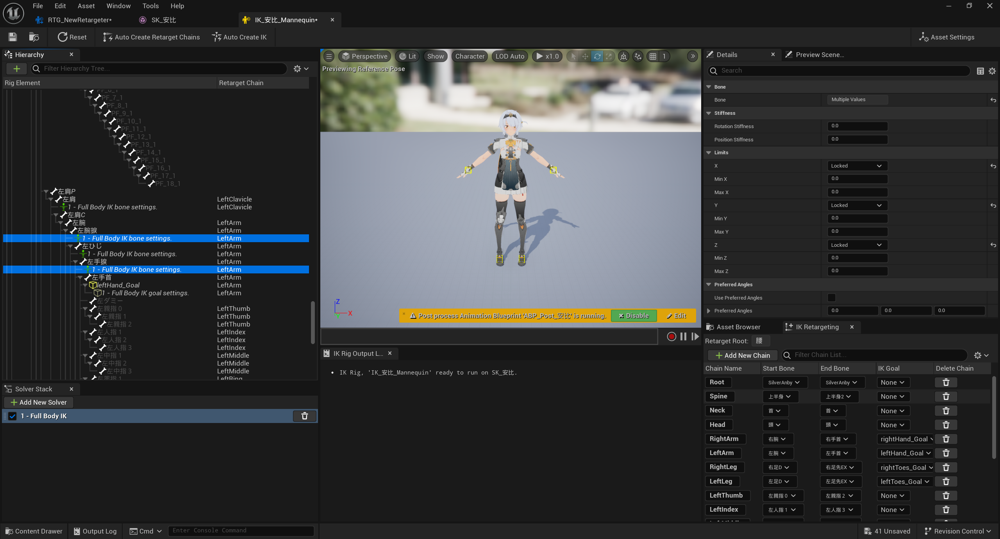

随后进入RTG，将手臂部分Chain的Rotation Alpha设置为0.

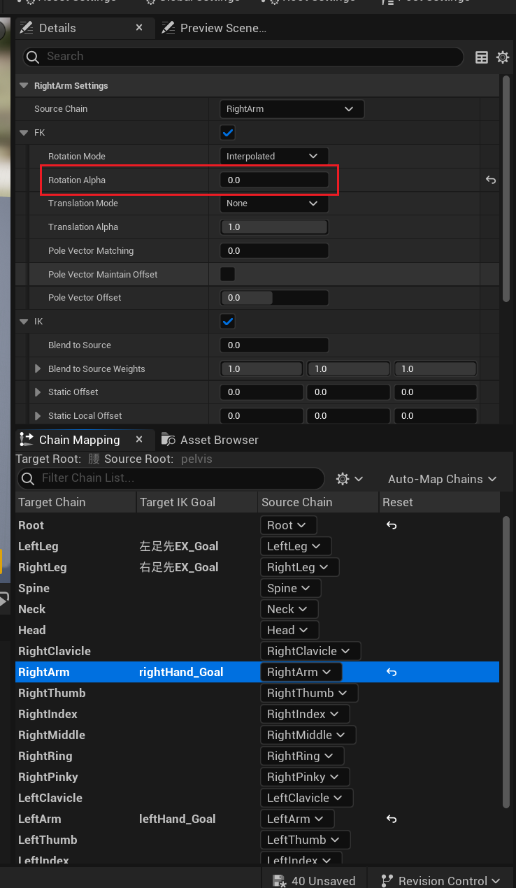

当然，你还需要根据自己的需要调整Pose，调整映射关系等，最后的结果为：

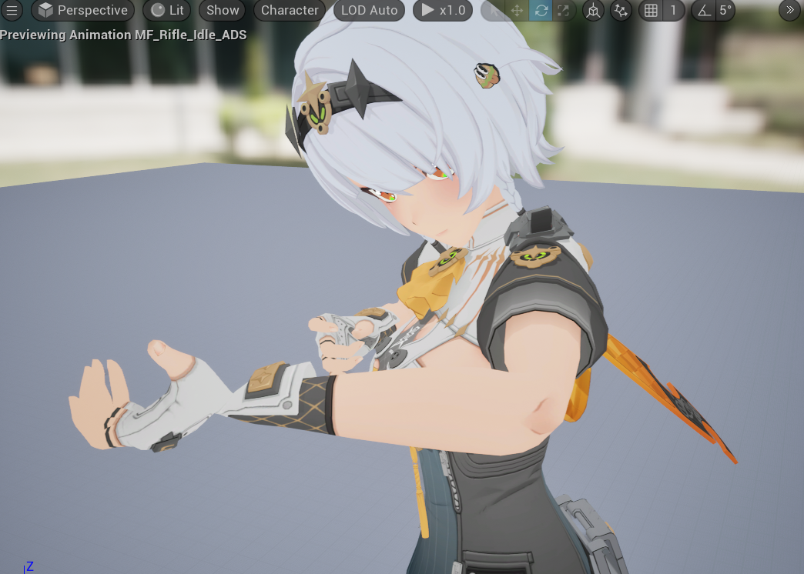

手臂已经表现非常正常，但是在手腕处还有些问题。

## 总结
这类处理方法，能够在不更改骨骼的情况下，产生能看的结果，但是如果你需要使用一些IK节点或者有其他更精细的需求，这类方法是不足以发挥作用的。

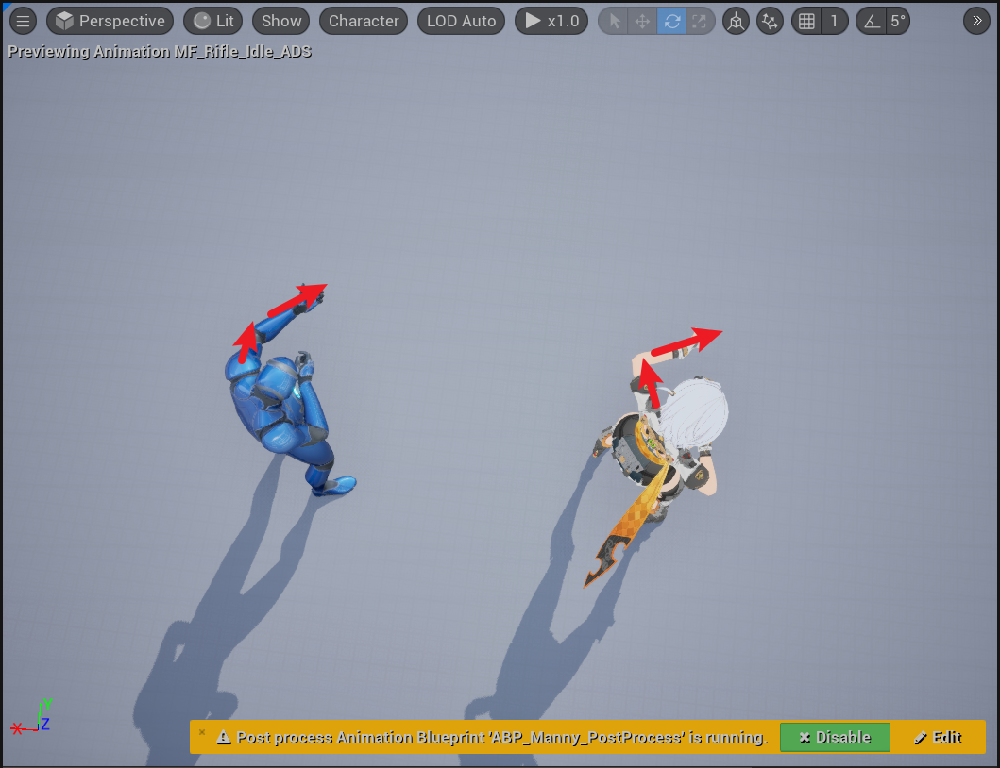

我们可以发现，在手臂朝向上，原动画与重定向后的动画有较大的区别，一旦涉及到手部IK的情况，将非常痛苦。

~~痛苦到，我琢磨这种情况的手部IK，琢磨一周毫无进展，手就是不在枪上。。。~~

# 精细动画
既然骨骼有问题，我们理应修改骨骼的层级关系。

## 骨骼修改
骨骼修改有许多方式，在这里我们使用UE的一个插件，当然，你完全可以使用Blender等更专业的软件。

但对于简单的操作，插件完全可以胜任。

### 肩
- 将左右肩移动至左右肩P的父级下，即左右肩与左右肩P同级。
- 删除左右肩P.
- 将左右腕移动至左右肩下，即左右腕与左右肩C同级。
- 删除左右肩C.

最终得到一个单独的肩骨骼。

### 手臂
- 将左右ひじ移动至左右腕下。
- 将左右手首移动至左右ひじ。

### 腿部
如果有需要，你也可以针对腿部进行层级关系修改。

### 结果
修改后的手臂骨骼如下：
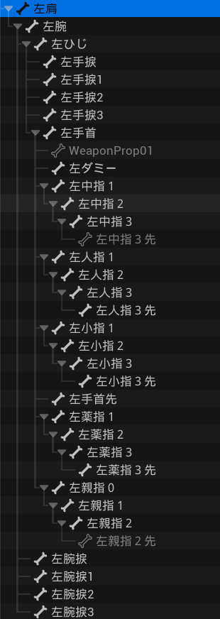

骨骼修改为三段式，而带有 捩 的骨骼，是负责手臂扭曲效果的，有权重，需保留。

## IK Rig
既然修改了骨骼，那么需要自己重新设置IK Rig，我的设置如下：

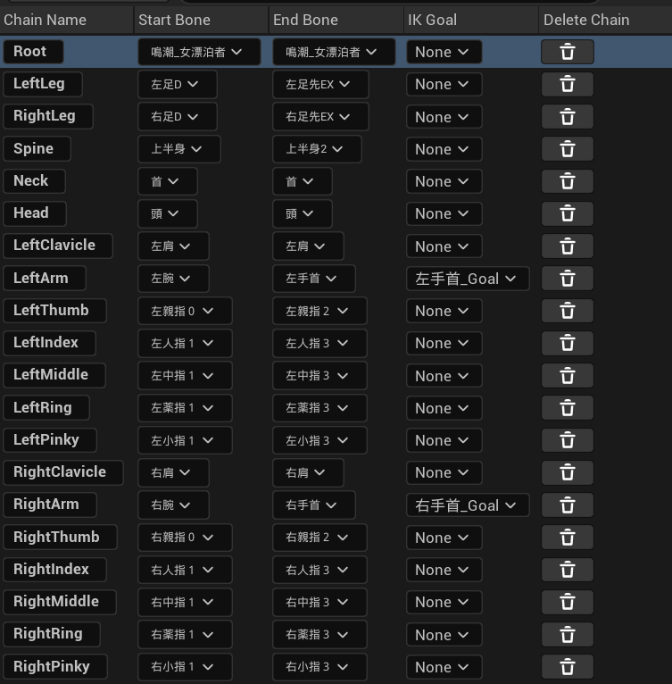

## Retarget设置
在重定向前，如果原始素材启用了Forced Root Lock，需要把它关闭，否则IK可能失效。

- 将Root Chain设置Globally Scaled，确保根骨运动。
- 调整Pose：
  - 保留目标腿部骨骼不变(IK Bone方便)，针对源骨骼自动对齐，并自行调整。
  - 目标手部骨骼更改，将其改为T-Pose，并同步修改源骨骼。
  - 调整其他部位

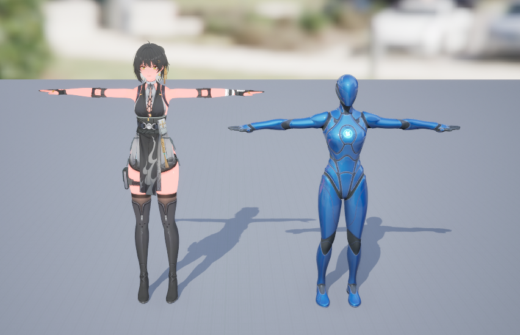

即可进行重定向。

## IK Bone
如果你有IK需求，那么自然你需要IK Bone也发生移动，此处是方法：

- 点击Post Settings，使用Pin Bone.
- 填入你需要复制的信息。

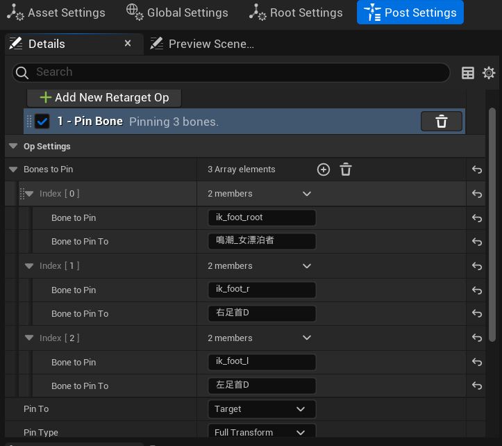
此时你可以完成IK Bone的运动，便于后续使用。

## Weapon Bone
既然涉及到高精度的动画，有时角色手里可能需要拿一些东西，如果单纯在手掌部分增加Socket来绑定持有物品的Mesh，很难在动画上取得比较好的效果。

例如武器本身的朝向可能会随着动画而改变，但很多时候我们重定向的动画始终有偏差。

- 如果我们调整Socket，使得在某一动画有较好的效果，但往往在另一段动画表现很差，你不可能不停地增加Socket解决；
- 如果我们调整手臂来适应武器的旋转，一方面对于像我这种对动画一窍不通的人而言，这个工作量相当大，另一方面，这也与原动画效果不符。

所以我们需要在手中部分增加一个不影响Mesh的骨骼，此处我增加了weapon_r.

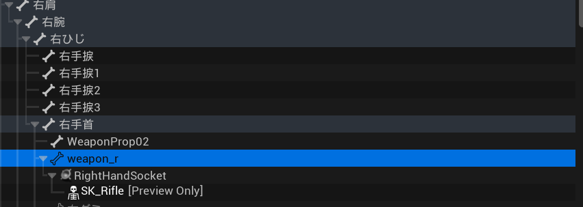

将枪械的Socket添加到武器骨下，这样在修改枪械朝向时，我们不用修改Socket，而是为动画序列增加武器骨的关键帧。
