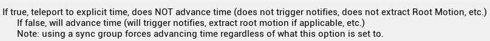
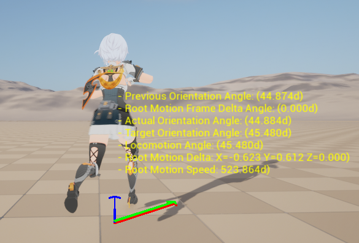

# 问题解决流程

## 动画素材检查

起初，我怀疑在重定向动画前，原素材未启用 **Root Motion** 或启用了 **Force Root Lock**。

随后我尝试重新重定向动画，再次设置素材，没有任何变化。

---

## Orientation Warping 节点

### Orientation Warping 介绍

**Orientation Warping** 是 Unreal Engine 动画蓝图中的一种 **姿态扭曲（Pose Warping）技术**，它可以根据角色的移动方向动态调整骨骼的朝向，使原本只适用于向前奔跑的动画也能自然地应用于各个方向。

开发者就可以通过四向前进动画实现 360° 移动时的自然身体旋转。

在传统动画系统中，如果角色需要在不同方向上奔跑，通常需要为每个方向单独制作动画。但使用 Orientation Warping 后，可以在运行时根据角度对角色骨骼（通常是 Spine）进行扭曲，以适应移动方向。

在 Orientation Warping 中，无论采用哪种模式，都将最终使用一个叫 **Orientation Angle（float）** 的数据，作为调整骨骼朝向的依据。

根据不同的 Mode，Orientation Angle 有不同的获取来源。

---

#### **Mode**

Orientation Warping 有两种 Mode：

**1. Manual Mode**

在该模式下，用户需要直接提供已经计算完成的 Orientation Angle（float）。

**2. Graph Mode**

在该模式下，用户可以提供两类信息：

- **Locomotion Direction**：`FVector` 类型的数据，是 Character 在世界坐标系下的移动方向；该节点会根据该数据自动计算 **Locomotion Angle**。
- **Locomotion Angle**：`float` 类型的数据，一般由 Character 的移动方向与 Actor Rotation 计算得到，可以使用 **Calculate Direction** 来计算。

两个数据，提供一个即可；当节点得到 Locomotion Angle 后，会计算与 Root Motion Angle 的差值，得到 **Orientation Angle**，调整骨骼。

---

### 修改输入变量

我使用了 **Graph Mode**。

我怀疑我错误地计算了 **Locomotion Angle**；因为在发现这个问题之前，我在实现转身模块，该模块会在 Idle 状态积累 CharacterRotation 旋转角度，并通过 **Rotate Root Bone** 旋转 Mesh；在运动状态下，通过弹簧插值，恢复角色朝向。

**Start 状态**有可能处在恢复状态，此时 LocomotionAngle 会与实际方向错位。

所以需要更新 Locomotion Angle 的数值，应减去 **Root Yaw Offset**。

我以为是这一步出错了，检查了接口、实时数据，也取消了 Offset，均无效。

随后我开始尝试计算 Locomotion Direction，让节点自己算 Angle，无效。

随后我改为 **Manual Mode**。

并计算 Locomotion Angle 与 Root Motion Angle 的差值，在 **Cycle 正常**，在 **Start / Stop** 还是无效。

因为 Root Motion 始终为 `ZeroVector`。这说明动画实际上并没有发生根位移。

---

## 单独测试动画

我单独创建了新的角色蓝图与动画蓝图，在动画蓝图部分只设置 Start 动画与固定 Locomotion Angle 的 Orientation Warping，结果显示该情况下，Orientation Warping 运行正常。

这再一次说明，动画素材本身没有问题，还是蓝图的问题。

我回顾了，该条件与 Start Layer 的不同，似乎只有 **Sequence Evaluator 与 Sequence Player** 有区别。

---

## Sequence Evaluator 与 Sequence Player

### Sequence Player

`Sequence Player` 节点是动画蓝图中最常用的动画播放节点之一。它会从头开始以设定的播放速率连续播放一个指定的动画资产（Anim Sequence），并随着动画时间推移自动推进动画状态。

**主要特点：**

- 支持循环（Looping）播放；
- 支持播放速率控制；
- 支持动画通知（Anim Notifies）触发；
- 与状态机（State Machine）结合使用时非常常见。

**适用场景：**

- 连续的移动、攻击等动作；
- 角色的正常动画循环控制。

---

### Sequence Evaluator

`Sequence Evaluator` 节点用于**评估动画在某一个具体时间点的姿态（Pose）**，而不会播放动画。

**主要特点：**

- 仅根据设置的 “Explicit Time” 参数评估并输出当前姿态；
- **不自动推进时间**（除非手动设置 Explicit Time）；
- 可选 **“Teleport to Explicit Time”** 用于跳过插值、瞬间跳转到该帧；
- 常用于姿态混合、特定帧采样或基于时间控制的系统。

**适用场景：**

- 精确控制动画采样（如根骨提取）；
- 自定义 blend pose 系统；
- 动作采样器（Pose Sampler）或时间轴驱动的动画。

---

### 结果

事实上，**Cycle Layer 与 Start / Stop Layer 的区别**，也有使用 Sequence Evaluator 与 Sequence Player 的区别。

在 **Cycle Layer**，使用的是 **Sequence Player**，因为我们通过 Stride Warping 与合理的 Movement 参数设置，就不会出现滑步的情况；在 **Start / Stop Layer**，由于速度变化快，且有一段时间速度很小，所以需要进行更精确的控制，采用的方案是设置 Distance Curve，实时根据角色的移动距离，匹配动画序列的播放时间，所以使用 **Sequence Evaluator**，该节点能按帧控制动画。

我仔细查看了 Sequence Evaluator，发现了一个不太了解的设置：**Teleport to Explicit Time**。

该设置解释如下：

总结起来：**是否瞬间跳转到指定的时间，而不是通过时间插值前进**。

例如启用时，当下一帧动画应该从第 15 帧转到第 20 帧时，是否需要插值。

默认启用的情况下，动画不进行插值，而是离散地跳转。

它中断了动画的“时间连续性”和运动趋势。

所以很有可能是该选项导致的，我取消了该选项后，表现恢复正常。

---

PS：其实这一部分内容我之前是做过一次的，回看当时的仓库居然鬼使神差地取消了该属性，我想当时第一次做，看得仔细，便避免了这个错误，现在第二次做，以为熟练了，结果忽视了这个问题。
