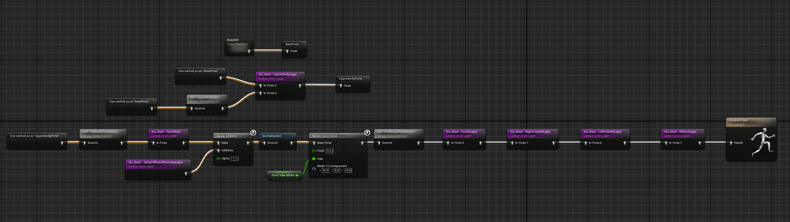
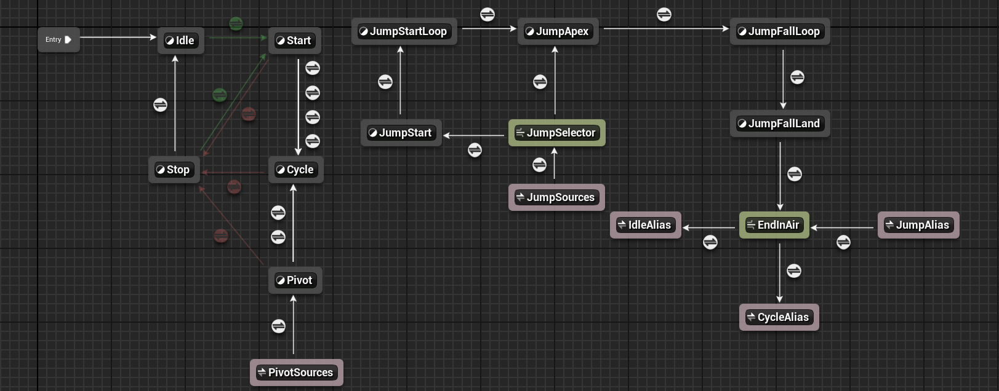
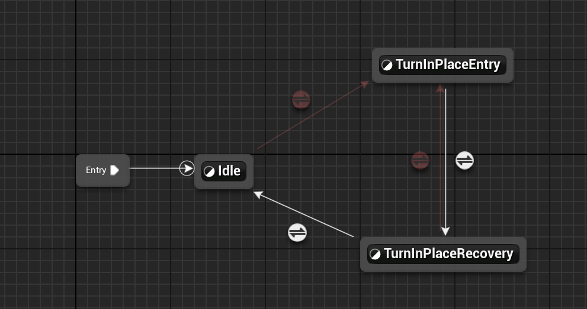
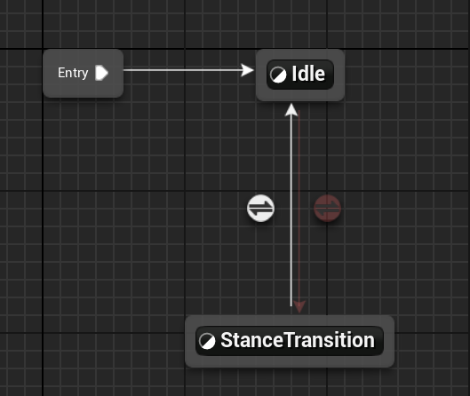
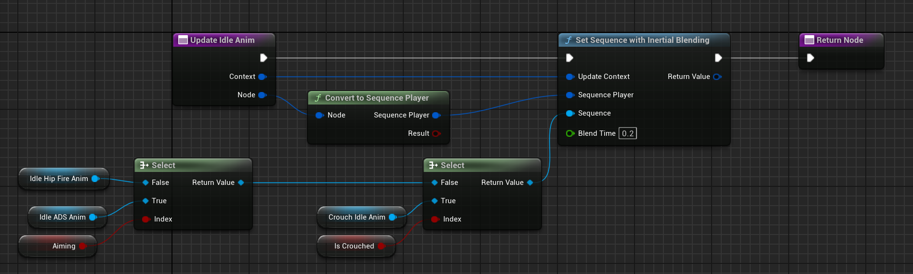
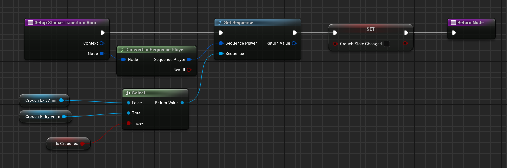
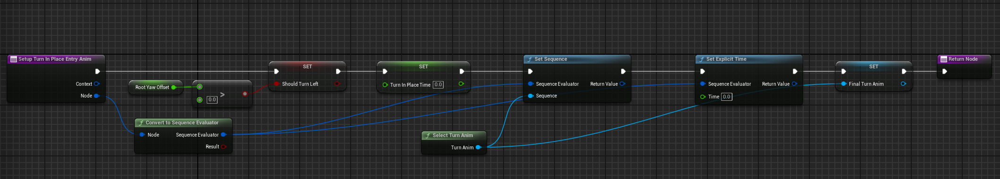
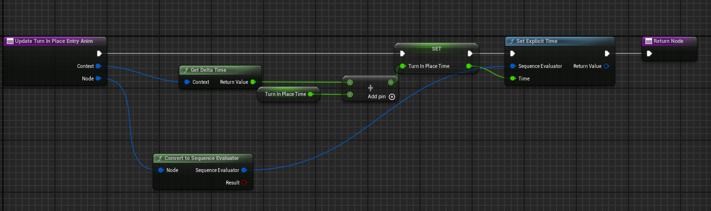
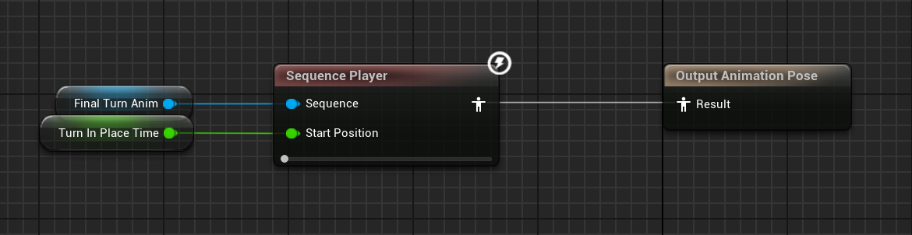
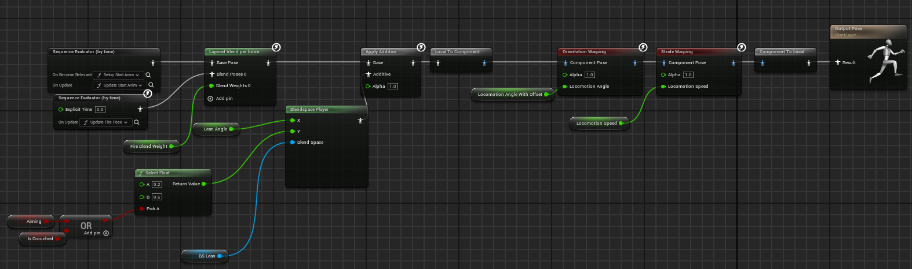

---
title: "WutherField: Building a Multiplayer TPS Control Game in Unreal Engine"
description: ""
date: "2026-04-08 14:58:24"
category: "Unreal / Gameplay"
originalCategory: "Unreal / Gameplay"
track: "Game Development"
level: foundation
status: draft
published: false
minutes: 7
order: 1000
prerequisites: []
tags: []
source: "_posts"
---## 整体介绍
这是一款第三人称英雄射击PVP游戏，其游戏模式为占领模式。

玩家可以选择两名角色——分别具有不同的主武器、被动技能与两个主动技能——参与作战，尝试占领地图中的四个得分点，依靠击杀得分、占领点累积得分获取胜利。

### 游戏流程
点击游戏进入主菜单，可设置房间人数并创建房间，或点击加入房间搜索并加入游戏。

成功创建房间或加入他人房间后进入大厅等待界面；当大厅人数足够时，可选择、确认角色；当所有玩家确认角色后，进入战斗地图。

战斗结束后断开连接，回到主菜单。

### 角色介绍
#### Rover
Rover使用的主武器为步枪，并具备一套突击性质的技能组。

当Rover完成一次击杀后，会刷新其小技能；

Rover的小技能为一段四向冲刺，且冲刺过程中仍可改变一定的移动方向；

Rover的大招能够使得武器在一定时间内射速翻倍，并可以通过击杀延长该技能的持续时间。

#### Phoebe
Phoebe使用的主武器为狙击枪，并具备一套架点性质的技能组。

Phoebe的狙击枪子弹具有爆炸效果；每当Phoebe或其所属物造成伤害时，Phoebe将叠加一层被动，提升爆炸的范围与伤害，该被动每10s消耗一层，若Phoebe及所属物造成伤害将刷新持续时间。

Phoebe的小技能，将消耗三层被动，并召唤一个探测所属物，该探测所属物将标记附近敌人，使得Phoebe及右方可以透视受影响的敌人；该召唤物具有100点生命值，可被破坏；单个Phoebe最多召唤一个探测道具。

Phoebe的大招为Phoebe投掷出一个自动开火道具，该召唤物将检索周围最近的敌人，若命中确定，将尝试进行5s的持续打击，随后进入5s冷却，以此循环；受锁定的敌方单位，脱离攻击范围或寻找掩体，即可避免伤害。

### 得分机制
率先取得200分的队伍获胜。

#### 击杀得分
当击杀一名敌方角色，击杀者所在队伍获得一分。

#### 占领得分
地图中的占领点，具有三个状态：中立、红队占领、蓝队占领。

占领点的占领情况，可以通过占领进度条了解。
- 当占领点字母标识为白色时，代表该占领点处于中立状态，不会为任何队伍加分。
- 当占领点字母标识为红色时，代表该占领点处于敌对状态，为敌方队伍加分。
- 当该占领点字母标识为绿色时，代表该占领点属于右方，为我方队伍加分。

占领需要玩家累积得分，占领点的占领进度可由圆形进度条了解。
- 占领点中队伍人数处于优势的一方，将持续累积该占领点的占领进度（或减少对方的占领进度）。
- 当占领点被一方占领时，若想重新成为中立状态，必须将该占领点已有占领进度全部清零。
- 当占领点中存在多个队伍的人，将在标识下方显示进度条展示敌我数量；若数量相等则不会修改占领进度。

#### 游戏进度
战斗双方得分可在屏幕中上位置的进度条实时获取，且可以依据BGM粗略获取游戏阶段：当游戏中首次得分、首次获取25%得分、首次获取80%得分时，将切换BGM.

## Animation Layer
本项目使用动画层接口管理方式。

### 基本概念
在复杂角色动画系统中，Animation Layer可以理解为将角色动画按照功能职责拆分成多个独立的模块，每一层只复制一类动画逻辑。

好处是，不需要把所有动画都写在一个Graph里，而是拆分成多个功能层，分别处理不同类型的动画。

Animation Layer的设计可以概括为3点：
1. 职责分离：不同Layer之间不直接耦合。
2. 分层叠加：最终的角色动画不是来自某一个Layer，而是多个Layer按一定规则叠加的结果。
3. 可替换：每一层都可以替换，例如不同的武器，不同的状态，都能使用Layer做替换。

### ABP_BaseAnimInstance

`ABP_BaseAnimInstance` 作为所有角色动画的基类，其主要职责是数据汇总和逻辑调度，他不会参与展示具体的动作，而是构造一套通用的流水线。

通过这套流水线，开发者能够针对未来更多角色快速构建新的独特动作组，而不需要每次都从零开始写角色动画逻辑。

#### BaseSM

`BaseSM`决定了当前角色的核心状态，包含Ground Locomotion与Jump&Falling:
- Idle: 状态机的入口点，角色静止时的表现。
- Start: 当玩家开始移动时，短暂的起步动画。
- Cycle: 循环跑、走、下蹲运动状态。
- Stop: 当玩家停止移动时，带有关系的刹车动画。
- Pivot: 近180°加速度朝向改变时，转向过渡。
- JumpStart/JumpStartLoop: 角色离开地面与上升初期。
- JumpApex: 角色跳跃到顶点时，重力与速度平滑的瞬间。
- JumpFallLoop: 下落循环。
- JumpFallLand: 落地缓冲动画。
- EndInAir: 无论是空中下落到地面，还是在跳跃过程中落地，都会依据水平速度来确认进入Idle还是Cycle.

### ALI_Base
Animation Layers是实现角色表现差异化的核心工具。它们通过“接口”的形式，将 BaseSM 中的状态逻辑与具体的动作表现解耦。

`ALI_Base`定义了这些接口：
- IdleLayer: 处理角色静止时的待机动画。
- CycleLayer: 处理移动循环动画。
- StartLayer: 起步动画。
- StopLayer: 止步动画。
- PivotLayer: 转向动画。
- JumpStartLayer: 起跳瞬间的蹬地和腾空姿态。
- JumpStartLoopLayer: 上升过程中的持续动作。
- JumpApexLayer: 到达最高点时的短暂悬停或翻滚表现。
- JumpFallLoopLayer: 长时间下落过程中的动作表现。
- JumpFallLandLayer: 接触地面时的受力冲击表现。
- JumpFallLandRecoveryLayer: 落地后恢复到正常运动姿态的过渡动画。
- AimOffset: 处理视线与角色、枪口朝向一致。
- UpperBodyLayer: 混合基础Locomotion动画有与上半身动画。
- RibbonLayer: 处理飘带与衣物物理模拟的动画。
- FootIKLayer: 足部IK.
- LeftHandIKLayer: 左手稳固握住枪杆。
- RightHandIKLayer: 开火或瞄准时，通过右手武器骨进一步修正武器朝向。

其余Layer为废弃的接口。

### ABP_FR
我将以Rover的动画蓝图为例，介绍各个接口的具体实现。

#### IdleLayer
`IdleLayer`由一个IdleSM组成，主要是为了做好站立、下蹲时的静止与转向动画。

在`ABP_BaseAnimInstance`中，`IdleLayer`直接与`BaseSM`中的`Idle`连接。

##### Idle
由状态机 `IdleWithCrouchSM` 实现：

其中`Idle`是一个`SequencePlayer`，设置了`OnUpdate`函数，`UpdateIdleAnim`：

依据瞄准状态与下蹲状态选择Idle动画。

站立下蹲时需要过渡动画，当程序传递`CrouchStateChanged`信号到该SM时，该SM会进入状态过渡：

`A` `B`状态完全一致，均由`OnBegin`绑定的`SetUpStanceTransitionAnim`函数决定过渡动画：

由当前下蹲状态决定下蹲与站立间的过渡动画选择。

当transition没有完全完成时，若玩家再次切换，则会在`A` `B`间来回切换。

##### TurnInPlaceEntry
`TurnInPlaceEntry`由一个`SequencePlayer`控制，并绑定了两个函数。
- `OnBegin`: 绑定`SetupTurnInPlaceEntryAnim`.
- `OnUpdate`: 绑定`UpdateTurnInPlaceEntryAnim`.

包含方向判定，时间重置，与动画选取三个步骤。其中动画选取会依据站立下蹲状态、选择朝向、Yaw偏移来选择动画。

累积帧间隔时间，更新动画进度。

通过`Update`函数手动推动时间，结合C++中的`ProcessTurnYawCurve`，系统可以根据动画曲线（TurnYawCurveValue）逐帧计算出角色的脚部旋转了多少度，并立即通过`Rotate Root Bone`进行等量反向补偿。

此外，后续还可以依据玩家旋转的急迫程度，动态调整旋转速度。

##### TurnInPlaceRecovery

继续播放剩余动画。

#### StartLayer

`StartLayer`通过两个评估器（Evaluator）实现了姿态的叠加：
- `Base Start Evaluator`: 绑定了`SetupStartAnim`和`UpdateStartAnim`。
- `Fire Pose Evaluator`: 这是一个辅助评估器，通过`UpdateFirePose`实时更新。它允许角色在起步的过程中，依然保持武器射击姿态的连贯性，解决了“跑打”切换时的违和感。
