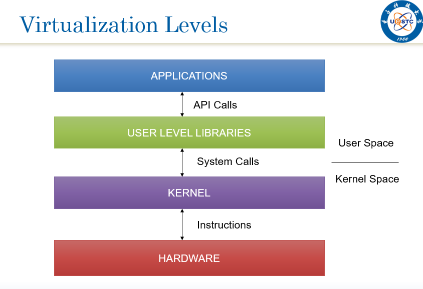
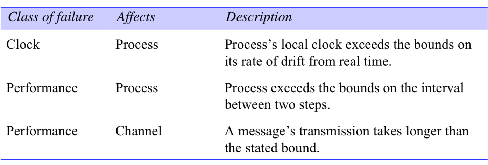

# 分布式系统第一章
## 为什么需要分布式系统
- 功能分离。
- 固有的分布性。
- 负载均衡。
- 可靠性。
- 经济性。

## 分布式系统的目标
- 资源共享
  - 一些计算机通过网络连接起来，并在这个范围内有效地共享资源。
  - 硬件、软件、数据、服务的共享。
  - 媒体流的共享。
- 协同计算
  - 并行计算。
  - 分布式计算。

## 分布式系统的特点
- 并发性：一些程序（进程、线程）并发执行，共享资源。
- 无全局时钟：每个机器有各自的时间，难以精确同步，程序间的协调靠消息交换。
- 故障独立性：一些进程出现故障，并不能保证其他进程都能知道。

## 分布式系统举例
- web搜索
- 大型在线多人游戏
- 金融交易
- 区块链系统
- 语音系统
- 数据库系统
- AI大规模训推

## 分布式系统面临的挑战
### 异构性
网络协议、硬件、操作系统、编程语言、开发者实现方式的不同。

- 中间件：应用到软件层，用来屏蔽底层的异构性。
- 移动代码
  - 在不同的机器上移动并执行，需要解决异构问题。
  - 虚拟机运行在不同的机器或系统上，代码在虚拟机执行。

### 开放性
- 一个系统是否可以扩充，或以不同的方式重新实现。
- 分布式系统的开放性：在多大程度上新的资源共享服务可以加到系统中来。
- 关键：公开接口。

### 安全性
- 机密性：防止未经授权的个人访问资源。
- 完整性：防止数据被篡改和破坏。
- 可用性：防止对所提供服务的干扰。

### 可伸缩性
系统规模扩展后，无论是用户还是资源，系统的性能保持在一定水平。
- 控制物理资源的代价。
- 控制性能损失。
- 控制软件资源被耗尽。
- 防止性能瓶颈。

### 故障处理
- 检测故障
- 屏蔽故障
- 故障容错
- 故障恢复
- 冗余策略

### 并发
- 正确性：多个进程并发访问共享资源，要保证被访问数据的正确性，不能出现不一致。
- 性能：多个并发操作保证性能。

### 透明性
- 访问透明：使用同样的操作去访问本地资源和远程资源。
- 位置透明：访问资源时，不需要知道资源的位置。
- 并发透明：几个进程同时访问共享资源，互不干扰。
- 复制透明：使用多个资源的副本来提高可靠性和性能，用户或应用程序开发人员并不需要了解副本技术。
- 故障透明：在存在故障的情况下，用户和应用仍可完成他们的任务。

# 分布式系统第二章
## 分布式系统体系结构模型
一个系统的体系结构是用独立指定的组件以及这些组件之间的关系来表示的结构。

- 整体目标：确保结构能够满足现在和将来可能的需求。
- 关注系统的可靠性、适应性、可管理性和性价比。

## 体系结构元素
体系结构元素：分布式系统的基础构建块。
### 通信实体
- 面向系统的角度：进程、线程、节点。
- 面向问题的角度：
  - 对象：给定问题领域的自然单元。
  - 组件：对象+需要的接口。
  - Web服务：经常跨越组织边界。

### 通信范型
- 进程间通信：相对底层的支持。
- 远程调用：最常见的通信范型，双向交换。
  - 请求-应答协议
  - 远程过程调用(RPC)
  - 远程方法调用(RMI)
- 进程间通信与远程调用的限制
  - 空间耦合：发送者需要知道接收者。
  - 时间耦合：发送者和接收者同时存在。
- 间接通信：时间空间解耦合
  - 组通信：一对多通信范式。
  - 发布-订阅服务。
  - 消息队列。
  - 分布式共享内存。
  - 元组空间。

### 角色及责任
- 客户-服务器结构
  - 历史上最重要的结构，现在仍在被广泛使用。
  - 优点：简单直接。
  - 缺点：伸缩性差，系统的伸缩性不会超过所提供服务的计算机的能力和该计算机所处网络连接的带宽。
- 对等体系结构
  - 普通节点已具备一定能力，且多数具备随时可用的带宽。
  - 挖掘普通节点的能力可以提高系统的服务能力。
  - 目的：可用于运行服务的资源随用户数目的增加而增加。
  - 特点：
    - 系统应用中，完全由对等进程组成，进程间的通信模式完全依赖于应用的需求。
    - 管理难度大：节点动态性、路由、QoS、安全。

### 放置
放置是指对象或服务等实体如何映射到底层物理分布式设施上。
- 服务器组：
  - 将不同的服务对象放在不同的机器上实现。
  - 在多个主机上维护副本服务。
- 缓存：
  - 在本地或代理服务器上保存最近使用的数据。
  - 减少不必要的网络传输，减少服务器负担，还可以代理其他用户透过防火墙访问服务器。
- 移动代码：将代码下载到客户端运行，可以提高交互效率。
- 移动代理：
  - 在网络上的计算机之间穿梭并执行代码，代替一些机器执行任务。
  - 和移动代码比较：移动代码是传递代码，而代理是传递数据。
  - 和远程调用比较：松耦合、数据传输少、通信开销低。

## 体系结构模式
体系结构模式：构建在体系结构元素上，提供组合的、重复出现的结构。

### 分层体系结构
一个复杂的系统被分成若干层，每层利用下层提供的服务。

在分布式系统中，等同于把服务垂直组织成服务层。

- 最底层的软硬件为上层提供服务。
- 中间件：中间件是一种软件，它提供基本的通信模块和其他一些基础服务模块，为应用程序开发提供平台。

### 层次化体系结构
与分层体系结构互补，是一项组织给定层功能的技术。

### 瘦客户
本地是轻量级GUI，应用程序在远程计算机上执行。

## 基础模型
对体系结构模型中公共属性的一种更为形式化的描述。

### 交互模型
- 分布式由多个以复杂方式进行交互的进程组成。
- 进程之间通过消息传递进行交互，实现系统的通信和协作功能。
- 两个对进程交互有影响的因素：
  - 通信性能
  - 难以维护全局时钟

#### 通信通道的性能
- 延迟：第一个比特流从出发到到达目的节点在网络中所花费的时间。
- 带宽：在单位时间内，网络上能够传递的信息的总量。
- 抖动：传递一系列信息所花费时间的变化值。

#### 计算机时钟
每台计算机具有自己的独立内部时钟。

计算机时钟和绝对时间存在偏移：
- 时钟偏移率：计算机时钟偏移绝对参考时钟的比率。
- 时钟矫正方法：ntp，GPS时钟同步。

#### 分布式系统分类
依据 是否对时间有严格限制的假设 ，将分布式系统分为两类：
- 同步分布式系统：有严格时间限制的假设。
  - 进程执行每一步的时间都有明确的上、下限。
  - 每个在网络上传输的消息可在已知的时间范围内接收到。
  - 每个进程的局部时钟相对时间时钟的偏移在已知范围内。
- 异步分布式系统：无严格时间限制的假设，非常常见。
  - 进程的每一步的可能需要任意长时间。
  - 收到消息的等待时间可能是任意长的。
  - 局部时钟的偏移率可能是任意的。
  - 异步分布式系统达成协议非常困难。

### 故障模型
计算机或网络发生故障，会影响服务的正确性。

故障模型的意义在于将定义可能出现的故障的形式，为分析故障带来的影响提供依据；设计系统时，知道如何考虑容错的需求。

#### 遗漏故障
进程或者通信通道没有正常工作。
- 进程遗漏故障：进程崩溃
  - 在同步系统中通过时限时可以检测出来的。
  - 在异步系统中，即使很长时间没有收到来自某个进程的消息，也不能判断进程停止了。
- 通信遗漏故障：丢失信息
  - 发送丢失
  - 接收丢失
  - 通道丢失
  - 丢失故障是良性故障。
  - 通信故障不可能达成协定。

#### 随机故障
随即故障是对系统影响最大的一种故障形式，而且错误很难探知。

- 进程中的随机故障：随便遗漏应有的处理步骤或进行了不应有的处理步骤。
- 随即故障很少出现在通信信道。

#### 时序故障
仅仅发生在同步分布式系统中：

#### 屏蔽故障
分布式系统中每个组件通常基于其他一组组件来构建，利用存在故障的组件构建可靠的服务是可能的，但组件间的通信需要保证：
- 有效性：在发送端缓冲区的消息最终能够到达接收端的缓冲区。
- 完整性：接收到的消息和发送的消息完全一样，没有消息被发送两次。

### 安全模型
分布式系统的模块特效与开放性，使得它们暴露在内部与外部的攻击之下。

安全模型的目的是提供依据，以此分析系统可能受到的侵害，并在设计系统时，防止侵害的发生。

分布式系统的安全性：
- 进程的安全性
- 通信通道的安全性
- 对象的安全性
  - 保护对象的措施：
    - 访问权限：在对象的访问控制表中，规定什么人具有访问对象的权限。
    - 权能：用户持有的访问那些对象的权限。

#### 威胁
- 对进程的威胁
  - 对服务器：来自一个伪造实体的调用请求，如CSRF.
  - 对客户端：收到一个伪造的结果。
- 对信道的威胁
  - 拷贝消息，篡改或填充。
  - 保存并重发。
- DoS攻击：发出大量服务器请求，造成服务器过载不能提供服务，或者在网络上传输大量的消息，占用带宽，拥塞网络。
- 移动代码：恶意代码入侵系统。

#### 对策
- 加密信息和共享密钥。
- 认证：对发送方提供确认身份进行认证。
- 安全通道
  - 每个进程知道正在执行的进程所代表的委托方的身份。
  - 确保在其上传输的数据的私密性和完整性。
  - 每个消息包含物理和逻辑的时间戳。
