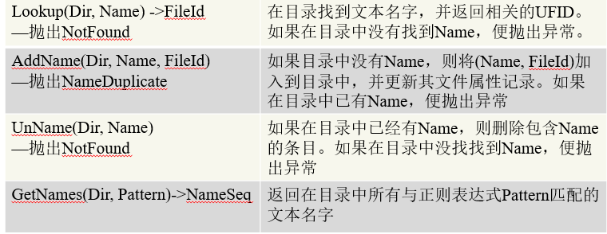
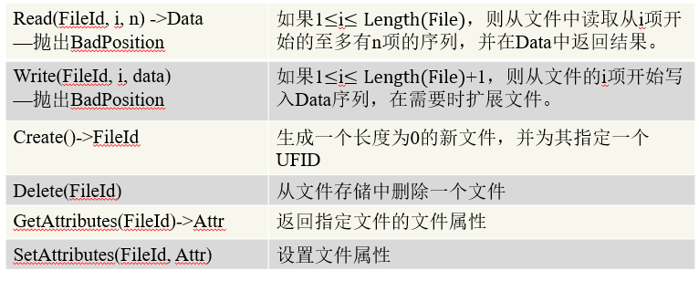
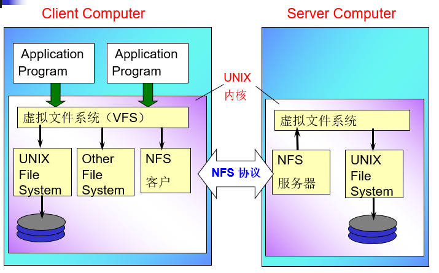
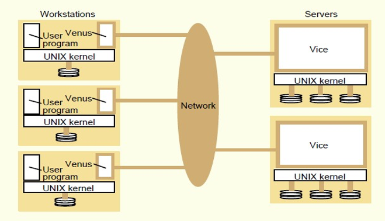
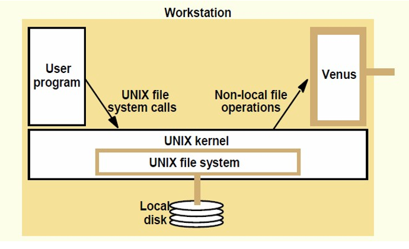
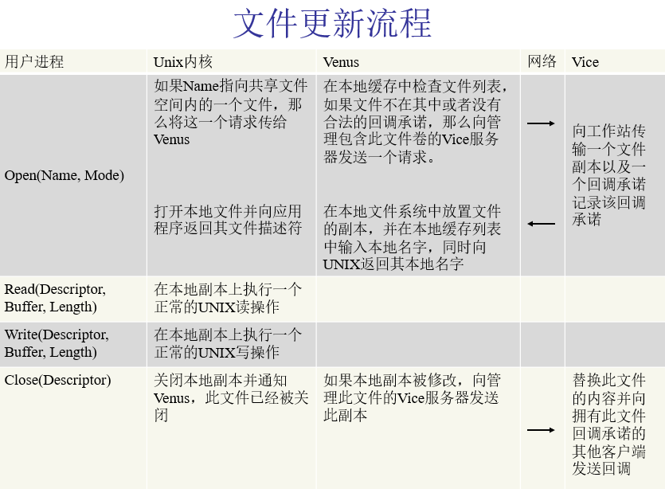

# 分布式系统第八章
## 基础概念
### 本地文件系统
文件系统提供文件的管理：
- 命名空间
- 文件操作的API
- 物理空间的存储管理
- 安全保护

### 层次化的命名空间
文件和目录

### 文件系统已被安装
不同的文件系统可以在同一个命名空间中。

### 文件系统模块
- 目录模块：将文件名与文件ID相关联。
- 文件模块：将文件ID与物理文件相关联。
- 权限控制模块：检查操作请求是否合法。
- 文件存取模块：读/写数据或者属性。
- 块模块：访问和分配磁盘块。
- 设备模块：磁盘I/O及缓冲。

### 传统的分布式文件系统
需求：
- 透明性：分布式文件系统应如同本地文件系统。
  - 访问透明性：客户无需了解文件的分布特性，通过一组文件操作访问本地/远程文件。
  - 位置透明性：客户使用单一的文件命名空间。
  - 移动透明性：当文件移动时，用户的系统管理表不用修改多个文件或文件卷，可以被系统管理员自由移动。
  - 性能透明性：负载在一个特定范围内变化时，系统可接受。
  - 伸缩透明性：文件服务可扩充，以满足负载或网络规模增长的需要。
- 并发的文件更新：并发控制，客户改变文件的操作不影响其他客户。
- 文件复制：分担文件服务负载，更好的性能和系统容错能力。
- 硬件和操作系统的异构性：接口定义明确，在不同操作系统和计算机上实现同样服务。
- 容错
- 一致性：单个拷贝更新语义，多个进程并发访问或修改文件时，它们只看到仅有一个文件拷贝存在。
- 安全性：客户请求需要认证，访问控制基于正确的用户身份。
- 效率：至少和传统文件系统相同的能力，并满足一定的性能需求。

## 文件服务体系结构
### 客户模块
- 运行在客户计算机上。
- 提供应用程序对远程文件服务透明存取的支持。
- 缓存最近使用的文件块提高性能。

### 目录服务
- 元数据管理。
- 创建或更新目录。
- 提供文件的文本名和平面文件结构中唯一文件标识的映射。

### 目录服务接口

### 平面文件服务

### 目录树
目录是一种特殊的文件，包含通过它访问的文件名和目录名。

## SUN网络文件系统
### NFS体系结构

### 虚拟文件系统
- 在UNIX内核的一个转换层
  - 支持挂载不同文件系统。
  - 不同文件系统可共存。
  - 区分本地和远程文件。
- 跟踪本地和远程可用的文件系统。
- 将请求传递到适当的本地或远程文件系统。

v节点
- 本地文件：引用一个i节点。
- 远程文件：引用一个文件句柄。

文件句柄：
- 文件系统标识符：服务器可能访问多个文件系统。
- i节点数：
  - 在一个特定的文件系统内是唯一的。
  - i节点数是用于标识和定位文件的数值。
- i节点产生数：
  - i节点在文件被删除后可被重用，每次重用时产生数+1.
  - 当i节点被回收时（i节点产生数变化），文件仍然打开，抛出异常。

客户与服务器之间传递文件句柄。

### 访问控制及认证
与传统UNIX文件系统不同，NFS服务器是无状态的。

在用户发出每一个新的文件请求时，服务器必须重新对比用户ID和文件访问许可属性，判断是否允许用户进行访问。

### 客户集成
用户程序可以通过UNIX系统调用访问文件，不需要重新编译或者加载库。

一个客户模块通过使用一个共享缓存存储最近使用的文件块，为所有的用户进程服务。

### 安装服务
每一个服务器上都有一个具有一直名字的文件，/etc/exports，包含了本地文件系统中可被远程加载的文件名。

客户使用mount命令进行远程安装，提供名称映射。

### 路径名翻译
NFS不进行路径名转换，需要由客户已交互方式完成路径名的翻译。

客户向远程服务器提交数个lookup请求，将指向远程安装目录的名字的每一部分转换为文件句柄。

### 客户缓存
为了减少传输给服务器的请求数量，NFS客户模块将read write getattr lookup readdir操作的结果缓存起来。

客户通过轮询服务器来检查它们所用的缓存数据是否是最新的。

基于时间戳的缓存验证：
- 缓存中的每个数据块被标上两个时间戳：
  - 缓存条目上一次被验证的时间。
  - 服务器上一次修改文件块的时间。
  - 当 当前时间-上一次验证时间 小于 间隔 时，或者本地缓存修改时间与服务器文件块修改时间一致，则不需要更新；
  - 否则从服务器获取服务器上一次修改文件块的时间，并进行比较。

减少服务器进行getattr操作：
- 当客户收到一个新的Tmserver值时，将该值用于所有相关文件派生的缓存项。
- 将每一个文件操作的结果同当前文件属性一起发送，如果Tmserver值改变，客户便可用它来更新缓存中与文件相关的条目。
- 采用自适应算法来设置更新间隔值t，对于大多数文件而言，可以极大地减少调用数量。

## AFS

AFS与NFS是兼容的。

AFS与NFS的区别是可拓展性，为了实现可拓展性：
- 整体文件服务：AFS服务器将整个文件和目录的内容都传到客户计算机上。
- 整体文件缓存：当一个文件或文件块被传输到客户计算机上时，他被存储到本地磁盘缓存中。

### 设计假设
- 大多数文件，更新频率笑，始终被同一用户存取。
- 本地缓存的磁盘空间大。
- 不支持数据库文件。
- 文件比较小，多数文件小于10KB.
- 读操作是写操作的6倍。
- 通常都是顺序存取。
- 大多数文件是被某一个特定的用户访问，共享文件通常是被某一个特定的用户修改。
- 最近使用的文件很可能再次被使用。

### AFS中的进程
AFS由两个软件组件实现，分别以UNIX进程Venus和Vice存在。
- Venus是运行在客户计算机上的用户进程。
- Vice是服务器软件的名字，是运行在每个服务器上的用户级UNIX进程。

### AFS中的文件
AFS中的文件分为本地的或共享的。
- 本地文件可作为普通的UNIX文件来处理，它们被存储在工作站磁盘上，只有本地用户可以访问它。
- 共享文件存储在服务器上，工作站在本地磁盘上缓存它们的拷贝。

### AFS系统调用拦截
UNIX修改版本内核截获那些指向共享名字空间文件的调用，将它们传递给Venus进程。

Venus进程会管理本地的文件缓存，当文件分区已满，并且由新的文件需要从服务器拷贝过来时，它将最近最少使用的文件从缓存中删除。

### 缓存一致性
回调承诺
- 管理该文件的Vice服务器发送一种标识，来保证当其他客户修改此文件时，通知Venus进程。
- 具有两种状态：有效、取消。
- 当Vice服务器执行一个更新文件请求时，它通知所有Venus进程将回调承诺标识设为取消状态。

客户的操作
- 打开文件
  - 若无文件或是文件的标识值为取消，Venus从服务器获得文件；
  - 否则，Venus不需要引用Vice，直接使用缓存的拷贝文件。
- 关闭文件
  - 当应用程序更新文件时，Venus刷新文件。
  - Vice顺序执行对文件的更新命令。
  - Vice通知所有的文件缓存设为取消状态。
- 当客户重启或者在时间T内没有收到回调信息，Venus将认为该文件已经失效。
- 可拓展性：客户与服务器之间的交互显著减少，提高了扩展性。

### 文件更新

#### 更新语义
- 缓存一致性目标：在不对性能产生严重影响的情况下，近似实现单个文件拷贝语义。

AFS（Andrew File System）主要通过会话语义 (Session Semantics) 来实现这个目标。这种模式将一致性保证的检查点（同步点）放在了文件操作的边界上。

#### AFS-1 的更新语义：严格的会话语义

AFS-1 的语义是严格的会话语义，它在理论上追求较高的保证：

- 成功的 open 操作后： latest(F, S)
    保证： 客户端 C 获得的拷贝必须与服务器 S 上的最新值相同。

- 成功的 close 操作后： updated(F, S)
    保证： 客户端 C 对文件 F 的修改必须成功传送到服务器 S 上。

- 失败操作： failure(S)
    保证： 失败的 open 或 close 操作在服务器上没有任何效果。

#### AFS-2 的更新语义：引入容错的较弱保证

AFS-2 认识到网络通信故障会导致回调信息丢失，因此引入了较弱的 open 保证，以在容错和一致性之间进行平衡。

在 AFS-2 中，成功的 open 操作后，客户端 F 的拷贝被认为是“最新”的，必须满足以下两种情况之一：

1. 理想状态（回调有效）
$$\mathbf{Latest}(F, S, 0)$$
- 文件 F 在客户端 C 的当前值和在服务器 S 上的值相同。
- 含义： 客户端拥有一个有效的回调，服务器确认文件未被其他客户端修改。

2. 容错状态（回调可能丢失）
$$\mathbf{lostCallback}(S, Ts) \quad \text{and} \quad \mathbf{inCache}(F) \quad \text{and} \quad \mathbf{latest}(F, S, T)$$
- 含义： 客户端怀疑回调丢失，但它仍允许使用本地缓存，只要满足以下所有条件：
- lostCallback(S, Ts)： 客户端怀疑在最近 Ts 时间内收到的回调信息丢失。
- inCache(F)： 文件 F 已经在本地缓存中。
- latest(F, S, T)： 文件 F 被缓存的时间没有超过一个短的宽限期 T（例如 10 分钟）。
- 目的： 这是 AFS 容错的关键。它允许客户端在短时间内继续信任本地缓存，避免了在每次网络通信可疑时都强制去服务器验证，从而提高了性能。
