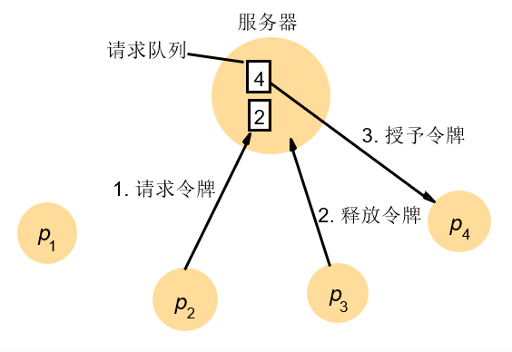
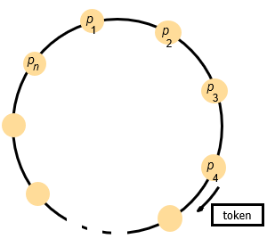
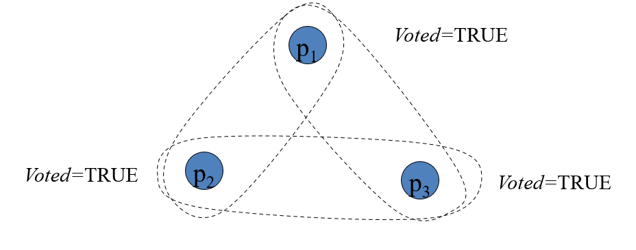
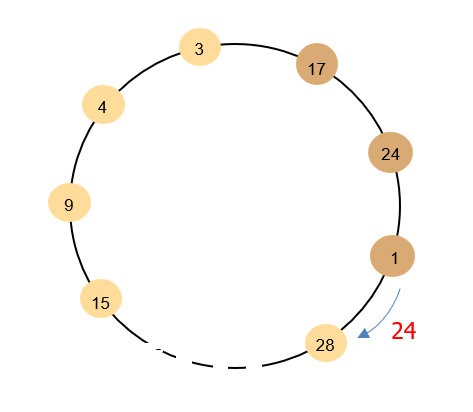
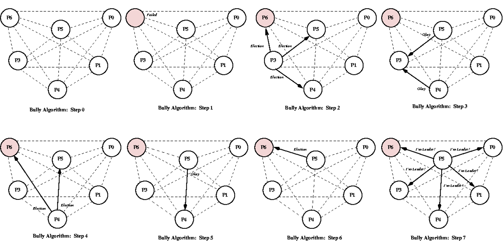
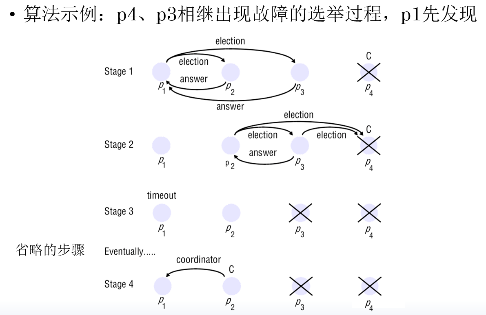
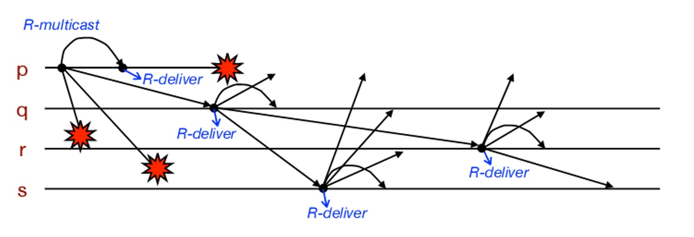
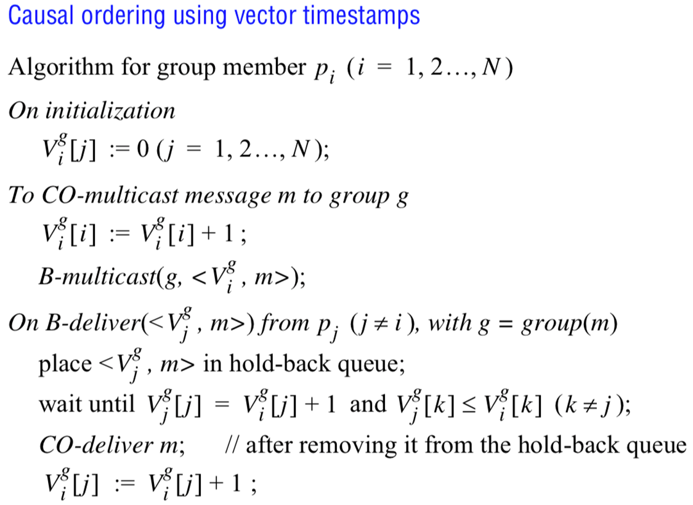
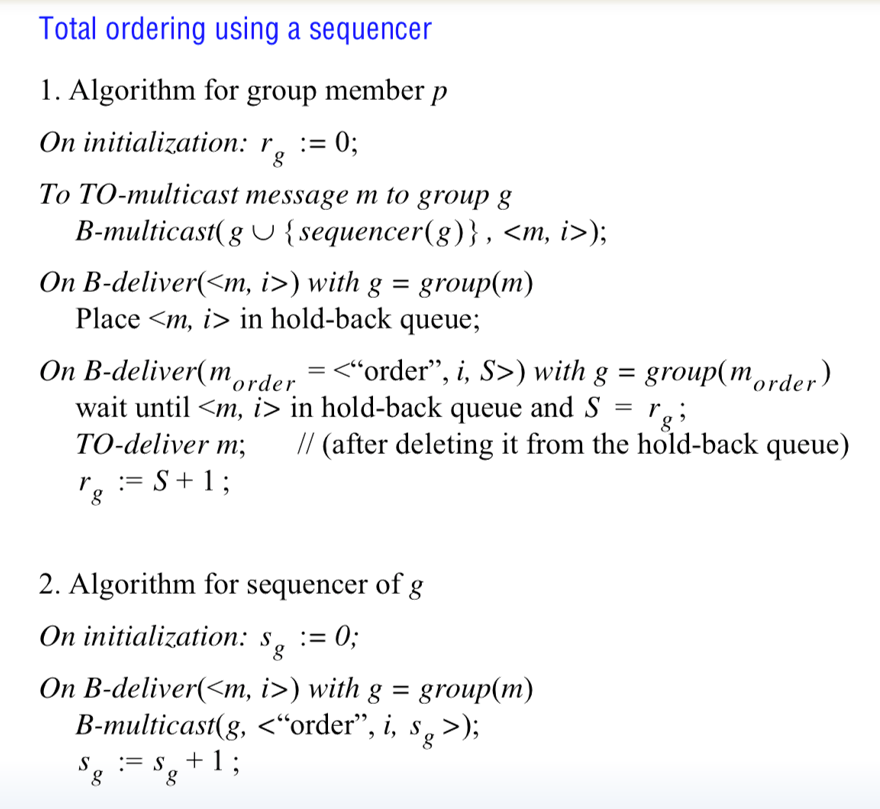

---
title: "分布式系统（三）"
description: "UESTC分布式系统第四章"
date: "2025-11-24 21:06:46"
category: "计算机基础"
originalCategory: "分布式系统"
track: "Computer Science"
level: intermediate
status: ready
published: true
minutes: 12
order: 1000
prerequisites: []
tags: ["DS"]
photos: "banner.jpeg"
source: "_posts"
---# 分布式系统第四章
## 分布式互斥
目的：仅基于消息投递，实现对资源的互斥访问。

### 应用层协议规定
- enter()：进入临界区。
- resourceAccess()：在临界区访问共享资源。
- exit()：离开临界区。

### 基本要求
- 安全性：在临界区内一次最多有一个进程可以执行。
- 活性：进入和离开临界区的请求最终成功执行。
- 顺序：进入临界区的顺序和进入请求的happen-before顺序一致。

### 性能评价
- 带宽消耗：每个enter和exit操作中发送的消息数。
- 客户延迟：进程进入、退出临界区的等待时间。
- 同步延迟：一个进程离开临界区和下一个进程进入临界区之间的延迟。

### 中央服务器算法(Central Server)


#### 基本要求
满足安全性和活性要求，但不满足顺序要求，异步系统请求顺序无法保证in order.

#### 性能评价
- 带宽消耗
  - enter: 2个消息，请求和授权
  - exit：1个消息，释放消息
- 客户延迟
  - enter：request+grant = 1 round-trip.
  - exit: release
- 同步延迟
  - 一个消息的往返时间：1 release + 1 grant.

### 基于环的算法(Ring-based)


传递令牌。

#### 基本要求
满足安全性和活性要求，不满足顺序要求。

#### 性能评价
- 带宽消耗：由于令牌的传递，会持续消耗带宽。
- 客户延迟：
  - Min：0个消息，请求时刚好有令牌。
  - Max：N个消息，请求前刚投递令牌。
- 同步延迟：
  - Min：1个消息，进程一次进入临界区。
  - Max：N个消息，一个进程连续进入临界区。

### 基于组播和逻辑时钟的算法(Multicast & LC)
进程进入临界区需要所有其他进程的同意：组播+应答。

采用Lamport clock避免死锁。

```
On initialization
  state := RELEASED;
To enter the section
  state := WANTED;
  Multicast request to all processes;
  T := request’s timestamp;
  Wait until (number of replies received = (N – 1));
  state := HELD;

On receipt of a request <Ti, pi> at pj (i ≠ j)
  if  (state = HELD or (state = WANTED and (T, pj) < (Ti, pi)))
  then
    queue request from pi without replying;
  else
    reply immediately to pi;
  end if
To exit the critical section
  state := RELEASED;
  reply to any queued requests;
```

#### 基本要求
满足安全性、活性和顺序要求。

#### 性能
- 带宽消耗
  - $2(N-1)$ ，即(N-1)个请求，(N-1)个应答。
- 客户延迟
  - 1 round-trip
- 同步延迟
  - 一个消息的传输时间。

### Maekawa投票算法
进程进入临界区不需要所有进程统一：
- 每个进程都有一个选举集$V_i$.
  - 选举集包含多个进程。
  - 每个进程处于自己的选举集中。
  - $V_i\cap V_j \not ={\emptyset}$，任意两个选举集有交集。
  - $|V_i|=K$，所有选举集大小一致，保证公平性。
  - 每个进程pj出现在M个选举集中。
  - $K\approx \sqrt{N} \& M=K$

```
On initialization
  state := RELEASED;
  voted := FALSE;
For pi to enter the critical section
  state := WANTED;
  Multicast request to all processes in Vi;
  Wait until (number of replies received = K);
  state := HELD;
On receipt of a request from pi at pj
  if (state = HELD or voted = TRUE)
  then
    queue request from pi without replying;
  else
    send reply to pi;
    voted := TRUE;
  end if
For pi to exit the critical section
  state := RELEASED;
  Multicast release to all processes in Vi;
On receipt of a release from pi at pj
  if (queue of requests is non-empty)
  then
    remove head of queue – from pk, say;
    send reply to pk;
    voted := TRUE;
  else
    voted := FALSE;
  end if
```

#### 死锁问题


进程p1、p2和p3，且V1={p1, p2}， V2={p2, p3}， V3={p3, p1}.

若三个进程并发请求进入临界区，分别应答了自己，但无法获得另一个进程的回复，进入死锁。

#### 基本要求
改进后的投票算法可满足安全性、活性和顺序性。

#### 性能
- 带宽消耗
  - 进入需要$2\sqrt{n}$个消息。
  - 退出需要$\sqrt{n}$个消息。
- 客户延迟
  - 1 round-trip
- 同步延迟
  - 1 round-trip (release + vote)

## 选举
### 基础概念
- 选举算法：选择一个唯一的进程来扮演特定角色的算法。
- 召集选举：一个进程启动了选举算法的一次运行。
- 参与者：进程参加了选举算法的某次运行。
- 非参与者：进程当前没有参加任何选举算法。
- 进程标识符：唯一且可按全序排列的任何数值。

### 基本要求
- 安全性：参与进程Pi的领导者信息要么是空的，要么是当前所有可用者中pid最大的进程。
  - $elected_i=\bot || elected_i=P$
- 活性：所有进程Pi都参加，并且最终使得$elected_i\not ={\bot}$或进程Pi崩溃。

### 性能评价
- 带宽消耗：与发送消息的总数成比例。
- 周转时间：从启动算法到终止算法之间的串行消息传输的次数。

### 基于环的选举算法(Ring-base ELection)
目的：在异步系统中选举具有最大标识符的进程作为协调者。



按逻辑换排列一组进程，id不必有序。

```
初始化，每个进程标记为非参与者：
me=non-participant

任何进程可以开始一次选举：
me=participant
idmsg=idlocal
forward({elect, idmsg})->next

接收到选举消息{elect, idmsg}时：
if(idlocal<idmsg)
{
  forward({elect, idmsg})->next
  me=participant
}
else if(idlocal>idmsg)
{
  if(me=participant)do nothing //终止选举
  else
  {
    forward({elect, idlocal})->next
    me=participant
  }
}
else //消息绕环一周，自己就是协调者
{
  forward({elected, idmsg})->next
}

接收到协调者消息{elected, idcoordinator}
if(idcoordinator == idlocal)结束
else
{
  Coordinator = idcoordinator
  forward({elected, idcoordinator})->next
}
```

#### 性能
周转时间
- 最坏情况：3N-1个消息。
- 最好情况：2N个消息。

#### 不具备容错功能

### 霸道算法(Bully Election)
- 同步系统，使用超时检测进程故障。
- 通道可靠，但运行进程崩溃。
- 每个进程知道那些进程具有更大的标识符。
- 每个进程均可以和所有其他进程通信。


任一进程P发现故障，召集选举：

- 发送选举消息election至所有更大标识符的进程（含故障进程）
  - 若P没有收到应答消息，则给所有具有较小标识符的进程发送协调者消息。
  - 若P收到应答消息，则等待协调者消息。
    - 若等待超时，启动一次新的选举算法。

接收到election消息：
- 回复应答消息answer.
- 开启另一次选举。

进程收到协调者信息：
- 设置$elected_i=id_{coordinator}$



优化召集选举流程：
- 最大ID进程或除故障进程以外的最大ID进程发送协调者消息。
- 非最大ID进程发送选举消息至所有更大标识符的进程。

其余过程一致。



#### 性能
- 带宽消耗
  - 最好情况：$O(N-2)$，标识符次大的进程发起选举。
    - 发送N-2个协调者信息。
    - 周转时间为1个消息。
  - 最坏情况：$O(N^2)$，标识符最小的进程发起选举。
    - 周转时间=依次elect(N-2)+协调。

## 组播通信
### 基础概念
- 组播：发送一个消息给进程组中的每个进程。
- 广播：发送一个消息给系统中的所有进程。
- 系统模型
  - multicast(g, m)：进程发送消息给进程组g的所有成员。
  - deliver(m)：投递由组播发送的消息到调用进程。
- 进程组
  - 封闭组：只有组的成员可以组播到该组。
  - 开放组：组外的进程也可向该组发送消息。
### 组播面临的挑战
- 效率
  - 带宽
  - 总传输时间
- 投递保证
  - 可靠性
  - 顺序
- 进程组管理
  - 进程可任意加入或退出进程组
### 基本组播(reliable channel)
- B-multicast(g, m)：对每个进程$p\in g, send(p,m)$.
- 进程p receive(m)时：p执行B-deliver(m).
- 只要发送者没有崩溃，任何正确（不崩溃）的进程最终都会执行$\mathbf{B\text{-}deliver}$操作，即：最终会将消息 $m$ 提交给本地应用程序。

### 可靠组播R-multicast/R-deliver
#### 特点
- 完整性：一个正确的进程p投递一个消息m至多一次。
- 有效性：如果一个正确的进程组播消息m，那么它终将投递m.
- 协定：如果一个正确的进程投递消息m，那么group中其他正确的进程终将投递m.

#### 与B-multicast的区别
- B-multicast不保证协定
- R-multicast结果一致，要么全部，要么全不

#### 用B-multicast实现可靠组播
```
初始化：
　Received:={};
进程p将R-multicast消息发送给组g：
　B-multicast(g, m);
在进程q进行B-deliver(m)时，其中g=group(m)
  if (m ∉ Received) // 完整性
  then
    Received:=Received ∪ {m}
    if (q≠p) then B-multicast(g, m); end if // 协定
    R-deliver m; // 完整性，有效性
  end if
```



算法评价：
- 满足完整性：重复消息过滤
- 满足有效性：一个正确的进程终将B-deliver消息到他自己。
- 遵循协定：每个正确的进程在B-deliver消息中都B-multicast该消息到其他进程。
- 效率低：每个消息被发送到每个进程$|g|$次，累计$|g|^2$次。


#### 用IP组播实现可靠组播
将IP组播、捎带确认法和否定确认相结合：
- 基于IP组组播：IP组播通信通常是成功的。
- 捎带确认：在发送给组中的消息中捎带确认。
- 否认确认：进程检测到有遗漏消息，发送单独的应答或请求消息。

```
# 每个进程 p 初始化状态
On Initialization:
    S_g = 0              # 我发送的消息序号，初始为0
    R_g = [0, 0, ..., 0] # 记录从所有其他进程收到的连续序号，初始全0
    HoldBackQ = {}       # 存放乱序消息的缓冲区

procedure R_multicast(group g, message m):
    S_g = S_g + 1
    packet = <sender=p, data=m, seq=S_g, ack_vector=R_g>
    IP_multicast(group g, packet)

Upon receive packet <q, m, s> from IP_multicast:
    if s <= R_g[q]:
        discard packet  # 直接丢弃
        return
    if s == R_g[q] + 1:
        R_deliver(m)    # 向上层应用投递消息
        R_g[q] = s      # 更新接收状态

        check_holdback_queue(q)

    if s > R_g[q] + 1:
        HoldBackQ.add(packet)
        send_NAK(target=q, missing_range=[R_g[q]+1, s-1])
```

算法评价：
- 完整性：通过检测重复消息和IP组播性质实现。
- 有效性：仅在IP组播具有有效性时成立。
- 协定：需要进程无限组播消息并无限保留消息副本，这并不现实。

### 统一性质
- 统一性质：无论进程是否正确都成立的性质。
- 统一协定：如果一个进程投递消息m，不论该进程是正确的还是出故障，在group(m)中的所有正确的进程终将投递m.

统一协定允许一个进程在投递一个消息后崩溃。

### 有序组播
#### 排序
- FIFO排序：如果一个正确的进程发出multicast(g,m)，然后发出multicast(g, m')，那么每个投递m'的正确的进程将在m'前投递m.
- 因果排序：如果mutlicast(g,m)->multicast(g,m')，那么任何投递m'的正确进程将在m'前投递m.
- 全排序：如果一个正确的进程在投递m'前投递消息m，那么其它投递m'的正确进程将在m'前投递m.

#### 实现FIFO排序
- 基于序号实现。
- 与基于IP组播的可靠组播类似，采用Sg Pg和保留队列。

#### 实现因果排序
每个进程维护自己的向量时钟：
- CO-multicast：在向量时钟的相应分量上加1，附加VC到消息。
- CO-deliver：根据时间戳递交消息。



因果依赖：
$$\mathbf{V_i^g[k] \leq V_j^g[k] \quad (k \neq j)}$$
含义： $P_i$ 知道的、来自任何其他进程 $P_k$ 的消息总数（$\mathbf{V_i^g[k]}$）必须至少达到 $P_j$ 在发送 $m$ 之前所知道的来自 $P_k$ 的消息总数（$\mathbf{V_j^g[k]}$）。

保证： 如果消息 $m$ 是由 $P_j$ 在接收了某个 $P_k$ 的消息 $m'$ 之后才发出的，那么 $P_i$ 必须先接收并投递 $m'$ 之后，才能投递 $m$.

#### 实现全排序
为组播消息指定全排序标识符，以便于进程基于这些标识符做出相同的排序决定。

定序器实现全排序：



ISIS算法：
- 进程维护的关键信息
  - Ag.q：进程q观察到的组g中最大的、已经被所有进程认可的协定序号。
  - Pg.q：进程q自己提出的最大序号。
- 提议阶段
  - 进程p将原始消息m组播到组g。
  - 每个接收消息m的进程q提议序列号：
    - 进程q检查它已知的最大协定序号Ag.q和它自己提出的最大提议序号Pg.q，然后取两者的最大值加1作为针对这条新消息m的提议序号。Pg.q = max(Ag.q, Pg.q) + 1.
    - 把Pg.q添加到消息m，并把m放入有序保留队列。
    - 用序号Pg.q回复进程p.
- 协定阶段
  - 进程p手机所有进程提出的Pg.q.
  - 选择最大的数作为下一个协定序号，并组播该序号。
  - 收到序号的进程设置Ag.q为新的最大值，并将该序号附加到指定消息上，在保留队列进行重排序，最后转到投递队列。

## 共识和相关问题
### 共识问题
一个或多个进程提议一个值后，使得进程对这个值达成一致意见。

在网络可靠但允许节点失效的最小异步模型系统中，不存在可以解决一致性问题的共识算法。

### 共识算法的基本要求
- 终止性：每个正确的进程最终设置它的决定变量。
- 协定性：如果pi和pj是正确的，且已进入决定状态，那么di=dj.
- 完整性/有效性：如果正确的进程都提议了同一个值，那么处于决定状态的任何正确进程将选择该值。

### 共识算法
#### 过程
- 每个进程组播它的提议值。
- 每个进程收集其他进程的提议值。
- 每个基础计算func(v1, v2, ..., vN).

#### 性质
- 终止性：由组播操作的可靠性保证。
- 协定性和完整性：由func的定义与组播操作的完整性保证。

### 拜占庭将军问题
3个或更多将军协商是进攻还是撤退，1个将军（司令）发布命令，其他将军（中尉）决定进攻或撤退，一个或多个将军可能会叛变，所有未叛变的将军执行相同的命令。

与共识问题的区别：
一个独立的进程提供一个值，其他进程决定是否采用。

算法要求：
- 终止性：每个正确进程最终设置它的决定变量。
- 协定性：所有正确进程的决定值都相同。
- 完整性：若司令正确，则所有正确进程采用司令提议的值。

### 交互一致性问题
每个进程提议一个值，就向量的值达成一致。

决定向量：向量中的每一个分量与一个进程的值对应。

算法要求：
- 终止性：每个进程最终都会设置它们的决定向量。
- 协定性：每个正确的进程决定向量一致。
- 完整性：如果pi是正确进程，那么所有正确的进程都把vi作为他们决定向量中第i个分量。


### 同步系统中的共识问题
在由N个进程组成的同步系统中，每个进程有一个初始值，但系统中可能出现进程崩溃故障，崩溃的进程不超过f个。

设计一个算法，让所有未崩溃的进程最终对一个值达成一致。

- 初始化阶段
  - 每个进程维护一个集合$Values_i$
    - 该集合是众多小集合的集合。
    - 每个小集合代表了一轮中出现的数值。
- 每一轮
  - 组播操作
    - 每个进程通过向组g广播上一轮新增的、本进程没发过的数值；即$Values_i^r - Values_i^{r-1}$.
    - 将上一次的Values集合作为本轮记录数值的初始状态；$Values_i^{r+1} = Values_i^r$.
  - 接收合并
    - 每个进程合并来自其他进程传来的$V_j$，和$Values_i^{r+1}$进行并集操作.
- 最终决策：f+1轮后，选择$Values_i^{f+1}$作为最终的决定值。

算法满足终止性、协定性和完整性。


### Paxos共识问题
目标：让一组进程就一个值达成一致。

#### 要求
- 安全性
  - 只有曾经提出的值，能被选择作为最终的结果。
  - 决定值仅有1个。
  - 进程不会误以为某个值被选择。
- 活性
  - 一定有一个值被选中。
  - 如果某个值被选中了，所有正常进程一定知道。

#### 算法假设
- 系统同步性：分布式系统可以是部分同步的，甚至是异步的。
- 通信信道是不可靠的。
- 损坏的信息可被检测并忽略。
- 进程只会出现崩溃故障。

#### 设计目标
- 只保证正确性，不考虑性能。
- 容忍故障且不阻塞，只要多数进程正常工作，算法就能进行。

#### 角色
Quorum(仲裁集)：Paxos通过多数节点同意来推进共识。

- Client：发起请求，是共识需求的出发者。
- Proposers：接收Client的请求，运行Paxos协议，推动集群内所有节点对请求达成一致。【推动流程】
- Acceptors：维护协议的状态，通过法定人数(Quorum)的同意来确认提议。【确认一致性】
- Learners：从多数Acceptors处获取以达成的共识结果，执行请求并向Client返回响应。【完成结果落地】

单个节点可同时承担多个角色。

角色的分工是Paxos实现崩溃容错公式的基础。

#### 提议
提议是由Proposer提出的共识候选内容，由“唯一编号+提议值”组成。

#### 算法流程
- 准备阶段：让提议者获取多数接受者的承诺。
  - 提议者：选择一个唯一的提议编号n，向多数接受者发送Prepare请求。
  - 接受者：若收到的n大于自己之前响应过的所有Prepare请求编号：
    - 承诺不再接受编号小于n的提议。
    - 返回自己已接受的编号最大的提议（若有）。
- 接受阶段：让提议者的提议被多数接受者确认，完成共识。
  - 提议者：若多数接受者对Prepare请求相应，则向这些接受者发送Accept请求。
    - 提议编号为n.
    - 提议值v：若响应中包含已接受的提议，取其中编号最大的提议的值；若没有，则用自己的初始值。
  - 接受者：若收到编号为n的Accept请求，且未响应过编号大于n的Prepare请求，则接受该提议。

#### 潜在问题
编号为N的提议失败的原因：
- 接受者已对更大编号的提议做出承诺。
- 提议者在准备阶段或接受阶段未收到多数接受者的响应。

提议失败后，算法会使用更大的提议编号重新启动流程，若多个提议者都在重试，就可能出现相互抢占编号，持续拒绝对方提议的情况。

出现活锁。
