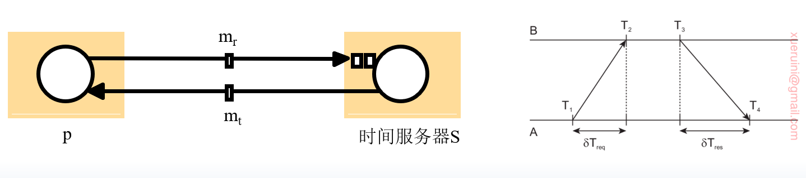
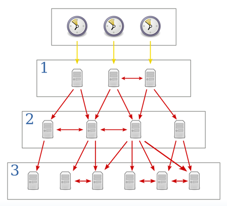
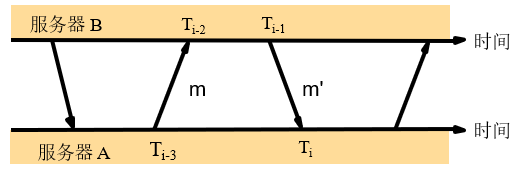
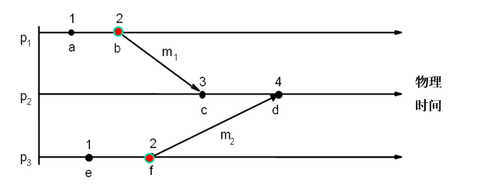
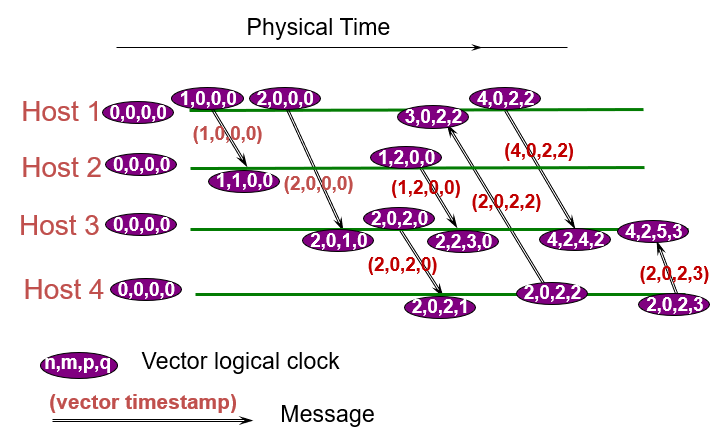
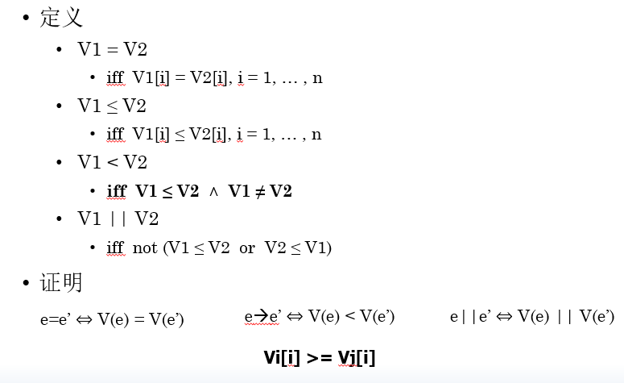
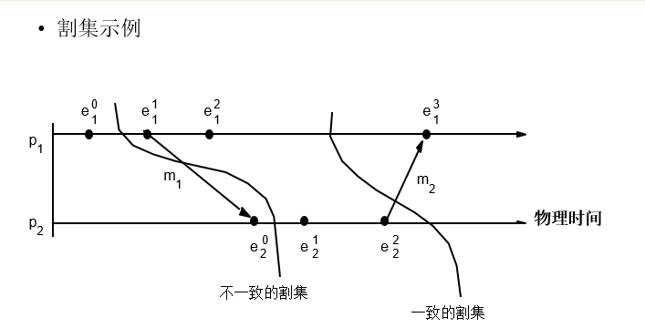
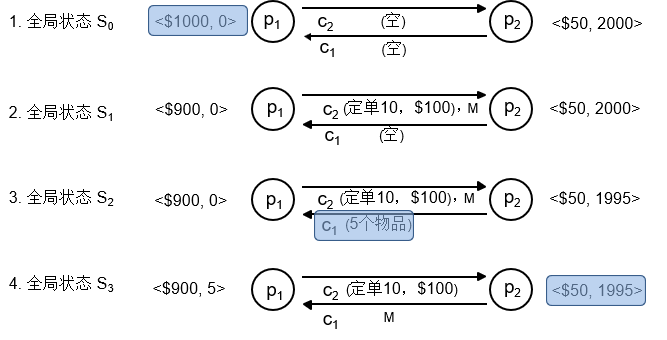
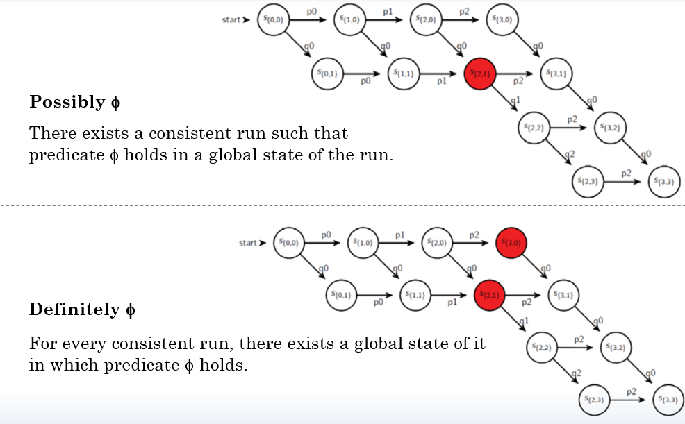

# 分布式系统第三章
## 时钟、事件和进程状态
假设每个进程在单处理器上执行，处理器之间不共享内存，进程之间只能通过消息进行通信。

- 进程状态
  - 所有变量的值
  - 相关的本地操作系统环境中的对象的值
- 事件：一个通信动作或进程状态转换动作。
- 进程历史：在进程中发生的一系列事件，按发生在先排序。
- 计算机时钟：晶体具有固定的震荡频率。
  - 硬件时钟：$H_i(t)$.
  - 软件时钟：$C_i(t) = aH_i(t) + b$.

## 同步物理时钟
### 外部同步
采用权威的外部时间源。

时钟$C_i$在范围$D$内是准确的:
$$
|S(t)-C_i(t)|<D, i=1, 2, \dots, N
$$

### 内部同步
无外部权威时间源，系统内时钟同步。

时钟$C_i$在范围$D$内是准确的:
$$
|C_i(t)-C_j(t)|<D, i,j=1, 2, \dots, N
$$

若$P$（时钟集合）在范围$D$内外部同步，则在范围$2D$内内部同步。

### 时钟正确性
基于偏移率：
$$
(1-\rho)(t-t')\leq H(t)-H(t')\leq (1+\rho)(t-t')
$$
其中：$t-t'$描述了现实实际流失时间，$H(t)-H(t')$描述了系统的流失时间，$\rho$是偏移率。

基于单调性：
$$
t'>t=>C(t')>C(t)
$$
保证了时钟读数总是前进的。

基于混合条件：单调性+偏移率有界+同步点跳跃前进。

同步点跳跃前进是指：当进行时钟点同步时，调整后的时钟读数必须比调整前的读数大，即跳跃地向前调整。

### 时钟故障
- 崩溃故障：时钟完全停止滴答。
- 随即故障。

### 同步系统中的同步
已知时钟偏移率范围，存在最大的消息传输延迟，进程每一步的执行时间已知。

若一个进程将时间t传送至另一个进程，消息传递的时间不确定性为$u=[Min, Max]$.

- 设置最早到达时间：$t+Min$，则时钟偏移至多为$Max-Min=u$.
- 设置最晚到达时间：$t+Max$，则时钟偏移可能为$Max-Min=u$.
- 设置为中间值（最佳策略）：$t+\frac{Max+Min}{2}$，则时钟偏移至多为$\frac{1}{2}u$.

### Cristian方法
应用条件：
- 存在时间服务器，作为外部时间源。
- 消息往返时间与系统所要求的精度相比足够短。

协议：

往返时间$T_{round}$：
- 进程p向时间服务器发送同步请求$m_r$，并记录本地时间$T_1$.
- 进程p接收到服务器回复的$m_t$，并记录本地时间$T_4$.
- $T_{round} = T_4-T_1$.

设置时钟$t+\frac{T_{round}}{2}$.

精度计算：
- 假设消息的传输延迟均为最短时间$Min$，$T_{round}$最小值为$2 Min$.
- 如果总往返时间是$T_{round}$，并且知道单项延迟至少是$Min$，那么单向延迟的最大值是$T_{round} -Min$.
- 回复消息的真实到达时间落在一个不确定区间$[t+Min, t+T_{round}-Min]$.
- 最大误差为$t+T_{round}-Min-(t+\frac{T_{round}}{2}$.

理想状态下，若$T_{round} = 2Min$，则误差为0. 也就是说，如果网络延迟非常稳定，且总是最小值，我们就能实现完美的同步.

### Berkeley方法
- 参与者时钟精度相近。
- 主机周期轮询从属机时间。
- 主机计算容错平均值。
- 主机发送每个从属机的调整量。

### 网络时间协议(NTP)
优点：
- 可外部同步：跨Internet的用户能够与UTC精确同步。
- 高可靠性：能够处理连接丢失，利用冗余服务器、路径等。
- 扩展性好：大量用户可经常同步，以抵消偏移率的影响。
- 安全性强：防止恶意或偶然的干扰。

协议的核心思想是构建一个分层的、具有弹性的时间同步网络，以确保整个分布式都能获得准确的时间。

协议结构：层次结构，每个较低层级的服务器都从其上一层级的服务器获取时间；层级号表示该设备距离权威时间源的条数，层级号越低，时钟精度越高。

同步网络结构是动态和容错的，如果某个时间服务器发生故障，或者网络路径变化，子网可以自动重新选择并连接到新的可用的上层服务器进行同步。

同步模式：
- 组播模式
  - 适用于高速LAN。
  - 准确度低，但效率高。
- S/C
  - 类似于Cristian。
  - 准确度高于组播。
- 对称模式
  - 保留时序信息。
  - 准确度最高。

精度分析：

若m m'传输消息的时间延迟为$t, t'$，$o$为B时钟相对于A时钟的实际偏移，$O_i$为偏移估计，$d_i$为总延迟估计，则

$$
C_b-C_a = o \\
T_{i-3} + t = T_{i-2} - o\\
T_{i-1} - o + t' = T_i \\
d_i = t+ t'
$$

$o_i$计算时假设$t=t'$:
$$
o_i = \frac{T_{i-2} - T_{i-3} + T_{i-1} -T_i}{2}
$$

那么$o = o_i + \frac{t'-t}{2}$.

$t,t'\geq 0$：
$$
o_i - \frac{d_i}{2}\leq o \leq o_i+\frac{d_i}{2}
$$

## 逻辑时间和逻辑时钟
### 为什么需要逻辑时间
- 节点具有独立时钟，缺乏全局时钟，后发生的事件有可能被赋予较早的事件标记。
- 分布式系统的物理时钟无法完美同步。
- 事件排序是众多分布式算法的基石。

### 逻辑时钟
众多应用只要求所有节点具有相同时间基准，该时间不一定与物理时间相同。

### 背景
两个基本事实：
- 同一进程中先后两个事件存在关系 $\rightarrow_i$。
- 任一消息的发送事件发生在该消息的接收事件之前。

发生在先 关系定义：
- 若存在进程pi满足$e\rightarrow_i e'$， 则$e\rightarrow e'$.
- 对于任一消息m，存在$send(m)\rightarrow recv(m)$.
- 若事件满足$e\rightarrow e'$和$e'\rightarrow e''$，则$e\rightarrow e''$.

并发关系定义：$X||Y$表明$X\rightarrow Y$和$Y\rightarrow X$均不成立，则X Y是并发的。

### Lamport时钟
#### 机制
- 进程维护一个单调递增的软件计数器，充当逻辑时钟。
- 用逻辑时钟为事件添加时间戳。
- 按事件的时间戳大小为事件排序。

#### 逻辑时钟修改规则
- LC1：进程pi执行事件前，逻辑时钟$L_i=L_i+1$.
- LC2
  - 进程pi发送消息m时，在m中添加时间戳$t=L_i$.
  - 进程pj在接收(m,t)时，更新$L_j = max(L_j, t+1)$，执行LC1，即给事件recv(m)添加时间戳，即$L_j = max(L_j, t)+1$.

不同进程产生的消息可能具有相同数值的Lamport时间戳。

#### 全序逻辑时钟
引入进程标识符创建时间的全序关系。

若e e'分别为pi pj发送的时间，则全局逻辑时间戳分别为$(T_i, i) (T_j, j)$.

优先比较T，随后比较i j.

这样系统中各个事件Lamport时间戳均不相同。

#### 缺陷
Lamport时钟不具备性质：若$L(A)< L(B)$ 则 $A\rightarrow B$.

因为他没有捕获事件的因果关系。

### 向量时钟
#### 机制
每个进程维护自己的向量时钟$V_i$：
- VC1：初始情况，$V_i[j]=0, i,j = 1,2,\dots N$.
- VC2：在pi给事件加时间戳之前，设置$Vi[i] += 1$.
- VC3：pi在它发送的每个消息中包含$t=Vi$.
- VC4：当pi接收到消息中的时间戳t时，设置$Vi[j] = max(Vi[j], t[j]), j=1,2, ..., N$，取两个向量时间戳的最大值，该操作称为合并。

需注意，与Lamport时钟不同，这里会提前+1.

#### 性质

## 全局状态
### 为什么需要观察全局状态
- 收集分布式无用单元
  - 基于对象的引用计数
  - 考虑信道和进程的状态
- 分布式死锁检测
  - 观察系统中的等待关系图是否存在循环
- 分布式终止检测
- 分布式调试

### 全局状态和一致割集
- 进程的历史$h_i=<e_i^0, e_i^1, e_i^2, ...>$.
- 进程历史的有限前缀$h_i^k=<e_^0, e_i^1, ..., e_i^k>$
- 全局历史：单个进程历史的并集。
- 进程状态：$s_i^k$pi进程在第k个事件发生之前的状态。
- 全局状态：$S=(s_1, s_2, ..., s_N)$.
- 割集，系统全局历史的子集：$C=<h_1^c1, h_2^c2, ..., h_n^cn>$.
- 割集的一致性
  - 对于所有事件$e\in C, f\rightarrow e$那么$f\in C$.
  - 但如果e不属于C，f属不属于C都可以。

一致的全局状态对应于一致割集的状态。

走向：事件全序
- 系统的一种可能执行过程。
- 本事是系统所有事件的一个全序排列，但每个进程自己的本地执行顺序保持一致。
- 并非所有走向都会经过一致的全局状态。

线性化走向：仅经过一致的全局状态，每一步都对应一致割集。

### Chandy和Lamport的快照算法
- 目的：捕获一致的全局状态。
- 假设：
  - 进程和通道均不会出现故障。
  - 单向通道，提供FIFO顺序的消息传递。
  - 进程之间存在强连通关系。
- 任一进程可在任一时间开始全局拍照。
- 拍照时，进程可继续执行，并发送和接收消息。

#### 快照算法通过以下元素描述系统状态
- 接入通道+外出通道：记录进程之间的消息传递链路；
- 进程状态+通道状态：系统的全局状态由每个进程的本地状态+每个通道中未送达的消息状态共同组成；

#### 核心工具：标记消息
- 标记消息是触发和完成快照的关键。
- 标记接收规则：进程受到标记后，需先记录自己的当前状态，之后在发送任何消息前，必须发送一个标记，并同时记录接入通道中尚未处理的消息。
- 标记发送规则：若进程还未记录自身状态，受到标记后需立即记录状态，清空通道。

#### 算法过程
1. 发起者启动快照：
   - Pi先记录自己的本地进程状态；
   - 对自己的每一个外出通道，在发送其他消息前，先发送 “标记消息”。
2. 其他进程接收标记并响应：当任意进程Pj从通道c收到标记消息时：
   - 若Pj未记录状态：
     - 记录自己的本地进程状态；
     - 将通道c的状态记为 “空集”（因为标记是通道c的第一个 “信号”，说明标记到达前通道无未处理消息）；
     - 对自己的所有外出通道，发送标记消息（继续触发其他进程的快照）；
     - 开始记录后续从其他接入通道收到的消息（用于捕获这些通道的状态）。
   - 若Pj已记录状态：
     - 将通道c的状态记为 “从Pj记录状态后，在c上收到的所有消息”（即捕获通道c在快照过程中的未处理消息）

#### 实例

1. 对p1来说，在发出M前，记录本地状态未<$1000,0>.
2. p2随后传递5个物品至p1，此时c1 c2均有消息在传递。
3. 下一时刻，标记消息已经从p1传递至p2，p2记录此刻的状态<$50, 1995>. 并回传给p1一个标记信息M，并清空c2记录为空集。
4. p1接收到标记信息后，记录从它发出信息（记录本地状态开始）时的所有c1收到的信息c1:<5个物体>。

最后状态为: p1<1000, 0>, p2<50, 1995>, c1:<5itmes>, c2<>.

#### 算法终止分析
假设一个进程已经收到了一个标记信息，在有限的时间内记录了它的状态，并在有限的时间里通过每个外出通道发送了标记信息。

若存在一条从进程pi到进程pj的信道，那么pi记录它的状态之后的有限时间内，pj将记录它的状态（收到pi的标记信息）。

一些进程记录它的状态之后的有限时间内，所有进程都会记录它们的状态和接入通道的状态。

每个进程收到它在所有的输入通道上的标记后终止。

简单来说，就是每个进程的所有输入通道都收到了标记，算法终止。

快照算法记录的全局状态是一致的。

### 全局状态谓词
从系统P的进程全局状态集映射到true, false的函数。

稳定的谓词：一旦系统进入谓词为true的状态，它将在所有可从该状态可达的状态中一致保持true.

分布式系统需要满足以下两个要求：
- 安全性：对于从初始状态S₀出发可到达的所有状态S，代表坏情况的谓词P_bad的取值都是False.
- 活性：对所有从初始状态出发的执行过程，代表好情况的谓词P_good最终会变为True.

## 分布式调试
目的：对系统实际执行总的暂态做出判断，如安全条件检测，控制系统。

这话说的很傻逼，实际上就是判断某一个特殊状况是否出现过，比如死锁、资源耗尽等特殊情况。

谓词是一类状态的描述，我们判断谓词实际上判断是否符合某一条件的状态出现过

方法：
- 监控器进程手机进程状态信息。

### 全局谓词判断

#### 可能的$\phi$
存在一个一致的全局状态S，H的用一个线性化走向经历了这个全局状态S，而且该S使得$\phi (s)$为True.

实际上就是说，这个H只要有一个线性化走向经过了S，这个S使得谓词为真，那么这个S就是可能发生的。

#### 明确的$\phi$
对于H的所有线性化走向L，存在L经历的一个一致的全局状态S，而且该S使得$\phi (s)$为True.

这个话也是傻逼说的，实际上就是H的任何线性化走向，都会经历一个S符合谓词为true的情况，哪怕S并不是一模一样。

### 观察一致的全局状态
前提：进程的状态信息附有向量时钟.

定义： $S = (s_1, s_2, \dots, s_N)$ 是从监控器进程接收到的所有进程状态组成的一个全局状态。$S$ 是一致的全局状态当且仅当：
$$
V(s_i)[i] \geq V(s_j)[i] \quad (i, j = 1, 2, \dots, N)
$$

其中V是向量时钟。

记住：

对于任意进程 $P_i$，快照中的所有其他进程 $P_j$ 在快照 $s_j$ 中声称看到的来自 $P_i$ 的事件数 ($V(s_j)[i]$)，绝不能多于 $P_i$ 自己在快照 $s_i$ 中记录的事件数 ($V(s_i)[i]$)。
