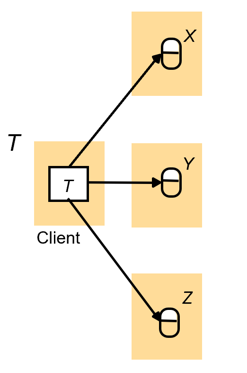
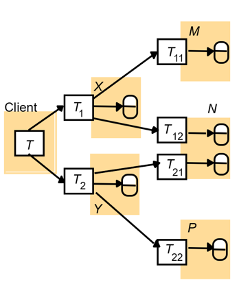
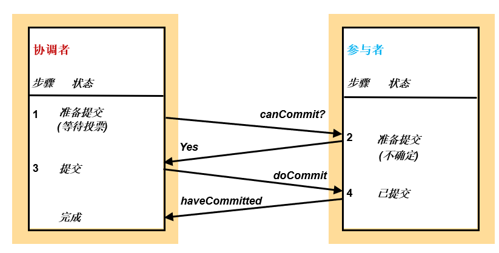
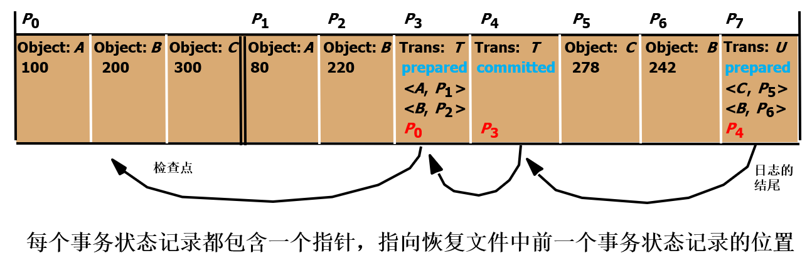
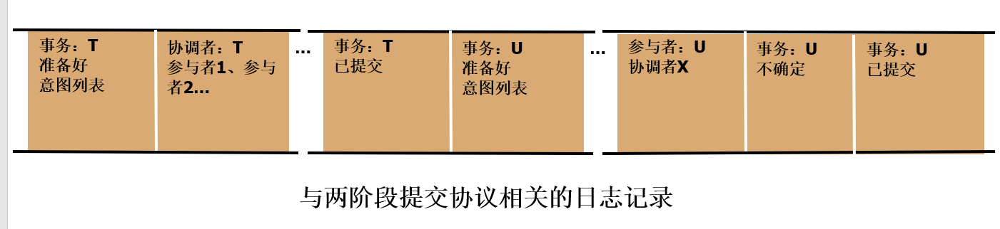
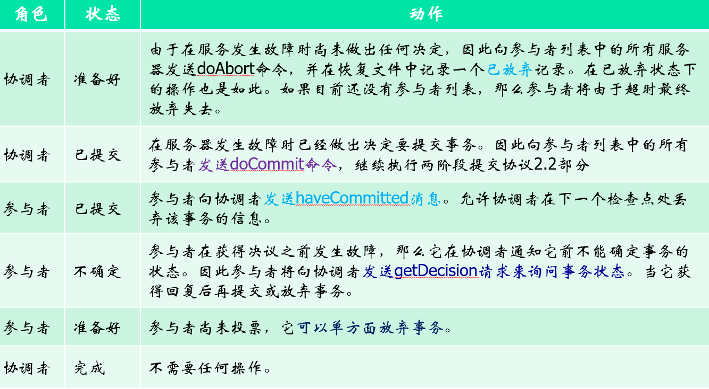

---
title: "分布式系统（五）"
description: "分布式系统第六章"
date: "2025-11-25 21:02:32"
category: "计算机基础"
originalCategory: "分布式系统"
track: "Computer Science"
level: foundation
status: ready
published: true
minutes: 6
order: 1000
prerequisites: []
tags: ["DS"]
photos: "banner.jpg"
source: "_posts"
---# 分布式系统第六章
## 分布式事务
分布式事务是指访问由多个服务器管理的对象的事务。

当一个分布式事务结束时，事务的原子特性要求所有参与该事务的服务器必须全部提交或全部放弃该事务。

### 平面事务
在平面事务中，客户给多个服务器发送请求。

一个平面客户事务完成一个请求后才发起下一个请求。每个事务顺序访问服务器的对象。

当服务器使用加锁机制时，事务一次只等待一个对象。

### 嵌套事务
在嵌套事务中，顶层事务可以创建子事务，子事务可以进一步以任意深度嵌套子事务。

同一层的子事务可以并发执行。

父事务可以在部分子事务放弃的前提下提交。

### 分布式事务的协调者
执行分布式事务请求的服务器需要相互通信，以确保事务提交时能够协调。
- 协调者：负责事务的开始、提交和放弃。
- 参与者：处理本操作的服务器进程；配合协调者共同执行提议协议。

当客户启动一个事务时，会向任意一台服务器的协调者发出一个openTransaction请求。

随后协调者处理完该openTransaction请求后，将事务标识符TID返回客户。

TID的构成：
- 创建该事务的服务器标识符（IP地址）。
- 一个对该服务器来说唯一的数字。

协调者接口提供了一个额外的join方法，可以把一个新的参与者拉入当前事务。

协调者知道所有参与者，每个参与者也知道协调者。

## 原子提交协议
原子提交协议允许服务器之间相互通信，以便共同决定提交或放弃。

原子提交问题：
- 要么所有的节点必须提交，要么所有的节点必须放弃。
- 如果任意的节点崩溃，则所有的节点必须放弃。

### 单阶段原子提交协议
这是一种简单的原子提交协议。

协调者向事务所有的参与者发送commit或abort请求。

协调者不断地发送请求，直至所有参与者都确认。

#### 缺陷
单阶段原子提交协议是不充分的：
- 不允许参与者单方面决定放弃事务。
- 可能有一些并发控制问题会组织参与者提交，协调者可能不知道这种情况，例如：
  - 为了解除死锁需要放弃事务。
  - 乐观并发控制验证失败导致放弃事务。
  - 参与者可能崩溃，需要放弃事务。

### 两阶段提交协议
允许任意一个参与者自行放弃他自己的那部分事务。

- 一个协调者、多个参与者共同完成一个事务。
- 第一阶段：协调者询问所有的参与者是否准备好提交。
- 第二阶段，协调者通知所有的参与者提交或放弃事务。

#### 算法流程
- 一阶段
  - 协调者向分布式事务的所有参与者发送canCommit请求。
  - 当参与者受到canCommit请求后，他将向协调者回复他的投票。
    - 在投yes前，他将在持久性存储中保存所有对象，准备提交。
    - 投no则参与者立即放弃事务。
- 二阶段
  - 协调者收集所有的投票
    - 若不存在故障且所有的投票结果都是yes，协调者决定提交事务并向所有参与者发送doCommit请求。
    - 否则，协调者决定放弃事务，并向所有投yes的参与者发送doAbort请求。
  - 投yes的参与者等待协调者的请求，接受请求后依照请求放弃或提交事务；如果请求是提交事务，那么他还要像协调者发送一个haveCommitted来确认事务已经提交。

#### 通信异常
- canCommit丢失：超时后参与者可能会决定单方面放弃，协调者最终也会放弃。
- yes/no丢失：协调者在超时后放弃事务，他必须向那些投票者发送doAbort.
- doCommit丢失：参与者等待超时，发送getDecision确认，这一过程会反复进行直到受到回复，也就是说在回复yes/no等待协调者发送命令之间无法放弃事务。
- haveCommitted丢失：事务能正确提交，但影响服务器删除果实的协调者信息。
- 服务器在参与者完成事务是否提交决定后，回复尚未到达服务器期间崩溃：所有对象医保存在持久性存储中，进程重启后客回复，事务仍能正确提交。

#### 性能
N个参与者情况下：
- 无服务器崩溃、通信异常等情况下：N个CanCommit+N个应答+N个doCommit.
- 最坏情况下，可能出现多次服务器或者通信异常，可能导致参与者长时间处于不确定状态。

#### 缺陷
- 同步阻塞：在投票后等待服务器命令间，所有参与者处于阻塞状态，无法进行其他任何操作；若协调者在发起提议后崩溃，那么投yes的参与者阻塞指协调者恢复后发送决议。
- 单点故障：协调者存在性能瓶颈及单点失效问题。
- 数据不一致：如果因为网络延迟或协调者崩溃，只有部分参与者接收到了协调者的doCommit命令，那么接收到的参与者提交事务，而未收到的参与者不提交事务，造成了数据不一致性。

## 分布式事务的并发控制
- 本地并发控制：每个服务器对自己的对象应用并发控制机制。
- 多个本地并发控制构成分布式并发控制。

分布式事务中所有服务器共同保证事务以串行等价方式执行。如果事务T对某一服务器上对象的冲突访问在事务U之前，那么所有服务器对对象的冲突操作，事务T都在事务U之前。

### 加锁
在分布式事务中，某个对象锁总是本地持有的，是否加锁由本地锁管理器决定。

由于分布式事务中，访问对象位于不同的服务器上，而加锁行为为本地行为，故加锁方式容易导致死锁。

### 时间戳并发控制
在分布式事务中，为保证串行等价，协调者必须就时间戳的唯一性和排序达成一致。

时间戳定义：<本地时间戳，服务器id>.

时间戳比较：先比较本地时间戳，再比较服务器id，确保可以全排序。

即使各服务器的本地时钟不同步，也能保证事务之间的相同顺序，即可以实现分布式事务的正确并发。

### 乐观并发控制
在分布式事务验证中，由于两阶段提交性能较低，故需要允许多个事务并行验证。

如果不加处理，不同服务器对同一组事务的串行化可能并不一致，例如服务器A上先T后U，而在服务器Y上先U后T。

为保证串行等价，可以使用全局唯一的事务号。

## 分布式死锁
涉及多服务器多个访问对象，死锁更容易发生。

- 可以采用超时来解除死锁，设置合理超时时间困难，代价大，
- 可以基于全局事务等待图检测死锁。

### 分布式死锁检测
#### 集中式死锁检测
各服务器只有局部等待图，需要通过通信才能发现全局环路。

- 某服务器担任全局死锁检测器。
- 全局死锁检测器收集局部等待图构造全局等待图。
- 一旦发现环路，制定解释死锁的方案，并通知各服务器放弃相同事务。

不足
- 依赖单一服务器执行检测。
- 可靠性查，缺乏容错，没有可伸缩性。
- 收集局部等待图代价高。

#### 边追逐方法
- 开始阶段：当服务器发现某个事务T开始等待事务U，而U正在等待另一个服务器上的对象时，该服务器发送一个\<T->U\>的探测消息。
- 死锁检测：接受探测消息的服务器确定是否有死锁、是否转发探测消息。
- 死锁解除：当检测出环路后，环路中的某个事务将被放弃以解除死锁。

性能：
- 在绝大多数边追逐算法中，对象所在的服务器将向事务协调者发送探寻消息，事务协调者再将消息转发到事务等待的对象所在的服务器。
- 转发一个探寻消息需要发送两个消息。
- 若一个死锁涉及N个事务，那么检测死锁的探寻消息需要N-1个事务协调者转发，并经过N-1个对象的服务器，最终需要2(N-1)个消息。

死锁解除时，应基于事务的优先进行放弃，否则可能出现一个环路上，多个事务同时发起死锁检测，在多个服务器上执行，并独立做出放弃不同事务的决定。

## 事务恢复
事务恢复就是保证服务器上的对象持久性并提供故障原子性。
- 持久性是指要求对象被保存在持久性存储中并一直可用。
- 故障原子性：要求即使在服务器出现故障时，事务的更新作用也是原子的。

事务的恢复过程实际上就是根据持久存储中最后提交的对象版本来恢复服务器中对象的值。

### 意图列表
记录了服务器上的所有活动事务，每个事务对应的意图列表的记录记载了该事务修改的对象的值和引用列表。
- 事务提交时，用来确定所受影响的对象，然后事务将用对象的临时版本替换对象的提交版本。
- 事务放弃时，用来删除该事务形成的对象的所有临时版本。

### 日志
包含该服务器执行的所有事务的历史，历史由对象值、事务状态和意图列表组成。

#### 两阶段提交协议日志
两个新的事务状态：
- 完成
- 不确定

两种记录类型：
- 协调者：事务标识符、参与者列表。
- 参与者：事务标识符、协调者。

#### 两阶段提交协议的恢复

