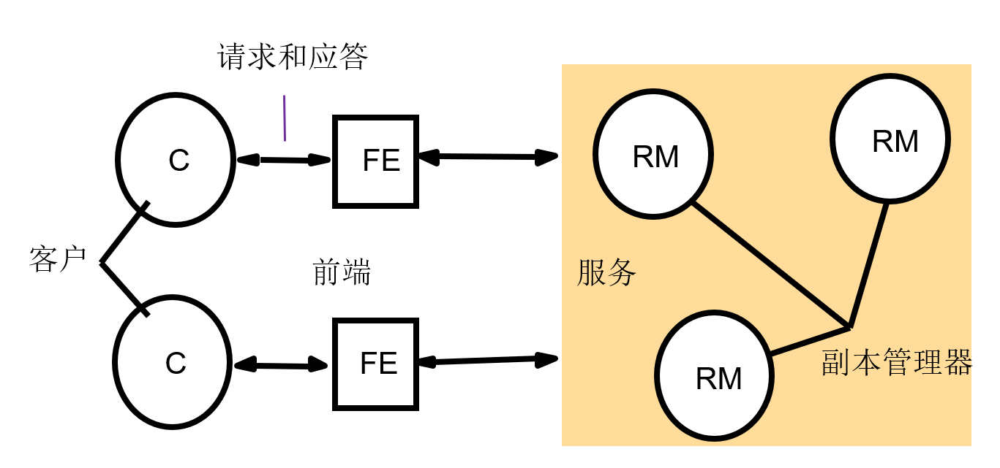
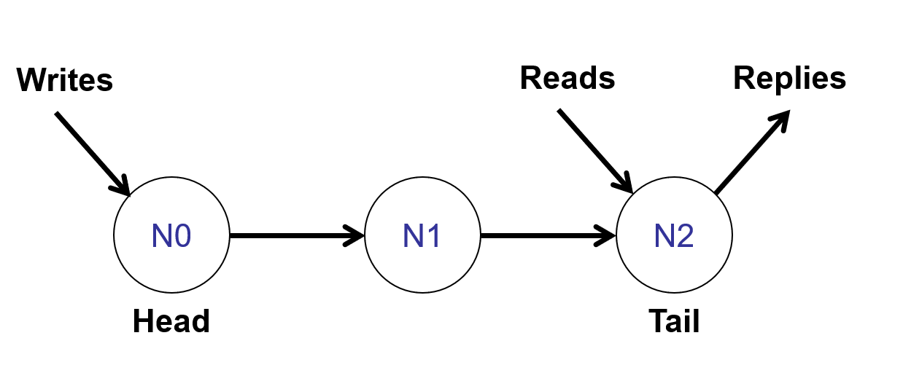
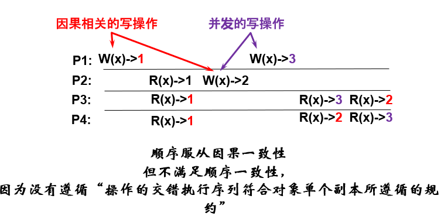
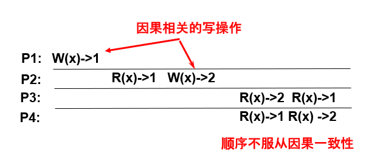
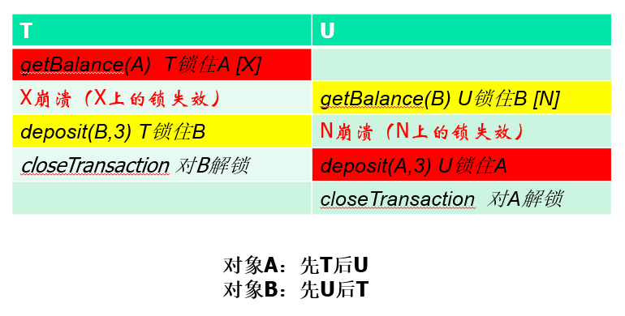
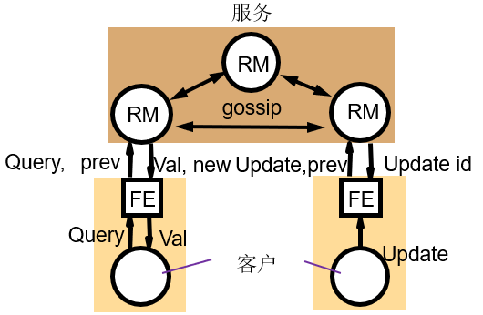
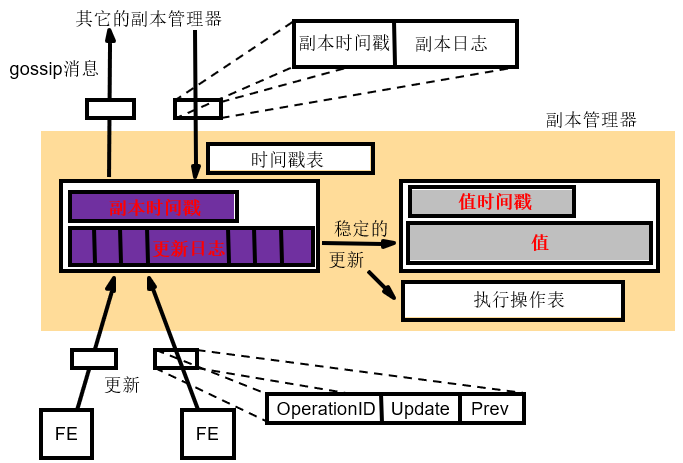

# 分布式系统第7章
## 基础概念
复制：在多个节点上保存相同数据的一个副本。

一个拥有数据库拷贝的节点称为副本管理器。

### 复制的动机
- 增强性能
  - 负载均衡
  - 资源缓存
- 提高可用性
  - n个服务器单个出现故障的为$p$，则至少一个副本可用的概率为$1-p^n$.
  - 当网络发生分区或客户端出现断开连接状态，仍可访问本地或当前可用的副本。
- 增强容错能力
  - 正确性：允许一定数量和类型的故障。

### 复制的需求
数据在同一个域的多个服务器之间进行资源缓存和透明复制。
- 复制透明性
  - 对客户屏蔽多个物理拷贝的存在。
  - 客户仅对一个逻辑对象进行操作。
- 一致性
  - 在不同应用中有不同强度的一致性需求。
  - 复制对象集合的操作必须满足应用需求。

## 系统模型

前端
- 接收客户请求。
- 通过消息传递与多个副本管理器进行通信。

副本管理器
- 接收前端请求。
- 对副本执行原子性操作。
- 副本管理器是一个状态机：当前状态+一组序列操作->一个新的确定状态。

### 副本对象的操作
1. 请求：前端向一个或多个副本管理器发送请求。
2. 协调：保证执行的一致性。
   - 是否执行请求达成一致。
   - 确定该请求相对于其他请求的顺序。
3. 执行：副本管理器执行请求，请求效果可去除。
4. 协调：就提交请求的执行结果达成一致，共同决定提交或放弃。
5. 响应：一个或多个副本管理器响应前端。

## 容错服务
容错服务是指在进程出现故障时仍能保证提供正确的服务。

复制是提高系统容错能力的有效手段之一。
- 为用户提供一个单一的镜像。
- 副本之间需要保持严格的一致性。

副本之间的不一致将导致容错能力失效。

### 容错服务模型及判断标准
复杂系统正确行为的判断标准
- 线性化能力
- 顺序一致性
- 因果一致性
- 最终一致性

#### 可线性化
目标：
- 所有操作都在单个副本上操作。
  - 尽管事实上是在多个副本操作。
- 每一个读操作都返回最新的值。

一个被复制的共享对象服务，如果对于任何执行，存在一个全体客户操作的交错序列，满足以下两个准则，则称该服务是可线性化的：
- 操作的交错执行序列符合对象单个副本所遵循的规约。
- 操作的交错执行序列和实际进行中的次序实时一致。

理解：
- 系统应该造成单个副本的错觉。
- 无论哪个客户，读都应返回最近写的结果。
- 无论哪个客户，所有后续读都应返回相同的结果，直至下一次写。

可线性化技术——链式复制

- 串行化写入：所有写入操作都必须经过唯一的链首，这确保了写入操作的全局顺序。
- 读取最新数据：只有链尾会向客户端发送最终的写入确认和处理所有的读取操作。由于写入沿着链条传播至链尾才算完成，因此，链尾总是包含所有已经确认的写入。

#### 顺序一致性
线性化能力对实时性要求过高，更多的时候要求顺序一致性。

一个被复制的共享对象服务被称为顺序一致性，满足以下两个准则：
- 操作的交错执行序列符合对象单个副本所遵循的规约。
- 操作在交错执行中的次序和每个客户程序中执行的次序一致。
  - 这就是说，不需要考虑不同客户端的操作的时间排序，只要保证每个客户端内的操作次序不变就行。

我的理解是：
所有操作排列成一个全局串行顺序：
- 每个客户端的操作再这个全局顺序中保持自身的先后顺序。
- 每个读操作，必须能读到这个全局顺序中，这个数据最近一次写操作的结果。

与可线性化的比较：
- 相同点：两者都希望造成单个副本的错觉。
- 不同的
  - 可线性化关心时间。
  - 顺序一致性关系程序的次序。

#### 因果一致性
- 所有进程必须以相同的次序看到因果相关的写操作。
- 不同的进程可能会以不同的次序看到并发的写操作。

因果关系：
- 同一客户端的操作顺序。
- 读写依赖：客户端先执行读操作A，再执行写操作B，那么AB之间有因果关系。
- 写读写传递：如果A->B B->C，那么A->C也有因果关系。

因果关系：P1[W(x)->1] -> P2[R(x)->1] -> P2[W(x)->2].

由于不存在一个操作交错执行序列，能够同时满足P3 P4的后两个读操作的输出，所以不符合顺序一致性。

#### 最终一致性
网络分区
- 一个副本管理器组分为两个或更多的子组。
- 一个子组的成员可相互通信，不同子组的成员不能通信。

如果没有发生分区，相互冲突的两个事务之一将被放弃，当分区存在时，冲突事务允许在不同分区中提交。

在存在网络分区的情况下：
- 为了保持副本的一致，系统需要阻塞。
- 如果仍为不同分区的请求提供服务，那么副本将出现差异。

CAP
- Consistency
- Availability
- Partition

在P存在的情况下，只能二选一。

最终一致性：
- 副本管理器值根据它们局部的状态处理。
- 如果没有更多的更新，最终所有的副本管理器会处于相同的状态。

### 容错服务方案
被动复制方案（支持可线性化技术）：
- 一个主副本管理器和多个次副本管理器。
  - 若副本管理器出现故障，则某个备份副本管理器将提升为主副本管理器。
- 事件次序
  - 请求：前端将请求发送给主副本管理器。
  - 协调：主副本管理器按接受次序对请求排序。
  - 执行：主副本管理器依次执行请求并存储应答。
  - 协定
    - 若请求为更新操作，则主副本管理器向每个备份副本管理器发送更新后的状态、应答和唯一标识符。
    - 备份副本管理器返回确认。
  - 响应
    - 主副本管理器响应前端。
    - 前端将应答发送给客户。

主动复制方案（只具备顺序一致性，不具备线性化能力）：
- 副本管理器地位对等，前端组播消息至副本管理器组。
- 事件次序：
  - 请求：前端使用全序、可靠的组播原语将请求组播到副本管理器组。
  - 协调：组通信系统以同样的次序将请求传递到每个副本管理器。
  - 执行：每个副本管理器以相同的方式执行请求。
  - 协定：由于组播的传递语义，并不需要协定。
  - 响应：
    - 每个副本管理器将应答发送给前端，接收的应答数量取决于故障类型的假设和组播算法。
    - 前端将应答发送给客户。

## 复制数据上的事务
在没有复制的系统中，事务以某种次序逐一执行，这通过确保事务的交错操作串行等价来实现。

对于客户而言，有复制对象的事务看上去应该和没有复制对象的事务一样。

单拷贝串行化：作用于复制对象上的事务应该和它们在一个对象集上的一次执行具有一样的效果，这种性质叫做单拷贝串行化。

### 可用拷贝复制
该方案允许某些副本管理器暂时不可用。

- 读请求可由任何可用副本管理器执行，而写请求必须由所有可用副本管理器执行。
- 若可用的副本管理器集没有变化，本地的并发控制和读一个/写所有复制一样，可获得单拷贝串行化，但如果执行过程中副本管理器故障或恢复，需要额外验证。

#### 副本管理器集无变化
读一个 行为有可能导致死锁，但可保证串行等价。

#### 副本管理器集变化
不能保证单拷贝串行化，需要额外的并发控制。

#### 本地验证
确保任何故障或恢复不会在事务执行中发生。

事务提交前检查已访问的副本管理器集是否变化，如在事务执行过程中副本管理集发生变化则放弃该事务。

本地验证可用保证串行等价。

## gossip体系结构
gossip是异步、去中心化的复制协议。

gossip的特点：在一个有界网络中，每个节点都随机地与其他节点通信，经过一番杂乱无章的通信，最终所有节点的状态都会达成一致。每个节点最初可能知道所有其他节点，也可能仅知道几个邻居节点，只要这些节点可以通过网络连通，最终它们的状态都是一致的。

### 结构

- 前端可以选择副本管理器。
- 提供两种基本操作：查询+更新。
- 副本管理器定期通过gossip消息来传递客户的更新。

### 前端的版本时间戳
为了控制操作处理次序，每个前端维持了一个向量时间戳，用来反映前端访问的最新数据值的版本。

由于gossip数据同步有延迟，时间戳能记录客户端访问到的是哪个副本的哪个版本的对象。

向量时间戳的长度等于系统中副本管理器的数量，初始每个维度的值都是0.

前端收到副本的时间戳，会通过逐维度取最大值的方式来合并。

版本时间戳被放入每一个请求中，与更新或者查询操作的描述一起发送给副本管理器。

客户通过访问相同的gossip服务和相互直接通信来交互数据。

副本管理器处理请求后，会把自己的向量时间戳返回给前端，前端再把自己的时间戳和副本返回的时间戳合并，这样前端就能记录那些副本的数据版本已经被自己观察到了。

### 副本管理器状态

- 值：副本管理器维护的应用状态的值。
  - 始于特定初始值，状态完全是施加更新结果。
- 值的时间戳：更新的向量时间戳。
  - 包含了每个副本管理器的条目，更新操作时被更新。
- 更新日志：记录以下更新操作：
  - 更新操作不稳定，不稳定的更新需要保留而不是处理。
    - 不稳定是指因果未就绪，后面会写。
  - 更新是稳定的，但还没收到更新被其他所有副本管理器收到的确认。
- 副本的时间戳：已经被副本服务器接收到的更新。
- 已执行操作表：记录已经执行的更新的唯一标识符，防止重复执行。
- 时间戳表：时间戳来自gossip信息，确定一个更新已经应用于所有的副本管理器。

### 查询和更新操作流程
- 请求：前端将请求发送至副本管理器。
  - 查询：前端阻塞。
  - 更新：默认前端立即返回，前端后台操作，为提高可靠性，客户也可以被阻塞到已经传给f+1个副本管理器后继续执行（f是允许故障的副本数）。
- 更新响应：副本管理器收到更新就立即回答，但这并不是传达更新完成的响应，而是收到确认。
- 协调：收到请求的副本管理器并不操作，直到它能根据所要求的次序约束处理请求为止。
- 执行：副本管理器执行请求。
- 查询响应：副本管理器对查询请求做出应答。
- 协定：副本管理器通过交换gossip消息进行相互更新，gossip消息的交换是偶尔的。触发消息交换的情况如下：
  - 本地收集了若干更新操作。
  - 处理新请求时，发现需要其他副本已发送但本地缺失的更新。

### 系统的两个保证
- 随着事件的推移，每个用户总能获得一致的服务。
  - 副本管理器提供的数据能反映迄今为止客户以及观测到的更新。
- 副本之间松弛的一致性
  - 所有副本管理器最终将收到所有更新。
  - 两个客户可能会观察到不同的副本。
  - 客户可能观察到过时数据。
### 查询操作
副本管理收到查询：
- q.pre(前端值的最新时间)<rm.val.ts(副本管理器值的时间戳)：副本管理器返回值与时间戳.
  - 此时副本管理器的当前数据版本比前端已经观察到的版本新。
  - 返回(rm.val, rm.val.ts).
- 否则：将查询请求保留在队列，等待其他副本通过gossip同步所需的更新。
  - 此时说明副本管理器的数据版本比前端观察到的版本旧。

前端收到查询响应：合并时间戳。

### 按因果次序处理更新
前端发送更新请求：
- u.op：更新类型+参数。
- u.prev：前端的时间戳。
- u.id：更新的唯一标识符。

副本管理器接收更新请求：
- 丢弃：如果u.id已经在已执行操作表中，则丢弃。
- 记录日志：处理并记录到更新日志。
  - 更新时间戳
    - 增加本地计数，增加自己所对应的时间戳分量。
    - 计算新时间戳，基于u.prev，将本地对应的时间戳分量覆盖u.prev相应分量。
    - 写入日志。
- 响应前端
  - 将新的时间戳返回给前端，前端更新自己的时间戳。
- 更新的稳定性判断
  - 对于日志中的记录r，需要满足以下条件才能从不稳定状态转为可执行的稳定状态：
    - $r.u.prev \leq rm.val.ts$
    - 只有当更新依赖的所有前置操作都已经包含在本地的已稳定操作集合中时，该更新才因果就绪。
    - 如果上述条件成立，说明r的所有因果依赖都已经被稳定并被应用，因此r可以被视为稳定并且可以执行。
- 操作满足稳定性条件后，副本管理器将执行该更新，并更新其状态。
  - 应用更新：修改本地值。
  - 更新值的时间戳：合并更新。
  - 记录已执行：合并至已执行表格。

### gossip消息
副本管理器可以发送包含一个或多个更新消息的gossip消息，使其他副本管理器的状态更新为最新的。

gossip消息包含日志和副本时间戳。

副本管理器a发送gossip消息至副本b：
- a发送消息内容：
  - 日志。
  - 副本时间戳。
- b收到a的gossip消息：
  - 若b的时间戳大于等于a，说明a的数据版本旧，丢弃。
  - 否则，说明至少有一个副本管理器的行为b没记录。
    - 合并副本时间戳。
    - 合并日志。
    - 执行b日志中任何以前没有执行并已经稳定的更新，即$r.u.pre\leq rm.val.ts && r.processed == false$
      - 设置日志记录已被处理。
      - 更新数值。
      - 更新时间戳，合并r.ts.

只有当所有其他的副本管理器都已经通过了gossip机制确认已经接收并处理了更新r，及其之前所有由某一副本管理器发布的更新时，创建r的副本管理器才能将r从日志中移除。

### 更新传播
gossip消息发送的频率由应用需求来决定。

选择副本管理器交换gossip消息的选法：
- 随机策略：使用加权概率来选择。
  - 比如距离加权。
- 确定策略：使用副本管理器状态的函数来选择。
- 拓扑策略：将副本管理器安排为一个固定图。

#### 强制更新和即时更新
这两种更新比一般的因果更新更严格，需要确保其在系统中的执行顺序是确定的。

之前的gossip消息传递，重点在于操作的执行不会违反因果关系。

强制/即时更新必须引入主副本来击中生成一个唯一的序列号，把这个序列号附加到更新上，从而强制所有副本以完全一致的顺序执行它。

### 缺陷
- 不适合接近实时的更新复制。
- 可拓展性问题：随着副本管理器数量的增长，需要传递的gossip消息和使用的时间戳大小也会增长。
