---
title: "分布式系统（四）"
description: "分布式系统第五章"
date: "2025-11-25 15:35:59"
category: "计算机基础"
originalCategory: "分布式系统"
track: "Computer Science"
level: foundation
status: ready
published: true
minutes: 8
order: 1000
prerequisites: []
tags: ["DS"]
photos: "banner.jpg"
source: "_posts"
---# 分布式系统第五章
## 事务
### 基础概念
由客户定义的针对服务器对象的一组操作，它们组成一个不可分割的单元，由服务器执行。

目标：在多个事务访问对象以及服务器面临故障的情况下，保证所有由服务器管理的对象始终保持一个一致的状态。

### 事务的故障类型
- 硬盘故障：对持久性存储的写操作可能发生故障。
- 服务器故障。
- 通信故障：消息传递可能有任意长的延迟，消息可能丢失、重复或者损害。

事务能够处理进程的崩溃故障和通信的遗漏故障，但不能处理拜占庭行为。

拜占庭行为是分布式系统中节点的“恶意/任意故障行为”，指节点不仅会崩溃，还会主动发送错误、伪造、矛盾的信息，甚至故意破坏共识流程，是比崩溃故障更严重的故障类型。

### 事务的特性
ACID：原子性、一致性、隔离性、持续性。

#### 原子性
事务必须全有或者全无：
- 处理错误，如死锁、网络异常、系统崩溃等。
- 放弃时回滚写入。

#### 一致性
事务将系统从一个一致性状态转换到另一个一致性状态。
- 一致性状态：数据库满足一定的不变性即完整性约束。

#### 隔离性
事务执行过程中的中间效果对其他事务不可见。
- 事务拥有整个数据库。
- 并发对事务不可见。

#### 持久性
一旦事务完成，它的所有效果将被保存到持久存储中。

### 事务的三种执行情况
- 成功执行。
- 被客户放弃。
- 被服务器放弃。

一旦事务被放弃，服务器必须保证清除所有效果，使该事务的影响对其他事务不可见。

### 并发控制
#### 更新丢失问题
两个事务都读取一个变量的旧数据并用它来计算新数据。
#### 不一致检索
更新与检索并发。

#### 串行等价
如果并发事务交错执行操作的效果等同于按某种次序一次执行一个事务的效果，那么这种交错执行是一种串行等价的交错执行。

使用串行等价性作为并发执行的判断标准，可以防止更新丢失和检索不一致的问题。

串行等价避免更新丢失：

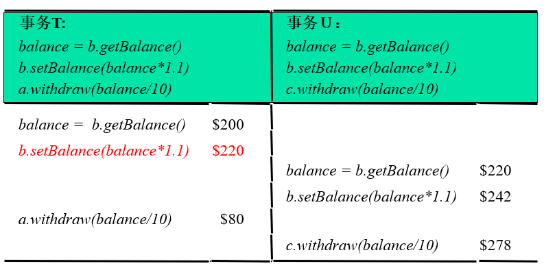

串行等价避免检索不一致：

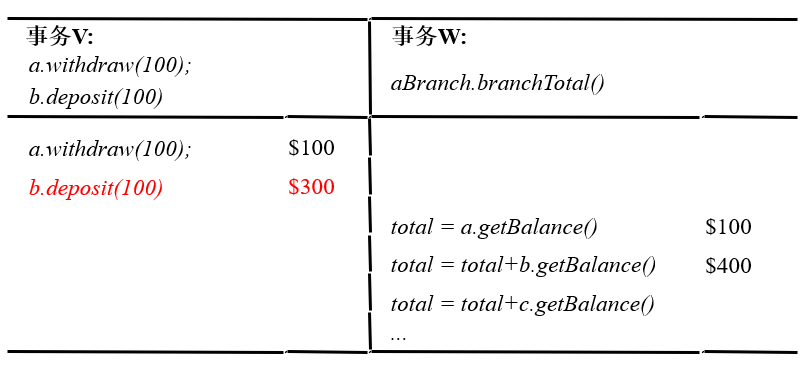

~~虽然但是，这哪里交错执行了啊(#`O′)~~

#### 冲突操作
如果两个操作的执行效果和它们的执行次序有关，那么这两个操作相互冲突。

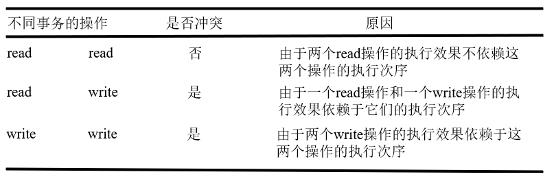

#### 串行等价的充分必要条件
两个事务串行等价的充要条件是：两个事务中所有的冲突操作都按相同的次序在它们访问的对象上执行。

串行等价可作为一个标准用于设计并发控制协议。

并发控制协议能够将访问的并发事务串行化。

非串行等价：

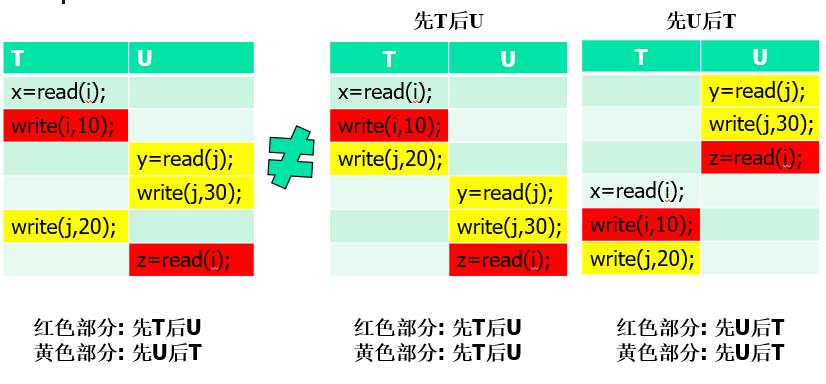

串行等价：

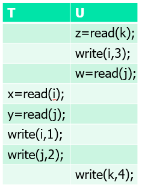

#### 事务放弃时的恢复
脏数据读取：某个事务读取了另一个未提交事务写入的数据。

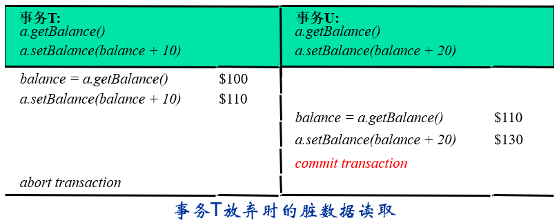

- 推迟事务提交，直到它读取更新的结果的其他事务都已提交。
- 连锁放弃：
  - 某个事务的放弃可能导致后续更多事务的放弃。
  - 防止方法：只允许事务读取已提交事务写入的对象。

过早写入：数据库在放弃事务时，将变量的值恢复到该事务所有write操作的前映像。

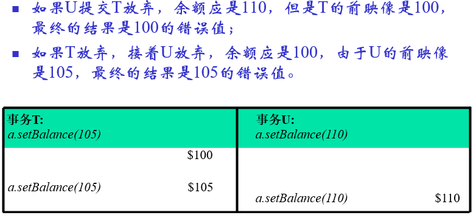

为了保证使用前映像进行事务恢复时，获得正确的结果，write操作必须等到前面修改同一对象的其他事务提交或放弃后才能进行。

- 严格执行：read和write操作都推迟到写同一对象的其他事务提交或放弃后进行。
- 临时版本：
  - 为了事务放弃后，能够清除所有对象的更新。
  - 事务的所有操作更新将值存储在自己的临时版本中。
  - 事务提交时，临时版本的数据才会用来更新对象。

## 锁
### 互斥锁
互斥锁是一种简单的事务串行化实现机制。
- 事务访问对象前请求加锁。
- 若对象已被其他事务锁住，则请求挂起，直至对象被解锁。

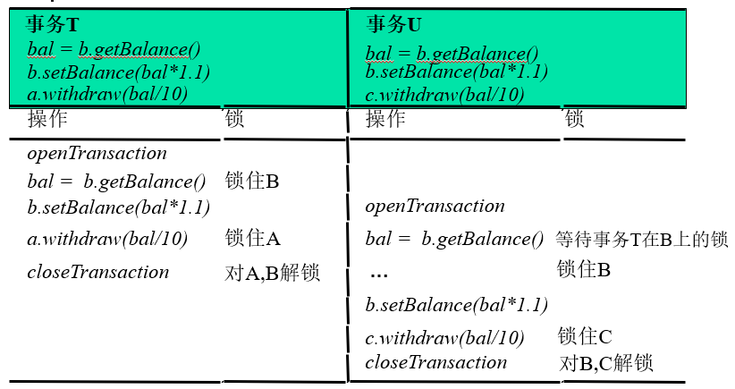

### 两阶段加锁
为了保证两个事务的所有冲突操作对必须以相同的次序执行，事务在释放任何一个锁之后，都不允许再申请新的锁。

每个事务都进行两阶段加锁：
- 第一个阶段：事务不断地获取新锁。
- 第二个极端：事务释放它的锁。

目的：防止不一致检索和更新丢失。

### 严格的两阶段加锁
所有在事务执行过程中获取的新锁，必须在事务提交或放弃后才能释放，称为严格的两阶段加锁。

为了保证可恢复性，锁必须在所有被更新的对象写入持久存储后才能释放。

目的：防止事务放弃导致的脏数据读取，过早写入等问题。

### 并发控制使用的粒度
- 如果并发控制同时应用到所有对象，服务器中对象的并发访问将会受到严重限制。
- 如果所有账户都被所著，任何时候只有一个柜台能处理联机事务。
- 访问必须被串行化的部分对象应尽量少。

### 读锁和写锁
- 目的：提高并发度。
- 支持多个并发事务同时读取某个对象。
- 允许一个事务写对象。

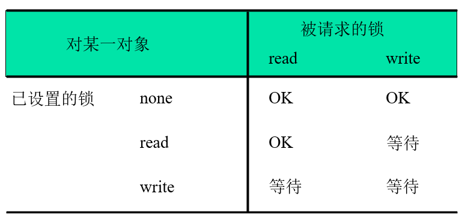

### 死锁
死锁是一种状态，在该状态下一组事务中的每一个事务都在等待其他事务释放某个锁。

#### 预防死锁
- 每个事务在开始运行时，锁住它要访问的所有对象
  - 简单的原子操作
  - 不必要的资源访问限制
  - 无法预计将要访问的对象
- 预定次序加锁
  - 过早加锁
  - 减少并发度

#### 死锁检测
- 维护等待图。
- 检测等待图中是否存在环路。
- 若存在环路，则放弃一个事务。

#### 锁超时
- 每个锁都有一个时间期限。
- 超过时间期限的锁称为可剥夺锁。
- 若存在等待可剥夺锁保护的对象的事务，则对象解锁。

但可能出现，还没有死锁的情况，只是事务运行需要很长的处理时间，该事务申请的锁被剥夺，事务被放弃。

### 锁机制的缺点
- 锁的维护开销大。
- 会引起死锁。
- 并发度低。

## 乐观并发控制
在大多数应用中，两个客户事务访问同一个对象的可能性很低。

### 方法
- 访问对象时不做检查操作。
- 事务提交时检测冲突。
- 若存在冲突，则放弃一些事务。

### 事务的三个阶段
#### 工作阶段
每个事务拥有所修改对象的临时版本：
- 放弃时没有副作用
- 临时值对其他事务不可见

每个事务维护访问对象的读集合和写集合。

#### 验证阶段
在收到closeTransaction请求，判断是否与其他事务存在冲突：
- 不存在则提交。
- 存在，放弃当前事务或冲突的事务。

#### 更新阶段
- 只读事务通过验证立即提交。
- 写事务在对象的临时版本记录到持久存储器后提交。

### 事务的验证
通过读写冲突规则，确保某个事务的执行对其他重叠事务而言是串行等价的。

重叠事务是指该事务启动时还没有提交的任何事务。

每个事务在进入验证阶段前被赋予一个事务号：
- 事务号是整数，按升序分配，定义了事务所处的时间位置。
- 事务按事务号顺序进入验证阶段。
- 事务按事务号提交。

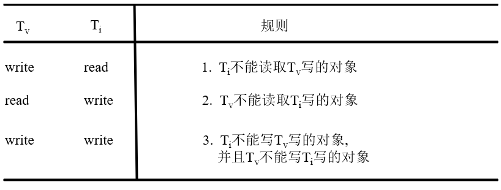

每次仅允许一个事务处于验证和更新阶段，两个事务在更新阶段五冲抵，规则3自动满足，所以只需要保证规则1 2满足即可。

#### 向后验证
假设Tv为正在验证的事务，而Ti为早就完成并提交的事务。

- 向后：较早的重叠事务（时间上更早的事务）。
- 规则1： Ti不能读取Tv写的对象
  - Ti读时Tv还没有写（谜语人发言）
    - 实际上是Tv只写了临时副本，并没有写实际数值，因为验证阶段Tv还没有提交，所以他说Tv没有写。
  - 自动满足
- 规则2： Tv不能读取Ti写的对象。
  - 需要验证。

所以我们只需要检查它的读集是否和其他较早重叠事务的写集是否重叠。

较早重叠事务指的是在Tv的工作阶段开始后、Tv进入validation阶段之前，启动的所有事务。

算法：
```
startTn：Tv进入工作阶段时，已提交事务的最大事务号。
finishTn：Tv进入验证阶段时，已分配的最大事务号。

Boolean valid = true
For ( int Ti = startTn +1; Ti <= finishTn; Ti ++) {
  if (read set of Tv intersects write set of Ti)valid = false
}
```

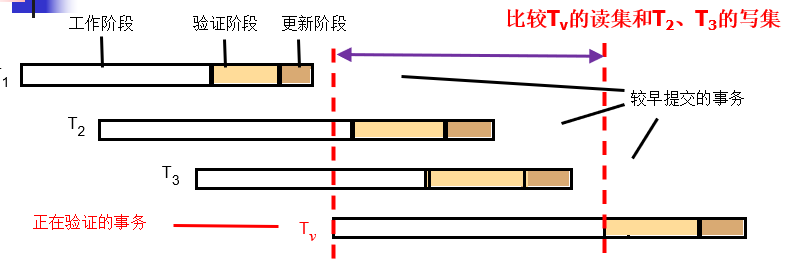

若验证失败，则放弃当前进行验证的事务。

#### 向前验证
- 向前：重叠的活动事务（此刻处于工作阶段的事务）。
- 规则1： Ti不能读取Tv写的对象。
  - 需要验证。
- 规则2： Tv不能读取Ti写的对象。
  - 自动满足。

算法：
假设活动事务的id为active1~activen.

```
Boolean valid = true
for ( int Tid = active1 ; Tid <= activen; Tid ++){
  if (write set of Tv intersects read set of Tid) valid = false
}
```

验证失败后：
- 放弃当前验证事务。
- 推迟验证。
- 放弃所有冲突的活动事务，提交已验证事务。

#### 向前验证和向后验证的比较
- 向前验证在处理冲突时较为灵活。
- 向后验证将较大的读集合和较早事务的写集合进行比较。
- 向前验证将较小的写集合和活动事务的读集合进行比较。
- 向后验证需要存储已提交事务的写集合。
- 向前验证不允许在验证过程中开始新事务。


### 饥饿
由于冲突，某个事务被反复放弃，阻止它最终提交的现象。

利用信号量，实现资源的互斥访问，避免事务饥饿。

## 时间戳排序
### 基本思想
事务中的每个操作在执行前，先进行验证。

时间戳：
- 每个事务在启动时被赋予了一个唯一的时间戳。
- 时间戳定义了该事务在事务提交序列中的位置。

冲突规则：
- 写请求有效：对象的最后一次读访问或写访问由一个较早的事务执行。
- 读请求有效：对象的最后一次写访问由一个较早的事务执行。

### 基于时间戳的并发控制
临时版本：
- 写操作记录在对象的临时版本中。
- 临时版本中的写操作对其他事务不可见。

写时间戳和读时间戳：
- 已提交对象的写时间戳比所有临时版本都要早。
- 读时间戳集用集合中的最大值来代表。
- 事务的读操作作用于时间戳小于该事务时间戳的最大写时间戳的对象版本上。

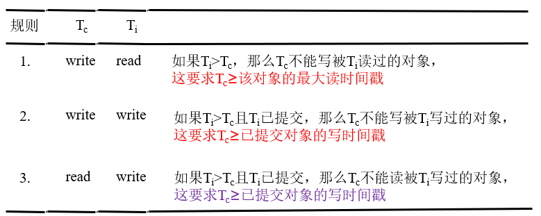

~~这些说的不像人类的语言~~

总结为：
- 如果$T_c$想要写入$X$，它必须确保它的时间戳不小于任何已成功读取$X$的事务的时间戳。
- 如果$T_c$想要写入$X$，它必须确保它的时间戳不小于任何已经提交对象$X$的写时间戳。
- 如果$T_c$想要读$X$，它必须确保它的时间戳不小于任何已经提交对象$X$的写时间戳。

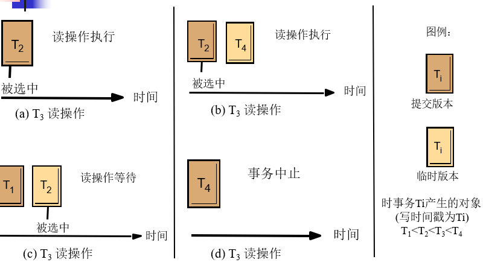

对图片T3想要进行读操作分析：
- a：T2已经提交了一个时间戳小于T3的版本，T3读取T2的提交版本。
- b：T2已经提交了一个时间戳小于T3的版本，同时T4正在执行写操作
  - T2小于T3，且已经提交。
  - T4大于T3，尚未提交。
  - 选择T2版本。
- c：T1已经提交了一个时间戳小于T3的版本，T2只有临时版本，T3必须等待T2完成，选择T2.
- d：T4提交了一个时间戳大于T3的版本，T3没有可选的，事务被放弃。

总结而言，对于读操作：
- 该版本必须是已提交的。
- 该版本的写入事务的时间戳$TS$必须小于或等于$TS(T_c)$。

对于写操作：
$T_c$的时间戳$TS(T_c)$必须不小于$X$的最大读时间戳$RTS(X)$和最大写时间戳 $WTS(X)$中的最大值。


## 并发控制方法比较
- 时间戳排序
  - 静态地决定事务之间的串行顺序。
  - 对读操作占优的事务而言，由于两阶段加锁机制。
- 两阶段加锁
  - 动态决定事物之间的串行顺序。
  - 对更新操作占优的事务而言，由于时间戳排序。
- 时间戳排序和两阶段加锁均属于悲观方法
  - 时间戳排序将立即放弃事务。
  - 加锁让事务等待，但如果出现死锁将立即放弃事务。
- 乐观方法
  - 并发事务之间的冲突较少时，性能较高。
  - 放弃事务时，需要重复大量工作。
- 悲观方法
  - 简单。
  - 并发度低。
