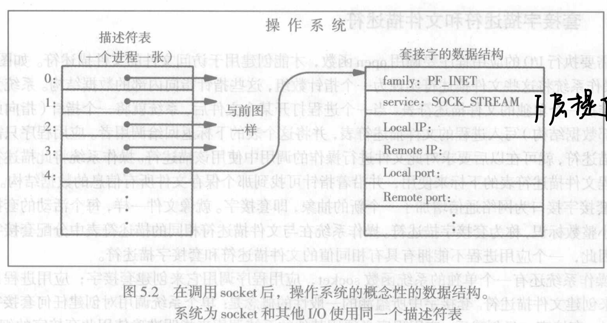
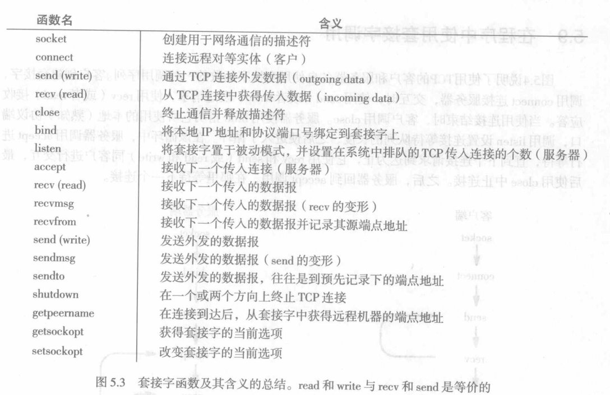
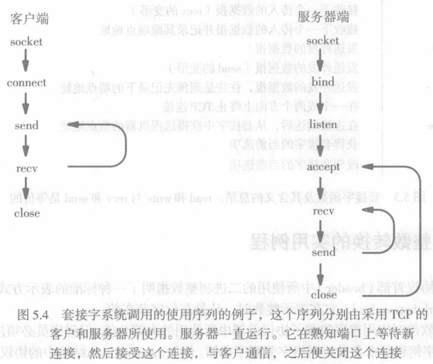

---
title: "套接字编程（一）"
description: "协议的程序接口与套接字API"
date: "2023-10-16 10:16:43"
category: "计算机基础"
originalCategory: "套接字编程"
track: "Computer Science"
level: foundation
status: ready
published: true
minutes: 6
order: 1000
prerequisites: []
tags: ["socket", "c"]
photos: "banner.jpg"
source: "_posts"
---# 协议的程序接口
## 不精确指明的协议软件接口
TCP/IP标准没有规定应用软件与TCP/IP协议软件如何接口的细节；这些标准只建议了所需的功能集，并允许系统设计者选择有关API的具体是实现细节。
### 优点与缺点
- 优点：提供了灵活性和容错能力；意味着设计者既可以使用过程的接口方式，也可以使用消息传递的接口方式。
- 缺点：设计者可以使得不同操作系统的接口的实现细节有所不同，应用程序在不同机器间的移植性更差。
## 接口功能
- 分配用于通信的本地资源
- 指定本地和远程通信端点
- （客户端）启动连接
- （客户端）发送数据报
- （服务器端）等待连接到来
- 发送或接收数据
- 判断数据何时到达
- 产生紧急数据
- 处理到来的紧急数据
- 从容终止连接
- 处理来自远程端点的连接终止
- 异常终止通信
- 处理错误条件或连接异常终止
- 连接结束后释放本地资源

## 概念性接口
TCP/IP标准为TCP/IP指明了一个概念性接口，其作用是提供示例。
- 概念性接口定义为一组过程和函数
- 提出了每个过程或函数所要求的参数以及他们所执行操作的语义

TCP/IP标准定义的概念性接口并不指明数据的表示或编程的细节；它仅仅提供了一种可能的API的例子，操作系统可将此API提供给使用TCP/IP的应用程序
## 网络通信的两种基本方法
- 设计者发明一组新的系统调用，应用程序用它们来访问TCP/IP
- 设计者使用一般的I/O调用访问TCP/IP

## Linux系统提供的基本I/O功能
- open：为输入或输出操作准备了一个设备或文件
- close：终止使用以前已打开的设备或文件
- read：从输入设备或文件中获得数据，将数据放到应用程序的存储器中
- write：将数据从应用程序的存储器传到输出设备或文件中
- lseek：转到文件或设备中的某个指定的位置
- ioctl：控制设备或用于访问该设备软件
## 将Linux I/O用于TCP/IP

- 拓展了文件描述符集，使应用进程可以创建能被网络通信所使用的描述符
- 拓展了read和write这两个系统调用，使其既可以同网络标识符一起使用，又可以同普通的文件标识符一起使用

# 套接字API
## 套接字的抽象
套接字接口为网络通信增加了一个新的抽象，即套接字
- 每个活动的套接字由一个小整数标识，称为套接字描述符
- 操作系统在与文件描述符相同的描述符表中分配套接字描述符
> 一个应用进程不能拥有具有相同值的文件描述符和套接字描述符
## 针对套接字的系统数据结构

- 当应用进程调用socket后，操作系统分配新的数据结构保存通信所需信息，并在文件描述符表中填入一个新的条目，含有指向这个数据结构的指针
- 在套接字能够被使用前，创建该套接字的应用程序必须用其他系统调用把套接字数据结构中的这些信息填上

## 主动套接字与被动套接字
- 被动套接字：服务器将套接字配置为等待传入连接
- 主动套接字：客户端用来发起连接的套接字

主动套接字与被动套接字唯一不同在于应用使用它们的方式；两种套接字最初的创建方式是相同的

## 指明端点地址
> 创建套接字时，并没有包含如何使用套接字
- TCP/IP协议定义了通信端点，包括IP地址和协议端口号
- TCP/IP各协议都使用一种单一的地址表示方式，其地址族用符号常量AF_INET表示

> TCP/IP协议族：PF_INET
## 类属地址结构
- 套接字定义了一个一般化结构，可为所有端点地址使用(地址族，该族中的端点地址)
  - 地址族：包含一个常量，表示预定义的地址类型
  - 端点地址字段包含端点地址，使用地址族所指明的那种地址类型的标准表示方式
### sockaddr结构
包含：
- 一个占2字节的地址族标识符
- 一个占14字节的数组存储地址
```
struct sockaddr{ /* struct to hold an address*/
    u_char sa_len;  /* total length */
    u_short sa_family;  /* typr of address*/
    char sa_data[14];  /*value of addres*/
}
```
sockaddr适用于AF_INET族中的地址
### sockaddr_in结构
包含：
- 一个用来识别地址类型的2字节字段
- 一个2字节的端口号
- 一个4字节的IP地址字段
- 一个还未使用的8字节字段

```
struct in_addr{
  u_long s_addr;
}
struct sockaddr_in {
    u_char sin_len;
    u_short sin_family;
    u_short sin_port; /*protocol port number*/
    struct in_addr sin_addr;
    char sin_zero[8];  /*unused (set to zero)*/
}
```
只使用TCP/IP协议的应用程序可以只使用sockaddr_in结构

## API中的主要系统调用套接字
套接字调用分为两种
- 主调用：提供对下层功能的访问
- 实用例程：为程序员提供帮助

### socket调用
```
int socket(int domain, int type, int protocol)
/*
  domain:域类型，指明使用的协议栈；TCP/IP使用PF_INET
  type:指明需要的服务类型
      SOCK_STREAM:TCP协议，流服务
      SOCK_DGRAM:数据报服务，UDP协议
  protocol:一般都取0
  eg:s=socket(PF_INET,SOCK_STREAM,0);
*/

```
应用程序用socket函数创建一个新的套接字，这个新的套接字可以用于网络通信。
- 指明应用程序将使用的协议族（TCP/IP使用PF_INET）
- 使用的协议
- 所需要的服务类型

### connect调用
```
int connect(int sockfd,struct sockaddr* server_addr,int sockaddr_len)
/*
  sockfd:套接字描述符，指明创建连接的套接字
  server_addr:指明远程端点：IP地址和端口号
  sockaddr_len:地址长度
  eg:connect(s,remaddr,remaddrlen);
*/
```

在创建了一个套接字后，客户程序调用connect以便同远程服务器建立主动连接。
- 指明远程端点，包括远程机器IP地址以及协议端口号

具体演示：
```
#include<string.h>
#inclue<sys/types.h>
#include<sys/socket.h>
#define DEST_IP "166.11.69.52"
#define DEST_PORT 23

int main(){
  int sockfd;
  struct sockaddr_in dest_addr;

  sockfd = socket(PF_INET,SOCKET_STREAM,0);

  dest_addr.sin_family = AF_INET;
  dest_addr.sin_port = htons(DEST_PORT);
  dest_addr.sin_addr.s_addr = inet_addr(DEST_IP);
  bzero(&(dest_addr.sin_zero),8);

  connet(sockfd,(struct sockaddr*)&dest_addr,sizeof(dest_addr));

  ······
}
```
### send调用
```
int send(int sockfd,const void* data,int data_len,unsigned int flags)
/*
  sockfd:套接字描述符
  data:指向发送数据的指针
  data_len:数据长度
  flags:一般为0
  eg:send(sockfd,req,strlen(req),0);
*/
```
功能：
- 在TCP连接上发送数据，返回成功传送数据的长度，出错时返回-1
- send会将外发数据复制到OS内核中，也可以使用send发送“面向连接”的UDP报文


客户和服务器都使用send在TCP连接上发送数据。客户使用send传输请求，而服务器使用send传输应答。
- 数据将要发往的套接字描述符
- 数据要发往的地址
- 数据的长度

send往往要将外发数据复制到操作系统内核的缓存里，并允许应用程序在通过网络传输数据的同时继续执行下去。

### sendto调用
```
int sendto(int sockfd,const void*data,int data_len,unsigned int flags,struct sockaddr* remaddr,int remaddr_len)
/*
  sockfd:套接字描述符
  data:指向发送数据的指针
  data_len:数据长度
  flags:一般为0
  remaddr:远端地址：IP地址和端口号
  remaddr_len:地址长度
  eg:sendto(sockfd,buf,sizeof(buf),(struct sockaddr*)&address,sizeof(adress));
*/
```
基于UDP发送数据报，返回实际发送的数据长度，出错时返回-1

### recv调用
```
int recv(int sockfd,viod *buf,int buf_len,unsigned int flags)
/*
  sockfd:套接字描述符
  buf:指向内存块的指针
  buf_len:内存块大小，以字节为单位
  flags:一般为0
*/
```
功能：
- 从TCP接收数据，返回实际接收的数据长度，出错时返回-1
- 客户和服务器都使用recv从TCP接收数据

### recvfrom调用
```
int recvfrom(int sockfd,void *buf,int buf_len,unsigned int flags,struct sockaddr*from,int fromlen)
/*
  sockfd:套接字描述符
  buf:指向内存块的指针
  buf_len:内存块大小，以字节为单位
  flags:一般为0
  from:远端的地址，IP地址和端口号
  fromlen:远端地址长度
*/
```

### close调用
```
close(int sockfd)
```
客户或服务器一旦结束使用某个套接字，便调用close将该套接字撤销。
- 若只有一个进程使用此套接字，close立即终止连接并撤销该套接字
- 若有多个进程共享某个套接字，close就把套接字的引用数减一，当此引用数降为0时，撤销该套接字

### bind调用
```
int bind(int sockfd,struct sockaddr* my_addr,int addrlen)
/*
  sockfd:套接字描述符
  my_addr:本地地址，IP地址和端口号
  addrlen:地址长度
*/
```

当套接字被创建时，它还没有任何关于端点地址的概念。应用程序调用bind以便为一个套接字指明本地端点地址。

- 对于TCP/IP协议，端点地址使用sockaddr_in结构，它包含了IP地址和协议端口号。

- 服务器主要使用bind来指明熟知端口号，它将在此熟知端口等待连接。

### listen调用
```
int listen(int sockfd,int input_queue_size)
```

套接字被创建后，直到应用程序采取进一步行动前，它既不是主动的也不是被动的。

面向连接的服务器用listen将一个套接字置为被动模式，并使其准备接收传入连接。

- 一个参数指明某个套接字处于被动模式
- 一个参数指明套接字所使用的队列长度

### accept调用
```
int accept(int sockfd,void *addr,int *addrlen)

/*
  sockfd:套接字描述符
  addr:提出连接请求的主机地址
  addrlen:地址长度
  eg:new_sockfd = accept(sockfd,(struct sockaddr*)&address,sizeof(address));
*/
```

对于TCP的套接字，服务器：
1. 调用socket函数创建一个套接字
2. 调用bind指明本地端口地址
3. 调用listen将其置于被动模式
4. 调用accept以获取接下去的传入连接请求

- 一个参数指明套接字，将从该套接字接收连接

1. accept为每个新的连接请求创建了一个新的套接字，并将这个新套接字的描述符返回给调用者。
2. 服务器只对这个新的连接使用该套接字，而用原来的套接字接收其他连接请求
3. 服务器一旦接收一个连接后，就可以在这个新的套接字上传送数据
4. 使用完该套接字后，服务器关闭套接字

### 在套接字中使用read和write
Linux中，程序员可以使用read代替recv，write代替send。

对TCP和UDP套接字而言，(read,recv)(write,send)语义一致。

### api集合

## 用于整数转换的实用例程
套接字例程含有一些在网络字节顺序和本地主机字节顺序间进行转换的函数

- 短转换例程（处理16位整数）
  - htons(host to netword short)将一个短整数从主机的本地字节顺序转换为网络字节顺序
  - ntohs(network to host short)将一个短网络字节顺序转换为一个本地字节顺序
- 长转换例程（处理32位整数）
  - htonl
  - ntohl

这样做可以使代码移植到任何机器上，而不管这台机器的本地字节顺序是什么

## 在程序中使用套接字调用

- 使用何种服务
  - SOCK_DGRAM:数据报服务，UDP协议
  - SOCK_STREAM:流服务，TCP协议
  - PF_INET:使用TCP/IP协议族
  - AF_INET:使用TCP/IP地址结构
- 在程序中需要引用
  ```
  #include<sys/types.h>
  #include<sys/socket.h>
  ```
