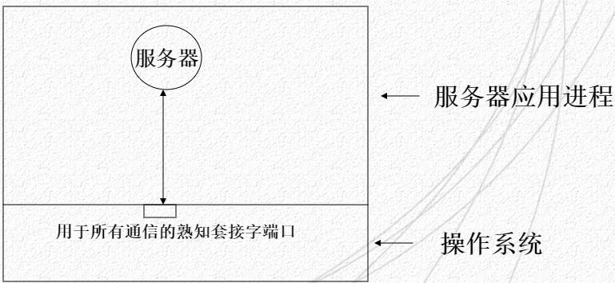
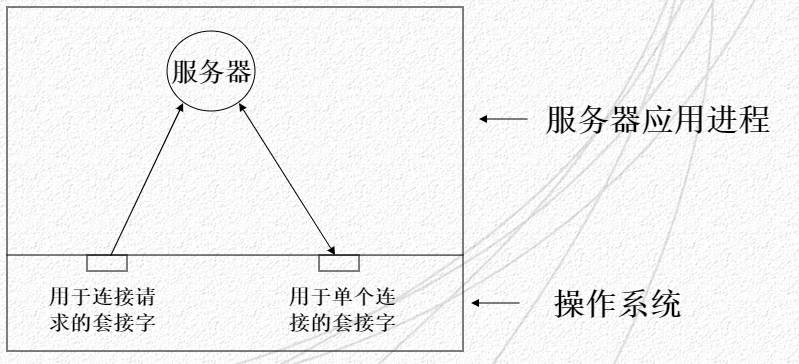
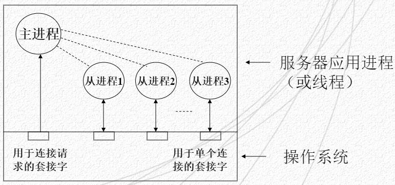
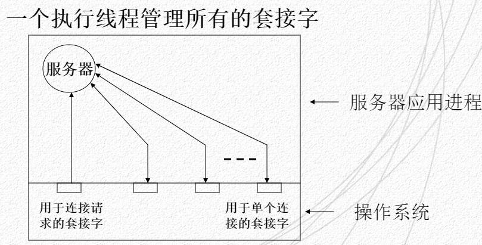

---
title: "套接字编程（四）"
description: "循环服务器与并发服务器"
date: "2023-11-17 19:27:13"
category: "计算机基础"
originalCategory: "套接字编程"
track: "Computer Science"
level: foundation
status: ready
published: true
minutes: 5
order: 1000
prerequisites: []
tags: ["socket", "c"]
photos: "banner.jpg"
source: "_posts"
---# 循环服务器概述
## 循环服务器
- 使用无连接传输，常见
- 使用面向连接的服务
- 特点
  - 每次处理时间都很少
  - 服务器实现简单

## 创建被动的套接字(passivesock.c)
### 创建一个过程隐藏创建被动套接字的细节
- 获得熟知的端口号，端口号的唯一性问题
- 使用什么协议
  - passiveTCP:使用面向连接的被动套接字
  - passiveUDP:本章学习，使用无连接的被动套接字
### passivesock
- 参数
  - 服务器名
  - 协议名
  - 连接请求队列所需要的长度
- 使用INADDR_ANY代替指定的本地IP地址

```
int passivesock(const char *service,
    const char *transport,int qlen)
{
    struct servent *pse;
    struct sockaddr_in sin;
    int s,type;

    memset(&sin,0,sizeof(sin));
    sin.sin_family = AF_INET;
    sin.sin_addr.s_addr = INADDR_ANY;

    if(pse = getservbyname(service,transport))
        sin.sin_port = htons(pse -> s_port);
    else if((sin.sin_port = htons((unsigned char)atoi(service)))==0)
        errexit(...) ;

    if(strcmp(transport,"udp") == 0)type = SOCK_DGRAM;
    else type = SOCK_STREAM;

    if(s = sock(PF_INET,type,0)< 0)errexit(...);

    if(bind(s,(struct sockaddr_in*)&sin,sizeof(sin))<0)
        errexit(...);

    if(type == SOCK_STREAM && listen(s,qlen)<0)
        errexit(...);

    return s;
}
```
### passiveUDP & passiveTCP
```
int passiveUDP(const char *service,int qlen)
{
    return passivesock(service,"udp",qlen);
}

int passiveTCP(const char *service,int qlen)
{
    return passivesock(service,"tcp",qlen);
}
```

## 循环无连接服务器
### 进程结构
只需要一个执行线程



### 优点
- 简单服务
- 服务器为每个请求的计算很少

## 循环面向连接服务器
### 进程结构
- 使用一个单执行线程
- 使用两个套接字
  - 一个套接字处理请求
  - 另外一个套接字处理和客户的通信



### 连接终止和服务器的脆弱性
- 复杂客户服务器系统的应用，必须了解客户什么时候是最后一个请求，客户必须发送一个完成的信号
- 允许客户控制连接时间有危险
  - 误操作的客户可能导致服务器消耗掉套接字和TCP连接之类的资源
  - 客户快速的重复的发出请求，可以把服务器资源用光

# 并发服务器
## ECHO
### 功能
客户打开某个服务器连接，然后在该连接上重复发送数据，并读取从服务器返回的回显，服务器响应每个客户接受连接，读取来自给客户的数据，并原样返回给客户
- 服务器在发送响应前并非读取全部输入，只是交替读写
- 服务器在遇到文件结束的条件后，关闭连接

### 循环与并发
- 循环服务器实现
  - 某些客户可能发送大量的数据，导致其他客户延迟
- 并发服务器实现
  - 避免了长时间的延迟，不允许单个客户占用所有的资源
  - 使用服务器与许多客户同时进行通信
  - 客户感觉服务器提供了较短的响应时间

## 进程结构
- 服务器包括一个主进程，以及零个或多个从进程，每个进程一个线程
- 主服务器使用accept阻塞调用，节约CPU资源，连接到来的时候，accept马上返回



## 信号
- 信号：UNIX系统所使用的最古老的进程通信方法
- 系统用信号通知一个或多个进程异步事件的发生
- 内核-进程 或 进程-进程
- 不能直接携带信息，一般用作非正常情况处理
- 信号定义：
  - SIGHUP
  - SIGINT
  - SIGQUIT
  - SIGCHLD:子进程结束信号
  - ...
- signal()系统调用：将指定的处理函数和信号相关联

## 清除游离进程
使用fork的服务器动态生成进程，可能导致不完全的进程终止
- linux在一个子进程退出时，会给父进程一个信号
- 正在退出的进程保持僵尸状态，指导父进程执行wait3系统调用为止
- signal主服务器进程收到子进程退出信号的时候，执行函数reaper
- 函数reaper调用函数wait3完成子进程的终止
  - 参数WNOHANG指明wait3不要为了进程退出而阻塞等待

## 多进程并发服务器
连接请求创建新的进程，关闭连接触发进程的退出
- 优点
  - 并发服务多个客户
  - 结构清晰，编程容易
- 缺点
  - 上下文切换开销大
  - 并发度不高

## 多线程并发服务器
### linux中线程的特点
- 动态创建：pthread_create，具有上限
- 并发执行：多处理机上可以并行
- 抢先：系统自动在多个线程中调动CPU资源
- 私有局部变量：每个线程都有自己的私有堆栈
- 共享全局变量：一个进程的所有线程共享全局变量
- 共享文件描述符：一个进程内的所有线程共享一组文件描述符
- 协调和同步函数：具有线程协调和同步执行的函数

### 线程的优点
- 多线程进程与单线程进程
    更高的效率：上下文交换的额外开销减少
    - 上下文交换：线程切换需要执行的指令
    - 同一进程中的两个线程比不同进程中的两个线程切换要快
    - 进程内的线程切换不用改变虚拟存储器的地址

- 共享存储器
  - 并发服务器中的多个副本需要互相通信或者访问共享的数据
  - 利用线程容易构建监控系统

### 线程的缺点
由于线程间共享存储器和进程状态，一个线程的动作可能对同一个进程内的其他线程产生影响
- 两个线程如果同一时刻访问同一个变量，会产生相互干扰
- 将指针返回给一个静态数据项的库函数不是线程安全的，覆盖将会导致错误
- 缺乏健壮性，一个线程会出错，服务器将会终止整个进程

### 描述符、延迟和退出
- 许多动态分配的资源都是和进程相关的
  - 一个线程打开某个文件，同一进程的其他线程也可以使用同一个描述符访问文件
  - 有些操作系统调用只会影响调用它的线程I/O调用阻塞，只影响调用它的线程
  - 有些系统调用会影响整个进程
- 线程退出方法
  - 线程的顶级过程返回时终止该线程
  - 调用pthread_exit终止该线程

### 线程并发服务器优缺点
- 优点
  - 上下文切换开销小
  - 共享存储器
- 缺点
  - 增加了编程的复杂性
  - 必须使用同步机制协调线程对全局变量和一些库程序的访问
  - 必须弄清一些可能影响整个进程的系统函数

## 单线程并发服务器
### 数据驱动处理
- 对一个请求的响应如果I/O占了主导地位，服务器可以使用异步I/O来实现表面并发现，使用数据触发处理
- 若并发服务器处理每个请求仅需要很少时间，可以由数据到达驱动。在工作量太大，以致CPU不能顺序执行的时候，分时机制才取而代之

### 线程结构



单线程服务器必须完成主线程和从线程双方的职责
- 维护一组套接字
- 组中某套接字绑定到接收连接的熟知端口上
- 其他套接字对应一个连接
- 服务器把这套接字描述符作为一个参数传递给select，并等待任何一个套接字的活动
- 使用描述符来区别主线程和从线程的操作
  - 主套接字描述符准备就绪，使用主线程的操作
  - 从套接字的描述符就绪，使用从线程的操作

### 技术基础
- 文件描述符集fd_set
  - 通常用整数数组中的位域表示，数组元素的每一位对应一个文件描述符。
- 对描述符集进行操作
  - FD_SET(int fd,fd_set *fdset)：设置文件描述符集fdset中对应于文件描述符fd的位为1
  - FD_CLR(int fd,fd_set *fdset)：清除文件描述符集fdset中对应于文件描述符fd的位为0
  - FD_ISSET(int fd,fd_set *fdset)：检测文件描述符集fdset中对应于文件描述符fd的位是否被设置
  - FD_ZERO(fd_set *fdset)：清除文件描述符集fdset中的所有位
- select()系统调用
  - 可以使进程检测同时等待的多个I/O设备，当没有设备准备好时，select()阻塞，其中任一设备准备好时，select()就返回准备就绪的文件描述符数
  ```
  int select(int maxfd, fd_set *readfds, fd_set *writefds, fe_set *exceptfds, const struct timeval *timeout);
  /*
   maxfd:文件描述符集中要被检测的比特数
   readfds:被读监控的文件描述符集
   writefds:被写监控的文件描述符集
   exceptfds:被例外条件监控的文件描述符集
   timeout:定时器，超时返回调用
  */
  ```
