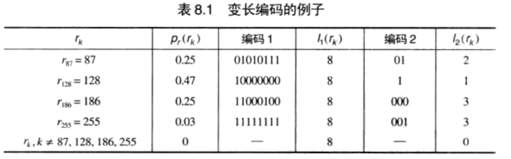
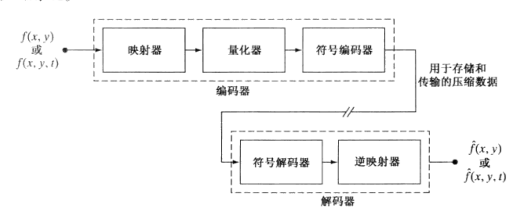
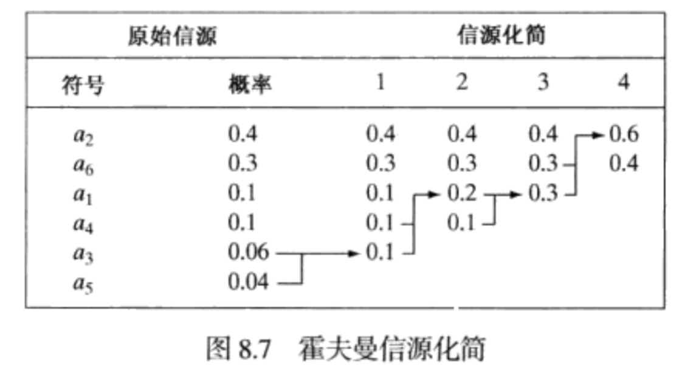
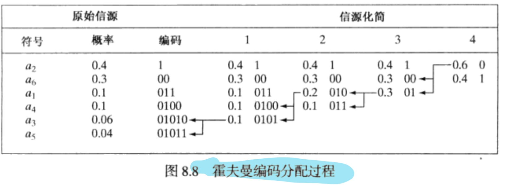
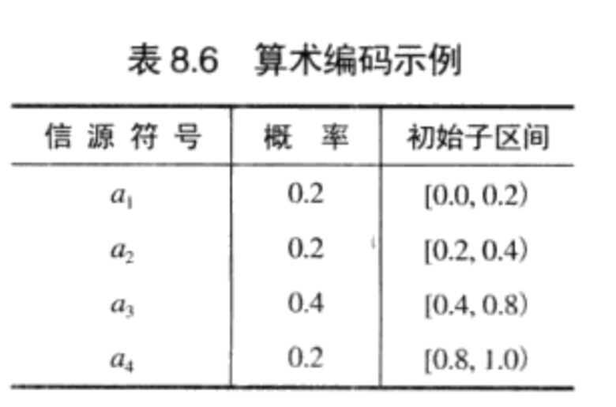
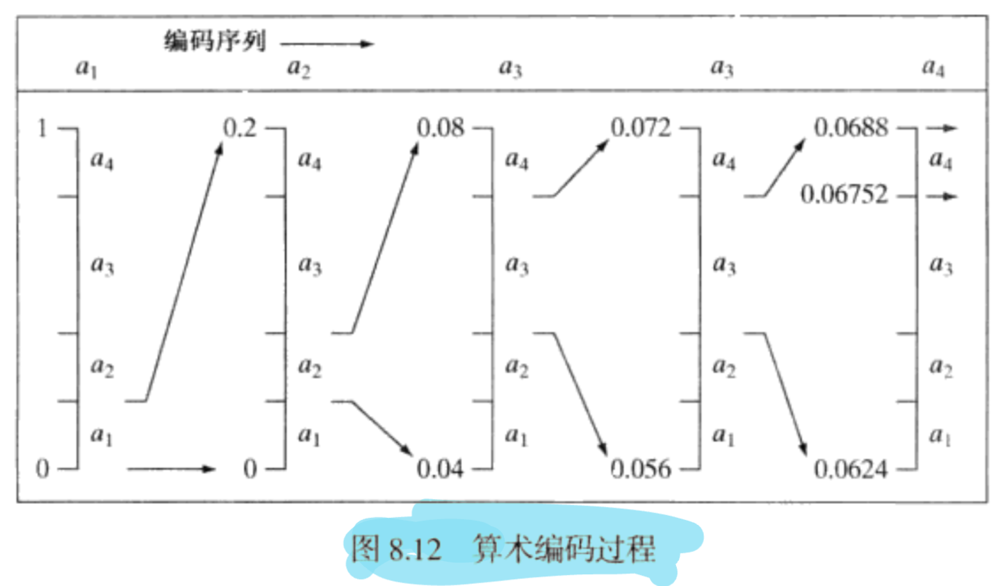
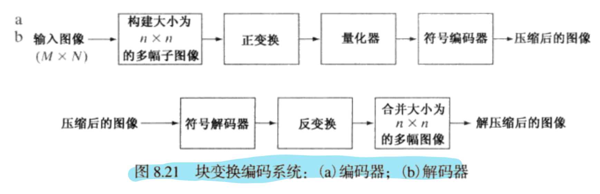

---
title: "数字图像考试复习"
description: "数字图像考试范围"
date: "2024-05-14 21:33:12"
category: "AI / 深度学习"
originalCategory: "杂七杂八"
track: "Notes"
level: intermediate
status: ready
published: true
minutes: 15
order: 1000
prerequisites: []
tags: []
photos: "banner.jpg"
source: "_posts"
---# 数字图像绪论
## 什么是数字图像
一副图像可定义为一个二维函数$f(x,y)$，其中$x$和$y$是空间坐标，而在任何一对空间坐标$(x,y)$处的幅值$f$称为图像在该点处的强度或灰度。

当$x, y$和灰度值$f$是有限的离散数值时，我们称该图像为数字图像。

数字图像处理是指借助于数字计算机来处理数字图像。
## 电磁波谱
根据光子能量从大到小排序：
1. 伽玛射线
2. X射线
3. 紫外线
4. 可见光
5. 红外线
6. 微波
7. 无线电波
## 图像复原与图像增强
- 图像复原与图像增强都是改进图像外观的一个处理领域
- 图像增强是主观的，图像复原是客观的
  - 复原技术倾向于以图像退化的数学或概率模型为基础
  - 增强是以什么是好的增强效果这种人的主观偏爱为基础
# 数字图像基础
## 人眼
眼睛有两类光感受器
- 锥状体
- 杆状体

## 光和电磁波谱
电磁波谱可用波长、频率或能量来描述。

波长$\lambda$和频率$v$的关系如下：
$$
\lambda = \frac{c}{v}
$$
电磁波谱的各个分量的能量由下式给出：
$$
E = hv
$$
## 像素间的一些基本关系
### 相邻像素
- 位于坐标$(x, y)$处的像素$p$有4个水平和垂直的相邻像素，其坐标由下式给出：$(x+1, y), (x-1, y), (x, y+1), (x, y-1)$，这组像素称为$p$的4领域，用$N_4(p)$表示。
- 位于坐标$(x, y)$处的像素有4个对角相邻像素：$(x+1, y+1), (x-1, y+1), (x-1, y-1), (x+1, y-1)$，并以$N_D(p)$表示。
- 对角相邻像素与相邻像素一起称为8邻域，用$N_8(p)$表示。

### 邻接
令V是用以定义邻接性的灰度值集合。
- 4邻接，如果q在集合$N_4(p)$中，则具有V中数值的两个像素$p$和$q$是4邻接的。
- 8邻接，如果q在集合$N_8(p)$中，则具有V中数值的两个像素$p$和$q$是8邻接的。
- m邻接：如果q在$N_4(p)$中，或在$N_D(p)$中且集合$N_4(q)\cap N_4(p)$中没有来自V中数值的像素，则具有V中数值的两个像素p和q是m邻接的。

## 线性操作
考虑一般的算子$H$，该算子对于给定给定输入图像$f(x,y)$，产生一幅输出图像$g(x, y)$:
$$
H[f(x,y)] = g(x, y)
$$

如果
$$
H[a_if_i(x,y)+a_jf_j(x,y)] = a_iH[f_i(x,y)]+a_jH[f_j(x,y)] = a_ig_i(x,y)+a_jg_j(x,y)
$$
则称$H$为线性操作。

# 灰度变换与空间滤波
## 空间滤波
### 过程
1. 邻域原点从一个像素向另一个像素移动，对邻域中的像素应用算子$T$，并在该位置产生输出。
2. 对于任意指定的位置$(x,y)$，输出图像$g$在这些坐标处的值就等于对$f$中$以(x,y)$为原点的邻域应用算子$T$的结果。
3. 邻域的原点移动到下一个位置，重复前面的过程，产生下一各输出图像$g$的值。

### 空间滤波器
邻域和预定义的操作一起被称为空间滤波器（也被称为空间掩模、核、模板或窗口）。

在邻域中执行的操作决定了滤波器处理的特性

### 增强处理
增强处理是对图像进行加工，使其结果对于特定的应用比原始图像更合适的一种处理。“特定”一词在这里很重要，它一开始就确定增强技术是面向问题的。
## 灰度变换
### 图像反转
$$
s = L-1-r
$$
使用这种方式反转一幅图像的灰度。

这种类型的处理特别适用于增强嵌入在一幅图像的暗区域中的白色或灰色细节，特别是当黑色面积在尺寸上占主导地位时。
### 对数变换
$$
s = clog(1+r)
$$
其中$c$是常数，并假设$r\geq0$。

使用这种类型的变换来扩展图像中的暗像素的值，同时压缩更高灰度级的值。
- 将输入中范围较窄的低灰度值映射为输出中较宽范围的灰度值
- 相反地，对高的输入灰度值也是如此

对数变换能完成图像灰度级的扩展/压缩。

对数函数有个重要特征，即它压缩像素值变化较大的图像的动态范围。

### 幂律变换
$$
s=cr^\gamma
$$

其中$c$和$r$是正常数。

习惯上，幂律方程中的指数被称为伽马，用于校正这些幂律响应线性的处理被称为伽马矫正。

## 直方图处理
### 定义
灰度级范围为[0, L-1]的数字图像的直方图是离散函数$h(r_k)=n_k$，其中$r_k$是第$k$级灰度值，$n_k$是图像中灰度为$r_k$的像素个数。

实践中，经常使用乘积MN表示的图像像素的总数除它的每个分量除它的每个分量来归一化直方图。

因此归一化后的直方图由$p(r_k)=n_k/MN$.

归一化后的直方图的所有分量之和为1.
### 地位
直方图是多种空间域处理技术的基础，可用于图像增强，在图像压缩与分割中也有使用。

直方图在软件中计算简单，有助于商用硬件的实现。

### 直方图均衡
直方图均衡化的基本思想是把原始图的直方图变换为在整个灰度范围内均匀分布的形式，这样就增加了像素灰度值的动态范围，从而达到了增强图像整体对比度的效果。

计算过程：
1. 列出原始图灰度级$f$
2. 列出原始直方图
3. 计算原始累积直方图
4. 取整$g=int[(L-1)g_f+0.5]$
5. 确定映射对应关系$(f\rarr g)$
6. 计算新直方图

## 平滑空间滤波器
平滑滤波器用于模糊处理和降低噪声。
### 平滑线性滤波器
平滑线性空间滤波器的输出是包含在滤波器模板领域内的像素的简单平均值。

- 常见的平滑处理应用就是降低噪声
- 均值滤波处理还是存在着不希望有的边缘模糊的负面效应

#### 结构
$$
g(x,y)=\frac{\sum_{s=-a}^a\sum_{t=-b}^{b}w(s,t)f(x+s,y+t)}{\sum_{s=-a}^a\sum_{t=-b}^{b}w(s,t)}
$$

### 统计排序（非线性）滤波器
统计排序滤波器是一种非线性空间滤波器，这种滤波器的响应以滤波器包围的图像区域中所包含的像素的排序为基础，然后使用统计排序结果决定的值代替中心像素的值。

- 提供一种优秀的去噪能力
- 相比同尺寸的线性平滑滤波器的模糊程度明显更低。
- 对处理脉冲噪声（椒盐噪声）非常有效

## 锐化空间滤波
锐化处理的主要目的是突出灰度的过渡部分。
### 基础
数字图像中的边缘在灰度上常常类似于斜坡过渡，这样就导致图像的一阶微分产生较粗的边缘，因为沿着斜坡的微分非零。

二阶微分产生由零分开的一个像素宽的双边缘。

二阶微分在增强细节方面要比一阶微分好得多，二阶微分比一阶微分执行上要容易得多。

### 拉普拉斯算子
#### 定义
一个二维图像函数$f(x,y)$的拉普拉斯算子定义为：
$$
\nabla^2f=\frac{\partial^2f}{\partial x^2}+\frac{\partial^2f}{\partial y^2}
$$
因为任意阶微分都是线性操作，所以拉普拉斯算子也是一个线性算子。

为了以离散形式描述这一公式：

在$x$方向上：
$$
\frac{\partial^2 f}{\partial x^2} = f(x+1, y)+f(x-1,y)-2f(x,y)
$$
在$y$方向上：
$$
\frac{\partial^2 f}{\partial y^2} = f(x, y+1)+f(x, y-1)-2f(x,y)
$$

两个变量的离散拉普拉斯算子是：
$$
\nabla^2f = f(x+1,y)+f(x-1,y)+f(x,y+1)+f(x,y-1)-4f(x,y)
$$

由于拉普拉斯算子是一种微分算子，因此其强调的是图像中灰度的突变，并不强调灰度级缓慢变化的区域，这将产生把浅灰色边线和突变点叠加到暗色背景中的图像。

将原图像和拉普拉斯图像叠加在一起的简单方法，科研复原背景特性并保持拉普拉斯锐化处理的效果。

$$
g(x,y)=f(x,y) + c[\nabla^2f(x,y)]
$$

$c$为常数，与模板中心的符号一致，数值为1.

### sobel算子
$$
M(x,y) \approx|g_x|+|g_y|
$$

$3\times 3$模板：
$$
g_x = \frac{\partial f}{\partial x} = (z_7+2z_8+z_9)-(z_1+2z_2+z_3)
\\\quad\\
g_y = \frac{\partial f}{\partial y} = (z_3+2z_6+z_9)-(z_1+2z_4+z_7)
$$
最终得到：
$$
M(x,y) = |(z_7+2z_8+z_9)-(z_1+2z_2+z_3)|+|(z_3+2z_6+z_9)-(z_1+2z_4+z_7)|
$$
# 彩色图像处理
彩色的运用受两个主要因素推动。
- 彩色是一个强有力的描绘子，它常常可简化从场景中提取和识别目标
- 人可以辨别几千种彩色色调和亮度，但相比之下，只能辨别几十种灰度色调，这对人工图像分析特别重要

彩色图像处理分为两个领域：全彩色处理和伪彩色处理。

## 彩色光源质量
用来描述彩色光源质量的3个基本量：
- 辐射：从光源流出的能量的总和，通常用瓦特(W)来度量
- 光强：用流明来度量，给出了观察者从光源感知的能量总和的度量
- 亮度：主观描绘子，实际上是不可能度量的。体现了无色的强度的概念，并且是描述色彩强度的一个关键因素

## 彩色模型
彩色模型的目的是在某些标准下，用通常可以接受的方式方便地对彩色加以说明。本质上，彩色模型是坐标系统和子空间的说明，其中，位于系统中的每个颜色都由单个点来表示。

### RGB彩色模型
在RGB模型中，每种颜色出现在红、绿、蓝的原色光谱分量上。

在RGB彩色模型中表示的图像由3个分量图像组成，每种原色一幅分量图像。

在RGB空间中，用以表示每个像素的比特数称为像素深度。

例如：一幅RGB图像，每个分量都是8比特图像，则该RGB彩色像素有24比特的深度。

### CMY和CMYK彩色模型
青色、深红色和黄色是光的二次色。

大多数在纸上沉积彩色颜料的设备，要求输入CMY数据或在内部进行RGB到CMY的转换。
$$
\begin{matrix}
  C\\M\\Y
\end{matrix} = \begin{matrix}
  1\\1\\1
\end{matrix} - \begin{matrix}
  R\\G\\B
\end{matrix}
$$

为了在打印中生成真正的黑色，加入了第四种颜色，成为CMYK模型。

### HSI彩色模型
HSI分别指色调、饱和度和强度。

## 伪彩色图像处理
伪彩色图像处理是指基于一种指定的规则对灰度值赋予颜色的处理。

灰度分层和彩色编码技术是伪彩色图像处理的最简单的例子之一。

## 全彩色图像处理基础
- 第一类是分别处理每一幅分量图像，然后由分别处理过的分量图像来形成处理过的合成彩色图像。
- 第二类是直接处理彩色像素。因为全彩色图像至少有3个分量，所以彩色像素实际上是向量。

为了使每种彩色分量处理和基于向量的处理等同，必须满足两个条件：第一，处理必须对向量和标量都可用；第二，对向量的每一分量的操作对于其他分量必须是独立的。

# 图像压缩
图像压缩是一种减少描绘一幅图像所需数据量的技术和科学。

## 紧凑图像描绘的需要
考虑使用$720\times 480\times 24$比特像素阵列来描绘2小时的标准清晰度电视电影所需的数据量。

视频播放以30帧/秒的速率连续地显示这些帧，所以必须以：
$$
30\times 720\times 480\times 24/8 = 31104000字节/秒
$$

## 基础知识
数据压缩是指减少表示给定信息量所需数据量的处理。

- 数据和信息是不相同的事情
- 数据是信息传递的手段

如果我们令$b$和$b'$代表相同信息的两种表示中的比特数，那么用$b$比特表示的相对数据冗余$R$是
$$
R = 1 - 1/C
$$

其中，$C$通常称为压缩率，定义为：
$$
C=b/b'
$$
在上式中，b通常以二维灰度值阵列表示一幅图像所需的比特数。

然而，当它变成紧凑的图像表示时，这些格式远不是最佳格式了。

二维灰度阵列受如下可被识别和利用的三种主要类型的数据冗余的影响：
- 编码冗余：编码是用于表示信息实体或事件集合的符号系统。每个信息或事件被赋予一个编码符号序列，称之为码字。每个码字中的符号数量就是该码字的长度。在多数二维灰度阵列中，用于表示灰度的8比特编码所包含的比特数要比表示该灰度所需要的比特数多。
- 空间和时间冗余：因为多数二维灰度阵列的像素是空间相关的，在相关像素的表示中，信息被没有必要地重复了。在视频序列中，时间相关的像素（即类似于或取决于相邻帧中的那些像素）也是重复的信息。
- 不相关的信息：多数二维灰度阵列中包含一些被人类视觉系统忽略或与用途无关的信息。从没有被利用的意义上看，它是冗余的。

## 编码冗余
在直方图部分：
$$
p_r(r_k) = \frac{n_k}{MN}
$$

如果用于表示每个$r_k$值的比特数为$l(r_k)$，则表示每个像素所需的平均比特数为：
$$
L_{avg} = \sum_{k=0}^{L-1} p_r(r_k)l(r_k)
$$
也就是说，给各个灰度分配的码字的平均长度，可通过对用于表示每个灰度的比特数与该灰度出现的概率的乘积求和得到。

大小为$M\times N$的图像所需的总比特数为$MNL_{avg}$。

### 冗余示例
对于$256\times 256$的图像：

使用8比特编码来表示四种可能的灰度，$L_{avg}=8$，而采用如下方案则平均长度为：$2\times 0.25+1\times 0.47+3\times 0.25+3\times 0.03=1.81$

$$
C = \frac{256\times \times 8}{256\times256\times 1.81}

\\\quad\\R = 1 - \frac{1}{C} = 1 - \frac{1.81}{8}
$$

### 出现的原因
当对事件集合分配码的时候，如果不取全部事件概率的优势，就会出现编码冗余。
## 时间冗余和空间冗余
为减少空间与时间相关的像素涉及的冗余，二维灰度阵列必须变换为更有效但通常不可见的表示。
### 不相关的信息
压缩数据集最简单的方法之一是从集合中消除多余的数据。在数字图像压缩方面，被人的视觉系统忽略的信息或与图像预期的应用无关的信息显然都是删除的候选者。
### 图像信息的度量
一个具有概率$P(E)$的随机事件$E$可被说成是包含
$$
I(E) = log\frac{1}{P(E)} = -logP(E)
$$
单位的信息。

从一个可能事件的离散集合${a_1, a_2, \dots, a_j}$，给定一个统计独立随机事件的信源，与该集合相联系的概率为${P(a_1), P(a_2), \dots, P(a_j)}$，则每个信源输出的平均信息称为该信源的熵：
$$
H = -\sum_{j=0}^JP(a_j)logP(a_j)
$$

在这个公式中，$a_j$称为信源符号。因为它们是统计独立的，信源本身称为零记忆信源。

如果将一幅图考虑为一个虚构的零记忆“灰度信源”的输出，这是灰度信源的熵变为：
$$
H = -\sum_{k=0}^{L-1}p_r(r_k)log_2p_r(r_k)
$$

## 保真度准则
压缩带来一定数量的丢失，需要一种量化这种丢失的本质的方法。

两类准则可用于这样的评估：
- 客观保真度准则
- 主观保真度准则

### 客观保真度准则
当信息损失可以表示为压缩处理的输入和输出的数学函数时，则称其是以客观保真度准则为基础的。

两幅图像的均方根（rms）误差：

令$f(x,y)$是输入图像，并令$\hat f(x,y)$是$f(x,y)$的近似，它来自对输入先压缩后解压缩的结果。

对$x$和$y$的所有值，$f(x,y)$和$\hat f(x,y)$之间的误差$e(x,y)$为：
$$
e(x,y) = \hat f(x,y)-f(x,y)
$$
两幅图像的总误差为：
$$
\sum_{x=0}^{M-1}\sum_{y=0}^{N-1}e(x,y)
$$

其中图像的大小为$M\times N$，均方根误差为：
$$
e_{rms} = [\frac{1}{MN}\sum_{x=0}^{M-1}\sum_{y=0}^{N-1}e(x,y)^2]^{\frac{1}{2}}
$$

如果认为$\hat f(x,y)$是原始图像$f(x,y)$和一个误差或“噪声”信号$e(x,y)$的和，则用$SNR_{ms}$表示的输出图像的均方信噪比为：
$$
SNR_{ms} = \frac{\sum_{x=0}^{M-1}\sum_{y=0}^{N-1}\hat f(x,y)^2}{\sum_{x=0}^{M-1}\sum_{y=0}^{N-1}[\hat f(x,y)-f(x,y)]^2}
$$

### 主观保真度准则
主观评估是通过向观察者显示解压缩的图像，并将他们的评估结果进行平均得到。

## 图像压缩模型
图像压缩系统是由两个不同的功能部分组成的：一个编码器和一个解码器。
- 编码器执行压缩操作
- 解码器执行解压缩的互补操作

### 编码或压缩过程
编码器被设计为通过一系列三个独立操作去除描述冗余的形式。

- 在编码处理的第一个阶段，映射器把$f(x,\dots)$变换为设计来降低空间和时间的冗余的形式。
- 量化器根据预设的保真度准则来降低映射器输出的精度，其目的是排除压缩表示的无关信息。
- 信源编码处理：符号编码器生成一个定长编码或变长编码来表示量化器的输出，并根据该编码来变换输出。

### 解码或解压缩过程
解码器仅包含两个部分：一个符号解码器和一个反映射器。

它们以相反的顺序执行编码器的符号编码器和映射器的反操作。

因为量化导致了不可逆的信息损失，所以反量化器模块没有包含在通常的解码器模型中。

## 图像格式、容器和压缩标准
常见格式：
### 视频
ITU-T:
- H.261
- H.262
- H.263
- H.264

ISO/IEC:
- MPEG-1
- MPEG-2

ISO/IET:
- MPEG-4
- MPEG-4AVC

## 霍夫曼编码
当单独地对信源的符号进行编码时，霍夫曼编码对每个信源符号产生了可能最小数量的编码符号。

霍夫曼编码过程对一组符号产生编码，其概率服从一次只能对一个符号进行编码的限制。

## Golomb编码

## 算术编码
与前两种编码不同，算术编码生成的是非块码。

解码过程

找到对应的区间
## 块变换编码
块变换编码用于JPEG M-JPEG MPEG_1,2,4 H.261 H.262 H.264 DV HDV VC-1 及 基本压缩标准中。

块变换系统如下：

编码器执行4种相对简单的操作：子图像分解、变换、量化和编码。
- 一幅大小为$MN$的输入图像首先被分解为大小为$n\times n$的子图像
- 然后变换这些子图以生成$MN/n^2$个子图像变换阵列， 每个阵列大小为$n\times n$。
  - 变换处理的目的是对每幅子图像中的像素进行去相关，或用最少数量的变换系数包含尽可能多的信息
- 在量化阶段，以一种预定义的方式有选择性地消除或更粗略地量化那些携带最少信息的系数
- 通过对量化后的系数进行编码结束编码过程。

任何或所有的变换编码步骤都可以根据局部图像内容进行适应性调整，这称为自适应变换编码。

如果这些步骤对所有子图像都是固定的，则称为非自适应变换编码。

多数变换编码系统基于DCT，DCT在信息携带能力和计算复杂性之间提供了好的折中。

DCT变换具有如下优点：
- 用单片集成电路就可以实现
- 可将最多信息装入最少的系数中
- 在子图像间的边界变得可见时，可使出现的称为块缺陷的块效应最小化。

JPEG标准：
压缩本身按三个顺序步骤执行：DCT计算、量化和变长码分配

在无损预测编码模型中加入一个量化器，并在关于空间预测器的上下文中，探讨重建精度和压缩性能间的折中。

# 图像分割
多数分割算法均基于灰度值的两个基本性质：不连续性和相似性。

- 一阶导数通常在图像中产生较粗的边缘
- 二阶导数对精细细节，如细线、孤立点和噪声有较强的响应
- 二阶导数在灰度斜坡和灰度台阶过渡处会产生双边缘响应
- 二阶导数的符号可用于确定边缘的过渡是从亮到暗还是从暗到亮

白噪声是指具有这样一个频谱的噪声，该频谱在一个指定的频率段中是连续且均匀的。白高斯噪声则是幅度值分布为高斯的白噪声。

高斯白噪声是许多真实世界情形的较好近似，并且可产生数学上可处理的模型。高斯白噪声的一个有用性质是其值是独立统计的。
