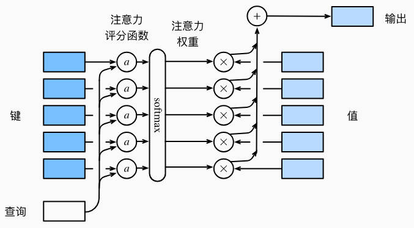

# 注意力提示
注意力是稀缺的，而环境中的干扰注意力的信息却并不少，我们只会将注意力引向感兴趣的一小部分信息。

## 查询、键和值
自主性与非自主性的注意力提示解释了人类的注意力的方式。

首先考虑相对简单的情况，即只使用非自主性提示。要想将选择偏向于感官输入，则可以简单地使用参数化的全连接层，甚至非参数化的最大汇聚层或平均汇聚层。

因此，是否包含自主性提示将注意力机制与全连接层或汇聚层区分开来。

在注意力机制的背景下，自主性提示被称为查询。给定任何查询，注意力机制通过注意力汇聚将选择引导至感官输入。

在注意力机制中，这些感官输入被称为值。更通俗地解释，每个值都与一个键匹配，这可以想象为感官输入的非自主性提示。

## 注意力可视化
平均汇聚层可以被视为输入的加权平均值，其中各输入的权重是一样的。实际上，注意力汇聚得到的是加权平均的总和，其中权重是在给定的查询和不同的键之间计算得出的。
```
import torch
from d2l import torch as d2l
```
为了可视化注意力权重，需要定义一个show_heatmaps函数，其输入matrices的形状是(要显示的行数，要显示的列数，查询数，键数)。
```
def show_heatmaps(matrices, xlabel, ylabel, titles=None, figsize=(2.5, 2.5), cmap='Reds'):
    d2l.use_svg_display()
    num_rows, num_cols = matrices.shape[0], matrices.shape[1]
    fig, axes = d2l.plt.subplots(num_rows, num_cols, figsize=figsize, sharex=True, sharey=True, squeeze=False)
    for i, (row_axes, row_matrices) in enumerate(zip(axes, matrices)):
        for j, (ax, matrix) in enumerate(zip(row_axes, row_matrices)):
            pcm = ax.imshow(matrix.detach().numpy(), cmap=cmap)
            if i == num_rows - 1:
                ax.set_xlabel(xlabel)
            if j == 0:
                ax.set_ylabel(ylabel)
            if titles:
                ax.set_title(titles[j])
    fig.colorbar(pcm, ax=axes, shrink = 0.6)
```
演示：
```
attention_weights = torch.eye(10).reshape((1,1,10,10))
show_heatmaps(attention_weights, xlabel='Keys', ylabel='Queries')
```
# 注意力汇聚：Nadaraya-Watson核回归
上一节介绍了框架下的注意力机制的主要组件：查询和键之间的交互形成了注意力汇聚；注意力汇聚有选择性地汇聚了值以生成最终的输出。

本节以Nadaraya-Watson核回归模型为例。
```
import torch
from torch import nn
from d2l import torch as d2l
```
## 生成数据集
为简单起见，考虑下面这个回归问题：给定成对的“输入-输出”数据集，如何学习$f$来预测任意新输入$x$的输出$\hat y = f(x)$.

根据下面的非线性函数生成一个人工数据集：
$$
y_i = 2sin(x_i)+x_i^{0.8}+\epsilon
$$
其中，$\epsilon$为加入的噪声，服从均值为0和标准差为0.5的正态分布。

在这里生成了50个训练样本和50个测试样本。为了更好地可视化之后的注意力模式，需要将训练样本进行排序。

```
n_train = 50
x_train, _ = torch.sort(torch.rand(n_train)*5)
def f(x):
    return 2*torch.sin(x)+x**0.8

y_train = f(x_train) + torch.normal(0, 0.05, (n_train,))
x_test = torch.arange(0, 5, 0.1)
y_truth = f(x_test)
n_test = len(x_test)

n_test
```
下面的函数将绘制所有的训练样本，不带噪声项的真实数据生成函数$f$，以及学习得到的预测函数。
```
def plot_kernel_reg(y_hat):
    d2l.plot(x_test, [y_truth, y_hat], 'x', 'y', legend=['Truth', 'Pred'], xlim=[0, 5], ylim=[-1, 5])
    d2l.plt.plot(x_train, y_train, 'o', alpha=0.5)
```
## 平均汇聚
先使用最简单的估计器来解决回归问题。基于平均汇聚来计算所有训练样本输出值的平均值：
$$
f(x) = \frac{1}{n}\sum_{i=1}^{n}y_i
$$
显然，这个估计器确实不够聪明。真是函数$f(Truth)$和预测函数$Pred$相差很大。

```
y_hat = torch.repeat_interleave(y_train.mean(), n_test)
plot_kernel_reg(y_hat)
```
## 非参数注意力汇聚
显然，平均汇聚忽略了输入$x_i$。于是Nadaraya和Watson提出了更好的想法，根据输入的位置对输出$y_i$进行加权：
$$
f(x) = \sum_{i=1}^n\frac{K(x-x_i)}{\sum_{j=1}^nK(x-x_j)}y_i
$$
其中，$K$是核。这里不具体讨论核函数的细节，但我们可以重写注意力机制框架，使之变为一个更通用的注意力汇聚公式：
$$
f(x) = \sum_{i=1}^n\alpha(x, x_i)y_i
$$
其中，$x$是查询，$(x_i, y_i)$是键值对。注意力汇聚是$y_i$是加权平均。

将查询$x$和键$x_i$之间的关系建模为注意力权重$\alpha(x, x_i)$，这个权重将被分配给每个对应值$y_i$。对于任何查询，模型的所有键值对注意力权重都是一个有效的概率分布：它们是非负的，并且总和为1.

为了更好地理解注意力汇聚，下面考虑一个高斯核，其定义为
$$
K(u) = \frac{1}{\sqrt{2\pi}}exp(-\frac{u^2}{2})
$$

带入高斯核得到：
$$
f(x) = \sum_{i=1}^n\alpha(x, x_i)y_i\\
= \sum_{i=1}^n\frac{exp(-\frac{1}{2}(x-x_i)^2)}{\sum_{j=1}^nexp(-\frac{1}{2}(x-x_j)^2)}y_i\\
=\sum_{i=1}^nsoftmax(-\frac{1}{2}(x-x_i)^2)y_i
$$
在式中，如果一个键$x_i$越接近给定的查询$x$，那么分配给这个键的对应值$y_i$的注意力权重就会越大。

值得注意的是，Nadaraya-Watson核回归是一个非参数模型。接下来，我们将基于这个非参数的注意力汇聚模型来绘制预测结果。

从绘制的结果会发现新的模型预测线是平滑的，并且比平均汇聚的预测更接近真实情况。
```
 X_repeat = x_test.repeat_interleave(n_train).reshape((-1, n_train))
 attention_weights = nn.functional.softmax(-(X_repeat-x_train)**2/2, dim=1)
 y_hat = torch.matmul(attention_weights, y_train)
 plot_kernel_reg(y_hat)
```

## 带参数注意力汇聚
本节将参数集成到注意力汇聚中：
$$
f(x) = \sum_{i=1}^nsoftmax(-\frac{1}{2}((x-x_i)w)^2)y_i
$$
### 批量矩阵乘法
为了更有效地计算小批量数据的注意力，我们可以利用深度学习开发框架中提供的批量矩阵乘法。

假设第一个小批量数据包含$n$个矩阵$X_1, \dots, X_n$，形状为$a\times b$，第二个小批量数据包含$n$个矩阵$Y_1, \dots, Y_n$，形状为$b\times c$。它们的批量矩阵乘法得到$n$个矩阵$X_1Y_1, \dots, X_nY_n$，形状为$a\times c$。

因此，假定两个张量的形状分别为$(n, a, b)$和$(n, b, c)$，它们的批量矩阵乘法输出的形状为$(n, a, c)$。

在注意力机制的背景下，我们可以使用小批量矩阵乘法来计算小批量数据中的加权平均值。

```
weights = torch.ones((2, 10))*0.1
values = torch.arange(20.).reshape(2, 10)

torch.bmm(weights.unsqueeze(1), values.unsqueeze(-1))
```
### 定义模型
```
class NWKernelRegression(nn.Module):
    def __init__(self, **kwargs):
        super().__init__(**kwargs)
        self.w = nn.Parameter(torch.rand((1,), requires_grad=True))

    def forward(self, queries, keys, values):
        # queries attention_weights 的形状为(查询数，键值对数)
        queries = queries.repeat_interleave(keys.shape[1]).reshape((-1, keys.shape[1]))
        self.attention_weights = nn.functional.softmax(-((queries-keys)*self.w)**2/2, dim=1)

        return torch.bmm(self.attention_weights.unsqueeze(1), values.unsqueeze(-1)).reshape(-1)
```

### 训练
接下来，将训练数据集变换为键和值用于训练注意力模型。

在带参数的注意力汇聚模型中，任何一个训练样本的输入都会和除自身以外的所有训练样本的键值对进行计算，从而得到其对应的预测输出。

```
X_tile = x_train.repeat((n_train, 1))
Y_tile = y_train.repeat((n_train, 1))
keys = X_tile[(1-torch.eye(n_train)).type(torch.bool)].reshape((n_train, -1))
values = Y_tile[(1-torch.eye(n_train)).type(torch.bool)].reshape((n_train, -1))
```

训练带参数的注意力汇聚模型时，使用平方损失函数和随机梯度下降。
```
net =NWKernelRegression()
loss = nn.MSELoss(reduction='none')
trainer = torch.optim.SGD(net.parameters(), lr = 0.5)
animator = d2l.Animator(xlabel='epoch', ylabel='loss', xlim=[1, 5])

for epoch in range(5):
    trainer.zero_grad()
    l = loss(net(x_train, keys, values), y_train)
    l.sum().backward()
    trainer.step()
    print(f'epoch {epoch+1}, loss {float(l.sum()):.6f}')
    animator.add(epoch+1, float(l.sum()))
```

训练带参数的注意力汇聚模型后可以发现：在尝试拟合带噪声的训练数据时，预测结果绘制的曲线不如之前非参数模型的平滑。

```
keys = x_train.repeat((n_test, 1))
values = y_train.repeat((n_test, 1))
y_hat = net(x_test, keys, values).unsqueeze(1).detach()
plot_kernel_reg(y_hat)
```

与非参数的注意力汇聚模型相比，带参数的模型加入可学习的参数后，曲线在注意力权重较大的区域变得更不平滑。

# 注意力评分函数
在上一节使用了高斯核来对查询和键之间的关系建模。

从宏观上来看，上述算法可以用来实现注意力机制框架。下图说明了如何将注意力汇聚的输出计算成为值的加权和，其中$a$表示注意力评分函数。



由于注意力权重是概率分布，因此加权和在本质上是加权平均值。

用数学语言描述，假设有一个查询$q\in R^q$和$m$个键-值对$(k_1, v_1), \dots, (k_m, v_m)$.

注意力汇聚函数$f$就被表示成值的加权和：
$$
f(q, (k_1, v_1), \dots, (k_m, v_m)) = \sum_{i=1}^m\alpha(q, k_i)v_i
$$

其中，查询$q$和键$k$的注意力权重是通过注意力评分函数将两个向量映射成标量，再经过softmax运算得到的：
$$
\alpha(q, k_i) = softmax(a(q, k_i)) = \frac{exp(a(q, k_i))}{\sum_{j=1}^mexp(a(q, k_j))}
$$

选择不同的注意力评分函数$a$将导致不同的注意力汇聚操作。

```
import math
import torch
from torch import nn
from d2l import torch as d2l
```
## 掩蔽softmax操作
正如上面提到的，softmax操作用于输出一个概率分布作为注意力权重。在某些情况下，并非所有的值都应该被纳入注意力汇聚中。

例如为了处理小批量数据集，在部分文本序列填充了没有意义的特殊词元。

为了仅将有意义的词元作为值来获取注意力汇聚，可以指定一个有效序列长度，以便在计算softmax时过滤掉超出指定范围的位置。

```
def sequence_mask(X, valid_len, value=0):
    maxlen = X.size(1)
    mask = torch.arange((maxlen), dtype = torch.float32, device = X.device)[None, :] < valid_len[:, None]
    X[~mask] = value
    return X


def masked_softmax(X, valid_lens):
    # X:3D张量，valid_lens:1D或2D张量
    if valid_lens is None:
        return nn.functional.softmax(X, dim=-1)
    else:
        shape = X.shape
        if valid_lens.dim() == 1:
            valid_lens = torch.repeat_interleave(valid_lens, shape[1])
        else:
            valid_lens = valid_lens.reshape(-1)

        x = sequence_mask(X.reshape(-1, shape[-1]), valid_lens, value=-1e6)
        return nn.functional.softmax(X.reshape(shape), dim=-1)
```

## 加性注意力
一般来说，当查询和键是不同长度的向量时，可以使用加性注意力作为评分函数。给定查询$q\in R^q$和键$k\in R^k$，加性注意力的评分函数为：
$$
a(q, k) = w_v^Ttanh(W_qq+W_kk)\in R
$$
其中可学习的参数是$W_q、W_k、w_v$.

上式将查询和键连接起来后输入一个多层感知机中，感知机包含一个隐藏层，其隐藏单元数是一个超参数$h$。通过使用tanh作为激活函数，并且禁用偏置项。

```
class AdditiveAttention(nn.Module):
    def __init__(self, key_size, query_size, num_hiddens, dropout, **kwargs):
        super(AdditiveAttention, self).__init__(**kwargs)
        self.W_k = nn.Linear(key_size, num_hiddens, bias=False)
        self.W_q = nn.Linear(query_size, num_hiddens, bias=False)
        self.w_v = nn.Linear(num_hiddens, 1, bias = False)
        self.dropout = nn.Dropout(dropout)

    def forward(self, queries, keys, values, valid_lens):
        queries, keys = self.W_q(queries), self.W_k(keys)
        # 在维度拓展后
        # queries的形状为(batch_size, 查询数, 1, num_hiddens)
        # keys的形状为(batch_size, 1, 键值对数, num_hiddens)
        # 使用广播的方式求和
        features = queries.unsqueeze(2) + keys.unsqueeze(1)
        features = torch.tanh(features)

        scores = self.w_v(features).squeeze(-1)
        self.attention_weights = masked_softmax(scores, valid_lens)

        return torch.bmm(self.dropout(self.attention_weights), values)
```

用一个例子进行演示：
```
queries, keys = torch.normal(0, 1, (2, 1, 20)), torch.ones((2, 10, 2))
values = torch.arange(40, dtype = torch.float32).reshape(1, 10, 4).repeat(2, 1, 1)
valid_lens = torch.tensor([2, 6])

attention = AdditiveAttention(key_size=2, query_size=20, num_hiddens=8, dropout=0.1)
attention.eval()
attention(queries, keys, values, valid_lens)
```

## 缩放点积注意力
使用点积可以得到计算效率更高的评分函数，但是点积操作要求查询和键具有相同的长度$d$。

假设查询和键的所有元素都是独立的随机变量，并且都满足零均值和单位方差，那么两个向量的点积的均值为0，方差为d。

为确保无论向量长度如何，点积的方差在不考虑向量长度的情况都是1，将点积除以$\sqrt{d}$，则缩放点积注意力评分函数为：
$$
a(q, k) = q^Tk/\sqrt{d}
$$

在实践中，我们通常从小批量的角度来考虑提高效率。例如基于$n$个查询和$m$个键值对计算注意力，其中查询和键的长度为$d$，值的长度为$v$。
$$
softmax(\frac{QK^T}{\sqrt{d}})V\in R^{n\times v}
$$

```
class DotProductAttention(nn.Module):
    def __init__(self, dropout, **kwargs):
        super(DotProductAttention, self).__init__(**kwargs)
        self.dropout = nn.Dropout(dropout)

    # queries shape:(batch_size, queries_num, d)
    # keys shape:(batch_size, keys_num, d)
    # values shape:(batch_size, keys_num, features)
    # valid_lens shape:(batch_size, quries_num)
    def forward(self, queries, keys, values, valid_lens=None):
        d = queries.shape[-1]
        scores = torch.bmm(queries, keys.transpose(1, 2))/math.sqrt(d)
        self.attention_weights = masked_softmax(scores, valid_lens)
        return torch.bmm(self.dropout(self.attention_weights), values)
```
示例如下：
```
queries = torch.normal(0, 1, (2, 1, 2))
attention = DotProductAttention(dropout = 0.5)
attention.eval()
attention(queries, keys, values, valid_lens)
```

# Bahdanau注意力
在现代循环神经网络中，探讨了机器翻译的问题，通过设计一个基于两个循环神经网络的编码器-解码器架构，用于序列到序列学习。

然而，即使并非所有输入词元都对解码某个词有用，在每个编码步骤中也使用编码相同的上下文变量。

## 模型
假设输入序列有$T$个词元，解码时间步$t'$的上下文变量是注意力集中的输出：
$$
c_{t'} = \sum_{t=1}^T\alpha(s_{t'-1}, h_t)h_t
$$

其中，时间步$t'-1$时的解码器隐状态$s_{t'-1}$是查询，编码器隐状态$h_t$既是键，也是值，注意力权重$\alpha$是使用的加性注意力评分函数计算的。

## 实现
```
import torch
from torch import nn
from d2l import torch as d2l
```

### 定义注意力解码器
定义带有注意力机制的解码器接口。
```
#@save
class AttentionDecoder(d2l.Decoder):
    def __init__(self, **kwargs):
        super(AttentionDecoder, self).__init__(**kwargs)

    @property
    def attention_weights(self):
        raise NotImplementedError
```
接下来，在Seq2SeqAttentionDecoder类中实现带有Bahdanau注意力的循环神经网络解码器。首先，初始化解码器的状态，需要下面的输入：
1. 编码器在所有时间步的最终隐状态，将作为注意力的键和值
2. 上一个时间步的编码器全层隐状态，将作为初始化解码器的隐状态
3. 编码器的有效长度（剔除在注意力池中的填充词元）

在每个解码时间步中，解码器上一个时间步的最终隐状态将用作查询。因此，注意力输出和输入嵌入都连接为循环神经网络解码器的输入。

```
def sequence_mask(X, valid_len, value=0):
    maxlen = X.size(1)
    mask = torch.arange((maxlen), dtype = torch.float32, device = X.device)[None, :] < valid_len[:, None]
    X[~mask] = value
    return X


def masked_softmax(X, valid_lens):
    # X:3D张量，valid_lens:1D或2D张量
    if valid_lens is None:
        return nn.functional.softmax(X, dim=-1)
    else:
        shape = X.shape
        if valid_lens.dim() == 1:
            valid_lens = torch.repeat_interleave(valid_lens, shape[1])
        else:
            valid_lens = valid_lens.reshape(-1)

        x = sequence_mask(X.reshape(-1, shape[-1]), valid_lens, value=-1e6)
        return nn.functional.softmax(X.reshape(shape), dim=-1)


class AdditiveAttention(nn.Module):
    def __init__(self, key_size, query_size, num_hiddens, dropout, **kwargs):
        super(AdditiveAttention, self).__init__(**kwargs)
        self.W_k = nn.Linear(key_size, num_hiddens, bias=False)
        self.W_q = nn.Linear(query_size, num_hiddens, bias=False)
        self.w_v = nn.Linear(num_hiddens, 1, bias = False)
        self.dropout = nn.Dropout(dropout)

    def forward(self, queries, keys, values, valid_lens):
        queries, keys = self.W_q(queries), self.W_k(keys)
        # 在维度拓展后
        # queries的形状为(batch_size, 查询数, 1, num_hiddens)
        # keys的形状为(batch_size, 1, 键值对数, num_hiddens)
        # 使用广播的方式求和
        features = queries.unsqueeze(2) + keys.unsqueeze(1)
        features = torch.tanh(features)

        scores = self.w_v(features).squeeze(-1)
        self.attention_weights = masked_softmax(scores, valid_lens)

        return torch.bmm(self.dropout(self.attention_weights), values)


class Seq2SeqAttentionDecoder(AttentionDecoder):
    def __init__(self, vocab_size, embed_size, num_hiddens, num_layers, dropout = 0, **kwargs):
        super(Seq2SeqAttentionDecoder, self).__init__(**kwargs)
        self.attention = AdditiveAttention(num_hiddens, num_hiddens, num_hiddens, dropout)
        self.embedding = nn.Embedding(vocab_size, embed_size)
        self.rnn = nn.GRU(
            embed_size+num_hiddens, num_hiddens, num_layers, dropout=dropout
        )
        self.dense = nn.Linear(num_hiddens, vocab_size)

    def init_state(self, enc_outputs, enc_valid_lens, *args):
        # outputs的形状为(batch_size, num_steps, num_hiddens)
        # hidden_state的形状为(num_layers, batch_size, num_hiddens)
        outputs, hiddens_state = enc_outputs

        return (outputs.permute(1, 0, 2), hiddens_state, enc_valid_lens)

    def forward(self, X, state):
        # enc_outputs的形状为(batch_size, num_steps, num_hiddens)
        # hidden_state的形状为(num_layers, batch_size, num_hiddens)
        enc_outputs, hidden_state, enc_valid_lens = state
        # 输出的X形状为(num_steps, batch_size, embed_size)
        X = self.embedding(X).permute(1, 0, 2)
        outputs, self._attention_weights = [], []
        for x in X:
            # query的形状为(batch_size, 1, num_hiddens)
            query = torch.unsqueeze(hidden_state[-1], dim=1)
            # context的形状为(batch_size, 1, num_hiddens)
            context = self.attention(
                query, enc_outputs, enc_outputs, enc_valid_lens
            )
            # 在特征维度上连接
            x = torch.cat((context, torch.unsqueeze(x, 1)), dim=-1)
            out, hidden_state = self.rnn(x.permute(1, 0, 2), hidden_state)
            outputs.append(out)
            self._attention_weights.append(self.attention.attention_weights)

        outputs = self.dense(torch.cat(outputs, dim=0))
        return outputs.permute(1, 0, 2), [enc_outputs, hidden_state, enc_valid_lens]

    @property
    def attention_weights(self):
        return self._attention_weights
```
### 定义编码器
```
class Seq2SeqEncoder(d2l.Encoder):
    def __init__(self, vocab_size, embed_size, num_hiddens, num_layers, dropout = 0, **kwargs):
        super(Seq2SeqEncoder, self).__init__(**kwargs)
        self.embedding = nn.Embedding(vocab_size, embed_size)
        self.rnn = nn.GRU(embed_size, num_hiddens, num_layers, dropout = dropout)

    def forward(self, X, *args):
        X = self.embedding(X) # 形状更新为(batch_size, num_steps, embed_size)
        # 在循环神经网络中，第一个轴对应于时间步
        X = X.permute(1, 0, 2)
        # 如果没有提及state，默认为0
        output, state = self.rnn(X)

        # state[0]的形状为(num_layers, batch_size, num_hiddens)
        return output, state
```
### 测试
使用包含7个时间步的4个序列驶入的小批量测试解码器。
```
encoder = Seq2SeqEncoder(vocab_size=10, embed_size=8, num_hiddens=16, num_layers=2)
encoder.eval()
decoder = Seq2SeqAttentionDecoder(vocab_size=10, embed_size=8, num_hiddens=16, num_layers=2)
decoder.eval()

X = torch.zeros((4, 7), dtype=torch.long)
state = decoder.init_state(encoder(X), None)
output, state = decoder(X, state)
output.shape, len(state), state[0].shape, len(state[1]), state[1][0].shape
```
## 训练
```
class EncoderDecoder(nn.Module):
    def __init__(self, encoder, decoder, **kwargs):
        super(EncoderDecoder, self).__init__(**kwargs)
        self.encoder = encoder
        self.decoder = decoder

    def forward(self, enc_X, dec_X, *args):
        enc_outputs = self.encoder(enc_X, *args)
        dec_state = self.decoder.init_state(enc_outputs, *args)
        return self.decoder(dec_X, dec_state)

embed_size, num_hiddens, num_layers, dropout = 32, 32, 2, 0.1
batch_size, num_steps = 64, 10
lr, num_epochs, device = 0.005, 250, d2l.try_gpu()

train_iter, src_vocab, tgt_vocab = d2l.load_data_nmt(batch_size, num_steps)

encoder = Seq2SeqEncoder(len(src_vocab), embed_size, num_hiddens, num_layers, dropout)
decoder = Seq2SeqAttentionDecoder(
    len(tgt_vocab), embed_size, num_hiddens, num_layers, dropout
)
net = EncoderDecoder(encoder, decoder)
d2l.train_seq2seq(net, train_iter, lr, num_epochs, tgt_vocab, device)
```
# 多头注意力
在实践中，当给定相同的查询、键和值的集合时，我们希望模型可以基于相同的注意力机制学习不同的行为，然后将不同的行为作为知识组合起来，捕获序列内各种范围的依赖关系。

因此，允许注意力机制组合使用查询、键和值的不同表示子空间可能是有益的。

为此，与其只是用单独一个注意力汇聚，我们可以用独立学习得到的$h$组不同的线性投影来变换查询、键和值。

然后，这$h$组变换后的查询、键和值将并行地送到注意力汇聚中。

最后，将这$h$个注意力汇聚的输出连接在一起，并且通过另一个可学习的线性投影进行变换，以生成最终输出。

这种设计被称为多头注意力。对于$h$个注意力汇聚输出，每个注意力汇聚被称作头。

## 模型
给定查询$q\in R^{d_q}$、键$k\in R^{d_k}$、和值$v\in R^{d_v}$，每个注意力头$h_i$的计算方法为：
$$
h_i = f(W_i^{(q)}q, W_i^{(k)}k, W_i^{(v)}v)\in R^{p_v}
$$
其中$f$代表注意力函数，如加性注意力和缩放点积注意力；可学习参数包括$W_i^{(q)}\in R^{p_q\times d_q}$、$W_i^{(k)}\in R^{p_k\times d_k}$、$W_i^{(v)}\in R^{p_v\times d_v}$.

多头注意力的输出需要经过另一个线性变换，它对应$h$个头连接后的结果，因此可学习的参数是$W_o\in R^{p_o\times hp_v}$:
$$
W_o[h_1 \dots h_T]^T\in R^{p_o}
$$

基于这种设计，每个头都可能会关注输入的不同部分，可以表示比简单加权平均值更复杂的函数。
## 实现
```
import math
import torch
from torch import nn
from d2l import torch as d2l
```
此处选择缩放点积注意力作为每个注意力头。

为了避免计算成本和参数成本的大幅增加，我们设定$p_q=p_k=p_v=p_o/h$.

如果将查询、键和值的线性变换的输出数量设置为$p_qh=p_kh=p_vh=p_o$，则可以并行计算$h$个头。

在下面的实现中，$p_o$是通过参数num_hiddens指定的。

```
#@save
class MultiHeadAttention(nn.Module):
    def __init__(self, key_size, query_size, value_size, num_hiddens, num_heads, dropout, bias=False, **kwargs):
        super(MultiHeadAttention, self).__init__(**kwargs)
        self.num_heads = num_heads
        self.attention = DotProductAttention(dropout)
        self.W_q = nn.Linear(query_size, num_hiddens, bias=bias)
        self.W_v = nn.Linear(value_size, num_hiddens, bias=bias)
        self.W_k = nn.Linear(key_size, num_hiddens, bias=bias)
        self.W_o = nn.Linear(num_hiddens, num_hiddens, bias=bias)

    def forward(self, queries, keys, values, valid_lens):
        # queries, keys, values shape:(batch_size, num, num_hiddens)
        # valid_lens的形状为(batch_size, )或(batch_size, 查询数)
        # 经过变换后
        # (batch_size*num_heads, num, num_hiddens/num_heads)
        queries = transpose_qkv(self.W_q(queries), self.num_heads)
        keys = transpose_qkv(self.W_k(keys), self.num_heads)
        values = transpose_qkv(self.W_v(values), self.num_heads)

        if valid_lens is not None:
            valid_lens = torch.repeat_interleave(valid_lens, repeats = self.num_heads, dim=0)

        output = self.attention(queries, keys, values, valid_lens)
        output_concat = transpose_output(output, self.num_heads)

        return self.W_o(output_concat)

class DotProductAttention(nn.Module):
    def __init__(self, dropout, **kwargs):
        super(DotProductAttention, self).__init__(**kwargs)
        self.dropout = nn.Dropout(dropout)

    def forward(self, queries, keys, values, valid_lens):
        d = queries.shape[-1]
        scores = torch.bmm(queries, keys.transpose(1, 2))/math.sqrt(d)
        self.attention_weights = masked_softmax(scores, valid_lens)
        return torch.bmm(self.dropout(self.attention_weights), values)

def masked_softmax(X, valid_lens):
    if valid_lens is None:
        return nn.functional.softmax(X, dim=-1)

    else:
        shape = X.shape
        if valid_lens.dim() == 1:
            valid_lens = torch.repeat_interleave(valid_lens, shape[1])
        else:
            valid_lens = valid_lens.reshape(-1)

        x = d2l.sequence_mask(X.reshape(-1, shape[-1]), valid_lens, value=-1e6)

        return nn.functional.softmax(X.reshape(shape), dim=-1)

def transpose_qkv(X, num_heads):
    '''为了多注意力头的并行计算而变换形态'''
    # 输入X为(batch_size, num, num_hiddens)
    # 输出X为(batch_size, num, num_heads, num_hiddens/num_heads)
    X = X.reshape(X.shape[0], X.shape[1], num_heads, -1)

    # 输出X为(batch_size, num_heads, num, num_hiddens/num_heads)
    X= X.permute(0, 2, 1, 3)

    return X.reshape(-1, X.shape[2], X.shape[3])

def transpose_output(X, num_heads):
    '''反转transpose_qkv操作'''
    X = X.reshape(-1, num_heads, X.shape[1], X.shape[2])
    X = X.permute(0, 2, 1, 3)
    return X.reshape(X.shape[0], X.shape[1], -1)
```

下面使用键和值相同的例子来测试我们编写的MultiHeadAttention类。多头注意力输出的形状为(batch_size, num_quires, num_hiddens).

```
num_hiddens, num_heads = 100, 5
attention = MultiHeadAttention(num_hiddens, num_hiddens, num_hiddens, num_hiddens, num_heads, 0.5)
attention.eval()
```
```
batch_size, num_quries = 2, 4
num_kvpairs, valid_lens = 6, torch.tensor([3, 2])
X = torch.ones((batch_size, num_quries, num_hiddens))
Y = torch.ones((batch_size, num_kvpairs, num_hiddens))

attention(X, Y, Y, valid_lens).shape
```

# 自注意力和位置编码
在深度学习中，经常使用CNN或RNN对序列进行编码。

想象一下，有了注意力机制后，我们将词元序列输入注意力汇聚中，以便同一组词元同时充当查询、键和值。

具体来说，每个查询都会关注所有的键-值对并生成一个注意力输出。

这种方式被称为自注意力或内部注意力。

本节将介绍使用自注意力进行序列编码，以及如何使用序列的顺序作为补充信息。
```
import math
import torch
from torch import nn
from d2l import torch as d2l
```
## 自注意力
给定一个词元组成的输入序列$x_1, \dots, x_n$，其中任意$x_i\in R^d$，该序列的自注意力输出为一个长度相同的序列$y_1, \dots, y_n$，其中：
$$
y_i = f(x_i,(x_1, x_1),\dots,(x_n, x_n))
$$

下面的代码片段是基于多头注意力对一个张量完成自注意力计算：
```
num_hiddens, num_heads = 100, 5
attention =MultiHeadAttention(num_hiddens, num_hiddens, num_hiddens, num_hiddens, num_heads, 0.5)
attention.eval()

batch_size, num_queries, valid_lens = 2, 4, torch.tensor([3, 2])
X = torch.ones((batch_size, num_queries, num_hiddens))
attention(X, X, X, valid_lens).shape
```

## 比较CNN、RNN与自注意力
目标是将由$n$个词元组成的序列映射到另一个长度相同的序列。

将分析这三种架构的计算复杂度、顺序操作和最大路径长度。其中顺序操作会妨碍并行计算，而任意的序列位置组合之间的路径越短，越能够轻松地学习序列中的远距离依赖关系。

考虑一个卷积核大小为$k$的卷积层，输入的序列长度是$n$，输入和输出的通道数都是$d$。
- 卷积层的计算复杂度为$O(knd^2)$.
- 卷积网络是分层的，因此由$O(1)$个顺序操作
- 最大路径长度为$O(n/k)$

当更新循环神经网络的隐状态时，$d\times d$权重矩阵和$d$维隐状态的乘法计算复杂度为$O(d^2)$.
- RNN计算复杂度为$O(nd^2)$
- O(n)个顺序操作无法并行
- 最大路径长度也是$O(n)$

在自注意力中，查询、键和值都是$n\times d$矩阵。
- 计算复杂度为$O(n^2d)$
- 有$O(1)$个顺序操作可以并行计算
- 最大路径长度为$O(1)$

总而言之，CNN和自注意力都具有并行计算的优势，而且自注意力的最大路径长度最短，但是因为其计算复杂度是关于序列长度的平方，所以在很长的序列中计算会非常慢。

## 位置编码
在处理词元序列时，循环神经网络是逐个重复地处理词元的，而自注意力则因为并行计算而放弃了顺序操作。

为了使用序列的顺序信息，通过在输入表示中添加位置编码来注入绝对的或相对的位置信息。

位置编码可以通过学习得到，也可以直接固定。

下面介绍基于正弦函数和余弦函数的固定位置编码。

假设输入表示$X\in R^{n\times d}$包含一个序列中$n$个词元的$d$维嵌入表示。位置编码使用相同形状的位置嵌入矩阵$P\in R^{n\times d}$输出$X+P$，矩阵第$i$行、第$2j$列和第$2j+1$列上的元素分别为：
$$
p_{i, 2j} = sin(\frac{1}{10000^{2j/d}})\\\space\\
p_{i, 2j+1} = cos(\frac{1}{10000^{2j/d}})
$$
实现如下：
```
class PositionalEncoding(nn.Module):
    def __init__(self, num_hiddens, dropout, max_len=1000):
        super(PositionalEncoding, self).__init__()
        self.dropout = nn.Dropout(dropout)
        X = torch.arange(max_len, dtype=torch.float32).reshape(-1,1) / torch.pow(10000, torch.arange(
            0, num_hiddens, 2, dtype=torch.float32)/num_hiddens)

        self.P[:,:,0::2] = torch.sin(X)
        self.P[:,:,1::2] = torch.cos(X)

    def forward(self, X):
        X = X + self.P[:, :X.shape[1], :].to(X.device)
        return self.dropout(X)
```
在位置嵌入矩阵$P$中，行代表词元在序列中的位置，列代表位置编码的不同维度。
### 绝对位置信息
为了了解沿着编码维度单调递减的频率与绝对位置信息之间的关系，打印出$0, \dots, 7$的二进制表示。

```
for i in range(8):
    print(f'{i}的二进制是：{i:>03b}')
```

在二进制表示中，较高位的交替频率低于较低位，位置编码通过使用三角函数在编码维度上降低频率。

由于输出是浮点数，因此此类连续表示比二进制表示更节省空间。

### 相对位置信息
除了捕获绝对位置信息，上述的位置编码还允许模型学习得到输入序列中的相对位置信息。这是因为对于任何确定的位置偏移$\delta$，位置$i+\delta$处的位置编码可以用线性投影位置$i$处的位置编码来表示。
