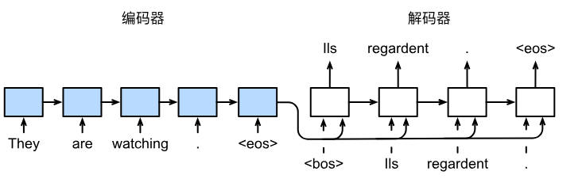

# 门控循环单元(GRU)
- 早期观测值对预测所有未来观测值具有非常重要的意义。我们希望由某些机制能够在一个记忆元里存储重要的早期信息，如果没有这样的机制，我们将不得不给这个观测值指定一个非常大的梯度，因为它会影响所有后续的观测值。
- 一些词元没有相关的观测值。我们希望有一些机制来跳过隐状态表示中的此类词元，
- 序列的各个部分之间存在逻辑上的中断。在这种情况下，最后有一种方法来重置内部状态的表示。

为解决这些问题，最早的方法是长短期记忆网络(LSTM)，门控循环单元(GRU)是一个稍微简化的变体，通常能够提供同等的效果，并且计算的速度明显变快。

我们首先介绍更简单的门控循环单元。

## 门控隐状态
门控循环单元与普通的神经网络之间的关键区别在于：前者支持隐状态的门控。

这意味着模型有专门的机制来确定应该何时更新隐状态，以及应该何时重置隐状态。

### 重置门和更新门
- 重置门允许我们控制“可能还想记住”的过去状态的数量
- 更新门允许我们控制新状态中有多少个旧状态的副本

对于门控循环单元中的重置门和更新门：
- 输入由当前时间步的输入和前一个时间步的隐状态给出
- 输出由使用带有sigmoid激活函数的两个全连接层给出

对于给定的时间步$t$，假设输入是一个小批量$X_t\in R^{n\times d}$，前一个时间步的隐状态是$H_{t-1}\in R^{n\times h}$(样本数$n$，输入数$d$，隐藏单元数$h)$。

那么，重置门$R_t \in R^{n\times h}$和更新门$Z_t\in R^{n\times h}$的计算如下式所示：
$$
R_t = \sigma(X_tW_{xr}+H_{t-1}W_{hr}+b_r) \\
Z_t = \sigma(X_tW_{xz}+H_{t-1}W_{hz}+b_z)
$$
### 候选隐状态
接下来，将重置门$R_t$与常规隐状态更新机制集成，得到在时间步$t$的候选隐状态$\widetilde H_t\in R^{n\times h}$：
$$
\widetilde{H}_t = tanh(X_tW_{xh}+(R_t\odot H_{t-1})W_{hh}+b_h)
$$
其中，$W_{xh}\in R^{d\times h}$和$W_{hh}\in R^{h\times h}$是权重参数，$b_h\in R^{1\times h}$是偏置参数，符号$\odot$是哈达玛积，按元素相乘。

与传统的隐状态相比，$R_t$与$H_{t-1}$的元素相乘可以减少以往状态的影响。
- 当重置门$R_t$中的项接近1时，我们可以得到一个普通的循环神经网络
- 当重置门$R_t$中的项接近0时，候选隐状态是以$X_t$为输入的多层感知机的结果，因此任何预先存在的隐状态都会被重置为默认值

### 隐状态
上述计算结果只是候选隐状态，我们仍然需要结合更新门$Z_t$的效果。

这一步确定新的隐状态$H_t\in R^{n\times h}$在多大程度上来自旧的隐状态$H_{t-1}$和新的候选隐状态$\widetilde{H}_t$。

更新门$Z_t$仅需要在$H_{t-1}$和$\widetilde{H}_t$之间进行按元素的凸组合就可以实现这个目标。

门控循环单元的最终公式为:
$$
H_t = Z_t\odot H_{t-1} + (1-Z_t)\odot \widetilde{H}_t
$$

- 当更新门$Z_t$接近于1时，模型就会倾向只保留旧的隐状态。此时，来自$X_t$的信息基本上被忽略，从而有效地跳过了依赖链中的时间步$t$。
- 相反，当$Z_t$接近0时，新的隐状态$H_t$就会接近候选隐状态$\widetilde{H}_t$.

这些设计可以处理循环神经网络中的梯度消失问题，并更好地捕获时间步很长的序列的依赖关系。

### 总结
- 重置门有助于捕获序列中的短期依赖关系
- 更新们有助于捕获序列中的长期依赖关系

## 从零开始实现
读取数据集：
```
import torch
from torch import nn
from torch.nn import functional as F
from d2l import torch as d2l

import re
import random


d2l.DATA_HUB['time_machine'] = (d2l.DATA_URL+'timemachine.txt','090b5e7e70c295757f55df93cb0a180b9691891a')

def read_time_machine():
    with open(d2l.download('time_machine'), 'r') as f:
        lines = f.readlines()
    return [re.sub('[^A-Za-z]+', ' ', line).strip().lower() for line in lines]

def tokenize(lines, token='word'):
    if token == 'word':
        return [line.split() for line in lines]
    else:
        return [list(line) for line in lines]

import collections


def count_corpus(tokens):
    if len(tokens) == 0 or isinstance(tokens[0], list):
        tokens = [token for line in tokens for token in line]
    return collections.Counter(tokens)

class Vocab:
    def __init__(self, tokens, min_freq=0, reversed_tokens=None):
        if tokens is None:
            tokens = []
        if reversed_tokens is None:
            reversed_tokens = []

        counter = count_corpus(tokens)
        self._token_freqs = sorted(counter.items(), key=lambda x:x[1], reverse=True)

        self.idx_to_token = ['<unk>'] + reversed_tokens
        self.token_to_idx = {token: idx for idx, token in enumerate(self.idx_to_token)}

        for token, freq in self._token_freqs:
            if freq<min_freq:
                break
            if token not in self.token_to_idx:
                self.idx_to_token.append(token)
                self.token_to_idx[token] = len(self.idx_to_token)-1

    def __len__(self):
        return len(self.idx_to_token)

    def __getitem__(self, tokens):
        if not isinstance(tokens, (list, tuple)):
            return self.token_to_idx.get(tokens, self.unk)

        return [self.__getitem__(token) for token in tokens]

    def to_tokens(self, indices):
        if not isinstance(indices, (list, tuple)):
            return self.idx_to_token[indices]
        return [self.idx_to_token[index] for index in indices]

    @property
    def unk(self):
        return 0

    @property
    def token_freqs(self):
        return self._token_freqs

def seq_data_iter_random(corpus, batch_size, num_steps):
    corpus = corpus[random.randint(0, num_steps-1):]
    num_subseqs = (len(corpus)-1)//num_steps # 考虑标签
    initial_indices = list(range(0, num_subseqs*num_steps, num_steps))

    random.shuffle(initial_indices)

    def data(pos):
        return corpus[pos:pos+num_steps]

    num_batchs = num_subseqs//batch_size

    for i in range(0, num_batchs*batch_size, batch_size):
        initial_indices_per_batch = initial_indices[i:i+batch_size]
        X = [data(j) for j in initial_indices_per_batch]
        Y = [data(j+1) for j in initial_indices_per_batch]
        yield torch.tensor(X), torch.tensor(Y)

def seq_data_iter_sequential(corpus, batch_size, num_steps):
    offset = random.randint(0, num_steps)
    num_tokens = ((len(corpus)-offset-1)//batch_size)*batch_size
    Xs = torch.tensor(corpus[offset:offset+num_tokens])
    Ys = torch.tensor(corpus[offset+1:offset+num_tokens+1])
    Xs, Ys = Xs.reshape((batch_size, -1)), Ys.reshape((batch_size, -1))
    num_batchs = Xs.shape[1]//num_steps
    for i in range(0, num_steps*num_batchs, num_steps):
        X = Xs[:, i:i+num_steps]
        Y = Ys[:, i:i+num_steps]
        yield X, Y

def load_corpus_time_machine(max_tokens = -1):
    lines = read_time_machine()
    tokens = tokenize(lines, 'char')
    vocab = Vocab(tokens)
    corpus = [vocab[token] for line in tokens for token in line]
    if max_tokens>0:
        corpus = corpus[:max_tokens]
    return corpus, vocab

class SeqDataLoader:
    def __init__(self, batch_size, num_steps, use_random_iter, max_tokens):
        if use_random_iter:
            self.data_iter_fn = seq_data_iter_random
        else:
            self.data_iter_fn = seq_data_iter_sequential

        self.corpus, self.vocab = load_corpus_time_machine(max_tokens)
        self.batch_size, self.num_steps = batch_size, num_steps

    def __iter__(self):
        return self.data_iter_fn(self.corpus, self.batch_size, self.num_steps)

def load_data_time_machine(batch_size, num_steps,use_random_iter=False, max_tokens = 10000):
    data_iter = SeqDataLoader(batch_size, num_steps, use_random_iter, max_tokens)
    return data_iter, data_iter.vocab

batch_size, num_steps = 32, 35
train_iter, vocab = load_data_time_machine(batch_size, num_steps)
```
### 初始化模型参数
我们从标准差为0.01的高斯分布中提取权重，并将偏置设为0，超参数num_hiddens定义隐藏单元的数量，实例化与更新门、重置门，候选隐状态和输出层相关的所有权重和偏置。
```
def get_params(vocab_size, num_hiddens, device):
    num_inputs = num_outputs = vocab_size

    def normal(shape):
        return torch.randn(size=shape, device=device)*0.01

    def three():
        return (
            normal((num_inputs, num_hiddens)),
            normal((num_hiddens, num_hiddens)),
            torch.zeros(num_hiddens, device=device)
        )

    W_xz, W_hz, b_z = three() # 更新门参数
    W_xr, W_hr, b_r = three() # 重置门参数
    W_xh, W_hh, b_h = three() # 候选隐状态参数

    W_hq = normal((num_hiddens, num_outputs))
    b_q = torch.zeros(num_outputs, device=device)

    params = [W_xz, W_hz, b_z, W_xr, W_hr, b_r, W_xh, W_hh, b_h, W_hq, b_q]

    for param in params:
        param.requires_grad_(True)

    return params
```

### 定义模型
定义隐状态的初始化函数init_gru_state，此函数返回一个形状为(批量大小，隐藏单元数)的张量，张量的值全部为0.
```
def init_gru_state(batch_size, num_hiddens, device):
    return (torch.zeros(size=(batch_size, num_hiddens), device=device), )
```

接下来定义门控循环单元模型，模型的结构与基本的循环神经网络单元是相同的，只是权重更新公式更复杂。
```
def gru(inputs, state, params):
    W_xz, W_hz, b_z, W_xr, W_hr, b_r, W_xh, W_hh, b_h, W_hq, b_q = [param for param in params]
    H, = state
    outputs = []

    for X in inputs:
        Z = torch.sigmoid((X@W_xz)+(H@W_hz)+b_z)
        R = torch.sigmoid((X@W_xr)+(H@W_hr)+b_r)
        H_tilda = torch.tanh((X@W_xh)+((R*H)@W_hh)+b_h)
        H = Z*H+(1-Z)*H_tilda
        Y = (H@W_hq)+b_q
        outputs.append(Y)
    return torch.cat(outputs, dim=0), (H,)
```
创建模型
```
class RNNModelScratch:
    def __init__(self, vocab_size, num_hiddens, device, get_params, init_state, forward_fn):
        self.vocab_size, self.num_hiddens = vocab_size, num_hiddens
        self.params = get_params(vocab_size, num_hiddens, device)
        self.init_state, self.forward_fn = init_state, forward_fn

    def __call__(self, X, state):
        X = F.one_hot(X.T, self.vocab_size).type(torch.float32)
        return self.forward_fn(X, state, self.params)

    def begin_state(self, batch_size):
        return self.init_state(batch_size, num_hiddens, device)

num_hiddens, vocab_size, device = 256, len(vocab), 'cuda:0'

model = RNNModelScratch(vocab_size, num_hiddens, device, get_params, init_gru_state, gru)
```
### 训练与预测
训练过程与之前完全一致：
```
import math

num_epochs, lr = 500, 1

def grad_clipping(params, theta):
    norm = torch.sqrt(sum(torch.sum((p.grad**2)) for p in params))
    if norm>theta:
        for p in params:
            p.grad[:] *= theta/norm

def train_epoch(net, train_iter, loss, updater, device, use_random_iter):
    state = None
    total_loss, n_train = 0, 0
    for X, Y in train_iter:
        if state is None or use_random_iter:
            state = net.begin_state(X.shape[0])
        else:
            if isinstance(net, nn.Module) and not isinstance(state, tuple):
                state.detach_()
            else:
                for s in state:
                    s.detach_()
        y = Y.T.reshape(-1)
        X, y = X.to(device), y.to(device)
        y_hat, state = net(X, state)
        l = loss(y_hat, y).mean()
        updater.zero_grad()
        l.backward()
        grad_clipping(net.params, 1)
        updater.step()

        total_loss += l*y.numel()
        n_train +=y.numel()
    return math.exp(total_loss/n_train)

def predict(prefix, num_preds, net, vocab, device):
    state = net.begin_state(1)
    outputs = [vocab[prefix[0]]]
    get_input = lambda: torch.tensor([outputs[-1]], device=device).reshape((1,1))

    for y in prefix[1:]:
        _, state = net(get_input(), state)
        outputs.append(vocab[y])

    for _ in range(num_preds):
        y, state = net(get_input(), state)
        outputs.append(int(y.argmax(dim=1).reshape(1)))

    return ''.join([vocab.idx_to_token[i]for i in outputs])

def train(net, train_iter, vocab, lr, num_epochs, device, use_random_iter = False):
    loss = nn.CrossEntropyLoss()
    animator = d2l.Animator(xlabel='epoch', ylabel='perplexity', legend=['train'], xlim=[10, num_epochs])

    updater = torch.optim.SGD(net.params, lr=lr)

    pr = lambda prefix:predict(prefix, 10, net, vocab, device)

    for epoch in range(num_epochs):
        ppl = train_epoch(net, train_iter, loss, updater, device, use_random_iter)
        if (epoch+1) % 10 == 0:
            print(pr('time travel'))
            animator.add(epoch+1, [ppl])
```

## 简洁实现
```
'''省略迭代器、词表的获取'''

num_inputs = len(vocab)
num_hiddens = 256
device = 'cuda:0'
gru_layer = nn.GRU(num_inputs, num_hiddens)

class RNNModel(nn.Module):
    def __init__(self, rnn_layer, vocab_size, **kwargs):
        super(RNNModel, self).__init__(**kwargs)
        self.rnn = rnn_layer
        self.vocab_size = vocab_size
        self.num_hiddens = self.rnn.hidden_size
        self.linear = nn.Linear(num_hiddens, self.vocab_size)

    def forward(self, inputs, state):
        X = F.one_hot(inputs.T.long(), self.vocab_size)
        X = X.to(torch.float32)

        Y, state = self.rnn(X, state)

        output = self.linear(Y.reshape((-1, Y.shape[-1])))
        return output, state

    def begin_state(self, device, batch_size):
        return torch.zeros(size=(self.rnn.num_layers, batch_size, self.num_hiddens), device=device)

model = RNNModel(gru_layer, num_inputs)
model = model.to(device)

import math

num_epochs, lr = 500, 1

def grad_clipping(params, theta):
    norm = torch.sqrt(sum(torch.sum((p.grad**2)) for p in params))
    if norm>theta:
        for p in params:
            p.grad[:] *= theta/norm

def train_epoch(net, train_iter, loss, updater, device, use_random_iter):
    state = None
    total_loss, n_train = 0, 0
    for X, Y in train_iter:
        if state is None or use_random_iter:
            state = net.begin_state(device, X.shape[0])
        else:
            if isinstance(net, nn.Module) and not isinstance(state, tuple):
                state.detach_()
            else:
                for s in state:
                    s.detach_()
        y = Y.T.reshape(-1)
        X, y = X.to(device), y.to(device)
        y_hat, state = net(X, state)
        l = loss(y_hat, y).mean()
        updater.zero_grad()
        l.backward()
        grad_clipping(net.parameters(), 1)
        updater.step()

        total_loss += l*y.numel()
        n_train +=y.numel()
    return math.exp(total_loss/n_train)

def predict(prefix, num_preds, net, vocab, device):
    state = net.begin_state(device, 1)
    outputs = [vocab[prefix[0]]]
    get_input = lambda: torch.tensor([outputs[-1]], device=device).reshape((1,1))

    for y in prefix[1:]:
        _, state = net(get_input(), state)
        outputs.append(vocab[y])

    for _ in range(num_preds):
        y, state = net(get_input(), state)
        outputs.append(int(y.argmax(dim=1).reshape(1)))

    return ''.join([vocab.idx_to_token[i]for i in outputs])

def train(net, train_iter, vocab, lr, num_epochs, device, use_random_iter = False):
    loss = nn.CrossEntropyLoss()
    animator = d2l.Animator(xlabel='epoch', ylabel='perplexity', legend=['train'], xlim=[10, num_epochs])

    updater = torch.optim.SGD(net.parameters(), lr=lr)

    pr = lambda prefix:predict(prefix, 10, net, vocab, device)

    for epoch in range(num_epochs):
        ppl = train_epoch(net, train_iter, loss, updater, device, use_random_iter)
        if (epoch+1) % 10 == 0:
            print(pr('time travel'))
            animator.add(epoch+1, [ppl])
train(model, train_iter, vocab, 1, 500, device)
```

# 长短期记忆网络(LSTM)
长期以来，隐变量模型存在着长期信息保存和短期输入缺失的问题。

解决这一问题的最早方法之一是长短期记忆网络。

## 门控记忆元
长短期记忆网络引入了记忆元，或简称为单元。

为了控制记忆元，我们需要许多门：
- 输出门：从记忆元中输出条目
- 输入门：决定何时将数据读入记忆元
- 遗忘门：重置记忆元的内容。

### 输入门、遗忘门和输出门
当前时间步的输入和前一个时间步的隐状态作为数据输入长短期记忆网络的门中，由3个带有sigmoid激活函数的全连接层处理，以计算输入门、遗忘门和输出门的值。

假设有$h$个隐藏单元，批量大小为$n$，输入数为$d$。因此，输入为$X\in R^{n\times d}$，前一个时间步的隐状态为$H_{t-1}\in R^{n\times h}$.

时间步$t$的门定义如下：
$$
输入门：I_t = \sigma(X_tW_{xi}+H_{t-1}W_{hi}+b_i)\\
遗忘门：F_t = \sigma(X_tW_{xf}+H_{t-1}W_{hf}+b_f)\\
输入门：O_t = \sigma(X_tW_{xo}+H_{t-1}W_{ho}+b_o)
$$

### 候选记忆元
因为还没有指定各种门的操作，所以先介绍候选记忆元$\widetilde{C}_t\in R^{n\times h}$.

$$
\widetilde{C}_t=tanh(X_tW_{xc}+H_{t-1}W_{hc}+b_c)
$$

### 记忆元
在GRU中，有一种机制来控制输入和遗忘，类似地，在长短期记忆网络中，也有两个门用于这样的目的：输入门$I_t$控制采用多少来自$\widetilde{C}_t$的新数据，而遗忘门$F_t$控制保留多少过去的记忆元$C_{t-1}\in R^{n\times h}$。

即：
$$
C_t = I_t\odot\widetilde{C}_t + F_t\odot C_{t-1}
$$

### 隐状态

$$
H_t = O_t\odot tanh(C_t)
$$

## 从零开始实现
```
import torch
from torch import nn
from d2l import torch as d2l

batch_size, num_steps = 32, 35
train_iter, vocab = d2l.load_data_time_machine(batch_size, num_steps)
```

### 初始化模型参数
```
def get_lstm_params(vocab_size, num_hiddens, device):
    num_inputs = num_outputs = vocab_size

    def normal(shape):
        return torch.randn(size= shape, device=device)
    def three():
        return (
            normal((num_inputs, num_hiddens)),
            normal((num_hiddens, num_hiddens)),
            torch.zeros(num_hiddens, device=device)
        )

    W_xi, W_hi, b_i = three()
    W_xf, W_hf, b_f = three()
    W_xo, W_ho, b_o = three()
    W_xc, W_hc, b_c = three()

    W_hq = normal((num_hiddens, num_outputs))
    b_q = torch.zeros(num_outputs, device=device)

    params = [W_xi, W_hi, b_i, W_xf, W_hf, b_f, W_xo, W_ho, b_o, W_xc, W_hc, b_c, W_hq, b_q]

    for param in params:
        param.requires_grad_(True)

    return params
```

### 定义模型
在初始化函数中，长短期记忆网络的隐状态需要返回一个额外的记忆元，其值为0，形状为（批量大小，隐藏单元数）。
```
def init_lstm_state(batch_size, num_hiddens, device):
    return (
        torch.zeros(size=(batch_size, num_hiddens), device=device),
        torch.zeros(size=(batch_size, num_hiddens), device=device)
    )
```

实际模型的定义与前文讨论一致，需要注意的是只有隐状态才会传递到输出层，而记忆元不会直接参与输出。

```
def lstm(inputs, state, params):
    [W_xi, W_hi, b_i, W_xf, W_hf, b_f, W_xo, W_ho, b_o, W_xc, W_hc, b_c, W_hq, b_q] = params
    (H, C) = state
    outputs = []

    for X in inputs:
        I = torch.sigmoid(X@W_xi+H@W_hi+b_i)
        F = torch.sigmoid(X@W_xf+H@W_hf+b_f)
        O = torch.sigmoid(X@W_xo+H@W_ho+b_o)
        C_tilde = torch.tanh(X@W_xc+H@W_hc+b_c)
        C = F*C + I*C_tilde
        H = O*torch.tanh(C)
        Y = H@W_hq+b_q
        outputs.append(Y)

    return torch.cat(outputs, dim=0), (H, C)
```
构建网络：
```
vocab_size, num_hiddens, device = len(vocab), 256, 'cuda:0'

class RNNModelScratch:
    def __init__(self, vocab_size, num_hiddens, device, get_params, init_state, forward_fn):
        self.vocab_size, self.num_hiddens, self.device = vocab_size, num_hiddens, device
        self.init_state = init_state
        self.params = get_params(self.vocab_size, self.num_hiddens, self.device)
        self.forward_fn = forward_fn

    def __call__(self, X, state):
        X = F.one_hot(X.T, self.vocab_size).type(torch.float32)
        return self.forward_fn(X, state, self.params)

    def begin_state(self, batch_size):
        return self.init_state(batch_size, self.num_hiddens, self.device)

model = RNNModelScratch(vocab_size, num_hiddens, device, get_lstm_params, init_lstm_state, lstm)
```

### 训练和预测
```
import math


num_epochs, lr = 500, 1

def grad_clipping(net, theta):
    norm = torch.sqrt(sum(torch.sum((p.grad**2))for p in net.params))
    if norm>theta:
        for p in params:
            p.grad[:] *= theta/norm

def train_epoch(net, train_iter, loss, updater, device, use_random_iter):
    state = None
    total_loss, n_train = 0, 0
    for X, Y in train_iter:
        if state is None or use_random_iter:
            state = net.begin_state(X.shape[0])
        else:
            if isinstance(net, nn.Module) and not isinstance(state, tuple):
                state.detach_()
            else:
                for s in state:
                    s.detach_()
        y = Y.T.reshape(-1)
        X, y = X.to(device), y.to(device)
        y_hat, state = net(X, state)
        l = loss(y_hat, y).mean()
        updater.zero_grad()
        l.backward()
        grad_clipping(net, 1)
        updater.step()

        total_loss += l*y.numel()
        n_train +=y.numel()
    return math.exp(total_loss/n_train)

def predict(prefix, num_preds, net, vocab, device):
    state = net.begin_state(1)
    outputs = [vocab[prefix[0]]]
    get_input = lambda: torch.tensor([outputs[-1]], device=device).reshape((1,1))

    for y in prefix[1:]:
        _, state = net(get_input(), state)
        outputs.append(vocab[y])

    for _ in range(num_preds):
        y, state = net(get_input(), state)
        outputs.append(int(y.argmax(dim=1).reshape(1)))

    return ''.join([vocab.idx_to_token[i]for i in outputs])

def train(net, train_iter, vocab, lr, num_epochs, device, use_random_iter = False):
    loss = nn.CrossEntropyLoss()
    animator = d2l.Animator(xlabel='epoch', ylabel='perplexity', legend=['train'], xlim=[10, num_epochs])

    updater = torch.optim.SGD(net.params, lr=lr)

    pr = lambda prefix:predict(prefix, 10, net, vocab, device)

    for epoch in range(num_epochs):
        ppl = train_epoch(net, train_iter, loss, updater, device, use_random_iter)
        if (epoch+1) % 10 == 0:
            print(pr('time travel'))
            animator.add(epoch+1, [ppl])
train(model, train_iter, vocab, 1, 500, device)
```
## 简洁实现
使用高级API，我们可以直接实例化长短期记忆网络模型。
```
num_inputs = vocab_size
lstm_layer = nn.LSTM(num_inputs, num_hiddens)
model = d2l.RNNModel(lstm_layer, len(vocab))
d2l.tran_ch8(model, train_iter, vocab, lr, num_epochs, device)
```

# 深度循环神经网络
## 函数依赖关系
我们可以将深度结构中的函数关系形式化。

假设在时间步$t$有一个小批量的输入数据$X_t\in R^{n\times d}$，同时将第$l$个隐藏层的隐状态设为$H_t^{(l)}\in R^{n\times h}$，输出层变量设为$O_t\in R^{n\times h}$。设置$H_t^{(0)} = X_t$，第$l$个隐藏层的隐状态使用激活函数$\phi_l$，则：
$$
H_t^{(l)} = \phi_l(H_t^{(l)}W_{xh}^{(l)}+H_{t-1}^{(l)}W_{hh}^{(l)}+b_h^{(l)})
$$
最后，输出层的计算仅基于第$l$个隐藏层的最终隐状态：
$$
O_t = H_t^{(L)}W_{hq}+b_q
$$

与MLP意义，隐藏层数$L$和隐藏单元数$h$都是超参数。

另外，用门控循环单元或长短期记忆网络的隐状态来代替上式的隐状态，可以得到深度门控循环神经网络或深度长短期记忆神经网络。

## 简洁实现
以LSTM为例，构建lstm_layer与之前相似，设定输入、隐藏单元数以外，还需设置隐藏层数。
```
lstm_layer = nn.LSTM(num_inputs, num_hiddens, num_layers)
```
# 双向循环神经网络
在序列学习中，我们以往假定的目标是：在给定观测的情况下，对下一个输出进行建模。

虽然这是一个经典场景，但不是唯一的。例如填空题。

## 隐马尔可夫模型中的动态规划
## 双向模型
如果希望在循环神经网络中拥有一种机制，使之能够提供与隐马尔可夫模型类似的前瞻能力，我们就需修改循环神经网络的设计。

增加一个从最后一个词元开始从后向前运行的循环神经网络。

双向循环的神经网络添加了反向传递信息的隐藏层，以便更灵活地处理此类信息。

### 定义
对于任意时间步$t$，给定一个小批量的输入数据$X_t\in R^{n\times d}$，且令该隐藏层激活函数为$\phi$。

在双向架构中，我们设该时间步的前向隐状态和反向隐状态分别为:
$$
H^{\rightarrow}_t=\phi(X_tW_{xh}^{(f)}+H^{\rightarrow}_{t-1}W_{hh}^{(f)}+b_h^{(f)})\\
H^{\leftarrow}_t=\phi(X_tW_{xh}^{(b)}+H^\leftarrow_{t-1}W_{hh}^{(b)}+b_h^{(b)})
$$
接下来，将前向隐状态和反向隐状态连接起来，获得送入输出层的隐状态$H_t$。

在具有多个隐藏层的深度双向循环神经网络中，该信息作为输入传递到下一个双向层。

最后输出层计算得到的输出为$O_t\in R^{n\times q}$。

### 模型的计算成本及其应用
双向循环神经网络的一个关键特性是：使用来自序列两端的信息来估计输出。

我们使用来自过去和未来的观测信息来预测当前的观测。但是对于下一个词元进行预测的去块，这样的模型并不是我们所需的，因为在预测下一个词元时，我们终究无法知道下一个词元的下文是什么，所以将不会得到很高的精度。

具体地说，在训练期间，我们能够利用过去和未来的数据来估计当前空缺的词，在测试期间我们只有过去的数据，因此精确度将会很低。

还有一个严重的问题是，双向循环神经网络的计算速度非常慢。其主要原因是网络的前向传播需要在双向层中进行前向递归和后向递归。

双向层的使用在实践中非常少，并且仅应用于部分场景。

# 机器翻译与数据集
语言模型是自然语言处理的关键，而机器翻译是语言模型最成功的基准测试，因为机器翻译正是将输入序列转换成输出序列的序列转换模型的核心问题。

```
import os
import torch
from d2l import torch as d2l
```
## 下载和预处理数据集
下载“英语-法语”数据集，数据集中的每一行都是制表符。

其中英语是源语言，法语是目标语言。
```
d2l.DATA_HUB['fra-eng'] = (d2l.DATA_URL+'fra-eng.zip','94646ad1522d915e7b0f9296181140edcf86a4f5')

def read_data_nmt():
    data_dir = d2l.download_extract('fra-eng')
    with open(os.path.join(data_dir, 'fra.txt'), 'r', encoding='utf-8')as f:
        return f.read()

raw_text = read_data_nmt()
print(raw_text[:75])
```

下载数据集后，原始文本数据需要经过几个预处理步骤。例如，用空格代替不间断空格，用小写字母代替大写字母，并在单词和标点符号之间插入空格。

```
def preprocess_nmt(text):
    def no_space(char, prev_char):
        return char in set(',.!?') and prev_char !=' '

    text = text.replace('\u202f', ' ').replace('\xa0', ' ').lower()

    out = [' '+char if i>0 and no_space(char, text[i-1])else char for i, char in enumerate(text)]

    return ''.join(out)

text = preprocess_nmt(raw_text)
print(text[:80])
```

## 词元化
在机器翻译中，我们倾向于使用单词级词元化。

实现tokenize_nmt函数，对前num_examples个文本序列对进行词元，其中每个词元要么是一个词，要么是一个标点符号。

此函数返回两个词元列表：source和target。source[i]是源语言第$i$个文本序列的词元号，与之对应的是target[i]。

```
def tokenize_nmt(text, num_examples=None):
    source, target = [], []
    for i, line in enumerate(text.split('\n')):
        if num_examples and i > num_examples:
            break
        parts = line.split('\t')
        if len(parts) == 2:
            source.append(parts[0].split(' '))
            target.append(parts[1].split(' '))
    return source, target

source, target = tokenize_nmt(text)
source[:6], target[:6]
```
## 词表
由于机器翻译数据集由语言对组成，因此我们可以分别为源语言和目标语言构建两个词表。

使用单词级词元化时，词表大小将明显大于使用字符级词元化时的词表大小。

为了缓解这个问题，这里我们将出现次数少于2的低频次元视为相同的未知词元。

持此之外，还指定了额外的特定词元，例如在小批量时用于将序列填充到相同长度的填充词元，以及序列的开始词元和结束词元。

```
import collections

def count_corpus(tokens):
    if len(tokens) == 0 or isinstance(tokens[0], list):
        tokens = [token for line in tokens for token in line]
    return collections.Counter(tokens)

class Vocab:
    def __init__(self, tokens = None, min_freq=0, reversed_tokens=None):
        if tokens is None:
            tokens = []
        if reversed_tokens is None:
            reversed_tokens = []

        counter = count_corpus(tokens)
        self._token_freqs = sorted(counter.items(), key=lambda x:x[1], reverse=True)

        self.idx_to_token = ['unk']+reversed_tokens
        self.token_to_idx = {token: idx for idx, token in enumerate(self.idx_to_token)}

        for token, freq in self._token_freqs:
            if freq<min_freq:
                break
            if token not in self.token_to_idx:
                self.idx_to_token.append(token)
                self.token_to_idx[token] = len(self.idx_to_token)-1

    def __len__(self):
        return len(self.idx_to_token)

    def __getitem__(self, tokens):
        if not isinstance(tokens, (tuple, list)):
            return self.token_to_idx.get(tokens, self.unk)
        return [self.__getitem__(token) for token in tokens]

    def to_token(self, indices):
        if not isinstance(indices, (list, tuple)):
            return self.idx_to_token[indices]
        return [self.to_token(index)for index in indices]

    @property
    def unk(self):
        return 0

    @property
    def token_freqs(self):
        return self._token_freqs

src_vocab = Vocab(source, min_freq=2, reversed_tokens=['<pad>', '<bos>', '<eos>'])
len(src_vocab)
```
## 加载数据集
语言模型的序列样本都有一个固定的长度，这个固定片段是由时间步数决定的。

在机器翻译中，每个样本都是由源和目标组成的文本序列对，其中的每个文本序列可能具有不同的长度。

为了提高计算效率，我们仍然可以通过截断和填充方式实现一次只处理一个小批量的文本序列。

假设同一个小批量中的每个序列都应该具有相同的长度num_steps，那么如果文本序列的词元数少于num_steps，我们将在末尾添加特定的'\<pad\>'词元，直到其长度为num_steps；反之，截断文本序列。

```
def truncate_pad(line, num_steps, padding_token):
    if len(line)>num_steps:
        return line[:num_steps]
    return line+[padding_token]*(num_steps - len(line))

truncate_pad(src_vocab[source[0]], 10, src_vocab['<pad>'])
```

接下来定义一个可以将文本序列转换成小批量数据集用于训练的函数。

我们将特定的'\<eos\>'词元添加到所有序列的末尾，用于表示序列的结束。当模型通过一个词元接一个词元地生成序列进行预测时，生成的'\<eos\>'词元说明完成了序列输出工作。

此外，我们还记录了每个文本序列的长度，统计长度时剔除了填充词元。

```
def build_array_nmt(lines, vocab, num_steps):
    lines = [vocab[l] for l in lines]
    lines = [l+vocab['<eos>'] for l in lines]
    array = torch.tensor([truncate_pad(line, num_steps, vocab['<pad>']) for line in lines])
    valid_len = (array != vocab['<pad>']).type(torch.int32).sum(1)
    return array, valid_len
```

## 数据迭代器
定义load_data_nmt函数来返回数据迭代器，以及源语言和目标语言的两种词表.
```
def load_data_nmt(batch_size, num_steps, num_examples=600):
    text = preprocess_nmt(read_data_nmt())
    source, target = tokenize_nmt(text, num_examples)
    src_vocab = Vocab(source, min_freq=2, reversed_tokens=['<pad>', '<bos>', '<eos>'])
    tgt_vocab = Vocab(source, min_freq=2, reversed_tokens=['<pad>', '<bos>', '<eos>'])

    src_array, src_valid_len = build_array_nmt(source, src_vocab, num_steps)
    tgt_array, tgt_valid_len = build_array_nmt(target, tgt_vocab, num_steps)

    data_arrays = (src_array, src_valid_len, tgt_array, tgt_valid_len)
    data_iter = d2l.load_array(data_arrays, batch_size)
    return data_iter, src_vocab, tgt_vocab
```

# 编码器-解码器结构
机器翻译是序列转换模型的一个核心问题，其输入和输出都是长度可变的序列。

为了处理这种类型的输入和输出，我们可以设计一个包含两个主要组件的架构。

- 第一个组件是一个编码器，接收一个长度可变的序列作为输入，并将其转换为固定形态的编码状态
- 第二个组件时解码器，将固定形状的编码状态映射到长度可变的序列。

这被称为编码器-解码器结构。

## 编码器接口
在编码器接口，我们只指定长度可变的序列作为编码器的输入X.
```
from torch import nn

class Encoder(nn.Module):
    def __init__(self, **kwargs):
        super(Encoder, self).__init__(**kwargs)

    def forward(self, X, *args):
        raise NotImplementedError
```
## 解码器接口
在下面的解码器接口中，新增一个init_state函数，用于将编码器的输出转换为编码后的状态。
```
class Decoder(nn.Module):
    def __init__(self, **kwargs):
        super(Decoder, self).__init__(**kwargs)

    def init_state(self, enc_outputs, *args):
        raise NotImplementedError

    def forward(self, X, state):
        raise NotImplementedError
```
## 合并编码器和解码器
总而言之，编码器-解码器结构包含了一个编码器和一个解码器，并且还拥有可选的额外参数。

在前向传播过程中，编码器的输出用于生成编码状态，这个状态又被解码器作为其输入的一部分。

```
class EncoderDecoder(nn.Module):
    def __init__(self, encoder, decoder, **kwargs):
        super(EncoderDecoder, self).__init__(**kwargs)
        self.encoder = encoder
        self.decoder = decoder

    def forward(self, enc_X, dec_X, *args):
        enc_outputs = self.encoder(enc_X, *args)
        dec_state = self.decoder.init_state(enc_outputs, *args)
        return self.decoder(dec_X, dec_state)
```
# 序列到序列学习
本节，我们将使用两个循环神经网络的编码器和解码器，并将其应用于序列到序列类的任务。

遵循编码器-解码器架构的设计原则，循环神经网络编码器使用长度可变的序列作为输入，将其转换为固定形态的隐状态。

换言之，输入序列的信息被编码到循环神经网络编码器的隐状态中。

为了连续生成输出序列的词元，独立的循环神经网络解码器是基于输入序列的编码信息和输出序列可见的或者生成的词元来预测下一个词元。



```
import collections
import math
import torch
from torch import nn
from d2l import torch as d2l
```
## 编码器
从技术上讲，编码器将长度可变的输入序列转换成固定形状的上下文变量$c$，并且将输入序列的信息在该上下文变量中进行编码。

考虑由一个序列组成的样本，假设输入序列是$x_1, x_2, \dots, x_T$，其中$x_t$是输入文本序列中第$t$个词元。

在时间步$t$，循环神经网络将词元$x_t$的输入特征向量$x_t$和$h_{t-1}$转换为$h_t$。即：
$$
h_t = f(x_t, h_{t-1})
$$
总之，编码器通过选定的函数$q$，将所有时间步的隐状态转换为上下文变量：
$$
c = q(h_1, \dots, h_T)
$$
到目前为止，使用的是一个单向循环神经网络来设计编码器，其中隐状态只依赖输入子序列，这个子序列为输入序列的开始位置到隐状态所在的时间步的位置（包含）。

我们也可以使用双向循环神经网络构建编码器，其中隐状态依赖两个输入子序列：
- 隐状态所在的时间步的位置之前的序列
- 隐状态所在的时间步的位置之后的序列（包含）

在循环神经网络的编码器实现中，将使用嵌入层来获得输入序列中每个词元的特征向量。

嵌入层的权重是一个矩阵，其行数等于输入词表的大小，其列数等于特征向量的维度。

对于任意输入词元的索引$i$，嵌入层获取权重矩阵的第$i$行，以返回其特征向量。

另外，这里选择了一个多层门控循环单元来实现编码器。
```
class Seq2SeqEncoder(Encoder):
    def __init__(self, vocab_size, embed_size, num_hiddens, num_layers, dropout = 0, **kwargs):
        super(Seq2SeqEncoder, self).__init__(**kwargs)
        self.embedding = nn.Embedding(vocab_size, embed_size)
        self.rnn = nn.GRU(embed_size, num_hiddens, num_layers, dropout = dropout)

    def forward(self, X, *args):
        X = self.embedding(X) # 形状更新为(batch_size, num_steps, embed_size)
        # 在循环神经网络中，第一个轴对应于时间步
        X = X.permute(1, 0, 2)
        # 如果没有提及state，默认为0
        output, state = self.rnn(X)

        # state[0]的形状为(num_layers, batch_size, num_hiddens)
        return output, state
```
计算过程分析：

使用一个两层门控循环单元编码器，其隐藏单元数为16.给定一个小批量的输入序列X，在完成所有时间步后，最后一层的隐状态是一个张量，其形状为(时间步数，批量大小，隐藏单元数)；最后一个时间步的多层隐状态的形状为(隐藏层数，批量大小，隐藏单元数)。

```
encoder = Seq2SeqEncoder(10, 8, 16, 2)
encoder.eval()
X = torch.zeros(size=(4, 7), dtype=torch.long)
output, state = encoder(X)

output.shape

state.shape
```
## 解码器
正如上文所提到的，编码器输出的上下文变量$c$对整个输入序列$x_1,\dots, x_T$进行编码。

来自训练数据集的输出序列$y_1, y_2, ..., y_T$，对于每个时间步$t'$(与输入序列或编码器的时间步不同)，解码器输出$y_{t'}$的概率取决于之前的输出子序列$y_1, y_2, ..., y_{t'-1}$和上下文变量$c$。

为了在序列上模型化这种条件概率，我们可以使用另一个循环神经网络作为编码器。

在输出序列上的任意时间步$t'$，循环神经网络将来自上一个时间步的输出$y_{t'-1}$和上下文变量$c$作为其输入，然后在当前时间步将它们和上一个隐状态$s_{t'-1}$转换为隐状态$s_{t'}$。

因此，可以使用函数$g$来表示解码器的隐藏层的变换：
$$
s_{t'} = g(y_{t'-1}, c, s_{t'-1})
$$

在获得解码器的隐状态之后，我们可以使用输出层和softmax操作来计算在时间步$t'$时输出$y_{t'}$的条件概率分布$P(y_{t'}|y_1,\dots, y_{t'-1}, c)$.

此处实现解码器时，我们直接使用编码器最后一个时间步的隐状态来初始化解码器的隐状态。

同时，为了进一步包含经过编码的输入序列的信息，上下文变量在所有的时间步与解码器的输入进行连接。

为了预测输出词元的概率分布，在循环神经网络解码器的最后一层使用全连接层来变换隐状态。

```
class Seq2SeqDecoder(Decoder):
    def __init__(self, vocab_size, embed_size, num_hiddens, num_layers, drop_out=0, **kwargs):
        super(Seq2SeqDecoder, self).__init__(**kwargs)
        self.embedding = nn.Embedding(vocab_size, embed_size)
        self.rnn = nn.GRU(embed_size+num_hiddens, num_hiddens, num_layers, dropout=drop_out)
        self.dense = nn.Linear(num_hiddens, vocab_size)

    def init_state(self, enc_outputs, *args):
        return enc_outputs[1]

    def forward(self, X, state):
        X = self.embedding(X).permute(1, 0, 2)
        context = state[-1].repeat(X.shape[0],1 ,1)
        X_and_context = torch.cat((X, context), 2)
        output, state = self.rnn(X_and_context, state)
        output = self.dense(output).permute(1, 0, 2)
        return output, state
```
## 损失函数
在每个时间步，解码器预测了输出词元的概率分布。类似于语言模型，可以使用softmax来获得分布，并通过计算交叉熵损失函数来进行优化。

但由于未来使不同长度的序列可以以相同形状的小批量加载，我们在序列末尾填充了特定词元。这一部分的填充词元的预测在损失函数的计算中剔除。

为此，我们可以使用下面的sequence_mask函数通过零值化屏蔽不相干的项，以便后面任何不相干的预测的计算都是与0相乘。

```
def sequence_mask(X, valid_len, value=0):
    maxlen = X.size(1)
    mask = torch.arange((maxlen), dtype=torch
    .float32, device=X.device)[None, :]<valid_len[:, None]
    X[~mask] = value
    return X
```
通过扩展softmax交叉熵损失函数来屏蔽不相关的预测。最初所有预测词元的掩码都设置为1.一旦给定了有效长度，与填充词元对于的掩码将被设置为0.最后，将所有词元的损失乘以掩码，以过滤掉损失中填充词元产生的不相干预测。
```
class MaskedSoftmaxCELoss(nn.CrossEntropyLoss):
    # pred.shape (batch_size, num_steps, vocab_size)
    # label.shape (batch_size, num_steps)
    # valid_len.shape (batch_size, )
    def forward(self, pred, label, valid_len):
        weights = torch.ones_like(label);
        weights = sequence_mask(weights, valid_len)
        self.reduction = 'none'
        unweighted_loss = super(MaskedSoftmaxCELoss, self).forward(pred.permute(0, 2, 1), label)
        weighted_loss = (unweighted_loss*weights).mean(dim=1)
        return weighted_loss
```
## 训练
在下面的循环训练过程中，特定的序列开始词元和原始的输出序列连接在一起作为解码器的输入。这被称为强制教学，因为原始的输出序列被送入解码器，或者将来自上一个时间步的预测得到的词元作为解码器的当前输入。
```
def train_seq2seq(net, data_iter, lr, num_epochs, tgt_vocab, device):
    def xavier_init_weight(m):
        if type(m) == nn.Linear:
            nn.init.xavier_uniform_(m.weight)
        if type(m) == nn.GRU:
            for param in m._flat_weights_names:
                if "weight" in param:
                    nn.init.xavier_uniform_(m._parameters[param])

    net.apply(xavier_init_weight)
    net.to(device)

    optimizer = torch.optim.Adam(net.parameters(), lr=lr)
    loss = MaskedSoftmaxCELoss()
    net.train()
    animator = d2l.Animator(xlabel='epoch', ylabel='loss', xlim=[10, num_epochs])

    for epoch in range(num_epochs):
        metric = d2l.Accumulator(2)
        for batch in data_iter:
            optimizer.zero_grad()
            X, X_valid_len, Y, Y_valid_len = [x.to(device)for x in batch]
            bos = torch.tensor([tgt_vocab['<bos>']]*Y.shape[0], device=device).reshape(-1, 1)
            dec_input = torch.cat([bos, Y[:, :-1]], 1)
            Y_hat, _ = net(X, dec_input, X_valid_len)
            l = loss(Y_hat, Y, Y_valid_len)
            l.sum().backward()
            d2l.grad_clipping(net, 1)
            num_tokens = Y_valid_len.sum()
            optimizer.step()
            with torch.no_grad():
                metric.add(l.sum(), num_tokens)
        if (epoch+1)%10==0:
            animator.add(epoch+1, (metric[0]/metric[1]))
    print(f'loss{metric[0]/metric[1]:.3f}')
```
训练参数如下：
```
embed_size, num_hiddens, num_layers, dropout = 32, 32, 2, 0.1
batch_size, num_steps = 64, 10
lr, num_epochs, device = 0.005, 300, d2l.try_gpu()

train_iter, src_vocab, tgt_vocab = d2l.load_data_nmt(batch_size, num_steps)
encoder = Seq2SeqEncoder(len(src_vocab), embed_size, num_hiddens, num_layers, dropout)
decoder = Seq2SeqDecoder(len(tgt_vocab), embed_size, num_hiddens, num_layers, dropout)
net = d2l.EncoderDecoder(encoder, decoder)
train_seq2seq(net, train_iter, lr, num_epochs, tgt_vocab, device)
```
## 预测序列的评估
我们可以通过与真实的标签序列进行比较来评估预测序列。

原则上讲，对于预测序列中的任意n元语法，都可以使用BLEU评估这个n元语法是否出现在标签序列中。

BLEU定义如下：
$$
exp(min(0, 1-\frac{len_{label}}{len_{pred}}))\prod_{n=1}^kp_n^{1/2^n}
$$
其中，$len_{label}$表示标签序列中的词元数，$len_{pred}$表示预测序列中的词元数，$k$是用于匹配最长的$n$元语法。$p_n$表示$n$元语法的精确率，是两个数量的比值：第一个是预测序列与标签序列中匹配的$n$元语法的数量，第二个是预测序列中$n$元语法的数量。

```
def bleu(pred_seq, label_seq, k):
    pred_tokens, label_tokens = pred_seq.split(' '), label_seq.split(' ')
    len_pred, len_label = len(pred_tokens), len(label_tokens)
    score = math.exp(min(0, 1-len_pred/len_label))
    for n in range(1, k+1):
        num_matches, label_subs = 0, collections.defaultdict(int)
        for i in range(len_label-n+1):
            label_subs[' '.join(label_tokens[i:i+n])]+=1
        for i in range(len_pred - n+1):
            if label_subs[' '.join(pred_tokens[i:i+n])]>0:
                num_matches+=1
                label_subs[' '.join(pred_tokens[i:i+n])] -= 1
        score *= math.pow(num_matches/(len_pred-n+1), math.pow(0.5, n))
    return score
```

预测过程使用predict_seq2seq即可，略。
