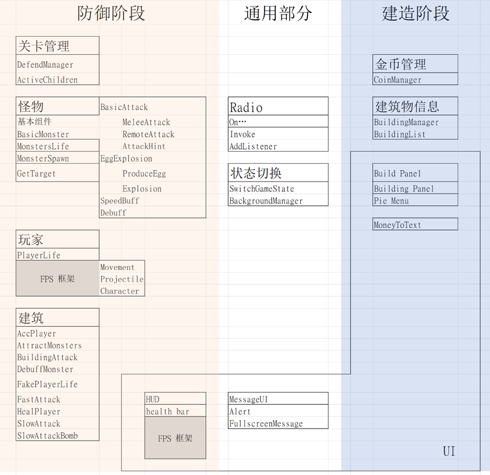

组队完成，本人实现了怪物寻路、攻击，FPS插件使用，建筑建造，建筑功能等内容。

<iframe src="https://player.bilibili.com/player.html?bvid=BV1ipVWepEqb&page=1" scrolling="no" border="0" frameborder="no" framespacing="0" allowfullscreen="true" width=100% height=500> </iframe>

代码结构如下：

