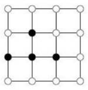
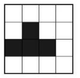
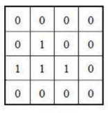
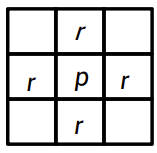
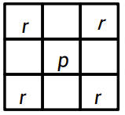
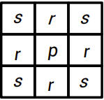
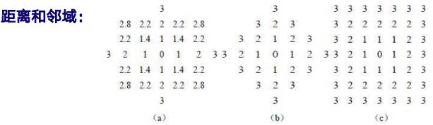

---
title: "计算机视觉（一）"
description: "计算机视觉绪论与数字图像基础概念"
date: "2024-03-03 13:22:32"
category: "AI / 深度学习"
originalCategory: "杂七杂八"
track: "AI / Deep Learning"
level: foundation
status: ready
published: true
minutes: 5
order: 1000
prerequisites: []
tags: ["cv", "AI"]
photos: "banner.jpg"
source: "_posts"
---# 计算机视觉
## 视觉
- 视觉是人类观察世界、认知世界的重要功能手段
- 视觉可进一步分为视感觉和视知觉
- 视觉的最终目的从狭义上说是要能对客观场景做出对观察者有意义的解释和描述
### 视感觉的主要研究内容
- 光的物理特性
- 光刺激视觉感受器官的程度
- 光作用于视网膜后经视觉系统加工而产生的感觉
### 视知觉
- 视知觉主要论述人们从客观世界接收到视觉刺激后如何反应及反应所采用的方式
- 视知觉是在神经中枢进行的一组活动，把视野中一些分散的刺激加以组织，构成具有一定形状的整体以认识世界

## 计算机视觉概述
计算机视觉是指用计算机实现人类的视觉功能

主要研究方法：
- 仿生学的方法
- 工程的方法

主要研究目标：
- 建立计算机视觉系统来完成各种视觉任务
- 加深对人脑视觉机理的掌握和理解

### 相关学科
- 图像理解
- 机器视觉
- 模式识别
- 人工智能
- 计算机图形学

# 图像基础
## 图像
图像：辐射强度模式的空间分布

图像表达函数：辐射能量在空间分布的函数

通用图像表达函数：$T(x, y, z, t, \lambda)$

模拟图像（连续图像）：从连续的客观场景直接观察到用一个2D数组$f(x,y)$来表示

数字图像：把连续的模拟图像在坐标空间XY和性质空间F都离散化了的图像

## 图像表达和显示
### 图像表达
- 矩阵表达
- 矢量表达

### 图像显示
- 离散点集

- 覆盖区域

- 矩阵表达

## 图像存储
### 图像存储器
- 处理过程中使用的快速存储器，如内存
- 可以较快地重新调用的在线或联机存储器，如磁盘
- 不经常使用的数据库存储器，如磁带和光盘
### 图像文件格式
- BMP格式
- GIF格式
- TIFF格式
- JPEG格式

## 像素间联系
### 像素邻域
- 4-邻域：$N_4(p)$

- 对角邻域：$N_D(p)$

- 8-邻域：$N_8(p)$

相关概念
- 邻接：对两个像素p和q来说，如果q在p的邻域中，则称p和q满足邻接关系
- 连接：p和q邻接且灰度值均满足某个特定的相似准则
- 连通、通路：p和q不（直接）邻接，但均在另一个像素的相同邻域中，且这3个像素的灰度值均满足某个特定的相似准则
- 图像子集S：某些像素结合组成图像的子集合。子集同样具有邻接，连接关系
- 连通组元：对S中的任一个像素p，所有与p连通且又在S中的像素集合（含p）合起来构成S中的一个连通组元

### 像素间距离
距离度量函数：
- $D(p,q)\geq 0$，等于0的情况只存在于$p=q$的时候
- $D(p,q)=D(q,p)$
- $D(p,r)\leq D(p,q)+D(q,r)$

像素间距离公式：$p(x,y), q(s,t)$
- 欧式距离：$D_E(p,q)=[(x-s)^2+(y-t)^2)]^{\frac{1}{2}}$
- 城区距离：$D_4(p,q)=|x-s|+|y-t|$
- 棋盘距离：$D_8(p,q)=max(|x-s|,|y-t|)$

范数：
$$
||f||_w = (\int |f(x)|^wdx)^{\frac{1}{w}}\\
||v||_w = (|v_1|^w+|v_2|^w+...+|v_d|^w)^{\frac{1}{w}}
$$

像素p的4-邻域：
$$
N_4(p) = {r|D_4(p,r)=1}
$$

像素p的8-邻域：
$$
N_8(p) = {r|D_8(p,r)=1}
$$

距离变换：距离变换描述的是图像中像素点与某个区域块的距离，区域中的像素点值为0，临近区域块的像素点的值较小，离它越远值越大；把二值图像变换为灰度图像。

距离变换的结果与两个像素的相对位置有关，而与两个像素的灰度值无关

等距离轮廓$\Delta_i(r)$给出了与中心像素的某种距离小于或等于某个值的像素组成的图案；#$[\Delta_i(r)]$表示除去中心像素的后的$\Delta_i(r)$的像素集合

#$[\Delta_4(r)] = 4\sum_{j=1}^rj = 4(1+2+..+r) = 2r(r+1)$

#$[\Delta_8(r)] = 8\sum_{j=1}^rj = 8(1+2+..+r) = 4r(r+1)$
