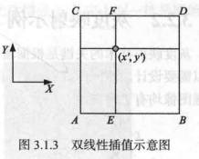
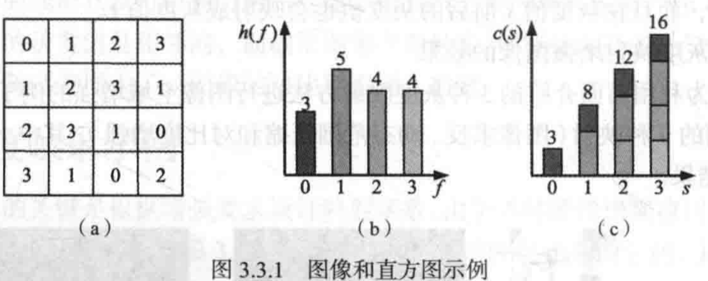
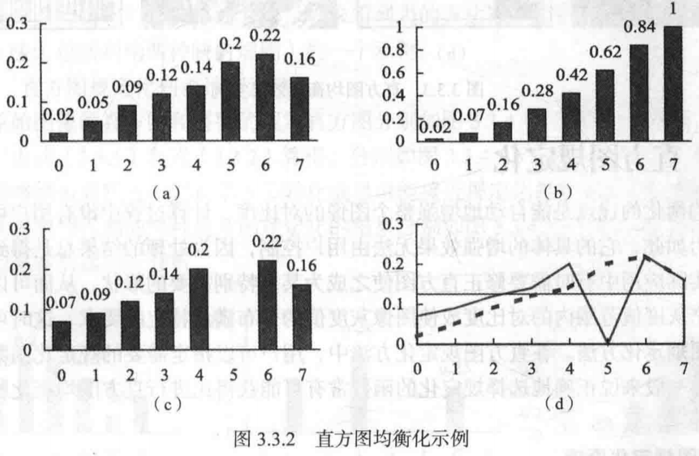
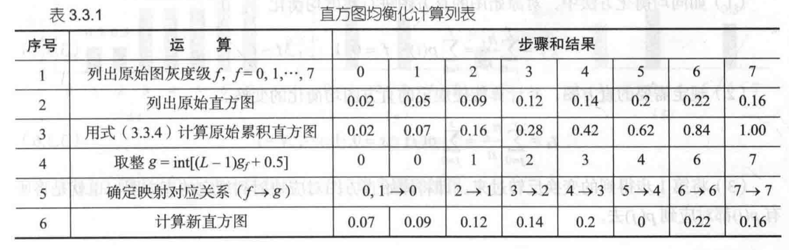
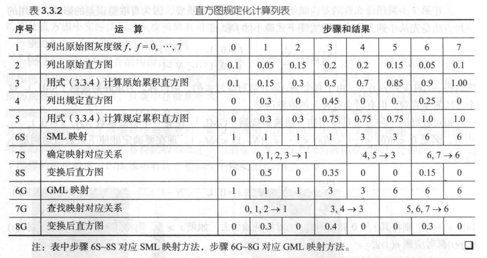
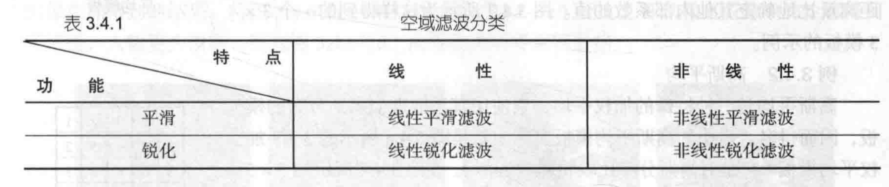

---
title: "计算机视觉（二）"
description: "图像预处理"
date: "2024-03-09 10:29:26"
category: "AI / 深度学习"
originalCategory: "杂七杂八"
track: "AI / Deep Learning"
level: foundation
status: ready
published: true
minutes: 8
order: 1000
prerequisites: []
tags: ["AI", "cv"]
photos: "banner.jpg"
source: "_posts"
---# 坐标变换
对图像的坐标变换实际上是对像素坐标的空间位置变换，变换的结果是改变了像素在图像中的分布和关系。

## 基本坐标变换
### 变换的表达
图像平面上一个像素的坐标可记为$(x, y)$，如使用齐次坐标，则记为$(x,y,1)$，也可写成矢量形式$[x\quad y\quad 1]^T$。

一般的坐标变换可借助矩阵形式写为：
$$
v' = Av
$$

$A$是一个具有如下形式的$3\times 3$变换矩阵：
$$
A = \begin{bmatrix}
    a_{11} \quad a_{12} \quad a_{13} \\
    a_{21} \quad a_{22} \quad a_{23} \\
    a_{31} \quad a_{32} \quad a_{33}
\end{bmatrix}
$$

每种变换有其独特的变换矩阵。对不同的变换，其变换矩阵可以唯一地确定变换的结果。

### 平移变换
平移变换改变像素的位置。设用平移量$(x_0, y_0)$将坐标$(x, y)$的像素平移到新的位置$(x', y')$，这个平移可用矩阵形式写为：
$$
\begin{bmatrix}
    x'\\y'\\1
\end{bmatrix} = \begin{bmatrix}
    1\quad 0\quad x_0\\
    0\quad 1\quad y_0\\
    0\quad 0\quad 1
\end{bmatrix} \begin{bmatrix}
    x\\y\\1
\end{bmatrix}
$$
平移变换矩阵即为：
$$
\begin{bmatrix}
    1\quad 0\quad x_0\\
    0\quad 1\quad y_0\\
    0\quad 0\quad 1
\end{bmatrix}
$$

### 尺度变换
尺度变换又称缩放变换，它改变像素间的距离，对物体来说则改变了物体的尺度。

尺度变换矩阵为：
$$
S = \begin{bmatrix}
    S_x\quad 0 \quad 0\\
    0\quad S_y\quad 0\\
    0\quad 0\quad 1
\end{bmatrix}
$$

当$S_x, S_y$不为整数时，原图像中的有些像素在尺度变换后的坐标值可能不为整数，导致变换后图像中出现孔，此时需要进行取整操作和插值操作。

### 旋转变换
旋转变换改变像素间的相对方位。如果定义顺时针旋转为正，则旋转变换的矩阵可写为：
$$
R = \begin{bmatrix}
    cos\theta\quad sin\theta \quad 0\\
    -sin\theta\quad cos\theta \quad 0 \\
    0\quad 0\quad 1
\end{bmatrix}
$$
### 变换级连
多个基本的坐标变换可以级连起来进行。连续的多个变换可借助矩阵的相乘最后用一个单独的$3\times 3$变换矩阵来表示。

## 几何失真校正
在许多实际的图像采集过程中，图像中像素之间的空间关系会发生变化，这时可以说图像产生了几何失真或几何畸变。

对图像的几何失真校正主要包括两个步骤：
1. 空间变换：对图像平面上的像素进行重新排列可以恢复像素原来的空间关系
2. 灰度插值：对空间变换后的像素赋予相应的灰度值以恢复原位置的灰度值

### 空间变换
失真图像$g(x', y')$的坐标是$(x', y')$，已不是原坐标。

上述变化在一般情况下可表示为：
$$
x' = s(x,y)\\
y' = t(x,y)
$$
其中$s(x,y), t(x,y)$代表产生几何失真图像的两个空间变换函数。

线性失真时可写为：
$$
s(x, y) = k_1x+k_2y+k_3\\
t(x, y) = k_4x+k_5y+k_6
$$

对于一般的（非线性）二次失真，可写为：
$$
s(x, y) = k_1+k_2x+k_3y+k_4x^2+k_5xy+k_6y^2\\
t(x, y) = k_7+k_8x+k_9y+k_{10}x^2+k_{11}xy+k_{12}y^2
$$

在实际中通常不知道失真情况的解析表达，为此需要先在恢复过程的输入图和输出图上找一些确切知道的点，然后利用这些点根据失真模型计算出失真函数中的各个系数，从而建立两幅图像间其他像素空间位置的对应关系。

### 灰度插值
尽管实际图像中的$(x,y)$总是整数，但是空间变换后算得的坐标值一般不是整数。

失真图的像素灰度值仅在像素坐标为整数处有定义，而非整数处的像素灰度值就要用其周围一些整数处的像素灰度值来计算，这叫灰度插值。

灰度赋值可用不同的插值方法实现。

最简单的是最近邻插值，也称为零阶插值，就是将离目标点最近的像素的灰度值作为目标点的灰度值赋给原图像素点。

为提高精度，可采用双线性插值，利用$(x',y')$的最近4个邻像素的灰度值来计算$(x',y')$点处的灰度值。

假设A，B，C，D的坐标分别为$(i,j),(i+1,j),(i,j+1),(i+1,j+1)$，灰度值分别为$g(A),g(B),g(C),g(D)$。

首先计算E和F这两个点的灰度值：
$$
g(E) = (x'-i)[g(B) - g(A)]+g(A)\\
g(F) = (x'-i)[g(D) - g(C)]+g(C)
$$

则$(x', y')$点的灰度值$g(x',y')=(y'-j)[g(F)-g(E)]+g(E)$

# 灰度映射
## 灰度映射原理
灰度映射是一种基于图像像素的点操作，可以原地完成。

它通过对原始图像中的每个像素赋予一个新的灰度值来增强图像。

具体方法是根据增强的目的设计某种映射规则，并用相应的映射函数来表示。对原始图像中的每个像素都用映射函数将其原来的灰度值$s$转换为另一灰度值$t$输出。
$$
t = T(s)
$$
## 灰度映射示例
灰度映射技术的关键是根据增强要求设计映射函数，

设增强图像与原始图像均有$L$种灰度。
### 图像求反
将原图的灰度值翻转，使黑变白，使白变黑，

具体映射时，对图像中的每个像素，将其灰度值$s$根据映射曲线映射为$t$.
$$
t = (L-1)-s
$$

这里的映射是一对一的，每一种灰度都映射为另一种灰度。

### 动态范围压缩
实际应用中，有时原图的灰度动态范围太大，超出了某些显示设备的允许范围。

由于原图的灰度动态范围大于显示设备的允许范围，使得原图一些灰度级显示不出来。

解决的办法是对原图进行灰度压缩。一种常用的压缩方法是借助对数形式的映射函数。
$$
t = Clog(1+|s|)
$$

其中$C$为尺度比例函数。

### 对比度增强
将图像灰度分阶段量化成较少的级数，这样可在保持原图动态范围的基础上，减少灰度级数，即减少表示灰度所需的比特数，从而获得数据量压缩的效果。

这里的映射是多对一的，不仅一个灰度值$s$会映射呈灰度值$t$，而且在灰度值$s$附近的灰度值也会映射成$t$

# 直方图修正
直方图是对图像的一种抽象表示方式。借助于对图像直方图的修改或变换，可以改变图像像素的灰度分布，从而到达对图像进行增强的目的。

## 直方图均衡化
直方图均衡化是一种典型的通过对图像的直方图进行修正来获得图像增强效果的自动方法。

### 直方图和累计直方图
直方图是通过对图像的统计得到的。对一幅灰度图像，其灰度直方图反映了该图中不同灰度级出现的统计情况。

严格地说，图像的灰度直方图是一个$1-D$的离散函数，可写成：
$$
h(f) = n_f \quad f = 0,1,...,L-1
$$
式中$n_f$是图像$f(x,y)$中具有灰度值$f$的像素个数。

图像的灰度累计直方图也是一个$1-D$的离散函数，可写成：
$$
c(f) = \sum_i{i=0}^fn_i\quad f=0,1,..,L-1
$$

### 直方图均衡化原理
直方图均衡化主要用于增强动态范围偏小的图像的反差。

这个方法的基本思想是把原始图像的直方图变换为在整个灰度范围内均匀分布的形式，这样就增加了像素灰度值的动态范围，从而达到增强图像整体对比度的效果。

$$
p(f) = n_f/n \quad f=0,1,..,L-1
$$

$p(f)$给出了对$f$出现概率的估计。

直方图均衡化的基本思想是把原始直方图变换为均匀形式，这里需要确定一个变换函数，也就是增强函数，这个增强函数需要满足两个条件。
1. 它在$0\leq f \geq L-1$范围内是一个单值单增函数，这是为了保证原图各灰度级在变换后仍保持原来从黑到白的排列次序
2. 如果设均衡化的图像为$g(x,y)$，则对$0\leq f\leq L-1$应有$0\leq g \leq L-1$，这个条件保证变换前后图像的灰度值动态范围是一致的

从$f$到$g$的变换为：
$$
g_f = \sum_{i=1}^f\frac{n_i}{n} = \sum_{i=0}^fp(i) \quad f=0,1,...,L-1
$$

## 直方图规定化
直方图均衡化的优点是自动地增强整个图像的对比度，计算过程中没有用户可以调整的参数。

在直方图规定化方法中，用户可以指定需要的规定化函数来得到特殊的增强功能。

### 直方图规定化原理
设原始图像与规定图像中的灰度级数为$M$和$N$，

直方图规定化方法主要有三个步骤：
1. 如同均衡化方法中，对原始图的直方图进行灰度均衡化：$g_f = \sum_{i=1}^f\frac{n_i}{n} = \sum_{i=0}^fp(i) \quad f=0,1,...,M-1$
2. 规定需要的直方图，并计算能使规定的直方图均衡化的变换：$t_s = \sum_{j=0}^s\frac{n_j}{n}=\sum_{j=0}^sp(j)\quad s=0,1,..,N-1$
3. 将第一步得到的变换反转过来，即将原始直方图对应映射到规定的直方图，也就是将所有$p(i)$都对应到$p(j)$去。
   - 单映射规则（SML）
   - 组映射规则（GML）

# 空域滤波
空域滤波是指利用像素及像素邻域组成的空间进行图像增强的方法。
## 原理和分类
空域滤波是在图像空间通过邻域操作完成的。邻域操作借助模板运算来实现。

### 模板运算
模板是实现空域滤波的基本工具。

模板运算的基本思路是赋予某个像素的值作为它本身灰度值和其相邻像素灰度值的函数。

模板运算最常用的是模板卷积。

详见：[卷积](https://daydreamerh.github.io/2024/03/06/%E5%8D%B7%E7%A7%AF%E7%A5%9E%E7%BB%8F%E7%BD%91%E7%BB%9C/)

### 技术分类

## 线性平滑滤波
线性滤波可用模板卷积实现，线性平滑滤波所用卷积模板的系数均为正值。

### 邻域平均
最简单的平滑滤波是用一个像素邻域平均值作为滤波结果，即邻域平均。

### 加权平均
对同一尺寸的模板，可对不同位置的系数采用不同的数值，即加权平均。

## 线性锐化滤波
线性锐化滤波也可以用模板卷积来实现，但所用模板与线性平滑滤波的所用不同。

线性锐化滤波的模板仅中心系数为正，而周围的系数均为负值。

## 非线性平滑滤波
利用非线性锐化滤波可在消除图像中噪声的同时较好地保持图像中的细节。

中值滤波的计算过程：
1. 将模板在图中漫游，并将模板中心与图中某个像素位置重合
2. 读取模板下各对应像素的灰度值
3. 将这些灰度值从小到大排成一列
4. 找出这些灰度值里面排在中间的一共
5. 将这个中间值赋予给对应模板中心位置的像素

## 非线性锐化滤波
非线性锐化滤波常借助对图像微分结果的非线性组合来设计和构造。
